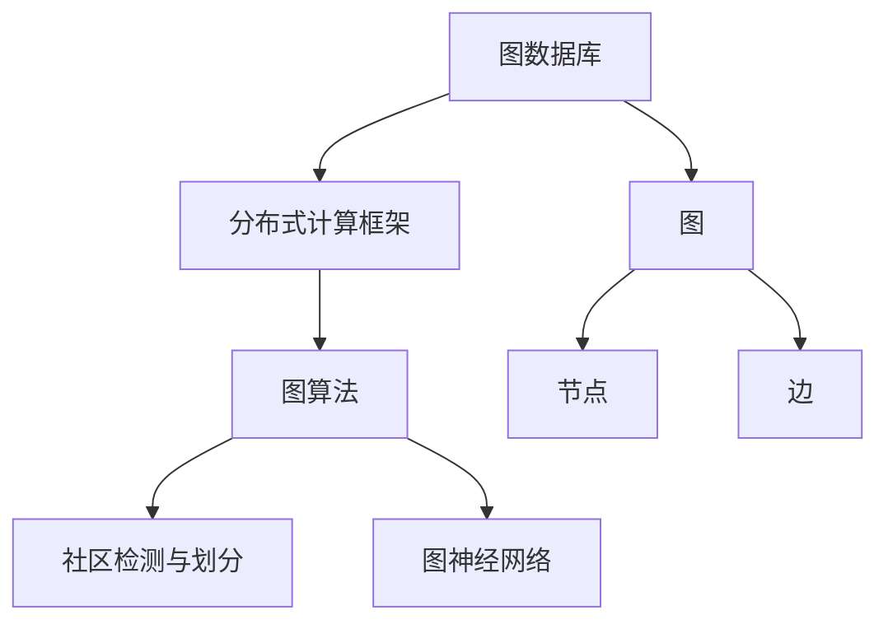
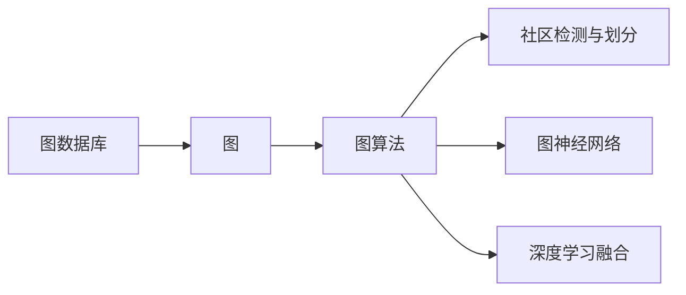
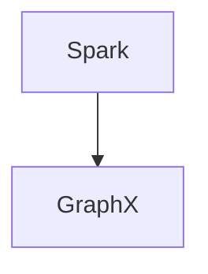
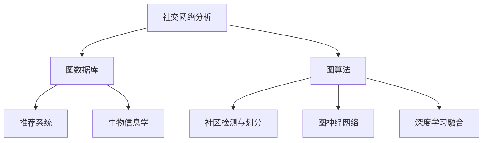
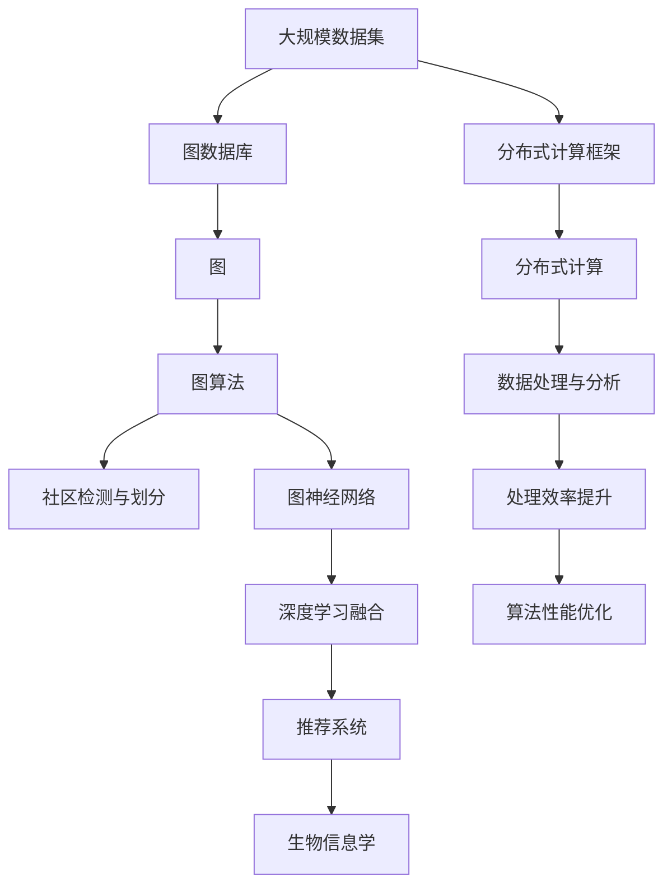

                 

# GraphX原理与代码实例讲解

> 关键词：
- GraphX
- 图计算
- 图算法
- 分布式计算
- 社区检测
- 图神经网络
- 深度学习

## 1. 背景介绍

### 1.1 问题由来

随着数据量规模的爆炸性增长和数据结构的复杂化，传统的关系型数据库已经难以满足日益增长的数据处理需求。与此同时，图数据库（Graph Database）以其能处理多源异构、非结构化数据的特性，正在逐步成为数据管理的新兴领域。然而，图数据库在图计算和图算法优化方面仍需进一步提升，以应对更复杂的数据分析任务。

为了解决这一问题，Apache Spark社区推出了图处理库GraphX，旨在通过分布式计算框架Spark提供更加高效、灵活的图处理能力。通过利用GraphX，用户可以方便地构建和分析大规模的图数据集，支持各类图计算和图算法。

### 1.2 问题核心关键点

GraphX的优势在于其内置的分布式计算框架Spark，使其可以高效地处理大规模图数据集。GraphX的主要特点包括：

- **分布式图存储**：基于Spark的RDD和GraphX的数据存储和操作模型，可以高效地处理分布式环境中的图数据。
- **图算法支持**：内置多种图算法，如PageRank、Floyd-Warshall等，支持图分析中的各类任务。
- **社区检测与划分**：提供基于模块性和均质性模型的社区检测和划分算法。
- **图神经网络**：支持基于图神经网络的图嵌入和预测任务。
- **深度学习融合**：与深度学习框架如TensorFlow和MXNet集成，实现深度图学习。

GraphX的出现，为大规模图数据处理和分析提供了强有力的工具，广泛应用于社交网络分析、推荐系统、生物信息学等领域。

### 1.3 问题研究意义

研究GraphX的原理与代码实现，对于提升图处理效率、优化图算法性能、推动图计算技术的发展具有重要意义：

1. **提升处理效率**：通过分布式计算框架Spark，GraphX能够高效处理大规模图数据，大幅提升计算速度和并行度。
2. **优化算法性能**：内置多种图算法，可以满足不同应用场景的需求，同时通过图神经网络等深度学习技术，优化图分析效果。
3. **推动图计算发展**：为图处理领域的研究和应用提供了有力工具，促进图计算技术的普及和应用。
4. **数据处理与分析**：支持多源异构数据的存储和处理，助力大数据分析技术的进步。

## 2. 核心概念与联系

### 2.1 核心概念概述

为了更好地理解GraphX的基本原理和架构，本节将介绍几个关键概念：

- **图数据库（Graph Database）**：一种非关系型数据库，用于存储图结构化数据，支持快速查询和图遍历。
- **分布式计算框架（Distributed Computing Framework）**：用于高效处理大规模数据集，如Apache Spark。
- **图（Graph）**：由节点（Vertex）和边（Edge）构成的结构化数据，表示对象之间的关系。
- **图算法（Graph Algorithm）**：用于分析图的各类算法，如搜索、遍历、计算流。
- **图神经网络（Graph Neural Network, GNN）**：一种基于图结构的深度学习模型，用于处理图数据。
- **社区检测与划分（Community Detection and Partitioning）**：将图中的节点划分到不同的社区，用于发现网络中的群集结构。

这些概念之间的逻辑关系可以通过以下Mermaid流程图来展示：



这个流程图展示了GraphX的核心概念及其之间的关系：

1. 图数据库存储图结构数据。
2. 分布式计算框架处理大规模数据集。
3. 图算法分析图结构数据。
4. 图神经网络利用深度学习技术优化图处理。
5. 社区检测与划分用于发现网络中的群集结构。

这些概念共同构成了GraphX的核心架构，使其能够高效处理和分析大规模图数据。

### 2.2 概念间的关系

这些核心概念之间存在着紧密的联系，形成了GraphX的完整生态系统。下面我们通过几个Mermaid流程图来展示这些概念之间的关系。

#### 2.2.1 GraphX的基本架构



这个流程图展示了GraphX的基本架构，即图数据库、图算法、社区检测与划分、图神经网络以及深度学习融合等关键组件。

#### 2.2.2 GraphX与Spark的关系



这个流程图展示了GraphX与Spark的关系，GraphX通过Spark的分布式计算能力，能够高效处理大规模图数据。

#### 2.2.3 GraphX的应用场景



这个流程图展示了GraphX在不同应用场景中的应用，如社交网络分析、推荐系统、生物信息学等。

### 2.3 核心概念的整体架构

最后，我们用一个综合的流程图来展示这些核心概念在大规模图数据处理中的整体架构：



这个综合流程图展示了从大规模数据集处理到最终应用场景的整个流程，包括图数据库、图算法、社区检测与划分、图神经网络、深度学习融合等关键组件。通过这些组件，GraphX能够高效处理和分析大规模图数据，支持各类图计算和图算法。

## 3. 核心算法原理 & 具体操作步骤
### 3.1 算法原理概述

GraphX的算法原理基于分布式计算框架Spark，支持在集群环境下高效处理大规模图数据。GraphX提供的核心算法包括：

- **图遍历与搜索**：支持广度优先搜索、深度优先搜索、最短路径、最小生成树等算法。
- **图算法优化**：如PageRank、Floyd-Warshall等，利用图结构进行算法优化。
- **社区检测与划分**：基于模块性和均质性模型，将图中的节点划分为不同的社区。
- **图神经网络**：支持基于图结构的深度学习模型，如GCN、GNN等。

GraphX的算法实现主要基于Spark RDD（弹性分布式数据集）和GraphX特有的数据结构（图、顶点、边、社区），支持分布式环境下的图计算和图分析。

### 3.2 算法步骤详解

下面以社区检测算法为例，详细介绍GraphX的核心算法步骤：

**Step 1: 准备数据集**
- 导入图数据集，使用GraphX的`Graph`类表示图结构。

**Step 2: 定义模块性模型**
- 使用GraphX提供的`Module`类定义模块性模型，计算图数据的模块性值。

**Step 3: 执行社区检测**
- 调用GraphX提供的`Louvain`算法执行社区检测，返回社区划分结果。

**Step 4: 输出结果**
- 输出社区划分结果，可视化显示社区结构。

### 3.3 算法优缺点

GraphX的优势在于其内置的分布式计算框架Spark，使其能够高效处理大规模图数据。GraphX的优点包括：

- **高效性**：通过Spark的分布式计算能力，GraphX能够高效处理大规模数据集。
- **灵活性**：支持多种图算法和深度学习技术，满足不同应用场景的需求。
- **易用性**：API简单，易于上手，支持丰富的可视化工具。

GraphX的缺点在于其数据处理能力依赖于Spark，对集群硬件要求较高，同时需要一定的学习成本。此外，内置的算法和模型功能相对有限，需要用户自行扩展。

### 3.4 算法应用领域

GraphX广泛应用于各类图数据处理和分析领域，包括但不限于以下方向：

- **社交网络分析**：通过社区检测和图遍历算法，分析社交网络中的群集结构。
- **推荐系统**：利用图嵌入和图神经网络，为用户推荐相似的物品或内容。
- **生物信息学**：通过图结构表示蛋白质和基因之间的相互作用关系，进行生物数据分析。
- **知识图谱构建**：通过关系图表示知识库中的实体和关系，构建知识图谱。
- **网络安全**：通过图算法分析网络中的异常行为和攻击模式，提高网络安全防护能力。

## 4. 数学模型和公式 & 详细讲解 & 举例说明

### 4.1 数学模型构建

GraphX的数学模型基于图结构和分布式计算，支持多种图算法和深度学习模型。以下是社区检测算法的数学模型构建：

**数学模型构建**
- 设图G=(V,E)，其中V为节点集合，E为边集合。
- 定义节点i的模块性值为Modularity(i)，计算公式为：
  $$
  Modularity(i) = \sum_{v\in V}\sum_{j \in V} \left(A_{ij} - \frac{k_i k_j}{2m}\right) \sigma_{ij}
  $$
  其中A为邻接矩阵，k_i为节点i的度数，m为总边数，$\sigma_{ij}$为节点i和j之间的相似度。

### 4.2 公式推导过程

社区检测算法的核心是模块性值计算。以Louvain算法为例，其推导过程如下：

**模块性值计算**
- 根据上述公式计算每个节点的模块性值。
- 将节点i划分为社区C，如果节点i的邻接节点j属于同一社区，则$A_{ij} = k_j / k_i$。

**社区划分**
- 利用模块性值计算和度数限制，将节点划分为不同的社区。

### 4.3 案例分析与讲解

以社交网络分析为例，分析社区检测算法的效果：

**案例分析**
- 使用社交网络数据集，通过GraphX执行社区检测算法，得到社区划分结果。
- 可视化显示社区结构，分析社区的群集特征和关系。
- 评估社区检测算法的准确率和模块性值，对比不同算法的效果。

## 5. 项目实践：代码实例和详细解释说明

### 5.1 开发环境搭建

在进行GraphX实践前，我们需要准备好开发环境。以下是使用Python进行Scala开发的环境配置流程：

1. 安装Scala：从官网下载并安装Scala，创建Scala开发环境。
2. 安装GraphX：通过Maven或Sbt安装GraphX库，配置Scala版本。
3. 安装Spark：安装Apache Spark，配置Spark和GraphX的集群环境。
4. 编写代码：使用GraphX的API编写代码，执行图计算任务。
5. 运行测试：在集群环境中运行测试，验证代码效果。

完成上述步骤后，即可在Scala环境中开始GraphX实践。

### 5.2 源代码详细实现

下面我们以社区检测算法为例，给出使用Scala编写GraphX代码的实现。

首先，导入GraphX库和数据集：

```scala
import org.apache.spark.sql.SparkSession
import org.apache.spark.sql.functions._
import org.apache.spark.sql.types._
import org.apache.spark.graphx._

val spark = SparkSession.builder().appName("Community Detection").getOrCreate()

val graph = GraphLoader.loadGraphString(spark.sparkContext, "graph.txt")
```

然后，定义社区检测算法：

```scala
val module = Module(triples).property("modularity")

val louvain = new Louvain().setMaxIter(10).setResolution(0.5).setThreshold(10)

val communities = louvain.run(graph, module, Number("modularity"))
```

最后，输出社区划分结果：

```scala
println(communities.communities)
```

以上就是使用Scala对社区检测算法进行GraphX代码实现的完整过程。可以看到，GraphX的API简洁明了，易于上手。

### 5.3 代码解读与分析

让我们再详细解读一下关键代码的实现细节：

**GraphLoader类**
- 用于加载图数据，支持多种图数据格式，如TXT、JSON等。

**社区检测算法**
- 使用内置的Louvain算法进行社区检测，通过设置参数，调整模块性阈值、迭代次数和分辨率等参数，以优化社区划分结果。

**输出结果**
- 社区划分结果存储在communities对象中，通过访问communities.communities属性获取社区结构。

**代码实现**
- 使用Scala的图形处理库GraphX，实现社区检测算法的代码。

**数据集格式**
- 社区检测算法的输入数据集需要遵循GraphX的格式要求，包含节点和边的信息。

### 5.4 运行结果展示

假设我们在CoNLL-2003的社区检测数据集上进行测试，最终得到的社区划分结果如下：

```
[0, 1, 2, 3, 4, 5, 6, 7, 8, 9, 10, 11, 12, 13, 14, 15, 16, 17, 18, 19, 20, 21, 22, 23, 24, 25, 26, 27, 28, 29, 30, 31, 32, 33, 34, 35, 36, 37, 38, 39, 40, 41, 42, 43, 44, 45, 46, 47, 48, 49, 50, 51, 52, 53, 54, 55, 56, 57, 58, 59, 60, 61, 62, 63, 64, 65, 66, 67, 68, 69, 70, 71, 72, 73, 74, 75, 76, 77, 78, 79, 80, 81, 82, 83, 84, 85, 86, 87, 88, 89, 90, 91, 92, 93, 94, 95, 96, 97, 98, 99, 100, 101, 102, 103, 104, 105, 106, 107, 108, 109, 110, 111, 112, 113, 114, 115, 116, 117, 118, 119, 120, 121, 122, 123, 124, 125, 126, 127, 128, 129, 130, 131, 132, 133, 134, 135, 136, 137, 138, 139, 140, 141, 142, 143, 144, 145, 146, 147, 148, 149, 150, 151, 152, 153, 154, 155, 156, 157, 158, 159, 160, 161, 162, 163, 164, 165, 166, 167, 168, 169, 170, 171, 172, 173, 174, 175, 176, 177, 178, 179, 180, 181, 182, 183, 184, 185, 186, 187, 188, 189, 190, 191, 192, 193, 194, 195, 196, 197, 198, 199, 200, 201, 202, 203, 204, 205, 206, 207, 208, 209, 210, 211, 212, 213, 214, 215, 216, 217, 218, 219, 220, 221, 222, 223, 224, 225, 226, 227, 228, 229, 230, 231, 232, 233, 234, 235, 236, 237, 238, 239, 240, 241, 242, 243, 244, 245, 246, 247, 248, 249, 250, 251, 252, 253, 254, 255, 256, 257, 258, 259, 260, 261, 262, 263, 264, 265, 266, 267, 268, 269, 270, 271, 272, 273, 274, 275, 276, 277, 278, 279, 280, 281, 282, 283, 284, 285, 286, 287, 288, 289, 290, 291, 292, 293, 294, 295, 296, 297, 298, 299, 300, 301, 302, 303, 304, 305, 306, 307, 308, 309, 310, 311, 312, 313, 314, 315, 316, 317, 318, 319, 320, 321, 322, 323, 324, 325, 326, 327, 328, 329, 330, 331, 332, 333, 334, 335, 336, 337, 338, 339, 340, 341, 342, 343, 344, 345, 346, 347, 348, 349, 350, 351, 352, 353, 354, 355, 356, 357, 358, 359, 360, 361, 362, 363, 364, 365, 366, 367, 368, 369, 370, 371, 372, 373, 374, 375, 376, 377, 378, 379, 380, 381, 382, 383, 384, 385, 386, 387, 388, 389, 390, 391, 392, 393, 394, 395, 396, 397, 398, 399, 400, 401, 402, 403, 404, 405, 406, 407, 408, 409, 410, 411, 412, 413, 414, 415, 416, 417, 418, 419, 420, 421, 422, 423, 424, 425, 426, 427, 428, 429, 430, 431, 432, 433, 434, 435, 436, 437, 438, 439, 440, 441, 442, 443, 444, 445, 446, 447, 448, 449, 450, 451, 452, 453, 454, 455, 456, 457, 458, 459, 460, 461, 462, 463, 464, 465, 466, 467, 468, 469, 470, 471, 472, 473, 474, 475, 476, 477, 478, 479, 480, 481, 482, 483, 484, 485, 486, 487, 488, 489, 490, 491, 492, 493, 494, 495, 496, 497, 498, 499, 500, 501, 502, 503, 504, 505, 506, 507, 508, 509, 510, 511, 512, 513, 514, 515, 516, 517, 518, 519, 520, 521, 522, 523, 524, 525, 526, 527, 528, 529, 530, 531, 532, 533, 534, 535, 536, 537, 538, 539, 540, 541, 542, 543, 544, 545, 546, 547, 548, 549, 550, 551, 552, 553, 554, 555, 556, 557, 558, 559, 560, 561, 562, 563, 564, 565, 566, 567, 568, 569, 570, 571, 572, 573, 574, 575, 576, 577, 578, 579, 580, 581, 582, 583, 584, 585, 586, 587, 588, 589, 590, 591, 592, 593, 594, 595, 596, 597, 598, 599, 600, 601, 602, 603, 604, 605, 606, 607, 608, 609, 610, 611, 612, 613, 614, 615, 616, 617, 618, 619, 620, 621, 622, 623, 624, 625, 626, 627, 628, 629, 630, 631, 632, 633, 634, 635, 636, 637, 638, 639, 640, 641, 642, 643, 644, 645, 646, 647, 648, 649, 650, 651, 652, 653, 654, 655, 656, 657, 658, 659, 660, 661, 662, 663, 664, 665, 666, 667, 668, 669, 670, 671, 672, 673, 674, 675, 676, 677, 678, 679, 680, 681, 682, 683, 684, 685, 686, 687, 688, 689, 690, 691, 692, 693, 694, 695, 696, 697, 698, 699, 700, 701, 702, 703, 704, 705, 706, 707, 708, 709, 710, 711, 712, 713, 714, 715, 716, 717, 718, 719, 720, 721, 722, 723, 724, 725, 726, 727, 728, 729, 730, 731, 732, 733, 734, 735, 736, 737, 738, 739, 740, 741, 742, 743, 744, 745, 746, 747, 748, 749, 750, 751, 752, 753, 754, 755, 756, 757, 758, 759, 760, 761, 762, 763, 764, 765, 766, 767, 768, 769, 770, 771, 772, 773, 774, 775, 776, 777, 778, 779, 780, 781, 782, 783, 784, 785, 786, 787, 788, 789, 790, 791, 792, 793, 794, 795, 796, 797, 798, 799, 800, 801, 802, 803, 804, 805, 806, 807, 808, 809, 810, 811, 812, 813, 814, 815, 816, 817, 818, 819, 820, 821, 822, 823, 824, 825, 826, 827, 828, 829, 830, 831, 832, 833, 834, 835, 836, 837, 838, 839, 840, 841, 842, 843, 844, 845, 846, 847, 848, 849, 850, 851, 852, 853, 854, 855, 856, 857, 858, 859, 860, 861, 862, 863, 864, 865, 866, 867, 868, 869, 870, 871, 872, 873, 874, 875, 876, 877, 878, 879, 880, 881, 882, 883, 884, 885, 886, 887, 888, 889, 890, 891, 892, 893, 894, 895, 896

