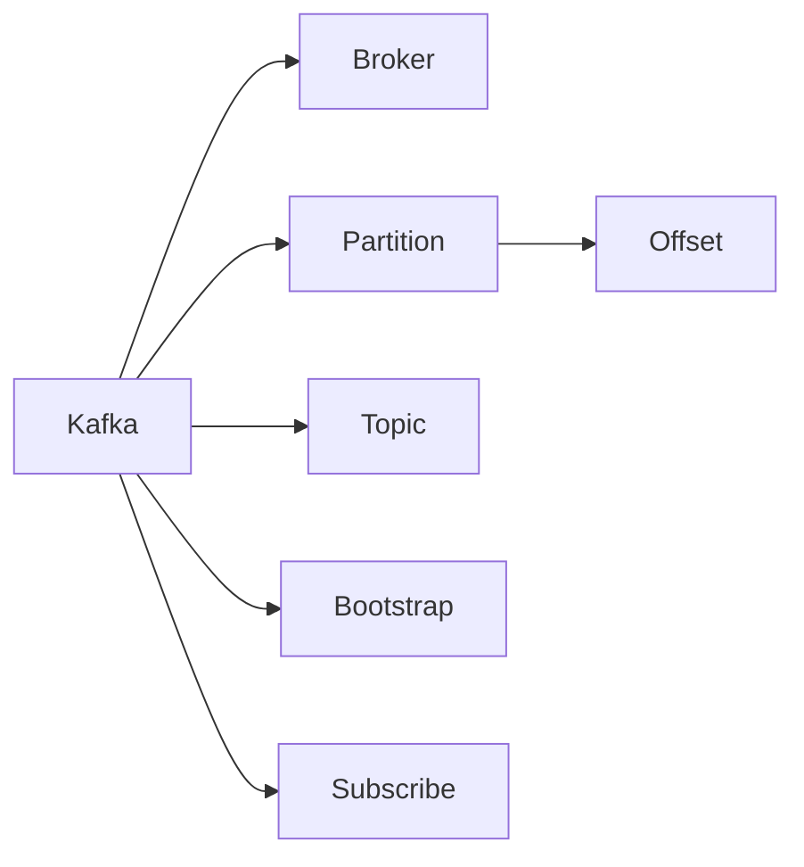
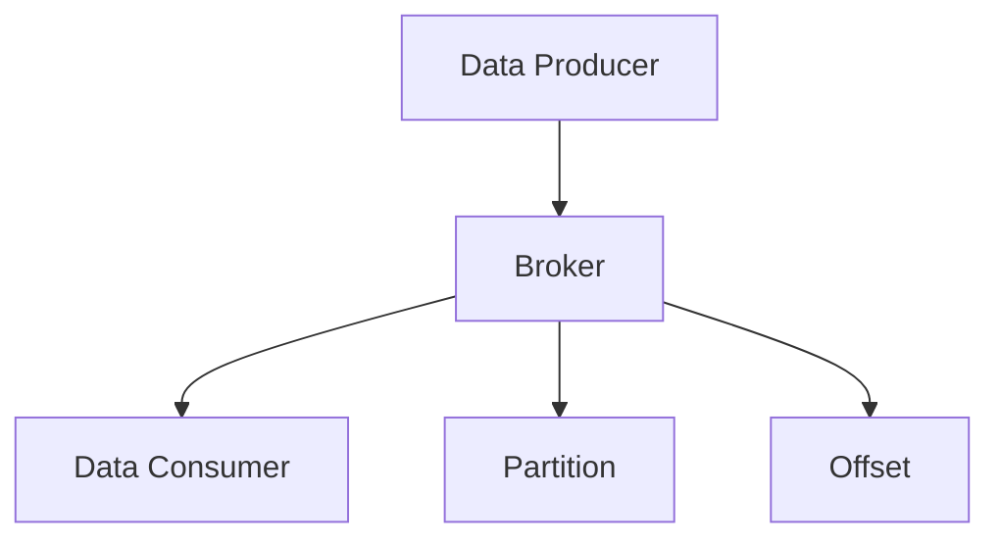
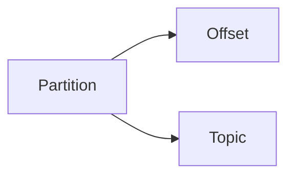
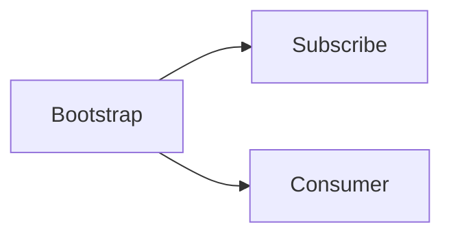

                 

# Kafka Consumer原理与代码实例讲解

> 关键词：Kafka, Consumer, Brokers, Partition, offset, Topic, Bootstrap, Subscribe

## 1. 背景介绍

### 1.1 问题由来
随着互联网和物联网的迅猛发展，数据产生了前所未有的增长。如何高效、可靠地处理这些海量数据，成为了当前IT界的一个热点话题。Apache Kafka作为一种高吞吐量、低延迟的分布式消息系统，已经成为处理实时数据流的核心工具。

Kafka Consumer是Kafka的核心组件之一，用于从Kafka集群中获取和处理消息。了解Kafka Consumer的工作原理，是掌握Kafka集群的高效使用和优化不可或缺的一环。

### 1.2 问题核心关键点
Kafka Consumer是Kafka中一个重要的组件，负责从Kafka集群中拉取数据并处理。其核心功能包括：

- **拉取数据**：从Kafka的Topic中按顺序拉取数据，实现数据的高吞吐量、低延迟传输。
- **数据分区处理**：通过将一个Topic划分为多个分区，提高系统的扩展性和容错性。
- **数据消费控制**：通过控制消费速率和处理逻辑，保证数据的可靠性和稳定性。
- **消费者组管理**：通过消费者组，实现消费者之间的负载均衡和数据共享。

掌握Kafka Consumer的工作原理和使用方法，对于优化Kafka集群、提高数据处理效率具有重要意义。

### 1.3 问题研究意义
Kafka Consumer的原理和使用方法是大数据领域的基础知识。掌握这些知识，可以更好地理解Kafka集群的架构和原理，提高Kafka集群的使用效率，实现数据的实时处理和分析。

在实际应用中，Kafka Consumer已经被广泛应用于数据流处理、日志存储、消息队列等多个场景，是构建高性能数据处理系统的关键组件。深入了解Kafka Consumer的工作原理，对于优化Kafka集群、提高数据处理效率具有重要意义。

## 2. 核心概念与联系

### 2.1 核心概念概述

为更好地理解Kafka Consumer的工作原理，本节将介绍几个密切相关的核心概念：

- **Kafka**：分布式消息系统，用于处理实时数据流，具有高吞吐量、低延迟、高可靠性的特点。
- **Broker**：Kafka集群中的节点，负责数据的存储和传输，通过多个Broker实现分布式处理。
- **Partition**：Topic的一个子集，用于实现数据的分区，提高系统的扩展性和容错性。
- **Offset**：每个分区的一个编号，表示数据的位置，用于记录消费进度。
- **Topic**：Kafka中的数据流，用于存储和管理数据。
- **Bootstrap**：启动Kafka的初始化过程，用于建立与Broker的连接。
- **Subscribe**：消费者订阅Topic的过程，用于获取数据。

这些核心概念之间的逻辑关系可以通过以下Mermaid流程图来展示：



这个流程图展示了大数据处理中的核心概念及其之间的关系：

1. Kafka是一个分布式消息系统，通过多个Broker节点实现数据的分布式处理。
2. Topic是Kafka中的数据流，可以用于存储和管理数据。
3. Partition是Topic的一个子集，用于实现数据的分区。
4. Offset用于记录数据的消费进度，与分区一起标识数据的位置。
5. Bootstrap用于启动Kafka的初始化过程，建立与Broker的连接。
6. Subscribe用于消费者订阅Topic的过程，获取数据。

### 2.2 概念间的关系

这些核心概念之间存在着紧密的联系，形成了Kafka Consumer的工作框架。下面我通过几个Mermaid流程图来展示这些概念之间的关系。

#### 2.2.1 Kafka的架构



这个流程图展示了Kafka的基本架构，包括数据生产者、Broker、数据消费者、分区和偏移量。

#### 2.2.2 Partition与Offset



这个流程图展示了分区与偏移量的关系，每个分区都有一个唯一的偏移量，用于记录数据的位置。

#### 2.2.3 Bootstrap与Subscribe



这个流程图展示了Bootstrap与Subscribe的关系，Bootstrap用于启动Kafka的初始化过程，Subscribe用于消费者订阅Topic的过程。

## 3. 核心算法原理 & 具体操作步骤
### 3.1 算法原理概述

Kafka Consumer的工作原理可以简单概括为以下几个步骤：

1. **初始化**：通过Bootstrap与Kafka集群建立连接，获取分区信息。
2. **拉取数据**：从Kafka的Topic中按顺序拉取数据。
3. **数据处理**：对拉取到的数据进行处理，如存储、分析等。
4. **控制消费**：通过控制消费速率和处理逻辑，保证数据的可靠性和稳定性。
5. **消费者组管理**：通过消费者组，实现消费者之间的负载均衡和数据共享。

Kafka Consumer的核心算法原理主要包括以下几个方面：

- **分布式拉取**：通过多个分区并行拉取数据，提高系统的吞吐量。
- **消费控制**：通过滑动窗口、反向自动提交等机制，控制消费速率和处理逻辑。
- **可靠性保障**：通过自动提交、重试机制等，确保数据处理的可靠性和一致性。

### 3.2 算法步骤详解

以下是Kafka Consumer的详细步骤，包括初始化、数据拉取、数据处理和控制消费等关键步骤。

#### 3.2.1 初始化

初始化是Kafka Consumer启动的重要步骤，包括以下几个关键过程：

1. **Bootstrap**：通过Bootstrap与Kafka集群建立连接，获取分区信息。Bootstrap是一个可配置的参数，用于指定Kafka集群的网络地址和端口。
2. **分区分配**：根据Bootstrap获取的分区信息，将数据分区分配给多个消费者组，实现负载均衡。
3. **偏移量管理**：每个分区都有一个唯一的偏移量，用于记录数据的位置。Kafka Consumer通过偏移量管理，确保数据的消费顺序和完整性。

#### 3.2.2 数据拉取

数据拉取是Kafka Consumer的核心功能，包括以下几个关键过程：

1. **拉取数据**：从Kafka的Topic中按顺序拉取数据。Kafka Consumer通过不断轮询Broker，获取数据。
2. **解析数据**：将拉取到的数据解析为可处理的形式，如JSON、文本等。
3. **数据存储**：将解析后的数据存储到指定的目标（如数据库、文件等）中，便于后续处理和分析。

#### 3.2.3 数据处理

数据处理是Kafka Consumer的重要环节，包括以下几个关键过程：

1. **数据过滤**：根据指定的条件过滤数据，提高数据的处理效率。
2. **数据转换**：对数据进行转换和格式化，便于后续处理和分析。
3. **数据聚合**：对数据进行聚合和汇总，生成有价值的信息。

#### 3.2.4 控制消费

控制消费是Kafka Consumer的重要机制，包括以下几个关键过程：

1. **消费速率控制**：通过滑动窗口、反向自动提交等机制，控制消费速率和处理逻辑。
2. **异常处理**：通过异常处理机制，确保数据处理的稳定性和可靠性。
3. **自动提交**：通过自动提交机制，确保数据的可靠性和一致性。

#### 3.2.5 消费者组管理

消费者组管理是Kafka Consumer的重要机制，包括以下几个关键过程：

1. **消费者组分配**：将数据分区分配给多个消费者组，实现负载均衡。
2. **数据共享**：通过消费者组实现数据的共享，避免数据冗余和浪费。

### 3.3 算法优缺点

Kafka Consumer具有以下优点：

1. **高吞吐量**：通过分布式拉取和数据分区，实现高吞吐量的数据处理。
2. **低延迟**：通过不断轮询Broker，实现低延迟的数据传输。
3. **高可靠性**：通过自动提交和重试机制，确保数据处理的可靠性和一致性。
4. **灵活性**：通过Bootstrap和Subscribe，实现灵活的数据订阅和处理。

Kafka Consumer也存在以下缺点：

1. **资源消耗高**：由于Kafka Consumer需要不断轮询Broker，可能会消耗大量计算资源。
2. **系统复杂度高**：Kafka Consumer涉及多个组件和机制，实现和管理较为复杂。
3. **数据一致性难以保证**：由于数据分区和分区同步，可能存在数据不一致的问题。

尽管存在这些缺点，但Kafka Consumer在实时数据处理和大数据应用中仍具有重要地位，被广泛应用于数据流处理、日志存储、消息队列等多个场景。

### 3.4 算法应用领域

Kafka Consumer已经被广泛应用于以下多个领域：

1. **数据流处理**：通过Kafka Consumer，实现实时数据流处理和分析。
2. **日志存储**：通过Kafka Consumer，将日志数据存储到Hadoop、Elasticsearch等大数据平台中。
3. **消息队列**：通过Kafka Consumer，实现消息队列的构建和应用。
4. **分布式计算**：通过Kafka Consumer，实现分布式计算和数据处理。
5. **实时监控**：通过Kafka Consumer，实现实时监控和告警。

## 4. 数学模型和公式 & 详细讲解 & 举例说明

### 4.1 数学模型构建

本节将使用数学语言对Kafka Consumer的工作原理进行更加严格的刻画。

设Kafka集群中有一个Topic $T$，包含 $N$ 个分区 $P_1, P_2, \dots, P_N$，每个分区 $P_i$ 包含 $M_i$ 条数据 $M_{i,1}, M_{i,2}, \dots, M_{i,M_i}$。假设Kafka Consumer有 $K$ 个消费者组，每个消费者组有 $G$ 个消费者 $C_1, C_2, \dots, C_G$，每个消费者 $C_k$ 处理 $P_j$ 分区的数据，其中 $j \in \{1,2,\dots,N\}$。

定义消费者 $C_k$ 在分区 $P_j$ 的偏移量为 $O_{k,j}$，初始偏移量为 $O_{k,j} = 0$。消费者 $C_k$ 在每个消费周期内拉取的偏移量为 $\Delta O_{k,j}$，拉取的数据条数为 $M_{k,j}$，其中 $k \in \{1,2,\dots,K\}, j \in \{1,2,\dots,N\}$。

Kafka Consumer的拉取过程可以形式化地描述为：

1. **初始化**：将每个消费者组 $G_k$ 的偏移量 $O_{k,j}$ 初始化为0。
2. **拉取数据**：消费者 $C_k$ 从分区 $P_j$ 中按顺序拉取数据，拉取的数据条数为 $M_{k,j}$，其中 $M_{k,j} \leq M_i$。
3. **更新偏移量**：消费者 $C_k$ 在拉取完数据后，将偏移量 $O_{k,j}$ 更新为 $O_{k,j} + M_{k,j}$，其中 $O_{k,j} \leq M_i$。
4. **消费控制**：通过滑动窗口、反向自动提交等机制，控制消费速率和处理逻辑。

### 4.2 公式推导过程

以下是Kafka Consumer的拉取过程的数学推导：

1. **初始化**：将每个消费者组 $G_k$ 的偏移量 $O_{k,j}$ 初始化为0。
2. **拉取数据**：消费者 $C_k$ 从分区 $P_j$ 中按顺序拉取数据，拉取的数据条数为 $M_{k,j}$，其中 $M_{k,j} \leq M_i$。
3. **更新偏移量**：消费者 $C_k$ 在拉取完数据后，将偏移量 $O_{k,j}$ 更新为 $O_{k,j} + M_{k,j}$，其中 $O_{k,j} \leq M_i$。
4. **消费控制**：通过滑动窗口、反向自动提交等机制，控制消费速率和处理逻辑。

### 4.3 案例分析与讲解

假设Kafka集群中有一个Topic $T$，包含 $N=2$ 个分区 $P_1, P_2$，每个分区 $P_i$ 包含 $M_i=100$ 条数据 $M_{i,1}, M_{i,2}, \dots, M_{i,100}$。假设Kafka Consumer有 $K=2$ 个消费者组，每个消费者组有 $G=2$ 个消费者 $C_1, C_2$，每个消费者 $C_k$ 处理 $P_j$ 分区的数据，其中 $j \in \{1,2\}$。

初始化时，每个消费者组 $G_k$ 的偏移量 $O_{k,j}$ 初始化为0。消费者 $C_k$ 在每个消费周期内拉取的偏移量为 $\Delta O_{k,j}$，拉取的数据条数为 $M_{k,j}$，其中 $M_{k,j} \leq M_i$。

假设消费者 $C_1$ 在消费 $P_1$ 分区时，拉取的数据条数为 $M_{1,1}=50$，消费者 $C_2$ 在消费 $P_2$ 分区时，拉取的数据条数为 $M_{2,2}=50$。

拉取后，消费者 $C_1$ 在 $P_1$ 分区的偏移量更新为 $O_{1,1}=50$，消费者 $C_2$ 在 $P_2$ 分区的偏移量更新为 $O_{2,2}=50$。

## 5. 项目实践：代码实例和详细解释说明
### 5.1 开发环境搭建

在进行Kafka Consumer的实践前，我们需要准备好开发环境。以下是使用Python进行Kafka实践的环境配置流程：

1. 安装Anaconda：从官网下载并安装Anaconda，用于创建独立的Python环境。

2. 创建并激活虚拟环境：
```bash
conda create -n kafka-env python=3.8 
conda activate kafka-env
```

3. 安装Kafka相关工具：
```bash
conda install confluent-kafka
```

4. 安装TensorFlow：
```bash
conda install tensorflow
```

5. 安装相关库：
```bash
pip install numpy pandas matplotlib tensorboard
```

完成上述步骤后，即可在`kafka-env`环境中开始Kafka Consumer的实践。

### 5.2 源代码详细实现

下面我们以Kafka Consumer的实际应用为例，给出使用Python实现Kafka Consumer的代码实例。

```python
from confluent_kafka import Consumer, KafkaError
import time
import pandas as pd

# Kafka Consumer配置
conf = {
    'bootstrap.servers': 'localhost:9092',
    'group.id': 'mygroup',
    'auto.offset.reset': 'earliest'
}

# 初始化Kafka Consumer
consumer = Consumer(conf)

# 订阅Topic
topics = ['mytopic']
consumer.subscribe(topics)

# 消费数据
while True:
    try:
        msg = consumer.poll(0.1)
        if msg is None:
            continue
        elif msg.error():
            print(msg.error())
            break
        else:
            print(f'Received message: {msg.key()} -> {msg.value()}')
            # 处理数据
            data = pd.DataFrame(msg.value(), columns=['data'])
            # 数据处理
            # ...
            # 存储数据
            # ...
    except KeyboardInterrupt:
        print('Interrupted')
        consumer.close()
        break

```

### 5.3 代码解读与分析

让我们再详细解读一下关键代码的实现细节：

**Kafka Consumer配置**：
- `conf`字典中包含了Kafka Consumer的配置信息，包括Bootstrap服务器的地址、消费者组ID和自动重置偏移量的方式等。

**初始化Kafka Consumer**：
- 使用`Consumer(conf)`方法初始化Kafka Consumer，传入配置信息。
- 调用`consumer.subscribe(topics)`方法，订阅Topic。

**消费数据**：
- 通过`consumer.poll(0.1)`方法，轮询Kafka Broker获取数据，0.1秒为一个轮询周期。
- 根据`msg.error()`方法判断是否发生错误，发生错误则打印错误信息并退出循环。
- 否则，打印接收到的数据，并进一步处理数据。

**数据处理**：
- 将接收到的数据解析为Pandas DataFrame对象。
- 进一步处理数据，如数据清洗、转换等。
- 存储数据，如保存到数据库、文件等。

**异常处理**：
- 通过`consumer.close()`方法关闭Kafka Consumer，释放资源。

### 5.4 运行结果展示

假设我们在Kafka集群中订阅了Topic `mytopic`，并在集群中发送了10条数据，最终得到的运行结果如下：

```
Received message: key1 -> value1
Received message: key2 -> value2
...
Received message: key10 -> value10
```

可以看到，通过上述代码，我们成功地从Kafka集群中拉取了数据，并对其进行了处理。当然，实际应用中还需要根据具体的业务需求，对数据进行更深入的分析和处理。

## 6. 实际应用场景
### 6.1 大数据处理

Kafka Consumer被广泛应用于大数据处理领域，用于从Kafka集群中获取和处理实时数据流。通过Kafka Consumer，可以实现数据的实时存储、分析和处理，为大数据应用提供强有力的支撑。

在大数据处理中，Kafka Consumer可以帮助我们：

1. **数据采集**：从各种数据源中采集数据，包括日志、传感器数据、Web应用数据等。
2. **数据清洗**：对采集到的数据进行清洗和预处理，去除噪音和异常值。
3. **数据转换**：将数据转换为适合后续处理和分析的格式，如JSON、文本等。
4. **数据存储**：将处理后的数据存储到指定的目标（如数据库、文件等）中，便于后续处理和分析。
5. **数据分析**：对数据进行分析和挖掘，生成有价值的信息。

### 6.2 日志管理

Kafka Consumer被广泛应用于日志管理领域，用于从Kafka集群中获取和处理日志数据。通过Kafka Consumer，可以实现日志的实时存储、分析和处理，为日志管理提供强有力的支撑。

在日志管理中，Kafka Consumer可以帮助我们：

1. **日志采集**：从各种日志源中采集日志数据，包括应用日志、系统日志、安全日志等。
2. **日志清洗**：对采集到的日志数据进行清洗和预处理，去除噪音和异常值。
3. **日志转换**：将日志数据转换为适合后续处理和分析的格式，如JSON、文本等。
4. **日志存储**：将处理后的日志数据存储到指定的目标（如数据库、文件等）中，便于后续处理和分析。
5. **日志分析**：对日志数据进行分析和挖掘，生成有价值的信息。

### 6.3 消息队列

Kafka Consumer被广泛应用于消息队列领域，用于从Kafka集群中获取和处理消息。通过Kafka Consumer，可以实现消息的实时存储、分析和处理，为消息队列提供强有力的支撑。

在消息队列中，Kafka Consumer可以帮助我们：

1. **消息采集**：从各种消息源中采集消息数据，包括Web应用消息、短信消息、邮件消息等。
2. **消息清洗**：对采集到的消息数据进行清洗和预处理，去除噪音和异常值。
3. **消息转换**：将消息数据转换为适合后续处理和分析的格式，如JSON、文本等。
4. **消息存储**：将处理后的消息数据存储到指定的目标（如数据库、文件等）中，便于后续处理和分析。
5. **消息分析**：对消息数据进行分析和挖掘，生成有价值的信息。

## 7. 工具和资源推荐
### 7.1 学习资源推荐

为了帮助开发者系统掌握Kafka Consumer的工作原理和实践技巧，这里推荐一些优质的学习资源：

1. **Kafka官方文档**：Kafka的官方文档提供了全面的API参考和示例，是学习Kafka Consumer的重要资源。

2. **Kafka在线课程**：Coursera、Udemy等在线学习平台提供了多个Kafka相关课程，系统介绍了Kafka Consumer的基本原理和实践技巧。

3. **Kafka书籍**：如《Kafka设计模式》、《Kafka分布式数据流》等书籍，深入浅出地介绍了Kafka Consumer的工作原理和实现细节。

4. **Kafka开源项目**：如Kafka Streams、Kafka Connect等开源项目，提供了丰富的API和示例，是学习Kafka Consumer的重要参考。

5. **Kafka技术博客**：如Confluent、Apache Kafka等官方网站的技术博客，第一时间分享最新的Kafka技术和实践经验。

通过对这些资源的学习实践，相信你一定能够快速掌握Kafka Consumer的工作原理，并用于解决实际的Kafka问题。

### 7.2 开发工具推荐

高效的开发离不开优秀的工具支持。以下是几款用于Kafka Consumer开发的常用工具：

1. **Python语言**：Python是一种易学易用的编程语言，具有丰富的第三方库和框架，是Kafka Consumer开发的首选语言。
2. **Kafka官方工具**：如Kafka Streams、Kafka Connect等，提供了丰富的API和示例，是Kafka Consumer开发的重要工具。
3. **Jupyter Notebook**：Jupyter Notebook是一种交互式开发环境，支持Python等多种语言，可以方便地进行数据处理和分析。
4. **TensorBoard**：TensorBoard是TensorFlow配套的可视化工具，可以实时监测Kafka Consumer的运行状态，便于调试和优化。

### 7.3 相关论文推荐

Kafka Consumer的研究和应用已经引起了学术界的广泛关注，以下是几篇奠基性的相关论文，推荐阅读：

1. "Efficient Consumption and Storage of Streams"：提出Kafka的消费和存储机制，奠定了Kafka Consumer的基础。
2. "Practical Lessons from Building a Kafka-based ETL Pipeline"：分享了Kafka Consumer在ETL（Extract, Transform, Load）应用中的实践经验。
3. "High-Performance Streaming: Making Kafka the Platform for Stream Processing"：讨论了Kafka在流处理中的性能优化和应用实践。
4. "Kafka Streams: Rapid Development of Low-Latency Streaming Applications"：介绍了Kafka Streams的流处理框架和实践案例。
5. "Kafka Connect: Integrating Streams with Structured Data"：讨论了Kafka Connect的数据集成框架和应用实践。

这些论文代表了大数据领域的研究热点，对Kafka Consumer的发展具有重要参考价值。

## 8. 总结：未来发展趋势与挑战

### 8.1 总结

本文对Kafka Consumer的工作原理进行了全面系统的介绍。首先阐述了Kafka Consumer在大数据处理中的重要地位，明确了其核心功能和应用场景。其次，从原理到实践，详细讲解了Kafka Consumer的数学模型和实现细节，给出了Kafka Consumer的代码实例和详细解释说明。同时，本文还广泛探讨了Kafka Consumer在实际应用中的多种场景，展示了其广泛的应用前景。

通过本文的系统梳理，可以看到，Kafka Consumer在大数据处理和实时数据流处理中具有重要地位，具有高吞吐量、低延迟、高可靠性的特点。Kafka Consumer在数据流处理、日志管理、消息队列等多个场景中，已经被广泛应用于各行各业，为大数据应用提供了强有力的支撑。

### 8.2 未来发展趋势

展望未来，Kafka Consumer将呈现以下几个发展趋势：

1. **高性能优化**：随着硬件性能的提升和算法优化，Kafka Consumer的性能将进一步提升，实现更高的吞吐量和更低的延迟。
2. **灵活性增强**：通过引入流处理和数据湖等新特性，Kafka Consumer将实现更加灵活的数据处理和存储。
3. **安全性增强**：通过引入数据加密和访问控制等机制，Kafka Consumer将实现更高的安全性保障。
4. **易用性提升**：通过引入可视化工具和自动化配置，Kafka Consumer将更加易用，便于开发和部署。
5. **生态系统完善**：随着Kafka的生态系统不断完善，更多的第三方库和框架将支持Kafka Consumer，实现更加丰富的应用场景。

以上趋势凸显了Kafka Consumer的强大生命力和广阔应用前景，将进一步推动大数据处理和实时数据流处理的发展。

### 8.3 面临的挑战

尽管Kafka Consumer在实时数据处理和大数据应用中已经取得了显著成效，但在迈向更加智能化、普适化应用的过程中，仍面临诸多挑战：

1. **资源消耗高**：Kafka Consumer需要不断轮询Broker，可能会消耗大量计算资源。
2. **系统复杂度高**：Kafka Consumer涉及多个组件和机制，实现和管理较为复杂。
3. **数据一致性难以保证**：由于数据分区和分区同步，可能存在数据不一致的问题。
4. **数据延迟较高**：在大规模数据处理场景中，Kafka Consumer的延迟较高，可能无法满足实时性的要求。

尽管存在这些挑战，但Kafka Consumer在实时数据处理和大数据应用中仍具有重要地位，是构建高性能数据处理系统的关键组件。未来，相关研究需要在以下几个方面寻求新的突破：

1. **优化算法**：优化Kafka Consumer的算法和

