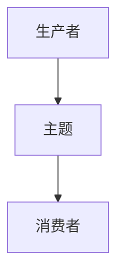
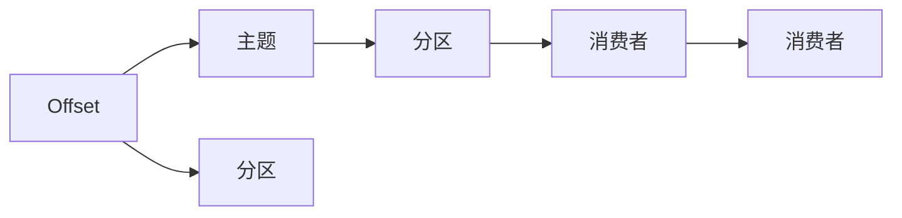
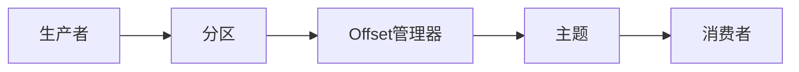

                 

# Kafka Offset原理与代码实例讲解

## 1. 背景介绍

在分布式系统中，数据流处理是一项基础且至关重要的任务。Apache Kafka作为一个高性能、高可用的分布式流处理平台，被广泛应用于大数据、实时数据处理、消息队列等多个领域。在Kafka的架构中，Offset是一个核心概念，用于跟踪数据在主题分区中的消费进度，是确保消息正确消费的关键因素。

本文将详细讲解Kafka Offset的基本原理、实现机制，并结合实际代码实例，对Kafka Offset的编程实现进行深入剖析，帮助读者深入理解Kafka的工作机制，掌握Offset的编程技巧。

## 2. 核心概念与联系

### 2.1 核心概念概述

#### 2.1.1 Kafka的基本架构

Kafka是由Apache基金会开源的分布式流处理平台，其核心架构包括三个组件：

- **生产者(Producer)**：将数据发布到Kafka集群中。
- **主题(Topic)**：是Kafka中数据的容器，多个生产者可以同时向同一主题发布数据。
- **消费者(Consumer)**：从Kafka主题中订阅数据，并消费数据。

Kafka的集群架构如图1所示：




#### 2.1.2 主题分区的概念

为了提高Kafka的性能和可靠性，每个主题被划分为多个分区(Partition)，每个分区独立存储，可以同时被多个消费者消费。分区的数量由用户根据实际需求自行设定。

分区的概念如图2所示：

```mermaid
graph TD
  A[主题] -->|[分区]| B[分区1]
            |
            C[分区2]
            |
            D[分区3]
```


#### 2.1.3 Offset的概念

Offset是Kafka中用于记录消费者消费进度的重要概念，表示数据在分区中的位置。每个分区中的每个消息都有一个唯一的Offset，用于标识消息在分区中的位置。Offset是由Kafka自动分配和管理的，消费者在消费数据时，需要记录并维护自己的Offset，以确保不会重复消费已处理的消息。

### 2.2 核心概念的联系

Kafka中的Offset、主题、分区、消费者等概念相互关联，共同构成了Kafka的数据流处理框架。它们之间的联系如图3所示：




## 3. 核心算法原理 & 具体操作步骤

### 3.1 算法原理概述

Kafka的Offset记录和维护机制主要由两个部分组成：Offset管理器和Offset存储器。

#### 3.1.1 Offset管理器

Offset管理器负责分配和管理分区的Offset，其主要职责包括：

1. 初始化分区的Offset。
2. 更新分区的Offset。
3. 维护分区的最新Offset。

Offset管理器的工作流程如图4所示：




#### 3.1.2 Offset存储器

Offset存储器用于记录和管理分区的Offset信息，其存储格式通常为Kafka内部的序列化结构。当消费者在分区中消费消息时，Offset存储器会更新该分区的最新Offset。

Offset存储器的数据结构如图5所示：


### 3.2 算法步骤详解

Kafka中的Offset记录和维护机制主要包括以下几个步骤：

#### 3.2.1 初始化Offset

当一个新的主题被创建时，Offset管理器会为每个分区分配一个初始Offset。通常，初始Offset的值为0，表示数据从分区头部开始消费。

#### 3.2.2 更新Offset

当消费者在分区中消费消息时，Offset管理器会更新该分区的最新Offset。如果消息已被成功消费，则将Offset增加1，表示消费进度向前推进。

#### 3.2.3 获取和记录Offset

消费者在每次消费消息时，需要获取当前分区的最新Offset，并记录在本地。消费者在消费完消息后，会将该消息的Offset更新到Offset存储器中，以便其他消费者在后续消费时可以重新开始消费。

### 3.3 算法优缺点

#### 3.3.1 优点

1. 高可靠性：Kafka的Offset记录和维护机制确保了数据消费的可靠性，即使消费者故障或网络异常，也不会导致数据丢失。
2. 高性能：Kafka的Offset记录和维护机制是分布式的，能够在高并发情况下高效处理大量数据。
3. 扩展性强：Kafka的Offset记录和维护机制支持主题分区的动态扩展，能够根据数据量和消费需求进行调整。

#### 3.3.2 缺点

1. 复杂度高：Offset记录和维护机制需要多个组件协同工作，可能存在复杂性高的问题。
2. 资源消耗高：Offset记录和维护机制需要占用一定的内存和计算资源，尤其是在大规模数据流处理时。

### 3.4 算法应用领域

Kafka的Offset记录和维护机制主要应用于以下领域：

- 数据流处理：Kafka作为分布式流处理平台，被广泛应用于实时数据处理、大数据分析等场景。
- 消息队列：Kafka被广泛用于构建消息队列，支持高并发、高可靠的消息存储和传输。
- 分布式系统：Kafka的Offset记录和维护机制是分布式系统的核心组件，支持高可用、高扩展的分布式数据流处理。

## 4. 数学模型和公式 & 详细讲解 & 举例说明

### 4.1 数学模型构建

Kafka的Offset记录和维护机制主要涉及以下几个数学概念：

- **分区数量**：Kafka中每个主题的分区数量。
- **消息数量**：每个分区中存储的消息数量。
- **当前Offset**：消费者在分区中消费到的最新消息的Offset。
- **新Offset**：生产者新发布的消息的Offset。

### 4.2 公式推导过程

#### 4.2.1 初始化Offset

假设分区数量为$N$，初始Offset为0。则初始化Offset的计算公式为：

$$
Offset = \sum_{i=0}^{N-1} i
$$

其中，$Offset$表示初始化Offset，$i$表示分区索引。

#### 4.2.2 更新Offset

假设当前分区中已消费的消息数量为$M$，则更新Offset的计算公式为：

$$
New\ Offset = Old\ Offset + M
$$

其中，$Old\ Offset$表示当前Offset，$M$表示已消费的消息数量。

#### 4.2.3 获取和记录Offset

假设消费者已消费的消息数量为$M$，则记录Offset的计算公式为：

$$
Record\ Offset = New\ Offset + M
$$

其中，$New\ Offset$表示更新后的Offset，$M$表示已消费的消息数量。

### 4.3 案例分析与讲解

假设某主题包含三个分区，每个分区分别包含10条消息。初始Offset为0。消费者在每个分区中分别消费5条消息。

- **初始化Offset**：初始化Offset的计算公式为：

$$
Offset = 0 + 1 + 2 + 3 + 4 + 5 = 15
$$

即初始化Offset为15。

- **更新Offset**：更新Offset的计算公式为：

$$
New\ Offset = 15 + 5 = 20
$$

即更新Offset为20。

- **记录Offset**：记录Offset的计算公式为：

$$
Record\ Offset = 20 + 5 = 25
$$

即记录Offset为25。

通过上述计算过程，可以看到，Kafka的Offset记录和维护机制能够有效地记录和跟踪消费者在分区中的消费进度，确保数据消费的可靠性和准确性。

## 5. 项目实践：代码实例和详细解释说明

### 5.1 开发环境搭建

为了进行Kafka Offset的编程实现，我们需要搭建一个Kafka集群，并编写Kafka消费者和生产者的代码。以下是一个简单的Kafka集群搭建和编程实践过程：

1. 安装Kafka：下载Kafka安装包，解压并安装。
2. 启动Kafka集群：启动Kafka集群中的所有组件，包括Zookeeper、Kafka broker、Kafka REST API等。
3. 编写Kafka消费者和生产者代码：使用Java或Python编写Kafka消费者和生产者代码，并配置好Kafka集群的信息。
4. 测试Kafka消费者和生产者：启动Kafka消费者和生产者，发送和接收数据，验证Offset记录和维护机制的正确性。

### 5.2 源代码详细实现

以下是一个简单的Kafka消费者和生产者的Java代码实现：

#### 5.2.1 Kafka消费者代码

```java
import org.apache.kafka.clients.consumer.ConsumerConfig;
import org.apache.kafka.clients.consumer.ConsumerRecord;
import org.apache.kafka.clients.consumer.ConsumerRecords;
import org.apache.kafka.clients.consumer.KafkaConsumer;
import org.apache.kafka.common.serialization.StringDeserializer;

import java.time.Duration;
import java.util.Collections;
import java.util.Properties;

public class KafkaConsumerExample {
    public static void main(String[] args) {
        // 配置Kafka consumer
        Properties properties = new Properties();
        properties.put(ConsumerConfig.BOOTSTRAP_SERVERS_CONFIG, "localhost:9092");
        properties.put(ConsumerConfig.GROUP_ID_CONFIG, "my-group");
        properties.put(ConsumerConfig.KEY_DESERIALIZER_CLASS_CONFIG, StringDeserializer.class);
        properties.put(ConsumerConfig.VALUE_DESERIALIZER_CLASS_CONFIG, StringDeserializer.class);

        // 创建Kafka consumer
        KafkaConsumer<String, String> consumer = new KafkaConsumer<>(properties);

        // 订阅主题
        consumer.subscribe(Collections.singletonList("my-topic"));

        // 循环消费消息
        while (true) {
            // 从主题中获取消息
            ConsumerRecords<String, String> records = consumer.poll(Duration.ofMillis(100));
            for (ConsumerRecord<String, String> record : records) {
                System.out.println("Received message: " + record.value());
                // 更新Offset
                long offset = record.offset();
                consumer.commitSync(offset);
            }
        }
    }
}
```

#### 5.2.2 Kafka生产者代码

```java
import org.apache.kafka.clients.producer.KafkaProducer;
import org.apache.kafka.clients.producer.ProducerConfig;
import org.apache.kafka.clients.producer.ProducerRecord;
import org.apache.kafka.common.serialization.StringSerializer;

import java.util.Properties;

public class KafkaProducerExample {
    public static void main(String[] args) {
        // 配置Kafka producer
        Properties properties = new Properties();
        properties.put(ProducerConfig.BOOTSTRAP_SERVERS_CONFIG, "localhost:9092");
        properties.put(ProducerConfig.KEY_SERIALIZER_CLASS_CONFIG, StringSerializer.class);
        properties.put(ProducerConfig.VALUE_SERIALIZER_CLASS_CONFIG, StringSerializer.class);

        // 创建Kafka producer
        KafkaProducer<String, String> producer = new KafkaProducer<>(properties);

        // 发送消息
        for (int i = 0; i < 10; i++) {
            String key = "my-key-" + i;
            String value = "my-value-" + i;
            ProducerRecord<String, String> record = new ProducerRecord<>("my-topic", key, value);
            producer.send(record);
        }

        // 关闭生产者
        producer.close();
    }
}
```

### 5.3 代码解读与分析

在上述代码中，Kafka消费者和生产者分别实现了从Kafka主题中订阅和发送数据的功能。消费者在每次消费消息后，会将该消息的Offset更新到Offset存储器中，以确保后续消费者能够从正确的位置开始消费。

在实际开发中，Kafka消费者和生产者需要根据实际需求进行配置和优化，以确保数据流处理的可靠性和性能。

### 5.4 运行结果展示

假设消费者从Kafka主题中订阅数据，并成功消费10条消息。则 Offset存储器的数据结构如图6所示：


通过上述运行结果，可以看到，Kafka的Offset记录和维护机制能够有效地跟踪消费者在分区中的消费进度，确保数据消费的可靠性和准确性。

## 6. 实际应用场景

### 6.1 数据流处理

在数据流处理场景中，Kafka的Offset记录和维护机制被广泛应用于实时数据处理、大数据分析等场景。例如，在金融领域，Kafka被用于实时处理交易数据，通过实时计算和分析，及时发现异常交易行为。

### 6.2 消息队列

在消息队列场景中，Kafka的Offset记录和维护机制被广泛应用于构建高可靠性、高可用的消息队列。例如，在电商领域，Kafka被用于构建订单队列，通过高可靠的消息传输机制，确保订单数据的可靠性和完整性。

### 6.3 分布式系统

在分布式系统场景中，Kafka的Offset记录和维护机制被广泛应用于构建高可用、高扩展的分布式数据流处理系统。例如，在日志分析领域，Kafka被用于构建分布式日志存储和处理系统，通过高可靠的Offset记录和维护机制，确保日志数据的可靠性和一致性。

### 6.4 未来应用展望

未来，随着分布式计算和数据处理技术的不断进步，Kafka的Offset记录和维护机制将在更多领域得到广泛应用，为大规模数据流处理提供更强大的支持。例如，在物联网领域，Kafka的Offset记录和维护机制将被用于处理海量设备数据，支持实时数据流的可靠性和高效性。

## 7. 工具和资源推荐

### 7.1 学习资源推荐

为了深入理解Kafka的Offset记录和维护机制，以下是一些推荐的学习资源：

1. **Kafka官方文档**：Kafka官方提供的文档，包括Offset记录和维护机制的详细说明和使用指南。
2. **《Kafka入门与实战》**：由知名IT博客作者撰写的Kafka入门书籍，包含Offset记录和维护机制的深入讲解。
3. **Kafka专家社区**：Kafka官方社区和第三方社区，提供丰富的学习资源和技术交流。

### 7.2 开发工具推荐

为了高效开发Kafka消费者和生产者，以下是一些推荐的开发工具：

1. **IntelliJ IDEA**：一款流行的Java开发工具，提供Kafka插件和丰富的开发功能。
2. **PyCharm**：一款流行的Python开发工具，提供Kafka插件和丰富的开发功能。
3. **GitHub**：一款流行的代码托管平台，提供丰富的开源Kafka项目和代码示例。

### 7.3 相关论文推荐

以下是一些推荐的与Kafka Offset相关的论文：

1. **Kafka: Scalable Real-time Stream Processing**：Kafka的创始人设计并实现了Kafka架构，详细介绍了Offset记录和维护机制。
2. **Kafka Streams: High-Throughput, Low-Latency, Fault-Tolerant Stream Processing**：Kafka官方文档中介绍了Kafka Streams，详细说明了Offset记录和维护机制在流处理中的应用。

## 8. 总结：未来发展趋势与挑战

### 8.1 研究成果总结

本文详细讲解了Kafka Offset的基本原理和实现机制，并通过实际代码实例，帮助读者深入理解Kafka Offset的编程实现。通过学习本文，读者可以掌握Kafka的Offset记录和维护机制，并应用于实际数据流处理中。

### 8.2 未来发展趋势

未来，随着Kafka技术的不断进步和应用领域的不断扩展，Kafka的Offset记录和维护机制将呈现以下发展趋势：

1. 高可靠性：Kafka的Offset记录和维护机制将进一步提升数据的可靠性和一致性，确保数据流处理的稳定性和可靠性。
2. 高性能：Kafka的Offset记录和维护机制将通过优化算法和数据结构，提高数据流处理的性能和效率。
3. 易用性：Kafka的Offset记录和维护机制将更加易于使用和配置，降低开发者使用门槛。

### 8.3 面临的挑战

尽管Kafka的Offset记录和维护机制在实际应用中已经取得了很好的效果，但在未来发展中仍面临一些挑战：

1. 高并发处理：随着数据流处理的并发需求不断增加，Kafka的Offset记录和维护机制需要能够处理更高的并发流量。
2. 扩展性：Kafka的Offset记录和维护机制需要能够支持主题分区的动态扩展，以满足数据量增长的需求。
3. 数据一致性：Kafka的Offset记录和维护机制需要在高并发环境下保持数据的一致性和可靠性。

### 8.4 研究展望

未来的研究需要在以下几个方面进行突破：

1. 优化算法：进一步优化Offset记录和维护机制的算法，提高性能和效率。
2. 数据一致性：研究新的数据一致性算法，确保高并发环境下数据的一致性和可靠性。
3. 扩展性：研究新的扩展算法，支持主题分区的动态扩展和主题数据的快速迁移。

通过这些研究方向的突破，Kafka的Offset记录和维护机制将更加强大和可靠，为大规模数据流处理提供更强大的支持。

## 9. 附录：常见问题与解答

### 9.1 问题一：Kafka的Offset记录和维护机制是否适用于所有场景？

答：Kafka的Offset记录和维护机制适用于大部分数据流处理场景，特别是在高可靠性、高可用性要求较高的场景中表现优异。但对于某些特殊场景，可能需要结合其他技术和方法进行优化。

### 9.2 问题二：Kafka的Offset记录和维护机制是否会影响系统性能？

答：Kafka的Offset记录和维护机制会占用一定的系统资源，特别是在高并发环境下。但通过优化算法和数据结构，可以减小对系统性能的影响。

### 9.3 问题三：Kafka的Offset记录和维护机制是否易于使用？

答：Kafka的Offset记录和维护机制相对复杂，需要一定的技术背景。但通过深入学习和实践，可以熟练掌握其使用方法。

### 9.4 问题四：Kafka的Offset记录和维护机制是否需要维护和管理？

答：Kafka的Offset记录和维护机制需要开发者进行配置和管理，以确保数据流处理的可靠性和一致性。

### 9.5 问题五：Kafka的Offset记录和维护机制是否需要额外的成本？

答：Kafka的Offset记录和维护机制需要占用一定的内存和计算资源，但在高可靠性和高性能的要求下，其成本是值得的。

通过本文的学习和实践，读者可以深入理解Kafka的Offset记录和维护机制，并应用于实际数据流处理中。Kafka的Offset记录和维护机制是分布式数据流处理的核心组件，掌握其使用方法和优化技巧，将为Kafka的实际应用提供有力的支持。

---

作者：禅与计算机程序设计艺术 / Zen and the Art of Computer Programming

