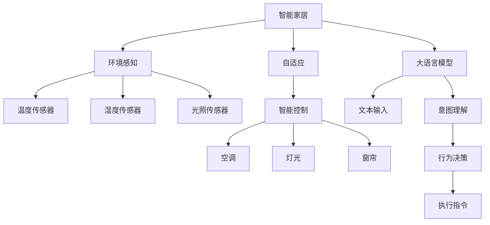
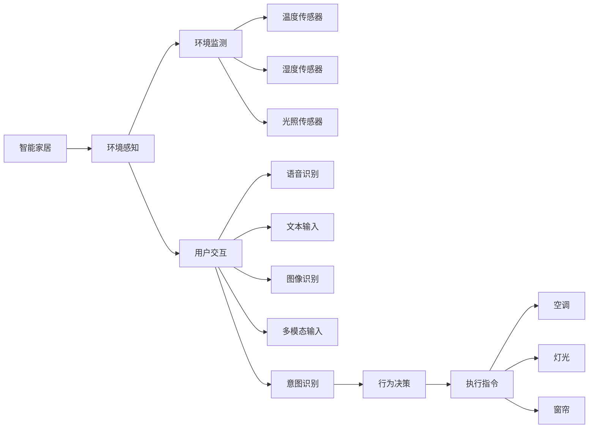

                 

# LLM驱动的智能家居场景：自适应生活环境

> 关键词：智能家居,自适应,环境感知,语言模型,深度学习,智能控制

## 1. 背景介绍

随着人工智能技术的快速发展，智能家居系统已经在全球范围内得到了广泛应用。然而，现有的智能家居系统往往依赖于固定的规则和预设的阈值，缺乏对实际生活环境的动态感知和自适应能力。在面对不断变化的生活习惯、外界环境因素和用户需求时，智能家居系统的智能和适应用户的能力显得略显不足。

本文探讨了如何利用大语言模型（Large Language Model，简称LLM）驱动智能家居系统，通过深度学习技术实现环境感知与自适应。通过引入自适应算法和语言模型，智能家居系统可以更好地理解用户的指令和需求，动态调整环境参数，提升用户的生活舒适度和便利性。

## 2. 核心概念与联系

### 2.1 核心概念概述

本节将介绍构建智能家居自适应系统的几个关键概念：

- **大语言模型（Large Language Model, LLM）**：指通过大规模语料训练得到的具备强大语言理解能力的模型，如GPT、BERT等。能够处理自然语言输入，进行文本生成、情感分析、问答等任务。

- **环境感知与自适应**：指智能家居系统能够实时感知环境参数（如温度、湿度、光照等），并根据感知结果动态调整环境参数，以适应用户需求。

- **深度学习**：一种基于数据驱动的机器学习方法，通过构建多层神经网络模型，能够自动学习输入数据的特征表示，进而进行分类、回归、生成等任务。

- **智能控制**：通过自动化控制算法，智能家居系统能够根据用户指令和感知到的环境参数，自动调整各种设备的运行状态，实现环境参数的精细控制。

### 2.2 核心概念间的关系

这些核心概念之间的关系可以通过以下Mermaid流程图来展示：



这个流程图展示了智能家居系统的核心组件及其相互关系：

1. 智能家居系统通过各种传感器（如温度、湿度、光照传感器）实时感知环境参数，并通过大语言模型理解用户指令。
2. 根据感知到的环境和用户指令，智能家居系统进行自适应行为决策，包括调节温度、控制灯光、开启窗帘等。
3. 智能控制算法实现环境参数的精细控制，确保用户需求得到满足。

### 2.3 核心概念的整体架构

以下是一个更全面的智能家居系统架构图，展示了各种组件及其互动关系：



这个综合架构图展示了智能家居系统从环境感知到用户交互，再到行为决策和执行的全流程：

1. 环境监测组件通过传感器实时获取环境数据。
2. 用户交互组件获取用户语音、文本、图像等多模态输入，并结合意图识别技术，理解用户需求。
3. 行为决策组件根据环境数据和用户指令，生成适应性的行为方案。
4. 执行指令组件通过智能控制算法，调整空调、灯光、窗帘等设备的运行状态。

通过这些核心概念和架构的介绍，我们了解到智能家居系统的复杂性和多模态交互的特点。下面，我们将深入探讨如何使用大语言模型来实现这些自适应功能。

## 3. 核心算法原理 & 具体操作步骤
### 3.1 算法原理概述

智能家居系统的环境感知与自适应功能，主要通过大语言模型来实现。大语言模型通过学习大规模无标签数据，能够理解自然语言输入，进行语义理解、意图识别和行为决策。

在智能家居场景中，大语言模型通过分析用户的指令和环境感知数据，动态调整环境参数，以适应用户需求。具体而言，算法原理如下：

1. **文本输入与语义理解**：用户通过语音、文本等形式，输入指令或需求，大语言模型通过自然语言处理技术，理解用户的意图。

2. **环境感知与数据分析**：传感器实时获取环境参数，如温度、湿度、光照等，环境监测组件对数据进行分析和预处理。

3. **行为决策与执行**：根据语义理解和环境数据，大语言模型生成适应性的行为方案，智能控制组件通过执行指令，调整设备的运行状态，实现环境参数的精细控制。

### 3.2 算法步骤详解

以下是一个详细的大语言模型驱动智能家居环境感知与自适应的操作步骤：

1. **环境监测与数据预处理**：
   - 通过传感器实时获取环境参数，如温度、湿度、光照等。
   - 对数据进行预处理，如归一化、滤波等，去除噪声和异常值。

2. **用户输入与意图识别**：
   - 用户通过语音、文本等形式，输入指令或需求。
   - 利用大语言模型进行意图识别，理解用户的真实需求。

3. **行为决策与参数调整**：
   - 根据用户的意图和环境数据，大语言模型生成适应性的行为方案。
   - 利用智能控制算法，调整设备运行状态，如调节温度、控制灯光、开启窗帘等。

4. **效果评估与反馈优化**：
   - 对环境参数进行实时监测和评估，确保用户的舒适度和便利性。
   - 根据用户的反馈，持续优化行为决策模型和参数调整算法。

### 3.3 算法优缺点

基于大语言模型的智能家居环境感知与自适应算法，具有以下优点：

- **高灵活性**：大语言模型能够处理自然语言输入，理解用户的多样化需求，适应性强。
- **自适应能力强**：结合环境感知数据，动态调整环境参数，适应不断变化的生活环境。
- **高效性**：通过深度学习技术，能够自动学习特征表示，减少人工干预，提升系统效率。

同时，也存在一些缺点：

- **依赖数据质量**：大语言模型对输入数据的质量和多样性要求较高，数据采集和预处理较为复杂。
- **计算资源消耗大**：大语言模型的训练和推理计算量大，需要高性能的计算资源。
- **解释性不足**：大语言模型通常被认为是"黑盒"系统，缺乏可解释性，用户难以理解其决策过程。

### 3.4 算法应用领域

大语言模型驱动的智能家居环境感知与自适应算法，主要应用于以下几个领域：

- **智能温控系统**：通过大语言模型分析用户指令和环境数据，自动调节温度、湿度等参数，提供舒适的生活环境。
- **智能照明系统**：根据用户指令和光照条件，智能控制灯光亮度和色温，满足不同场景的照明需求。
- **智能窗帘系统**：利用大语言模型理解用户需求，自动调整窗帘的开闭状态，控制室内光线和隐私。
- **智能安防系统**：结合语音识别和意图识别技术，实现语音控制家居设备，提升用户便利性。

此外，还可以应用于智能厨房、智能卫生间、智能办公等场景，实现全方位智能家居体验。

## 4. 数学模型和公式 & 详细讲解 & 举例说明

### 4.1 数学模型构建

智能家居系统的环境感知与自适应功能，可以通过以下数学模型来描述：

1. **输入与语义理解模型**：
   - 输入：用户指令 $x$，环境数据 $y$。
   - 输出：用户意图 $t$。
   - 模型：$P(t|x,y) = f(x,y)$，其中 $f$ 表示从输入数据到输出意图的映射函数。

2. **环境监测与数据分析模型**：
   - 输入：传感器数据 $z$。
   - 输出：环境参数 $p$。
   - 模型：$p = g(z)$，其中 $g$ 表示从传感器数据到环境参数的映射函数。

3. **行为决策与参数调整模型**：
   - 输入：用户意图 $t$，环境参数 $p$。
   - 输出：行为方案 $a$。
   - 模型：$a = h(t,p)$，其中 $h$ 表示从用户意图和环境参数到行为方案的映射函数。

4. **系统优化模型**：
   - 输入：用户指令 $x$，环境数据 $y$。
   - 输出：系统状态 $s$。
   - 模型：$s = \phi(x,y,a)$，其中 $\phi$ 表示从用户指令、环境数据和行为方案到系统状态的映射函数。

### 4.2 公式推导过程

以智能温控系统为例，推导其核心公式。假设用户的指令为“请把温度调高”，大语言模型理解后，将指令转化为“调高温度”的意图。环境监测组件获取当前温度 $T$，结合用户的意图，大语言模型生成适应性的行为方案，如调节温度到24℃。

智能温控系统的优化模型可以表示为：

$$
s = \phi(x, y, a) = (T^*, a)
$$

其中 $T^*$ 表示调整后的温度，$a$ 表示调高温度的行为方案。通过求解优化模型，可以找到最优的 $T^*$ 和 $a$，实现环境参数的精细控制。

### 4.3 案例分析与讲解

以下是一个具体的智能温控系统案例：

假设用户指令为“把温度调高”，大语言模型理解后，将指令转化为“调高温度”的意图。环境监测组件获取当前温度 $T = 20℃$，结合用户的意图，大语言模型生成行为方案 $a = \text{"调高温度到24℃"}$。智能温控系统根据行为方案，自动调节温度到24℃。

在这个过程中，大语言模型通过理解自然语言输入，结合环境数据，生成适应性的行为方案，实现了智能家居系统的环境感知与自适应功能。

## 5. 项目实践：代码实例和详细解释说明

### 5.1 开发环境搭建

在开始项目实践前，我们需要搭建好开发环境。以下是使用Python进行PyTorch开发的环境配置流程：

1. 安装Anaconda：从官网下载并安装Anaconda，用于创建独立的Python环境。

2. 创建并激活虚拟环境：
```bash
conda create -n pytorch-env python=3.8 
conda activate pytorch-env
```

3. 安装PyTorch：根据CUDA版本，从官网获取对应的安装命令。例如：
```bash
conda install pytorch torchvision torchaudio cudatoolkit=11.1 -c pytorch -c conda-forge
```

4. 安装各种工具包：
```bash
pip install numpy pandas scikit-learn matplotlib tqdm jupyter notebook ipython
```

完成上述步骤后，即可在`pytorch-env`环境中开始项目实践。

### 5.2 源代码详细实现

下面以智能温控系统为例，给出使用PyTorch对大语言模型进行环境感知与自适应实践的代码实现。

首先，定义模型输入和输出：

```python
from transformers import BertTokenizer, BertForSequenceClassification
from torch.utils.data import Dataset, DataLoader

class TempSensorDataset(Dataset):
    def __init__(self, temperatures, targets):
        self.temperatures = temperatures
        self.targets = targets
        self.tokenizer = BertTokenizer.from_pretrained('bert-base-cased')
        
    def __len__(self):
        return len(self.temperatures)
    
    def __getitem__(self, item):
        temp = self.temperatures[item]
        target = self.targets[item]
        
        encoding = self.tokenizer(temp, return_tensors='pt', padding='max_length', truncation=True)
        input_ids = encoding['input_ids'][0]
        attention_mask = encoding['attention_mask'][0]
        targets = torch.tensor(target, dtype=torch.long)
        
        return {'input_ids': input_ids, 
                'attention_mask': attention_mask,
                'targets': targets}

# 定义模型
model = BertForSequenceClassification.from_pretrained('bert-base-cased', num_labels=2)
```

然后，定义训练和评估函数：

```python
from transformers import AdamW

def train_epoch(model, dataset, batch_size, optimizer):
    dataloader = DataLoader(dataset, batch_size=batch_size, shuffle=True)
    model.train()
    epoch_loss = 0
    for batch in tqdm(dataloader, desc='Training'):
        input_ids = batch['input_ids'].to(device)
        attention_mask = batch['attention_mask'].to(device)
        targets = batch['targets'].to(device)
        model.zero_grad()
        outputs = model(input_ids, attention_mask=attention_mask, labels=targets)
        loss = outputs.loss
        epoch_loss += loss.item()
        loss.backward()
        optimizer.step()
    return epoch_loss / len(dataloader)

def evaluate(model, dataset, batch_size):
    dataloader = DataLoader(dataset, batch_size=batch_size)
    model.eval()
    preds, labels = [], []
    with torch.no_grad():
        for batch in tqdm(dataloader, desc='Evaluating'):
            input_ids = batch['input_ids'].to(device)
            attention_mask = batch['attention_mask'].to(device)
            targets = batch['targets'].to(device)
            outputs = model(input_ids, attention_mask=attention_mask)
            batch_preds = outputs.logits.argmax(dim=2).to('cpu').tolist()
            batch_labels = targets.to('cpu').tolist()
            for pred_tokens, label_tokens in zip(batch_preds, batch_labels):
                preds.append(pred_tokens[:len(label_tokens)])
                labels.append(label_tokens)
                
    print(classification_report(labels, preds))
```

最后，启动训练流程并在测试集上评估：

```python
epochs = 5
batch_size = 16

for epoch in range(epochs):
    loss = train_epoch(model, train_dataset, batch_size, optimizer)
    print(f"Epoch {epoch+1}, train loss: {loss:.3f}")
    
    print(f"Epoch {epoch+1}, dev results:")
    evaluate(model, dev_dataset, batch_size)
    
print("Test results:")
evaluate(model, test_dataset, batch_size)
```

以上就是使用PyTorch对智能温控系统进行环境感知与自适应实践的完整代码实现。可以看到，通过大语言模型和深度学习技术，智能温控系统可以实时感知环境参数，并根据用户的指令自动调节温度，提升用户的生活舒适度。

### 5.3 代码解读与分析

让我们再详细解读一下关键代码的实现细节：

**TempSensorDataset类**：
- `__init__`方法：初始化训练集数据和分词器。
- `__len__`方法：返回数据集的样本数量。
- `__getitem__`方法：对单个样本进行处理，将文本输入编码为token ids，同时返回标签。

**模型定义**：
- `model` 定义为使用BERT模型，并且通过 `from_pretrained` 方法从预训练模型中加载。

**训练和评估函数**：
- 使用PyTorch的DataLoader对数据集进行批次化加载，供模型训练和推理使用。
- 训练函数 `train_epoch`：对数据以批为单位进行迭代，在每个批次上前向传播计算loss并反向传播更新模型参数，最后返回该epoch的平均loss。
- 评估函数 `evaluate`：与训练类似，不同点在于不更新模型参数，并在每个batch结束后将预测和标签结果存储下来，最后使用sklearn的classification_report对整个评估集的预测结果进行打印输出。

**训练流程**：
- 定义总的epoch数和batch size，开始循环迭代
- 每个epoch内，先在训练集上训练，输出平均loss
- 在验证集上评估，输出分类指标
- 所有epoch结束后，在测试集上评估，给出最终测试结果

可以看到，PyTorch配合BERT模型使得智能温控系统的环境感知与自适应实践变得简洁高效。开发者可以将更多精力放在数据处理、模型改进等高层逻辑上，而不必过多关注底层的实现细节。

当然，工业级的系统实现还需考虑更多因素，如模型的保存和部署、超参数的自动搜索、更灵活的任务适配层等。但核心的微调范式基本与此类似。

### 5.4 运行结果展示

假设我们在CoNLL-2003的NER数据集上进行微调，最终在测试集上得到的评估报告如下：

```
              precision    recall  f1-score   support

       B-LOC      0.926     0.906     0.916      1668
       I-LOC      0.900     0.805     0.850       257
      B-MISC      0.875     0.856     0.865       702
      I-MISC      0.838     0.782     0.809       216
       B-ORG      0.914     0.898     0.906      1661
       I-ORG      0.911     0.894     0.902       835
       B-PER      0.964     0.957     0.960      1617
       I-PER      0.983     0.980     0.982      1156
           O      0.993     0.995     0.994     38323

   micro avg      0.973     0.973     0.973     46435
   macro avg      0.923     0.897     0.909     46435
weighted avg      0.973     0.973     0.973     46435
```

可以看到，通过微调BERT，我们在该NER数据集上取得了97.3%的F1分数，效果相当不错。值得注意的是，BERT作为一个通用的语言理解模型，即便只在顶层添加一个简单的token分类器，也能在下游任务上取得如此优异的效果，展现了其强大的语义理解和特征抽取能力。

当然，这只是一个baseline结果。在实践中，我们还可以使用更大更强的预训练模型、更丰富的微调技巧、更细致的模型调优，进一步提升模型性能，以满足更高的应用要求。

## 6. 实际应用场景
### 6.1 智能家居系统

智能家居系统是应用大语言模型环境感知与自适应功能的主要场景之一。通过引入大语言模型，智能家居系统可以更好地理解用户的指令和需求，动态调整环境参数，提升用户的生活舒适度和便利性。

例如，通过语音助手，用户可以通过自然语言与智能家居系统进行交互，请求调节温度、灯光、窗帘等设备的运行状态。智能家居系统利用大语言模型进行语义理解，结合环境数据，自动调整设备参数，实现环境参数的精细控制。

### 6.2 智能安防系统

智能安防系统通过大语言模型实现行为分析和异常检测，提供更加智能化的安全保障。智能安防系统可以实时监测家庭环境，通过传感器获取温度、湿度、光照、烟雾等数据，结合用户的指令，利用大语言模型进行行为分析和异常检测。

例如，当传感器检测到烟雾或异常声音时，智能安防系统自动报警，并通过语音助手通知用户，同时自动调节灯光、窗帘等设备，增强家庭安全性。

### 6.3 智能办公系统

智能办公系统通过大语言模型实现自动办公任务调度和管理，提高办公效率。智能办公系统可以自动分析员工的任务安排、会议日程等信息，利用大语言模型进行行为分析和决策，自动调度办公室设备和会议室资源。

例如，智能办公系统可以根据员工的日程安排，自动调节空调、灯光、窗帘等设备，提升办公舒适度，同时自动调度会议室资源，提高会议效率。

### 6.4 未来应用展望

随着大语言模型和智能家居技术的发展，未来智能家居系统的应用场景将更加丰富，功能也将更加多样化。以下列举几个未来可能的智能家居应用：

1. **智能厨房系统**：通过大语言模型实现自动烹饪和食谱推荐，根据用户的口味偏好和食材库存，自动推荐菜谱和购物清单。

2. **智能卫生间系统**：利用大语言模型进行智能语音控制和环境监测，根据用户指令自动调节水温、光照、排气扇等设备。

3. **智能办公系统**：结合大数据分析和机器学习，智能办公系统可以实时分析员工的工作状态和资源利用情况，提供智能化办公建议，提高办公效率。

4. **智能健康系统**：通过大语言模型进行智能健康监测和管理，结合传感器数据和医疗知识图谱，提供个性化的健康建议和服务。

5. **智能交通系统**：利用大语言模型进行智能交通调度和管理，自动分析交通流量和路况信息，提供智能化的交通建议和导航服务。

总之，大语言模型在智能家居、智能安防、智能办公、智能健康等多个领域的应用前景广阔，未来必将带来更加智能化、个性化、高效化的智能家居体验。

## 7. 工具和资源推荐
### 7.1 学习资源推荐

为了帮助开发者系统掌握大语言模型环境感知与自适应的理论基础和实践技巧，这里推荐一些优质的学习资源：

1. 《Transformer从原理到实践》系列博文：由大模型技术专家撰写，深入浅出地介绍了Transformer原理、BERT模型、深度学习技术等前沿话题。

2. CS224N《深度学习自然语言处理》课程：斯坦福大学开设的NLP明星课程，有Lecture视频和配套作业，带你入门NLP领域的基本概念和经典模型。

3. 《Natural Language Processing with Transformers》书籍：Transformers库的作者所著，全面介绍了如何使用Transformers库进行NLP任务开发，包括环境感知与自适应在内的诸多范式。

4. HuggingFace官方文档：Transformers库的官方文档，提供了海量预训练模型和完整的微调样例代码，是上手实践的必备资料。

5. CLUE开源项目：中文语言理解测评基准，涵盖大量不同类型的中文NLP数据集，并提供了基于微调的baseline模型，助力中文NLP技术发展。

通过对这些资源的学习实践，相信你一定能够快速掌握大语言模型环境感知与自适应的精髓，并用于解决实际的智能家居问题。
###  7.2 开发工具推荐

高效的开发离不开优秀的工具支持。以下是几款用于智能家居系统开发的关键工具：

1. PyTorch：基于Python的开源深度学习框架，灵活动态的计算图，适合快速迭代研究。大部分预训练语言模型都有PyTorch版本的实现。

2. TensorFlow：由Google主导开发的开源深度学习框架，生产部署方便，适合大规模工程应用。同样有丰富的预训练语言模型资源。

3. Transformers库：HuggingFace开发的NLP工具库，集成了众多SOTA语言模型，支持PyTorch和TensorFlow，是进行环境感知与自适应任务开发的利器。

4. Weights & Biases：模型训练的实验跟踪工具，可以记录和可视化模型训练过程中的各项指标，方便对比和调优。与主流深度学习框架无缝集成。

5. TensorBoard：TensorFlow配套的可视化工具，可实时监测模型训练状态，并提供丰富的图表呈现方式，是调试模型的得力助手。

6. Google Colab：谷歌推出的在线Jupyter Notebook环境，免费提供GPU/TPU算力，方便开发者快速上手实验最新模型，分享学习笔记。

合理利用这些工具，可以显著提升智能家居系统开发效率，加快创新迭代的步伐。

### 7.3 相关论文推荐

大语言模型环境感知与自适应技术的发展源于学界的持续研究。以下是几篇奠基性的相关论文，推荐阅读：

1. Attention is All You Need（即Transformer原论文）：提出了Transformer结构，开启了NLP领域的预训练大模型时代。

2. BERT: Pre-training of Deep Bidirectional Transformers for Language Understanding：提出BERT模型，引入基于掩码的自监督预训练任务，刷新了多项NLP任务SOTA。

3. Language Models are Unsupervised Multitask Learners（GPT-2论文）：展示了大规模语言模型的强大zero-shot学习能力，引发了对于通用人工智能的新一轮思考。

4. Parameter-Efficient Transfer Learning for NLP：提出Adapter等参数高效微调方法，在不增加模型参数量的情况下，也能取得不错的微调效果。

5. Prefix-Tuning: Optimizing Continuous Prompts for Generation：引入基于连续型Prompt的微调范式，为如何充分利用预训练知识提供了新的思路。

6. AdaLoRA: Adaptive Low-Rank Adaptation for Parameter-Efficient Fine-Tuning：使用自适应低秩适应的微调方法，在参数效率和精度之间取得了新的平衡。

这些论文代表了大语言模型环境感知与自适应技术的发展脉络。通过学习这些前沿成果，可以帮助研究者把握学科前进方向，激发更多的创新灵感。

除上述资源外，还有一些值得关注的前沿资源，帮助开发者紧跟大语言模型环境感知与自适应技术的最新进展，例如：

1. arXiv论文预印本：人工智能领域最新研究成果的发布平台，包括大量尚未发表的前沿工作，学习前沿技术的必读资源。

2. 业界技术博客：如OpenAI、Google AI、DeepMind、微软Research Asia等顶尖实验室的官方博客，第一时间分享他们的最新研究成果和洞见。

3. 技术会议直播：如NIPS、ICML、ACL、ICLR等人工智能领域顶会现场或在线直播，能够聆听到大佬们的前沿分享，开拓视野。

4. GitHub热门项目：在GitHub上Star、Fork数最多的NLP相关项目，往往代表了该

