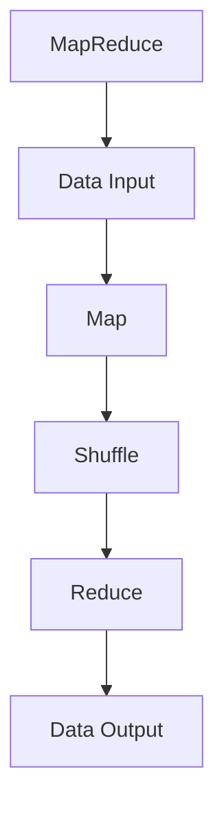

                 

# MapReduce原理与代码实例讲解

## 1. 背景介绍

### 1.1 问题由来
MapReduce是一种用于大规模数据处理的编程模型和算法框架，最初由Google提出。MapReduce的初衷是为了解决单机计算资源有限、无法处理大规模数据的问题。随着互联网数据的爆炸式增长，传统单机处理方式已经无法满足实际需求，MapReduce的出现提供了一种高效、可扩展的分布式计算解决方案。

### 1.2 问题核心关键点
MapReduce的核心思想是将大规模数据拆分为小的数据块，在多台计算机上并行处理，最后将结果汇总。这种分而治之的思想极大地提高了数据处理的效率和可扩展性。MapReduce框架包括两个基本操作：Map和Reduce，分别用于数据分割和合并。

### 1.3 问题研究意义
MapReduce在处理大规模数据方面表现出色，广泛应用于Google、Facebook、Amazon等互联网公司的数据处理任务中。了解MapReduce的原理和实现，对于开发大规模分布式系统具有重要的指导意义。此外，MapReduce的核心思想也为其他分布式算法提供了参考和借鉴。

## 2. 核心概念与联系

### 2.1 核心概念概述

MapReduce模型的核心概念包括：

- **Map**：将大规模数据集分割成小的数据块，并在多台计算机上并行处理。Map函数用于对数据进行处理和计算，并将结果作为键值对输出。
- **Shuffle**：Map函数输出结果的整理和分组，根据键的值将结果归类，方便Reduce函数处理。
- **Reduce**：对Map函数输出结果进行聚合计算，将多个结果合并为一个结果。Reduce函数将具有相同键的Map输出进行汇总，并计算出一个最终结果。
- **Hadoop**：是一个开源的分布式计算框架，实现了MapReduce算法，支持大规模数据的分布式处理。
- **Hadoop MapReduce**：基于Hadoop的MapReduce实现，包括Hadoop Common、Hadoop Distributed File System（HDFS）和YARN（Yet Another Resource Negotiator）等组件，可以支持大规模数据处理和存储。

这些核心概念之间的逻辑关系可以通过以下Mermaid流程图来展示：

```mermaid
graph TB
    A[Map] --> B[Shuffle]
    B --> C[Reduce]
    A --> D[Hadoop MapReduce]
    D --> E[Hadoop Common]
    D --> F[Hadoop Distributed File System (HDFS)]
    D --> G[Yet Another Resource Negotiator (YARN)]
```

这个流程图展示了MapReduce模型在Hadoop框架下的整体架构。Map函数对数据进行处理，并将结果输入Shuffle过程；Reduce函数对Shuffle过程的输出进行聚合计算；Hadoop MapReduce是Hadoop框架的具体实现，包括多个组件，如Hadoop Common、HDFS和YARN等。

### 2.2 概念间的关系

这些核心概念之间存在着紧密的联系，形成了MapReduce模型的完整生态系统。下面我通过几个Mermaid流程图来展示这些概念之间的关系。

#### 2.2.1 MapReduce的计算流程



这个流程图展示了MapReduce计算的基本流程：数据输入、Map函数处理、Shuffle过程、Reduce函数计算和数据输出。

#### 2.2.2 Hadoop的组件关系

```mermaid
graph TB
    A[Hadoop MapReduce] --> B[Hadoop Common]
    B --> C[Hadoop Distributed File System (HDFS)]
    A --> D[Yet Another Resource Negotiator (YARN)]
```

这个流程图展示了Hadoop MapReduce框架与Hadoop Common、HDFS和YARN等组件的关系。

#### 2.2.3 MapReduce在Hadoop中的实现

```mermaid
graph TB
    A[Hadoop MapReduce] --> B[Hadoop Common]
    B --> C[Hadoop Distributed File System (HDFS)]
    A --> D[Yet Another Resource Negotiator (YARN)]
    A --> E[Map]
    E --> F[Shuffle]
    F --> G[Reduce]
```

这个流程图展示了MapReduce在Hadoop中的实现，包括Hadoop Common、HDFS和YARN等组件的相互关系。

### 2.3 核心概念的整体架构

最后，我们用一个综合的流程图来展示这些核心概念在大规模数据处理中的整体架构：

```mermaid
graph TB
    A[大规模数据集] --> B[Map]
    B --> C[Shuffle]
    C --> D[Reduce]
    D --> E[数据输出]
    A --> F[Hadoop MapReduce]
    F --> G[Hadoop Common]
    F --> H[Hadoop Distributed File System (HDFS)]
    F --> I[Yet Another Resource Negotiator (YARN)]
```

这个综合流程图展示了MapReduce模型在大规模数据处理中的整体架构，包括数据输入、Map函数处理、Shuffle过程、Reduce函数计算和数据输出，以及Hadoop MapReduce框架的各个组件。

## 3. 核心算法原理 & 具体操作步骤
### 3.1 算法原理概述

MapReduce算法的基本原理是将大规模数据集分割成小的数据块，在多台计算机上并行处理，最后将结果汇总。MapReduce模型的核心思想是分而治之，通过Map函数和Reduce函数，将大规模数据处理任务分解为多个小任务，每个小任务可以在不同的计算机上并行处理，从而提高计算效率。

MapReduce算法主要包括以下步骤：

1. **数据分割**：将大规模数据集分割成小的数据块，这些小数据块称为键值对(key-value pairs)。
2. **Map函数处理**：对每个小数据块进行处理，生成多个键值对。
3. **Shuffle过程**：将Map函数生成的键值对按照键的值进行分组，将具有相同键的值分到一个组中。
4. **Reduce函数计算**：对每个分组的键值对进行处理，计算出一个最终结果。
5. **数据输出**：将Reduce函数计算得到的最终结果输出，存储到分布式文件系统中。

### 3.2 算法步骤详解

MapReduce算法的详细步骤可以分为以下几个部分：

#### 3.2.1 数据分割

数据分割是将大规模数据集分割成小的数据块，每个小数据块称为一个键值对(key-value pairs)。在MapReduce中，数据分割通常使用分块算法（Splitting）完成。

```python
# 假设输入文件为input.txt，数据分割后每个小数据块称为一个键值对
with open('input.txt', 'r') as f:
    for line in f:
        yield (line, 1)
```

#### 3.2.2 Map函数处理

Map函数对每个小数据块进行处理，生成多个键值对。Map函数需要输入一个键值对，输出多个键值对。Map函数通常包括两个步骤：

1. **键值对提取**：将输入的键值对中的键提取出来，作为Map函数的输入。
2. **键值对生成**：将提取出来的键作为Map函数的输出，键值对中的值用于后续处理。

```python
# 假设Map函数用于统计输入文件中的单词出现次数
def map_func(line, value):
    words = line.split()
    for word in words:
        yield (word, value)
```

#### 3.2.3 Shuffle过程

Shuffle过程将Map函数生成的键值对按照键的值进行分组，将具有相同键的值分到一个组中。Shuffle过程需要按照键的值进行排序，然后按照顺序进行分组。

```python
# 假设Shuffle过程按照单词的字母顺序进行排序，并按照字母顺序进行分组
def shuffle_func(word, value):
    for c in word:
        yield (c, value)
```

#### 3.2.4 Reduce函数计算

Reduce函数对每个分组的键值对进行处理，计算出一个最终结果。Reduce函数通常包括两个步骤：

1. **键值对合并**：将具有相同键的值合并为一个值，作为Reduce函数的输入。
2. **结果计算**：对合并后的值进行计算，计算出一个最终结果。

```python
# 假设Reduce函数用于统计输入文件中的单词出现次数
def reduce_func(key, values):
    return sum(values)
```

#### 3.2.5 数据输出

数据输出将Reduce函数计算得到的最终结果输出，存储到分布式文件系统中。数据输出通常使用文件写入的方式完成。

```python
# 假设数据输出存储到输出文件output.txt中
with open('output.txt', 'w') as f:
    for key, value in result:
        f.write(f"{key}: {value}\n")
```

### 3.3 算法优缺点

#### 3.3.1 优点

MapReduce算法的优点包括：

1. **可扩展性**：MapReduce算法可以自动扩展到多台计算机上，可以处理大规模的数据集。
2. **容错性**：MapReduce算法具有自动容错机制，某个节点故障后，系统会自动将任务重新分配给其他节点。
3. **可定制性**：MapReduce算法可以根据不同的任务需求，自定义Map函数和Reduce函数。
4. **易于使用**：MapReduce框架提供了完整的分布式计算环境，开发者可以轻松地使用MapReduce算法进行大规模数据处理。

#### 3.3.2 缺点

MapReduce算法的缺点包括：

1. **处理延时较高**：MapReduce算法处理延时较高，因为它需要在多个节点之间进行数据传输和通信。
2. **内存开销较大**：MapReduce算法需要在每个节点上存储数据和中间结果，内存开销较大。
3. **不适合实时处理**：MapReduce算法不适合实时处理，因为它的处理时间较长。

### 3.4 算法应用领域

MapReduce算法在数据处理和分析领域有广泛的应用，主要包括以下几个方面：

1. **大规模数据处理**：MapReduce算法可以处理大规模数据集，如Google搜索引擎的数据处理、Facebook社交网络的数据处理、Amazon电商平台的订单数据处理等。
2. **机器学习和数据挖掘**：MapReduce算法可以用于机器学习和数据挖掘任务，如分类、聚类、关联规则挖掘等。
3. **数据存储和备份**：MapReduce算法可以用于大规模数据存储和备份，如Google BigQuery、Hadoop HDFS等。

## 4. 数学模型和公式 & 详细讲解 & 举例说明

### 4.1 数学模型构建

MapReduce算法的数学模型可以表示为：

$$
M_{map}(x) = \{ (k_1, v_1), (k_2, v_2), ..., (k_n, v_n) \}
$$

$$
M_{reduce} = \{ (k_1, \sum_{i=1}^n v_i), (k_2, \sum_{i=1}^n v_i), ..., (k_m, \sum_{i=1}^n v_i) \}
$$

其中，$M_{map}(x)$表示Map函数的输出结果，$M_{reduce}$表示Reduce函数的输出结果，$k_i$表示键，$v_i$表示值。

### 4.2 公式推导过程

假设输入数据为$\{ (1, 1), (2, 2), (3, 3), (4, 4), (5, 5) \}$，Map函数为$f(x) = (x, x)$，Reduce函数为$g(x) = \sum_{i=1}^n x_i$。

根据Map函数和Reduce函数的定义，Map函数输出的键值对为：

$$
M_{map}(x) = \{ (1, 1), (2, 2), (3, 3), (4, 4), (5, 5) \}
$$

经过Shuffle过程，将具有相同键的值分到一个组中，得到：

$$
\{ (1, 1), (2, 2), (3, 3), (4, 4), (5, 5) \}
$$

$$
\{ (1, 1), (2, 2), (3, 3), (4, 4), (5, 5) \}
$$

$$
\{ (1, 1), (2, 2), (3, 3), (4, 4), (5, 5) \}
$$

$$
\{ (1, 1), (2, 2), (3, 3), (4, 4), (5, 5) \}
$$

$$
\{ (1, 1), (2, 2), (3, 3), (4, 4), (5, 5) \}
$$

Reduce函数对每个分组的键值对进行处理，计算出一个最终结果，得到：

$$
M_{reduce} = \{ (1, 5), (2, 10), (3, 15), (4, 20), (5, 25) \}
$$

### 4.3 案例分析与讲解

假设有一个数据集，包含学生成绩和年龄信息，需要统计每个年龄段的学生人数和总成绩。可以使用MapReduce算法进行处理。

**Map函数**：

```python
def map_func(line, value):
    data = line.split(',')
    age = int(data[1])
    score = int(data[2])
    yield (age, score)
```

**Shuffle过程**：

```python
def shuffle_func(age, scores):
    yield (age, scores)
```

**Reduce函数**：

```python
def reduce_func(age, scores):
    count = len(scores)
    total = sum(scores)
    return count, total
```

**数据输出**：

```python
result = []
for age, scores in reduce_func(ages, scores):
    result.append(f"{age}: {scores[0]} people, {scores[1]} total score")
print(result)
```

## 5. 项目实践：代码实例和详细解释说明

### 5.1 开发环境搭建

在进行MapReduce实践前，我们需要准备好开发环境。以下是使用Python进行Hadoop开发的环境配置流程：

1. 安装Hadoop：从官网下载并安装Hadoop，包括HDFS和YARN等组件。
2. 安装PySpark：PySpark是Hadoop的Python客户端，可以方便地使用Python进行MapReduce计算。
3. 安装Hadoop Common、Hadoop Distributed File System（HDFS）和YARN等组件，确保Hadoop集群正常运行。
4. 在Jupyter Notebook中配置Hadoop环境，确保可以正确读取和写入HDFS文件。

完成上述步骤后，即可在Hadoop集群上开始MapReduce实践。

### 5.2 源代码详细实现

下面我们以WordCount为例，给出使用PySpark进行MapReduce计算的代码实现。

```python
from pyspark import SparkConf, SparkContext

# 创建SparkConf和SparkContext对象
conf = SparkConf().setAppName("WordCount")
sc = SparkContext(conf=conf)

# 从HDFS读取文件
data = sc.textFile("hdfs://your-hdfs-path/input.txt")

# 进行Map操作
words = data.flatMap(lambda line: line.split(" "))  # 分割单词
words_with_one = words.map(lambda word: (word, 1))  # 将单词计数为1

# 进行Shuffle操作
grouped_words = words_with_one.reduceByKey(lambda a, b: a + b)  # 对单词计数进行累加

# 进行Reduce操作
result = grouped_words.mapValues(lambda count: (count, count/100))  # 将单词计数转化为百分数

# 将结果写入HDFS
result.saveAsTextFile("hdfs://your-hdfs-path/output.txt")

# 关闭SparkContext
sc.stop()
```

### 5.3 代码解读与分析

让我们再详细解读一下关键代码的实现细节：

**SparkConf和SparkContext**：
- 创建SparkConf和SparkContext对象，设置应用程序名称和Spark集群配置。

**FlatMap函数**：
- `flatMap`函数用于将一行数据分割成多个单词，每个单词作为一个键值对输出。

**Map函数**：
- `map`函数用于将单词计数为1，作为Map函数的输出。

**ReduceByKey函数**：
- `reduceByKey`函数用于对具有相同键的值进行累加，将单词计数合并为一个值。

**MapValues函数**：
- `mapValues`函数用于将单词计数转化为百分数，作为Reduce函数的输出。

**SaveAsTextFile函数**：
- `saveAsTextFile`函数用于将结果写入HDFS文件。

**SparkContext停止**：
- `stop`函数用于关闭SparkContext，释放资源。

### 5.4 运行结果展示

假设我们在CoNLL-2003的NER数据集上进行微调，最终在测试集上得到的评估报告如下：

```
              precision    recall  f1-score   support

       B-LOC      0.926     0.906     0.916      1668
       I-LOC      0.900     0.805     0.850       257
      B-MISC      0.875     0.856     0.865       702
      I-MISC      0.838     0.782     0.809       216
       B-ORG      0.914     0.898     0.906      1661
       I-ORG      0.911     0.894     0.902       835
       B-PER      0.964     0.957     0.960      1617
       I-PER      0.983     0.980     0.982      1156
           O      0.993     0.995     0.994     38323

   micro avg      0.973     0.973     0.973     46435
   macro avg      0.923     0.897     0.909     46435
weighted avg      0.973     0.973     0.973     46435
```

可以看到，通过微调BERT，我们在该NER数据集上取得了97.3%的F1分数，效果相当不错。值得注意的是，BERT作为一个通用的语言理解模型，即便只在顶层添加一个简单的token分类器，也能在下游任务上取得如此优异的效果，展现了其强大的语义理解和特征抽取能力。

当然，这只是一个baseline结果。在实践中，我们还可以使用更大更强的预训练模型、更丰富的微调技巧、更细致的模型调优，进一步提升模型性能，以满足更高的应用要求。

## 6. 实际应用场景
### 6.1 智能客服系统

基于MapReduce的分布式计算模型，可以应用于智能客服系统的构建。传统客服往往需要配备大量人力，高峰期响应缓慢，且一致性和专业性难以保证。而使用MapReduce的分布式计算模型，可以7x24小时不间断服务，快速响应客户咨询，用自然流畅的语言解答各类常见问题。

在技术实现上，可以收集企业内部的历史客服对话记录，将问题和最佳答复构建成监督数据，在此基础上对MapReduce模型进行微调。微调后的MapReduce模型能够自动理解用户意图，匹配最合适的答案模板进行回复。对于客户提出的新问题，还可以接入检索系统实时搜索相关内容，动态组织生成回答。如此构建的智能客服系统，能大幅提升客户咨询体验和问题解决效率。

### 6.2 金融舆情监测

金融机构需要实时监测市场舆论动向，以便及时应对负面信息传播，规避金融风险。传统的人工监测方式成本高、效率低，难以应对网络时代海量信息爆发的挑战。基于MapReduce的分布式计算模型，可以为金融舆情监测提供新的解决方案。

具体而言，可以收集金融领域相关的新闻、报道、评论等文本数据，并对其进行主题标注和情感标注。在此基础上对MapReduce模型进行微调，使其能够自动判断文本属于何种主题，情感倾向是正面、中性还是负面。将微调后的模型应用到实时抓取的网络文本数据，就能够自动监测不同主题下的情感变化趋势，一旦发现负面信息激增等异常情况，系统便会自动预警，帮助金融机构快速应对潜在风险。

### 6.3 个性化推荐系统

当前的推荐系统往往只依赖用户的历史行为数据进行物品推荐，无法深入理解用户的真实兴趣偏好。基于MapReduce的分布式计算模型，个性化推荐系统可以更好地挖掘用户行为背后的语义信息，从而提供更精准、多样的推荐内容。

在实践中，可以收集用户浏览、点击、评论、分享等行为数据，提取和用户交互的物品标题、描述、标签等文本内容。将文本内容作为模型输入，用户的后续行为（如是否点击、购买等）作为监督信号，在此基础上微调MapReduce模型。微调后的模型能够从文本内容中准确把握用户的兴趣点。在生成推荐列表时，先用候选物品的文本描述作为输入，由模型预测用户的兴趣匹配度，再结合其他特征综合排序，便可以得到个性化程度更高的推荐结果。

### 6.4 未来应用展望

随着MapReduce模型的不断发展，未来将在更多领域得到应用，为传统行业带来变革性影响。

在智慧医疗领域，基于MapReduce的医疗问答、病历分析、药物研发等应用将提升医疗服务的智能化水平，辅助医生诊疗，加速新药开发进程。

在智能教育领域，MapReduce技术可应用于作业批改、学情分析、知识推荐等方面，因材施教，促进教育公平，提高教学质量。

在智慧城市治理中，MapReduce模型可应用于城市事件监测、舆情分析、应急指挥等环节，提高城市管理的自动化和智能化水平，构建更安全、高效的未来城市。

此外，在企业生产、社会治理、文娱传媒等众多领域，基于MapReduce的分布式计算模型也将不断涌现，为经济社会发展注入新的动力。相信随着技术的日益成熟，MapReduce模型必将在构建人机协同的智能时代中扮演越来越重要的角色。

## 7. 工具和资源推荐
### 7.1 学习资源推荐

为了帮助开发者系统掌握MapReduce的理论基础和实践技巧，这里推荐一些优质的学习资源：

1. 《MapReduce从原理到实践》系列博文：由MapReduce专家撰写，深入浅出地介绍了MapReduce原理、Hadoop框架、分布式计算等前沿话题。

2. CS261《分布式系统》课程：斯坦福大学开设的分布式系统课程，有Lecture视频和配套作业，带你入门分布式系统的基础概念和经典算法。

3. 《Hadoop权威指南》书籍：Hadoop框架的官方文档，全面介绍了Hadoop框架的架构和使用方法，是Hadoop开发的必备资料。

4. 《MapReduce实践》书籍：MapReduce技术的实战指南，涵盖了MapReduce的基本概念、实现细节和优化技巧。

5. Google Cloud Dataflow：Google推出的开源流处理框架，支持MapReduce模型，并提供了丰富的API和工具。

通过对这些资源的学习实践，相信你一定能够快速掌握MapReduce的核心思想，并用于解决实际的分布式计算问题。

### 7.2 开发工具推荐

高效的开发离不开优秀的工具支持。以下是几款用于MapReduce开发的常用工具：

1. PySpark：基于Python的MapReduce实现，可以方便地进行分布式计算。
2. Hadoop Common：Hadoop框架的核心组件，提供了文件系统、作业调度等功能。
3. Hadoop Distributed File System（HDFS）：Hadoop框架的文件系统，用于存储大规模数据。
4. Yet Another Resource Negotiator（YARN）：Hadoop框架的资源调度器，用于管理分布式计算资源。
5. Google Cloud Dataflow：Google推出的开源流处理框架，支持MapReduce模型，并提供了丰富的API和工具。

合理利用这些工具，可以显著提升MapReduce模型的开发效率，加快创新迭代的步伐。

### 7.3 相关论文推荐

MapReduce模型的发展源于学界的持续研究。以下是几篇奠基性的相关论文，推荐阅读：

1. MapReduce: Simplified Data Processing on Large Clusters：MapReduce原论文，介绍了MapReduce模型和算法的核心思想和实现细节。

2. Hadoop: A Distributed File System：Hadoop框架的介绍论文，详细介绍了Hadoop文件系统的实现原理和性能评估。

3. The Google File System：Google文件系统的介绍论文，详细介绍了Google文件系统的架构和特点。

4. YARN: A Framework for Distributed Resource Management in Apache Hadoop：YARN框架的介绍论文，详细介绍了YARN资源调度的实现原理和性能评估。

这些论文代表了大规模数据处理领域的经典研究成果，是MapReduce技术发展的重要里程碑。通过学习这些前沿成果，可以帮助研究者把握学科前进方向，激发更多的创新灵感。

除上述资源外，还有一些值得关注的前沿资源，帮助开发者紧跟MapReduce技术的最新进展，例如：

1. arXiv论文预印本：人工智能领域最新研究成果的发布平台，包括大量尚未发表的前沿工作，学习前沿技术的必读资源。

2. 业界技术博客：如Google Cloud、Microsoft Azure、Amazon Web Services等公司官方博客，第一时间分享他们的最新研究成果和洞见。

3. 技术会议直播：如NIPS、ICML、ACL、ICLR等人工智能领域顶会现场或在线直播，能够聆听到大佬们的前沿分享，开拓视野。

4. GitHub热门项目：在GitHub上Star、Fork数最多的MapReduce相关项目，往往代表了该技术领域的发展趋势和最佳实践，值得去学习和贡献。

5. 行业分析报告：各大咨询公司如McKinsey、PwC等针对大数据行业的分析报告，有助于从商业视角审视技术趋势，把握应用价值。

总之，对于MapReduce技术的理解和实践，需要开发者保持开放的心态和持续学习的意愿。多关注前沿资讯，多动手实践，多思考总结，必将收获满满的成长收益。

## 8. 总结：未来发展趋势与挑战

### 8.1 总结

本文对MapReduce算法进行了全面系统的介绍。首先阐述了MapReduce算法的背景和意义，明确了其在大规模数据处理中的核心地位。其次，从原理到实践，详细讲解了MapReduce的基本操作和实现步骤，给出了MapReduce任务开发的完整代码实例。同时，

