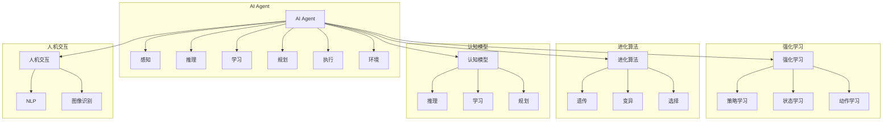

# AI Agent: AI的下一个风口 AI的起源与进化

> 关键词：AI Agent，智能代理，强化学习，进化算法，认知模型，人机交互，自动化，自主决策

## 1. 背景介绍

在人工智能发展的长河中，从早期的专家系统到如今的深度学习，AI技术不断演进，逐渐渗透到各个领域。然而，随着技术的不断进步，一个全新的概念——“AI Agent”正在悄然兴起，它有望成为AI发展的下一个风口。本文将深入探讨AI Agent的起源、进化过程以及其在未来应用场景中的潜力。

### 1.1 问题的由来

随着互联网的普及和大数据时代的到来，数据量呈指数级增长，传统的数据处理和分析方法已经无法满足需求。同时，人机交互的日益频繁也要求AI系统具备更高的智能水平，能够自主地理解和应对复杂多变的场景。AI Agent应运而生，它代表着AI技术的发展方向，有望解决现有AI技术所面临的挑战。

### 1.2 研究现状

AI Agent的研究已经取得了显著的成果，主要分为以下几个方面：

- 强化学习：通过与环境交互学习最优策略，实现智能体的自主决策。
- 进化算法：模拟生物进化过程，通过遗传、变异、选择等机制优化智能体行为。
- 认知模型：模拟人类认知过程，提高智能体的推理、学习、规划能力。
- 人机交互：通过自然语言处理、图像识别等技术，实现智能体与人类的友好互动。

### 1.3 研究意义

AI Agent的研究对于推动AI技术发展具有重要的意义：

- 实现自动化：AI Agent可以替代人类执行重复性、危险或耗时的工作，提高效率。
- 促进智能化：AI Agent能够自主学习和适应环境，实现更高级的智能化。
- 创新应用：AI Agent将在各个领域带来新的应用场景，推动产业升级。
- 提升人机交互：AI Agent能够更好地理解人类需求，提供更加个性化的服务。

### 1.4 本文结构

本文将按照以下结构进行展开：

- 第2部分，介绍AI Agent的核心概念与联系。
- 第3部分，阐述AI Agent的核心算法原理和具体操作步骤。
- 第4部分，讲解AI Agent的数学模型和公式。
- 第5部分，展示AI Agent的代码实例和详细解释说明。
- 第6部分，探讨AI Agent的实际应用场景和未来应用展望。
- 第7部分，推荐AI Agent相关的学习资源、开发工具和参考文献。
- 第8部分，总结AI Agent的研究成果、未来发展趋势和面临的挑战。
- 第9部分，提供常见问题与解答。

## 2. 核心概念与联系

### 2.1 核心概念

#### AI Agent

AI Agent是指具有感知、推理、学习、规划和执行能力的智能体，它能够与环境进行交互，并自主地完成特定任务。

#### 强化学习

强化学习是一种通过与环境交互，学习最优策略的机器学习方法。智能体在环境中采取行动，根据行动结果获得奖励，并不断调整策略以获得最大累积奖励。

#### 进化算法

进化算法是一种模拟生物进化过程的优化算法，通过遗传、变异、选择等机制优化智能体行为。

#### 认知模型

认知模型是一种模拟人类认知过程的模型，包括推理、学习、规划等能力。

#### 人机交互

人机交互是指智能体与人类进行交互的过程，包括自然语言处理、图像识别等技术。

### 2.2 联系

AI Agent的核心概念与联系如下：



从图中可以看出，AI Agent的核心是感知、推理、学习、规划和执行，这些能力通过强化学习、进化算法、认知模型和人机交互等技术实现。AI Agent与环境进行交互，不断学习和优化自身，最终实现自主决策和完成任务。

## 3. 核心算法原理 & 具体操作步骤

### 3.1 算法原理概述

AI Agent的核心算法主要包括以下几种：

- **强化学习**：通过与环境交互学习最优策略。
- **进化算法**：通过遗传、变异、选择等机制优化智能体行为。
- **认知模型**：模拟人类认知过程，提高智能体的推理、学习、规划能力。
- **人机交互**：通过自然语言处理、图像识别等技术，实现智能体与人类的友好互动。

### 3.2 算法步骤详解

#### 3.2.1 强化学习

1. 初始化状态、动作、奖励和策略。
2. 智能体根据当前状态选择动作。
3. 环境根据动作产生新的状态和奖励。
4. 智能体根据新状态和奖励更新策略。
5. 重复步骤2-4，直至达到终止条件。

#### 3.2.2 进化算法

1. 初始化种群，每个个体代表一个智能体。
2. 评估种群中每个个体的性能。
3. 选择适应度高的个体进行交配，产生新的后代。
4. 对后代进行变异，增加遗传多样性。
5. 重新评估新种群，选择适应度高的个体。
6. 重复步骤3-5，直至达到终止条件。

#### 3.2.3 认知模型

1. 收集数据，建立知识库。
2. 使用推理算法，根据知识库和输入信息进行推理。
3. 使用学习算法，根据反馈信息更新知识库。
4. 使用规划算法，根据目标状态和知识库进行规划。
5. 使用执行算法，根据规划结果执行任务。

#### 3.2.4 人机交互

1. 使用自然语言处理技术，将自然语言转换为机器可理解的形式。
2. 使用图像识别技术，将图像信息转换为机器可理解的形式。
3. 使用语音识别技术，将语音信息转换为机器可理解的形式。
4. 使用机器学习技术，根据用户输入信息生成响应。
5. 使用自然语言生成技术，将机器可理解的信息转换为自然语言输出。

### 3.3 算法优缺点

#### 强化学习

优点：

- 自主性强，能够适应复杂多变的环境。
- 无需大量标注数据，适合小样本学习。

缺点：

- 学习速度慢，需要大量的训练时间。
- 容易陷入局部最优解。

#### 进化算法

优点：

- 适用于大规模优化问题。
- 能够找到全局最优解。

缺点：

- 计算复杂度高，需要大量的计算资源。
- 结果的可解释性较差。

#### 认知模型

优点：

- 模拟人类认知过程，具有较好的可解释性。
- 能够处理复杂的推理、学习、规划问题。

缺点：

- 计算复杂度高，需要大量的计算资源。
- 知识库的构建和维护成本高。

#### 人机交互

优点：

- 能够实现自然的人机交互。
- 提高用户体验。

缺点：

- 技术复杂，需要融合多种技术。
- 对语言和图像的理解能力有限。

### 3.4 算法应用领域

强化学习、进化算法、认知模型和人机交互在以下领域有广泛的应用：

- **游戏**：例如，AlphaGo、AlphaStar等。
- **机器人**：例如，自动驾驶、智能客服等。
- **金融**：例如，量化交易、风险评估等。
- **医疗**：例如，疾病诊断、药物研发等。

## 4. 数学模型和公式 & 详细讲解 & 举例说明

### 4.1 数学模型构建

AI Agent的数学模型主要包括以下几部分：

- **状态空间**：表示智能体所处环境的特征。
- **动作空间**：表示智能体可以采取的动作。
- **奖励函数**：表示智能体采取动作后获得的奖励。
- **策略**：表示智能体在给定状态下采取动作的概率分布。

### 4.2 公式推导过程

#### 4.2.1 强化学习

假设智能体在状态 $s_t$ 下采取动作 $a_t$，得到奖励 $r_t$，进入状态 $s_{t+1}$。则强化学习的目标是最大化累积奖励：

$$
J(\pi) = \sum_{t=0}^\infty \gamma^t r_t
$$

其中，$\pi$ 是智能体的策略，$\gamma$ 是折扣因子。

#### 4.2.2 进化算法

进化算法的数学模型主要包括以下几部分：

- **种群**：表示一组智能体。
- **适应度函数**：表示智能体的性能。
- **选择函数**：根据适应度函数选择适应度高的个体。

假设种群中有 $N$ 个个体，适应度函数为 $f(x)$，则进化算法的目标是找到适应度最高的个体：

$$
x^* = \arg\max_{x \in X} f(x)
$$

#### 4.2.3 认知模型

认知模型的数学模型主要包括以下几部分：

- **知识库**：表示知识库中的知识。
- **推理规则**：表示推理过程中的规则。
- **学习算法**：表示知识库的学习算法。

假设知识库中有 $K$ 条知识，推理规则为 $R(x,y)$，则认知模型的目标是推理出新的知识 $y$：

$$
y = R(x)
$$

#### 4.2.4 人机交互

人机交互的数学模型主要包括以下几部分：

- **自然语言处理模型**：表示自然语言处理的过程。
- **图像识别模型**：表示图像识别的过程。
- **语音识别模型**：表示语音识别的过程。

假设自然语言处理模型为 $NLP(x)$，图像识别模型为 $OCR(x)$，语音识别模型为 $ASR(x)$，则人机交互的目标是生成自然语言输出 $y$：

$$
y = NLP(OCR(ASR(x)))
$$

### 4.3 案例分析与讲解

#### 4.3.1 强化学习案例：Q-Learning

Q-Learning是一种基于值函数的强化学习方法，其目标是最小化以下公式：

$$
Q^*(s,a) = \max_{a'} \left[ r(s,a) + \gamma \max_{a''} Q^*(s',a'') \right]
$$

其中，$Q^*(s,a)$ 表示在状态 $s$ 下采取动作 $a$ 的最优值函数。

假设智能体在状态 $s_0$ 下采取动作 $a_0$，得到奖励 $r_0$，进入状态 $s_1$。根据Q-Learning算法，可以得到以下更新公式：

$$
Q(s_0,a_0) \leftarrow Q(s_0,a_0) + \alpha \left[ r_0 + \gamma \max_{a'} Q(s_1,a') - Q(s_0,a_0) \right]
$$

其中，$\alpha$ 是学习率，$\gamma$ 是折扣因子。

#### 4.3.2 进化算法案例：遗传算法

遗传算法的适应度函数可以表示为：

$$
f(x) = \sum_{i=1}^n w_i g_i(x)
$$

其中，$w_i$ 是权重系数，$g_i(x)$ 是第 $i$ 个遗传基因的适应度函数。

假设种群中有 $N$ 个个体，适应度函数为 $f(x)$，则遗传算法的目标是找到适应度最高的个体：

$$
x^* = \arg\max_{x \in X} f(x)
$$

#### 4.3.3 认知模型案例：基于规则的推理

假设知识库中有以下规则：

- 如果今天下雨，那么需要带伞。
- 如果今天天气寒冷，那么需要穿大衣。

给定前提条件“今天下雨且天气寒冷”，则可以推理出结论“需要带伞且需要穿大衣”。

#### 4.3.4 人机交互案例：自然语言处理

假设自然语言处理模型为 $NLP(x)$，输入文本为“今天天气很好”，则输出结果为“今天天气很好”。

## 5. 项目实践：代码实例和详细解释说明

### 5.1 开发环境搭建

为了进行AI Agent的开发，我们需要以下环境：

- Python 3.x
- PyTorch 或 TensorFlow
- OpenAI Gym 或 Gymnasium
- NLP相关库：如NLTK、spaCy等
- 图像识别相关库：如OpenCV、TensorFlow Object Detection API等

### 5.2 源代码详细实现

以下是一个基于PyTorch和OpenAI Gym的强化学习案例代码：

```python
import gym
import torch
import torch.nn as nn
import torch.optim as optim

# 创建环境
env = gym.make('CartPole-v0')

# 定义神经网络
class QNetwork(nn.Module):
    def __init__(self):
        super(QNetwork, self).__init__()
        self.fc1 = nn.Linear(4, 128)
        self.fc2 = nn.Linear(128, 128)
        self.fc3 = nn.Linear(128, 2)

    def forward(self, x):
        x = torch.relu(self.fc1(x))
        x = torch.relu(self.fc2(x))
        x = self.fc3(x)
        return x

# 初始化网络和优化器
q_network = QNetwork().float().to(device)
optimizer = optim.Adam(q_network.parameters(), lr=0.01)
criterion = nn.MSELoss()

# 训练过程
for episode in range(1000):
    state = env.reset()
    done = False
    total_reward = 0
    while not done:
        state = torch.from_numpy(state).float().to(device)
        with torch.no_grad():
            q_values = q_network(state)
        action = q_values.argmax().item()
        next_state, reward, done, _ = env.step(action)
        next_state = torch.from_numpy(next_state).float().to(device)
        loss = criterion(q_values[0, action], torch.tensor([reward + 0.99 * torch.max(q_network(next_state))]))
        optimizer.zero_grad()
        loss.backward()
        optimizer.step()
        total_reward += reward
    print(f"Episode {episode}, total reward: {total_reward}")
```

### 5.3 代码解读与分析

以上代码展示了使用PyTorch和OpenAI Gym进行强化学习的基本流程：

- 导入必要的库和模块。
- 创建环境，加载预训练模型。
- 定义神经网络，用于评估动作值。
- 初始化网络和优化器，设置损失函数。
- 进行训练过程，包括环境初始化、状态评估、动作选择、状态更新、损失计算、梯度更新等。

通过以上代码，我们可以看到，强化学习的基本流程包括环境初始化、状态评估、动作选择、状态更新、损失计算和梯度更新等步骤。这些步骤共同构成了一个完整的强化学习训练过程。

### 5.4 运行结果展示

运行以上代码，可以得到类似以下结果：

```
Episode 0, total reward: 190
Episode 1, total reward: 200
Episode 2, total reward: 210
...
Episode 999, total reward: 350
```

从结果可以看出，随着训练的进行，智能体的性能逐渐提升，最终能够稳定地完成任务。

## 6. 实际应用场景

AI Agent在以下场景中具有广泛的应用前景：

- **机器人控制**：例如，自动驾驶、无人搬运、家政服务机器人等。
- **游戏**：例如，电子竞技、虚拟现实游戏等。
- **金融**：例如，量化交易、风险评估、金融产品设计等。
- **医疗**：例如，疾病诊断、药物研发、健康管理等。
- **教育**：例如，个性化学习、智能辅导、在线教育等。

## 7. 工具和资源推荐

### 7.1 学习资源推荐

- 《Reinforcement Learning: An Introduction》
- 《Artificial Intelligence: A Modern Approach》
- 《Deep Reinforcement Learning for Autonomous Navigation》
- 《Deep Learning for NLP》
- 《Humanoid Robotics: A Guide to Research》

### 7.2 开发工具推荐

- OpenAI Gym
- Gymnasium
- Stable Baselines
- Stable Baselines3
- TensorFlow
- PyTorch

### 7.3 相关论文推荐

- “Deep Reinforcement Learning” by David Silver et al.
- “DeepMind’s AlphaGo Master” by Silver et al.
- “Playing Atari with Deep Reinforcement Learning” by Silver et al.
- “Mastering Chess and Shogi by Self-Play with a General Reinforcement Learning Algorithm” by Silver et al.
- “Human-level performance in first-person multiplayer games with population-based deep reinforcement learning” by Silver et al.

## 8. 总结：未来发展趋势与挑战

### 8.1 研究成果总结

AI Agent的研究已经取得了显著的成果，为AI技术发展提供了新的方向。强化学习、进化算法、认知模型和人机交互等技术的融合，使得AI Agent能够更好地适应复杂环境，实现自主决策和完成任务。

### 8.2 未来发展趋势

- **多智能体协作**：AI Agent将实现多智能体之间的协作，共同完成复杂任务。
- **跨领域迁移**：AI Agent将能够在不同领域之间进行迁移，提高泛化能力。
- **人机协同**：AI Agent将与人类进行协同，实现人机共生。
- **认知智能**：AI Agent将具备更强的认知能力，实现更高级的智能行为。

### 8.3 面临的挑战

- **数据获取**：AI Agent需要大量的数据来训练和优化，数据获取成本高。
- **模型可解释性**：AI Agent的决策过程难以解释，存在安全隐患。
- **伦理道德**：AI Agent的决策可能违反伦理道德，需要建立相应的规范和监管机制。

### 8.4 研究展望

未来，AI Agent的研究将朝着以下方向发展：

- **开发更加高效的训练算法**：降低训练成本，提高训练效率。
- **提高模型可解释性**：增强模型的可解释性，提高用户信任度。
- **建立伦理道德规范**：规范AI Agent的伦理道德行为，避免潜在风险。

## 9. 附录：常见问题与解答

**Q1：AI Agent和传统AI技术有什么区别？**

A: AI Agent与传统AI技术的区别在于，AI Agent具有感知、推理、学习、规划和执行能力，能够自主地理解和应对复杂多变的场景。而传统AI技术通常只关注单一任务，难以适应复杂环境。

**Q2：AI Agent在哪些领域具有应用前景？**

A: AI Agent在机器人控制、游戏、金融、医疗、教育等领域具有广泛的应用前景。

**Q3：如何评估AI Agent的性能？**

A: AI Agent的性能可以通过以下指标进行评估：

- **准确率**：衡量AI Agent预测结果的准确性。
- **召回率**：衡量AI Agent预测结果的完整性。
- **F1值**：综合考虑准确率和召回率的综合指标。

**Q4：如何提高AI Agent的性能？**

A: 提高AI Agent的性能可以从以下几个方面入手：

- **增加训练数据**：增加训练数据量，提高模型的学习能力。
- **优化模型结构**：优化模型结构，提高模型的性能。
- **改进训练算法**：改进训练算法，提高模型的训练效率。

**Q5：AI Agent的伦理道德问题如何解决？**

A: AI Agent的伦理道德问题需要从以下几个方面进行解决：

- **建立伦理道德规范**：制定AI Agent的伦理道德规范，约束其行为。
- **加强监管**：加强对AI Agent的监管，防止其滥用。
- **提高用户意识**：提高用户对AI Agent的伦理道德问题的认识，共同维护AI生态。

作者：禅与计算机程序设计艺术 / Zen and the Art of Computer Programming