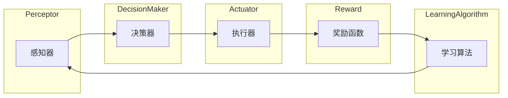

# AI Agent: AI的下一个风口 对未来的启示

> 关键词：AI Agent, 强化学习, 机器学习, 人工智能, 机器人, 自动化, 智能决策

## 1. 背景介绍

随着人工智能技术的飞速发展，从早期的专家系统到如今深度学习的广泛应用，AI已经在多个领域展现出了巨大的潜力。然而，尽管AI在图像识别、自然语言处理等领域取得了显著的成果，但真正能够自主决策、适应复杂环境的智能系统——AI Agent——仍然是一个充满挑战的领域。本文将探讨AI Agent的核心概念、原理、应用以及未来发展趋势，旨在为读者提供对AI Agent领域的深入理解和未来启示。

## 2. 核心概念与联系

### 2.1 AI Agent的定义

AI Agent是指能够在特定环境中感知状态、接收奖励、采取行动并学习如何最大化自身奖励的计算机程序。它是一种基于强化学习的智能体，通过与环境的交互不断学习和优化其行为策略。

### 2.2 AI Agent的构成

AI Agent通常由以下部分组成：

- **感知器（Perceptors）**：用于感知环境状态，如传感器、摄像头等。
- **决策器（Decision Makers）**：根据感知到的状态选择行动。
- **执行器（Actuators）**：将决策转换为实际行动，如机械臂、机器人臂等。
- **奖励函数（Reward Function）**：根据行动结果给予奖励或惩罚。
- **学习算法（Learning Algorithm）**：根据奖励函数更新决策策略。

### 2.3 Mermaid 流程图



### 2.4 AI Agent与机器学习的联系

AI Agent是机器学习领域的一个重要分支，它将机器学习的概念应用于动态环境中，通过强化学习等技术使智能体能够自主学习和适应。

## 3. 核心算法原理 & 具体操作步骤

### 3.1 算法原理概述

AI Agent的核心算法是强化学习，它通过与环境交互，学习最大化长期奖励的策略。

### 3.2 算法步骤详解

1. **环境初始化**：设置环境状态、奖励函数、智能体初始状态等。
2. **智能体选择行动**：智能体根据当前状态和策略选择行动。
3. **环境响应**：环境根据智能体的行动改变状态，并给予奖励。
4. **更新策略**：智能体根据奖励和学习算法更新策略，以便在未来的决策中取得更好的结果。
5. **重复步骤2-4**：智能体不断与环境交互，直到达到停止条件。

### 3.3 算法优缺点

#### 优点：

- **自主性**：AI Agent可以自主学习和适应环境。
- **适应性**：AI Agent可以根据不同环境调整其行为策略。
- **泛化能力**：AI Agent可以在不同环境中学习到通用的决策策略。

#### 缺点：

- **样本效率**：强化学习通常需要大量的样本才能学习到有效的策略。
- **稀疏奖励**：在某些环境中，奖励可能非常稀疏，导致学习过程缓慢。

### 3.4 算法应用领域

AI Agent在以下领域有广泛的应用：

- **游戏**：如围棋、电子竞技等。
- **机器人**：如自动驾驶、工业机器人等。
- **金融**：如股票交易、风险管理等。
- **医疗**：如疾病诊断、药物研发等。

## 4. 数学模型和公式 & 详细讲解 & 举例说明

### 4.1 数学模型构建

强化学习的基本数学模型包括：

- **状态空间（State Space）**：所有可能的状态集合。
- **动作空间（Action Space）**：所有可能动作的集合。
- **奖励函数（Reward Function）**：定义了智能体在每个状态下采取每个动作后获得的奖励。

### 4.2 公式推导过程

强化学习的主要目标是最小化长期奖励的期望值：

$$
J(\pi) = \sum_{t=0}^\infty \gamma^t R_t
$$

其中，$\pi$ 是智能体的策略，$\gamma$ 是折扣因子，$R_t$ 是在第 $t$ 个时间步获得的奖励。

### 4.3 案例分析与讲解

以自动驾驶为例，智能体的状态可以是车辆的位置、速度、方向等，动作可以是加速、减速、转向等。奖励函数可以是到达目的地的时间、行驶距离等。

## 5. 项目实践：代码实例和详细解释说明

### 5.1 开发环境搭建

1. 安装Python环境。
2. 安装PyTorch库。
3. 安装OpenAI的Gym库。

### 5.2 源代码详细实现

以下是一个使用PyTorch实现的简单强化学习案例：

```python
import gym
import torch
import torch.nn as nn
import torch.optim as optim

# 创建环境
env = gym.make("CartPole-v0")

# 定义模型
class QNetwork(nn.Module):
    def __init__(self):
        super(QNetwork, self).__init__()
        self.fc1 = nn.Linear(4, 16)
        self.fc2 = nn.Linear(16, 2)

    def forward(self, x):
        x = torch.relu(self.fc1(x))
        x = self.fc2(x)
        return x

# 初始化模型和优化器
model = QNetwork()
optimizer = optim.Adam(model.parameters(), lr=0.001)

# 训练模型
for episode in range(1000):
    state = env.reset()
    done = False
    while not done:
        action = model(torch.tensor(state, dtype=torch.float32)).argmax().item()
        next_state, reward, done, _ = env.step(action)
        optimizer.zero_grad()
        loss = (reward + 0.99 * model(torch.tensor(next_state, dtype=torch.float32)).gather(1, torch.tensor(action, dtype=torch.long)).detach() - model(torch.tensor(state, dtype=torch.float32))[0, action]).pow(2).mean()
        loss.backward()
        optimizer.step()
        state = next_state

print("Training complete.")
```

### 5.3 代码解读与分析

以上代码实现了一个简单的CartPole游戏中的Q值网络。首先，我们创建了一个CartPole游戏环境，并定义了一个具有两个输出的Q值网络。然后，我们使用Adam优化器训练模型，直到达到预设的episode数量。

### 5.4 运行结果展示

运行以上代码，模型将在CartPole游戏环境中学习到稳定的策略，使机器人能够稳定地保持平衡。

## 6. 实际应用场景

AI Agent在以下领域有广泛的应用：

- **自动驾驶**：AI Agent可以用于控制汽车在复杂环境中行驶，实现自动驾驶。
- **机器人**：AI Agent可以用于控制机器人执行各种任务，如清洁、搬运等。
- **游戏**：AI Agent可以用于设计更智能的游戏对手。
- **金融**：AI Agent可以用于自动交易、风险评估等。

## 7. 工具和资源推荐

### 7.1 学习资源推荐

- 《Reinforcement Learning: An Introduction》
- 《Deep Reinforcement Learning Hands-On》
- 《Artificial Intelligence: A Modern Approach》

### 7.2 开发工具推荐

- PyTorch
- TensorFlow
- OpenAI Gym

### 7.3 相关论文推荐

- "Deep Q-Network" by Volodymyr Mnih et al.
- "Playing Atari with Deep Reinforcement Learning" by Volodymyr Mnih et al.
- "Human-level control through deep reinforcement learning" by Volodymyr Mnih et al.

## 8. 总结：未来发展趋势与挑战

### 8.1 研究成果总结

本文介绍了AI Agent的核心概念、原理、应用以及未来发展趋势。AI Agent作为一种能够自主学习和适应环境的智能系统，在自动驾驶、机器人、游戏、金融等领域具有广泛的应用前景。

### 8.2 未来发展趋势

- **更复杂的智能体**：未来AI Agent将能够处理更复杂的环境和任务，如多智能体协同、多模态信息处理等。
- **更强的泛化能力**：AI Agent将能够更好地泛化到不同的环境和任务，降低迁移成本。
- **更安全的决策**：AI Agent将能够做出更安全的决策，避免潜在的风险。

### 8.3 面临的挑战

- **计算资源**：AI Agent的训练和推理需要大量的计算资源，尤其是在处理复杂任务时。
- **数据质量**：AI Agent的学习依赖于高质量的数据，数据质量和多样性对于AI Agent的性能至关重要。
- **伦理和安全性**：AI Agent的决策可能带来伦理和安全性问题，需要制定相应的规范和标准。

### 8.4 研究展望

未来，AI Agent技术将在以下方面取得突破：

- **更高效的算法**：开发更高效的强化学习算法，降低计算成本。
- **更丰富的数据集**：构建更丰富的数据集，提高AI Agent的学习能力和泛化能力。
- **更安全的决策**：研究AI Agent的伦理和安全性，确保其决策符合人类的价值观。

## 9. 附录：常见问题与解答

**Q1：什么是AI Agent？**

A：AI Agent是指能够在特定环境中感知状态、接收奖励、采取行动并学习如何最大化自身奖励的计算机程序。

**Q2：AI Agent与机器学习有什么关系？**

A：AI Agent是机器学习领域的一个重要分支，它将机器学习的概念应用于动态环境中，通过强化学习等技术使智能体能够自主学习和适应。

**Q3：AI Agent在哪些领域有应用？**

A：AI Agent在自动驾驶、机器人、游戏、金融等领域有广泛的应用。

**Q4：如何提高AI Agent的性能？**

A：可以通过以下方法提高AI Agent的性能：
- 使用更高效的算法。
- 构建更丰富的数据集。
- 优化模型结构。
- 调整超参数。

**Q5：AI Agent的伦理和安全性问题如何解决？**

A：需要制定相应的规范和标准，确保AI Agent的决策符合人类的价值观，并采取措施防止AI Agent被滥用。

---

作者：禅与计算机程序设计艺术 / Zen and the Art of Computer Programming