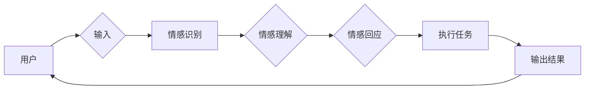

# AI Agent在情感陪伴中的创新

> 关键词：AI Agent，情感陪伴，人机交互，机器学习，深度学习，自然语言处理，情感计算，智能助手

## 1. 背景介绍

随着人工智能技术的飞速发展，AI Agent（人工智能代理）已经成为学术界和工业界研究的热点。AI Agent是一种能够在特定环境中自主执行任务的实体，它具备感知、决策和执行的能力。在情感陪伴领域，AI Agent的应用为孤独、老年人、残疾人士等群体提供了重要的精神支持和生活帮助。本文将探讨AI Agent在情感陪伴中的创新，分析其核心概念、算法原理、应用场景和未来发展趋势。

### 1.1 问题的由来

在现代社会，随着生活节奏的加快和社会结构的变迁，越来越多的人面临着孤独、心理压力等问题。尤其是老年人、残疾人士等特殊群体，由于生理和心理上的原因，更需要他人的关爱和陪伴。然而，由于人口老龄化、家庭结构小型化等因素，现实生活中可提供的陪伴资源日益匮乏。这时，AI Agent作为一种新型的陪伴方式，应运而生。

### 1.2 研究现状

目前，AI Agent在情感陪伴领域的应用已经取得了一定的成果，主要体现在以下几个方面：

- **自然语言处理（NLP）技术**：AI Agent通过NLP技术实现与人类的自然语言交互，理解用户的情感需求和表达，并做出相应的回应。
- **情感计算技术**：AI Agent能够识别和表达情感，为用户提供更加贴心的陪伴体验。
- **机器学习和深度学习技术**：AI Agent通过不断学习和优化，提高陪伴的个性化和智能化程度。
- **虚拟现实（VR）和增强现实（AR）技术**：AI Agent可以借助VR/AR技术，为用户提供身临其境的陪伴体验。

### 1.3 研究意义

AI Agent在情感陪伴领域的应用具有重要的社会意义和经济效益：

- **提升生活质量**：为孤独、老年人、残疾人士等群体提供情感陪伴，改善他们的生活质量。
- **减轻社会负担**：缓解家庭和社会对特殊群体的照护压力，降低社会成本。
- **促进技术创新**：推动人工智能技术在情感计算、自然语言处理等领域的应用和发展。

### 1.4 本文结构

本文将分为以下几个部分进行论述：

- **第2章**：介绍AI Agent在情感陪伴中的核心概念和联系。
- **第3章**：阐述AI Agent的核心算法原理和具体操作步骤。
- **第4章**：讲解AI Agent的数学模型和公式，并进行案例分析。
- **第5章**：展示AI Agent的实际应用场景。
- **第6章**：展望AI Agent在情感陪伴领域的未来发展趋势。
- **第7章**：推荐相关学习资源和开发工具。
- **第8章**：总结研究成果，分析未来发展趋势和挑战。
- **第9章**：解答常见问题。

## 2. 核心概念与联系

### 2.1 核心概念

- **AI Agent**：具备感知、决策和执行能力的实体，能够在特定环境中自主执行任务。
- **情感陪伴**：通过AI Agent为用户提供情感上的关怀和支持。
- **自然语言处理（NLP）**：研究如何让计算机理解和生成人类语言。
- **情感计算**：研究如何让计算机识别、理解和表达情感。
- **机器学习**：使计算机能够从数据中学习并做出决策。
- **深度学习**：一种机器学习技术，通过多层神经网络模拟人脑学习过程。

### 2.2 核心概念原理和架构的 Mermaid 流程图



### 2.3 核心概念联系

AI Agent通过感知用户输入，识别和理解用户的情感需求，然后通过情感回应和执行任务，最终输出结果。这一过程涉及自然语言处理、情感计算、机器学习和深度学习等多个领域的知识和技术。

## 3. 核心算法原理 & 具体操作步骤

### 3.1 算法原理概述

AI Agent在情感陪伴中的核心算法包括以下几个方面：

- **自然语言处理（NLP）**：用于处理用户的自然语言输入，提取语义信息。
- **情感识别**：通过情感分析技术，识别用户的情感状态。
- **情感理解**：根据情感识别结果，理解用户的情感需求。
- **情感回应**：根据情感理解结果，生成合适的情感回应。
- **任务执行**：根据情感回应，执行相应的任务。

### 3.2 算法步骤详解

1. **输入处理**：AI Agent接收用户的语音或文本输入。
2. **情感识别**：使用NLP技术，对输入进行处理，提取语义信息，并使用情感分析技术识别用户的情感状态。
3. **情感理解**：根据情感识别结果，结合上下文信息，理解用户的情感需求。
4. **情感回应**：根据情感理解结果，生成合适的情感回应，如安慰、鼓励等。
5. **任务执行**：根据情感回应，执行相应的任务，如播放音乐、提供信息等。
6. **输出结果**：将执行结果反馈给用户。

### 3.3 算法优缺点

#### 优点：

- **个性化**：根据用户的情感需求，提供个性化的陪伴服务。
- **智能化**：通过机器学习技术，不断提高陪伴的智能化程度。
- **便捷性**：随时随地为用户提供陪伴服务。

#### 缺点：

- **情感理解能力有限**：AI Agent的情感理解能力仍有限，难以完全理解人类的复杂情感。
- **缺乏同理心**：AI Agent缺乏人类的同理心，难以真正理解用户的内心世界。
- **技术成本较高**：AI Agent的开发和应用需要较高的技术成本。

### 3.4 算法应用领域

AI Agent在情感陪伴领域的应用主要包括以下方面：

- **孤独人群陪伴**：为孤独的老年人、残疾人士等提供情感陪伴。
- **心理健康支持**：为有心理问题的用户提供心理健康支持。
- **教育辅导**：为学习困难的学生提供个性化辅导。
- **医疗辅助**：为患者提供情感支持和健康管理。

## 4. 数学模型和公式 & 详细讲解 & 举例说明

### 4.1 数学模型构建

AI Agent在情感陪伴中的数学模型主要包括以下几个方面：

- **NLP模型**：用于处理用户输入的自然语言，提取语义信息。
- **情感分析模型**：用于识别和预测用户的情感状态。
- **决策模型**：用于根据情感理解结果，生成合适的情感回应。

### 4.2 公式推导过程

#### NLP模型：

$$
y = f(x, \theta)
$$

其中，$x$ 为用户输入，$y$ 为提取的语义信息，$\theta$ 为模型参数。

#### 情感分析模型：

$$
\hat{y} = g(x, \theta)
$$

其中，$\hat{y}$ 为预测的情感状态，$x$ 为用户输入，$\theta$ 为模型参数。

#### 决策模型：

$$
r = h(y, \theta)
$$

其中，$r$ 为生成的情感回应，$y$ 为情感理解结果，$\theta$ 为模型参数。

### 4.3 案例分析与讲解

假设用户输入："今天天气真好，心情很愉快。"

#### NLP模型：

- 输入：今天天气真好，心情很愉快。
- 输出：今天的天气很好，用户心情愉快。

#### 情感分析模型：

- 输入：今天的天气很好，用户心情愉快。
- 输出：正面情感。

#### 决策模型：

- 输入：正面情感。
- 输出：很高兴，你今天心情不错！

## 5. 项目实践：代码实例和详细解释说明

### 5.1 开发环境搭建

为了实现AI Agent在情感陪伴中的应用，我们需要搭建以下开发环境：

- 操作系统：Linux或Windows
- 编程语言：Python
- 开发框架：TensorFlow或PyTorch
- NLP库：NLTK、spaCy、transformers
- 情感分析库：TextBlob、VADER

### 5.2 源代码详细实现

以下是一个简单的AI Agent情感陪伴的Python代码示例：

```python
from transformers import pipeline
from textblob import TextBlob

# 情感分析管道
nlp = pipeline('sentiment-analysis')

def analyze_sentiment(text):
    """分析用户情感状态"""
    blob = TextBlob(text)
    if blob.sentiment.polarity > 0:
        return '正面情感'
    elif blob.sentiment.polarity < 0:
        return '负面情感'
    else:
        return '中性情感'

def respond_to_sentiment(sentiment):
    """根据用户情感状态生成回应"""
    if sentiment == '正面情感':
        return "很高兴，你今天心情不错！"
    elif sentiment == '负面情感':
        return "怎么了？需要我帮你吗？"
    else:
        return "听起来你好像有点迷茫，需要我帮你找点事做吗？"

# 与用户交互
user_input = input("请说点什么：")
user_sentiment = analyze_sentiment(user_input)
response = respond_to_sentiment(user_sentiment)
print(response)
```

### 5.3 代码解读与分析

- `pipeline`：使用transformers库的pipeline功能，可以快速构建情感分析模型。
- `TextBlob`：使用TextBlob库进行情感分析，判断文本的正面、负面或中性情感。
- `analyze_sentiment`函数：分析用户输入的情感状态。
- `respond_to_sentiment`函数：根据用户情感状态生成相应的回应。

### 5.4 运行结果展示

假设用户输入："今天天气真好，心情很愉快。"

程序输出：很高兴，你今天心情不错！

## 6. 实际应用场景

### 6.1 孤独人群陪伴

AI Agent可以为孤独的老年人提供情感陪伴，如：

- 与老年人聊天，了解他们的生活情况。
- 播放音乐、讲笑话等，活跃老年人的情绪。
- 提供健康建议，帮助老年人保持身心健康。

### 6.2 心理健康支持

AI Agent可以为有心理问题的用户提供心理健康支持，如：

- 通过聊天，了解用户的心理状况。
- 提供心理疏导，帮助用户缓解心理压力。
- 指导用户进行心理调适，提高心理素质。

### 6.3 教育辅导

AI Agent可以为学习困难的学生提供个性化辅导，如：

- 根据学生的学习情况，提供个性化的学习建议。
- 解答学生的学习疑问，帮助学生克服学习困难。
- 鼓励学生，增强学生的学习信心。

### 6.4 医疗辅助

AI Agent可以为患者提供医疗辅助，如：

- 收集患者的健康数据，进行健康监测。
- 提供医疗咨询，帮助患者了解病情。
- 提醒患者按时服药，保持良好的生活习惯。

## 7. 工具和资源推荐

### 7.1 学习资源推荐

- 《深度学习》系列书籍：周志华著，深入浅出地介绍了深度学习的基本概念和技术。
- 《自然语言处理综论》系列书籍：孙茂松著，全面介绍了自然语言处理的基本理论和应用技术。
- 《人工智能：一种现代的方法》系列书籍：Stuart Russell和Peter Norvig著，系统地介绍了人工智能的基本概念和技术。

### 7.2 开发工具推荐

- TensorFlow：Google开发的深度学习框架，功能强大，易于使用。
- PyTorch：Facebook开发的深度学习框架，灵活度高，社区活跃。
- NLTK：Python的自然语言处理库，提供了丰富的NLP功能。
- spaCy：Python的自然语言处理库，速度快，功能强大。

### 7.3 相关论文推荐

- "The Role of Sentiment Analysis in AI Agents for Emotional Support"：探讨了情感分析在AI Agent中的应用。
- "Designing Emotional AI Agents for Human-Computer Interaction"：介绍了设计情感AI Agent的方法。
- "Emotion Recognition in Human-Computer Interaction"：介绍了情感识别技术。

## 8. 总结：未来发展趋势与挑战

### 8.1 研究成果总结

AI Agent在情感陪伴领域的应用取得了显著成果，为孤独、老年人、残疾人士等群体提供了重要的精神支持和生活帮助。通过自然语言处理、情感计算、机器学习和深度学习等技术的结合，AI Agent能够更好地理解用户的情感需求，并提供个性化的陪伴服务。

### 8.2 未来发展趋势

- **个性化陪伴**：AI Agent将根据用户的需求，提供更加个性化的陪伴服务。
- **情感交互**：AI Agent将能够更好地理解用户的情感状态，并进行更加丰富的情感交互。
- **多模态融合**：AI Agent将融合语音、文本、图像等多模态信息，提供更加全面的陪伴服务。
- **跨领域应用**：AI Agent将在更多领域得到应用，如教育、医疗、客服等。

### 8.3 面临的挑战

- **情感理解能力**：AI Agent的情感理解能力仍有限，难以完全理解人类的复杂情感。
- **技术成本**：AI Agent的开发和应用需要较高的技术成本。
- **伦理道德**：如何确保AI Agent在情感陪伴中的伦理道德，避免歧视和偏见。

### 8.4 研究展望

未来，AI Agent在情感陪伴领域的应用将更加广泛，为人类社会带来更多福祉。通过不断的技术创新和伦理道德的约束，AI Agent将成为人类生活中不可或缺的伙伴。

## 9. 附录：常见问题与解答

**Q1：AI Agent在情感陪伴中的优势是什么？**

A1：AI Agent在情感陪伴中的优势主要体现在以下几个方面：

- **全天候陪伴**：AI Agent可以24小时不间断地陪伴用户，满足用户的情感需求。
- **个性化陪伴**：AI Agent可以根据用户的需求，提供个性化的陪伴服务。
- **成本效益**：相比于人工陪伴，AI Agent的成本更低，经济效益更高。

**Q2：如何提高AI Agent的情感理解能力？**

A2：提高AI Agent的情感理解能力需要从以下几个方面入手：

- **数据收集**：收集更多高质量的情感数据，用于训练模型。
- **算法优化**：优化情感分析算法，提高模型的准确率。
- **跨领域学习**：借鉴其他领域的知识，提高AI Agent的泛化能力。

**Q3：如何确保AI Agent在情感陪伴中的伦理道德？**

A3：为确保AI Agent在情感陪伴中的伦理道德，需要：

- **制定伦理规范**：制定AI Agent的伦理规范，明确其应用边界。
- **加强监管**：加强对AI Agent的监管，防止其被用于恶意目的。
- **用户教育**：加强对用户的伦理教育，提高用户对AI Agent的信任度。

---

作者：禅与计算机程序设计艺术 / Zen and the Art of Computer Programming