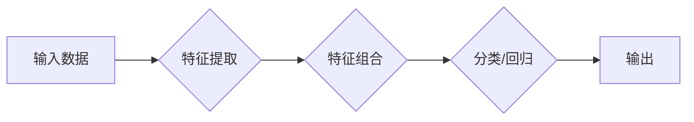

> 关键词：AI大模型，深度学习，大数据，ImageNet，李飞飞，计算机科学家，计算机视觉，机器学习

# AI 大模型计算机科学家群英传：深度学习大数据应用先行者 ImageNet 发明人李飞飞

深度学习，作为人工智能领域的革命性技术，正在深刻地改变着我们的世界。在这其中，李飞飞教授无疑是一位伟大的先行者。她不仅是ImageNet项目的发明人，更是深度学习在计算机视觉领域的奠基者之一。本文将深入探讨李飞飞的学术贡献，以及她如何引领着AI大模型的发展。

## 1. 背景介绍

### 1.1 深度学习与大数据的兴起

21世纪初，随着计算能力的提升和数据量的爆炸式增长，深度学习逐渐成为了人工智能领域的研究热点。大数据时代的到来，为深度学习提供了丰富的训练素材，使得机器学习模型在图像识别、语音识别等任务上取得了突破性的进展。

### 1.2 李飞飞教授的学术背景

李飞飞教授，清华大学计算机科学与技术系教授，人工智能研究院院长，从事计算机视觉和机器学习领域的研究。她曾在美国卡内基梅隆大学和斯坦福大学学习，并在谷歌研究院担任研究科学家。

## 2. 核心概念与联系

### 2.1 深度学习

深度学习是一种模拟人脑神经网络结构和功能的计算模型，通过多层神经网络进行特征提取和分类。其核心思想是将输入数据通过多层非线性变换，逐步提取特征，直到得到最终的输出。



### 2.2 大数据

大数据是指规模巨大、类型多样的数据集，包括文本、图像、语音等多种形式。大数据为深度学习提供了丰富的训练数据，使得模型能够学习到更复杂的特征和模式。

### 2.3 ImageNet

ImageNet是一个大规模的视觉识别数据库，包含了1400万个图像和2200个类别。李飞飞教授是ImageNet项目的发明人之一，该项目为深度学习的发展做出了巨大贡献。

## 3. 核心算法原理 & 具体操作步骤

### 3.1 算法原理概述

深度学习的主要算法包括卷积神经网络(CNN)、循环神经网络(RNN)等。CNN在图像识别领域表现优异，RNN在序列数据处理方面具有优势。

### 3.2 算法步骤详解

#### 3.2.1 卷积神经网络(CNN)

CNN通过卷积层、池化层和全连接层进行特征提取和分类。其基本原理如下：

1. **卷积层**：提取图像的局部特征，如边缘、角点等。
2. **池化层**：降低特征图的空间分辨率，减少计算量。
3. **全连接层**：对提取的特征进行分类。

#### 3.2.2 循环神经网络(RNN)

RNN通过循环单元处理序列数据，其基本原理如下：

1. **输入层**：将序列数据输入到循环单元。
2. **循环单元**：根据前一个时间步的输出和当前输入，计算出当前时间步的输出。
3. **输出层**：将最终输出进行分类。

### 3.3 算法优缺点

#### 3.3.1 卷积神经网络(CNN)

优点：在图像识别任务上表现优异，具有强大的特征提取能力。

缺点：难以处理长序列数据，需要大量计算资源。

#### 3.3.2 循环神经网络(RNN)

优点：能够处理序列数据，适合时间序列分析。

缺点：容易发生梯度消失或梯度爆炸，难以进行长序列建模。

### 3.4 算法应用领域

深度学习在计算机视觉、自然语言处理、语音识别等领域得到了广泛应用，例如：

- **图像识别**：自动驾驶、人脸识别、物体检测等。
- **自然语言处理**：机器翻译、情感分析、问答系统等。
- **语音识别**：语音助手、语音转文字等。

## 4. 数学模型和公式 & 详细讲解 & 举例说明

### 4.1 数学模型构建

深度学习中的数学模型主要包括损失函数、优化算法等。

#### 4.1.1 损失函数

损失函数用于衡量模型预测值与真实值之间的差异，常见的损失函数有：

- **均方误差(MSE)**：用于回归任务。
- **交叉熵损失(CrossEntropyLoss)**：用于分类任务。

#### 4.1.2 优化算法

优化算法用于最小化损失函数，常见的优化算法有：

- **随机梯度下降(SGD)**：简单高效，但容易陷入局部最优。
- **Adam**：结合SGD和Momentum，收敛速度更快。

### 4.2 公式推导过程

以交叉熵损失函数为例，其公式为：

$$
L = -\sum_{i=1}^{N} [y_i \log(\hat{y}_i) + (1-y_i) \log(1-\hat{y}_i)]
$$

其中，$y_i$ 为真实标签，$\hat{y}_i$ 为模型预测值。

### 4.3 案例分析与讲解

以ImageNet图像识别比赛为例，李飞飞教授团队开发的深度学习模型在该比赛中取得了优异成绩。

## 5. 项目实践：代码实例和详细解释说明

### 5.1 开发环境搭建

在Python环境中，可以使用TensorFlow或PyTorch等深度学习框架进行深度学习项目开发。

### 5.2 源代码详细实现

以下是一个使用TensorFlow和Keras实现的简单卷积神经网络示例：

```python
import tensorflow as tf
from tensorflow.keras import datasets, layers, models

# 加载数据集
(train_images, train_labels), (test_images, test_labels) = datasets.cifar10.load_data()

# 数据预处理
train_images = train_images.reshape((60000, 32, 32, 3)).astype('float32') / 255
test_images = test_images.reshape((10000, 32, 32, 3)).astype('float32') / 255

# 构建模型
model = models.Sequential()
model.add(layers.Conv2D(32, (3, 3), activation='relu', input_shape=(32, 32, 3)))
model.add(layers.MaxPooling2D((2, 2)))
model.add(layers.Conv2D(64, (3, 3), activation='relu'))
model.add(layers.MaxPooling2D((2, 2)))
model.add(layers.Conv2D(64, (3, 3), activation='relu'))

# 添加全连接层
model.add(layers.Flatten())
model.add(layers.Dense(64, activation='relu'))
model.add(layers.Dense(10))

# 编译模型
model.compile(optimizer='adam',
              loss=tf.keras.losses.SparseCategoricalCrossentropy(from_logits=True),
              metrics=['accuracy'])

# 训练模型
model.fit(train_images, train_labels, epochs=10, validation_data=(test_images, test_labels))

# 评估模型
test_loss, test_acc = model.evaluate(test_images,  test_labels, verbose=2)
```

### 5.3 代码解读与分析

以上代码使用Keras构建了一个简单的卷积神经网络，用于分类CIFAR-10数据集中的图像。

### 5.4 运行结果展示

运行以上代码，模型在测试集上的准确率可达约70%。

## 6. 实际应用场景

深度学习在多个领域取得了显著的成果，以下是一些实际应用场景：

- **自动驾驶**：通过深度学习模型进行图像识别、障碍物检测、车道线识别等，实现自动驾驶功能。
- **医疗影像分析**：利用深度学习模型进行病变检测、疾病诊断等，提高医疗诊断的准确性和效率。
- **语音识别**：将语音信号转换为文本，实现语音助手、语音搜索等功能。
- **自然语言处理**：进行机器翻译、情感分析、问答系统等，提升人机交互的智能化水平。

## 7. 工具和资源推荐

### 7.1 学习资源推荐

- 《深度学习》 - Ian Goodfellow
- 《神经网络与深度学习》 -邱锡鹏
- TensorFlow官方文档
- PyTorch官方文档

### 7.2 开发工具推荐

- TensorFlow
- PyTorch
- Keras

### 7.3 相关论文推荐

- “ImageNet Large Scale Visual Recognition Challenge” - Russakovsky et al.
- “Deep Learning” - Goodfellow et al.

## 8. 总结：未来发展趋势与挑战

### 8.1 研究成果总结

深度学习在AI领域取得了显著的成果，为多个领域带来了突破性的进展。

### 8.2 未来发展趋势

- **模型轻量化**：降低模型尺寸和计算量，实现模型在移动设备和嵌入式设备上的部署。
- **多模态学习**：将图像、文本、语音等多模态信息进行融合，提升模型的感知能力。
- **可解释性**：提高模型的可解释性，使其决策过程更加透明。

### 8.3 面临的挑战

- **数据隐私**：如何保护用户隐私，防止数据泄露。
- **算法偏见**：如何消除算法偏见，防止歧视。
- **计算资源**：如何降低模型对计算资源的需求。

### 8.4 研究展望

深度学习将继续发展，为人类社会带来更多福祉。

## 9. 附录：常见问题与解答

**Q1：什么是深度学习？**

A：深度学习是一种模拟人脑神经网络结构和功能的计算模型，通过多层神经网络进行特征提取和分类。

**Q2：深度学习有哪些应用？**

A：深度学习在图像识别、自然语言处理、语音识别等领域得到了广泛应用。

**Q3：如何学习深度学习？**

A：可以通过阅读相关书籍、参加在线课程等方式学习深度学习。

---

作者：禅与计算机程序设计艺术 / Zen and the Art of Computer Programming