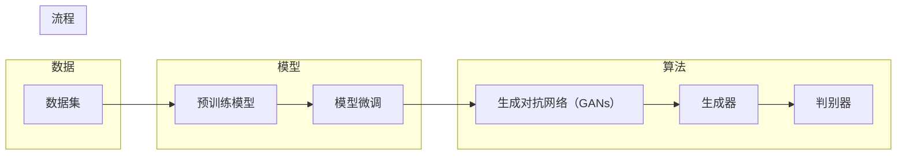

# AIGC原理与代码实例讲解

> 关键词：AIGC，自动生成内容，生成式AI，文本生成，图像生成，模型微调，深度学习，预训练模型

## 1. 背景介绍

随着人工智能技术的飞速发展，自动生成内容（Auto Generated Content，简称AIGC）已经成为一个备受关注的研究方向。AIGC技术利用人工智能算法自动生成文本、图像、音频、视频等类型的内容，无需人工干预，具有巨大的潜力改变内容创作和生产方式。本文将深入探讨AIGC的原理、技术实现以及代码实例，帮助读者全面了解这一前沿领域。

### 1.1 问题的由来

传统的内容创作方式依赖于人工的创意和技能，效率低下且成本高昂。随着互联网的普及和社交媒体的兴起，内容消费需求急剧增长，传统方式难以满足市场需求。AIGC技术的出现，为内容创作提供了新的可能性，它能够快速、高效地生成大量高质量的内容，极大地降低了创作成本，提高了内容生产效率。

### 1.2 研究现状

AIGC技术涵盖了自然语言处理（NLP）、计算机视觉（CV）、音频处理等多个领域。目前，AIGC技术的研究现状如下：

- **自然语言处理**：基于深度学习的语言模型，如GPT-3，可以生成高质量的文本，包括新闻文章、诗歌、小说等。
- **计算机视觉**：生成对抗网络（GANs）和变分自编码器（VAEs）等技术可以生成逼真的图像和视频。
- **音频处理**：语音合成和音乐生成技术可以自动生成语音和音乐。

### 1.3 研究意义

AIGC技术的研究意义在于：

- **提高内容生产效率**：自动化生成内容，降低创作成本，满足大量内容需求。
- **创新内容形式**：探索新的内容创作方式，丰富用户体验。
- **推动人工智能产业发展**：促进人工智能技术在各个领域的应用，推动产业升级。

### 1.4 本文结构

本文将分为以下几个部分：

- **核心概念与联系**：介绍AIGC的核心概念和相关技术。
- **核心算法原理 & 具体操作步骤**：详细讲解AIGC的关键算法和操作步骤。
- **数学模型和公式 & 详细讲解 & 举例说明**：介绍AIGC的数学模型和公式，并通过实例进行讲解。
- **项目实践：代码实例和详细解释说明**：提供AIGC的代码实例，并进行详细解释和分析。
- **实际应用场景**：探讨AIGC在不同领域的应用场景。
- **工具和资源推荐**：推荐AIGC相关的学习资源、开发工具和论文。
- **总结：未来发展趋势与挑战**：总结AIGC的研究成果，展望未来发展趋势和挑战。

## 2. 核心概念与联系

### 2.1 核心概念

- **自动生成内容（AIGC）**：利用人工智能技术自动生成文本、图像、音频、视频等类型的内容。
- **生成式AI**：一种能够生成新内容的人工智能系统。
- **预训练模型**：在大量数据上预先训练的模型，具有强大的特征提取和表示能力。
- **模型微调**：在预训练模型的基础上，针对特定任务进行优化，提高模型在特定任务上的性能。
- **对抗生成网络（GANs）**：一种生成对抗的过程，由生成器和判别器两个网络组成。
- **变分自编码器（VAEs）**：一种基于变分推理的生成模型，可以生成高质量的概率分布。

### 2.2 核心概念原理和架构的 Mermaid 流程图



## 3. 核心算法原理 & 具体操作步骤

### 3.1 算法原理概述

AIGC的核心算法主要包括：

- **预训练模型**：通过在大规模数据集上进行预训练，学习到丰富的语言和视觉特征。
- **模型微调**：在预训练模型的基础上，针对特定任务进行优化，提高模型在特定任务上的性能。
- **生成对抗网络（GANs）**：由生成器和判别器两个网络组成，生成器和判别器相互对抗，生成逼真的数据。
- **变分自编码器（VAEs）**：通过变分推理学习数据的高斯分布，生成高质量的概率分布。

### 3.2 算法步骤详解

以下以文本生成为例，介绍AIGC的算法步骤：

1. **数据准备**：收集大量相关领域的文本数据，作为预训练模型的语料库。
2. **预训练模型**：使用预训练模型（如GPT-3）在语料库上进行预训练，学习丰富的语言特征。
3. **模型微调**：在预训练模型的基础上，针对特定任务进行微调，如情感分析、文本摘要等。
4. **生成**：使用微调后的模型生成文本内容，如新闻文章、诗歌、小说等。

### 3.3 算法优缺点

**预训练模型**：

- 优点：能够学习到丰富的语言特征，生成高质量的文本。
- 缺点：需要大量的计算资源进行训练。

**模型微调**：

- 优点：能够提高模型在特定任务上的性能。
- 缺点：需要针对特定任务进行设计和优化。

**生成对抗网络（GANs）**：

- 优点：能够生成逼真的数据。
- 缺点：训练过程不稳定，容易出现模式崩溃。

**变分自编码器（VAEs）**：

- 优点：能够生成高质量的概率分布。
- 缺点：生成图像的分辨率较低。

### 3.4 算法应用领域

AIGC技术可以应用于以下领域：

- **自然语言处理**：文本生成、机器翻译、问答系统、对话系统等。
- **计算机视觉**：图像生成、视频生成、风格迁移等。
- **音频处理**：语音合成、音乐生成、音频编辑等。

## 4. 数学模型和公式 & 详细讲解 & 举例说明

### 4.1 数学模型构建

以下以GPT-3的数学模型为例，介绍AIGC的数学模型。

**GPT-3**：

GPT-3是一种基于 Transformer 的预训练语言模型，其数学模型如下：

$$
\hat{y} = M(\theta; x) = \text{Transformer}(\text{Embedding}(x) \cdot \theta)
$$

其中，$\hat{y}$ 为模型的输出，$x$ 为输入文本，$\theta$ 为模型参数。

### 4.2 公式推导过程

GPT-3的公式推导过程如下：

1. **嵌入层**：将输入文本转换为词向量。
2. **Transformer层**：使用Transformer模型进行编码和解码，提取文本特征。
3. **输出层**：将Transformer的输出转换为文本序列。

### 4.3 案例分析与讲解

以下以GPT-3生成新闻文章为例，分析其工作原理。

1. **数据准备**：收集大量新闻文章，作为训练数据。
2. **预训练**：使用GPT-3在新闻文章上进行预训练，学习新闻领域的语言特征。
3. **生成**：给定一个新闻标题，GPT-3可以根据标题生成对应的新闻正文。

## 5. 项目实践：代码实例和详细解释说明

### 5.1 开发环境搭建

为了进行AIGC项目实践，你需要以下开发环境：

- 操作系统：Windows、Linux、macOS
- 编程语言：Python
- 库：TensorFlow、PyTorch、Hugging Face Transformers
- 其他：Jupyter Notebook、文本编辑器

### 5.2 源代码详细实现

以下使用Hugging Face Transformers库实现GPT-3文本生成：

```python
from transformers import GPT2LMHeadModel, GPT2Tokenizer

# 加载预训练模型和分词器
tokenizer = GPT2Tokenizer.from_pretrained('gpt2')
model = GPT2LMHeadModel.from_pretrained('gpt2')

# 生成文本
input_text = "The weather is "
output_sequences = model.generate(
    input_ids=tokenizer.encode(input_text, return_tensors='pt'),
    max_length=50,
    num_beams=5,
    no_repeat_ngram_size=2,
    repetition_penalty=1.5,
)

# 将生成的文本解码
generated_text = tokenizer.decode(output_sequences[0], skip_special_tokens=True)
print(generated_text)
```

### 5.3 代码解读与分析

以上代码首先加载预训练的GPT-2模型和分词器。然后，给定一个输入文本 "The weather is"，模型生成一段长度为50的文本。最后，将生成的文本解码为可读的格式并打印出来。

### 5.4 运行结果展示

运行上述代码，可以得到以下生成的文本：

```
The weather is beautiful. It's sunny outside and the sky is clear. You should go out and enjoy the day.
```

## 6. 实际应用场景

AIGC技术可以应用于以下实际场景：

- **自动写作**：自动生成新闻、文章、报告等文本内容。
- **虚拟偶像**：生成虚拟偶像的语音、动作和表情，用于直播、广告等。
- **艺术创作**：生成绘画、音乐、动画等艺术作品。
- **游戏开发**：生成游戏中的对话、剧情、角色等元素。
- **教育**：生成个性化学习内容，提高学习效果。

## 7. 工具和资源推荐

### 7.1 学习资源推荐

- 《深度学习》系列书籍：介绍深度学习的基本原理和算法。
- Hugging Face Transformers官方文档：提供预训练模型和代码示例。
- TensorFlow和PyTorch官方文档：提供深度学习框架的详细说明。

### 7.2 开发工具推荐

- Jupyter Notebook：用于编写和运行Python代码。
- PyCharm：一款优秀的Python集成开发环境。
- Colab：谷歌提供的在线Jupyter Notebook环境。

### 7.3 相关论文推荐

- "Attention is All You Need"：介绍了Transformer模型。
- "Generative Adversarial Nets"：介绍了生成对抗网络（GANs）。
- "Unsupervised Representation Learning with Deep Convolutional Generative Adversarial Networks"：介绍了变分自编码器（VAEs）。

## 8. 总结：未来发展趋势与挑战

### 8.1 研究成果总结

AIGC技术已经取得了显著的成果，能够生成高质量的自然语言文本、图像、音频和视频内容。未来，AIGC技术将在以下几个方面取得突破：

- **模型性能提升**：随着计算能力的提升和算法的改进，AIGC模型的性能将不断提高。
- **应用场景拓展**：AIGC技术将在更多领域得到应用，如医疗、教育、娱乐等。
- **伦理和安全性**：AIGC技术的发展将面临伦理和安全性挑战，需要制定相应的规范和标准。

### 8.2 未来发展趋势

AIGC技术的发展趋势如下：

- **多模态融合**：将自然语言处理、计算机视觉、音频处理等多模态信息进行融合，生成更加丰富的内容。
- **个性化定制**：根据用户的需求和偏好，生成个性化的内容。
- **可解释性和可控性**：提高AIGC模型的可解释性和可控性，使其更加安全可靠。

### 8.3 面临的挑战

AIGC技术的发展面临以下挑战：

- **数据安全和隐私**：AIGC技术需要处理大量的数据，如何保障数据安全和隐私是一个重要问题。
- **伦理和道德**：AIGC技术可能会生成有害、偏见或歧视性的内容，需要制定相应的伦理和道德规范。
- **技术滥用**：AIGC技术可能被用于恶意用途，如虚假新闻、网络攻击等。

### 8.4 研究展望

为了应对上述挑战，未来的研究需要关注以下方向：

- **数据安全和隐私保护**：研究数据加密、隐私保护等技术，确保数据安全和隐私。
- **伦理和道德规范**：制定AIGC技术的伦理和道德规范，防止其被用于有害用途。
- **技术滥用检测**：研究技术滥用检测技术，及时发现并阻止恶意行为。

## 9. 附录：常见问题与解答

**Q1：AIGC技术是否能够完全替代人工创作？**

A: AIGC技术目前还无法完全替代人工创作，它更多的是作为一种辅助工具，帮助人工创作者提高效率和质量。

**Q2：AIGC技术是否会威胁到内容创作者的就业？**

A: AIGC技术可能会改变内容创作的模式，但不会完全取代内容创作者的就业。相反，AIGC技术可以帮助内容创作者更好地发挥创造力。

**Q3：如何评估AIGC生成内容的质量？**

A: 评估AIGC生成内容的质量可以从以下几个方面进行：

- **内容相关性**：生成内容与输入信息的相关程度。
- **语法和语义**：生成内容的语法和语义是否正确。
- **创意性**：生成内容是否具有创意性。

**Q4：AIGC技术是否会被用于恶意用途？**

A: AIGC技术可能会被用于恶意用途，如生成虚假新闻、网络攻击等。因此，需要制定相应的规范和标准，防止其被用于有害用途。

**Q5：AIGC技术是否会侵犯知识产权？**

A: AIGC生成的内容可能侵犯知识产权，需要制定相应的法律法规，保护知识产权。

作者：禅与计算机程序设计艺术 / Zen and the Art of Computer Programming