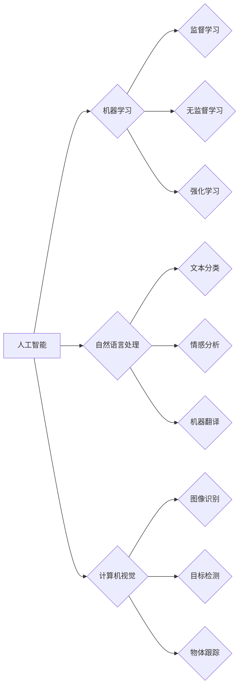

# AI与人类社会的未来发展

> 关键词：人工智能，社会变革，技术伦理，未来趋势，人机协作，智能伦理

## 1. 背景介绍

人工智能（Artificial Intelligence, AI）作为一门融合计算机科学、心理学、数学等多个学科的前沿技术，正以前所未有的速度改变着我们的生活。从简单的机器人到复杂的智能系统，AI在医疗、教育、交通、金融等领域都展现出了巨大的潜力。本文将探讨AI技术的未来发展趋势，以及它对人类社会可能带来的深远影响。

### 1.1 问题的由来

随着AI技术的不断进步，人们对AI的期望也越来越高。然而，AI的快速发展也引发了一系列问题和担忧，例如：

- AI是否会取代人类工作？
- AI的决策过程是否透明、公平？
- 如何确保AI的安全性和可控性？
- AI技术是否会加剧社会不平等？

### 1.2 研究现状

目前，全球范围内都在积极推动AI技术的发展和应用。各国政府、企业和研究机构都在投入巨资进行AI研发，力求在AI领域取得领先优势。同时，国际社会也在探讨如何制定AI伦理规范，以确保AI技术的健康发展。

### 1.3 研究意义

研究AI与人类社会的未来发展，对于推动AI技术健康发展、构建和谐的人机关系具有重要意义。

### 1.4 本文结构

本文将围绕以下内容展开：

- 介绍AI的核心概念与联系。
- 分析AI的核心算法原理与具体操作步骤。
- 探讨AI的数学模型和公式。
- 展示AI的代码实例和实践应用。
- 分析AI在实际应用场景中的影响。
- 展望AI的未来发展趋势与挑战。
- 总结研究成果，展望未来研究方向。

## 2. 核心概念与联系

### 2.1 核心概念

#### 人工智能（AI）

人工智能是指使计算机能够模拟人类智能行为的技术。它包括机器学习、深度学习、自然语言处理、计算机视觉等多个子领域。

#### 机器学习（ML）

机器学习是一种使计算机能够从数据中学习并做出决策或预测的技术。它包括监督学习、无监督学习、强化学习等。

#### 深度学习（DL）

深度学习是一种特殊的机器学习技术，它使用深层神经网络来模拟人脑的神经元结构，实现复杂模式识别和特征提取。

#### 自然语言处理（NLP）

自然语言处理是指使计算机能够理解和处理人类自然语言的技术。它包括文本分类、情感分析、机器翻译等。

#### 计算机视觉（CV）

计算机视觉是指使计算机能够理解和解释图像和视频的技术。它包括图像识别、目标检测、物体跟踪等。

### 2.2 Mermaid 流程图



## 3. 核心算法原理 & 具体操作步骤

### 3.1 算法原理概述

AI技术的核心是算法，它决定了AI系统的性能和功能。以下是一些常见的AI算法：

- **监督学习**：通过训练数据学习输入和输出之间的关系，从而预测新的输入。
- **无监督学习**：从无标签数据中学习数据的结构和模式。
- **强化学习**：通过与环境交互，学习最优策略以实现目标。

### 3.2 算法步骤详解

#### 监督学习

1. 数据收集：收集包含输入和输出标签的数据集。
2. 特征提取：从数据中提取有用的特征。
3. 模型选择：选择合适的模型，如线性回归、支持向量机等。
4. 训练：使用训练数据训练模型。
5. 评估：使用验证数据评估模型性能。
6. 部署：将模型部署到生产环境中。

#### 无监督学习

1. 数据收集：收集无标签数据。
2. 特征提取：从数据中提取有用的特征。
3. 模型选择：选择合适的模型，如聚类、降维等。
4. 模型训练：使用无标签数据训练模型。
5. 模型评估：评估模型性能。
6. 模型应用：将模型应用于实际场景。

#### 强化学习

1. 环境设定：定义环境、状态、行动、奖励等。
2. 策略学习：设计或学习最优策略。
3. 模型训练：在环境中执行行动，收集奖励。
4. 策略迭代：根据奖励调整策略。
5. 模型优化：优化模型以更好地执行策略。

### 3.3 算法优缺点

#### 监督学习

优点：

- 性能稳定，预测准确。
- 应用广泛，适用于各种预测任务。

缺点：

- 需要大量标注数据。
- 难以处理复杂非线性关系。

#### 无监督学习

优点：

- 不需要标注数据。
- 可用于发现数据中的潜在结构。

缺点：

- 预测准确度较低。
- 难以解释模型决策过程。

#### 强化学习

优点：

- 可以解决复杂决策问题。
- 可以在无监督环境下学习。

缺点：

- 训练过程复杂，需要大量计算资源。
- 难以解释模型决策过程。

### 3.4 算法应用领域

- 监督学习：图像识别、语音识别、医疗诊断等。
- 无监督学习：数据挖掘、异常检测等。
- 强化学习：自动驾驶、游戏AI等。

## 4. 数学模型和公式 & 详细讲解 & 举例说明

### 4.1 数学模型构建

以下是一些常见的AI数学模型：

- **线性回归**：

  $$ y = \beta_0 + \beta_1 x $$

- **支持向量机（SVM）**：

  $$ \hat{y} = \text{sign}(\sum_{i=1}^n \alpha_i y_i \langle x_i, x \rangle - \beta_0) $$

- **神经网络**：

  $$ y = \sigma(\sum_{i=1}^n \theta_i x_i + b) $$

### 4.2 公式推导过程

以线性回归为例，假设我们有以下数据集：

$$
(x_1, y_1), (x_2, y_2), \ldots, (x_n, y_n)
$$

线性回归模型的目标是找到最佳参数 $\beta_0$ 和 $\beta_1$，使得预测值 $\hat{y}$ 最接近真实值 $y$。

损失函数为：

$$
\ell(\beta_0, \beta_1) = \sum_{i=1}^n (y_i - \hat{y}_i)^2
$$

对损失函数进行最小化，得到：

$$
\beta_0 = \frac{1}{n} \sum_{i=1}^n y_i - \beta_1 \frac{1}{n} \sum_{i=1}^n x_i
$$

$$
\beta_1 = \frac{1}{n} \sum_{i=1}^n (x_i - \bar{x})(y_i - \bar{y})
$$

其中 $\bar{x}$ 和 $\bar{y}$ 分别为 $x$ 和 $y$ 的均值。

### 4.3 案例分析与讲解

以图像识别任务为例，我们将使用卷积神经网络（CNN）进行图像分类。

1. **数据准备**：收集大量的图像数据，并将其分为训练集、验证集和测试集。
2. **模型构建**：构建一个CNN模型，包括卷积层、池化层和全连接层。
3. **模型训练**：使用训练集数据训练模型，并使用验证集数据调整模型参数。
4. **模型评估**：使用测试集数据评估模型性能。

## 5. 项目实践：代码实例和详细解释说明

### 5.1 开发环境搭建

1. 安装Python和PyTorch。
2. 下载必要的库，如torchvision、torchtext等。

### 5.2 源代码详细实现

以下是一个简单的CNN模型代码示例：

```python
import torch
import torch.nn as nn

class CNN(nn.Module):
    def __init__(self):
        super(CNN, self).__init__()
        self.conv1 = nn.Conv2d(3, 32, kernel_size=3, padding=1)
        self.relu = nn.ReLU()
        self.maxpool = nn.MaxPool2d(2)
        self.fc1 = nn.Linear(32 * 28 * 28, 64)
        self.fc2 = nn.Linear(64, 10)

    def forward(self, x):
        x = self.relu(self.conv1(x))
        x = self.maxpool(x)
        x = x.view(x.size(0), -1)
        x = self.relu(self.fc1(x))
        x = self.fc2(x)
        return x

model = CNN()
```

### 5.3 代码解读与分析

- `CNN` 类定义了一个卷积神经网络模型。
- `__init__` 方法初始化了卷积层、ReLU激活函数、最大池化层和全连接层。
- `forward` 方法定义了数据在模型中的前向传播过程。

### 5.4 运行结果展示

通过训练和测试，我们可以得到模型的准确率。例如，假设我们的模型在测试集上的准确率为90%，则说明模型在图像识别任务上表现良好。

## 6. 实际应用场景

AI技术在各个领域都有广泛的应用，以下是一些典型的应用场景：

- **医疗**：AI可以帮助医生进行疾病诊断、药物研发、健康管理等。
- **教育**：AI可以帮助学生个性化学习、自动批改作业、提供学习辅导等。
- **交通**：AI可以帮助自动驾驶、智能交通管理、交通预测等。
- **金融**：AI可以帮助进行风险管理、欺诈检测、智能投顾等。

## 7. 未来应用展望

AI技术在未来将会在以下领域得到更广泛的应用：

- **智能制造**：AI可以帮助工厂实现自动化、智能化生产，提高生产效率和质量。
- **智慧城市**：AI可以帮助城市实现智能管理、智能交通、智能环保等。
- **智能医疗**：AI可以帮助医生进行精准医疗、远程医疗、疾病预防等。
- **智能教育**：AI可以帮助学生实现个性化学习、智能辅导、智能教育评估等。

## 8. 总结：未来发展趋势与挑战

### 8.1 研究成果总结

本文介绍了AI技术的核心概念、算法原理、数学模型和实际应用场景，并展望了AI技术的未来发展趋势。

### 8.2 未来发展趋势

- **AI技术将进一步融入日常生活**：AI技术将更加普及，融入到人们的日常生活和工作之中。
- **AI技术将更加智能化**：AI技术将更加智能化，能够更好地理解人类语言、情感和意图。
- **AI技术将更加安全可靠**：AI技术将更加安全可靠，能够更好地保护个人隐私和数据安全。

### 8.3 面临的挑战

- **数据安全和隐私保护**：如何保护个人隐私和数据安全是AI技术发展面临的重要挑战。
- **算法偏见和歧视**：如何避免算法偏见和歧视是AI技术发展面临的重要挑战。
- **伦理和道德问题**：如何解决AI技术带来的伦理和道德问题是AI技术发展面临的重要挑战。

### 8.4 研究展望

未来，AI技术研究将更加注重以下几个方面：

- **数据安全和隐私保护**：研究更加安全可靠的数据存储、传输和处理技术。
- **算法偏见和歧视**：研究更加公平、公正的算法设计方法。
- **伦理和道德问题**：研究更加符合伦理和道德的AI技术。

## 9. 附录：常见问题与解答

**Q1：AI是否会取代人类工作？**

A：AI技术将会取代一些重复性、危险或低技能的工作，但也会创造新的工作岗位。总体而言，AI技术将会改变人类的工作方式，而不是完全取代人类。

**Q2：AI的决策过程是否透明、公平？**

A：目前，AI的决策过程并不完全透明，也很难保证其公平性。未来，我们需要研究更加透明、公平的AI算法，以提高AI系统的可信度和可靠性。

**Q3：如何确保AI的安全性和可控性？**

A：确保AI的安全性和可控性需要从多个方面入手，包括算法设计、数据安全、伦理规范等。

**Q4：AI技术是否会加剧社会不平等？**

A：如果不对AI技术进行合理监管，可能会加剧社会不平等。因此，我们需要制定相应的政策和法规，以确保AI技术的公平、公正、普惠。

**Q5：如何应对AI技术带来的伦理和道德问题？**

A：我们需要建立一套完善的伦理和道德规范，对AI技术进行合理监管，确保AI技术的健康发展。

作者：禅与计算机程序设计艺术 / Zen and the Art of Computer Programming