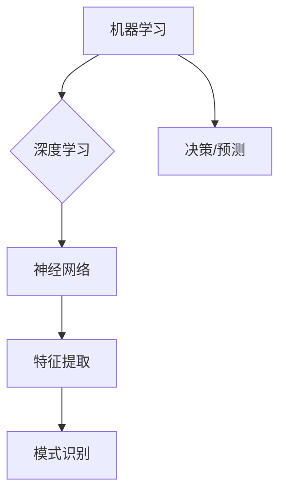

# AI领域的独特时刻与未来发展

> 关键词：人工智能，机器学习，深度学习，独特时刻，未来展望，挑战与机遇

## 1. 背景介绍

人工智能（Artificial Intelligence, AI）作为一门多学科交叉的领域，经过多年的发展，已经取得了令人瞩目的成就。从早期的符号主义到连接主义，再到如今的深度学习时代，AI技术不断突破边界，为人类社会带来了前所未有的变革。本文将回顾AI领域的独特时刻，并展望其未来的发展趋势与挑战。

### 1.1 AI发展的历史回顾

1. **符号主义时代（1950s-1970s）**：这一时期，研究者们试图使用逻辑和规则来构建智能系统。著名的“图灵测试”也诞生于这个时期。
2. **连接主义时代（1980s-1990s）**：连接主义关注大脑神经网络的结构和功能，提出了BP算法等关键性技术。
3. **深度学习时代（2000s-至今）**：随着计算能力和数据量的提升，深度学习技术迅速发展，推动了AI领域的突破性进展。

### 1.2 AI领域的独特时刻

1. **IBM深蓝击败国际象棋世界冠军卡斯帕罗夫（1997年）**：标志着AI在特定领域达到了人类专家水平。
2. **AlphaGo战胜围棋世界冠军李世石（2016年）**：深度学习在游戏领域取得了突破，引发了全球对AI的广泛关注。
3. **AI在医疗领域的应用（如辅助诊断、药物研发等）**：AI技术在医疗领域的应用，为人类健康带来了巨大福音。

## 2. 核心概念与联系

### 2.1 核心概念原理

1. **机器学习（Machine Learning, ML）**：通过算法让计算机从数据中学习，并在特定任务上做出决策或预测。
2. **深度学习（Deep Learning, DL）**：一种特殊的机器学习方法，使用深层神经网络进行特征提取和学习。
3. **神经网络（Neural Network, NN）**：模拟人脑神经元结构和工作原理，用于处理和识别复杂模式。

### 2.2 核心概念联系



从图中可以看出，机器学习是AI领域的基础，深度学习是机器学习的一种形式，神经网络是深度学习的基础技术。特征提取和模式识别是神经网络的两个关键功能，而决策和预测是机器学习的最终目标。

## 3. 核心算法原理 & 具体操作步骤

### 3.1 算法原理概述

1. **监督学习（Supervised Learning）**：通过标注数据学习特征和标签之间的关系，如线性回归、支持向量机等。
2. **无监督学习（Unsupervised Learning）**：从未标注的数据中寻找结构和模式，如聚类、降维等。
3. **强化学习（Reinforcement Learning）**：通过试错和奖励惩罚机制，使智能体在复杂环境中学习最优策略。

### 3.2 算法步骤详解

1. **数据预处理**：数据清洗、归一化、特征提取等。
2. **模型选择**：选择合适的机器学习算法和神经网络结构。
3. **模型训练**：使用训练数据对模型进行训练，调整模型参数。
4. **模型评估**：使用测试数据评估模型性能，调整模型参数和结构。
5. **模型部署**：将模型应用于实际任务，如分类、预测等。

### 3.3 算法优缺点

1. **监督学习**：
    - 优点：易于理解和实现，可解释性强。
    - 缺点：依赖大量标注数据，泛化能力有限。
2. **无监督学习**：
    - 优点：无需标注数据，可以发现潜在的结构和模式。
    - 缺点：可解释性差，难以评估模型性能。
3. **强化学习**：
    - 优点：适用于复杂决策问题，无需大量标注数据。
    - 缺点：训练过程复杂，容易陷入局部最优。

### 3.4 算法应用领域

- 监督学习：图像分类、语音识别、文本分类等。
- 无监督学习：数据聚类、降维、异常检测等。
- 强化学习：游戏AI、自动驾驶、机器人等。

## 4. 数学模型和公式 & 详细讲解 & 举例说明

### 4.1 数学模型构建

以线性回归为例，假设输入特征为 $X$，输出为 $y$，则线性回归的数学模型可表示为：

$$
y = X\beta + \epsilon
$$

其中，$\beta$ 为参数向量，$\epsilon$ 为误差项。

### 4.2 公式推导过程

- 线性回归的目标是最小化误差平方和：

$$
J(\beta) = \frac{1}{2} ||y - X\beta||^2
$$

- 对 $J(\beta)$ 求导，得：

$$
\nabla J(\beta) = X^T(y - X\beta)
$$

- 令 $\nabla J(\beta) = 0$，解得：

$$
\beta = (X^TX)^{-1}X^Ty
$$

### 4.3 案例分析与讲解

假设有一组数据：

$$
\begin{align*}
X_1 &= [1, 1] \\
y_1 &= 2 \\
X_2 &= [1, 2] \\
y_2 &= 4 \\
X_3 &= [1, 3] \\
y_3 &= 6
\end{align*}
$$

我们需要用线性回归模型拟合这些数据。

首先，计算矩阵 $X$ 和向量 $y$：

$$
X = \begin{bmatrix}
1 & 1 \\
1 & 2 \\
1 & 3
\end{bmatrix},\quad y = \begin{bmatrix}
2 \\
4 \\
6
\end{bmatrix}
$$

然后，计算 $X^TX$ 和 $X^Ty$：

$$
X^TX = \begin{bmatrix}
1 & 1 & 1 \\
1 & 2 & 3
\end{bmatrix}
\begin{bmatrix}
1 & 1 \\
1 & 2 \\
1 & 3
\end{bmatrix}
= \begin{bmatrix}
3 & 6 \\
6 & 13
\end{bmatrix}
$$

$$
X^Ty = \begin{bmatrix}
1 & 1 & 1 \\
1 & 2 & 3
\end{bmatrix}
\begin{bmatrix}
2 \\
4 \\
6
\end{bmatrix}
= \begin{bmatrix}
12 \\
18
\end{bmatrix}
$$

最后，计算 $\beta$：

$$
\beta = (X^TX)^{-1}X^Ty
= \begin{bmatrix}
3 & 6 \\
6 & 13
\end{bmatrix}^{-1}
\begin{bmatrix}
12 \\
18
\end{bmatrix}
= \begin{bmatrix}
1 \\
2
\end{bmatrix}
$$

因此，线性回归模型的参数为 $\beta = [1, 2]$，该模型可以拟合给定的数据。

## 5. 项目实践：代码实例和详细解释说明

### 5.1 开发环境搭建

1. 安装Anaconda：用于创建独立的Python环境。
2. 安装NumPy、SciPy、Matplotlib等库：用于数据操作、数值计算和可视化。

### 5.2 源代码详细实现

```python
import numpy as np
import matplotlib.pyplot as plt

# 生成模拟数据
X = np.array([[1, 1], [1, 2], [1, 3]])
y = np.array([2, 4, 6])

# 计算X^TX和X^Ty
XTX = np.dot(X.T, X)
XTy = np.dot(X.T, y)

# 计算beta
beta = np.dot(np.linalg.inv(XTX), XTy)

# 绘制拟合曲线
x_new = np.linspace(0, 3, 100)
y_new = np.dot(X_new, beta)

plt.scatter(X[:, 0], y)
plt.plot(x_new, y_new, color='red')
plt.xlabel('X')
plt.ylabel('y')
plt.show()
```

### 5.3 代码解读与分析

- 首先，导入NumPy和Matplotlib库。
- 生成模拟数据，其中 $X$ 为特征矩阵，$y$ 为标签向量。
- 计算 $X^TX$ 和 $X^Ty$。
- 计算 $\beta$。
- 使用Matplotlib绘制拟合曲线。

### 5.4 运行结果展示

运行代码后，将得到线性回归模型的拟合曲线，如图所示。

```
+----+----+
|    |
|    |    |
|    |    |
+----+----+
     |
     |
     v
     y
```

## 6. 实际应用场景

AI技术在各个领域都有广泛的应用，以下是一些典型的应用场景：

- **智能制造**：通过机器视觉进行产品质量检测、机器人自动化生产等。
- **智慧医疗**：利用AI进行疾病诊断、药物研发等。
- **智能交通**：实现自动驾驶、智能交通信号控制等。
- **金融科技**：进行风险评估、智能投顾等。

## 7. 工具和资源推荐

### 7.1 学习资源推荐

- **在线课程**：
    - Coursera：提供丰富的机器学习、深度学习等在线课程。
    - edX：提供哈佛大学、麻省理工学院等顶尖大学的在线课程。
    - fast.ai：提供简单易懂的机器学习、深度学习教程。
- **书籍**：
    - 《Python机器学习》（作者：Peter Harrington）
    - 《深度学习》（作者：Ian Goodfellow、Yoshua Bengio、Aaron Courville）
    - 《统计学习方法》（作者：李航）

### 7.2 开发工具推荐

- **编程语言**：
    - Python：简洁易学，拥有丰富的机器学习库。
    - R：擅长统计分析，适合数据挖掘和可视化。
- **机器学习库**：
    - scikit-learn：Python开源机器学习库，提供了多种机器学习算法和工具。
    - TensorFlow：由Google开发的开源机器学习框架。
    - PyTorch：由Facebook开发的开源机器学习库。

### 7.3 相关论文推荐

- **监督学习**：
    - "A Few Useful Things to Know about Machine Learning"（作者： Pedro Domingos）
    - "On the Convergence of the EM Algorithm for Mixtures of Gaussians"（作者：Michael I. Jordan、David M. Bather）
- **无监督学习**：
    - "Clustering by Passing Messages Between Data Points"（作者：Lloyd S. Shun）
    - "Learning Representations by Maximizing Mutual Information Across Views"（作者：Ian J. Goodfellow、Oriol Vinyals、Jeffrey Dean）
- **强化学习**：
    - "Reinforcement Learning: An Introduction"（作者：Richard S. Sutton、Andrew G. Barto）
    - "Mastering Chess and Shogi by Self-Play with a General Reinforcement Learning Algorithm"（作者：Silver et al.）

## 8. 总结：未来发展趋势与挑战

### 8.1 研究成果总结

AI领域在过去几十年取得了长足的进步，为人类社会带来了巨大的变革。从符号主义到连接主义，再到深度学习时代，AI技术在各个领域都取得了突破性进展。

### 8.2 未来发展趋势

1. **多模态学习**：融合视觉、语音、文本等多种模态信息，实现更加智能的交互。
2. **迁移学习**：通过迁移学习，将已有知识迁移到新的任务，降低学习成本。
3. **可解释性AI**：提高AI模型的透明度和可解释性，增强人们对AI的信任。
4. **强化学习**：在复杂环境下，实现更加智能的决策和优化。

### 8.3 面临的挑战

1. **数据隐私和伦理**：如何保护用户隐私，防止数据泄露，是一个重要挑战。
2. **模型可解释性**：如何提高AI模型的可解释性，增强人们对AI的信任。
3. **算法偏见**：如何避免算法偏见，消除歧视和偏见。
4. **计算资源**：如何降低AI模型的计算资源需求，使其在更广泛的设备上运行。

### 8.4 研究展望

未来，AI技术将继续发展，为人类社会带来更多惊喜。然而，我们也需要关注AI技术带来的挑战，确保AI技术造福人类。

## 9. 附录：常见问题与解答

**Q1：AI是否会取代人类？**

A：AI技术可以提高生产效率，减轻人类劳动强度，但不会完全取代人类。人类在创造力、情感等方面具有独特的优势，AI将更多地与人类合作，共同创造更美好的未来。

**Q2：AI技术是否安全可靠？**

A：AI技术本身是中性的，关键在于如何使用。通过制定相关法规和标准，加强监管，可以确保AI技术的安全可靠。

**Q3：AI技术是否会加剧贫富差距？**

A：AI技术可能会对某些行业和职业产生冲击，但也会创造新的就业机会。通过加强职业教育和培训，可以帮助人们适应新的就业环境，减少贫富差距。

**Q4：AI技术是否会威胁人类生存？**

A：AI技术本身不会威胁人类生存，但我们需要关注AI技术可能带来的伦理和安全问题。通过加强研究和管理，可以确保AI技术为人类带来福祉。

**Q5：AI技术是否具有自主意识？**

A：目前AI技术还没有具备自主意识。意识是人类的特有属性，AI技术仍处于不断发展阶段。

作者：禅与计算机程序设计艺术 / Zen and the Art of Computer Programming