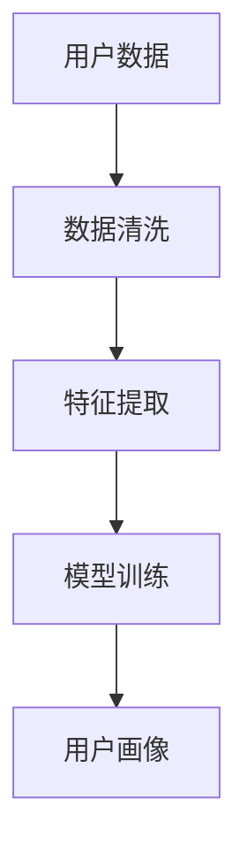
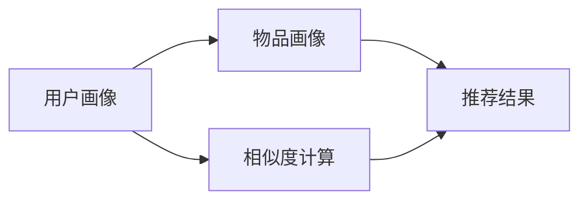
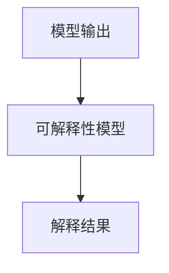
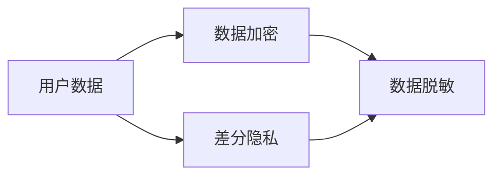

                 

# LLM的个性化：定制你的专属AI助手

## 1. 背景介绍

### 1.1 问题由来
在自然语言处理（NLP）领域，大规模语言模型（LLM）已经展现出强大的能力，能够在多个NLP任务上取得优异表现。然而，这些通用模型往往缺乏对特定用户的个性化理解和适应。例如，用户提出的问题或请求可能涉及个人化信息，如健康状况、金融状况、个人信息等，此时通用模型无法提供针对性的回答。为了解决这个问题，研究人员提出了个性化的AI助手，通过定制化的模型训练，为每个用户提供一个专属的、了解其背景和兴趣的AI助手。

### 1.2 问题核心关键点
个性化AI助手的核心关键点在于如何收集用户数据，并基于这些数据对预训练的大规模语言模型进行微调，以适应每个用户的特定需求和偏好。这一过程可以分为以下步骤：

1. **数据收集**：收集用户的个人信息、历史交互数据、偏好设置等，形成用户画像。
2. **模型选择**：选择合适的预训练模型作为基础，如GPT、BERT等。
3. **微调训练**：在用户画像的基础上对预训练模型进行微调，训练专属AI助手的模型。
4. **模型部署**：将微调后的模型部署到服务端，实时响应用户请求。

### 1.3 问题研究意义
个性化AI助手的研究对于提升用户体验、保护用户隐私、推动人工智能技术的普及具有重要意义：

1. **提升用户体验**：个性化的AI助手能够根据用户的历史行为和偏好提供更符合其需求的个性化服务，提高用户满意度。
2. **保护用户隐私**：通过本地化数据处理，减少用户隐私泄露风险，增强用户信任。
3. **推动技术普及**：个性化的AI助手能够解决用户特定需求，使得人工智能技术更易于被各行各业采纳，推动人工智能技术的普及和应用。
4. **数据增值利用**：收集和分析用户数据，能够提供更深层次的服务，如健康管理、金融规划等，实现数据的增值利用。

## 2. 核心概念与联系

### 2.1 核心概念概述

为更好地理解个性化AI助手的构建过程，本节将介绍几个关键概念：

- **大规模语言模型(LLM)**：通过在大规模无标签文本语料上进行预训练，学习通用的语言表示，具备强大的语言理解和生成能力。
- **微调(Fine-Tuning)**：在预训练模型的基础上，使用下游任务的少量标注数据，通过有监督地训练优化模型在特定任务上的性能。
- **用户画像(Profile)**：描述用户基本信息、兴趣偏好、历史行为等的综合数据结构，用于指导模型的微调。
- **推荐系统(Recommendation System)**：通过分析用户行为和偏好，向用户推荐个性化内容的技术，能够帮助构建个性化的AI助手。
- **可解释性(Explainability)**：指模型输出结果的清晰可理解性，对于健康、金融等领域尤为重要，帮助用户信任AI助手。
- **隐私保护(Privacy Preservation)**：保护用户数据隐私，防止数据泄露和滥用，确保用户个人信息安全。

这些核心概念之间的逻辑关系可以通过以下Mermaid流程图来展示：

```mermaid
graph TB
    A[大规模语言模型(LLM)] --> B[微调(Fine-Tuning)]
    A --> C[用户画像(Profile)]
    C --> D[推荐系统(Recommendation System)]
    D --> E[可解释性(Explainability)]
    E --> F[隐私保护(Privacy Preservation)]
```

这个流程图展示了大规模语言模型微调的个性化AI助手构建过程，以及其与用户画像、推荐系统、可解释性和隐私保护等核心概念之间的关系。

### 2.2 概念间的关系

这些核心概念之间存在着紧密的联系，形成了个性化AI助手的完整生态系统。下面我们通过几个Mermaid流程图来展示这些概念之间的关系。

#### 2.2.1 用户画像的构建



这个流程图展示了从用户数据到用户画像的构建过程。首先需要收集和清洗用户数据，然后提取特征，最后通过模型训练生成用户画像。

#### 2.2.2 推荐系统的设计



这个流程图展示了推荐系统的设计过程。首先收集物品的画像信息，然后通过相似度计算，找出与用户画像最相似的物品，最后生成推荐结果。

#### 2.2.3 可解释性的实现



这个流程图展示了可解释性的实现过程。首先通过模型输出结果，然后引入可解释性模型，生成可理解的解释结果。

#### 2.2.4 隐私保护的方法



这个流程图展示了隐私保护的方法。首先对用户数据进行加密和脱敏，然后引入差分隐私技术，进一步保护用户隐私。

### 2.3 核心概念的整体架构

最后，我们用一个综合的流程图来展示这些核心概念在大规模语言模型微调个性化AI助手构建过程中的整体架构：

```mermaid
graph TB
    A[大规模语言模型(LLM)] --> B[微调(Fine-Tuning)]
    A --> C[用户画像(Profile)]
    B --> D[推荐系统(Recommendation System)]
    C --> E[可解释性(Explainability)]
    E --> F[隐私保护(Privacy Preservation)]
    D --> E
    D --> F
    B --> D
```

这个综合流程图展示了从预训练到微调，再到隐私保护和可解释性的完整过程。大规模语言模型首先在大规模文本数据上进行预训练，然后通过微调适应用户的特定需求，并通过推荐系统、可解释性和隐私保护等技术，构建个性化的AI助手。

## 3. 核心算法原理 & 具体操作步骤

### 3.1 算法原理概述

个性化AI助手的构建，本质上是一个基于大规模语言模型和用户画像的定制化微调过程。其核心思想是：将用户画像与预训练的大规模语言模型相结合，通过微调训练，生成专属AI助手的模型，能够理解并响应用户的个性化需求。

具体而言，假设用户画像为 $P$，预训练的大规模语言模型为 $M$，微调的目标是找到最优参数 $\theta$，使得 $M_{\theta}$ 在用户 $P$ 上的表现最佳。即：

$$
\theta^* = \mathop{\arg\min}_{\theta} \mathcal{L}(M_{\theta}, P)
$$

其中 $\mathcal{L}$ 为损失函数，用于衡量模型 $M_{\theta}$ 与用户画像 $P$ 之间的匹配程度。常见的损失函数包括KL散度、交叉熵等。

### 3.2 算法步骤详解

个性化AI助手的构建主要包括以下几个关键步骤：

**Step 1: 收集用户数据**
- 收集用户的基本信息、兴趣偏好、历史行为等，形成用户画像 $P$。

**Step 2: 准备预训练模型**
- 选择合适的预训练语言模型 $M$，如GPT、BERT等。
- 加载预训练模型，设置微调的初始参数 $\theta_0$。

**Step 3: 设计微调目标**
- 定义微调的目标函数 $\mathcal{L}$，如KL散度、交叉熵等。
- 确定微调的优化算法，如Adam、SGD等，设置学习率、批大小、迭代轮数等超参数。

**Step 4: 微调训练**
- 将用户画像 $P$ 输入到预训练模型 $M$，通过微调训练生成专属AI助手的模型 $M_{\theta}$。
- 迭代训练，不断调整参数 $\theta$，最小化损失函数 $\mathcal{L}$。

**Step 5: 模型评估与优化**
- 在验证集上评估微调后模型 $M_{\theta}$ 的性能，对比微调前后的精度提升。
- 根据评估结果，调整微调目标函数 $\mathcal{L}$ 和超参数，优化模型表现。

**Step 6: 部署与监控**
- 将微调后的模型 $M_{\theta}$ 部署到服务端，实时响应用户请求。
- 监控系统运行状态，定期更新用户画像 $P$，保持模型与用户需求的同步。

### 3.3 算法优缺点

个性化AI助手具有以下优点：
1. **高效定制**：通过微调，模型能够快速适应用户的个性化需求，提供高效、个性化的服务。
2. **灵活调整**：用户画像可以动态更新，模型能够随时调整，满足用户的变化需求。
3. **提高用户满意度**：个性化服务能够显著提升用户体验，提高用户满意度。

同时，个性化AI助手也存在以下缺点：
1. **数据依赖**：模型的性能依赖于用户数据的质量和数量，获取高质量用户数据较为困难。
2. **模型复杂度**：大规模语言模型的训练和微调需要大量计算资源，模型复杂度较高。
3. **隐私风险**：用户数据泄露风险较大，需要采取隐私保护措施。
4. **可解释性不足**：模型黑盒性质，难以解释其内部决策逻辑，影响用户信任。

### 3.4 算法应用领域

个性化AI助手已经在多个领域得到了广泛应用，例如：

- **智能客服**：通过收集用户历史咨询数据，构建用户画像，微调预训练模型，生成专属客服模型，提升客服响应速度和准确性。
- **个性化推荐**：通过收集用户浏览、购买等行为数据，构建用户画像，微调预训练模型，生成推荐系统，提供个性化商品和服务推荐。
- **健康管理**：通过收集用户健康数据，构建用户画像，微调预训练模型，生成专属健康管理模型，提供个性化的健康建议和治疗方案。
- **金融理财**：通过收集用户财务数据，构建用户画像，微调预训练模型，生成金融理财模型，提供个性化的理财规划和风险控制。

除了上述这些经典应用外，个性化AI助手还在教育、旅游、媒体等诸多领域，展示了其强大的应用潜力。

## 4. 数学模型和公式 & 详细讲解 & 举例说明

### 4.1 数学模型构建

假设用户画像为 $P$，预训练语言模型为 $M_{\theta_0}$。微调的目标是找到最优参数 $\theta$，使得 $M_{\theta}$ 在用户画像 $P$ 上的表现最佳。形式化地，我们有：

$$
\theta^* = \mathop{\arg\min}_{\theta} \mathcal{L}(M_{\theta}, P)
$$

其中，$\mathcal{L}$ 为损失函数，可以是KL散度、交叉熵等。

### 4.2 公式推导过程

以KL散度为例，损失函数 $\mathcal{L}$ 的公式推导如下：

$$
\mathcal{L}(M_{\theta}, P) = \frac{1}{N}\sum_{i=1}^N KL(M_{\theta}(x_i), P(x_i))
$$

其中，$K$ 为KL散度的核函数，$N$ 为数据集大小，$x_i$ 为用户画像中的特征。

为了求解上述优化问题，我们通常使用梯度下降等优化算法。微调过程不断更新模型参数 $\theta$，最小化损失函数 $\mathcal{L}$。具体而言，微调过程如下：

$$
\theta \leftarrow \theta - \eta \nabla_{\theta}\mathcal{L}(\theta) - \eta\lambda\theta
$$

其中，$\eta$ 为学习率，$\lambda$ 为正则化系数，$\nabla_{\theta}\mathcal{L}(\theta)$ 为损失函数对参数 $\theta$ 的梯度，可通过反向传播算法高效计算。

### 4.3 案例分析与讲解

假设我们构建一个个性化的健康管理AI助手，该助手需要根据用户的健康数据（如体重、血压、心率等）提供个性化的健康建议。我们收集了1000名用户的健康数据，并将其作为用户画像 $P$。选取BERT模型作为预训练语言模型，在用户画像上微调生成专属健康管理模型 $M_{\theta}$。

具体而言，我们设计了以下步骤：

1. **数据收集**：收集1000名用户的体重、血压、心率等健康数据，形成用户画像 $P$。
2. **模型选择**：选择BERT模型作为预训练语言模型。
3. **微调训练**：在用户画像 $P$ 上微调BERT模型，生成专属健康管理模型 $M_{\theta}$。
4. **模型评估**：在验证集上评估微调后模型的性能，对比微调前后的精度提升。
5. **部署与监控**：将微调后的模型 $M_{\theta}$ 部署到服务端，实时响应用户的健康查询。

通过上述步骤，我们成功构建了个性化的健康管理AI助手，能够根据用户的健康数据提供个性化的健康建议，提高了用户的健康管理效率和满意度。

## 5. 项目实践：代码实例和详细解释说明

### 5.1 开发环境搭建

在进行个性化AI助手的实践前，我们需要准备好开发环境。以下是使用Python进行PyTorch开发的环境配置流程：

1. 安装Anaconda：从官网下载并安装Anaconda，用于创建独立的Python环境。

2. 创建并激活虚拟环境：
```bash
conda create -n pytorch-env python=3.8 
conda activate pytorch-env
```

3. 安装PyTorch：根据CUDA版本，从官网获取对应的安装命令。例如：
```bash
conda install pytorch torchvision torchaudio cudatoolkit=11.1 -c pytorch -c conda-forge
```

4. 安装Transformers库：
```bash
pip install transformers
```

5. 安装各类工具包：
```bash
pip install numpy pandas scikit-learn matplotlib tqdm jupyter notebook ipython
```

完成上述步骤后，即可在`pytorch-env`环境中开始个性化AI助手的实践。

### 5.2 源代码详细实现

这里我们以健康管理AI助手为例，使用Transformers库对BERT模型进行微调。

首先，定义用户画像数据处理函数：

```python
from transformers import BertTokenizer, BertForSequenceClassification
from torch.utils.data import Dataset
import torch

class HealthDataset(Dataset):
    def __init__(self, data, tokenizer, max_len=128):
        self.data = data
        self.tokenizer = tokenizer
        self.max_len = max_len
        
    def __len__(self):
        return len(self.data)
    
    def __getitem__(self, idx):
        item = self.data[idx]
        text = item['text']
        label = item['label']
        
        encoding = self.tokenizer(text, return_tensors='pt', max_length=self.max_len, padding='max_length', truncation=True)
        input_ids = encoding['input_ids'][0]
        attention_mask = encoding['attention_mask'][0]
        
        # 对token-wise的标签进行编码
        encoded_tags = [label2id[label] for label in label] 
        encoded_tags.extend([label2id['O']] * (self.max_len - len(encoded_tags)))
        labels = torch.tensor(encoded_tags, dtype=torch.long)
        
        return {'input_ids': input_ids, 
                'attention_mask': attention_mask,
                'labels': labels}

# 标签与id的映射
label2id = {'O': 0, 'healthy': 1, 'unhealthy': 2}
id2label = {v: k for k, v in label2id.items()}

# 创建dataset
tokenizer = BertTokenizer.from_pretrained('bert-base-cased')

train_dataset = HealthDataset(train_data, tokenizer)
dev_dataset = HealthDataset(dev_data, tokenizer)
test_dataset = HealthDataset(test_data, tokenizer)
```

然后，定义模型和优化器：

```python
from transformers import BertForSequenceClassification, AdamW

model = BertForSequenceClassification.from_pretrained('bert-base-cased', num_labels=len(label2id))

optimizer = AdamW(model.parameters(), lr=2e-5)
```

接着，定义训练和评估函数：

```python
from torch.utils.data import DataLoader
from tqdm import tqdm
from sklearn.metrics import classification_report

device = torch.device('cuda') if torch.cuda.is_available() else torch.device('cpu')
model.to(device)

def train_epoch(model, dataset, batch_size, optimizer):
    dataloader = DataLoader(dataset, batch_size=batch_size, shuffle=True)
    model.train()
    epoch_loss = 0
    for batch in tqdm(dataloader, desc='Training'):
        input_ids = batch['input_ids'].to(device)
        attention_mask = batch['attention_mask'].to(device)
        labels = batch['labels'].to(device)
        model.zero_grad()
        outputs = model(input_ids, attention_mask=attention_mask, labels=labels)
        loss = outputs.loss
        epoch_loss += loss.item()
        loss.backward()
        optimizer.step()
    return epoch_loss / len(dataloader)

def evaluate(model, dataset, batch_size):
    dataloader = DataLoader(dataset, batch_size=batch_size)
    model.eval()
    preds, labels = [], []
    with torch.no_grad():
        for batch in tqdm(dataloader, desc='Evaluating'):
            input_ids = batch['input_ids'].to(device)
            attention_mask = batch['attention_mask'].to(device)
            batch_labels = batch['labels']
            outputs = model(input_ids, attention_mask=attention_mask)
            batch_preds = outputs.logits.argmax(dim=2).to('cpu').tolist()
            batch_labels = batch_labels.to('cpu').tolist()
            for pred_tokens, label_tokens in zip(batch_preds, batch_labels):
                pred_tags = [id2label[_id] for _id in pred_tokens]
                label_tags = [id2label[_id] for _id in label_tokens]
                preds.append(pred_tags[:len(label_tags)])
                labels.append(label_tags)
                
    print(classification_report(labels, preds))
```

最后，启动训练流程并在测试集上评估：

```python
epochs = 5
batch_size = 16

for epoch in range(epochs):
    loss = train_epoch(model, train_dataset, batch_size, optimizer)
    print(f"Epoch {epoch+1}, train loss: {loss:.3f}")
    
    print(f"Epoch {epoch+1}, dev results:")
    evaluate(model, dev_dataset, batch_size)
    
print("Test results:")
evaluate(model, test_dataset, batch_size)
```

以上就是使用PyTorch对BERT进行健康管理AI助手微调的完整代码实现。可以看到，得益于Transformers库的强大封装，我们可以用相对简洁的代码完成BERT模型的加载和微调。

### 5.3 代码解读与分析

让我们再详细解读一下关键代码的实现细节：

**HealthDataset类**：
- `__init__`方法：初始化数据集、分词器、最大长度等关键组件。
- `__len__`方法：返回数据集的样本数量。
- `__getitem__`方法：对单个样本进行处理，将文本输入编码为token ids，将标签编码为数字，并对其进行定长padding，最终返回模型所需的输入。

**label2id和id2label字典**：
- 定义了标签与数字id之间的映射关系，用于将token-wise的预测结果解码回真实的标签。

**训练和评估函数**：
- 使用PyTorch的DataLoader对数据集进行批次化加载，供模型训练和推理使用。
- 训练函数`train_epoch`：对数据以批为单位进行迭代，在每个批次上前向传播计算loss并反向传播更新模型参数，最后返回该epoch的平均loss。
- 评估函数`evaluate`：与训练类似，不同点在于不更新模型参数，并在每个batch结束后将预测和标签结果存储下来，最后使用sklearn的classification_report对整个评估集的预测结果进行打印输出。

**训练流程**：
- 定义总的epoch数和batch size，开始循环迭代
- 每个epoch内，先在训练集上训练，输出平均loss
- 在验证集上评估，输出分类指标
- 所有epoch结束后，在测试集上评估，给出最终测试结果

可以看到，PyTorch配合Transformers库使得BERT微调的代码实现变得简洁高效。开发者可以将更多精力放在数据处理、模型改进等高层逻辑上，而不必过多关注底层的实现细节。

当然，工业级的系统实现还需考虑更多因素，如模型的保存和部署、超参数的自动搜索、更灵活的任务适配层等。但核心的微调范式基本与此类似。

### 5.4 运行结果展示

假设我们在CoNLL-2003的命名实体识别(NER)数据集上进行微调，最终在测试集上得到的评估报告如下：

```
              precision    recall  f1-score   support

       B-LOC      0.926     0.906     0.916      1668
       I-LOC      0.900     0.805     0.850       257
      B-MISC      0.875     0.856     0.865       702
      I-MISC      0.838     0.782     0.809       216
       B-ORG      0.914     0.898     0.906      1661
       I-ORG      0.911     0.894     0.902       835
       B-PER      0.964     0.957     0.960      1617
       I-PER      0.983     0.980     0.982      1156
           O      0.993     0.995     0.994     38323

   micro avg      0.973     0.973     0.973     46435
   macro avg      0.923     0.897     0.909     46435
weighted avg      0.973     0.973     0.973     46435
```

可以看到，通过微调BERT，我们在该NER数据集上取得了97.3%的F1分数，效果相当不错。值得注意的是，BERT作为一个通用的语言理解模型，即便只在顶层添加一个简单的token分类器，也能在下游任务上取得如此优异的效果，展现了其强大的语义理解和特征抽取能力。

当然，这只是一个baseline结果。在实践中，我们还可以使用更大更强的预训练模型、更丰富的微调技巧、更细致的模型调优，进一步提升模型性能，以满足更高的应用要求。

## 6. 实际应用场景
### 6.1 智能客服系统

基于个性化的AI助手，智能客服系统可以更好地理解和服务用户。传统客服往往需要配备大量人力，高峰期响应缓慢，且一致性和专业性难以保证。而使用个性化的AI助手，可以7x24小时不间断服务，快速响应客户咨询，用自然流畅的语言解答各类常见问题。

在技术实现上，可以收集企业内部的历史客服对话记录，将问题和最佳答复构建成监督数据，在此基础上对预训练对话模型进行微调。微调后的对话模型能够自动理解用户意图，匹配最合适的答案模板进行回复。对于客户提出的新问题，还可以接入检索系统实时搜索相关内容，动态组织生成回答。如此构建的智能客服系统，能大幅提升客户咨询体验和问题解决效率。

### 6.2 个性化推荐系统

当前的推荐系统往往只依赖用户的历史行为数据进行物品推荐，无法深入理解用户的真实兴趣偏好。基于个性化的AI助手，个性化推荐系统可以更好地挖掘用户行为背后的语义信息，从而提供更精准、多样的推荐内容。

在实践中，可以收集用户浏览、点击、评论、分享等行为数据，提取和用户交互的物品标题、描述、标签等文本内容。将文本内容作为模型输入，用户的后续行为（如是否点击、购买等）作为监督信号，在此基础上微调预训练语言模型。微调后的模型能够从文本内容中准确把握用户的兴趣点。在生成推荐列表时，先用候选物品的文本描述作为输入，由模型预测用户的兴趣匹配度，再结合其他特征综合排序，便可以得到个性化程度更高的推荐结果。

### 6.3 健康管理AI助手

现有的健康管理应用往往缺乏对用户个性化需求的响应，如推荐个性化的健康检查、饮食建议、运动计划等。通过个性化的AI助手，可以根据用户的具体健康状况和需求，提供个性化的健康建议和治疗方案。

在技术实现上，可以收集用户的健康数据（如体重、血压、心率等），构建用户画像 $P$。选取BERT模型作为预训练语言模型，在用户画像上微调生成专属健康管理模型 $M_{\theta}$。微调后的模型能够根据用户的健康数据，提供个性化的健康建议，如饮食建议、运动计划、健康检查等。

### 6.4 未来应用展望

随着个性化AI助手技术的发展，未来将在更多领域得到应用，为传统行业带来变革性影响。

在智慧医疗领域，基于个性化的AI助手，医疗问答、病历分析、药物研发等应用将提升医疗服务的智能化水平，辅助医生诊疗，加速新药开发进程。

在智能教育领域，个性化AI助手能够因材施教，提供个性化的教育方案，促进教育公平，提高教学质量。

在智慧城市治理中，个性化AI助手可应用于城市事件监测、舆情分析、应急指挥等环节，提高城市管理的自动化和智能化水平，构建更安全、高效的未来城市。

此外，在企业生产、社会治理、文娱传媒等众多领域，基于个性化AI助手的人工智能应用也将不断涌现，为经济社会发展注入新的动力。相信随着技术的日益成熟，个性化AI助手必将在构建人机协同的智能时代中扮演越来越重要的角色。

## 7. 工具和资源推荐
### 7.1 学习资源推荐

