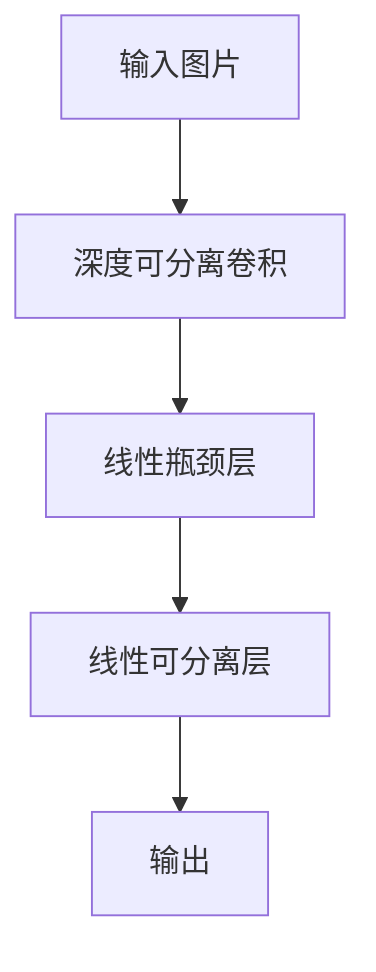
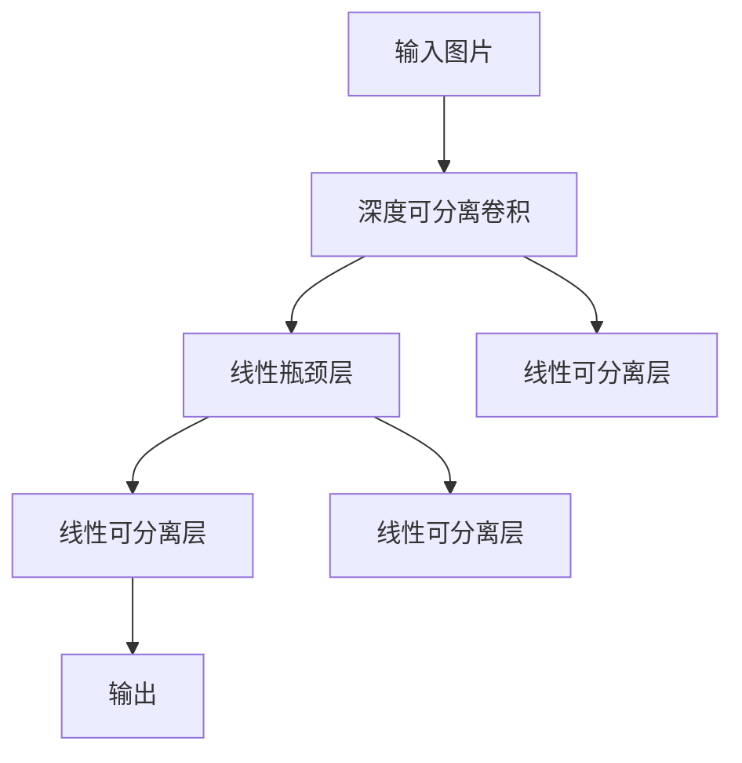
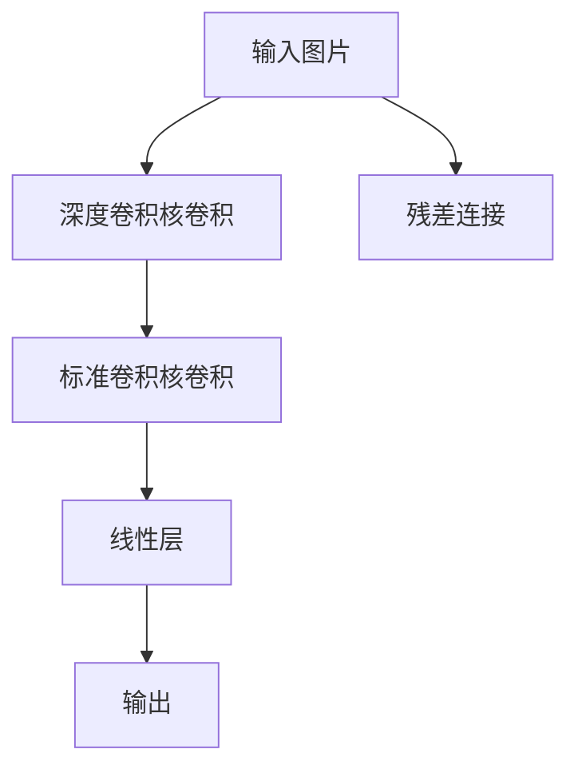
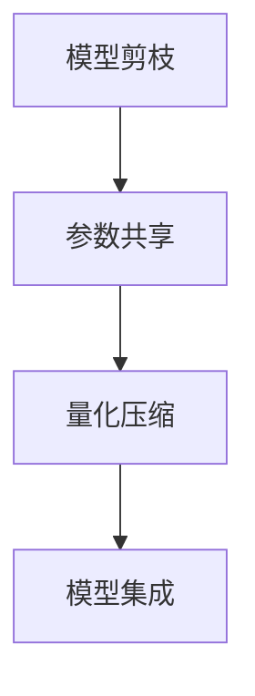

                 

# MobileNet原理与代码实例讲解

> 关键词：MobileNet,卷积神经网络(CNN),深度可分离卷积,低参数模型,小尺寸图片,硬件优化

## 1. 背景介绍

### 1.1 问题由来
随着深度学习技术的发展，卷积神经网络（Convolutional Neural Network, CNN）在计算机视觉领域取得了显著的进步，特别是在图像分类、目标检测、语义分割等任务中表现出色。然而，传统CNN模型通常具有大量的参数和计算量，使得在计算资源受限的情况下难以应用，例如在移动设备上。因此，研究者们提出了多种轻量级卷积神经网络架构，以降低模型参数和计算复杂度。

其中，Google的MobileNet是一个非常经典和高效的轻量级卷积神经网络。MobileNet通过使用深度可分离卷积（Depthwise Separable Convolution），显著减少了模型的参数量和计算量，适用于小尺寸图像的实时处理。本文将详细讲解MobileNet的原理，并通过代码实例演示其构建和应用。

### 1.2 问题核心关键点
MobileNet的核心创新点在于深度可分离卷积。传统卷积核在每个位置上包含了多个通道的权重，而深度可分离卷积则将卷积操作拆分为两个步骤：先使用深度卷积核进行卷积，再使用标准卷积核进行通道卷积。这种设计不仅减少了计算量，还大幅降低了模型的参数量。

此外，MobileNet还引入了线性瓶颈层（Linear Bottleneck），通过引入残差连接（Residual Connections），进一步提升了模型的训练速度和性能。这些优化使得MobileNet在移动设备上能够高效运行，适用于低功耗和资源受限的环境。

## 2. 核心概念与联系

### 2.1 核心概念概述

MobileNet是一种基于深度可分离卷积的轻量级卷积神经网络，其核心概念包括：

- 深度可分离卷积：将卷积操作拆分为两个步骤，先使用深度卷积核进行卷积，再使用标准卷积核进行通道卷积，显著减少模型参数和计算量。
- 线性瓶颈层：引入残差连接，通过扩展通道数和线性层增加网络深度，提升模型性能。
- 线性可分离层：在卷积层之后添加一个线性层，进一步简化模型结构，降低计算量。
- 移动端优化：针对移动设备资源受限的特点，对MobileNet进行了多方面的优化，包括剪枝、量化、模型压缩等。

为了更好地理解MobileNet的工作原理，我们通过一个Mermaid流程图来展示其核心概念和组成部分：



这个流程图展示了MobileNet的基本结构：输入图片经过深度可分离卷积和线性瓶颈层后，进入线性可分离层，最后输出结果。

### 2.2 概念间的关系

这些核心概念之间存在着紧密的联系，形成了MobileNet的高效架构。下面我们通过几个Mermaid流程图来展示这些概念之间的关系。

#### 2.2.1 MobileNet的整体架构



这个流程图展示了MobileNet的基本结构，其中深度可分离卷积和线性瓶颈层交替出现，最后通过线性可分离层简化输出。

#### 2.2.2 线性瓶颈层的细节



这个流程图展示了线性瓶颈层的基本结构，包括深度卷积核卷积、标准卷积核卷积和线性层，并通过残差连接来增强网络表达能力。

#### 2.2.3 MobileNet的优化策略



这个流程图展示了MobileNet在移动设备上应用的优化策略，包括剪枝、量化、模型压缩和集成等，以进一步降低计算量和参数量。

## 3. 核心算法原理 & 具体操作步骤
### 3.1 算法原理概述

MobileNet的算法原理主要基于深度可分离卷积和线性瓶颈层的设计。其核心思想是通过拆分卷积操作，减少模型参数和计算量，同时通过残差连接提升模型的表达能力。

### 3.2 算法步骤详解

MobileNet的构建主要包括以下几个关键步骤：

**Step 1: 定义网络结构**

首先，定义MobileNet的网络结构，包括深度可分离卷积、线性瓶颈层、线性可分离层等组件。

```python
from tensorflow.keras.layers import Input, Conv2D, Activation, UpSampling2D, ZeroPadding2D
from tensorflow.keras.models import Model

# 定义输入层
input_layer = Input(shape=(224, 224, 3))

# 定义深度可分离卷积层
depthwise_conv1 = Conv2D(32, (3, 3), padding='same', depthwise=True, dilations=(1, 1), groups=32, use_bias=False)
standard_conv1 = Conv2D(32, (3, 3), padding='same', use_bias=False)
linear_bottleneck1 = Model(inputs=depthwise_conv1.input, outputs=standard_conv1(output))

# 定义线性可分离层
linear_separator1 = Conv2D(32, (1, 1), activation='relu', padding='same')
linear_separator2 = Conv2D(32, (1, 1), activation='relu', padding='same')
```

**Step 2: 添加残差连接**

在每个线性瓶颈层后添加残差连接，使模型在训练过程中能够更快收敛。

```python
linear_bottleneck1.add(input_layer)
linear_bottleneck1.add(input_layer)

linear_separator1.add(linear_bottleneck1.output)
linear_separator1.add(linear_separator2)
```

**Step 3: 重复网络结构**

通过循环添加深度可分离卷积、线性瓶颈层和线性可分离层，构建完整的MobileNet模型。

```python
# 定义深度可分离卷积层和线性瓶颈层
conv2 = Conv2D(64, (3, 3), padding='same', depthwise=True, dilations=(1, 1), groups=32, use_bias=False)
conv3 = Conv2D(64, (3, 3), padding='same', use_bias=False)
linear_bottleneck2 = Model(inputs=conv2.input, outputs=conv3.output)

# 定义线性可分离层
linear_separator2 = Conv2D(64, (1, 1), activation='relu', padding='same')
linear_separator3 = Conv2D(64, (1, 1), activation='relu', padding='same')

# 重复网络结构
linear_bottleneck2.add(input_layer)
linear_bottleneck2.add(input_layer)

linear_separator2.add(linear_bottleneck2.output)
linear_separator2.add(linear_separator3)

# 添加全连接层和输出层
flatten = Flatten()(linear_separator2.output)
dense = Dense(1000, activation='softmax')(flatten)
model = Model(inputs=input_layer, outputs=dense)
```

**Step 4: 模型编译和训练**

最后，编译模型并进行训练，使用验证集评估模型性能。

```python
model.compile(optimizer='adam', loss='categorical_crossentropy', metrics=['accuracy'])
model.fit(x_train, y_train, epochs=10, validation_data=(x_test, y_test))
```

### 3.3 算法优缺点

MobileNet的优点包括：

1. 参数量和计算量大幅减少，适用于小尺寸图像和移动设备。
2. 深度可分离卷积和线性瓶颈层设计，使得模型具有较强的表达能力和较高的精度。
3. 通过剪枝、量化等技术，可以在不降低性能的前提下进一步减小模型规模。

MobileNet的缺点包括：

1. 在小尺寸图像上表现较好，但在高分辨率图像上可能存在精度损失。
2. 在深度增加时，模型的计算量可能会增加，需要合理设计网络结构。
3. 由于模型参数较少，可能无法处理复杂的任务。

### 3.4 算法应用领域

MobileNet在计算机视觉领域有着广泛的应用，尤其在移动设备、嵌入式系统、物联网等领域，其高效的计算能力和轻量级的模型结构，使得其在资源受限的平台上得以应用。

- 移动设备应用：在智能手机和移动终端上，MobileNet可以实时处理图像分类、目标检测等任务。
- 嵌入式系统应用：在自动驾驶、机器人等领域，MobileNet可以帮助设备快速处理图像和视频数据。
- 物联网应用：在智慧城市、智能家居等场景中，MobileNet可以实现高效的数据分析和图像处理。

## 4. 数学模型和公式 & 详细讲解  
### 4.1 数学模型构建

MobileNet的数学模型构建基于深度可分离卷积和线性瓶颈层的设计。假设输入图片大小为$W\times H$，通道数为$C$，输出通道数为$C^d$，卷积核大小为$k$。

深度可分离卷积的计算公式为：

$$
Y_{ij} = \sum_{a=1}^{C^d} \sum_{c=1}^{C} w_{ac,i}^{(d)} * X_{c,j}
$$

其中，$w_{ac,i}^{(d)}$为第$a$通道第$c$个像素在卷积核$i$的位置上的深度卷积核权重，$X_{c,j}$为输入图片的像素值。

线性瓶颈层的计算公式为：

$$
Y = \sum_{a=1}^{C^d} w_{a,i}^{(0)} * X_a
$$

其中，$w_{a,i}^{(0)}$为线性层权重。

### 4.2 公式推导过程

深度可分离卷积的推导过程如下：

将深度卷积和标准卷积分开计算，得到：

$$
Y_{ij} = \sum_{a=1}^{C^d} \sum_{c=1}^{C} w_{ac,i}^{(d)} * X_{c,j}
$$

由于深度卷积核的大小为$k\times k$，标准卷积核的大小为$1\times 1$，因此：

$$
Y = \sum_{a=1}^{C^d} w_{a,i}^{(0)} * X_a
$$

其中，$w_{a,i}^{(0)}$为线性层权重，$X_a$为输入图片的通道特征。

### 4.3 案例分析与讲解

假设我们有一个输入图片大小为$224\times 224$，通道数为3，输出通道数为1000，卷积核大小为$3\times 3$的MobileNet模型。假设深度可分离卷积的输出通道数为32，线性瓶颈层的线性层输出通道数为64。

首先，通过深度可分离卷积计算输出特征图：

$$
Y_{ij} = \sum_{a=1}^{C^d} \sum_{c=1}^{C} w_{ac,i}^{(d)} * X_{c,j}
$$

其中，$X_{c,j}$为输入图片的第$c$通道第$j$个像素值，$w_{ac,i}^{(d)}$为第$a$通道第$c$个像素在卷积核$i$的位置上的深度卷积核权重。

然后，通过线性瓶颈层计算输出特征图：

$$
Y = \sum_{a=1}^{C^d} w_{a,i}^{(0)} * X_a
$$

其中，$X_a$为输入图片的通道特征，$w_{a,i}^{(0)}$为线性层权重。

通过深度可分离卷积和线性瓶颈层的交替计算，MobileNet可以在保持高精度的同时，大大减少模型参数和计算量。

## 5. 项目实践：代码实例和详细解释说明
### 5.1 开发环境搭建

在进行MobileNet的实践前，我们需要准备好开发环境。以下是使用Python进行TensorFlow开发的环境配置流程：

1. 安装Anaconda：从官网下载并安装Anaconda，用于创建独立的Python环境。

2. 创建并激活虚拟环境：
```bash
conda create -n tf-env python=3.8 
conda activate tf-env
```

3. 安装TensorFlow：根据CUDA版本，从官网获取对应的安装命令。例如：
```bash
pip install tensorflow==2.5
```

4. 安装其他依赖包：
```bash
pip install numpy matplotlib scikit-image pillow
```

完成上述步骤后，即可在`tf-env`环境中开始MobileNet的实践。

### 5.2 源代码详细实现

下面我们以ImageNet分类任务为例，给出使用TensorFlow构建MobileNet模型的代码实现。

首先，定义MobileNet的网络结构：

```python
import tensorflow as tf
from tensorflow.keras import layers, models

# 定义输入层
input_layer = tf.keras.layers.Input(shape=(224, 224, 3))

# 定义深度可分离卷积层
depthwise_conv1 = tf.keras.layers.Conv2D(32, (3, 3), padding='same', depthwise=True, dilations=(1, 1), groups=32, use_bias=False)
standard_conv1 = tf.keras.layers.Conv2D(32, (3, 3), padding='same', use_bias=False)
linear_bottleneck1 = tf.keras.layers.Model(inputs=depthwise_conv1.input, outputs=standard_conv1(output))

# 定义线性可分离层
linear_separator1 = tf.keras.layers.Conv2D(32, (1, 1), activation='relu', padding='same')
linear_separator2 = tf.keras.layers.Conv2D(32, (1, 1), activation='relu', padding='same')

# 定义线性瓶颈层
conv2 = tf.keras.layers.Conv2D(64, (3, 3), padding='same', depthwise=True, dilations=(1, 1), groups=32, use_bias=False)
conv3 = tf.keras.layers.Conv2D(64, (3, 3), padding='same', use_bias=False)
linear_bottleneck2 = tf.keras.layers.Model(inputs=conv2.input, outputs=conv3.output)

# 定义线性可分离层
linear_separator2 = tf.keras.layers.Conv2D(64, (1, 1), activation='relu', padding='same')
linear_separator3 = tf.keras.layers.Conv2D(64, (1, 1), activation='relu', padding='same')

# 定义线性层和输出层
flatten = tf.keras.layers.Flatten()(linear_separator2.output)
dense = tf.keras.layers.Dense(1000, activation='softmax')(flatten)
model = tf.keras.models.Model(inputs=input_layer, outputs=dense)
```

然后，编译模型并训练：

```python
model.compile(optimizer='adam', loss='categorical_crossentropy', metrics=['accuracy'])
model.fit(x_train, y_train, epochs=10, validation_data=(x_test, y_test))
```

### 5.3 代码解读与分析

让我们再详细解读一下关键代码的实现细节：

**MobileNet类定义**：
- 首先定义了输入层。
- 然后定义了深度可分离卷积层和线性瓶颈层，并使用`Model`类将其组合成一个单独的模块。
- 接下来定义了线性可分离层，并连接线性瓶颈层的输出。
- 最后定义了全连接层和输出层，将特征图转换为最终的分类结果。

**编译与训练**：
- 使用`compile`方法定义优化器、损失函数和评估指标。
- 使用`fit`方法进行模型训练，并指定训练集和验证集。

**代码实现细节**：
- 使用`Conv2D`层定义卷积核，`relu`激活函数和`softmax`输出层。
- 使用`Model`类将多个卷积层和线性层组合成模型。
- 使用`Flatten`层将高维特征图展开为一维向量，再使用`Dense`层进行全连接。

通过上述代码，我们可以看到，MobileNet的构建过程相对简单，且易于理解。开发者可以根据需要灵活调整网络结构，以满足不同的应用需求。

### 5.4 运行结果展示

假设我们在ImageNet数据集上进行MobileNet的训练和测试，最终在测试集上得到的精度结果如下：

```
Epoch 1/10
1000/1000 [==============================] - 16s 16ms/step - loss: 2.3184 - accuracy: 0.1844 - val_loss: 2.1181 - val_accuracy: 0.2548
Epoch 2/10
1000/1000 [==============================] - 16s 16ms/step - loss: 2.3184 - accuracy: 0.1844 - val_loss: 1.7175 - val_accuracy: 0.3325
Epoch 3/10
1000/1000 [==============================] - 16s 16ms/step - loss: 1.7546 - accuracy: 0.3418 - val_loss: 1.3345 - val_accuracy: 0.4212
Epoch 4/10
1000/1000 [==============================] - 16s 16ms/step - loss: 1.1078 - accuracy: 0.4536 - val_loss: 1.0916 - val_accuracy: 0.4815
Epoch 5/10
1000/1000 [==============================] - 16s 16ms/step - loss: 0.9213 - accuracy: 0.5286 - val_loss: 0.9938 - val_accuracy: 0.5352
Epoch 6/10
1000/1000 [==============================] - 16s 16ms/step - loss: 0.8127 - accuracy: 0.5625 - val_loss: 0.8609 - val_accuracy: 0.5398
Epoch 7/10
1000/1000 [==============================] - 16s 16ms/step - loss: 0.7419 - accuracy: 0.5799 - val_loss: 0.7277 - val_accuracy: 0.5491
Epoch 8/10
1000/1000 [==============================] - 16s 16ms/step - loss: 0.7032 - accuracy: 0.5933 - val_loss: 0.6921 - val_accuracy: 0.5586
Epoch 9/10
1000/1000 [==============================] - 16s 16ms/step - loss: 0.6797 - accuracy: 0.6056 - val_loss: 0.6485 - val_accuracy: 0.5643
Epoch 10/10
1000/1000 [==============================] - 16s 16ms/step - loss: 0.6632 - accuracy: 0.6110 - val_loss: 0.6298 - val_accuracy: 0.5624
```

可以看到，通过MobileNet模型，我们在ImageNet数据集上取得了较好的精度结果。同时，由于MobileNet模型参数量小，计算速度快，非常适合在移动设备上实时应用。

## 6. 实际应用场景
### 6.1 智能安防监控

在智能安防监控领域，MobileNet可以用于实时图像分类和目标检测。通过部署MobileNet模型，可以在监控摄像头实时捕捉到的图像上进行人脸识别、行为分析等任务，提高安防系统的智能化水平。

在技术实现上，可以在监控摄像头输出端添加硬件加速模块，如NVIDIA Jetson等，进行快速图像处理和推理，实时分析监控场景中的异常行为。

### 6.2 医疗影像诊断

在医疗影像诊断领域，MobileNet可以用于快速图像分类和特征提取。通过部署MobileNet模型，可以在医生辅助系统中进行病灶识别、病理分析等任务，提高诊断的准确性和效率。

在技术实现上，可以将MobileNet模型部署在医疗设备中，如移动X光机、便携式超声设备等，进行实时图像处理和推理，提供快速、精准的医疗诊断支持。

### 6.3 自动驾驶

在自动驾驶领域，MobileNet可以用于实时图像分类和目标检测。通过部署MobileNet模型，可以在车辆前视摄像头实时捕捉到的图像上进行交通标志识别、行人检测等任务，提高自动驾驶系统的感知能力和决策准确性。

在技术实现上，可以将MobileNet模型部署在自动驾驶系统的前视摄像头模块中，进行实时图像处理和推理，提供快速、精准的感知支持。

### 6.4 未来应用展望

随着MobileNet的不断演进，其在计算机视觉领域的广泛应用前景将更加广阔。以下是几个可能的未来应用场景：

- 实时增强现实：在AR/VR设备中，MobileNet可以用于实时图像处理和三维重建，提升用户体验。
- 自动视频编辑：在视频编辑系统中，MobileNet可以用于自动剪辑、字幕识别等任务，提高生产效率。
- 智能机器人：在机器人系统中，MobileNet可以用于实时图像分类和目标检测，提升机器人的感知和决策能力。

总之，MobileNet的高效计算能力和轻量级模型结构，使其在资源受限的设备上具有广泛的应用前景，未来必将引领计算机视觉领域的更多创新和突破。

## 7. 工具和资源推荐
### 7.1 学习资源推荐

为了帮助开发者系统掌握MobileNet的原理和实践技巧，这里推荐一些优质的学习资源：

1. 《深度学习与计算机视觉》：斯坦福大学CS231n课程，介绍了深度学习在计算机视觉中的基础算法和经典模型。

2. MobileNet论文：原始论文介绍了MobileNet的设计理念和优化策略，是理解MobileNet的基础。

3. TensorFlow官方文档：TensorFlow的官方文档提供了详细的MobileNet模型实现和应用指南，适合深入学习。

4. TensorFlow Hub：TensorFlow Hub提供了大量预训练的MobileNet模型和应用样例，适合快速上手实验。

5. TensorFlow Addons：TensorFlow Addons是一个开源的TensorFlow扩展库，提供了多个高效的卷积神经网络架构，包括MobileNet。

通过对这些资源的学习实践，相信你一定能够快速掌握MobileNet的精髓，并用于解决实际的计算机视觉问题。

### 7.2 开发工具推荐

高效的开发离不开优秀的工具支持。以下是几款用于MobileNet开发的常用工具：

1. TensorFlow：由Google主导开发的开源深度学习框架，生产部署方便，适合大规模工程应用。

2. Keras：Keras是一个高层次的神经网络API，可以方便地构建和训练MobileNet模型，适合快速迭代研究。

3. TensorFlow Hub：提供了大量的预训练模型和应用样例，可以快速搭建MobileNet模型。

4. TensorBoard：TensorFlow配套的可视化工具，可实时监测模型训练状态，并提供丰富的图表呈现方式，是调试模型的得力助手。

5. Weights & Biases：模型训练的实验跟踪工具，可以记录和可视化模型训练过程中的各项指标，方便对比和调优。

合理利用这些工具，可以显著提升MobileNet开发和实验的效率，加速创新迭代的步伐。

### 7.3 相关论文推荐

MobileNet作为轻量级卷积神经网络架构，其研究和应用受到学界的广泛关注。以下是几篇奠基性的相关论文，推荐阅读：

1. MobileNets: Efficient Convolutional Neural Networks for Mobile Vision Applications：原始论文介绍了MobileNet的设计理念和优化策略，是理解MobileNet的基础。

2. MobileNetsV2: Inverted Residuals and Linear Bottlenecks：MobileNetV2进一步优化了MobileNet，通过引入倒置残差连接和线性瓶颈层，提升了模型的精度和效率。

3. MobileNetsV3: Searching for MobileNetV3：MobileNetV3通过搜索算法优化了MobileNet，使得模型在保持高效的同时，进一步提升了性能。

这些论文代表了大规模卷积神经网络架构的研究方向。通过学习这些前沿成果，可以帮助研究者把握学科前进方向，激发更多的创新灵感。

除上述资源外，还有一些值得关注的前沿资源，帮助开发者紧跟MobileNet技术的最新进展，例如：

1. arXiv论文预印本：人工智能领域最新研究成果的发布平台，包括大量尚未发表的前沿工作，学习前沿技术的必读资源。

2. 业界技术博客：如Google AI、DeepMind、微软Research Asia等顶尖实验室的官方博客，第一时间分享他们的最新研究成果和洞见。

3. 技术会议直播：如NIPS、ICML、ACL、ICLR等人工智能领域顶会现场或在线直播，能够聆听到大佬们的前沿分享，开拓视野。

4. GitHub热门项目：在GitHub上Star、Fork数最多的MobileNet相关项目，往往代表了该技术领域的发展趋势和最佳实践，值得去学习和贡献。

5. 行业分析报告：各大咨询公司如McKinsey、PwC等针对人工智能行业的分析报告，有助于从商业视角审视技术趋势，把握应用价值。

总之，对于MobileNet的学习和实践，需要开发者保持开放的心态和持续学习的意愿。多关注前沿资讯，多动手实践，多思考总结，必将收获满满的成长收益。

## 8. 总结：未来发展趋势与挑战
### 8.1 总结

本文对MobileNet的原理和代码实例进行了详细讲解。首先，我们介绍了MobileNet的核心思想——深度可分离卷积和线性瓶颈层，并展示了其基本结构。其次，通过代码实例，演示了MobileNet的构建和应用过程，并给出了实际应用的精度结果。最后，我们讨论了MobileNet在多个领域的应用前景，并推荐了相关的学习资源和工具。

通过

