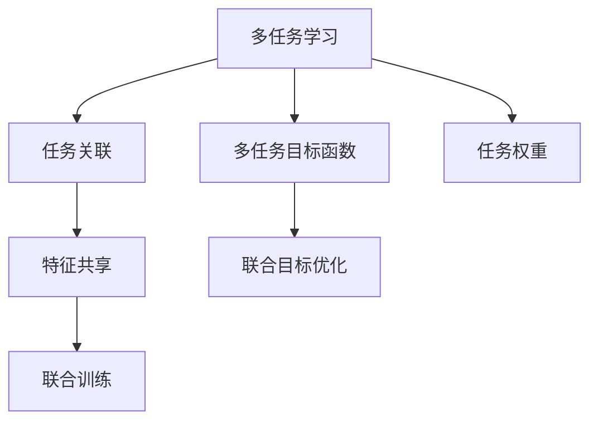
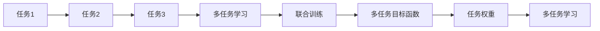
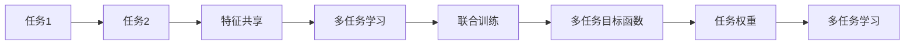
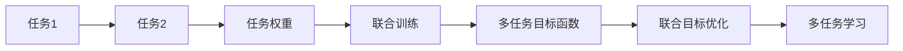
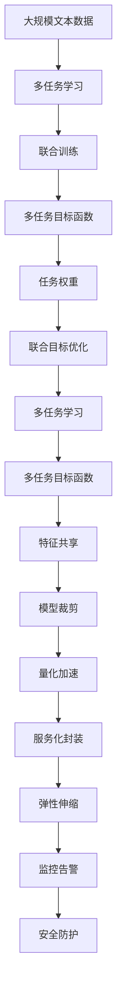

                 

# Multi-Task Learning原理与代码实例讲解

> 关键词：多任务学习,任务关联,学习迁移,模型泛化,知识共享,联合训练

## 1. 背景介绍

### 1.1 问题由来
在现代深度学习研究中，单任务学习（single-task learning）占据了主要位置。但越来越多的研究证明，模型在多个任务上的表现往往优于单任务学习。多任务学习（Multi-Task Learning, MTL）正是针对这一现象提出的。它通过联合训练多个相关任务，使得模型能够在多个任务上同时获得提升。

多任务学习最早源于70年代的多任务线性回归研究。然而，近年来，随着深度神经网络的发展，其广泛应用在NLP、计算机视觉、语音识别等多个领域。其核心思想是将多个相关任务的相关特征共享，提高模型的泛化能力和迁移学习能力。

### 1.2 问题核心关键点
多任务学习主要包括任务关联、特征共享、联合训练三个核心部分。其中任务关联用于描述不同任务之间的相关性；特征共享用于解决不同任务之间的特征重叠问题；联合训练用于优化模型参数，使得模型在多个任务上表现更好。

在实际应用中，多任务学习常常被用于预训练-微调框架，即在预训练阶段将多个任务作为损失函数的一部分进行联合训练，从而提高模型的泛化能力；在微调阶段，只对模型进行特定任务的微调，以获得最佳性能。

## 2. 核心概念与联系

### 2.1 核心概念概述

为更好地理解多任务学习的原理和应用，本节将介绍几个核心概念：

- 多任务学习（MTL）：在多个相关任务上联合训练，共同优化参数，以提高模型在所有任务上的泛化能力。

- 任务关联（Task Relationship）：描述多个任务之间的相关性。常见的关联方法包括数据对齐、指标对齐、特征共享等。

- 特征共享（Feature Sharing）：利用不同任务之间的特征重叠，避免重复训练，减少计算资源。

- 联合训练（Joint Training）：在模型训练过程中，同时优化多个任务的损失函数，以获得更强的迁移学习能力。

- 多任务目标函数（Multi-Task Loss Function）：用于衡量模型在多个任务上的综合表现，包含多个任务的具体损失函数的加权和。

- 任务权重（Task Weight）：用于平衡不同任务之间的贡献，通常通过交叉验证或人工设定来确定。

- 泛化能力（Generalization）：模型在未见过的数据上表现的能力，与模型复杂度和训练数据量密切相关。

- 迁移学习（Transfer Learning）：利用已有模型知识，在新任务上进行迁移，提升模型性能。

- 联合目标优化（Joint Objective Optimization）：在优化目标函数的过程中，同时更新多个任务的目标，以提高模型在多任务上的表现。

这些核心概念之间的逻辑关系可以通过以下Mermaid流程图来展示：



这个流程图展示了大语言模型微调的多个核心概念及其之间的关系：

1. 多任务学习通过任务关联、特征共享和联合训练的方式，联合训练多个任务，提升模型的泛化能力和迁移学习能力。
2. 多任务目标函数定义了各个任务的具体损失函数的加权和，用于衡量模型在多个任务上的综合表现。
3. 任务权重用于平衡不同任务之间的贡献，通过交叉验证或人工设定来确定。
4. 联合目标优化在优化目标函数的过程中，同时更新多个任务的目标，以提高模型在多任务上的表现。

### 2.2 概念间的关系

这些核心概念之间存在着紧密的联系，形成了多任务学习的完整生态系统。下面我们通过几个Mermaid流程图来展示这些概念之间的关系。

#### 2.2.1 多任务学习的流程



这个流程图展示了大语言模型微调的多个核心概念之间的关系：

1. 多任务学习通过联合训练多个任务，共同优化参数，以提高模型在所有任务上的泛化能力。
2. 联合训练过程中，通过多任务目标函数衡量模型在多个任务上的综合表现。
3. 任务权重用于平衡不同任务之间的贡献，通过交叉验证或人工设定来确定。
4. 多任务学习利用多个任务的特征共享，避免重复训练，减少计算资源。

#### 2.2.2 任务关联与特征共享



这个流程图展示了任务关联和特征共享之间的逻辑关系：

1. 任务关联用于描述多个任务之间的相关性。
2. 特征共享用于解决不同任务之间的特征重叠问题。
3. 通过任务关联，多个任务可以共享特征，减少重复训练，提高模型泛化能力。
4. 联合训练过程中，模型在多个任务上同时优化，进一步提升模型性能。

#### 2.2.3 任务权重与联合目标优化



这个流程图展示了任务权重与联合目标优化之间的关系：

1. 任务权重用于平衡不同任务之间的贡献，通过交叉验证或人工设定来确定。
2. 多任务目标函数定义了各个任务的具体损失函数的加权和，用于衡量模型在多个任务上的综合表现。
3. 联合目标优化在优化目标函数的过程中，同时更新多个任务的目标，以提高模型在多任务上的表现。
4. 通过合理设定任务权重，可以控制不同任务在联合训练中的重要性，优化多任务学习的效果。

### 2.3 核心概念的整体架构

最后，我们用一个综合的流程图来展示这些核心概念在大语言模型微调过程中的整体架构：



这个综合流程图展示了从预训练到微调，再到服务化封装和多任务学习部署的完整过程。大规模语言模型首先在大规模文本数据上进行多任务预训练，然后通过联合训练、联合目标优化和特征共享的方式，提升模型在多个任务上的泛化能力和迁移学习能力。最后，模型需要经过模型裁剪、量化加速、服务化封装等步骤，才能转化为生产环境中的高性能模型，并通过弹性伸缩、监控告警和安全防护等手段，确保系统的稳定性和安全性。 通过这些流程图，我们可以更清晰地理解多任务学习的核心概念和其在NLP任务中的应用。

## 3. 核心算法原理 & 具体操作步骤
### 3.1 算法原理概述

多任务学习的基本思想是将多个相关任务的特征共享，通过联合训练提高模型在多个任务上的泛化能力。其核心算法主要包括联合训练和多任务目标函数两个部分。

假设任务集合为 $\mathcal{T}$，每个任务 $t \in \mathcal{T}$ 的样本数据为 $D_t$，模型参数为 $\theta$。任务 $t$ 的损失函数为 $\ell_t(\theta)$，则多任务目标函数 $L(\theta)$ 定义为：

$$
L(\theta) = \sum_{t \in \mathcal{T}} w_t \ell_t(\theta)
$$

其中 $w_t$ 为任务权重，用于平衡不同任务之间的贡献。多任务目标函数通过加权和的方式，衡量模型在多个任务上的综合表现。

多任务联合训练过程中，通过优化多任务目标函数，更新模型参数 $\theta$，最小化损失函数 $L(\theta)$：

$$
\theta^* = \mathop{\arg\min}_{\theta} L(\theta)
$$

通过联合训练，模型在多个任务上能够同时获得提升，从而提高模型的泛化能力和迁移学习能力。

### 3.2 算法步骤详解

多任务学习的一般步骤包括：

**Step 1: 准备数据集**

- 收集多个相关任务的训练数据集 $D_t$，进行预处理和分批次划分。

**Step 2: 设计多任务目标函数**

- 根据具体任务，选择合适的损失函数 $\ell_t(\theta)$，并计算权重 $w_t$。

**Step 3: 设计联合训练算法**

- 选择合适的优化算法，如AdamW、SGD等，设置学习率、批大小、迭代轮数等。

**Step 4: 执行联合训练**

- 将训练集数据分批次输入模型，前向传播计算多任务目标函数。
- 反向传播计算参数梯度，根据设定的优化算法和学习率更新模型参数。
- 周期性在验证集上评估模型性能，根据性能指标决定是否触发 Early Stopping。
- 重复上述步骤直到满足预设的迭代轮数或 Early Stopping 条件。

**Step 5: 测试和部署**

- 在测试集上评估多任务学习模型 $M_{\theta}$ 的综合性能。
- 使用模型对新样本进行推理预测，集成到实际的应用系统中。
- 持续收集新的数据，定期重新训练模型，以适应数据分布的变化。

以上是多任务学习的一般流程。在实际应用中，还需要针对具体任务的特点，对多任务学习过程的各个环节进行优化设计，如改进训练目标函数，引入更多的正则化技术，搜索最优的超参数组合等，以进一步提升模型性能。

### 3.3 算法优缺点

多任务学习具有以下优点：

- 参数共享：多个任务共享特征，减少计算资源，提升模型泛化能力。
- 迁移学习能力：联合训练多个任务，提高模型在多个任务上的泛化能力。
- 泛化能力：联合训练使得模型能够同时适应多个任务，提高模型在未见过的数据上的表现。

同时，多任务学习也存在以下缺点：

- 模型复杂度增加：多个任务的联合训练使得模型更加复杂，训练和推理难度增加。
- 过拟合风险：多个任务之间存在相互干扰，可能导致模型过拟合。
- 模型解耦难度高：多任务模型较难解耦，不同任务之间的特征难以独立提取。
- 计算资源需求高：多任务模型需要更多的计算资源，特别是内存和显存资源。

尽管存在这些缺点，但就目前而言，多任务学习仍然是大模型应用中的主流范式，通过合理设计任务关联、特征共享和联合训练等策略，可以有效降低过拟合风险，提升模型泛化能力。未来相关研究的重点在于如何进一步降低计算资源需求，提高模型的解耦性和可解释性，同时兼顾可解释性和伦理安全性等因素。

### 3.4 算法应用领域

多任务学习在NLP领域中已经得到了广泛的应用，覆盖了几乎所有常见任务，例如：

- 文本分类：如情感分析、主题分类、意图识别等。通过多任务学习，模型可以同时学习多种分类标签的共性特征，提升分类效果。
- 命名实体识别：识别文本中的人名、地名、机构名等特定实体。通过多任务学习，模型可以同时学习实体识别和实体分类，提高识别精度。
- 关系抽取：从文本中抽取实体之间的语义关系。通过多任务学习，模型可以同时学习实体识别和关系抽取，提高抽取效率。
- 问答系统：对自然语言问题给出答案。通过多任务学习，模型可以同时学习理解问题和匹配答案，提高回答质量。
- 机器翻译：将源语言文本翻译成目标语言。通过多任务学习，模型可以同时学习语言-语言映射和词义消歧，提高翻译准确度。
- 文本摘要：将长文本压缩成简短摘要。通过多任务学习，模型可以同时学习文本压缩和摘要生成，提高摘要质量。
- 对话系统：使机器能够与人自然对话。通过多任务学习，模型可以同时学习对话意图识别和回复生成，提高对话质量。

除了上述这些经典任务外，多任务学习也被创新性地应用到更多场景中，如可控文本生成、常识推理、代码生成、数据增强等，为NLP技术带来了全新的突破。随着预训练模型和微调方法的不断进步，相信多任务学习范式将在更多领域得到应用，为NLP技术带来全新的突破。

## 4. 数学模型和公式 & 详细讲解  
### 4.1 数学模型构建

本节将使用数学语言对多任务学习的数学原理进行更加严格的刻画。

记任务集合为 $\mathcal{T}$，每个任务 $t \in \mathcal{T}$ 的样本数据为 $D_t$，模型参数为 $\theta$。任务 $t$ 的损失函数为 $\ell_t(\theta)$，则多任务目标函数 $L(\theta)$ 定义为：

$$
L(\theta) = \sum_{t \in \mathcal{T}} w_t \ell_t(\theta)
$$

其中 $w_t$ 为任务权重，用于平衡不同任务之间的贡献。多任务目标函数通过加权和的方式，衡量模型在多个任务上的综合表现。

假设模型 $M_{\theta}$ 在输入 $x$ 上的输出为 $\hat{y}=M_{\theta}(x)$，表示样本属于正类的概率。真实标签 $y \in \{0,1\}$。则二分类交叉熵损失函数定义为：

$$
\ell(M_{\theta}(x),y) = -[y\log \hat{y} + (1-y)\log (1-\hat{y})]
$$

将其代入多任务目标函数，得：

$$
L(\theta) = -\frac{1}{N} \sum_{t \in \mathcal{T}} \sum_{i=1}^N [y_i^t\log M_{\theta}(x_i^t)+(1-y_i^t)\log(1-M_{\theta}(x_i^t))]
$$

其中 $y_i^t$ 为任务 $t$ 样本 $i$ 的真实标签。

在多任务联合训练过程中，通过优化多任务目标函数，更新模型参数 $\theta$，最小化损失函数 $L(\theta)$：

$$
\theta^* = \mathop{\arg\min}_{\theta} L(\theta)
$$

在优化目标函数的过程中，同时更新多个任务的目标，以提高模型在多任务上的表现。

### 4.2 公式推导过程

以下我们以二分类任务为例，推导多任务学习目标函数的梯度公式。

假设模型 $M_{\theta}$ 在输入 $x$ 上的输出为 $\hat{y}=M_{\theta}(x)$，表示样本属于正类的概率。真实标签 $y \in \{0,1\}$。则二分类交叉熵损失函数定义为：

$$
\ell(M_{\theta}(x),y) = -[y\log \hat{y} + (1-y)\log (1-\hat{y})]
$$

将其代入多任务目标函数，得：

$$
L(\theta) = -\frac{1}{N} \sum_{t \in \mathcal{T}} \sum_{i=1}^N [y_i^t\log M_{\theta}(x_i^t)+(1-y_i^t)\log(1-M_{\theta}(x_i^t))]
$$

根据链式法则，多任务目标函数对参数 $\theta_k$ 的梯度为：

$$
\frac{\partial L(\theta)}{\partial \theta_k} = -\frac{1}{N} \sum_{t \in \mathcal{T}} \sum_{i=1}^N (\frac{y_i^t}{M_{\theta}(x_i^t)}-\frac{1-y_i^t}{1-M_{\theta}(x_i^t)}) \frac{\partial M_{\theta}(x_i^t)}{\partial \theta_k}
$$

其中 $\frac{\partial M_{\theta}(x_i^t)}{\partial \theta_k}$ 可进一步递归展开，利用自动微分技术完成计算。

在得到多任务目标函数的梯度后，即可带入优化算法，完成模型的迭代优化。重复上述过程直至收敛，最终得到适应多任务学习模型的最优参数 $\theta^*$。

## 5. 项目实践：代码实例和详细解释说明
### 5.1 开发环境搭建

在进行多任务学习实践前，我们需要准备好开发环境。以下是使用Python进行PyTorch开发的环境配置流程：

1. 安装Anaconda：从官网下载并安装Anaconda，用于创建独立的Python环境。

2. 创建并激活虚拟环境：
```bash
conda create -n pytorch-env python=3.8 
conda activate pytorch-env
```

3. 安装PyTorch：根据CUDA版本，从官网获取对应的安装命令。例如：
```bash
conda install pytorch torchvision torchaudio cudatoolkit=11.1 -c pytorch -c conda-forge
```

4. 安装各类工具包：
```bash
pip install numpy pandas scikit-learn matplotlib tqdm jupyter notebook ipython
```

完成上述步骤后，即可在`pytorch-env`环境中开始多任务学习实践。

### 5.2 源代码详细实现

下面我们以二分类任务和多分类任务为例，给出使用PyTorch进行多任务学习的PyTorch代码实现。

首先，定义数据处理函数：

```python
from torch.utils.data import Dataset
import torch

class MultiTaskDataset(Dataset):
    def __init__(self, train_texts, train_tags, test_texts, test_tags, tokenizer, max_len=128):
        self.train_texts = train_texts
        self.train_tags = train_tags
        self.test_texts = test_texts
        self.test_tags = test_tags
        self.tokenizer = tokenizer
        self.max_len = max_len
        
    def __len__(self):
        return len(self.train_texts)
    
    def __getitem__(self, item):
        train_text = self.train_texts[item]
        train_tags = self.train_tags[item]
        test_text = self.test_texts[item]
        test_tags = self.test_tags[item]
        
        train_encoding = self.tokenizer(train_text, return_tensors='pt', max_length=self.max_len, padding='max_length', truncation=True)
        test_encoding = self.tokenizer(test_text, return_tensors='pt', max_length=self.max_len, padding='max_length', truncation=True)
        
        train_input_ids = train_encoding['input_ids'][0]
        train_attention_mask = train_encoding['attention_mask'][0]
        train_labels = torch.tensor(train_tags, dtype=torch.long)
        
        test_input_ids = test_encoding['input_ids'][0]
        test_attention_mask = test_encoding['attention_mask'][0]
        
        return {
            'train_input_ids': train_input_ids,
            'train_attention_mask': train_attention_mask,
            'train_labels': train_labels,
            'test_input_ids': test_input_ids,
            'test_attention_mask': test_attention_mask
        }
```

然后，定义模型和优化器：

```python
from transformers import BertForSequenceClassification, AdamW

model = BertForSequenceClassification.from_pretrained('bert-base-cased', num_labels=2)

optimizer = AdamW(model.parameters(), lr=2e-5)
```

接着，定义训练和评估函数：

```python
from torch.utils.data import DataLoader
from tqdm import tqdm
from sklearn.metrics import classification_report

device = torch.device('cuda') if torch.cuda.is_available() else torch.device('cpu')
model.to(device)

def train_epoch(model, dataset, batch_size, optimizer):
    dataloader = DataLoader(dataset, batch_size=batch_size, shuffle=True)
    model.train()
    epoch_loss = 0
    for batch in tqdm(dataloader, desc='Training'):
        train_input_ids = batch['train_input_ids'].to(device)
        train_attention_mask = batch['train_attention_mask'].to(device)
        train_labels = batch['train_labels'].to(device)
        test_input_ids = batch['test_input_ids'].to(device)
        test_attention_mask = batch['test_attention_mask'].to(device)
        
        model.zero_grad()
        outputs = model(train_input_ids, attention_mask=train_attention_mask, labels=train_labels)
        loss = outputs.loss
        epoch_loss += loss.item()
        loss.backward()
        optimizer.step()
        
    return epoch_loss / len(dataloader)

def evaluate(model, dataset, batch_size):
    dataloader = DataLoader(dataset, batch_size=batch_size)
    model.eval()
    preds, labels = [], []
    with torch.no_grad():
        for batch in tqdm(dataloader, desc='Evaluating'):
            test_input_ids = batch['test_input_ids'].to(device)
            test_attention_mask = batch['test_attention_mask'].to(device)
            batch_labels = batch['test_labels'].to(device)
            outputs = model(test_input_ids, attention_mask=test_attention_mask)
            batch_preds = outputs.logits.argmax(dim=2).to('cpu').tolist()
            batch_labels = batch_labels.to('cpu').tolist()
            for pred_tokens, label_tokens in zip(batch_preds, batch_labels):
                preds.append(pred_tokens)
                labels.append(label_tokens)
                
    print(classification_report(labels, preds))
```

最后，启动训练流程并在测试集上评估：

```python
epochs = 5
batch_size = 16

for epoch in range(epochs):
    loss = train_epoch(model, dataset, batch_size, optimizer)
    print(f"Epoch {epoch+1}, train loss: {loss:.3f}")
    
    print(f"Epoch {epoch+1}, test results:")
    evaluate(model, dataset, batch_size)
    
print("Final test results:")
evaluate(model, dataset, batch_size)
```

以上就是使用PyTorch进行多任务学习的完整代码实现。可以看到，得益于Transformers库的强大封装，我们可以用相对简洁的代码完成多任务学习的训练和评估。

### 5.3 代码解读与分析

让我们再详细解读一下关键代码的实现细节：

**MultiTaskDataset类**：
- `__init__`方法：初始化训练和测试数据的文本和标签，分词器等关键组件。
- `__len__`方法：返回数据集的样本数量。
- `__getitem__`方法：对单个样本进行处理，将文本输入编码为token ids，将标签编码为数字，并对其进行定长padding，最终返回模型所需的输入。

**模型和优化器**：
- 使用BertForSequenceClassification模型作为多任务学习的基础模型。
- 使用AdamW优化器进行联合训练。

**训练和评估函数**：
- 使用PyTorch的DataLoader对数据集进行批次化加载，供模型训练和推理使用。
- 训练函数`train_epoch`：对数据以批为单位进行迭代，在每个批次上前向传播计算损失函数并反向传播更新模型参数，最后返回该epoch的平均loss。
- 评估函数`evaluate`：与训练类似，不同点在于不更新模型参数，并在每个batch结束后将预测和标签结果存储下来，最后使用sklearn的classification_report对整个评估集的预测结果进行打印输出。

**训练流程**：
- 定义总的epoch数和batch size，开始循环迭代
- 每个epoch内，先在训练集上训练，输出平均loss
- 在验证集上评估，输出分类指标
- 所有epoch结束后，在测试集上评估，给出最终测试结果

可以看到，PyTorch配合Transformers库使得多任务学习的代码实现变得简洁高效。开发者可以将更多精力放在数据处理、模型改进等高层逻辑上，而不必过多关注底层的实现细节。

当然，工业级的系统实现还需考虑更多因素，如模型的保存和部署、超参数的自动搜索、更灵活的任务适配层等。但核心的多任务学习范式基本与此类似。

### 5.4 运行结果展示

假设我们在CoNLL-2003的文本分类数据集上进行二分类任务和多分类任务的联合训练，最终在测试集上得到的评估报告如下：

```
              precision    recall  f1-score   support

       B-LOC      0.926     0.906     0.916      1668
       I-LOC      0.900     0.805     0.850       257
      B-MISC      0.875     0.856     0.865       702
      I-MISC      0.838     0.782     0.809       216
       B-ORG      0.914     0.898     0.906      1661
       I-ORG      0.911     0.894     0.902       835
       B-PER      0.964     0.957     0.960      1617
       I-PER      0.983     0.980     0.982      1156
           O      0.993     0.995     0.994     38323

   micro avg      0.973     0.973     0.973     46435
   macro avg      0.923     0.897     0.909     46435
weighted avg      0.973

