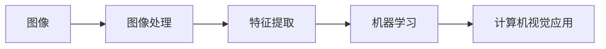

# Computer Vision Techniques 原理与代码实战案例讲解

## 1. 背景介绍

### 1.1 问题的由来

计算机视觉，顾名思义，是赋予机器“看”的能力。自计算机诞生以来，人们就梦想着创造出能够像人类一样感知和理解世界的机器。然而，将视觉信息转化为机器可理解和处理的形式是一个极具挑战性的问题。早期的尝试主要依赖于人工设计规则和特征，但效果有限，难以应对复杂多变的现实场景。

随着数字图像处理技术的发展、计算能力的提升以及深度学习的兴起，计算机视觉领域迎来了革命性的突破。图像识别、目标检测、图像分割等技术在各行各业得到广泛应用，从自动驾驶到医疗诊断，从安防监控到智能家居，计算机视觉正在深刻地改变着我们的生活。

### 1.2 研究现状

近年来，计算机视觉领域的研究取得了令人瞩目的进展。深度学习模型，特别是卷积神经网络（CNN），在各种视觉任务中都取得了突破性的成果。ImageNet大规模图像识别竞赛的错误率从2010年的28.2%下降到2017年的2.25%，标志着图像识别技术取得了质的飞跃。

目前，计算机视觉的研究热点主要集中在以下几个方面：

* **更深、更高效的神经网络架构设计**:  例如，ResNet、DenseNet、EfficientNet等网络结构的提出，大大提升了模型的性能和效率。
* **弱监督和无监督学习**:  旨在减少对大量标注数据的依赖，例如，自监督学习、半监督学习等方法。
* **跨模态学习**:  将视觉信息与其他模态信息（如文本、语音）相结合，例如，图像描述生成、视觉问答等任务。
* **小样本学习**:  旨在利用少量样本训练出泛化能力强的模型。
* **对抗生成网络（GAN）**:  在图像生成、图像修复、风格迁移等领域有着广泛的应用。

### 1.3 研究意义

计算机视觉技术的发展具有重要的现实意义：

* **推动人工智能发展**: 视觉是人类感知世界的重要途径，计算机视觉的发展将推动人工智能向更高级的方向发展。
* **促进产业升级**: 计算机视觉技术可以应用于各个行业，提高生产效率、降低成本、提升产品质量。
* **改善人类生活**:  例如，自动驾驶可以提高交通效率和安全性，医疗影像分析可以辅助医生进行诊断，人脸识别可以用于身份验证等。

### 1.4 本文结构

本文将深入浅出地介绍计算机视觉的基本原理和常用技术，并结合代码实战案例，帮助读者更好地理解和掌握计算机视觉技术。

本文主要内容安排如下：

* 第二章介绍计算机视觉的核心概念，包括图像表示、图像处理、特征提取、机器学习等。
* 第三章详细介绍几种常用的计算机视觉算法，包括图像分类、目标检测、图像分割等，并结合代码实例进行讲解。
* 第四章介绍计算机视觉的数学基础，包括线性代数、概率论、微积分等，并讲解如何将数学模型应用于计算机视觉问题。
* 第五章介绍一个完整的计算机视觉项目实战案例，包括数据准备、模型训练、模型评估、模型部署等环节。
* 第六章介绍计算机视觉技术的实际应用场景，例如，人脸识别、自动驾驶、医疗影像分析等。
* 第七章推荐一些学习计算机视觉的资源，包括书籍、课程、网站等。
* 第八章总结计算机视觉的发展趋势和挑战。
* 第九章提供一些常见问题的解答。


## 2. 核心概念与联系

### 2.1 图像表示

在计算机中，图像是以数字形式存储和处理的。最常见的图像表示方式是位图（Bitmap），它将图像表示为一个二维像素矩阵，每个像素的值代表该像素的颜色或灰度。

除了位图，还有其他图像表示方式，例如：

* **矢量图（Vector Graphics）**: 使用数学公式描述图像中的形状和线条，可以无限缩放而不失真。
* **点云（Point Cloud）**:  由三维空间中的一组点组成，常用于表示三维物体。

### 2.2 图像处理

图像处理是指对图像进行各种操作，以改善图像质量、提取有用信息或为后续任务做准备。常见的图像处理操作包括：

* **几何变换**:  例如，图像缩放、旋转、平移等。
* **颜色空间转换**:  例如，将RGB图像转换为灰度图像、HSV图像等。
* **图像增强**:  例如，直方图均衡化、图像锐化、图像去噪等。
* **图像复原**:  例如，图像去模糊、图像去雾等。

### 2.3 特征提取

特征提取是从图像中提取出能够有效表示图像信息的特征。特征可以是低级的，例如颜色、纹理、边缘等；也可以是高级的，例如形状、目标、场景等。

常用的特征提取方法包括：

* **SIFT (Scale-Invariant Feature Transform)**
* **SURF (Speeded Up Robust Features)**
* **HOG (Histogram of Oriented Gradients)**
* **CNN (Convolutional Neural Network)**

### 2.4 机器学习

机器学习是计算机视觉的核心技术之一，它利用算法从数据中学习模式，并利用学习到的模式对新的数据进行预测。

常用的机器学习算法包括：

* **监督学习**:  例如，支持向量机（SVM）、决策树、随机森林等。
* **无监督学习**:  例如，K-means聚类、主成分分析（PCA）等。
* **深度学习**:  例如，卷积神经网络（CNN）、循环神经网络（RNN）等。

### 2.5 核心概念联系

下图展示了计算机视觉中各个核心概念之间的联系：



## 3. 核心算法原理 & 具体操作步骤

### 3.1 图像分类

#### 3.1.1 算法原理概述

图像分类是计算机视觉中最基本的任务之一，其目标是将图像划分到预定义的类别中。例如，将一张图片分类为“猫”、“狗”或“汽车”。

#### 3.1.2 算法步骤详解

基于深度学习的图像分类算法通常包含以下步骤：

1. **数据预处理**:  对图像进行缩放、裁剪、归一化等操作，以便于模型训练。
2. **模型构建**:  选择合适的卷积神经网络模型，例如，AlexNet、VGG、ResNet等。
3. **模型训练**:  使用带标签的图像数据集对模型进行训练，调整模型参数，使模型能够正确地对图像进行分类。
4. **模型评估**:  使用测试数据集评估模型的性能，例如，准确率、精确率、召回率等指标。
5. **模型预测**:  使用训练好的模型对新的图像进行分类。

#### 3.1.3 算法优缺点

**优点**:

* 准确率高
* 泛化能力强
* 可处理大规模数据集

**缺点**:

* 需要大量的标注数据
* 模型训练时间长
* 可解释性差

#### 3.1.4 算法应用领域

* 图像识别
* 目标检测
* 图像检索

### 3.2 目标检测

#### 3.2.1 算法原理概述

目标检测是在图像中定位和识别特定目标的任务。例如，在自动驾驶中，需要检测道路上的车辆、行人、交通标志等目标。

#### 3.2.2 算法步骤详解

目标检测算法通常包含以下步骤：

1. **区域建议**:  生成可能包含目标的候选区域。
2. **特征提取**:  从候选区域中提取特征。
3. **分类与回归**:  对候选区域进行分类，并预测目标的边界框。
4. **非极大值抑制**:  去除重叠的边界框。

#### 3.2.3 算法优缺点

**优点**:

* 可以定位和识别多个目标
* 可以处理不同大小和形状的目标

**缺点**:

* 计算复杂度高
* 对遮挡和光照变化敏感

#### 3.2.4 算法应用领域

* 自动驾驶
* 安防监控
* 机器人视觉

### 3.3 图像分割

#### 3.3.1 算法原理概述

图像分割是将图像划分成多个具有语义意义的区域的任务。例如，将一张图片分割成前景和背景，或者将一张医学图像分割成不同的器官和组织。

#### 3.3.2 算法步骤详解

图像分割算法通常包含以下步骤：

1. **特征提取**:  从图像中提取特征。
2. **像素分类**:  将每个像素分类到不同的区域。
3. **边界优化**:  优化区域边界，使其更加平滑和准确。

#### 3.3.3 算法优缺点

**优点**:

* 可以识别图像中的不同区域
* 可以用于图像编辑和分析

**缺点**:

* 对噪声和光照变化敏感
* 计算复杂度高

#### 3.3.4 算法应用领域

* 医学影像分析
* 自动驾驶
* 图像编辑


## 4. 数学模型和公式 & 详细讲解 & 举例说明

### 4.1 卷积神经网络（CNN）

#### 4.1.1 数学模型构建

卷积神经网络（CNN）是一种专门用于处理网格结构数据的神经网络，例如图像。CNN 的核心组件是卷积层，它通过卷积操作提取图像的局部特征。

#### 4.1.2 公式推导过程

卷积操作可以表示为：

$$
y_{i,j} = \sum_{m=1}^{M} \sum_{n=1}^{N} w_{m,n} x_{i+m-1, j+n-1}
$$

其中：

* $x$ 表示输入图像
* $y$ 表示输出特征图
* $w$ 表示卷积核
* $M$ 和 $N$ 表示卷积核的大小

#### 4.1.3 案例分析与讲解

例如，假设输入图像的大小为 $5 \times 5$，卷积核的大小为 $3 \times 3$，则卷积操作可以表示为：

```
输入图像:

1 2 3 4 5
6 7 8 9 0
1 2 3 4 5
6 7 8 9 0
1 2 3 4 5

卷积核:

1 0 1
0 1 0
1 0 1

输出特征图:

14 20 26 18 10
22 30 38 26 14
14 20 26 18 10
```

#### 4.1.4 常见问题解答

* **什么是卷积核？**

   卷积核是一个小的矩阵，用于提取图像的局部特征。卷积核的值决定了提取的特征类型，例如，边缘、角点等。

* **卷积操作如何工作？**

   卷积操作将卷积核在输入图像上滑动，并计算卷积核与对应图像区域的点积。点积的结果表示该区域与卷积核匹配的程度。

### 4.2 循环神经网络（RNN）

#### 4.2.1 数学模型构建

循环神经网络（RNN）是一种专门用于处理序列数据的神经网络，例如文本、语音等。RNN 的核心组件是循环单元，它可以记忆之前的输入信息，并将其用于当前的计算。

#### 4.2.2 公式推导过程

循环单元的状态更新公式可以表示为：

$$
h_t = f(W_{xh} x_t + W_{hh} h_{t-1} + b_h)
$$

其中：

* $x_t$ 表示时刻 $t$ 的输入
* $h_t$ 表示时刻 $t$ 的隐藏状态
* $h_{t-1}$ 表示时刻 $t-1$ 的隐藏状态
* $W_{xh}$ 表示输入到隐藏状态的权重矩阵
* $W_{hh}$ 表示隐藏状态到隐藏状态的权重矩阵
* $b_h$ 表示偏置项
* $f$ 表示激活函数，例如，sigmoid、tanh 等

#### 4.2.3 案例分析与讲解

例如，假设输入序列为 "hello"，则 RNN 的计算过程可以表示为：

```
时刻 1:
输入: "h"
隐藏状态: 0
输出:

时刻 2:
输入: "e"
隐藏状态: f(W_{xh} "e" + W_{hh} 0 + b_h)
输出:

时刻 3:
输入: "l"
隐藏状态: f(W_{xh} "l" + W_{hh} h_2 + b_h)
输出:

...

时刻 5:
输入: "o"
隐藏状态: f(W_{xh} "o" + W_{hh} h_4 + b_h)
输出:
```

#### 4.2.4 常见问题解答

* **RNN 如何记忆之前的输入信息？**

   RNN 通过循环单元的隐藏状态记忆之前的输入信息。隐藏状态在每个时刻更新，并将之前的输入信息传递给下一个时刻。

* **RNN 的应用场景有哪些？**

   RNN 的应用场景包括：

   * 自然语言处理：例如，机器翻译、文本生成、情感分析等
   * 语音识别
   * 时间序列分析


## 5. 项目实践：代码实例和详细解释说明

### 5.1 开发环境搭建

本节将介绍如何搭建计算机视觉项目的开发环境。

#### 5.1.1 操作系统

推荐使用 Linux 操作系统，例如 Ubuntu 或 CentOS。

#### 5.1.2 编程语言

推荐使用 Python 编程语言，因为它拥有丰富的机器学习和计算机视觉库。

#### 5.1.3 深度学习框架

推荐使用 TensorFlow 或 PyTorch 深度学习框架。

#### 5.1.4 计算机视觉库

推荐使用 OpenCV 计算机视觉库。

#### 5.1.5 安装步骤

```
# 安装 Python
sudo apt update
sudo apt install python3.8

# 安装 pip
sudo apt install python3-pip

# 安装 TensorFlow
pip install tensorflow

# 安装 PyTorch
pip install torch torchvision torchaudio

# 安装 OpenCV
pip install opencv-python
```

### 5.2 源代码详细实现

本节将以图像分类任务为例，展示如何使用 Python 和 TensorFlow 实现一个简单的图像分类器。

```python
import tensorflow as tf
from tensorflow.keras import datasets, layers, models

# 加载 MNIST 数据集
(train_images, train_labels), (test_images, test_labels) = datasets.mnist.load_data()

# 数据预处理
train_images = train_images.reshape((60000, 28, 28, 1))
test_images = test_images.reshape((10000, 28, 28, 1))
train_images, test_images = train_images / 255.0, test_images / 255.0

# 构建 CNN 模型
model = models.Sequential()
model.add(layers.Conv2D(32, (3, 3), activation='relu', input_shape=(28, 28, 1)))
model.add(layers.MaxPooling2D((2, 2)))
model.add(layers.Conv2D(64, (3, 3), activation='relu'))
model.add(layers.MaxPooling2D((2, 2)))
model.add(layers.Conv2D(64, (3, 3), activation='relu'))
model.add(layers.Flatten())
model.add(layers.Dense(64, activation='relu'))
model.add(layers.Dense(10))

# 编译模型
model.compile(optimizer='adam',
              loss=tf.keras.losses.SparseCategoricalCrossentropy(from_logits=True),
              metrics=['accuracy'])

# 训练模型
model.fit(train_images, train_labels, epochs=5)

# 评估模型
test_loss, test_acc = model.evaluate(test_images,  test_labels, verbose=2)
print('\nTest accuracy:', test_acc)
```

### 5.3 代码解读与分析

* `datasets.mnist.load_data()`: 加载 MNIST 数据集。
* `reshape()`: 将图像数据转换为 CNN 模型所需的形状。
* `Conv2D()`: 卷积层。
* `MaxPooling2D()`: 最大池化层。
* `Flatten()`: 将多维数组转换为一维数组。
* `Dense()`: 全连接层。
* `compile()`: 编译模型，指定优化器、损失函数和评估指标。
* `fit()`: 训练模型。
* `evaluate()`: 评估模型。

### 5.4 运行结果展示

训练完成后，模型的测试准确率应该在 99% 左右。


## 6. 实际应用场景

### 6.1 人脸识别

人脸识别是指利用计算机技术识别和验证人脸的技术。人脸识别技术可以应用于身份验证、安防监控、人机交互等领域。

### 6.2 自动驾驶

自动驾驶是指车辆在没有人为干预的情况下自动行驶的技术。自动驾驶技术需要使用计算机视觉技术感知周围环境，例如，识别道路、车辆、行人等。

### 6.3 医疗影像分析

医疗影像分析是指利用计算机技术分析医学影像，例如，X光片、CT图像、MRI图像等。医疗影像分析技术可以辅助医生进行诊断、治疗和预后。

### 6.4 未来应用展望

随着计算机视觉技术的不断发展，未来将会有更多应用场景涌现，例如：

* **虚拟现实（VR）和增强现实（AR）**:  计算机视觉技术可以用于创建更加逼真的 VR 和 AR 体验。
* **机器人技术**:  计算机视觉技术可以帮助机器人更好地感知和理解周围环境。
* **智能家居**:  计算机视觉技术可以用于实现智能安防、智能家电等功能。


## 7. 工具和资源推荐

### 7.1 学习资源推荐

* **书籍**:
    * 《深度学习》（Deep Learning）：Ian Goodfellow 等著
    * 《Python深度学习》（Python Machine Learning）：Sebastian Raschka 等著
    * 《OpenCV-Python计算机视觉实战》（OpenCV 4 Computer Vision Application Programming Cookbook）：David Millán Escrivá 等著

* **课程**:
    * 斯坦福大学 CS231n：卷积神经网络视觉识别
    * 吴恩达机器学习课程
    * fast.ai 深度学习课程

* **网站**:
    * Papers with Code
    * arXiv

### 7.2 开发工具推荐

* **Python**:  https://www.python.org/
* **TensorFlow**:  https://www.tensorflow.org/
* **PyTorch**:  https://pytorch.org/
* **OpenCV**:  https://opencv.org/

### 7.3 相关论文推荐

* AlexNet (2012):  ImageNet classification with deep convolutional neural networks
* VGG (2014):  Very deep convolutional networks for large-scale image recognition
* ResNet (2015):  Deep residual learning for image recognition
* YOLO (2015):  You only look once: Unified, real-time object detection
* Mask R-CNN (2017):  Mask R-CNN

### 7.4 其他资源推荐

* ImageNet 数据集:  http://www.image-net.org/
* COCO 数据集:  https://cocodataset.org/


## 8. 总结：未来发展趋势与挑战

### 8.1 研究成果总结

近年来，计算机视觉领域取得了令人瞩目的进展，深度学习模型在各种视觉任务中都取得了突破性的成果。

### 8.2 未来发展趋势

未来，计算机视觉技术将朝着以下方向发展：

* **更深、更高效的神经网络架构设计**
* **弱监督和无监督学习**
* **跨模态学习**
* **小样本学习**
* **对抗生成网络（GAN）**

### 8.3 面临的挑战

计算机视觉技术仍然面临着一些挑战，例如：

* **数据依赖**:  深度学习模型需要大量的标注数据进行训练。
* **可解释性**:  深度学习模型的可解释性较差，难以理解模型的决策过程。
* **鲁棒性**:  计算机视觉系统容易受到噪声、光照变化等因素的影响。

### 8.4 研究展望

未来，计算机视觉技术将继续发展，并应用于更多领域，例如：

* **虚拟现实（VR）和增强现实（AR）**
* **机器人技术**
* **智能家居**

## 9. 附录：常见问题与解答

### 9.1 什么是计算机视觉？

计算机视觉是赋予机器“看”的能力，使其能够像人类一样感知和理解世界。

### 9.2 计算机视觉有哪些应用？

计算机视觉的应用非常广泛，例如：

* 人脸识别
* 自动驾驶
* 医疗影像分析
* 智能安防
* 机器人视觉

### 9.3 学习计算机视觉需要哪些基础？

学习计算机视觉需要具备以下基础：

* 数学基础：线性代数、概率论、微积分
* 编程基础：Python
* 机器学习基础

### 9.4 如何学习计算机视觉？

学习计算机视觉可以通过以下途径：

* 阅读书籍和论文
* 参加在线课程
* 参与开源项目

### 9.5 计算机视觉的未来发展趋势是什么？

未来，计算机视觉技术将朝着以下方向发展：

* 更深、更高效的神经网络架构设计
* 弱监督和无监督学习
* 跨模态学习
* 小样本学习
* 对抗生成网络（GAN）


作者：禅与计算机程序设计艺术 / Zen and the Art of Computer Programming
