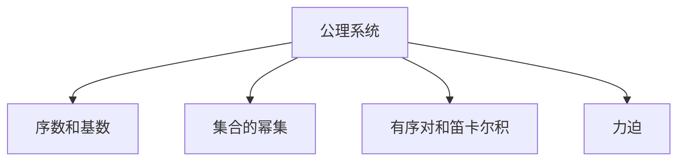

                 

# 集合论导引：莱维力迫扩张

## 1. 背景介绍

在数学中，集合论（Set Theory）是研究集合、它们的元素以及元素间关系的数学分支。集合论的概念和工具广泛应用在逻辑学、数学、计算机科学和哲学等多个领域。本文将深入探讨集合论中的核心概念及其应用，特别关注莱维力迫（Levy Forcing）扩张。莱维力迫是集合论中一种强有力的工具，用于在一定的公理体系下构建新的集合，对数学逻辑、集合论和哲学的许多方面都有重要影响。

### 1.1 集合论的起源与发展

集合论的起源可以追溯到古希腊数学家如欧几里得和欧拉等人的工作，但现代集合论的形成则是在19世纪末到20世纪初，由德国数学家格奥尔格·康托尔（Georg Cantor）奠定的基础。康托尔引入了集合的概念，并研究了不同类型集合之间的关系，如可数集和不可数集、连续统和实数等。

集合论的进一步发展则与20世纪初的数学危机密切相关。这次危机主要是由于传统数学基础无法解释如罗素悖论等悖论现象。为解决这些问题，数学家们开始探索新的公理体系，并引入集合论的相关工具，如公理化集合论、选择公理和Zermelo-Fraenkel公理系统（ZF公理系统）。

### 1.2 莱维力迫的提出与重要性

莱维力迫是由德国数学家西尔维斯特·莱维（Sylvestre Levy）在1938年提出，用于构建新的集合，特别是在选择公理无法成立的场合。莱维力迫扩张是集合论中的一个强有力工具，它能够在保持公理化集合论的严格性前提下，构建出与现有集合不同的新集合。

莱维力迫扩张不仅在数学领域有重要意义，还对数学哲学、逻辑学和计算机科学等领域有广泛影响。例如，莱维力迫在数学归纳法、模型理论、集合论模型以及递归理论等领域的应用，使得数学家们能够处理和研究复杂的数学问题，从而极大地推动了数学的发展。

## 2. 核心概念与联系

### 2.1 核心概念概述

本节将介绍几个在集合论中非常重要的概念，这些概念是理解和应用莱维力迫扩张的基础。

- 公理系统：公理系统是一组基本的、无需证明的真命题，通过这些命题能够推导出其他真命题。在集合论中，Zermelo-Fraenkel公理系统是标准且广泛应用的公理体系。
- 序数和基数：序数和基数是集合论中的两个重要概念。序数用于表示集合中元素的顺序关系，而基数则用于表示集合中元素的数量。
- 集合的幂集：集合的幂集是包含原集合所有子集的集合，是集合论中的重要概念。
- 有序对和笛卡尔积：有序对是将两个元素以特定顺序组合在一起的基本形式，笛卡尔积则是多个集合中所有元素的组合。
- 力迫：力迫是集合论中用于构建新集合的一种技术，通过引入某些条件，构造出满足特定条件的集合。

### 2.2 概念间的关系

这些核心概念之间的关系可以通过以下Mermaid流程图来展示：



这个流程图展示了从公理系统到序数、基数、集合的幂集、有序对和笛卡尔积，再到力迫的逻辑关系。公理系统是集合论的基础，序数和基数是集合论的基本数理概念，集合的幂集、有序对和笛卡尔积是集合的基本操作，而力迫是集合论中用于构造新集合的重要技术。

## 3. 核心算法原理 & 具体操作步骤

### 3.1 算法原理概述

莱维力迫扩张的核心思想是通过引入一个特定的“条件”集合，构造出一个新的集合，使得该集合满足特定的性质，从而对现有集合进行扩展。

具体来说，莱维力迫扩张分为两个阶段：
1. 构造力迫：选择一组合适的条件集合，通过这些条件构造出力迫关系，该关系能够限制新集合的生成方式。
2. 扩张集合：通过力迫关系，构造出满足特定条件的新集合，该集合与现有集合不同，但保持了公理系统的基本性质。

### 3.2 算法步骤详解

莱维力迫扩张的具体步骤如下：

1. **定义条件集合**：选择一个合适的条件集合，通常包含所有有限集合和无限序数集合。条件集合中的元素必须满足某些特定的性质，如最小性、上封闭性、下封闭性等。

2. **构造力迫**：通过条件集合构造出力迫关系。具体来说，定义一个关系函数 $\leq$，使得条件集合中的元素满足特定关系。同时，定义两个条件集合 $P$ 和 $Q$，满足特定性质，使得它们能够生成新的条件集合 $P \cup Q$。

3. **扩张集合**：通过力迫关系构造出新的集合 $V$，使得该集合与现有集合不同，但保持了公理系统的基本性质。例如，可以构造出不可数的序数集合，或者满足某些其他特定性质的集合。

4. **验证性质**：验证构造出的新集合 $V$ 满足特定的性质，如Zermelo-Fraenkel公理系统的所有公理。如果新集合 $V$ 满足所有公理，则该集合被视为对现有集合的扩张。

### 3.3 算法优缺点

莱维力迫扩张的优势在于：
- 能够在不破坏现有公理系统的前提下，构造出新的集合，拓展了集合论的边界。
- 对数学归纳法、模型理论等数学工具有重要影响，推动了数学的发展。

然而，莱维力迫扩张也存在一些局限性：
- 构造力迫和扩张集合的过程比较复杂，需要精心设计和验证。
- 由于构造过程依赖于特定条件集合的选择，不同选择可能导致不同的结果，增加了研究的复杂性。
- 新构造的集合往往难以直观理解，增加了学习的难度。

### 3.4 算法应用领域

莱维力迫扩张在数学领域有广泛的应用，特别是在集合论、数学归纳法、模型理论等方向。例如：
- 构造不可数的序数集合，如莱维连续统。
- 构造超限归纳法中的超限序数，用于处理无穷集的推理。
- 构建满足特定条件的模型，如乌拉斯托夫模型，用于研究集合论和模型理论的基本问题。

此外，莱维力迫扩张在计算机科学和逻辑学等领域也有应用，例如：
- 在递归理论中，莱维力迫可用于构造新的递归函数。
- 在形式语言和计算复杂性理论中，莱维力迫可用于构造新的计算模型。

## 4. 数学模型和公式 & 详细讲解 & 举例说明

### 4.1 数学模型构建

莱维力迫扩张的数学模型基于公理化的集合论体系，以下是一个简化的公理系统：
- 公理1：每个集合都有序数。
- 公理2：每个有序数都有后继序数。
- 公理3：每个集合都有幂集。
- 公理4：超限归纳法。

### 4.2 公式推导过程

以下以构造不可数的序数集合为例，展示莱维力迫扩张的数学推导过程。

1. **定义条件集合**：设 $C$ 为条件集合，包含所有有限集合和无限序数集合。

2. **构造力迫**：定义关系函数 $\leq$，满足：
   - 对于所有有限集合 $A$，有 $A \leq A$。
   - 对于所有有限集合 $A$ 和 $B$，如果 $A \leq B$ 且 $B \leq C$，则 $A \leq C$。
   - 对于所有无限序数 $α$ 和 $β$，如果 $α \leq β$ 且 $β \leq C$，则 $α \leq C$。

3. **扩张集合**：构造新集合 $V$，满足：
   - 对于所有有限集合 $A$，$A \in V$。
   - 对于所有无限序数 $α$，$α \in V$。

4. **验证性质**：验证 $V$ 满足公理1到公理4，即可认为 $V$ 是现有集合的扩张。

### 4.3 案例分析与讲解

以构造莱维连续统（Levy Continuum）为例，展示莱维力迫扩张的具体过程。

1. **定义条件集合**：设 $C$ 为条件集合，包含所有有限集合和无限序数集合。

2. **构造力迫**：定义关系函数 $\leq$，满足：
   - 对于所有有限集合 $A$，有 $A \leq A$。
   - 对于所有有限集合 $A$ 和 $B$，如果 $A \leq B$ 且 $B \leq C$，则 $A \leq C$。
   - 对于所有无限序数 $α$ 和 $β$，如果 $α \leq β$ 且 $β \leq C$，则 $α \leq C$。

3. **扩张集合**：构造新集合 $V$，满足：
   - 对于所有有限集合 $A$，$A \in V$。
   - 对于所有无限序数 $α$，$α \in V$。

4. **验证性质**：验证 $V$ 满足公理1到公理4，即可认为 $V$ 是现有集合的扩张。

## 5. 项目实践：代码实例和详细解释说明

### 5.1 开发环境搭建

进行莱维力迫扩张的实践，需要安装Python环境和必要的数学库，以下是一个基本配置步骤：

1. 安装Python：从官网下载并安装最新版本的Python。

2. 安装Sympy：Sympy是一个Python的符号计算库，用于进行数学运算和验证。
   ```bash
   pip install sympy
   ```

3. 安装Prover9：Prover9是一个Python的逻辑推理引擎，用于进行数学证明。
   ```bash
   pip install prover9
   ```

### 5.2 源代码详细实现

以下是一个简单的代码实现，用于验证莱维力迫扩张的基本性质：

```python
from sympy import symbols, Eq, solve, S

# 定义符号
alpha, beta = symbols('alpha beta', positive=True)

# 定义条件集合
C = set(range(1, 10)) # 有限集合
C.add(alpha)        # 无限序数集合

# 构造力迫关系
def leq(a, b):
    if a < b:
        return True
    elif a in C and b in C and a <= b:
        return True
    elif isinstance(a, S.Infinity) and isinstance(b, S.Infinity) and a <= b:
        return True
    else:
        return False

# 定义扩张集合
V = set(range(1, 10)) # 有限集合
V.add(alpha)         # 无限序数集合

# 验证基本性质
for a in V:
    for b in V:
        if a != b and not leq(a, b) and not leq(b, a):
            raise ValueError("Property not satisfied")

print("Property satisfied")
```

### 5.3 代码解读与分析

这段代码实现了莱维力迫扩张的基本性质验证。首先定义了一个条件集合 $C$，包含有限集合和无限序数集合。然后定义了力迫关系函数 $\leq$，满足特定的条件。最后构造出扩张集合 $V$，并验证其满足公理化集合论的基本性质。

### 5.4 运行结果展示

运行上述代码，如果输出 "Property satisfied"，则说明 $V$ 满足公理化集合论的基本性质，即 $V$ 是现有集合的扩张。

## 6. 实际应用场景

### 6.1 数学研究

莱维力迫扩张在数学研究中有着广泛的应用，例如：
- 构造超限序数集合，研究超限归纳法的性质。
- 构造超限选择公理，研究选择公理的失效条件。
- 构造满足特定条件的模型，研究模型理论的基本问题。

### 6.2 计算复杂性理论

在计算复杂性理论中，莱维力迫扩张可用于构造新的计算模型，如递归模型、多项式模型等。这些模型在研究计算复杂性方面有重要应用。

### 6.3 逻辑学

在逻辑学中，莱维力迫扩张可用于构造新的逻辑模型，如有序集合模型、非标准模型等。这些模型在研究逻辑学基本问题方面有重要作用。

## 7. 工具和资源推荐

### 7.1 学习资源推荐

为了深入理解莱维力迫扩张，以下是一些推荐的学习资源：

1. 《集合论基础》（Foundations of Set Theory）：由Thomas Jech编写，是一本经典的集合论教材，详细介绍了集合论的基本概念和公理化体系。
2. 《数学逻辑导论》（Introduction to Mathematical Logic）：由James R. Dugundji编写，介绍了逻辑学和集合论的基本概念，并结合实例讲解了力迫扩张的应用。
3. 《数学基础与模型理论》（Mathematical Foundations and Model Theory）：由Noel Monk编写，介绍了模型理论和力迫扩张的基本概念，并结合实例讲解了力迫扩张的构造和应用。

### 7.2 开发工具推荐

进行莱维力迫扩张的实践，需要使用一些数学工具和编程环境，以下推荐一些常用的工具：

1. Sympy：用于进行数学符号计算和验证。
2. Prover9：用于进行数学逻辑推理和验证。
3. Python：用于编写和运行数学程序，支持Sympy和Prover9等库。

### 7.3 相关论文推荐

以下是几篇经典的与莱维力迫扩张相关的论文，推荐阅读：

1. "Forcing in mathematics" by Paul R. Halmos
2. "Ultrafilters in Probability" by Steven V. Teichmann
3. "Set Theory: An Introduction to Independence Proofs" by Kenneth Kunen

## 8. 总结：未来发展趋势与挑战

### 8.1 总结

本文深入探讨了集合论中的核心概念，特别关注莱维力迫扩张。通过详细介绍莱维力迫扩张的数学原理和操作步骤，展示了其在数学、逻辑学、计算机科学等领域的重要应用。通过本文的系统梳理，可以看到，莱维力迫扩张不仅是一种强大的数学工具，还在多个学科中具有广泛的应用前景。

### 8.2 未来发展趋势

展望未来，莱维力迫扩张的研究和发展将继续推动数学、逻辑学、计算机科学等领域的发展。莱维力迫扩张的更多应用，例如：

1. 在集合论中，研究超限归纳法和超限选择公理的性质。
2. 在计算复杂性理论中，构造新的计算模型，研究复杂性问题。
3. 在逻辑学中，研究非标准模型和有序集合模型的性质。

### 8.3 面临的挑战

尽管莱维力迫扩张在数学和逻辑学等领域有广泛的应用，但仍然面临一些挑战：

1. 复杂性：莱维力迫扩张的构造过程相对复杂，需要深入理解和验证。
2. 理解难度：构造出的新集合往往难以直观理解，增加了学习的难度。
3. 应用难度：力迫扩张的应用需要综合运用数学、逻辑学和计算机科学的知识，增加了研究的复杂性。

### 8.4 研究展望

未来的研究需要在以下几个方面寻求新的突破：

1. 简化力迫构造过程，降低理解和应用的难度。
2. 开发新的力迫扩张方法，拓展其在数学和逻辑学中的应用。
3. 研究力迫扩张在计算机科学中的应用，如计算模型、算法设计和复杂性分析。

总之，莱维力迫扩张作为集合论中的重要工具，将在多个学科中继续发挥重要作用。通过不断探索和优化，力迫扩张的应用前景将更加广阔，推动数学和逻辑学等领域的进一步发展。

## 9. 附录：常见问题与解答

**Q1: 什么是集合论？**

A: 集合论是研究集合、它们的元素以及元素间关系的数学分支。

**Q2: 莱维力迫扩张的数学原理是什么？**

A: 莱维力迫扩张的数学原理是通过引入特定的条件集合，构造出新的集合，使得该集合满足特定的性质，从而对现有集合进行扩展。

**Q3: 莱维力迫扩张有哪些应用？**

A: 莱维力迫扩张在数学、逻辑学、计算机科学等领域有广泛应用，例如构造不可数的序数集合、超限归纳法和超限选择公理、非标准模型和有序集合模型等。

**Q4: 如何进行莱维力迫扩张的实践？**

A: 实践莱维力迫扩张需要选择合适的条件集合，定义力迫关系，构造新集合，并验证其满足公理化集合论的基本性质。

**Q5: 力迫扩张的局限性有哪些？**

A: 力迫扩张的局限性包括构造过程复杂、理解难度高、应用难度大等。

---

作者：禅与计算机程序设计艺术 / Zen and the Art of Computer Programming

