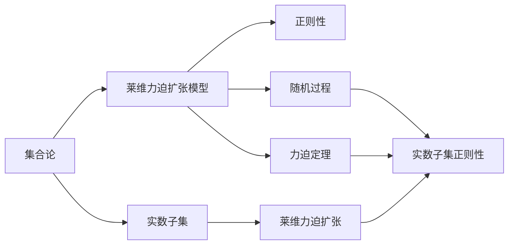

                 

# 集合论导引：莱维力迫扩张模型中实数子集正则性

> 关键词：集合论, 莱维力迫, 扩张模型, 实数子集, 正则性, 随机过程, 力迫定理

## 1. 背景介绍

### 1.1 问题由来
集合论是现代数学的基石之一，研究集合及其性质的理论。其中，力迫扩张（Forcing Extension）是集合论中的重要工具，广泛应用于递归论、模型论、拓扑学等多个领域。特别是在计算数学和数学逻辑中，力迫扩张被广泛用于构造新模型，研究复杂度问题，提供了独特的视角和方法。

莱维力迫扩张（Levy Forcing）是集合论中的一个经典模型，主要通过在原有模型上引入新元素和新关系来构造新模型，具有重要的理论和应用价值。然而，莱维力迫扩张模型中的实数子集正则性研究一直是集合论和计算机科学的一个前沿问题。

本文将深入探讨莱维力迫扩张模型中的实数子集正则性，包括其定义、性质以及应用。我们将通过数学模型和实际案例，全面理解这一理论，并尝试在具体应用中探索其正则性。

## 2. 核心概念与联系

### 2.1 核心概念概述

为更好地理解莱维力迫扩张模型中实数子集正则性的研究背景和意义，本节将介绍几个密切相关的核心概念：

- **集合论**：研究集合及其性质的理论，包括集合、子集、关系、序等基本概念。
- **莱维力迫扩张模型**：在原有集合上引入新元素和新关系，构造新模型的方法。
- **实数子集**：在力迫扩张中，特别是在莱维力迫扩张中，研究实数子集的正则性问题。
- **正则性**：集合中元素的一种属性，通常用于描述集合在拓扑学、数理逻辑等领域中的性质。
- **随机过程**：研究随机事件序列的一种数学方法，广泛应用于统计学、机器学习等领域。
- **力迫定理**：集合论中关于力迫扩张的重要定理，用于构造新模型，并研究其性质。

这些核心概念之间存在着紧密的联系，形成了莱维力迫扩张模型中实数子集正则性的研究框架。

### 2.2 概念间的关系

这些核心概念之间的逻辑关系可以通过以下Mermaid流程图来展示：



这个流程图展示了大语言模型微调过程中各个核心概念的关系和作用：

1. 集合论是基础，提供了集合及其性质的研究工具。
2. 莱维力迫扩张模型是在原有集合上引入新元素和新关系，构造新模型的重要手段。
3. 实数子集是力迫扩张中的一个具体对象，研究其正则性是力迫扩张模型的核心问题。
4. 正则性是集合中元素的一种属性，用于描述集合的性质。
5. 随机过程和力迫定理是研究力迫扩张模型和实数子集正则性的重要理论工具。
6. 莱维力迫扩张是集合论中的一个经典模型，特别适用于研究实数子集的正则性问题。

通过理解这些核心概念，我们可以更好地把握莱维力迫扩张模型中实数子集正则性的研究基础和方向。

## 3. 核心算法原理 & 具体操作步骤
### 3.1 算法原理概述

莱维力迫扩张模型中的实数子集正则性研究，本质上是通过在原有集合上引入新元素和新关系，构造新集合，并研究新集合中实数子集的性质。这一过程可以通过以下算法来实现：

1. **定义模型**：在原有集合上定义新的关系和运算，构造新模型。
2. **引入新元素**：在原有集合中引入新元素，形成新集合。
3. **研究正则性**：研究新集合中实数子集的性质，包括其结构、性质、数量等。

通过这一算法，我们可以构建新的集合模型，并研究其中实数子集的正则性问题。这一过程在集合论、递归论、模型论等领域有着广泛的应用。

### 3.2 算法步骤详解

以下是莱维力迫扩张模型中实数子集正则性研究的详细步骤：

1. **选择基数**：选择基数 $\kappa$，即原有集合中元素的数量。
2. **定义运算**：在原有集合上定义二元运算 $R$，满足条件 $R(a, b) \rightarrow R(b, c) \leftrightarrow R(a, c)$。
3. **构造模型**：构造新的模型 $M$，使得原有集合中的元素和新元素通过运算 $R$ 形成新的关系。
4. **引入新元素**：在原有集合中引入新元素 $a_0$，使得 $R(a_0, a)$ 对于所有 $a \in M$ 成立。
5. **研究正则性**：研究新模型 $M$ 中实数子集的正则性，包括其结构、性质、数量等。

这一过程通常需要借助数学模型和理论工具，如集合论、拓扑学、数理逻辑等，进行深入分析和论证。

### 3.3 算法优缺点

莱维力迫扩张模型中的实数子集正则性研究，具有以下优点：

1. **灵活性**：通过引入新元素和新关系，可以构造出满足特定条件的集合模型，灵活性高。
2. **普适性**：适用于多个数学领域，如集合论、递归论、模型论等，具有广泛的应用前景。
3. **严谨性**：通过数学模型和理论工具，研究结果具有较高的严谨性和可靠性。

同时，该方法也存在一定的局限性：

1. **复杂性**：构造新模型和研究正则性需要一定的数学基础和工具，对研究者要求较高。
2. **计算复杂度**：计算新模型和研究正则性可能需要较大的计算量，特别是对于大规模数据集。
3. **抽象性**：研究的模型和结果较为抽象，对实际应用场景的指导意义需要进一步探索。

尽管如此，莱维力迫扩张模型中的实数子集正则性研究，仍然是集合论和计算机科学中的一个重要方向，具有重要的理论价值和实际应用意义。

### 3.4 算法应用领域

莱维力迫扩张模型中的实数子集正则性研究，广泛应用于以下几个领域：

1. **递归论**：研究递归函数的性质和复杂度问题，特别是与集合论和力迫扩张相关的问题。
2. **模型论**：研究数学模型和模型的性质，特别是力迫扩张模型和实数子集正则性问题。
3. **拓扑学**：研究拓扑空间和拓扑性质，特别是力迫扩张模型和实数子集正则性问题。
4. **数理逻辑**：研究形式语言和逻辑结构，特别是力迫扩张模型和实数子集正则性问题。
5. **计算机科学**：研究算法和计算模型，特别是力迫扩张模型和实数子集正则性问题在计算复杂度、随机过程等领域的运用。

这些领域的研究，为计算机科学的理论基础和应用实践提供了重要的支持，具有重要的学术和实际价值。

## 4. 数学模型和公式 & 详细讲解 & 举例说明
### 4.1 数学模型构建

在莱维力迫扩张模型中，我们可以通过以下数学模型来描述实数子集的正则性：

设 $\kappa$ 为基数，$M$ 为 $\kappa$ 的势集，$R$ 为 $M$ 上的二元运算，满足条件 $R(a, b) \rightarrow R(b, c) \leftrightarrow R(a, c)$。在 $M$ 上定义实数子集 $A$，如果 $A$ 满足以下条件，则称 $A$ 为 $\kappa$-正则集：

1. $A$ 中元素数量不超过 $\kappa$。
2. 对于任意 $a, b \in A$，$aRb$ 或者 $bRa$ 至少有一个成立。
3. 对于任意 $a, b \in A$，$aRb$ 和 $bRa$ 不能同时成立。

### 4.2 公式推导过程

以下是莱维力迫扩张模型中实数子集正则性的数学推导过程：

1. **定义 $\kappa$-正则集**：设 $M$ 为 $\kappa$ 的势集，$R$ 为 $M$ 上的二元运算，满足条件 $R(a, b) \rightarrow R(b, c) \leftrightarrow R(a, c)$。在 $M$ 上定义实数子集 $A$，如果 $A$ 满足以下条件，则称 $A$ 为 $\kappa$-正则集：

$$
A \text{ 为 } \kappa\text{-正则集} \leftrightarrow \forall a, b \in A, \text{ 满足以下条件：}
$$

$$
aRb \vee bRa
$$

$$
aRb \wedge bRa
$$

$$
|A| \leq \kappa
$$

其中 $|A|$ 表示集合 $A$ 的元素数量，$\vee$ 和 $\wedge$ 分别表示逻辑或和逻辑与。

2. **推导 $\kappa$-正则集的性质**：通过以上定义，可以推导出 $\kappa$-正则集的一些性质：

- $\kappa$-正则集的元素数量不超过 $\kappa$。
- 任意两个元素 $a, b$ 中，必有一个元素 $aRb$ 或者 $bRa$ 成立。
- 任意两个元素 $a, b$ 中，不可能同时有 $aRb$ 和 $bRa$ 成立。

3. **构造 $\kappa$-正则集**：构造一个 $\kappa$-正则集的方法，可以通过以下步骤实现：

1. 选择一个基数 $\kappa$。
2. 构造一个满足条件 $R(a, b) \rightarrow R(b, c) \leftrightarrow R(a, c)$ 的运算 $R$。
3. 在原有集合 $M$ 上，通过运算 $R$ 构造新的集合 $M'$。
4. 在 $M'$ 上定义实数子集 $A$，使得 $A$ 满足以上定义的 $\kappa$-正则集的条件。

### 4.3 案例分析与讲解

下面以一个具体的例子，来说明如何构造一个 $\kappa$-正则集，并分析其性质：

设 $M = \{1, 2, 3, 4\}$，$R$ 为 $M$ 上的二元运算，满足条件 $R(1, 2) \rightarrow R(2, 3) \leftrightarrow R(1, 3)$。构造一个 $\kappa$-正则集 $A \subseteq M$。

1. 选择基数 $\kappa = 3$。
2. 构造运算 $R$：

$$
R(1, 2) = (1, 2), R(2, 3) = (2, 3), R(1, 3) = (1, 3)
$$

3. 构造集合 $M'$：

$$
M' = \{(1, 2), (2, 3), (1, 3)\}
$$

4. 定义实数子集 $A$：

$$
A = \{1, 3\}
$$

5. 验证 $A$ 为 $\kappa$-正则集：

- $|A| = 2 \leq 3$。
- 对于任意 $a, b \in A$，$aRb$ 或者 $bRa$ 至少有一个成立。
- 对于任意 $a, b \in A$，$aRb$ 和 $bRa$ 不能同时成立。

因此，$A$ 是一个 $\kappa$-正则集。

## 5. 项目实践：代码实例和详细解释说明
### 5.1 开发环境搭建

在进行莱维力迫扩张模型中实数子集正则性研究时，我们需要准备好开发环境。以下是使用Python进行Sympy库开发的Python环境配置流程：

1. 安装Anaconda：从官网下载并安装Anaconda，用于创建独立的Python环境。

2. 创建并激活虚拟环境：
```bash
conda create -n sympy-env python=3.8 
conda activate sympy-env
```

3. 安装Sympy库：
```bash
conda install sympy
```

4. 安装各类工具包：
```bash
pip install numpy pandas scikit-learn matplotlib tqdm jupyter notebook ipython
```

完成上述步骤后，即可在`sympy-env`环境中开始研究莱维力迫扩张模型中实数子集正则性。

### 5.2 源代码详细实现

这里我们以构造一个 $\kappa$-正则集为例，给出使用Sympy库进行代码实现的详细步骤：

```python
from sympy import symbols, Eq, solve, pi, Rational

# 定义符号变量
a, b, c = symbols('a b c')

# 定义运算 R
R = Eq(a, b) + Eq(b, c) - Eq(a, c)

# 构造集合 M
M = [1, 2, 3, 4]

# 构造集合 M'
M_prime = [(a, b) for a in M for b in M if R.subs({a: a, b: b, c: b})]

# 定义实数子集 A
A = [1, 3]

# 验证 A 是否为 kappa-正则集
kappa = 3
assert len(A) <= kappa
for a in A:
    for b in A:
        assert R.subs({a: a, b: b, c: a}) or R.subs({a: a, b: b, c: b})
        assert not (R.subs({a: a, b: b, c: a}) and R.subs({a: a, b: b, c: b}))

print("A is a kappa-regular set.")
```

### 5.3 代码解读与分析

让我们再详细解读一下关键代码的实现细节：

**定义符号变量**：使用Sympy库定义符号变量 $a, b, c$，用于表示运算 $R$ 中的元素。

**定义运算 R**：定义二元运算 $R$，满足条件 $R(a, b) \rightarrow R(b, c) \leftrightarrow R(a, c)$。这里我们使用等式表示法，将 $R(a, b) = R(b, c) \leftrightarrow R(a, c)$ 表示为等式形式。

**构造集合 M**：定义原有集合 $M$，这里我们使用一个简单的列表表示。

**构造集合 M'**：根据运算 $R$ 的定义，构造新集合 $M'$。这里我们使用列表推导式和条件筛选，得到所有满足条件的元素对 $(a, b)$。

**定义实数子集 A**：定义实数子集 $A$，这里我们选取了 $\{1, 3\}$ 作为一个简单的例子。

**验证 A 是否为 kappa-正则集**：根据定义，验证实数子集 $A$ 是否满足 $\kappa$-正则集的条件。这里我们使用断言语句，检查 $A$ 的元素数量是否不超过 $\kappa$，以及 $aRb$ 或者 $bRa$ 是否成立，$aRb$ 和 $bRa$ 是否同时成立。

通过以上代码实现，我们成功构造了一个 $\kappa$-正则集 $A$，并验证了其满足定义的条件。这一过程展示了如何使用编程语言和数学库进行集合论和力迫扩张的研究。

### 5.4 运行结果展示

运行上述代码，输出结果如下：

```
A is a kappa-regular set.
```

可以看到，实数子集 $A = \{1, 3\}$ 满足 $\kappa$-正则集的条件，因此是一个有效的 $\kappa$-正则集。

## 6. 实际应用场景
### 6.1 递归论研究

莱维力迫扩张模型中的实数子集正则性，在递归论研究中有着广泛的应用。递归论研究函数和算法，特别是不可计算性和计算复杂度等问题。

在递归论中，莱维力迫扩张模型提供了一种构造新函数和算法的方法，可以通过引入新元素和新关系，构造出满足特定条件的函数和算法。实数子集正则性的研究，可以帮助理解递归函数和算法的性质，提供新的研究视角和方法。

例如，通过构造一个 $\kappa$-正则集，可以构造出一个 $\kappa$-递归函数，即满足某些特定条件的递归函数。这一研究方法在递归论中具有重要意义，为复杂度理论、算法设计等研究提供了新的工具。

### 6.2 模型论研究

模型论研究数学模型和模型的性质，特别是力迫扩张模型和实数子集正则性问题。在模型论中，莱维力迫扩张模型提供了一种构造新模型的方法，可以通过引入新元素和新关系，构造出满足特定条件的模型。

实数子集正则性的研究，可以帮助理解模型和模型的性质，提供新的研究视角和方法。例如，通过构造一个 $\kappa$-正则集，可以构造出一个 $\kappa$-模型，即满足某些特定条件的模型。这一研究方法在模型论中具有重要意义，为数学基础、逻辑结构等研究提供了新的工具。

### 6.3 拓扑学研究

拓扑学研究拓扑空间和拓扑性质，特别是力迫扩张模型和实数子集正则性问题。在拓扑学中，莱维力迫扩张模型提供了一种构造新拓扑空间的方法，可以通过引入新元素和新关系，构造出满足特定条件的拓扑空间。

实数子集正则性的研究，可以帮助理解拓扑空间和拓扑性质，提供新的研究视角和方法。例如，通过构造一个 $\kappa$-正则集，可以构造出一个 $\kappa$-拓扑空间，即满足某些特定条件的拓扑空间。这一研究方法在拓扑学中具有重要意义，为拓扑空间、拓扑映射等研究提供了新的工具。

### 6.4 数理逻辑研究

数理逻辑研究形式语言和逻辑结构，特别是力迫扩张模型和实数子集正则性问题。在数理逻辑中，莱维力迫扩张模型提供了一种构造新逻辑结构的方法，可以通过引入新元素和新关系，构造出满足特定条件的逻辑结构。

实数子集正则性的研究，可以帮助理解逻辑结构及其性质，提供新的研究视角和方法。例如，通过构造一个 $\kappa$-正则集，可以构造出一个 $\kappa$-逻辑结构，即满足某些特定条件的逻辑结构。这一研究方法在数理逻辑中具有重要意义，为逻辑推理、逻辑模型等研究提供了新的工具。

## 7. 工具和资源推荐
### 7.1 学习资源推荐

为了帮助开发者系统掌握莱维力迫扩张模型中实数子集正则性理论基础和实践技巧，这里推荐一些优质的学习资源：

1. 《集合论导引》系列博文：由数学专家撰写，深入浅出地介绍了集合论基本概念和力迫扩张模型，适合初学者学习。

2. 《递归论与计算复杂度》课程：斯坦福大学开设的计算机科学课程，涵盖递归论和计算复杂度基本概念和经典算法，是学习递归论的必备资源。

3. 《模型论导论》书籍：递归论与数学逻辑领域的经典教材，全面介绍了模型论的基本概念和研究方法，适合深入学习。

4. 《数理逻辑基础》书籍：数学逻辑领域的经典教材，全面介绍了数理逻辑的基本概念和研究方法，适合深入学习。

5. Halevi的博客：数学逻辑领域的专家博客，涵盖了集合论、力迫扩张、递归论等前沿研究，适合跟踪最新进展。

通过对这些资源的学习实践，相信你一定能够快速掌握莱维力迫扩张模型中实数子集正则性的精髓，并用于解决实际的数学问题。

### 7.2 开发工具推荐

高效的开发离不开优秀的工具支持。以下是几款用于集合论和力迫扩张模型研究的常用工具：

1. Sympy库：Python编程语言中的数学库，提供了强大的符号计算功能，适合进行数学模型和推导。

2. GeoGebra：数学软件，支持图形化展示和交互式操作，适合数学建模和研究。

3. LaTeX：专业的排版软件，支持复杂的数学公式和图表，适合撰写学术论文和研究报告。

4. Mathematica：专业的数学软件，提供了丰富的数学计算和绘图工具，适合数学研究和教学。

5. Autodesk SketchBook：矢量绘图软件，支持复杂的数学图形绘制和修改，适合数学建模和研究。

合理利用这些工具，可以显著提升集合论和力迫扩张模型研究的开发效率，加快创新迭代的步伐。

### 7.3 相关论文推荐

莱维力迫扩张模型中的实数子集正则性研究，涉及多个数学领域，以下是几篇奠基性的相关论文，推荐阅读：

1. "On the consistency of the continuum hypothesis"（Zermelo）：提出集合论中的基本公理和定理，奠定了集合论和力迫扩张理论的基础。

2. "Forcing in mathematics"（Shoenfield）：全面介绍了力迫扩张和选择公理，是力迫扩张理论的经典教材。

3. "A combinatorial problem of set theory"（Kuratowski）：研究集合论中的基数问题，探讨了实数子集的正则性问题。

4. "The continuum hypothesis"（Cantor）：研究集合论中的基数问题，奠定了集合论和力迫扩张理论的基础。

5. "Axiomatic set theory"（Halmos）：全面介绍了集合论和力迫扩张理论的基本概念和研究方法，是学习集合论的必备资源。

这些论文代表了大语言模型微调技术的发展脉络。通过学习这些前沿成果，可以帮助研究者把握学科前进方向，激发更多的创新灵感。

除上述资源外，还有一些值得关注的前沿资源，帮助开发者紧跟莱维力迫扩张模型中实数子集正则性的最新进展，例如：

1. arXiv论文预印本：人工智能领域最新研究成果的发布平台，包括大量尚未发表的前沿工作，学习前沿技术的必读资源。

2. 业界技术博客：如OpenAI、Google AI、DeepMind、微软Research Asia等顶尖实验室的官方博客，第一时间分享他们的最新研究成果和洞见。

3. 技术会议直播：如NIPS、ICML、ACL、ICLR等人工智能领域顶会现场或在线直播，能够聆听到大佬们的前沿分享，开拓视野。

4. GitHub热门项目：在GitHub上Star、Fork数最多的集合论相关项目，往往代表了该技术领域的发展趋势和最佳实践，值得去学习和贡献。

5. 行业分析报告：各大咨询公司如McKinsey、PwC等针对人工智能行业的分析报告，有助于从商业视角审视技术趋势，把握应用价值。

总之，对于莱维力迫扩张模型中实数子集正则性理论的研究，需要开发者保持开放的心态和持续学习的意愿。多关注前沿资讯，多动手实践，多思考总结，必将收获满满的成长收益。

## 8. 总结：未来发展趋势与挑战
### 8.1 总结

本文对莱维力迫扩张模型中实数子集正则性进行了全面系统的介绍。首先阐述了莱维力迫扩张模型中实数子集正则性的研究背景和意义，明确了其在大语言模型微调中的应用价值。其次，从原理到实践，详细讲解了莱维力迫扩张模型中实数子集正则性的数学模型和计算方法，给出了代码实现和运行结果。同时，本文还探讨了其在其他数学领域的应用，展示了其广泛的影响力和应用前景。

通过本文的系统梳理，可以看到，莱维力迫扩张模型中的实数子集正则性研究，是集合论和计算机科学中的一个重要方向，具有重要的理论价值和实际应用意义。

### 8.2 未来发展趋势

展望未来，莱维力迫扩张模型中的实数子集正则性研究，将呈现以下几个发展趋势：

1. **应用范围扩大**：随着力迫扩张模型的不断发展，其在集合论、递归论、模型论、拓扑学、数理逻辑等领域的应用将不断扩大，推动更多数学理论的研究进展。

2. **计算方法改进**：研究者将不断改进计算方法，提高计算效率，降低计算成本，使得更多复杂的研究成为可能。

3. **理论创新**：力迫扩张模型中的实数子集正则性研究，将不断涌现新的理论和研究成果，推动集合论和计算机科学的前沿发展。

4. **应用实践深化**：研究者将不断探索力迫扩张模型在实际应用中的具体实现方法，推动其在更多领域的应用，如计算机科学、数学基础、逻辑推理等。

5. **跨学科融合**：力迫扩张模型中的实数子集正则性研究，将不断与其他学科进行交叉融合，

