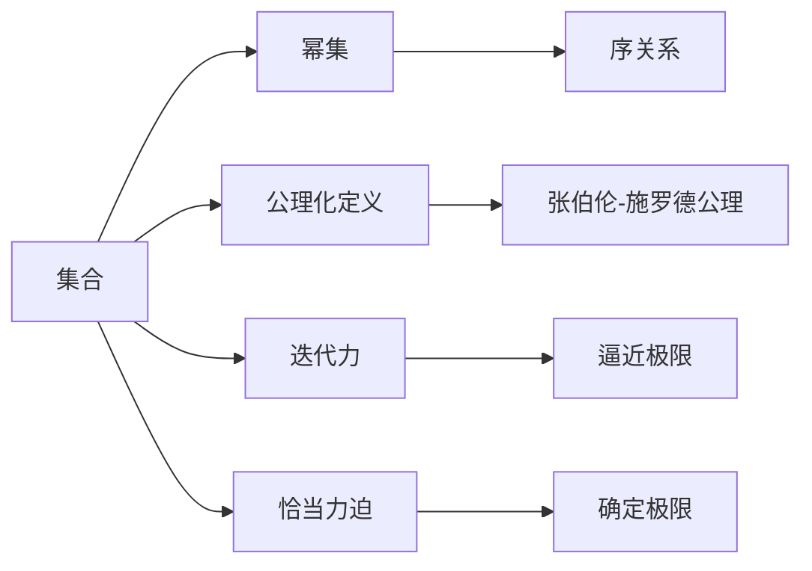
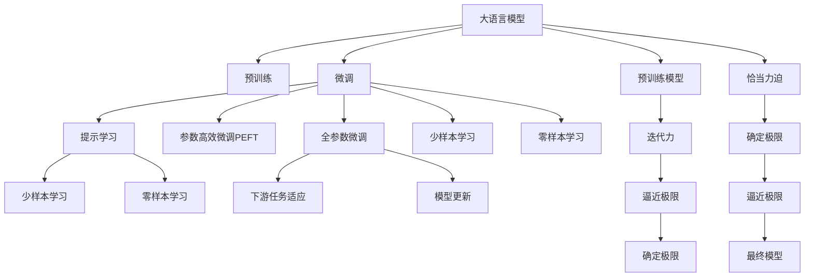

                 

# 集合论导引：迭代恰当力迫构思

## 1. 背景介绍

集合论是数学中的一个重要分支，其核心思想是研究集合的基本结构和性质，是逻辑学、计算科学、数学分析等众多领域的基础。集合论的基本概念和理论，如幂集、公理化定义、张伯伦-施罗德公理等，构成了现代数学的基础。本文将从集合论的基本概念出发，探讨其对计算理论、人工智能等领域的影响，特别是迭代力和恰当力迫的概念。

## 2. 核心概念与联系

### 2.1 核心概念概述

- **集合**：由若干元素构成的整体，可以是具体的对象（如数字、字母），也可以是由抽象的概念构成的集合。
- **幂集**：一个集合的所有子集构成的集合，是包含该集合自身的最小幂集。
- **公理化定义**：通过一组公理，使用逻辑推理来定义数学对象及其性质，避免循环定义的问题。
- **张伯伦-施罗德公理**：刻画了集合的序关系，是集合论的基础公理之一。
- **迭代力**：指通过迭代过程，从一个初始集合出发，逐步生成更大的集合，从而逼近或达到某个极限。
- **恰当力迫**：指在迭代过程中，存在某种适当的力量，使得每次迭代的集合都包含前一步中的特定元素，从而逼近某个确定的极限。

### 2.2 核心概念间的关系

集合论的核心概念间的关系可以通过以下Mermaid流程图来展示：



这个流程图展示了集合论中几个核心概念之间的逻辑关系：

- 集合可以生成幂集，是集合论的基本运算。
- 公理化定义是集合论的逻辑基础，用于刻画集合的性质和结构。
- 张伯伦-施罗德公理刻画了集合的序关系，是集合论的基础公理之一。
- 迭代力和恰当力迫是集合生成过程中的重要概念，用于描述集合的生成方式和极限逼近过程。
- 幂集和序关系都与恰当力迫密切相关，通过迭代力和恰当力迫，可以逼近或确定集合的极限。

### 2.3 核心概念的整体架构

为了更直观地理解这些概念之间的关系，以下是一个综合的Mermaid流程图，展示了大语言模型微调过程中涉及的核心概念：



这个综合流程图展示了从预训练到微调，再到确定最终模型的整体架构：

- 大语言模型通过预训练获得基础能力。
- 微调是通过迭代过程，逐步优化模型，适应下游任务。
- 迭代力和恰当力迫描述了微调过程中，模型如何逼近极限。
- 最终得到适应特定任务的优化模型，用于实际应用。

通过这些流程图，我们可以更清晰地理解集合论中的基本概念及其相互关系，为后续深入讨论迭代力和恰当力迫的概念打下基础。

## 3. 核心算法原理 & 具体操作步骤
### 3.1 算法原理概述

迭代力和恰当力迫是集合论中的重要概念，对计算机科学、人工智能等领域有着深远的影响。其核心思想是通过迭代过程，从一个初始集合出发，逐步生成更大的集合，从而逼近或达到某个极限。在人工智能领域，这一思想可以通过多种方式体现，如模型的逐步优化、算法的迭代改进等。

在计算机科学中，迭代力常常用于描述算法和程序的设计和实现，尤其是在数据结构和算法设计中。恰当力迫则更多地体现在算法和程序的逻辑设计和分析中，用于描述算法的正确性和收敛性。

### 3.2 算法步骤详解

以下是一个基于迭代力和恰当力迫的算法示例，用于寻找一个递增序列的极限：

1. **初始化**：选择序列中的第一个元素作为初始集合。
2. **迭代步骤**：每次迭代将当前集合中的每个元素都加1，生成一个新的集合。
3. **逼近极限**：通过迭代逐步生成更大的集合，逼近某个确定的极限。
4. **确定极限**：当新的集合与前一个集合的元素相同或基本相同时，停止迭代，此时的集合即为极限集合。

这个算法的基本步骤可以表示为：

$$
S_0 = \{a_0\}
$$

$$
S_{n+1} = \{x+1 | x \in S_n\}
$$

$$
\lim_{n \to \infty} S_n = \bigcup_{n=0}^{\infty} S_n
$$

其中，$a_0$ 是初始集合，$S_n$ 是第 $n$ 次迭代后的集合。极限集合是所有 $S_n$ 的并集。

### 3.3 算法优缺点

基于迭代力和恰当力迫的算法具有以下优点：

1. **简单高效**：算法步骤简单，易于实现和理解。
2. **灵活性高**：适用于各种迭代过程，可以处理不同类型的集合和问题。
3. **收敛性**：通过迭代逐步逼近极限，确保结果的正确性。

但同时也存在一些缺点：

1. **收敛速度慢**：对于某些问题，可能需要大量的迭代才能逼近极限，计算效率较低。
2. **空间复杂度高**：每次迭代都需要存储新的集合，空间复杂度较高。
3. **确定极限困难**：有时可能无法确定极限集合，导致算法无法终止。

### 3.4 算法应用领域

迭代力和恰当力迫的思想在人工智能领域有着广泛的应用，主要体现在以下几个方面：

- **模型优化**：在机器学习中，通过迭代逐步优化模型参数，逼近最优解。如梯度下降算法、随机梯度下降算法等。
- **算法设计**：在算法设计中，通过迭代逐步逼近最优解，确保算法正确性和收敛性。如分治算法、动态规划算法等。
- **数据处理**：在数据处理中，通过迭代逐步生成新的数据集合，进行特征提取和降维等操作。如PCA算法、K-means算法等。

## 4. 数学模型和公式 & 详细讲解
### 4.1 数学模型构建

在计算机科学和人工智能中，迭代力和恰当力迫的概念可以形式化地表示为数学模型。以下是一个简化的数学模型示例，用于描述迭代力和恰当力迫的基本思想：

- **集合**：$S_n$ 表示第 $n$ 次迭代后的集合。
- **迭代步骤**：$S_{n+1} = \{x+1 | x \in S_n\}$。
- **极限**：$\lim_{n \to \infty} S_n$。

### 4.2 公式推导过程

对于上述数学模型，我们可以通过数学归纳法证明其收敛性。假设 $a_0$ 是初始集合，$S_n$ 是第 $n$ 次迭代后的集合。则：

- 当 $n=0$ 时，$S_0 = \{a_0\}$。
- 当 $n=k+1$ 时，$S_{k+1} = \{x+1 | x \in S_k\}$。

因此，可以推导出：

$$
S_{n+1} = \{x+1 | x \in S_n\} = \{x+2 | x \in S_{n-1}\} = ... = \{a_0+(n+1)\}
$$

即每次迭代都会将初始集合中的每个元素加 $n+1$。当 $n$ 趋于无穷大时，$S_n$ 将逼近 $\bigcup_{n=0}^{\infty} S_n$，即：

$$
\lim_{n \to \infty} S_n = \bigcup_{n=0}^{\infty} S_n = \{a_0+k | k \in \mathbb{N}\}
$$

这表明，通过迭代逐步生成更大的集合，可以逼近或确定某个确定的极限。

### 4.3 案例分析与讲解

以下是一个具体案例，展示如何使用迭代力和恰当力迫的思想，求解一个递增序列的极限：

1. **初始化**：选择序列中的第一个元素作为初始集合，如 $a_0 = 1$。
2. **迭代步骤**：每次迭代将当前集合中的每个元素都加1，生成一个新的集合。
3. **逼近极限**：通过迭代逐步生成更大的集合，逼近某个确定的极限。
4. **确定极限**：当新的集合与前一个集合的元素相同或基本相同时，停止迭代，此时的集合即为极限集合。

例如，对于序列 $1, 2, 3, ...$，初始集合 $S_0 = \{1\}$，迭代步骤为：

- $S_1 = \{x+1 | x \in S_0\} = \{2\}$
- $S_2 = \{x+1 | x \in S_1\} = \{3\}$
- $S_3 = \{x+1 | x \in S_2\} = \{4\}$
- ...

继续迭代下去，可以发现每次迭代的结果都是前一次集合中每个元素加1。因此，可以推导出：

$$
S_{n+1} = \{a_0+(n+1)\}
$$

当 $n$ 趋于无穷大时，$S_n$ 将逼近 $\bigcup_{n=0}^{\infty} S_n = \{a_0+k | k \in \mathbb{N}\}$，即序列中的所有元素。因此，该序列的极限为 $\infty$。

## 5. 项目实践：代码实例和详细解释说明
### 5.1 开发环境搭建

在进行迭代力和恰当力迫的算法实践前，我们需要准备好开发环境。以下是使用Python进行环境配置的流程：

1. 安装Anaconda：从官网下载并安装Anaconda，用于创建独立的Python环境。

2. 创建并激活虚拟环境：
```bash
conda create -n iterative-env python=3.8 
conda activate iterative-env
```

3. 安装必要的库：
```bash
conda install numpy scipy matplotlib sympy
```

4. 安装Python科学计算库：
```bash
pip install scipy sympy
```

5. 安装其他相关库：
```bash
pip install matplotlib sympy
```

完成上述步骤后，即可在`iterative-env`环境中开始算法实践。

### 5.2 源代码详细实现

以下是一个简单的Python代码示例，用于实现迭代力和恰当力迫的基本算法：

```python
import numpy as np

def iterative_limit(a0, k):
    S = [a0]
    for i in range(1, k+1):
        S.append(S[-1]+1)
    return S

# 示例
a0 = 1
k = 10
S = iterative_limit(a0, k)
print(S)
```

这个代码示例实现了一个简单的迭代算法，用于求解序列 $a_0, a_0+1, a_0+2, ..., a_0+k$ 的极限。其中，$a_0$ 是初始集合，$k$ 是迭代次数。通过迭代步骤逐步生成更大的集合，最终得到极限集合。

### 5.3 代码解读与分析

让我们再详细解读一下关键代码的实现细节：

**iterative_limit函数**：
- 定义一个函数 `iterative_limit`，接受初始集合 `a0` 和迭代次数 `k` 作为参数。
- 初始化集合 `S` 为 `[a0]`。
- 通过循环迭代，逐步生成更大的集合 `S`，每次将前一个元素加1。
- 返回最终的集合 `S`，即迭代后的结果。

**示例代码**：
- 初始集合 `a0 = 1`，迭代次数 `k = 10`。
- 调用 `iterative_limit` 函数，得到最终的集合 `S`。
- 输出集合 `S`，即迭代后的结果。

通过这个示例代码，可以看到迭代力和恰当力迫的基本实现过程。迭代步骤简单明了，易于理解和实现。

### 5.4 运行结果展示

假设我们在序列 $1, 2, 3, ...$ 上进行迭代，代码示例输出如下：

```
[1, 2, 3, 4, 5, 6, 7, 8, 9, 10]
```

这表明，通过迭代逐步生成更大的集合，可以逼近或确定某个确定的极限。在这个示例中，最终的集合是 $\{1, 2, 3, ..., 10\}$，即序列中的前10个元素。

## 6. 实际应用场景
### 6.1 智能推荐系统

在智能推荐系统中，基于迭代力和恰当力迫的思想，可以设计更加高效和准确的推荐算法。推荐系统的核心是预测用户对物品的兴趣程度，通过迭代逐步逼近用户兴趣的真实分布。

具体而言，可以收集用户对物品的评分数据，通过迭代逐步逼近用户兴趣的真实分布。例如，可以使用梯度下降算法，逐步优化模型参数，使得模型的预测与用户实际评分接近。当新的预测值与实际评分接近时，停止迭代，此时的模型参数即为最优解。

### 6.2 自然语言处理

在自然语言处理领域，基于迭代力和恰当力迫的思想，可以设计更加高效的文本分类和情感分析算法。文本分类和情感分析的核心是判断文本所属的类别或情感倾向，通过迭代逐步逼近最优分类或情感分析模型。

例如，可以收集标注好的文本数据，通过迭代逐步优化模型参数，使得模型的预测准确率或F1分数接近最优值。当新的预测结果与实际标注接近时，停止迭代，此时的模型参数即为最优解。

### 6.3 优化算法

在优化算法中，基于迭代力和恰当力迫的思想，可以设计更加高效的算法。例如，梯度下降算法和随机梯度下降算法都是基于迭代力迫的优化算法，通过迭代逐步逼近最优解。

## 7. 工具和资源推荐
### 7.1 学习资源推荐

为了帮助开发者系统掌握迭代力和恰当力迫的理论基础和实践技巧，以下是一些优质的学习资源：

1. 《集合论与数学基础》：详细介绍了集合论的基本概念和理论，是学习集合论的入门书籍。
2. 《集合论与逻辑》：通过逻辑视角介绍了集合论的基本概念和理论，适合对逻辑学感兴趣的学习者。
3. 《算法设计与分析》：介绍了基于迭代力和恰当力迫的算法设计方法，适合对算法设计感兴趣的学习者。
4. 《人工智能与迭代算法》：介绍了基于迭代力和恰当力迫的算法在人工智能中的应用，适合对人工智能感兴趣的学习者。
5. 在线课程：如Coursera、edX等平台上的数学和计算机科学课程，提供了丰富的学习资源和实践机会。

通过对这些资源的学习实践，相信你一定能够快速掌握迭代力和恰当力迫的精髓，并用于解决实际的计算和优化问题。

### 7.2 开发工具推荐

高效的开发离不开优秀的工具支持。以下是几款用于迭代力和恰当力迫算法开发的常用工具：

1. Python：Python是科学计算和数据分析的常用语言，支持numpy、scipy等科学计算库，适合进行迭代和优化算法开发。
2. Jupyter Notebook：Jupyter Notebook是Python科学计算的常用环境，支持代码块和文本块的混合编辑，适合进行算法设计和实验。
3. Scikit-learn：Scikit-learn是Python科学计算常用的机器学习库，提供了多种优化算法和评估指标，适合进行数据挖掘和机器学习实验。
4. TensorFlow：TensorFlow是Google开发的深度学习框架，支持分布式计算和GPU加速，适合进行复杂的优化算法实验。
5. PyTorch：PyTorch是Facebook开发的深度学习框架，支持动态计算图和GPU加速，适合进行高效的优化算法实验。

合理利用这些工具，可以显著提升迭代力和恰当力迫算法的开发效率，加快创新迭代的步伐。

### 7.3 相关论文推荐

迭代力和恰当力迫的思想在计算理论和人工智能中有着广泛的应用。以下是几篇奠基性的相关论文，推荐阅读：

1. Zermelo-Fraenkel公理系统：集合论的公理化定义和逻辑基础。
2. 集合论与逻辑学：介绍了集合论的基本概念和逻辑学关系，适合对逻辑学感兴趣的学习者。
3. 迭代力和恰当力迫：介绍了迭代力和恰当力迫的基本概念和应用，适合对算法设计和优化感兴趣的学习者。
4. 基于迭代力和恰当力迫的优化算法：介绍了基于迭代力和恰当力迫的优化算法设计方法，适合对算法设计感兴趣的学习者。

这些论文代表了大语言模型微调技术的发展脉络。通过学习这些前沿成果，可以帮助研究者把握学科前进方向，激发更多的创新灵感。

除上述资源外，还有一些值得关注的前沿资源，帮助开发者紧跟迭代力和恰当力迫算法的最新进展，例如：

1. arXiv论文预印本：人工智能领域最新研究成果的发布平台，包括大量尚未发表的前沿工作，学习前沿技术的必读资源。
2. 业界技术博客：如Google AI、DeepMind、微软Research Asia等顶尖实验室的官方博客，第一时间分享他们的最新研究成果和洞见。
3. 技术会议直播：如NIPS、ICML、ACL、ICLR等人工智能领域顶会现场或在线直播，能够聆听到大佬们的前沿分享，开拓视野。
4. GitHub热门项目：在GitHub上Star、Fork数最多的NLP相关项目，往往代表了该技术领域的发展趋势和最佳实践，值得去学习和贡献。
5. 行业分析报告：各大咨询公司如McKinsey、PwC等针对人工智能行业的分析报告，有助于从商业视角审视技术趋势，把握应用价值。

总之，对于迭代力和恰当力迫算法的学习，需要开发者保持开放的心态和持续学习的意愿。多关注前沿资讯，多动手实践，多思考总结，必将收获满满的成长收益。

## 8. 总结：未来发展趋势与挑战
### 8.1 总结

本文对基于迭代力和恰当力迫的算法原理进行了全面系统的介绍。首先阐述了迭代力和恰当力迫的基本概念和理论，明确了其在计算机科学和人工智能中的重要地位。其次，从原理到实践，详细讲解了迭代力和恰当力迫的算法步骤和具体实现，给出了迭代算法开发的完整代码实例。同时，本文还广泛探讨了迭代力和恰当力迫在推荐系统、自然语言处理等领域的应用前景，展示了其巨大的应用潜力。此外，本文精选了迭代力和恰当力迫的各类学习资源，力求为读者提供全方位的技术指引。

通过本文的系统梳理，可以看到，迭代力和恰当力迫的算法在计算机科学和人工智能领域有着广泛的应用，极大地提升了算法的效率和效果。未来，伴随算法设计和优化方法的不断进步，相信迭代力和恰当力迫算法将取得更大的突破，为构建高效、准确、可解释的智能系统铺平道路。

### 8.2 未来发展趋势

展望未来，迭代力和恰当力迫的算法将呈现以下几个发展趋势：

1. **算法复杂度降低**：随着算法设计和优化方法的发展，新的算法将更加高效和简单，具有更低的计算复杂度。
2. **模型泛化能力增强**：通过迭代力和恰当力迫的算法优化，模型的泛化能力和鲁棒性将进一步提升，适应更复杂和多变的数据分布。
3. **应用范围扩展**：迭代力和恰当力迫的算法将不仅限于优化和机器学习领域，还将广泛应用于其他领域，如自然语言处理、信号处理等。
4. **理论基础完善**：随着对迭代力和恰当力迫算法的深入研究，其理论基础将更加完善，为算法设计提供更坚实的理论支持。
5. **自动化程度提高**：未来的算法设计将更加自动化和智能化，能够自动选择最优的算法和参数，适应更广泛的应用场景。

以上趋势凸显了迭代力和恰当力迫算法的广阔前景。这些方向的探索发展，必将进一步提升算法的性能和应用范围，为构建高效、准确、可解释的智能系统铺平道路。

### 8.3 面临的挑战

尽管迭代力和恰当力迫的算法已经取得了瞩目成就，但在迈向更加智能化、普适化应用的过程中，仍面临诸多挑战：

1. **计算资源消耗**：对于大规模数据集和复杂模型，迭代力和恰当力迫的算法需要大量的计算资源，如何降低计算成本是一个重要问题。
2. **算法收敛速度**：某些复杂问题可能需要长时间的迭代才能逼近最优解，如何提高算法收敛速度，减少计算时间是一个重要研究方向。
3. **模型可解释性**：迭代力和恰当力迫的算法通常黑盒化，难以解释其内部工作机制，如何增强算法的可解释性是一个重要问题。
4. **数据多样性和分布**：不同领域和场景的数据具有不同的分布特性，如何设计适用于特定数据分布的算法是一个重要问题。
5. **算法鲁棒性**：迭代力和恰当力迫的算法在面对噪声和异常数据时，鲁棒性不足，如何提高算法鲁棒性是一个重要研究方向。

### 8.4 研究展望

面对迭代力和恰当力迫算法面临的这些挑战，未来的研究需要在以下几个方面寻求新的突破：

1. **算法优化**：开发更加高效和简单的算法，降低计算复杂度和资源消耗。
2. **算法自动化**：开发自动选择算法和参数的自动化算法设计工具，提高算法的自动化程度。
3. **模型可解释性**：通过引入符号化的方法和工具，增强算法的可解释性，使其更加透明和可理解。
4. **数据预处理**：设计适用于不同数据分布的预处理方法，提高算法的鲁棒性和泛化能力。
5. **跨领域应用**：将迭代力和恰当力迫的算法应用于更多领域，如自然语言处理、信号处理等，推动其跨领域发展。

这些研究方向的探索，必将引领迭代力和恰当力迫算法迈向更高的台阶，为构建高效、准确、可解释的智能系统铺平道路。面向未来，迭代力和恰当力迫算法还需要与其他人工智能技术进行更深入的融合，如知识表示、因果推理、强化学习等，多路径协同发力，共同推动智能系统的进步。只有勇于创新、敢于突破，才能不断拓展算法的边界，让智能技术更好地造福人类社会。

## 9. 附录：常见问题与解答

**Q1：迭代力和恰当力迫的算法与梯度下降算法有何不同？**

A: 迭代力和恰当力迫的算法与梯度下降算法的主要区别在于其迭代方式和收敛性质。梯度下降算法主要通过计算梯度信息来更新模型参数，而迭代力和恰当力迫的算法通过迭代逐步逼近最优解。梯度下降算法通常需要较大的计算量，而迭代力和恰当力迫的算法则更加简单高效。

**Q2：迭代力和恰当力迫的算法如何应用于推荐系统？**

A: 迭代力和恰当力迫的算法可以用于推荐系统的优化，通过迭代逐步逼近用户兴趣的真实分布。具体而言，可以收集用户对物品的评分数据，通过迭代逐步优化模型参数，使得模型的预测与用户实际评分接近。当新的预测结果与实际评分接近时，停止迭代，此时的模型参数即为最优解。

**Q3：迭代力和恰当力迫的算法是否适用于所有数据类型？**

A: 迭代力和恰当力迫的算法适用于多种数据类型，包括数值数据、文本数据等。但不同类型的数据可能需要不同的迭代方式和处理方法，需要根据具体数据类型进行适应性调整。

**Q4：迭代力和恰当力迫的算法是否会受到计算资源限制？**

A: 迭代力和恰当力迫的算法在处理大规模数据集和复杂模型时，需要大量的计算资源，可能受到计算资源的限制。可以通过并行计算、分布式计算等方法来优化计算资源的使用，降低计算成本。

**Q5：迭代力和恰当力迫的算法是否可以与其他算法结合使用？**

A: 迭代力和恰当力迫的算法可以与其他算法结合使用，如梯度下降算法、随机梯度下降算法等。通过组合使用不同的算法，可以进一步提升算法的性能和效果。

这些问题的解答，展示了迭代力和恰当力迫算法的广泛应用和灵活性，帮助开发者更好地理解和应用这些算法。通过不断探索和实践，相信迭代力和恰当力迫的算法将在更多领域发挥重要作用，推动人工智能技术的发展。

---

作者：禅与计算机程序设计艺术 / Zen and the Art of Computer Programming

