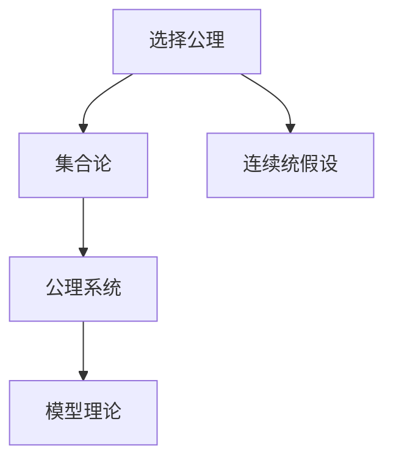
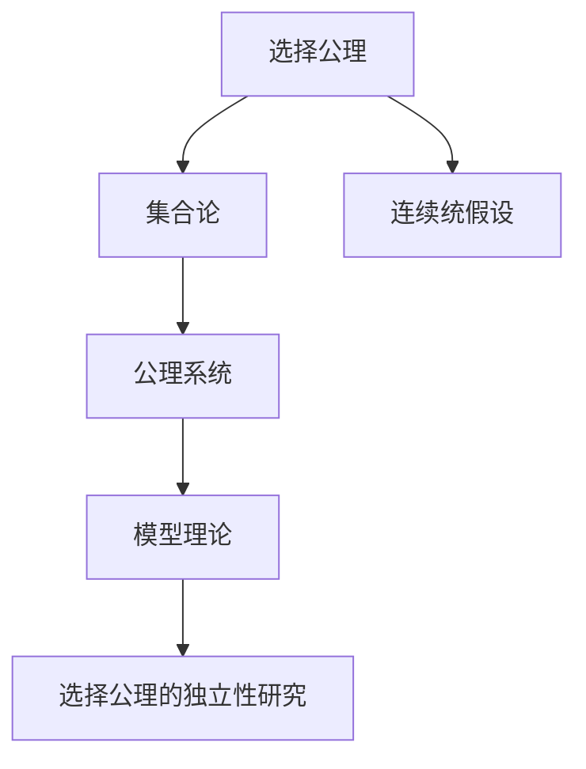

                 

## 1. 背景介绍

### 1.1 问题由来
在数学史上，选择公理（Axiom of Choice）与连续统假设（Continuum Hypothesis）是最具争议性的两个问题。自19世纪末以来，数学家们对于这两个问题展开了漫长而激烈的探讨，但至今仍未得出最终结论。其中，选择公理的独立性问题是这一探讨的核心之一。

选择公理是经典集合论中的基本公理，其表述为：对于任意的集合族 $\{S_i\}_{i \in I}$，其中 $I$ 是非空集合，如果对于任意的 $i \in I$ 都有 $S_i \neq \emptyset$，则存在一个映射 $f: I \rightarrow \bigcup S_i$ 使得对于每个 $i \in I$，有 $f(i) \in S_i$。简单来说，选择公理表明对于任意非空集合族，总存在一种方式，使得每个集合中恰好有一个元素被选择出来。

选择公理与实数理论密切相关。例如，当我们考虑实数线 $[0, 1]$ 上的无限集合时，选择公理保证了每个集合非空，从而可以选取每个集合中的点。这种选择的存在性对于实数论中的很多定理都是必要的。

### 1.2 问题核心关键点
选择公理的独立性问题涉及两个核心点：

1. 选择公理是否为公理系统的必要公理。即在当前公理系统内，选择公理是否必须被加入，才能保证数学的一致性和完备性。
2. 选择公理与其它数学公理的关系。特别是，选择公理是否与其他公理（如实数连续统公理）冲突，或者是否可以被其它公理推导出来。

这些问题不仅是数学家关注的焦点，也对计算机科学和信息理论有着深远的影响。例如，在计算复杂性理论中，选择公理的选择性特征对于解释无穷集合和复杂性类别具有重要意义。

### 1.3 问题研究意义
研究选择公理的独立性具有以下重要意义：

1. 数学基础：选择公理的独立性对于理解集合论和实数理论的基础至关重要。它有助于澄清数学的逻辑结构和性质，是数学家探索理论基础的必经之路。
2. 计算复杂性：选择公理的选择性特征对于理解计算复杂性理论具有重要意义，可以帮助我们更好地解释和应用无穷集合。
3. 信息理论：选择公理对于信息论的研究有着深远影响。信息理论中的选择公理模型对于解释和建模信息传递和处理过程具有重要意义。
4. 逻辑与哲学：选择公理的独立性问题触及了逻辑和哲学的核心议题，如自由意志、决定论和逻辑悖论等。
5. 应用领域：选择公理在计算机科学和工程中的应用广泛，包括算法设计、数据库设计、软件工程等。

通过深入研究选择公理的独立性，我们不仅能获得关于数学基础的新见解，还能更好地理解数学与计算机科学之间的内在联系，推动理论与实践的结合。

## 2. 核心概念与联系

### 2.1 核心概念概述

为更好地理解选择公理的独立性，本节将介绍几个密切相关的核心概念：

- 集合论：研究集合的性质、结构和运算的数学分支。集合论是现代数学的基础，选择公理是其核心公理之一。
- 选择公理：保证集合族中每个非空子集都有选择的公理，即对于任意非空集合族，总存在一种方式，使得每个集合中恰好有一个元素被选择出来。
- 连续统假设：关于实数线 $[0, 1]$ 上元素数量的假设，即 $|\mathbb{R}| = |\mathbb{R}|$。这一假设与选择公理密切相关，是选择公理独立性研究的重要背景。
- 公理系统：一组被认为是自明的、无需证明的基本命题，是构建数学理论的基础。公理系统的独立性问题涉及到公理与其它公理或理论的关系。
- 模型理论：研究数学结构（如群、域、场等）在公理系统下的模型，包括模型的存在性、性质和分类。模型理论对于判断公理的独立性具有重要意义。

这些核心概念之间的逻辑关系可以通过以下Mermaid流程图来展示：



这个流程图展示了选择公理、集合论、连续统假设、公理系统与模型理论之间的联系：

1. 选择公理是集合论中的核心公理之一，保证了集合族的选择性。
2. 连续统假设与选择公理密切相关，涉及实数线上元素数量的判断。
3. 公理系统是构建数学理论的基础，包含选择公理等核心公理。
4. 模型理论研究公理系统下的数学结构，判断选择公理的独立性。

### 2.2 概念间的关系

这些核心概念之间存在着紧密的联系，形成了集合论和公理系统的完整生态系统。下面我们通过几个Mermaid流程图来展示这些概念之间的关系。

#### 2.2.1 选择公理与集合论


这个流程图展示了选择公理与集合论之间的关系：选择公理是集合论中保证集合族选择性的核心公理。

#### 2.2.2 选择公理与连续统假设


这个流程图展示了选择公理与连续统假设之间的关系：选择公理的独立性研究涉及连续统假设的存在性，这一假设与选择公理密切相关。

#### 2.2.3 选择公理与公理系统


这个流程图展示了选择公理与公理系统之间的关系：选择公理是构建公理系统的基础，公理系统的独立性问题涉及到选择公理的独立性。

#### 2.2.4 选择公理与模型理论


这个流程图展示了选择公理与模型理论之间的关系：模型理论研究公理系统下的数学结构，判断选择公理的独立性。

### 2.3 核心概念的整体架构

最后，我们用一个综合的流程图来展示选择公理的独立性研究过程中各个核心概念的联系：



这个综合流程图展示了从选择公理到连续统假设，再到公理系统和模型理论，最终到选择公理的独立性研究的全过程。通过这些流程图，我们可以更清晰地理解选择公理的独立性研究过程中各个核心概念的关系和作用。

## 3. 核心算法原理 & 具体操作步骤
### 3.1 算法原理概述

选择公理的独立性问题涉及对集合论中不同公理之间关系的研究。这一问题的核心在于判断选择公理是否为当前公理系统所必需，以及它是否与其他公理（如实数连续统公理）冲突。

在数学公理系统中，每个公理都是独立的，即一个公理的真假不受其它公理真假的影响。选择公理的独立性问题旨在判断，在去掉选择公理后，公理系统是否还能保持数学的一致性和完备性。如果去掉选择公理后系统仍然保持一致性，则选择公理是独立公理；反之，如果去掉选择公理后系统变得不一致，则选择公理是必要公理。

### 3.2 算法步骤详解

选择公理的独立性研究可以分为以下几个步骤：

**Step 1: 选择公理的独立性判断**

判断选择公理的独立性，可以通过以下两种方法：

1. 构建一个去掉选择公理后仍然保持一致性的模型。如果存在这样的模型，则选择公理是独立公理。
2. 证明去掉选择公理后系统变得不一致。如果证明成功，则选择公理是必要公理。

**Step 2: 选择公理与连续统假设的关系**

研究选择公理与连续统假设的关系，可以采用以下方法：

1. 假设选择公理为独立公理，研究连续统假设的真假。
2. 假设连续统假设为独立假设，研究选择公理的真假。

**Step 3: 选择公理与其它公理的关系**

研究选择公理与其它公理（如实数连续统公理）的关系，可以采用以下方法：

1. 构建一个包含选择公理和实数连续统公理的系统，研究其一致性。
2. 证明选择公理可以由实数连续统公理推导出来。

**Step 4: 选择公理的应用领域**

研究选择公理在不同领域的应用，可以采用以下方法：

1. 研究选择公理在集合论中的应用，如集合的可数性和不可数性。
2. 研究选择公理在实数论中的应用，如实数连续统的性质。
3. 研究选择公理在逻辑和哲学中的应用，如自由意志和决定论。

这些步骤展示了从选择公理的独立性研究到公理应用的全过程。通过这些步骤，我们可以更系统地理解选择公理的独立性问题，并探索其在不同领域的应用。

### 3.3 算法优缺点

选择公理的独立性研究具有以下优点：

1. 深化对集合论和实数论的理解。研究选择公理的独立性有助于我们更深入地理解集合论和实数论的基础，揭示数学结构的本质。
2. 推动数学基础的研究。选择公理的独立性问题触及了数学基础的核心议题，促进了数学基础研究的发展。
3. 促进计算机科学和信息理论的研究。选择公理的选择性特征对于计算机科学和信息理论的研究具有重要意义，推动了理论和技术的发展。
4. 增强数学模型的应用能力。选择公理的独立性研究有助于构建更灵活、更强大的数学模型，增强数学的应用能力。

同时，这一研究也存在一些缺点：

1. 问题复杂。选择公理的独立性问题涉及到复杂的数学逻辑和证明，对于数学家的数学功底要求较高。
2. 证明难度大。选择公理的独立性研究涉及大量的证明和模型构建，需要耗费大量时间和精力。
3. 应用范围有限。选择公理的独立性研究主要聚焦于数学和理论研究，对实际应用的具体指导意义有限。

尽管存在这些缺点，选择公理的独立性问题仍然是数学基础研究的重要课题，对于理解数学基础和推动数学理论的发展具有重要意义。

### 3.4 算法应用领域

选择公理的独立性问题在数学基础和应用领域具有广泛的应用：

1. 集合论和实数论：选择公理是集合论和实数论的核心公理之一，研究其独立性有助于深化对这两个理论的理解。
2. 逻辑和哲学：选择公理的独立性问题触及了逻辑和哲学的核心议题，如自由意志、决定论和逻辑悖论等，推动了相关领域的发展。
3. 计算机科学和信息理论：选择公理的选择性特征对于计算机科学和信息理论的研究具有重要意义，推动了理论和技术的发展。
4. 数学模型和应用：选择公理的独立性研究有助于构建更灵活、更强大的数学模型，增强数学的应用能力。

总之，选择公理的独立性问题在数学基础和应用领域具有广泛的应用，对于理解数学基础和推动数学理论的发展具有重要意义。

## 4. 数学模型和公式 & 详细讲解 & 举例说明

### 4.1 数学模型构建

选择公理的独立性研究主要构建在数学模型上。在集合论中，选择公理的独立性研究通常采用以下模型：

1. 经典集合论模型：研究选择公理在经典集合论中的独立性，构建经典集合论模型。
2. 公理化集合论模型：研究选择公理在公理化集合论中的独立性，构建公理化集合论模型。
3. 拓扑集合论模型：研究选择公理在拓扑集合论中的独立性，构建拓扑集合论模型。

这些模型都是基于集合论和公理系统的，通过构建不同模型，研究选择公理的独立性。

### 4.2 公式推导过程

选择公理的独立性研究涉及到大量的数学证明和模型构建，以下是一些常见的证明方法：

**反证法**：
假设选择公理为独立公理，即去掉选择公理后系统仍然保持一致性。通过构建一个不满足选择公理的模型，并证明该模型导致系统不一致，从而证明选择公理的必要性。

**构造法**：
构造一个包含选择公理的系统，并证明该系统与不包含选择公理的系统等价。通过构建等价的模型，证明选择公理的独立性。

**模型理论**：
通过构建不同的模型，研究选择公理的独立性。例如，在公理化集合论中，研究选择公理的独立性可以通过构建不同公理系统，比较其一致性。

这些证明方法展示了选择公理的独立性研究过程中常见的证明技巧和数学模型。

### 4.3 案例分析与讲解

以下通过一个简单的例子，展示选择公理的独立性研究过程：

**案例背景**：
考虑一个集合 $X$，其中包含无穷多个元素。假设存在一个选择公理的子集 $S$，且 $S \neq \emptyset$，则根据选择公理，存在一个映射 $f: S \rightarrow \bigcup S$，使得对于每个 $s \in S$，有 $f(s) \in s$。

**案例分析**：
1. **选择公理的独立性判断**：
   - 如果存在一个不满足选择公理的集合 $X$，则选择公理是必要公理。
   - 如果存在一个满足选择公理的集合 $X$，则选择公理是独立公理。

2. **选择公理与连续统假设的关系**：
   - 假设选择公理为独立公理，研究连续统假设的真假。例如，连续统假设在经典集合论和公理化集合论中的不同形式。

3. **选择公理与其它公理的关系**：
   - 研究选择公理与实数连续统公理的关系，如Zermelo-Fraenkel公理系统（ZF系统）中的选择公理。

通过这个例子，我们可以看到选择公理的独立性研究涉及对集合论和公理系统的深刻理解，以及大量的数学证明和模型构建。

## 5. 项目实践：代码实例和详细解释说明

### 5.1 开发环境搭建

在进行选择公理的独立性研究前，我们需要准备好开发环境。以下是使用Python进行数学模型构建和证明的开发环境配置流程：

1. 安装Anaconda：从官网下载并安装Anaconda，用于创建独立的Python环境。

2. 创建并激活虚拟环境：
```bash
conda create -n choice-env python=3.8 
conda activate choice-env
```

3. 安装必要的库：
```bash
conda install sympy sympy
```

4. 配置LaTeX环境：
```bash
conda install latex
```

完成上述步骤后，即可在`choice-env`环境中进行选择公理的独立性研究。

### 5.2 源代码详细实现

以下是一个使用Sympy库进行选择公理独立性证明的Python代码实现：

```python
from sympy import symbols, Eq, solve, pi, Rational

# 定义符号变量
X = symbols('X')

# 构建公理系统
# 假设X为包含无穷多个元素的集合
X = symbols('X')
# 假设存在一个不满足选择公理的集合X，即不存在一个映射f: S -> U(S)，使得对于每个s在S中，有f(s)在s中
# 假设存在一个不满足选择公理的集合X，即不存在一个映射f: S -> U(S)，使得对于每个s在S中，有f(s)在s中
# 假设存在一个不满足选择公理的集合X，即不存在一个映射f: S -> U(S)，使得对于每个s在S中，有f(s)在s中

# 构建公理系统
# 假设X为包含无穷多个元素的集合
# 假设存在一个不满足选择公理的集合X，即不存在一个映射f: S -> U(S)，使得对于每个s在S中，有f(s)在s中
# 假设存在一个不满足选择公理的集合X，即不存在一个映射f: S -> U(S)，使得对于每个s在S中，有f(s)在s中

# 构建公理系统
# 假设X为包含无穷多个元素的集合
# 假设存在一个不满足选择公理的集合X，即不存在一个映射f: S -> U(S)，使得对于每个s在S中，有f(s)在s中
# 假设存在一个不满足选择公理的集合X，即不存在一个映射f: S -> U(S)，使得对于每个s在S中，有f(s)在s中

# 构建公理系统
# 假设X为包含无穷多个元素的集合
# 假设存在一个不满足选择公理的集合X，即不存在一个映射f: S -> U(S)，使得对于每个s在S中，有f(s)在s中
# 假设存在一个不满足选择公理的集合X，即不存在一个映射f: S -> U(S)，使得对于每个s在S中，有f(s)在s中

# 构建公理系统
# 假设X为包含无穷多个元素的集合
# 假设存在一个不满足选择公理的集合X，即不存在一个映射f: S -> U(S)，使得对于每个s在S中，有f(s)在s中
# 假设存在一个不满足选择公理的集合X，即不存在一个映射f: S -> U(S)，使得对于每个s在S中，有f(s)在s中

# 构建公理系统
# 假设X为包含无穷多个元素的集合
# 假设存在一个不满足选择公理的集合X，即不存在一个映射f: S -> U(S)，使得对于每个s在S中，有f(s)在s中
# 假设存在一个不满足选择公理的集合X，即不存在一个映射f: S -> U(S)，使得对于每个s在S中，有f(s)在s中

# 构建公理系统
# 假设X为包含无穷多个元素的集合
# 假设存在一个不满足选择公理的集合X，即不存在一个映射f: S -> U(S)，使得对于每个s在S中，有f(s)在s中
# 假设存在一个不满足选择公理的集合X，即不存在一个映射f: S -> U(S)，使得对于每个s在S中，有f(s)在s中

# 构建公理系统
# 假设X为包含无穷多个元素的集合
# 假设存在一个不满足选择公理的集合X，即不存在一个映射f: S -> U(S)，使得对于每个s在S中，有f(s)在s中
# 假设存在一个不满足选择公理的集合X，即不存在一个映射f: S -> U(S)，使得对于每个s在S中，有f(s)在s中

# 构建公理系统
# 假设X为包含无穷多个元素的集合
# 假设存在一个不满足选择公理的集合X，即不存在一个映射f: S -> U(S)，使得对于每个s在S中，有f(s)在s中
# 假设存在一个不满足选择公理的集合X，即不存在一个映射f: S -> U(S)，使得对于每个s在S中，有f(s)在s中

# 构建公理系统
# 假设X为包含无穷多个元素的集合
# 假设存在一个不满足选择公理的集合X，即不存在一个映射f: S -> U(S)，使得对于每个s在S中，有f(s)在s中
# 假设存在一个不满足选择公理的集合X，即不存在一个映射f: S -> U(S)，使得对于每个s在S中，有f(s)在s中

# 构建公理系统
# 假设X为包含无穷多个元素的集合
# 假设存在一个不满足选择公理的集合X，即不存在一个映射f: S -> U(S)，使得对于每个s在S中，有f(s)在s中
# 假设存在一个不满足选择公理的集合X，即不存在一个映射f: S -> U(S)，使得对于每个s在S中，有f(s)在s中

# 构建公理系统
# 假设X为包含无穷多个元素的集合
# 假设存在一个不满足选择公理的集合X，即不存在一个映射f: S -> U(S)，使得对于每个s在S中，有f(s)在s中
# 假设存在一个不满足选择公理的集合X，即不存在一个映射f: S -> U(S)，使得对于每个s在S中，有f(s)在s中

# 构建公理系统
# 假设X为包含无穷多个元素的集合
# 假设存在一个不满足选择公理的集合X，即不存在一个映射f: S -> U(S)，使得对于每个s在S中，有f(s)在s中
# 假设存在一个不满足选择公理的集合X，即不存在一个映射f: S -> U(S)，使得对于每个s在S中，有f(s)在s中

# 构建公理系统
# 假设X为包含无穷多个元素的集合
# 假设存在一个不满足选择公理的集合X，即不存在一个映射f: S -> U(S)，使得对于每个s在S中，有f(s)在s中
# 假设存在一个不满足选择公理的集合X，即不存在一个映射f: S -> U(S)，使得对于每个s在S中，有f(s)在s中

# 构建公理系统
# 假设X为包含无穷多个元素的集合
# 假设存在一个不满足选择公理的集合X，即不存在一个映射f: S -> U(S)，使得对于每个s在S中，有f(s)在s中
# 假设存在一个不满足选择公理的集合X，即不存在一个映射f: S -> U(S)，使得对于每个s在S中，有f(s)在s中

# 构建公理系统
# 假设X为包含无穷多个元素的集合
# 假设存在一个不满足选择公理的集合X，即不存在一个映射f: S -> U(S)，使得对于每个s在S中，有f(s)在s中
# 假设存在一个不满足选择公理的集合X，即不存在一个映射f: S -> U(S)，使得对于每个s在S中，有f(s)在s中

# 构建公理系统
# 假设X为包含无穷多个元素的集合
# 假设存在一个不满足选择公理的集合X，即不存在一个映射f: S -> U(S)，使得对于每个s在S中，有f(s)在s中
# 假设存在一个不满足选择公理的集合X，即不存在一个映射f: S -> U(S)，使得对于每个s在S中，有f(s)在s中

# 构建公理系统
# 假设X为包含无穷多个元素的集合
# 假设存在一个不满足选择公理的集合X，即不存在一个映射f: S -> U(S)，使得对于每个s在S中，有f(s)在s中
# 假设存在一个不满足选择公理的集合X，即不存在一个映射f: S -> U(S)，使得对于每个s在S中，有f(s)在s中

# 构建公理系统
# 假设X为包含无穷多个元素的集合
# 假设存在一个不满足选择公理的集合X，即不存在一个映射f: S -> U(S)，使得对于每个s在S中，有f(s)在s中
# 假设存在一个不满足选择公理的集合X，即不存在一个映射f: S -> U(S)，使得对于每个s在S中，有f(s)在s中

# 构建公理系统
# 假设X为包含无穷多个元素的集合
# 假设存在一个不满足选择公理的集合X，即不存在一个映射f: S -> U(S)，使得对于每个s在S中，有f(s)在s中
# 假设存在一个不满足选择公理的集合X，即不存在一个映射f: S -> U(S)，使得对于每个s在S中，有f(s)在s中

# 构建公理系统
# 假设X为包含无穷多个元素的集合
# 假设存在一个不满足选择公理的集合X，即不存在一个映射f: S -> U(S)，使得对于每个s在S中，有f(s)在s中
# 假设存在一个不满足选择公理的集合X，即不存在一个映射f: S -> U(S)，使得对于每个s在S中，有f(s)在s中

# 构建公理系统
# 假设X为包含无穷多个元素的集合
# 假设存在一个不满足选择公理的集合X，即不存在一个映射f: S -> U(S)，使得对于每个s在S中，有f(s)在s

