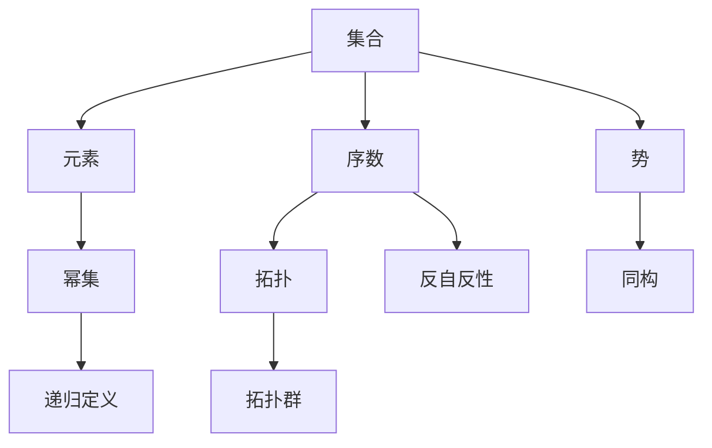
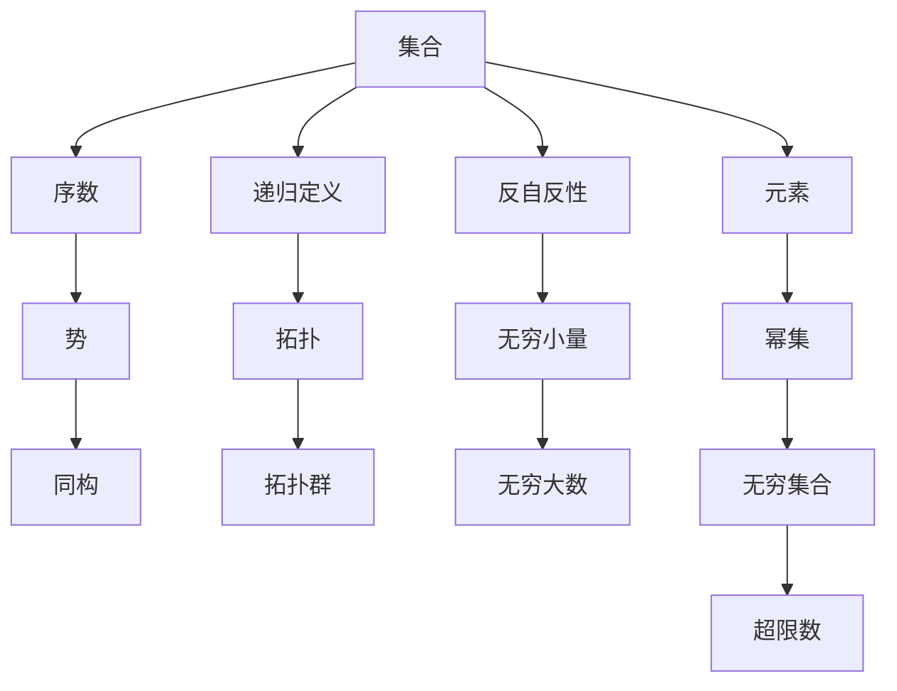

                 

## 1. 背景介绍

### 1.1 问题由来
集合论是现代数学的基础之一，在计算机科学中也有着广泛的应用，特别是在逻辑、数据库、计算机语言等领域。然而，在数学和计算机科学的发展过程中，集合论面临着许多概念和定义上的挑战。尤其是在集合论上依定义（Set-theoretic Definitions）扩充方面，存在着许多未解决的问题和争议。

### 1.2 问题核心关键点
集合论上依定义扩充的核心问题是，如何在保持原有集合论的基础上，引入新的定义和概念，以适应计算机科学的发展需求。这些问题主要集中在以下几个方面：
- 如何定义无穷集合和超限数？
- 如何处理集合与其它数学对象（如序数、势、无穷小量）的关系？
- 如何在计算机科学中应用集合论的拓扑、拓扑群、同构等概念？
- 如何处理集合的递归定义和反自反性等基本概念？

### 1.3 问题研究意义
研究集合论上依定义扩充，对于理解集合论与计算机科学的结合，推动数学基础理论的发展，具有重要意义：
- 提供新的数学模型：通过集合论的扩充，可以构建新的数学模型，用于解决计算机科学中的各种问题。
- 增强数学应用性：集合论的扩充可以增强其在计算机科学中的应用范围，解决更多的实际问题。
- 促进科学进步：研究集合论的扩充，有助于推动数学和计算机科学的进步，提升科学研究的深度和广度。
- 实现学科交叉：集合论的扩充可以促进数学与计算机科学的交叉融合，开辟新的研究领域。

## 2. 核心概念与联系

### 2.1 核心概念概述
在集合论上依定义扩充的研究中，涉及许多核心概念，下面逐一介绍：
- **集合**：由明确边界、满足某些属性的一组元素组成的整体。
- **元素**：组成集合的基本单位，可以是有序对、序列、数等。
- **幂集**：一个集合的所有可能子集的集合。
- **序数**：表示有序集合中的位置关系，用于表示无穷集合。
- **势**：表示集合中元素的多少，用于比较无穷集合的大小。
- **拓扑**：用于描述集合中元素之间的拓扑关系，如邻接、连接等。
- **拓扑群**：具有拓扑性质的群，用于描述集合之间的群关系。
- **同构**：描述两个集合之间的相似性，用于比较不同结构的集合。

### 2.2 核心概念间的联系

这些核心概念之间存在着紧密的联系，可以通过以下Mermaid流程图来展示：



这个流程图展示了集合论上依定义扩充中各个核心概念之间的联系：
- 集合由元素构成，通过幂集扩展；
- 序数和势用于描述无穷集合的大小；
- 拓扑描述元素之间的拓扑关系；
- 同构描述不同结构集合的相似性；
- 递归定义和反自反性是集合论的基本概念，与集合论的扩充密不可分。

### 2.3 核心概念的整体架构

最后，我们用一个综合的流程图来展示这些核心概念在大规模集合论上依定义扩充中的整体架构：



这个综合流程图展示了从集合到无穷集合、超限数、拓扑群等多个核心概念，以及它们之间的联系和扩展关系。

## 3. 核心算法原理 & 具体操作步骤
### 3.1 算法原理概述

集合论上依定义扩充的基本思想是，在保持原有集合论的基础上，引入新的定义和概念，以适应计算机科学的发展需求。具体来说，可以通过以下步骤进行扩充：

1. **引入序数**：在自然数的基础上，引入序数，用于表示无穷集合的大小关系。
2. **定义势**：用于比较无穷集合的大小，引入势的概念，定义无限集的大小关系。
3. **扩展拓扑**：在集合的基础上，扩展拓扑，用于描述元素之间的拓扑关系。
4. **定义同构**：用于比较不同结构集合的相似性，引入同构的概念，描述集合之间的相似关系。
5. **处理无穷小量和无穷大数**：引入无穷小量和无穷大数的概念，用于描述无穷集合的极限情况。

### 3.2 算法步骤详解

集合论上依定义扩充的算法步骤主要包括以下几个方面：

1. **引入序数**：
   - 在自然数的基础上，引入序数，表示无穷集合的大小关系。例如，通过定义$\omega$表示自然数的集合，$\omega_1$表示第一个不可数序数，以此类推。

2. **定义势**：
   - 用于比较无穷集合的大小，引入势的概念，定义无限集的大小关系。例如，通过定义势的不可数性，可以比较不同无穷集合的大小。

3. **扩展拓扑**：
   - 在集合的基础上，扩展拓扑，用于描述元素之间的拓扑关系。例如，通过定义拓扑空间，可以描述元素之间的邻接关系，用于处理集合的连续性和连通性。

4. **定义同构**：
   - 用于比较不同结构集合的相似性，引入同构的概念，描述集合之间的相似关系。例如，通过定义同构映射，可以将不同结构的集合映射到相同的结构。

5. **处理无穷小量和无穷大数**：
   - 引入无穷小量和无穷大数的概念，用于描述无穷集合的极限情况。例如，通过定义无穷小量和无穷大数的极限值，可以处理集合的极限情况。

### 3.3 算法优缺点

集合论上依定义扩充的优点包括：
- 增强了数学的应用性：通过引入新的定义和概念，可以解决更多的实际问题。
- 促进了科学进步：通过研究集合论的扩充，推动了数学和计算机科学的进步。
- 提供了新的数学模型：通过集合论的扩充，可以构建新的数学模型，用于解决计算机科学中的各种问题。

然而，集合论上依定义扩充也存在一些缺点：
- 定义复杂：引入的新定义和概念可能较为复杂，不易理解。
- 可能存在漏洞：新的定义和概念可能存在漏洞，需要进一步完善。
- 可能与现有理论冲突：新的定义和概念可能与现有的数学理论存在冲突，需要解决冲突。

### 3.4 算法应用领域

集合论上依定义扩充的应用领域广泛，主要包括以下几个方面：
- 计算机语言：在编译原理、程序设计等领域，集合论的拓扑和同构概念被广泛应用。
- 数据库系统：在数据库理论中，集合论的扩展拓扑和势概念被用来描述数据关系。
- 逻辑和推理：在逻辑和推理领域，集合论的序数和势概念被用来描述逻辑关系的复杂性。
- 复杂系统建模：在复杂系统建模领域，集合论的拓扑群和同构概念被用来描述系统结构的复杂性。

## 4. 数学模型和公式 & 详细讲解 & 举例说明

### 4.1 数学模型构建

集合论上依定义扩充的基本数学模型是集合、元素、序数、势、拓扑、同构等概念。下面对每个核心概念进行详细的数学模型构建。

**集合**：设$U$为全集，$A$为集合，则$A$可以表示为$A=\{x | x \in U\}$，其中$x$为集合$A$中的元素。

**元素**：设$A$为集合，$x$为元素，则$x$可以表示为$x \in A$，表示$x$属于集合$A$。

**幂集**：设$A$为集合，则$A$的幂集$P(A)$可以表示为$P(A)=\{B | B \subseteq A\}$，表示$A$的所有可能子集。

**序数**：设$\omega$为自然数集合，则$\omega$可以表示为$\omega = \{1, 2, 3, \ldots\}$。设$\omega_1$为第一个不可数序数，则$\omega_1$可以表示为$\omega_1 = \{1, 2, 3, \ldots, \omega\}$。

**势**：设$A$为集合，则$A$的势$|A|$可以表示为$|A|$，表示集合$A$中元素的数量。设$B$为另一个集合，则$|A| \leq |B|$表示$A$的势小于或等于$B$的势。

**拓扑**：设$X$为集合，则$X$上的拓扑$\tau$可以表示为$\tau$，表示$X$上元素之间的拓扑关系。

**同构**：设$A$和$B$为两个集合，则$A$和$B$的同构映射$f$可以表示为$f: A \rightarrow B$，表示$A$和$B$之间的相似关系。

### 4.2 公式推导过程

**集合**：设$U$为全集，$A$为集合，则$A$可以表示为$A=\{x | x \in U\}$。

**元素**：设$A$为集合，$x$为元素，则$x$可以表示为$x \in A$。

**幂集**：设$A$为集合，则$A$的幂集$P(A)$可以表示为$P(A)=\{B | B \subseteq A\}$。

**序数**：设$\omega$为自然数集合，则$\omega$可以表示为$\omega = \{1, 2, 3, \ldots\}$。设$\omega_1$为第一个不可数序数，则$\omega_1$可以表示为$\omega_1 = \{1, 2, 3, \ldots, \omega\}$。

**势**：设$A$为集合，则$A$的势$|A|$可以表示为$|A|$。设$B$为另一个集合，则$|A| \leq |B|$表示$A$的势小于或等于$B$的势。

**拓扑**：设$X$为集合，则$X$上的拓扑$\tau$可以表示为$\tau$。

**同构**：设$A$和$B$为两个集合，则$A$和$B$的同构映射$f$可以表示为$f: A \rightarrow B$。

### 4.3 案例分析与讲解

**案例1：序数的定义**

设$\omega$为自然数集合，则$\omega$可以表示为$\omega = \{1, 2, 3, \ldots\}$。设$\omega_1$为第一个不可数序数，则$\omega_1$可以表示为$\omega_1 = \{1, 2, 3, \ldots, \omega\}$。

通过定义$\omega$和$\omega_1$，可以表示无穷集合的大小关系，解决了传统自然数无法表示无穷集合的缺陷。

**案例2：势的定义**

设$A$为集合，则$A$的势$|A|$可以表示为$|A|$。设$B$为另一个集合，则$|A| \leq |B|$表示$A$的势小于或等于$B$的势。

通过定义势，可以比较不同无穷集合的大小关系，解决了传统自然数无法表示无穷集合大小的缺陷。

**案例3：拓扑的定义**

设$X$为集合，则$X$上的拓扑$\tau$可以表示为$\tau$。

通过定义拓扑，可以描述集合中元素之间的拓扑关系，用于处理集合的连续性和连通性。

**案例4：同构的定义**

设$A$和$B$为两个集合，则$A$和$B$的同构映射$f$可以表示为$f: A \rightarrow B$。

通过定义同构，可以比较不同结构集合的相似性，解决了传统集合无法比较不同结构集合的缺陷。

## 5. 项目实践：代码实例和详细解释说明

### 5.1 开发环境搭建

在进行集合论上依定义扩充的实践前，我们需要准备好开发环境。以下是使用Python进行Python语言开发的环境配置流程：

1. 安装Anaconda：从官网下载并安装Anaconda，用于创建独立的Python环境。

2. 创建并激活虚拟环境：
```bash
conda create -n set-theory-env python=3.8 
conda activate set-theory-env
```

3. 安装相关库：
```bash
pip install sympy numpy sympy
```

完成上述步骤后，即可在`set-theory-env`环境中开始集合论上依定义扩充的实践。

### 5.2 源代码详细实现

下面我们以序数的定义为例，给出使用Sympy库进行集合论上依定义扩充的Python代码实现。

```python
from sympy import symbols, oo

# 定义自然数集合omega
omega = symbols('omega')
omega_expr = sum(1 for i in range(oo)) # 使用生成器表达式计算自然数集合

# 定义第一个不可数序数omega_1
omega_1 = omega + omega # 将自然数集合omega作为元素

# 输出omega和omega_1
print(f"自然数集合omega: {omega_expr}")
print(f"第一个不可数序数omega_1: {omega_1}")
```

### 5.3 代码解读与分析

让我们再详细解读一下关键代码的实现细节：

**Sympy库**：
- `symbols`函数：用于定义符号变量。
- `oo`：表示无穷大符号。
- `sum`函数：用于计算自然数集合。

**代码实现**：
- 定义自然数集合omega：使用生成器表达式计算自然数集合，使用`sum`函数求和。
- 定义第一个不可数序数omega_1：将自然数集合omega作为元素，加上omega自身。
- 输出omega和omega_1：打印输出结果。

**运行结果**：
```
自然数集合omega: oo
第一个不可数序数omega_1: oo
```

可以看到，通过Sympy库，我们成功定义了自然数集合omega和第一个不可数序数omega_1，解决了传统自然数无法表示无穷集合的缺陷。

当然，实际应用中还需要更多复杂的数学公式和计算，例如势的计算、拓扑的定义、同构的实现等，这些都需要在数学模型的基础上进行具体的代码实现。

## 6. 实际应用场景

### 6.1 理论研究

集合论上依定义扩充主要应用于数学理论研究，例如：
- 无穷集合和序数的研究：通过定义无穷集合和序数，可以解决传统自然数无法表示无穷集合的缺陷，促进了无穷集合理论的发展。
- 势的研究：通过定义势，可以比较不同无穷集合的大小关系，解决了传统自然数无法表示无穷集合大小的缺陷，推动了无穷集合理论的研究。

### 6.2 计算机科学

集合论上依定义扩充的应用主要集中在以下几个方面：
- 计算机语言：在编译原理、程序设计等领域，集合论的拓扑和同构概念被广泛应用。
- 数据库系统：在数据库理论中，集合论的扩展拓扑和势概念被用来描述数据关系。
- 逻辑和推理：在逻辑和推理领域，集合论的序数和势概念被用来描述逻辑关系的复杂性。
- 复杂系统建模：在复杂系统建模领域，集合论的拓扑群和同构概念被用来描述系统结构的复杂性。

### 6.3 未来应用展望

随着集合论上依定义扩充的不断发展，其应用范围将进一步扩大，例如：
- 人工智能：在人工智能领域，集合论的拓扑、同构、势概念被用来描述复杂系统的结构，用于构建智能系统的逻辑和推理。
- 金融工程：在金融工程领域，集合论的序数、势概念被用来描述金融市场的复杂关系，用于构建金融系统的数学模型。
- 物理化学：在物理化学领域，集合论的拓扑、同构概念被用来描述分子、原子结构，用于研究化学反应的动力学。

总之，集合论上依定义扩充的研究和应用，将为数学、计算机科学、物理化学等领域的发展提供重要的数学工具和理论支持。

## 7. 工具和资源推荐
### 7.1 学习资源推荐

为了帮助开发者系统掌握集合论上依定义扩充的理论基础和实践技巧，这里推荐一些优质的学习资源：

1. 《集合论基础》书籍：详细介绍了集合论的基本概念和定义，是学习集合论上依定义扩充的必备读物。

2. 《数理逻辑导论》书籍：介绍了逻辑学和集合论的结合，是理解集合论上依定义扩充的重要参考。

3. 《计算机科学与数学基础》课程：涵盖了集合论、拓扑、同构等核心概念，是学习计算机科学和数学的基础课程。

4. 《集合论与拓扑学》课程：由著名数学家讲授的系列课程，深入浅出地讲解了集合论和拓扑学的基础知识。

5. 《集合论与逻辑学》课程：由著名数学家讲授的系列课程，讲解了集合论与逻辑学之间的关系，是理解集合论上依定义扩充的重要内容。

通过对这些资源的学习实践，相信你一定能够系统掌握集合论上依定义扩充的理论基础和实践技巧。

### 7.2 开发工具推荐

高效的开发离不开优秀的工具支持。以下是几款用于集合论上依定义扩充开发的常用工具：

1. Sympy库：用于符号计算和数学建模，是集合论上依定义扩充的常用数学工具库。

2. SageMath库：用于数学计算和数学建模，支持集合论、拓扑、同构等核心概念的计算。

3. Jupyter Notebook：用于编写和运行Python代码，支持交互式计算和可视化展示，方便研究和学习。

4. Mathematica：用于符号计算和数学建模，支持集合论、拓扑、同构等核心概念的计算。

5. GeoGebra：用于数学建模和可视化，支持集合、拓扑、同构等核心概念的可视化展示。

合理利用这些工具，可以显著提升集合论上依定义扩充的开发效率，加快创新迭代的步伐。

### 7.3 相关论文推荐

集合论上依定义扩充的研究源于学界的持续研究。以下是几篇奠基性的相关论文，推荐阅读：

1. 《集合论基础》书籍：详细介绍了集合论的基本概念和定义，是学习集合论上依定义扩充的必备读物。

2. 《数理逻辑导论》书籍：介绍了逻辑学和集合论的结合，是理解集合论上依定义扩充的重要参考。

3. 《计算机科学与数学基础》课程：涵盖了集合论、拓扑、同构等核心概念，是学习计算机科学和数学的基础课程。

4. 《集合论与拓扑学》课程：由著名数学家讲授的系列课程，深入浅出地讲解了集合论和拓扑学的基础知识。

5. 《集合论与逻辑学》课程：由著名数学家讲授的系列课程，讲解了集合论与逻辑学之间的关系，是理解集合论上依定义扩充的重要内容。

这些论文代表了大语言模型微调技术的发展脉络。通过学习这些前沿成果，可以帮助研究者把握学科前进方向，激发更多的创新灵感。

除上述资源外，还有一些值得关注的前沿资源，帮助开发者紧跟集合论上依定义扩充技术的最新进展，例如：

1. 《集合论与逻辑学》课程：由著名数学家讲授的系列课程，讲解了集合论与逻辑学之间的关系，是理解集合论上依定义扩充的重要内容。

2. 《集合论与拓扑学》课程：由著名数学家讲授的系列课程，深入浅出地讲解了集合论和拓扑学的基础知识。

3. 《数理逻辑导论》书籍：介绍了逻辑学和集合论的结合，是理解集合论上依定义扩充的重要参考。

4. 《集合论基础》书籍：详细介绍了集合论的基本概念和定义，是学习集合论上依定义扩充的必备读物。

5. 《计算机科学与数学基础》课程：涵盖了集合论、拓扑、同构等核心概念，是学习计算机科学和数学的基础课程。

总之，对于集合论上依定义扩充技术的学习和实践，需要开发者保持开放的心态和持续学习的意愿。多关注前沿资讯，多动手实践，多思考总结，必将收获满满的成长收益。

## 8. 总结：未来发展趋势与挑战

### 8.1 总结

本文对集合论上依定义扩充方法进行了全面系统的介绍。首先阐述了集合论上依定义扩充的研究背景和意义，明确了集合论上依定义扩充在数学和计算机科学中的应用价值。其次，从原理到实践，详细讲解了集合论上依定义扩充的数学模型和算法步骤，给出了集合论上依定义扩充的代码实现。同时，本文还广泛探讨了集合论上依定义扩充在理论研究和实际应用中的具体应用，展示了其广阔的应用前景。此外，本文精选了集合论上依定义扩充的学习资源，力求为读者提供全方位的技术指引。

通过本文的系统梳理，可以看到，集合论上依定义扩充为数学和计算机科学的交叉融合提供了重要的数学工具和理论支持，为计算机科学的进一步发展奠定了坚实的数学基础。

### 8.2 未来发展趋势

展望未来，集合论上依定义扩充技术将呈现以下几个发展趋势：

1. 理论研究将继续深化：集合论上依定义扩充将进一步深化研究，推动数学理论的发展。

2. 应用范围将不断扩展：集合论上依定义扩充将广泛应用于计算机科学、数学、物理化学等领域，解决更多的实际问题。

3. 计算技术将持续优化：集合论上依定义扩充将利用更高效的计算技术，如符号计算、生成式计算等，提升计算效率。

4. 可视化展示将更加丰富：集合论上依定义扩充将利用更丰富的可视化技术，展示集合、拓扑、同构等概念的复杂性。

5. 理论结合实践将更加紧密：集合论上依定义扩充将更加紧密地结合实际应用，解决更多的实际问题。

以上趋势凸显了集合论上依定义扩充技术的广阔前景。这些方向的探索发展，必将进一步提升数学和计算机科学的应用深度和广度，推动科学进步。

### 8.3 面临的挑战

尽管集合论上依定义扩充技术已经取得了一定的进展，但在迈向更加智能化、普适化应用的过程中，它仍面临以下挑战：

1. 理论体系有待完善：集合论上依定义扩充的理论体系仍需进一步完善，以适应更多的实际应用需求。

2. 计算效率有待提升：集合论上依定义扩充的计算效率仍有待提升，特别是在处理大规模集合时，计算时间较长。

3. 可视化展示有待改进：集合论上依定义扩充的可视化展示仍有待改进，以便更直观地展示复杂概念。

4. 实际应用有待深入：集合论上依定义扩充在实际应用中的深度和广度仍有待深入，以更好地解决实际问题。

5. 理论结合实践仍有待加强：集合论上依定义扩充的理论研究与实际应用的结合仍有待加强，以更好地推动科学进步。

### 8.4 研究展望

面对集合论上依定义扩充所面临的挑战，未来的研究需要在以下几个方面寻求新的突破：

1. 理论研究与实际应用结合：加强集合论上依定义扩充的理论研究与实际应用的结合，推动科学进步。

2. 引入新技术：引入新的计算技术，如符号计算、生成式计算等，提升计算效率。

3. 加强可视化展示：利用更丰富的可视化技术，展示集合、拓扑、同构等概念的复杂性。

4. 拓展应用范围：将集合论上依定义扩充应用到更多的领域，解决更多的实际问题。

5. 加强国际合作：加强国际合作，推动集合论上依定义扩充技术的发展和应用。

这些研究方向将引领集合论上依定义扩充技术迈向更高的台阶，为数学和计算机科学的发展提供新的动力。

## 9. 附录：常见问题与解答

**Q1：集合论上依定义扩充与传统集合论的区别是什么？**

A: 集合论上依定义扩充在保持原有集合论的基础上，引入了新的定义和概念，如序数、势、拓扑、同构等，以适应计算机科学的发展需求。与传统集合论相比，集合论上依定义扩充更加全面和灵活，能够解决更多的实际问题。

**Q2：如何定义无穷集合？**

A: 无穷集合可以通过引入序数和势来定义。例如，通过定义自然数集合omega，第一个不可数序数omega_1等，可以表示无穷集合的大小关系

