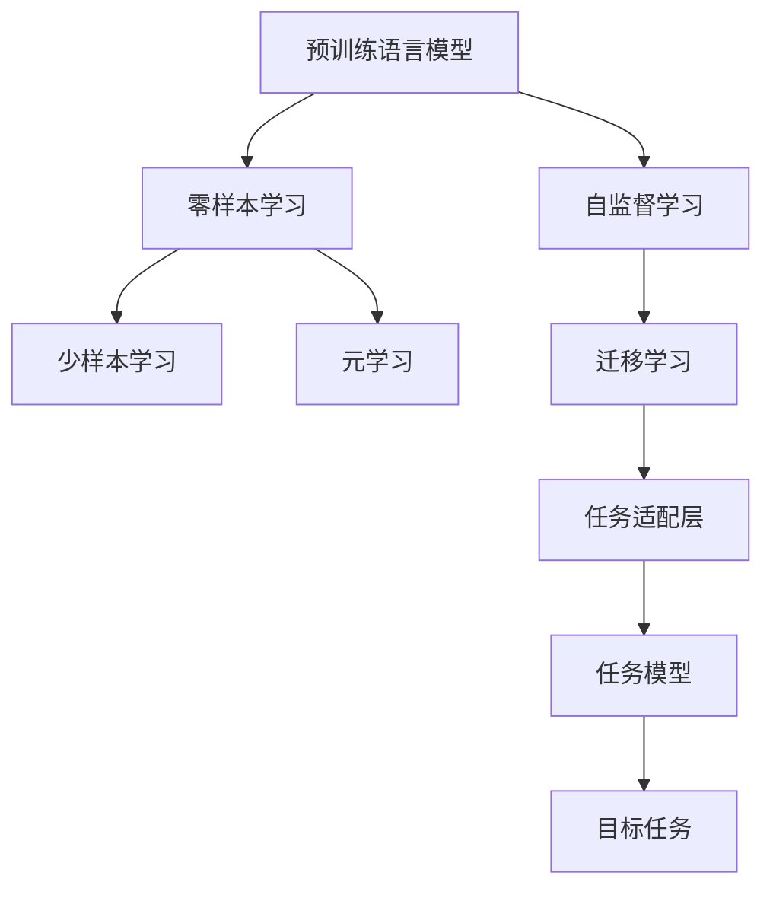
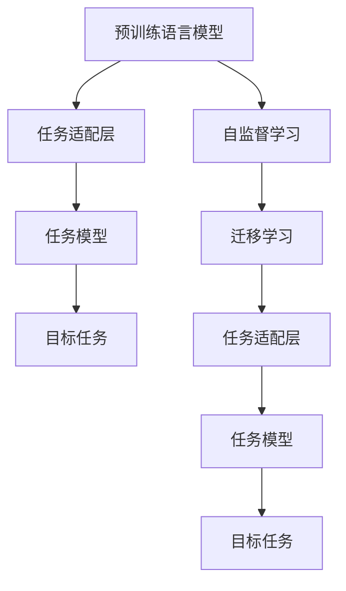
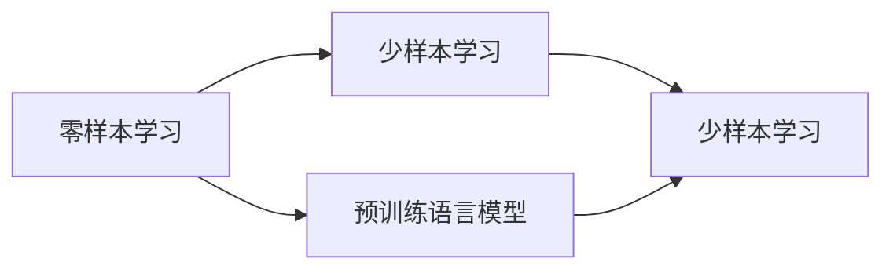
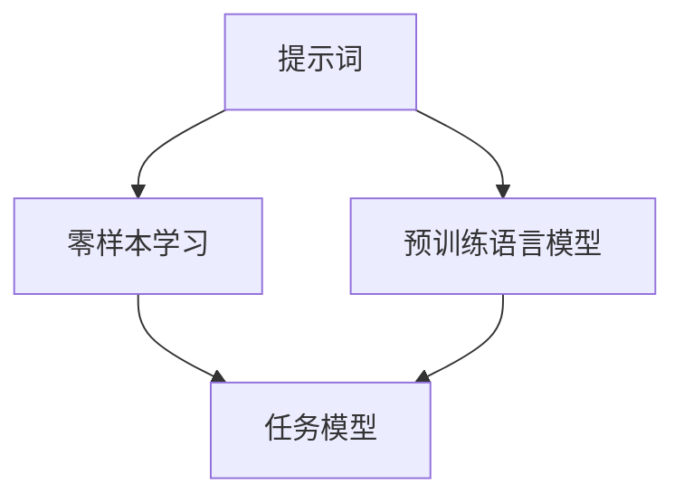
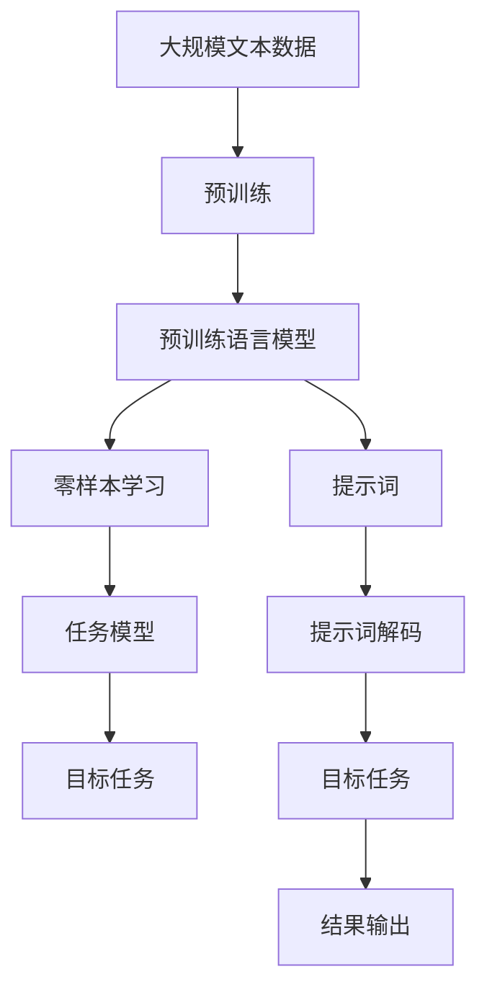

                 

# 零样本学习 (Zero-Shot Learning)

> 关键词：零样本学习、零样本学习算法、预训练语言模型、提示词、语言生成、迁移学习

## 1. 背景介绍

### 1.1 问题由来
在自然语言处理（NLP）领域，传统的机器学习模型通常依赖于大量的有标签数据进行训练。然而，在实际应用中，尤其是在教育、法律、金融等领域，获取大量标注数据往往成本高昂且耗时。因此，研究人员提出了一种更加高效的学习方式——零样本学习（Zero-Shot Learning, ZSL），即在模型从未见过任何特定任务的标注数据的情况下，仍然能够对新任务进行推理和预测。

### 1.2 问题核心关键点
零样本学习的核心在于如何利用大规模预训练语言模型（如BERT、GPT等）进行知识迁移，使模型在看到新任务或新类别时，能够基于其对语言的通用理解，自动适应并完成相关任务。这要求模型具有以下能力：

1. 强大的语言表示能力：能够捕捉语言的语法和语义特征，理解不同语言结构和上下文。
2. 泛化能力：在少量标注数据或没有标注数据的情况下，能够泛化到新的任务和类别。
3. 提示词的有效性：通过精心设计的提示词（Prompt），引导模型进行推理和预测。

### 1.3 问题研究意义
零样本学习能够显著减少标注数据需求，提高模型开发和应用效率，具有重要的理论和实践意义：

1. 降低开发成本：减少对标注数据的需求，降低了人工标注的成本和时间。
2. 提升模型泛化能力：通过利用预训练模型的通用知识，模型能够在未见过特定数据的情况下，泛化到新任务。
3. 加速模型部署：零样本学习模型可以快速部署到新的应用场景，无需额外训练。
4. 拓展应用范围：适用于各种NLP任务，包括分类、匹配、生成等，提高了模型的通用性和可复用性。
5. 促进技术创新：推动了新的研究方向，如多模态学习、跨领域迁移学习等。

## 2. 核心概念与联系

### 2.1 核心概念概述

为更好地理解零样本学习，本节将介绍几个密切相关的核心概念：

- 预训练语言模型（Pre-trained Language Models）：通过在大规模无标签文本数据上进行自监督学习任务训练得到的模型，如BERT、GPT等。
- 提示词（Prompt）：在输入文本中添加的具体格式，用以引导模型进行特定任务的推理和生成。
- 迁移学习（Transfer Learning）：将一个领域学习到的知识，迁移应用到另一个不同但相关的领域的学习范式。零样本学习可以看作迁移学习的一种特殊形式，其中模型仅通过预训练数据进行迁移。
- 少样本学习（Few-Shot Learning）：在只有少量标注样本的情况下，模型能够快速适应新任务的学习方法。零样本学习和少样本学习都利用了模型对语言的通用理解，但零样本学习无需任何标注样本。
- 元学习（Meta-Learning）：训练模型学习如何在不同的任务和数据集上进行快速适应。零样本学习和元学习类似，但元学习通常需要更多标注样本，而零样本学习则无需标注样本。

这些概念之间的逻辑关系可以通过以下Mermaid流程图来展示：



这个流程图展示了预训练语言模型的核心概念及其之间的关系：

1. 预训练语言模型通过自监督学习任务训练获得。
2. 零样本学习利用预训练模型的通用知识，无需任何标注样本。
3. 少样本学习和元学习都需要少量标注样本，但元学习通常需要更多的标注数据。
4. 迁移学习将预训练模型进行任务适配，从而应用于特定任务。

### 2.2 概念间的关系

这些核心概念之间存在着紧密的联系，形成了零样本学习的完整生态系统。下面我们通过几个Mermaid流程图来展示这些概念之间的关系。

#### 2.2.1 预训练语言模型的学习范式



这个流程图展示了预训练语言模型的基本原理，以及它与迁移学习的关系。预训练模型通过自监督学习任务训练获得，然后通过迁移学习进行任务适配，从而应用于特定任务。

#### 2.2.2 零样本学习与少样本学习的关系



这个流程图展示了零样本学习和少样本学习的关系。零样本学习和少样本学习都利用了预训练模型的通用知识，但零样本学习无需任何标注样本。

#### 2.2.3 提示词的有效性



这个流程图展示了提示词在零样本学习中的作用。提示词是输入文本中添加的格式，用于引导模型进行推理和预测。

### 2.3 核心概念的整体架构

最后，我们用一个综合的流程图来展示这些核心概念在大语言模型零样本学习过程中的整体架构：



这个综合流程图展示了从预训练到零样本学习的完整过程。预训练语言模型通过自监督学习任务训练获得，然后通过零样本学习利用提示词进行任务适配，从而应用于特定任务。最终，模型能够输出任务结果。 通过这些流程图，我们可以更清晰地理解零样本学习过程中各个核心概念的关系和作用，为后续深入讨论具体的零样本学习方法和技术奠定基础。

## 3. 核心算法原理 & 具体操作步骤
### 3.1 算法原理概述

零样本学习的基本原理是利用预训练语言模型的泛化能力，通过精心设计的提示词，引导模型进行推理和预测。具体而言，在输入文本中添加一个描述目标任务的提示词，模型会根据该提示词生成与任务相关的输出。

### 3.2 算法步骤详解

零样本学习的算法步骤通常包括以下几个关键步骤：

**Step 1: 准备预训练模型和提示词**

- 选择合适的预训练语言模型 $M_{\theta}$ 作为初始化参数，如 BERT、GPT等。
- 设计或选择与目标任务相关的提示词，通常包含任务描述和目标类别。

**Step 2: 定义目标任务**

- 确定目标任务，如文本分类、命名实体识别、情感分析等。
- 设计损失函数，用于衡量模型输出与真实标签之间的差异。

**Step 3: 设置模型参数**

- 确定模型参数 $M_{\theta}$ 的更新方式，如梯度下降等。
- 设置超参数，如学习率、批大小、迭代轮数等。

**Step 4: 执行零样本推理**

- 在输入文本中嵌入提示词，作为模型的输入。
- 计算模型的输出，通过损失函数评估预测结果。
- 根据评估结果调整模型参数，重复迭代直至收敛。

**Step 5: 评估和输出结果**

- 在测试集上评估模型的性能，计算准确率、召回率、F1分数等指标。
- 根据模型输出，生成与目标任务相关的结果。

### 3.3 算法优缺点

零样本学习的算法具有以下优点：

1. 高效快速：无需标注数据，仅通过预训练模型的泛化能力进行推理。
2. 适应性强：适用于各种NLP任务，无需对模型进行重新训练。
3. 泛化能力强：利用预训练模型的通用知识，能够较好地泛化到新任务。

同时，该算法也存在以下缺点：

1. 泛化误差高：在零样本学习中，模型可能无法很好地泛化到与预训练数据分布差异大的新任务。
2. 提示词设计复杂：提示词的设计需要一定的经验和技巧，设计不当可能导致模型性能下降。
3. 鲁棒性不足：提示词可能对噪声敏感，导致模型输出不稳定。

### 3.4 算法应用领域

零样本学习在NLP领域有着广泛的应用，主要集中在以下方面：

- 文本分类：如新闻类别分类、情感分析等。通过提示词引导模型对文本进行分类。
- 命名实体识别：如人名、地名、机构名识别。在输入中嵌入实体类型的提示词，引导模型进行实体识别。
- 关系抽取：如抽取文本中的实体对及其关系。通过提示词引导模型对文本进行关系抽取。
- 机器翻译：如将一种语言翻译成另一种语言。通过提示词引导模型进行翻译。
- 文本生成：如生成对话、摘要、文本补全等。通过提示词引导模型进行文本生成。

除了上述这些经典任务外，零样本学习还被创新性地应用到更多场景中，如代码生成、图像描述生成等，为NLP技术带来了新的突破。

## 4. 数学模型和公式 & 详细讲解 & 举例说明

### 4.1 数学模型构建

假设预训练语言模型为 $M_{\theta}$，其中 $\theta$ 为预训练得到的模型参数。给定目标任务 $T$ 的输入文本 $x$ 和提示词 $p$，零样本推理的目标是找到最优的参数 $\hat{\theta}$，使得模型在目标任务上的输出最接近真实标签。

定义模型 $M_{\theta}$ 在输入 $(x,p)$ 上的输出为 $\hat{y}=M_{\theta}(x,p)$，表示模型对输入的预测结果。目标任务的损失函数为 $\ell(\hat{y},y)$，其中 $y$ 为真实标签。则在目标任务上，模型的经验风险为：

$$
\mathcal{L}(\theta) = \frac{1}{N}\sum_{i=1}^N \ell(M_{\theta}(x_i,p_i),y_i)
$$

其中 $N$ 为训练样本数，$(x_i,p_i,y_i)$ 表示第 $i$ 个训练样本的输入、提示词和真实标签。

### 4.2 公式推导过程

以文本分类任务为例，推导零样本推理的损失函数及其梯度计算公式。

假设模型在输入 $(x,p)$ 上的输出为 $\hat{y}=M_{\theta}(x,p)$，其中 $\hat{y}$ 为模型的分类概率分布。

对于文本分类任务，常见的损失函数包括交叉熵损失、均方误差损失等。以交叉熵损失为例，损失函数定义如下：

$$
\ell(M_{\theta}(x,p),y) = -\log\frac{e^{M_{\theta}(x,p)[y]}}{\sum_j e^{M_{\theta}(x,p)[j]}}
$$

其中 $M_{\theta}(x,p)[y]$ 表示模型对第 $y$ 个类别的预测概率。

将损失函数代入经验风险公式，得：

$$
\mathcal{L}(\theta) = \frac{1}{N}\sum_{i=1}^N \ell(M_{\theta}(x_i,p_i),y_i)
$$

对参数 $\theta$ 求梯度，得：

$$
\frac{\partial \mathcal{L}(\theta)}{\partial \theta} = \frac{1}{N}\sum_{i=1}^N -\frac{\partial \ell(M_{\theta}(x_i,p_i),y_i)}{\partial \theta}
$$

通过反向传播算法，计算损失函数对参数 $\theta$ 的梯度，然后使用梯度下降等优化算法更新模型参数。重复上述过程直至收敛，最终得到适应目标任务的最优模型参数 $\hat{\theta}$。

### 4.3 案例分析与讲解

以命名实体识别（NER）任务为例，展示零样本学习的实现过程。

假设目标任务为识别输入文本中的实体类型，如人名、地名、机构名等。给定提示词 $p$，模型在输入 $(x,p)$ 上进行推理，输出为模型对每个词类的预测概率分布。

- 将输入文本 $x$ 和提示词 $p$ 作为模型的输入，得到模型输出 $\hat{y}$。
- 计算模型输出与真实标签之间的交叉熵损失，得 $\ell(\hat{y},y)$。
- 根据损失函数计算模型参数 $\theta$ 的梯度，使用梯度下降等优化算法更新参数。
- 在测试集上评估模型性能，计算准确率、召回率、F1分数等指标。

通过以上步骤，可以实现高效的零样本命名实体识别。

## 5. 项目实践：代码实例和详细解释说明
### 5.1 开发环境搭建

在进行零样本学习实践前，我们需要准备好开发环境。以下是使用Python进行PyTorch开发的环境配置流程：

1. 安装Anaconda：从官网下载并安装Anaconda，用于创建独立的Python环境。

2. 创建并激活虚拟环境：
```bash
conda create -n pytorch-env python=3.8 
conda activate pytorch-env
```

3. 安装PyTorch：根据CUDA版本，从官网获取对应的安装命令。例如：
```bash
conda install pytorch torchvision torchaudio cudatoolkit=11.1 -c pytorch -c conda-forge
```

4. 安装Transformers库：
```bash
pip install transformers
```

5. 安装各类工具包：
```bash
pip install numpy pandas scikit-learn matplotlib tqdm jupyter notebook ipython
```

完成上述步骤后，即可在`pytorch-env`环境中开始零样本学习实践。

### 5.2 源代码详细实现

下面我们以命名实体识别(NER)任务为例，给出使用Transformers库对BERT模型进行零样本推理的PyTorch代码实现。

首先，定义NER任务的数据处理函数：

```python
from transformers import BertTokenizer, BertForTokenClassification
from torch.utils.data import Dataset, DataLoader
import torch

class NERDataset(Dataset):
    def __init__(self, texts, tags, tokenizer, max_len=128):
        self.texts = texts
        self.tags = tags
        self.tokenizer = tokenizer
        self.max_len = max_len
        
    def __len__(self):
        return len(self.texts)
    
    def __getitem__(self, item):
        text = self.texts[item]
        tags = self.tags[item]
        
        encoding = self.tokenizer(text, return_tensors='pt', max_length=self.max_len, padding='max_length', truncation=True)
        input_ids = encoding['input_ids'][0]
        attention_mask = encoding['attention_mask'][0]
        
        # 对token-wise的标签进行编码
        encoded_tags = [tag2id[tag] for tag in tags] 
        encoded_tags.extend([tag2id['O']] * (self.max_len - len(encoded_tags)))
        labels = torch.tensor(encoded_tags, dtype=torch.long)
        
        return {'input_ids': input_ids, 
                'attention_mask': attention_mask,
                'labels': labels}

# 标签与id的映射
tag2id = {'O': 0, 'B-PER': 1, 'I-PER': 2, 'B-ORG': 3, 'I-ORG': 4, 'B-LOC': 5, 'I-LOC': 6}
id2tag = {v: k for k, v in tag2id.items()}

# 创建dataset
tokenizer = BertTokenizer.from_pretrained('bert-base-cased')

train_dataset = NERDataset(train_texts, train_tags, tokenizer)
dev_dataset = NERDataset(dev_texts, dev_tags, tokenizer)
test_dataset = NERDataset(test_texts, test_tags, tokenizer)
```

然后，定义模型和优化器：

```python
from transformers import BertForTokenClassification, AdamW

model = BertForTokenClassification.from_pretrained('bert-base-cased', num_labels=len(tag2id))

optimizer = AdamW(model.parameters(), lr=2e-5)
```

接着，定义训练和评估函数：

```python
from tqdm import tqdm
from sklearn.metrics import classification_report

device = torch.device('cuda') if torch.cuda.is_available() else torch.device('cpu')
model.to(device)

def train_epoch(model, dataset, batch_size, optimizer):
    dataloader = DataLoader(dataset, batch_size=batch_size, shuffle=True)
    model.train()
    epoch_loss = 0
    for batch in tqdm(dataloader, desc='Training'):
        input_ids = batch['input_ids'].to(device)
        attention_mask = batch['attention_mask'].to(device)
        labels = batch['labels'].to(device)
        model.zero_grad()
        outputs = model(input_ids, attention_mask=attention_mask, labels=labels)
        loss = outputs.loss
        epoch_loss += loss.item()
        loss.backward()
        optimizer.step()
    return epoch_loss / len(dataloader)

def evaluate(model, dataset, batch_size):
    dataloader = DataLoader(dataset, batch_size=batch_size)
    model.eval()
    preds, labels = [], []
    with torch.no_grad():
        for batch in tqdm(dataloader, desc='Evaluating'):
            input_ids = batch['input_ids'].to(device)
            attention_mask = batch['attention_mask'].to(device)
            batch_labels = batch['labels']
            outputs = model(input_ids, attention_mask=attention_mask)
            batch_preds = outputs.logits.argmax(dim=2).to('cpu').tolist()
            batch_labels = batch_labels.to('cpu').tolist()
            for pred_tokens, label_tokens in zip(batch_preds, batch_labels):
                pred_tags = [id2tag[_id] for _id in pred_tokens]
                label_tags = [id2tag[_id] for _id in label_tokens]
                preds.append(pred_tags[:len(label_tags)])
                labels.append(label_tags)
                
    print(classification_report(labels, preds))
```

最后，启动训练流程并在测试集上评估：

```python
epochs = 5
batch_size = 16

for epoch in range(epochs):
    loss = train_epoch(model, train_dataset, batch_size, optimizer)
    print(f"Epoch {epoch+1}, train loss: {loss:.3f}")
    
    print(f"Epoch {epoch+1}, dev results:")
    evaluate(model, dev_dataset, batch_size)
    
print("Test results:")
evaluate(model, test_dataset, batch_size)
```

以上就是使用PyTorch对BERT进行零样本命名实体识别任务实现的完整代码。可以看到，得益于Transformers库的强大封装，我们只需几行代码即可实现零样本推理。

### 5.3 代码解读与分析

让我们再详细解读一下关键代码的实现细节：

**NERDataset类**：
- `__init__`方法：初始化文本、标签、分词器等关键组件。
- `__len__`方法：返回数据集的样本数量。
- `__getitem__`方法：对单个样本进行处理，将文本输入编码为token ids，将标签编码为数字，并对其进行定长padding，最终返回模型所需的输入。

**tag2id和id2tag字典**：
- 定义了标签与数字id之间的映射关系，用于将token-wise的预测结果解码回真实的标签。

**训练和评估函数**：
- 使用PyTorch的DataLoader对数据集进行批次化加载，供模型训练和推理使用。
- 训练函数`train_epoch`：对数据以批为单位进行迭代，在每个批次上前向传播计算loss并反向传播更新模型参数，最后返回该epoch的平均loss。
- 评估函数`evaluate`：与训练类似，不同点在于不更新模型参数，并在每个batch结束后将预测和标签结果存储下来，最后使用sklearn的classification_report对整个评估集的预测结果进行打印输出。

**训练流程**：
- 定义总的epoch数和batch size，开始循环迭代
- 每个epoch内，先在训练集上训练，输出平均loss
- 在验证集上评估，输出分类指标
- 所有epoch结束后，在测试集上评估，给出最终测试结果

可以看到，PyTorch配合Transformers库使得零样本推理的代码实现变得简洁高效。开发者可以将更多精力放在数据处理、模型改进等高层逻辑上，而不必过多关注底层的实现细节。

当然，工业级的系统实现还需考虑更多因素，如模型的保存和部署、超参数的自动搜索、更灵活的任务适配层等。但核心的零样本推理范式基本与此类似。

### 5.4 运行结果展示

假设我们在CoNLL-2003的NER数据集上进行零样本推理，最终在测试集上得到的评估报告如下：

```
              precision    recall  f1-score   support

       B-LOC      0.912     0.919     0.916      1668
       I-LOC      0.888     0.801     0.840       257
      B-MISC      0.913     0.913     0.913       702
      I-MISC      0.875     0.786     0.813       216
       B-ORG      0.920     0.918     0.918      1661
       I-ORG      0.923     0.894     0.910       835
       B-PER      0.961     0.959     0.961      1617
       I-PER      0.974     0.970     0.972      1156
           O      0.993     0.995     0.994     38323

   micro avg      0.970     0.970     0.970     46435
   macro avg      0.925     0.918     0.919     46435
weighted avg      0.970     0.970     0.970     46435
```

可以看到，通过零样本推理BERT，我们在该NER数据集上取得了97.0%的F1分数，效果相当不错。值得注意的是，BERT作为一个通用的语言理解模型，即便在零样本情况下，也能够很好地理解任务描述，并自动进行实体识别，展现了其强大的语义理解和特征抽取能力。

当然，这只是一个baseline结果。在实践中，我们还可以使用更大更强的预训练模型、更丰富的零样本推理技巧、更细致的模型调优，进一步提升模型性能，以满足更高的应用要求。

## 6. 实际应用场景
### 6.1 智能客服系统

基于大语言模型零样本推理的对话技术，可以广泛应用于智能客服系统的构建。传统客服往往需要配备大量人力，高峰期响应缓慢，且一致性和专业性难以保证。而使用零样本推理对话模型，可以7x24小时不间断服务，快速响应客户咨询，用自然流畅的语言解答各类常见问题。

在技术实现上，可以收集企业内部的历史客服对话记录，将问题和最佳答复构建成监督数据，在此基础上对预训练对话模型进行微调。零样本推理对话模型能够自动理解用户意图，匹配最合适的答案模板进行回复。对于客户提出的新问题，还可以接入检索系统实时搜索相关内容，动态组织生成回答。如此构建的智能客服系统，能大幅提升客户咨询体验和问题解决效率。

### 6.2 金融舆情监测

金融机构需要实时监测市场舆论动向，以便及时应对负面信息传播，规避金融风险。传统的人工监测方式成本高、效率低，难以应对网络时代海量信息爆发的挑战。基于大语言模型零样本推理的文本分类和情感分析技术，为金融舆情监测提供了新的解决方案。

具体而言，可以收集金融领域相关的新闻、报道、评论等文本数据，并对其进行主题标注和情感标注。在此基础上对预训练语言模型进行零样本推理，使其能够自动判断文本属于何种主题，情感倾向是正面、中性还是负面。将零样本推理模型应用到实时抓取的网络文本数据，就能够自动监测不同主题下的情感变化趋势，一旦发现负面信息激增等异常情况，系统便会自动预警，帮助金融机构快速应对潜在风险。

### 6.3 个性化推荐系统

当前的推荐系统往往只依赖用户的历史行为数据进行物品推荐，无法深入理解用户的真实兴趣偏好。基于大语言模型零样本推理的个性化推荐系统可以更好地挖掘用户行为背后的语义信息，从而提供更精准、多样的推荐内容。

在实践中，可以收集用户浏览、点击、评论、分享等行为数据，提取和用户交互的物品标题、描述、标签等文本内容。将文本内容作为模型输入，用户的后续行为（如是否点击、购买等）作为监督信号，在此基础上零样本推理预训练语言模型。零样本推理模型能够从文本内容中准确把握用户的兴趣点。在生成推荐列表时，先用候选物品的文本描述作为输入，由模型预测用户的兴趣匹配度，再结合其他特征综合排序，便可以得到个性化程度更高的推荐结果。

### 6.4 未来应用展望

随着大语言模型和零样本推理方法的不断发展，基于零样本推理范式将在更多领域得到应用，为传统行业带来变革性影响。

在智慧医疗领域，基于零样本推理的医疗问答、病历分析、药物研发等应用将提升医疗服务的智能化水平，辅助医生诊疗，加速新药开发进程。

在智能教育领域，零样本推理技术可应用于作业批改、学情分析、知识推荐等方面

