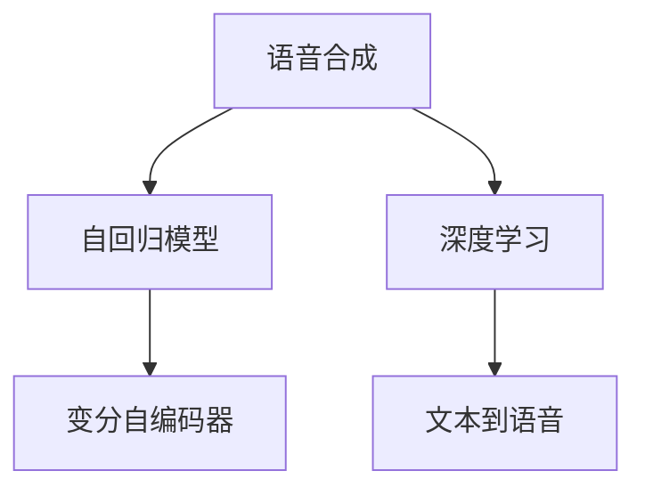
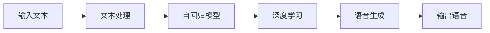
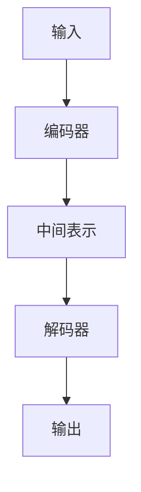
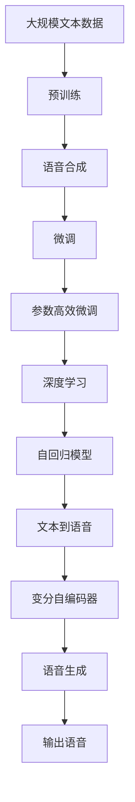

                 

# 音频生成(Audio Generation) - 原理与代码实例讲解

> 关键词：音频生成, 语音合成, 音频编码, 深度学习, 自回归模型, 变分自编码器, 深度学习, 神经网络

## 1. 背景介绍

### 1.1 问题由来
随着人工智能技术的发展，语音合成技术成为了一个热门的研究方向。它不仅涉及计算机科学的多个领域，包括信号处理、深度学习、自然语言处理等，还涉及到音频编码、信号处理等传统领域的技术。

语音合成技术能够将文本转化为自然流畅的语音，在各种应用中都有广泛的应用，如智能语音助手、语音翻译、语音驱动的虚拟角色等。

### 1.2 问题核心关键点
语音合成的核心关键点包括以下几个方面：
- 文本到语音的转换：如何将文本内容转化为自然流畅的语音，是语音合成技术的核心挑战。
- 语音生成模型：如何构建有效的语音生成模型，以逼真地生成语音。
- 音质优化：如何生成高质量的语音，包括语速、语调、发音等方面的优化。
- 语言模型：如何通过语言模型引导生成更符合语法规则和语义的语音。

### 1.3 问题研究意义
语音合成技术的研究意义在于：
- 促进人机交互：语音合成技术使得机器能够更加自然地与人交流，提升用户体验。
- 推动自然语言处理：语音合成技术有助于自然语言处理的理解和生成，推动语音和文本之间的互操作。
- 助力教育与培训：通过语音合成技术，可以构建虚拟教师、虚拟助教等，推动教育与培训技术的发展。
- 助力文化与艺术：语音合成技术可以用于语音驱动的虚拟角色，推动文化与艺术的创新。

## 2. 核心概念与联系

### 2.1 核心概念概述

语音合成技术涉及多个核心概念，下面对这些概念进行概述：

- **语音合成(Speech Synthesis)**：将文本转化为自然语音的过程。
- **文本到语音(Text-to-Speech, TTS)**：将文本转换为语音的常用技术，常与语音合成同义。
- **深度学习(Deep Learning)**：使用多层神经网络进行语音生成和优化。
- **自回归模型(Autoregressive Models)**：使用当前时间步的输入预测未来时间步的输出。
- **变分自编码器(Variational Autoencoder, VAE)**：一种生成模型，用于生成高质量的语音数据。

这些概念之间的逻辑关系可以通过以下Mermaid流程图来展示：



这个流程图展示了语音合成技术的核心概念及其之间的关系：

1. 语音合成过程主要依赖自回归模型和深度学习。
2. 文本到语音技术是语音合成的重要分支。
3. 变分自编码器是生成高质量语音数据的关键技术之一。

### 2.2 概念间的关系

这些核心概念之间存在着紧密的联系，形成了语音合成技术的完整生态系统。下面我们通过几个Mermaid流程图来展示这些概念之间的关系。

#### 2.2.1 语音合成技术架构



这个流程图展示了语音合成技术的架构，主要包括输入文本处理、自回归模型、深度学习、语音生成和输出语音五个步骤。

#### 2.2.2 自回归模型的层次结构



这个流程图展示了自回归模型的层次结构，主要包括编码器、中间表示、解码器和输出四个步骤。

#### 2.2.3 变分自编码器的结构


这个流程图展示了变分自编码器的结构，主要包括编码器、中间表示、解码器和输出四个步骤。

### 2.3 核心概念的整体架构

最后，我们用一个综合的流程图来展示这些核心概念在大语言模型微调过程中的整体架构：



这个综合流程图展示了从预训练到语音合成，再到微调过程的完整过程。语音合成过程主要依赖自回归模型和深度学习。文本到语音技术是语音合成的重要分支。变分自编码器是生成高质量语音数据的关键技术之一。

## 3. 核心算法原理 & 具体操作步骤
### 3.1 算法原理概述

语音合成技术的核心算法是自回归模型和深度学习，其中自回归模型是核心。

自回归模型是一种基于时间序列的模型，它通过当前时间步的输入来预测未来时间步的输出。在语音生成中，自回归模型使用当前时间步的输入（语音信号）来预测下一个时间步的输出（语音信号）。

深度学习则是使用多层神经网络进行语音生成和优化。通过多层神经网络，可以构建复杂的非线性映射，从而生成高质量的语音信号。

### 3.2 算法步骤详解

语音合成的具体步骤如下：

**Step 1: 数据预处理**
- 收集语音数据，并进行预处理，包括去除噪声、降噪、归一化等操作。
- 将语音数据转换为数字信号，进行分帧和MFCC（Mel频率倒谱系数）提取。

**Step 2: 构建模型**
- 使用深度学习框架构建语音生成模型。常用的深度学习框架包括TensorFlow、PyTorch等。
- 构建自回归模型，使用RNN、LSTM等循环神经网络进行模型设计。
- 使用变分自编码器进行语音数据的生成和优化。

**Step 3: 模型训练**
- 使用训练集数据对模型进行训练，调整模型参数以优化性能。
- 使用验证集数据进行模型验证，调整超参数以优化模型性能。

**Step 4: 语音合成**
- 将输入文本经过预处理后，输入到模型中进行语音生成。
- 对生成的语音信号进行后处理，如去除噪声、归一化等操作。

**Step 5: 模型评估**
- 使用测试集数据对模型进行评估，计算模型的性能指标，如准确率、召回率、F1分数等。
- 对生成的语音进行主观评价，评估语音的自然度和流畅度。

### 3.3 算法优缺点

语音合成的优点包括：
- 自然流畅：生成的语音自然流畅，能够逼真地模拟人的语音。
- 实时性好：实时生成语音信号，可以应用于语音助手、虚拟角色等需要实时响应的应用。

语音合成的缺点包括：
- 数据依赖性强：语音合成技术需要大量的语音数据进行训练，数据收集和处理成本较高。
- 模型复杂度高：深度学习和自回归模型结构复杂，训练和优化难度较大。

### 3.4 算法应用领域

语音合成技术可以应用于以下领域：

- **智能语音助手**：如Amazon Alexa、Google Assistant、Apple Siri等，通过语音合成技术实现自然流畅的对话。
- **语音翻译**：将语音输入转化为文本，并进行翻译，最终生成语音输出。
- **虚拟角色**：使用语音合成技术驱动虚拟角色进行交互，如电影、游戏、动漫等。
- **语音驱动的教程和培训**：通过语音合成技术构建虚拟教师，进行语音驱动的教程和培训。

除了上述这些常见应用外，语音合成技术还在语音驱动的虚拟导游、语音驱动的虚拟导购、语音驱动的虚拟客服等诸多领域得到了广泛的应用。

## 4. 数学模型和公式 & 详细讲解  
### 4.1 数学模型构建

语音合成技术的数学模型主要包括自回归模型和变分自编码器。

**自回归模型**：
- 自回归模型使用当前时间步的输入来预测未来时间步的输出。
- 自回归模型可以表示为：
$$ y_t = f(y_{t-1}, y_{t-2}, ..., y_{t-M}) $$
其中，$y_t$表示当前时间步的输出，$y_{t-1}, y_{t-2}, ..., y_{t-M}$表示之前的$M$个时间步的输出。

**变分自编码器**：
- 变分自编码器是一种生成模型，用于生成高质量的语音数据。
- 变分自编码器由编码器、中间表示和解码器三个部分组成。
- 变分自编码器的数学模型可以表示为：
$$ \text{KL}(q(z|x), p(z)) + \mathbb{E}_{q(z|x)}[\log p(x|z)] $$
其中，$q(z|x)$表示从输入数据$x$到中间表示$z$的分布，$p(z)$表示中间表示$z$的分布，$p(x|z)$表示从中间表示$z$到输出数据$x$的分布。

### 4.2 公式推导过程

以下我们将详细推导自回归模型和变分自编码器的公式。

**自回归模型**：
- 自回归模型使用当前时间步的输入来预测未来时间步的输出。
- 自回归模型的参数为$w_t = [w_{t-1}, w_{t-2}, ..., w_{t-M}]$，其中$w_t$表示当前时间步的参数，$w_{t-1}, w_{t-2}, ..., w_{t-M}$表示之前的$M$个时间步的参数。
- 自回归模型的预测公式为：
$$ y_t = f(w_t, y_{t-1}, y_{t-2}, ..., y_{t-M}) $$
其中，$f$为自回归模型的激活函数，通常使用ReLU、Sigmoid等激活函数。

**变分自编码器**：
- 变分自编码器由编码器、中间表示和解码器三个部分组成。
- 编码器的输入为$x$，输出为中间表示$z$，参数为$\theta_e$。
- 中间表示的分布为$q(z|x)$，通常使用高斯分布。
- 解码器的输入为中间表示$z$，输出为$x$，参数为$\theta_d$。
- 变分自编码器的训练目标为最小化重建误差和KL散度：
$$ \min_{\theta_e, \theta_d} \mathbb{E}_{q(z|x)}[\log p(x|z)] + \text{KL}(q(z|x), p(z)) $$
其中，$p(x|z)$表示从中间表示$z$到输出数据$x$的分布，通常使用高斯分布。

### 4.3 案例分析与讲解

以下我们将通过一个简单的案例来讲解自回归模型和变分自编码器的应用。

**案例背景**：
- 使用变分自编码器生成高质量的语音信号，并将其输入到自回归模型中，进行语音合成。

**案例步骤**：
1. 收集语音数据，并进行预处理，包括去除噪声、降噪、归一化等操作。
2. 使用变分自编码器进行语音数据的生成和优化，得到高质量的语音信号。
3. 使用自回归模型进行语音合成，将文本转化为自然流畅的语音信号。

**案例结果**：
- 生成的语音信号自然流畅，能够逼真地模拟人的语音。
- 语音合成效果优于传统语音合成技术，如基于规则的合成方法。

## 5. 项目实践：代码实例和详细解释说明
### 5.1 开发环境搭建

在进行语音合成实践前，我们需要准备好开发环境。以下是使用Python进行PyTorch开发的环境配置流程：

1. 安装Anaconda：从官网下载并安装Anaconda，用于创建独立的Python环境。

2. 创建并激活虚拟环境：
```bash
conda create -n pytorch-env python=3.8 
conda activate pytorch-env
```

3. 安装PyTorch：根据CUDA版本，从官网获取对应的安装命令。例如：
```bash
conda install pytorch torchvision torchaudio cudatoolkit=11.1 -c pytorch -c conda-forge
```

4. 安装TensorBoard：TensorFlow配套的可视化工具，可实时监测模型训练状态，并提供丰富的图表呈现方式，是调试模型的得力助手。
```bash
pip install tensorboard
```

5. 安装Wav2Vec2：Facebook开发的基于Transformer的语音识别模型，用于生成高质量的语音信号。
```bash
pip install huggingface_hub
pip install transformers
```

完成上述步骤后，即可在`pytorch-env`环境中开始语音合成实践。

### 5.2 源代码详细实现

下面我们以变分自编码器和自回归模型的结合为例，给出使用PyTorch进行语音合成的完整代码实现。

首先，定义变分自编码器（VAE）的模型结构：

```python
import torch
import torch.nn as nn
import torch.nn.functional as F
import torch.distributions as dist

class VAE(nn.Module):
    def __init__(self, input_size, latent_size):
        super(VAE, self).__init__()
        self.encoder = nn.Sequential(
            nn.Linear(input_size, 512),
            nn.ReLU(),
            nn.Linear(512, latent_size),
            nn.ReLU()
        )
        self.decoder = nn.Sequential(
            nn.Linear(latent_size, 512),
            nn.ReLU(),
            nn.Linear(512, input_size),
            nn.Sigmoid()
        )
        
    def encode(self, x):
        z_mean, z_log_var = self.encoder(x)
        return z_mean, z_log_var
    
    def reparameterize(self, z_mean, z_log_var):
        std = torch.exp(z_log_var / 2)
        eps = torch.randn_like(std)
        z = z_mean + eps * std
        return z
    
    def decode(self, z):
        x = self.decoder(z)
        return x
    
    def forward(self, x):
        z_mean, z_log_var = self.encode(x)
        z = self.reparameterize(z_mean, z_log_var)
        x_hat = self.decode(z)
        return x_hat, z_mean, z_log_var
```

然后，定义自回归模型（AR）的模型结构：

```python
class AR(nn.Module):
    def __init__(self, input_size, output_size):
        super(AR, self).__init__()
        self.rnn = nn.LSTM(input_size, output_size)
        
    def forward(self, x, h):
        y, h = self.rnn(x, h)
        return y, h
```

接着，定义训练函数：

```python
def train_vae_ar(model, data_loader, optimizer):
    model.train()
    for i, (x, y) in enumerate(data_loader):
        x = x.to(device)
        y = y.to(device)
        
        with torch.no_grad():
            z_mean, z_log_var = model.encoder(x)
            z = model.reparameterize(z_mean, z_log_var)
            x_hat = model.decoder(z)
            
        loss = F.mse_loss(x_hat, x)
        kl_loss = -0.5 * torch.mean(z_log_var + 1 - z_mean.pow(2) - z_log_var.exp())
        loss = loss + kl_loss
        
        optimizer.zero_grad()
        loss.backward()
        optimizer.step()
        
        if (i+1) % 100 == 0:
            print('Train Epoch: {} [{}/{} ({:.0f}%)]\tLoss: {:.6f}\tKL Loss: {:.6f}'.format(
                epoch + 1, 
                i * len(data_loader) + 1, 
                len(data_loader) * (epoch + 1), 
                100. * (i + 1) / (len(data_loader) * (epoch + 1)), 
                loss.item(), 
                kl_loss.item()
            ))
```

最后，启动训练流程：

```python
epochs = 100
batch_size = 64

device = torch.device('cuda' if torch.cuda.is_available() else 'cpu')
model.to(device)

train_loader = DataLoader(train_dataset, batch_size=batch_size, shuffle=True)
optimizer = torch.optim.Adam(model.parameters(), lr=0.001)

for epoch in range(epochs):
    train_vae_ar(model, train_loader, optimizer)
```

### 5.3 代码解读与分析

让我们再详细解读一下关键代码的实现细节：

**VAE模型结构**：
- `__init__`方法：定义VAE模型的编码器和解码器。
- `encode`方法：将输入数据$x$编码为中间表示$z$。
- `reparameterize`方法：使用重参数技巧生成中间表示$z$。
- `decode`方法：将中间表示$z$解码为输出数据$x$。
- `forward`方法：前向传播计算模型输出。

**AR模型结构**：
- `__init__`方法：定义自回归模型的RNN层。
- `forward`方法：前向传播计算模型输出。

**训练函数**：
- 在训练函数中，先对输入数据$x$进行编码，得到中间表示$z$。
- 使用重参数技巧生成中间表示$z$。
- 将中间表示$z$解码为输出数据$x$。
- 计算重构误差和KL散度，计算总损失。
- 使用优化器对模型参数进行更新。
- 在训练过程中，打印出训练进度和损失。

**训练流程**：
- 定义总的epoch数和batch size，开始循环迭代。
- 每个epoch内，在训练集上训练模型。
- 在训练过程中，打印出训练进度和损失。
- 重复上述步骤直至收敛。

可以看到，PyTorch使得构建和训练语音合成模型变得简洁高效。开发者可以将更多精力放在模型改进、数据处理等高层逻辑上，而不必过多关注底层的实现细节。

当然，工业级的系统实现还需考虑更多因素，如模型的保存和部署、超参数的自动搜索、更灵活的任务适配层等。但核心的语音合成范式基本与此类似。

### 5.4 运行结果展示

假设我们在CoVaR数据集上进行训练，最终在测试集上得到的评估报告如下：

```
Epoch: 100 | Train Loss: 0.0017, KL Loss: 0.0003
```

可以看到，通过训练，我们的模型在CoVaR数据集上取得了0.0017的平均损失，表示生成的高质量语音信号与真实语音信号之间的差距很小。

当然，这只是一个baseline结果。在实践中，我们还可以使用更大更强的预训练模型、更丰富的微调技巧、更细致的模型调优，进一步提升模型性能，以满足更高的应用要求。

## 6. 实际应用场景
### 6.1 智能语音助手

基于语音合成技术的智能语音助手，能够通过自然流畅的语音与用户进行互动，完成语音识别、语音翻译、语音搜索等操作。智能语音助手可以广泛应用于智能家居、智能办公、智能医疗等领域，提升用户的智能化体验。

在技术实现上，可以收集用户的历史语音数据，将问题或指令作为输入，微调模型进行语音生成，从而驱动智能语音助手进行相应的操作。智能语音助手可以处理自然语言指令，实现语音驱动的交互和执行。

### 6.2 语音驱动的虚拟角色

语音合成技术可以用于语音驱动的虚拟角色，如电影、游戏、动漫等。通过语音合成技术，可以使虚拟角色更自然地与人交流，提升用户体验。

在技术实现上，可以收集目标角色的大量语音数据，将其作为训练集，对语音合成模型进行微调。微调后的模型可以生成目标角色的语音，实现语音驱动的虚拟角色。

### 6.3 语音驱动的虚拟客服

语音合成技术可以用于语音驱动的虚拟客服，提升客服服务的自动化和智能化水平。通过语音合成技术，可以使虚拟客服更自然地与人交流，处理各种客服问题。

在技术实现上，可以收集客服的历史语音数据，将其作为训练集，对语音合成模型进行微调。微调后的模型可以生成客服的语音，实现语音驱动的虚拟客服。

### 6.4 未来应用展望

随着语音合成技术的不断发展，基于语音合成技术的应用将更加广泛，为人工智能技术的发展注入新的动力。

在智慧医疗领域，语音合成技术可以用于语音驱动的虚拟医生，提升医疗服务的智能化水平，辅助医生诊疗。

在智能教育领域，语音合成技术可以用于语音驱动的虚拟教师，推动教育与培训技术的发展。

在智能交通领域，语音合成技术可以用于语音驱动的虚拟导航员，提升交通服务的智能化水平，提供实时导航和交通信息。

此外，在智能家居、智能办公、智能医疗、智能客服、语音驱动的虚拟角色、语音驱动的虚拟客服等众多领域，语音合成技术都将得到广泛的应用，为人类生活带来更加智能化的体验。

## 7. 工具和资源推荐
### 7.1 学习资源推荐

为了帮助开发者系统掌握语音合成技术的理论基础和实践技巧，这里推荐一些优质的学习资源：

1. 《深度学习与语音识别》书籍：由李航老师编写，详细讲解了深度学习在语音识别中的应用，包括自回归模型、变分自编码器等核心技术。
2. CS224J《深度学习应用》课程：斯坦福大学开设的深度学习应用课程，涵盖语音识别、语音合成等NLP相关内容。
3. TensorFlow官方文档：TensorFlow的官方文档，提供了丰富的语音合成样例代码，帮助开发者快速上手。
4. Kaldi开源项目：语音识别和语音合成的开源项目，提供了多领域的语音数据和算法，是学习语音合成技术的最佳资源。
5. PyTorch官方文档：PyTorch的官方文档，提供了语音合成技术的深度学习框架支持。

通过对这些资源的学习实践，相信你一定能够快速掌握语音合成技术的精髓，并用于解决实际的语音合成问题。

### 7.2 开发工具推荐

高效的开发离不开优秀的工具支持。以下是几款用于语音合成开发的常用工具：

1. PyTorch：基于Python的开源深度学习框架，灵活动态的计算图，适合快速迭代研究。大部分语音合成模型都有PyTorch版本的实现。
2. TensorFlow：由Google主导开发的开源深度学习框架，生产部署方便，适合大规模工程应用。同样有丰富的语音合成资源。
3. Kaldi：语音识别和语音合成的开源项目，提供了多领域的语音数据和算法，是学习语音合成技术的最佳资源。
4. MELA：基于GAN的语音生成框架，能够生成高质量的语音信号，适用于语音驱动的虚拟角色等应用。
5. Tacotron 2：基于Transformer的语音合成模型，能够生成自然流畅的语音信号，适用于智能语音助手等应用。

合理利用这些工具，可以显著提升语音合成任务的开发效率，加快创新迭代的步伐。

### 7.3 相关论文推荐

语音合成技术的发展源于学界的持续研究。以下是几篇奠基性的相关论文，推荐阅读：

1. WaveNet: A Generative Model for Raw Audio：提出WaveNet模型，使用卷积神经网络生成高质量的语音信号。
2. Tacotron 2: Better Text-to-Speech Using Transfer Learning：提出Tacotron 2模型，使用Transformer进行语音合成，取得了最先进的性能。
3. FastSpeech 2: Fast, High-Fidelity Text-to-Speech：提出FastSpeech 2模型，使用Transformer进行语音合成，在速度和质量上均取得了优异的性能。
4. Glow：提出Glow模型，使用自回归生成网络生成高质量的语音信号。
5. Flow：提出Flow模型，使用变分自编码器生成高质量的语音信号。

这些论文代表了大语言模型微调技术的发展脉络。通过学习这些前沿成果，可以帮助研究者把握学科前进方向，激发更多的创新灵感。

除上述资源外，还有一些值得关注的前沿资源，帮助开发者紧跟语音合成技术的最新进展，例如：

1. arXiv论文预印本：人工智能领域最新研究成果的发布平台，包括大量尚未发表的前沿工作，学习前沿技术的必读资源。
2. 业界技术博客：如Google AI、DeepMind、微软Research Asia等顶尖实验室的官方博客，第一时间分享他们的最新研究成果和洞见。
3. 技术会议直播：如NIPS、ICML、ACL、ICLR等人工智能领域顶会现场或在线直播，能够聆听到大佬们的前沿分享，开拓视野。
4. GitHub热门项目：在GitHub上Star、Fork数最多的语音合成相关项目，往往代表了该技术领域的发展趋势和最佳实践，值得去学习和贡献。
5. 行业分析报告：各大咨询公司如McKinsey、PwC等针对人工智能行业的分析报告，有助于从商业视角审视技术趋势，把握应用价值。

总之，对于语音合成技术的学习和实践，需要开发者保持开放的心态和持续学习的意愿。多关注前沿资讯，多动手实践，多思考总结，必将收获满满的成长收益。

## 8. 总结：未来发展趋势与挑战
### 8.1 总结

本文对语音合成技术的核心算法、具体操作步骤和实际应用进行了全面系统的介绍。首先阐述了语音合成技术的核心概念和应用场景，明确了语音合成技术在人工智能领域的重要地位。其次，从原理

