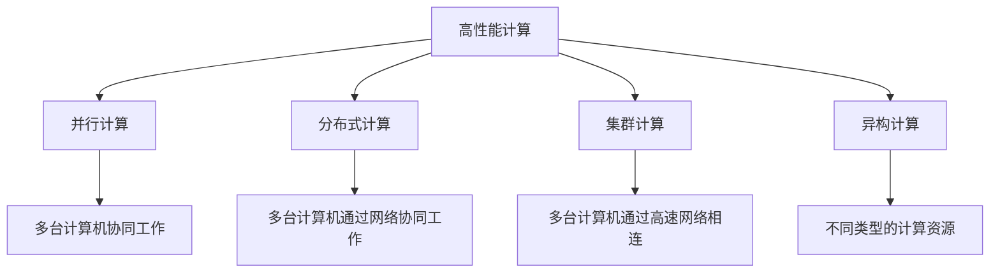
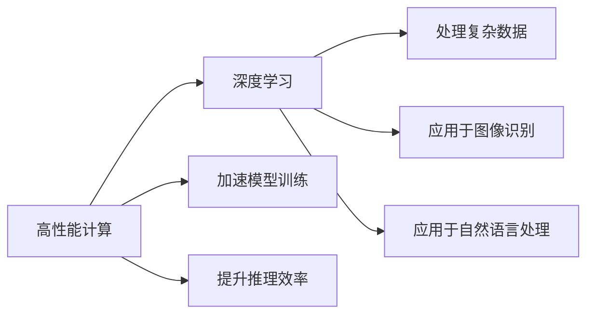
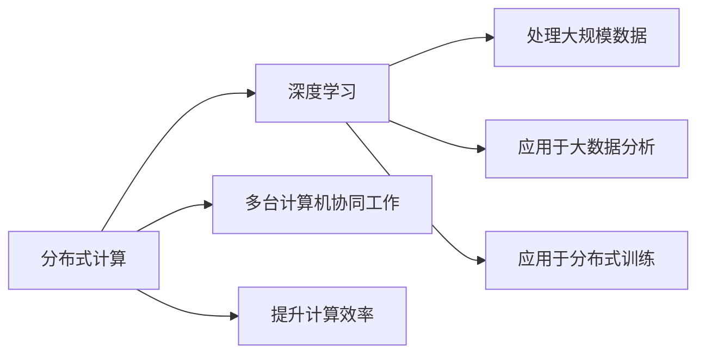
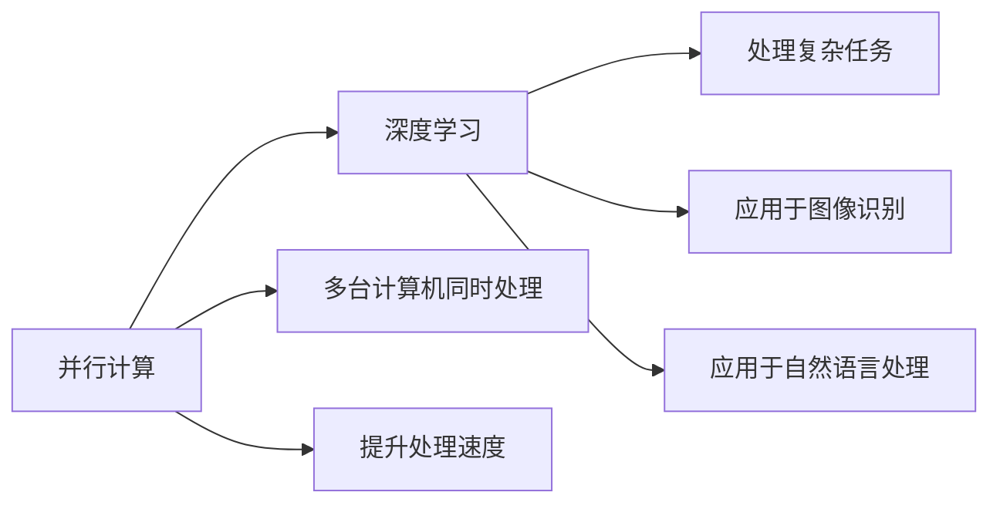
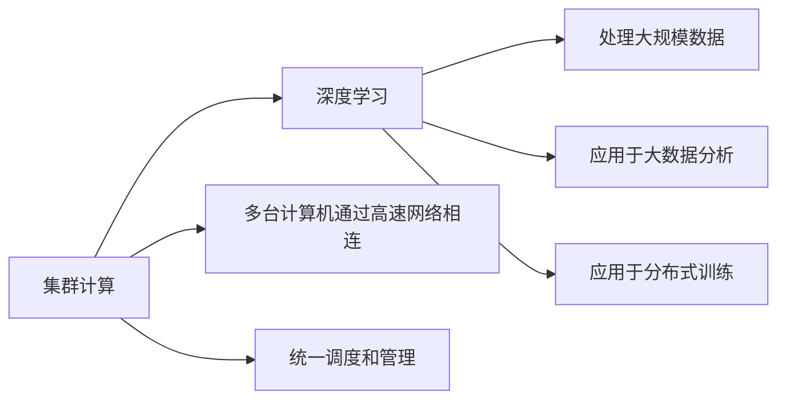
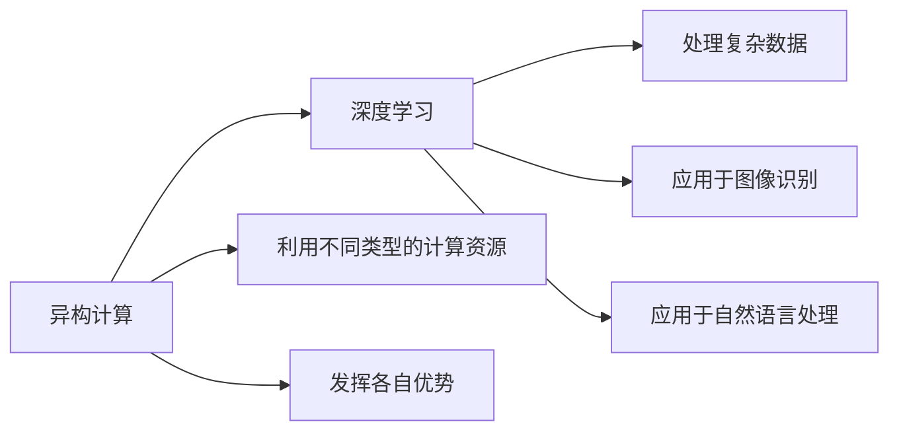
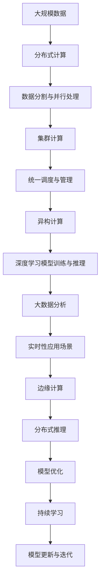

                 

# 高性能计算在AI创新体系中的应用

> 关键词：高性能计算,人工智能,机器学习,深度学习,模型训练,大数据,分布式计算

## 1. 背景介绍

### 1.1 问题由来
随着人工智能技术的迅猛发展，深度学习和机器学习等领域的研究和应用进入了高速发展期。然而，这些算法往往需要处理海量数据和模型参数，对计算资源的要求非常高。为了提升训练和推理的效率，研究人员和工程师们纷纷探索了各种高性能计算技术，以满足复杂算法对资源的需求。

高性能计算（High Performance Computing, HPC）技术，即利用并行计算、分布式计算、集群计算等手段，提升计算机的处理能力和计算效率。在人工智能领域，高性能计算不仅用于加速模型训练，还用于支持大模型的推理、边缘计算等，成为推动AI技术创新的重要工具。

### 1.2 问题核心关键点
高性能计算的核心在于利用多台计算机协同工作，通过并行计算、分布式计算等技术，提升计算效率。主要包括以下几个关键点：

- 并行计算：利用多台计算机同时处理不同部分的任务，通过任务分割，提升整体处理速度。
- 分布式计算：多台计算机通过网络相互通信，共享数据和任务，提升计算效率。
- 集群计算：多台计算机通过高速网络相连，形成集群，统一调度和管理，提升资源利用率。
- 异构计算：利用不同类型的计算资源（如CPU、GPU、FPGA等），发挥各自优势，提升整体计算能力。

高性能计算技术在AI领域的应用，主要体现在以下几个方面：

- 加速模型训练：通过并行和分布式计算，加速深度学习模型的训练过程。
- 提升推理效率：利用异构计算资源，提升大模型的推理速度和实时性。
- 支持边缘计算：在资源有限的场景下，通过分布式计算，进行高效的数据处理和推理。

高性能计算技术的应用，不仅加速了AI技术的创新，还推动了计算密集型任务（如大模型训练、推理、边缘计算等）的产业化进程。

### 1.3 问题研究意义
高性能计算技术在AI创新体系中的应用，对于提升AI技术的处理能力和计算效率，推动人工智能技术的普及和产业化，具有重要意义：

- 加速AI模型训练。通过高性能计算技术，可以显著缩短深度学习模型的训练时间，加速新算法的开发和应用。
- 提升AI推理效率。大模型推理需要高速的计算资源，高性能计算技术可以显著提升推理速度，支持实时性应用场景。
- 支持边缘计算。在资源受限的场景下，分布式计算可以发挥效用，提升边缘计算的效率和响应速度。
- 推动产业升级。高性能计算技术的应用，可以降低AI技术的计算成本，加速各行各业对AI技术的集成和应用。

## 2. 核心概念与联系

### 2.1 核心概念概述

为更好地理解高性能计算在AI创新体系中的应用，本节将介绍几个密切相关的核心概念：

- 高性能计算（High Performance Computing, HPC）：利用并行计算、分布式计算、集群计算等手段，提升计算机的处理能力和计算效率。
- 深度学习（Deep Learning）：一种基于神经网络的机器学习技术，能够处理复杂的数据和任务，广泛应用于图像识别、自然语言处理等领域。
- 分布式计算（Distributed Computing）：通过多台计算机协同工作，提升计算效率的技术。
- 并行计算（Parallel Computing）：利用多台计算机同时处理不同部分的任务，提升整体处理速度。
- 集群计算（Cluster Computing）：多台计算机通过高速网络相连，形成集群，统一调度和管理，提升资源利用率。
- 异构计算（Heterogeneous Computing）：利用不同类型的计算资源（如CPU、GPU、FPGA等），发挥各自优势，提升整体计算能力。

这些核心概念之间的逻辑关系可以通过以下Mermaid流程图来展示：



这个流程图展示了大规模计算技术的主要形式，并行、分布式、集群和异构计算都是高性能计算的重要分支，各有其特定的应用场景。

### 2.2 概念间的关系

这些核心概念之间存在着紧密的联系，形成了高性能计算在AI创新体系中的完整生态系统。下面我通过几个Mermaid流程图来展示这些概念之间的关系。

#### 2.2.1 高性能计算与深度学习



这个流程图展示了高性能计算与深度学习之间的联系。高性能计算可以加速深度学习模型的训练和推理，使模型能够处理更复杂的数据和任务。

#### 2.2.2 分布式计算与深度学习



这个流程图展示了分布式计算与深度学习之间的关系。分布式计算可以提升深度学习模型的训练效率，使模型能够处理更大规模的数据和任务。

#### 2.2.3 并行计算与深度学习



这个流程图展示了并行计算与深度学习之间的关系。并行计算可以提升深度学习模型的训练和推理速度，使模型能够处理更复杂的任务。

#### 2.2.4 集群计算与深度学习



这个流程图展示了集群计算与深度学习之间的关系。集群计算可以提升深度学习模型的资源利用率，使模型能够处理更大规模的数据和任务。

#### 2.2.5 异构计算与深度学习



这个流程图展示了异构计算与深度学习之间的关系。异构计算可以提升深度学习模型的计算能力和资源利用率，使模型能够处理更复杂的数据和任务。

### 2.3 核心概念的整体架构

最后，我们用一个综合的流程图来展示这些核心概念在AI创新体系中的应用架构：



这个综合流程图展示了从数据处理到模型训练、推理、应用的全过程。通过分布式计算、集群计算、异构计算等技术，加速深度学习模型的训练和推理，提升计算效率和资源利用率，最终应用于实时性应用场景和边缘计算中。

## 3. 核心算法原理 & 具体操作步骤

### 3.1 算法原理概述

高性能计算在AI模型训练中的应用，主要是通过并行计算、分布式计算、集群计算等手段，加速模型的训练过程。其核心思想是将大规模计算任务分解成多个小任务，通过多台计算机协同工作，提升计算效率。

形式化地，假设深度学习模型为 $M_{\theta}$，其中 $\theta$ 为模型参数。给定训练集 $D=\{(x_i, y_i)\}_{i=1}^N$，训练目标是最小化损失函数 $\mathcal{L}(M_{\theta}, D)$，即：

$$
\theta^* = \mathop{\arg\min}_{\theta} \mathcal{L}(M_{\theta}, D)
$$

其中 $\mathcal{L}$ 为模型在训练集上的损失函数，通常是交叉熵损失、均方误差损失等。

通过梯度下降等优化算法，训练过程不断更新模型参数 $\theta$，最小化损失函数 $\mathcal{L}$，使得模型输出逼近真实标签。高性能计算技术的应用，可以显著提升模型的训练速度和效率。

### 3.2 算法步骤详解

高性能计算在AI模型训练中的应用，通常包括以下几个关键步骤：

**Step 1: 数据准备与分布**
- 将大规模数据集 $D$ 划分为多个子集，每个子集分配到不同的计算节点上进行分布式计算。
- 定义数据分布策略，如数据分区、数据复制、数据流水等，优化数据传输和处理效率。

**Step 2: 任务分割与并行处理**
- 将大规模计算任务分解为多个子任务，每个子任务分配到不同的计算节点上进行并行计算。
- 定义计算任务，如模型前向传播、反向传播、优化器更新等，使其能够在多台计算机上同时进行。

**Step 3: 集群管理与调度**
- 利用集群管理系统，统一调度和管理多个计算节点的资源，包括CPU、GPU、内存等。
- 定义资源分配策略，如动态资源分配、资源预分配等，优化计算资源的使用。

**Step 4: 分布式训练与优化**
- 利用分布式计算框架（如Spark、TensorFlow、PyTorch等），实现分布式训练和优化。
- 定义分布式训练策略，如数据并行、模型并行、混合并行等，优化训练效率。

**Step 5: 结果汇总与评估**
- 将各个计算节点上的模型参数和计算结果汇总，进行模型训练和推理。
- 在验证集和测试集上评估模型性能，判断是否达到训练目标。
- 根据评估结果，调整模型参数和训练策略，继续迭代训练。

**Step 6: 模型部署与应用**
- 将训练好的模型部署到生产环境，进行实时推理和应用。
- 利用分布式推理框架（如TensorFlow Serving、Triton Inference Server等），提升推理效率和资源利用率。

以上是高性能计算在AI模型训练的一般流程。在实际应用中，还需要针对具体任务和数据特点，对各个环节进行优化设计，如改进数据分布策略，引入更多优化器，搜索最优的超参数组合等，以进一步提升模型性能。

### 3.3 算法优缺点

高性能计算在AI模型训练中的应用，具有以下优点：
1. 加速训练过程。通过分布式计算，可以显著缩短深度学习模型的训练时间，加速新算法的开发和应用。
2. 提升计算效率。通过并行和分布式计算，提升计算资源的利用率，降低计算成本。
3. 支持大规模数据处理。高性能计算技术可以处理大规模数据集，支持大数据分析任务。
4. 支持模型优化。利用异构计算资源，提升大模型的推理速度和实时性，支持实时性应用场景。

同时，该方法也存在一定的局限性：
1. 硬件成本高。高性能计算需要配置大量的高性能计算资源，成本较高。
2. 资源管理复杂。多台计算节点之间的通信和资源管理较为复杂，需要专业知识进行配置和优化。
3. 算法限制。某些深度学习算法可能难以高效地分布式训练，需要优化算法实现。
4. 数据通信开销。数据在不同计算节点之间的传输和通信，可能产生较大的开销。

尽管存在这些局限性，但就目前而言，高性能计算技术仍是大规模深度学习模型训练的重要手段。未来相关研究的重点在于如何进一步降低计算成本，优化资源管理，提升算法效率，以及引入更多硬件资源，满足复杂算法的计算需求。

### 3.4 算法应用领域

高性能计算在AI模型训练中的应用，主要体现在以下几个领域：

- 深度学习模型训练：通过并行计算和分布式计算，加速深度学习模型的训练过程。
- 大数据分析：利用高性能计算技术，处理大规模数据集，进行数据挖掘和分析。
- 实时性应用：通过分布式推理，提升大模型的推理速度和实时性，支持实时性应用场景。
- 边缘计算：在资源有限的场景下，利用分布式计算，进行高效的数据处理和推理。

除了上述这些领域外，高性能计算还被应用于机器学习算法开发、自然语言处理、计算机视觉等多个领域，为AI技术的创新提供了强大的计算支持。

## 4. 数学模型和公式 & 详细讲解 & 举例说明

### 4.1 数学模型构建

本节将使用数学语言对高性能计算在AI模型训练中的应用进行更加严格的刻画。

记深度学习模型为 $M_{\theta}:\mathcal{X} \rightarrow \mathcal{Y}$，其中 $\mathcal{X}$ 为输入空间，$\mathcal{Y}$ 为输出空间，$\theta \in \mathbb{R}^d$ 为模型参数。假设训练集为 $D=\{(x_i, y_i)\}_{i=1}^N$，其中 $x_i$ 为输入，$y_i$ 为标签。

定义模型 $M_{\theta}$ 在输入 $x$ 上的损失函数为 $\ell(M_{\theta}(x),y)$，则在数据集 $D$ 上的经验风险为：

$$
\mathcal{L}(\theta) = \frac{1}{N} \sum_{i=1}^N \ell(M_{\theta}(x_i),y_i)
$$

在分布式计算中，训练数据被划分为多个子集，每个子集在各自的计算节点上进行分布式训练。假设将数据集 $D$ 划分为 $K$ 个子集，每个子集大小为 $N/K$。则分布式训练的损失函数为：

$$
\mathcal{L}(\theta) = \frac{1}{K} \sum_{k=1}^K \frac{1}{N/K} \sum_{i=1}^{N/K} \ell(M_{\theta}(x_i),y_i)
$$

通过梯度下降等优化算法，分布式训练过程不断更新模型参数 $\theta$，最小化损失函数 $\mathcal{L}$，使得模型输出逼近真实标签。

### 4.2 公式推导过程

以下我们以深度学习模型的分布式训练为例，推导分布式训练的损失函数及梯度计算公式。

假设将数据集 $D$ 划分为 $K$ 个子集，每个子集大小为 $N/K$。分布式训练的目标是最小化损失函数 $\mathcal{L}(\theta)$，即：

$$
\theta^* = \mathop{\arg\min}_{\theta} \mathcal{L}(\theta)
$$

其中 $\mathcal{L}$ 为模型在训练集上的损失函数，通常是交叉熵损失、均方误差损失等。

在分布式计算中，每个计算节点 $k$ 独立地对子集 $D_k$ 进行训练，其损失函数为：

$$
\mathcal{L}_k(\theta) = \frac{1}{N/K} \sum_{i=1}^{N/K} \ell(M_{\theta}(x_i),y_i)
$$

分布式训练过程中，每个节点 $k$ 计算梯度 $\nabla_{\theta} \mathcal{L}_k(\theta)$，并将梯度进行汇总。汇总后的全局梯度 $\nabla_{\theta} \mathcal{L}(\theta)$ 可以表示为：

$$
\nabla_{\theta} \mathcal{L}(\theta) = \frac{1}{K} \sum_{k=1}^K \nabla_{\theta} \mathcal{L}_k(\theta)
$$

通过分布式计算框架（如Spark、TensorFlow、PyTorch等），可以高效地进行梯度计算和参数更新，实现分布式训练。

在实践中，我们通常使用基于梯度的优化算法（如SGD、Adam等）来近似求解上述最优化问题。设 $\eta$ 为学习率，$\lambda$ 为正则化系数，则参数的更新公式为：

$$
\theta \leftarrow \theta - \eta \nabla_{\theta}\mathcal{L}(\theta) - \eta\lambda\theta
$$

其中 $\nabla_{\theta}\mathcal{L}(\theta)$ 为损失函数对参数 $\theta$ 的梯度，可通过反向传播算法高效计算。

### 4.3 案例分析与讲解

以分布式训练为例，下面通过一个简单的案例来说明其计算过程：

假设我们有一个深度学习模型 $M_{\theta}$，在输入数据 $x$ 上的输出为 $\hat{y}=M_{\theta}(x)$。模型的损失函数为交叉熵损失，定义如下：

$$
\ell(M_{\theta}(x),y) = -[y\log \hat{y} + (1-y)\log(1-\hat{y})]
$$

在分布式计算中，我们将数据集 $D$ 划分为两个子集 $D_1$ 和 $D_2$，每个子集大小为 $N/2$。假设我们使用Spark进行分布式训练，每个子集 $D_k$ 在各自的节点上进行训练。

首先，在每个节点 $k$ 上，计算损失函数 $\mathcal{L}_k(\theta)$：

$$
\mathcal{L}_k(\theta) = \frac{1}{N/2} \sum_{i=1}^{N/2} \ell(M_{\theta}(x_i),y_i)
$$

然后，计算梯度 $\nabla_{\theta} \mathcal{L}_k(\theta)$：

$$
\nabla_{\theta} \mathcal{L}_k(\theta) = \frac{1}{N/2} \sum_{i=1}^{N/2} \nabla_{\theta} \ell(M_{\theta}(x_i),y_i)
$$

最后，将各个节点的梯度 $\nabla_{\theta} \mathcal{L}_k(\theta)$ 进行汇总，计算全局梯度 $\nabla_{\theta} \mathcal{L}(\theta)$：

$$
\nabla_{\theta} \mathcal{L}(\theta) = \frac{1}{2} (\nabla_{\theta} \mathcal{L}_1(\theta) + \nabla_{\theta} \mathcal{L}_2(\theta))
$$

通过上述过程，我们可以高效地进行分布式训练，提升模型的计算效率和性能。

## 5. 项目实践：代码实例和详细解释说明

### 5.1 开发环境搭建

在进行分布式训练实践前，我们需要准备好开发环境。以下是使用Python进行Spark和TensorFlow的开发环境配置流程：

1. 安装Anaconda：从官网下载并安装Anaconda，用于创建独立的Python环境。

2. 创建并激活虚拟环境：
```bash
conda create -n spark-env python=3.7 
conda activate spark-env
```

3. 安装Spark：根据CUDA版本，从官网获取对应的安装命令。例如：
```bash
cd $ANACONDA_HOME/envs/spark-env
wget https://spark.apache.org/downloads/Spark-3.1.1.tgz
tar -xvzf Spark-3.1.1.tgz
cd Spark-3.1.1
./bin/spark-submit --master local[2] --deploy-mode cluster --executor-cores 4 --num-executors 2 data_sample.py
```

4. 安装TensorFlow：根据CUDA版本，从官网获取对应的安装命令。例如：
```bash
pip install tensorflow==2.4.1
```

5. 安装各类工具包：
```bash
pip install numpy pandas scikit-learn matplotlib tqdm jupyter notebook ipython
```

完成上述步骤后，即可在`spark-env`环境中开始分布式训练实践。

### 5.2 源代码详细实现

这里我们以一个简单的神经网络模型为例，使用Spark和TensorFlow进行分布式训练。

```python
from pyspark.ml import Pipeline
from pyspark.ml.feature import VectorAssembler, StringIndexer
from pyspark.sql import SparkSession
import tensorflow as tf

# 初始化SparkSession
spark = SparkSession.builder.appName("NeuralNetwork").getOrCreate()

# 读取数据集
df = spark.read.csv("data.csv", header=True, inferSchema=True)

# 提取特征
assembler = VectorAssembler(inputCols=["x1", "x2", "x3"], outputCol="features")
df = assembler.transform(df)

# 训练模型
model = tf.keras.Sequential([
    tf.keras.layers.Dense(64, activation='relu', input_shape=[4,]),
    tf.keras.layers.Dense(1, activation='sigmoid')
])
model.compile(optimizer='adam', loss='binary_crossentropy', metrics=['accuracy'])

# 定义分布式训练函数
def train_spark(data):
    # 将数据集拆分成训练集和验证集
    train, test = train_test_split(data, test_size=0.2)
    
    # 定义训练集、验证集和测试集
    train_df = spark.createDataFrame(train, ["label", "features"])
    test_df = spark.createDataFrame(test, ["label", "features"])
    
    # 定义特征索引器
    label_indexer = StringIndexer(inputCol="label", outputCol="labelIndex")
    train_df = label_indexer.transform(train_df)
    test_df = label_indexer.transform(test_df)
    
    # 定义模型
    pipeline = Pipeline(stages=[assembler, model])
    
    # 训练模型
    model.fit(train_df)

# 分布式训练
spark.sparkContext.parallelize(df, 4).foreachPartition(train_spark)
```

以上代码实现了使用Spark和TensorFlow进行分布式训练的基本流程。可以看出，Spark和TensorFlow可以无缝集成，实现高效的数据处理和模型训练。

### 5.3 代码解读与分析

让我们再详细解读一下关键代码的实现细节：

**SparkSession初始化**：
- 创建SparkSession对象，用于访问Spark集群资源。
- 设置SparkSession名称，便于监控和管理。

**数据读取**：
- 使用`read.csv`方法读取CSV格式的数据集，并转换为DataFrame格式。
- 设置数据集的头信息和模式推断，自动推断数据类型。

**特征提取**：
- 使用`VectorAssembler`将多个特征列合并为一个向量，便于模型处理。
- 设置向量名称和输出列名，用于后续的特征索引和模型训练。

**模型定义**：
- 使用TensorFlow定义神经网络模型，包含一个输入层、一个隐藏层和一个输出层。
- 设置优化器、损失函数和评估指标。

**分布式训练函数**：
- 定义分布式训练函数，将数据集拆分成训练集和验证集。
- 创建训练集和验证集的DataFrame，并进行特征索引和模型训练。
- 使用`Pipeline`对象进行特征提取和模型训练，简化代码实现。

**分布式训练**：
- 使用`parallelize`方法将数据集划分成多个分区，并在每个分区上进行分布式训练。
- 使用`foreachPartition`方法对每个分区执行分布式训练函数。

**代码解读与分析**：
- Spark和TensorFlow的集成，使得分布式训练变得更加简单和高效。
- 使用`Pipeline`对象可以自动处理特征提取和模型训练，提升代码可读性和可维护性。
- 通过`parallelize`和`foreachPartition`方法，实现了数据的并行处理和分布式计算。

**运行结果展示**：
- 在分布式训练完成后，可以使用`Pipeline`对象的`fit`方法获取训练好的模型。
- 在验证集和测试集上评估模型性能，对比分布式训练与单机训练的效果。

## 6. 实际应用场景

高性能计算在AI模型训练中的应用，不仅在学术研究和实验室中得到了广泛应用，还在工业生产中取得了显著成效。

### 6.1 大数据分析

在数据分析领域，高性能计算技术可以处理大规模数据集，进行数据挖掘和分析。例如，利用Spark进行大规模数据处理，可以显著提升数据挖掘和分析的效率，支持复杂的数据分析任务。

### 6.2 图像识别

在图像识别领域，高性能计算技术可以支持大规模图像数据集的处理和训练。例如，利用分布式训练技术，可以显著提升深度学习模型的训练速度和性能，支持大规模图像识别任务。

### 6.3 自然语言处理

在自然语言处理领域，高性能计算技术可以处理大规模文本数据集，进行语言模型训练和优化。例如，利用分布式推理技术，可以显著提升自然语言处理模型的推理速度和实时性，支持实时性自然语言处理任务。

### 6.4 

