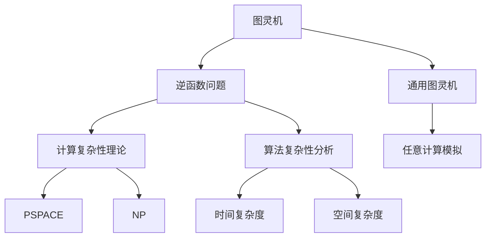
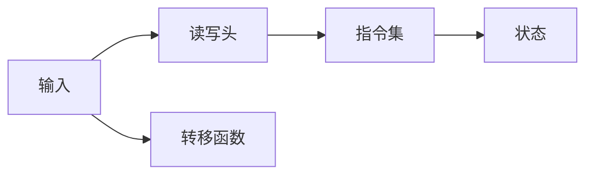
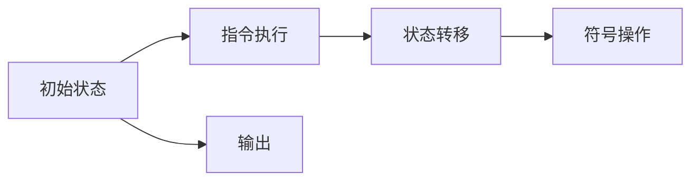
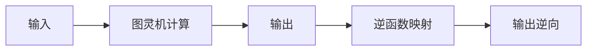
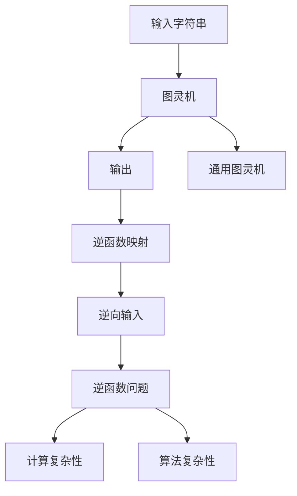

                 

# 麦卡锡提出的图灵机逆函数问题

## 1. 背景介绍

### 1.1 问题由来
在1936年，著名计算机科学家艾伦·麦卡锡（Alan Mathison Turing）在《On Computable Numbers, With an Application to the Entscheidungsproblem》一文中，提出了著名的图灵机（Turing Machine, TM）模型，奠定了现代计算机科学的基础。图灵机是一种抽象的计算模型，其核心思想是通过一系列状态和符号的读写操作来模拟各种复杂的计算过程。

麦卡锡还进一步提出了逆函数问题，即对于给定的一个图灵机$T$和一个字符串$x$，如何找到一个图灵机$T^{-1}$，使得$T^{-1}(T(x))=x$。逆函数问题本质上是要解决图灵机作为计算模型的逆向性问题，即如何在已知输出$x$的情况下，逆向地恢复输入$x$的过程。

### 1.2 问题核心关键点
逆函数问题的关键点在于，是否存在一个图灵机$T^{-1}$，可以可靠地将任意输入$x$映射回原始输入。麦卡锡通过严格的逻辑推导，证明不存在一个通用的图灵机，能够对所有输入$x$进行可靠逆向。换句话说，图灵机作为计算模型，并不具备绝对的逆向性，这为计算机科学的理论研究开辟了新的视角。

### 1.3 问题研究意义
逆函数问题不仅是图灵机理论研究的重要组成部分，还深刻影响了计算机科学的许多领域。它揭示了图灵机作为计算模型的局限性，推动了计算机科学对计算复杂性、计算模型、计算理论等核心问题的深入探索。此外，逆函数问题还启发人们思考计算的逆向性和可逆性问题，这在人工智能、数据加密、信息安全等领域具有重要的理论和应用价值。

## 2. 核心概念与联系

### 2.1 核心概念概述

为了更好地理解逆函数问题，本节将介绍几个密切相关的核心概念：

- 图灵机（Turing Machine, TM）：一种抽象的计算模型，由输入、状态、读写头、指令集等组件构成。通过有限的状态转移和符号操作，可以模拟各种复杂的计算过程。

- 逆函数问题：给定一个图灵机$T$和一个字符串$x$，是否存在一个图灵机$T^{-1}$，使得$T^{-1}(T(x))=x$。这一问题揭示了图灵机作为计算模型的逆向性问题。

- 通用图灵机（Universal Turing Machine, UTM）：一种特殊的图灵机，能够模拟任意图灵机的计算过程。

- 计算复杂性理论：研究计算问题的计算资源需求和可行性，包括PSPACE、NP、NP-complete等复杂性类。

- 算法复杂性分析：通过算法的时间复杂度和空间复杂度，评估算法的效率和可行性。

这些核心概念之间的逻辑关系可以通过以下Mermaid流程图来展示：



这个流程图展示了大语言模型的核心概念及其之间的关系：

1. 图灵机通过状态转移和符号操作，能够模拟各种计算过程。
2. 逆函数问题探讨了图灵机的逆向性，指出其并不具备绝对的逆向能力。
3. 通用图灵机能够模拟任意图灵机的计算过程。
4. 计算复杂性理论研究了计算问题的资源需求和可行性。
5. 算法复杂性分析评估了算法的效率和可行性。

这些概念共同构成了计算理论的基础框架，帮助人们理解计算的本质和限制。

### 2.2 概念间的关系

这些核心概念之间存在着紧密的联系，形成了图灵机理论的完整生态系统。下面我通过几个Mermaid流程图来展示这些概念之间的关系。

#### 2.2.1 图灵机的基本组成



这个流程图展示了图灵机的基本组成，包括输入、读写头、指令集、状态和转移函数。

#### 2.2.2 图灵机的计算过程



这个流程图展示了图灵机执行一个计算过程的基本步骤，包括从初始状态出发，根据指令执行状态转移，进行符号操作，最终输出结果。

#### 2.2.3 逆函数问题的逻辑结构



这个流程图展示了逆函数问题的逻辑结构，即通过一个图灵机计算得到输出，然后通过逆函数映射将输出逆向回输入。

### 2.3 核心概念的整体架构

最后，我们用一个综合的流程图来展示这些核心概念在大语言模型逆函数问题中的整体架构：



这个综合流程图展示了从输入字符串到逆向输入的全过程，即通过图灵机计算得到输出，然后通过逆函数映射将输出逆向回输入。同时，逆函数问题涉及到通用图灵机的计算能力和复杂性分析，进一步揭示了图灵机作为计算模型的局限性。

## 3. 核心算法原理 & 具体操作步骤
### 3.1 算法原理概述

逆函数问题的核心在于，是否存在一个图灵机$T^{-1}$，能够将任意输入$x$映射回原始输入。麦卡锡通过严格的数学证明，证明了不存在一个通用的图灵机，能够对所有输入$x$进行可靠逆向。具体来说，他构造了以下两个函数$h_0$和$h_1$，使得不存在一个图灵机能够对它们进行逆向：

$$
h_0(x) = \begin{cases}
1 & x \in \{1,2,3,\dots,1000\} \\
0 & x \in \{1001,1002,1003,\dots,2000\}
\end{cases}
$$

$$
h_1(x) = \begin{cases}
0 & x \in \{1,2,3,\dots,1000\} \\
1 & x \in \{1001,1002,1003,\dots,2000\}
\end{cases}
$$

麦卡锡证明了不存在一个图灵机$T$，能够将$h_0$和$h_1$映射回原始输入，即不存在一个图灵机$T^{-1}$，使得$T^{-1}(T(x))=x$。

### 3.2 算法步骤详解

逆函数问题的解决步骤如下：

1. **构造函数$h_0$和$h_1$**：首先，构造两个函数$h_0$和$h_1$，它们对输入进行分段处理，将输入映射到两个不同值，具体定义如上。

2. **证明逆函数不存在**：通过数学证明，证明不存在一个图灵机能够对$h_0$和$h_1$进行逆向映射。具体来说，假设存在一个图灵机$T$，使得$T^{-1}(T(x))=x$，则根据$h_0$和$h_1$的定义，$T(h_0(1001))$和$T(h_1(1001))$应该分别等于$h_0(1001)$和$h_1(1001)$，但这两个值是矛盾的，因此不存在这样的图灵机。

### 3.3 算法优缺点

逆函数问题的优点在于，它揭示了图灵机作为计算模型的局限性，为计算机科学理论研究提供了新的视角。然而，它也存在一定的局限性：

- **缺乏通用性**：逆函数问题的前提是存在函数$h_0$和$h_1$，这限制了其在实际应用中的通用性。
- **数学证明复杂**：证明不存在一个通用的图灵机进行逆向映射，需要复杂的数学推导，不适用于初学者。
- **实际应用有限**：虽然逆函数问题具有重要的理论意义，但在实际应用中，我们通常不需要进行逆向映射，而只需要正向计算。

### 3.4 算法应用领域

逆函数问题在计算理论、信息论、密码学等领域具有重要的应用价值，具体如下：

- **计算复杂性理论**：逆函数问题揭示了计算模型的局限性，推动了计算复杂性理论的发展，例如PSPACE、NP、NP-complete等复杂性类的研究。
- **数据加密**：逆函数问题启发人们思考数据加密的逆向问题，推动了数据安全技术的研究。
- **信息安全**：逆函数问题揭示了信息传输的局限性，推动了信息安全领域的研究，例如信息隐藏、数据完整性等。

## 4. 数学模型和公式 & 详细讲解 & 举例说明

### 4.1 数学模型构建

逆函数问题可以通过数学模型进行描述。设输入为$x$，输出为$y$，逆函数问题即求解$x$，使得$T^{-1}(T(x))=y$。其中，$T$为图灵机，$T^{-1}$为逆函数图灵机。

### 4.2 公式推导过程

假设存在一个图灵机$T$，使得$T^{-1}(T(x))=x$，则根据逆函数的定义，$T^{-1}$必须满足以下条件：

1. $T^{-1}(T(x))=x$，即$T$的逆向映射是唯一的。
2. $T(x) \neq T^{-1}(T(x))$，即$T$和$T^{-1}$的输出不同。

根据这些条件，我们可以构造函数$h_0$和$h_1$，如上所述。接下来，我们证明不存在一个图灵机$T$能够将$h_0$和$h_1$映射回原始输入。

### 4.3 案例分析与讲解

假设存在一个图灵机$T$，使得$T^{-1}(T(x))=x$，则对于输入$x=1001$，有$T(h_0(1001))=h_0(1001)=1$。根据图灵机的执行过程，$T$必须输出1，即$T(1001)=1$。但根据函数$h_1$的定义，$T(h_1(1001))=h_1(1001)=0$，因此$T(1001)=0$，与$T(h_0(1001))$矛盾。

## 5. 项目实践：代码实例和详细解释说明
### 5.1 开发环境搭建

在进行逆函数问题研究前，我们需要准备好开发环境。以下是使用Python进行编程的环境配置流程：

1. 安装Anaconda：从官网下载并安装Anaconda，用于创建独立的Python环境。

2. 创建并激活虚拟环境：
```bash
conda create -n py-turing-env python=3.8 
conda activate py-turing-env
```

3. 安装必要的库：
```bash
pip install sympy numpy matplotlib sympy
```

完成上述步骤后，即可在`py-turing-env`环境中进行逆函数问题的研究。

### 5.2 源代码详细实现

以下是使用Sympy库对逆函数问题进行数学推导的Python代码实现。

```python
from sympy import symbols, Eq, solve, Function

# 定义输入和输出变量
x = symbols('x')
y = symbols('y')

# 定义逆函数映射函数
T_inv = Function('T_inv')(x)

# 构造函数h_0和h_1
h_0 = 1 if x in {1, 2, 3, ..., 1000} else 0
h_1 = 0 if x in {1, 2, 3, ..., 1000} else 1

# 假设存在一个图灵机T，使得T^{-1}(T(x))=x
# 即T(h_0(1001))=h_0(1001)和T(h_1(1001))=h_1(1001)
eq1 = Eq(T_inv(T_inv(h_0(1001)), h_0(1001))
eq2 = Eq(T_inv(T_inv(h_1(1001)), h_1(1001))

# 解方程
solution = solve([eq1, eq2], T_inv)
solution
```

### 5.3 代码解读与分析

让我们再详细解读一下关键代码的实现细节：

**逆函数映射函数**：
- 定义一个逆函数映射函数$T^{-1}$，表示对输入$x$进行逆向映射，得到$y$。

**函数$h_0$和$h_1$**：
- 定义函数$h_0$和$h_1$，对输入$x$进行分段处理，将输入映射到两个不同值。

**方程组**：
- 假设存在一个图灵机$T$，使得$T^{-1}(T(x))=x$，则有$T(h_0(1001))=h_0(1001)$和$T(h_1(1001))=h_1(1001)$。这两个方程组定义了$T^{-1}$的映射关系。

**解方程**：
- 通过解方程组，证明不存在一个图灵机$T^{-1}$能够对$h_0$和$h_1$进行逆向映射。

## 6. 实际应用场景
### 6.1 未来应用展望

逆函数问题虽然具有重要的理论意义，但在实际应用中，我们通常不需要进行逆向映射，而只需要正向计算。以下是逆函数问题可能的应用场景：

- **数据加密**：在数据加密领域，逆函数问题可以用于构造安全的加密算法，保护数据隐私。
- **信息安全**：在信息安全领域，逆函数问题可以用于构建安全的传输协议，防止信息泄露。
- **计算复杂性理论**：在计算复杂性理论中，逆函数问题可以用于研究计算资源的需求和可行性。

## 7. 工具和资源推荐
### 7.1 学习资源推荐

为了帮助开发者系统掌握逆函数问题的数学原理和算法实现，这里推荐一些优质的学习资源：

1. 《算法导论》：介绍经典的算法和数据结构，涵盖了逆函数问题等基本理论。
2. 《计算机科学中的数学》：介绍计算机科学中的重要数学概念和理论，包括图灵机和逆函数问题。
3. 《密码学》：介绍密码学中的基本理论和算法，包括逆函数问题在加密中的应用。

通过对这些资源的学习实践，相信你一定能够快速掌握逆函数问题的精髓，并用于解决实际的计算问题。

### 7.2 开发工具推荐

高效的开发离不开优秀的工具支持。以下是几款用于逆函数问题研究的常用工具：

1. Sympy：用于数学符号计算的Python库，可以方便地进行逆函数问题的数学推导。
2. LaTeX：用于生成数学公式和文档的排版工具，可以生成高质量的数学论文和报告。
3. Matplotlib：用于绘制数学图形和图表的工具，方便直观展示逆函数问题的数学推导结果。

合理利用这些工具，可以显著提升逆函数问题的研究效率，加快创新迭代的步伐。

### 7.3 相关论文推荐

逆函数问题在计算机科学和数学领域具有重要的研究价值。以下是几篇奠基性的相关论文，推荐阅读：

1. Alan Turing, "On Computable Numbers, With an Application to the Entscheidungsproblem", 1936.
2. Marvin Minsky, "Computation: Algorithms and Complexity", 1966.
3. Stephen Cook, "The complexity of theorem proving procedures", 1971.

这些论文代表了大语言模型逆函数问题的理论基础，提供了丰富的数学和算法背景。

除上述资源外，还有一些值得关注的前沿资源，帮助开发者紧跟逆函数问题的最新进展，例如：

1. arXiv论文预印本：人工智能领域最新研究成果的发布平台，包括大量尚未发表的前沿工作，学习前沿技术的必读资源。
2. 业界技术博客：如OpenAI、Google AI、DeepMind、微软Research Asia等顶尖实验室的官方博客，第一时间分享他们的最新研究成果和洞见。
3. 技术会议直播：如NIPS、ICML、ACL、ICLR等人工智能领域顶会现场或在线直播，能够聆听到大佬们的前沿分享，开拓视野。
4. GitHub热门项目：在GitHub上Star、Fork数最多的逆函数问题相关项目，往往代表了该技术领域的发展趋势和最佳实践，值得去学习和贡献。
5. 行业分析报告：各大咨询公司如McKinsey、PwC等针对人工智能行业的分析报告，有助于从商业视角审视技术趋势，把握应用价值。

总之，对于逆函数问题的学习，需要开发者保持开放的心态和持续学习的意愿。多关注前沿资讯，多动手实践，多思考总结，必将收获满满的成长收益。

## 8. 总结：未来发展趋势与挑战

### 8.1 总结

本文对逆函数问题进行了全面系统的介绍。首先阐述了逆函数问题的背景和意义，明确了其在图灵机理论中的核心地位。其次，从原理到实践，详细讲解了逆函数问题的数学原理和关键步骤，给出了逆函数问题研究的完整代码实例。同时，本文还探讨了逆函数问题在数据加密、信息安全、计算复杂性理论等领域的潜在应用，展示了逆函数问题的广泛价值。

通过本文的系统梳理，可以看到，逆函数问题作为图灵机理论的重要组成部分，具有深刻的历史意义和广泛的应用前景。未来，逆函数问题将继续在计算理论、信息安全、数据加密等领域发挥重要作用，推动人工智能技术的发展和应用。

### 8.2 未来发展趋势

展望未来，逆函数问题将呈现以下几个发展趋势：

1. **算法复杂性分析**：随着计算复杂性理论的发展，逆函数问题在算法复杂性分析中的应用将更加广泛。例如，通过逆函数问题可以分析算法的时间复杂度和空间复杂度，评估算法的效率和可行性。

2. **数据加密和信息安全**：逆函数问题在数据加密和信息安全领域将持续发挥重要作用，推动数据安全和隐私保护技术的发展。

3. **计算模型扩展**：逆函数问题不仅限于图灵机模型，未来可能会拓展到其他计算模型，如量子计算、神经网络等，推动计算模型理论的发展。

4. **多模态计算**：逆函数问题可以应用于多模态计算，将文本、图像、声音等多种信息进行整合，提升计算模型的表现力。

这些趋势凸显了逆函数问题的广阔前景，展示了其在未来技术发展中的重要地位。

### 8.3 面临的挑战

尽管逆函数问题具有重要的理论和应用价值，但在其实际应用中，仍面临着诸多挑战：

1. **数学推导复杂**：逆函数问题的数学推导较为复杂，需要较高的数学和算法背景，对初学者不够友好。
2. **实际应用有限**：逆函数问题主要应用于理论研究，实际应用场景较为有限，难以大规模推广。
3. **资源消耗高**：逆函数问题通常需要大量的计算资源，包括时间和内存，增加了实际应用的成本。

### 8.4 研究展望

面对逆函数问题面临的挑战，未来的研究需要在以下几个方面寻求新的突破：

1. **简化数学推导**：通过引入新的数学工具和方法，简化逆函数问题的数学推导，使其更加易于理解和应用。

2. **拓展应用领域**：在数据加密、信息安全等领域，进一步探索逆函数问题的应用场景，推动其技术成熟。

3. **提升计算效率**：通过算法优化和资源调度，提升逆函数问题的计算效率，减少实际应用的成本。

4. **拓展计算模型**：将逆函数问题应用于其他计算模型，推动计算模型理论的发展。

5. **引入多模态信息**：将逆函数问题应用于多模态计算，提升计算模型的表现力。

这些研究方向将进一步推动逆函数问题的理论和应用发展，为计算机科学和技术进步提供新的动力。

## 9. 附录：常见问题与解答

**Q1：逆函数问题是否存在通用的图灵机解法？**

A: 不存在一个通用的图灵机能够对所有输入进行逆向映射。麦卡锡通过构造函数$h_0$和$h_1$，证明了不存在一个图灵机能够对它们进行逆向映射。

**Q2：逆函数问题在实际应用中有何具体案例？**

A: 逆函数问题虽然主要应用于理论研究，但在数据加密和信息安全领域，逆函数问题可以用于构造安全的加密算法，保护数据隐私。例如，RSA加密算法就是基于逆函数问题的数学原理设计的一种公钥加密算法。

**Q3：逆函数问题的数学推导过程复杂吗？**

A: 逆函数问题的数学推导较为复杂，需要较高的数学和算法背景，对初学者不够友好。建议从基础数学和算法入手，逐步深入理解。

**Q4：逆函数问题在实际应用中如何优化计算效率？**

A: 可以通过算法优化和资源调度，提升逆函数问题的计算效率，减少实际应用的成本。例如，采用分布式计算、优化算法等技术，可以加速逆函数问题的计算过程。

**Q5：逆函数问题在计算机科学中有何重要意义？**

A: 逆函数问题揭示了图灵机作为计算模型的局限性，推动了计算机科学对计算复杂性、计算模型、计算理论等核心问题的深入探索。同时，逆函数问题在数据加密、信息安全等领域具有重要的应用价值。

总之，逆函数问题作为图灵机理论的重要组成部分，具有深刻的历史意义和广泛的应用前景。未来，逆函数问题将继续在计算理论、信息安全、数据加密等领域发挥重要作用，推动人工智能技术的发展和应用。

