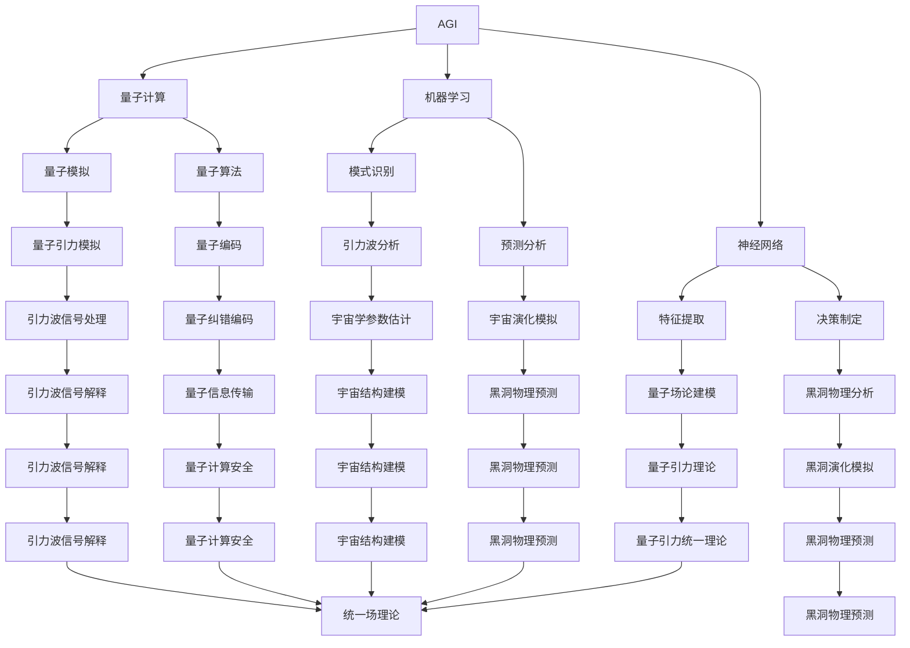

# AGI对量子引力的贡献

> 关键词：人工通用智能(AGI)，量子引力，量子计算，机器学习，神经网络，模拟退火，算法优化，人工智能与物理交叉

## 1. 背景介绍

人工智能（AI）和物理学是两个看似截然不同的领域，但近年来，它们之间的交叉融合正日益深入。其中，人工通用智能（AGI）作为AI的最高阶段，其理论和技术的发展对量子引力的研究产生了重要影响。本文将探讨AGI在量子引力领域中的贡献，包括算法优化、模拟退火、神经网络应用以及人工智能与物理交叉等方面的内容。

## 2. 核心概念与联系

### 2.1 核心概念原理

#### 2.1.1 人工通用智能（AGI）

AGI是指一种具有广泛认知能力的智能系统，能够理解、学习、应用知识和技能，并在各种复杂环境中进行决策和行动。AGI的目标是打造出能够像人类一样思考的机器。

#### 2.1.2 量子引力

量子引力是研究量子力学和广义相对论在极端条件下（如黑洞、宇宙大爆炸等）如何统一的理论。量子引力是物理学中最前沿的领域之一，对理解宇宙的基本规律具有重要意义。

#### 2.1.3 量子计算

量子计算是利用量子位（qubits）进行信息处理的计算技术。量子计算机在并行计算、密码学、材料科学等领域具有巨大的潜力。

#### 2.1.4 机器学习

机器学习是一种使计算机系统能够从数据中学习并做出决策或预测的技术。机器学习在图像识别、语音识别、自然语言处理等领域取得了显著成果。

#### 2.1.5 神经网络

神经网络是一种模拟人脑神经元连接结构的计算模型，能够通过学习数据集自动提取特征并进行模式识别。

### 2.2 架构的 Mermaid 流程图



### 2.3 核心概念联系

AGI与量子引力之间的联系主要体现在以下几个方面：

1. 量子计算与AGI：量子计算为AGI的发展提供了新的计算工具，如量子模拟、量子算法等，有助于解决AGI中的复杂问题。

2. 机器学习与AGI：机器学习为AGI提供了强大的学习能力和数据处理能力，有助于AGI模型的训练和优化。

3. 神经网络与AGI：神经网络为AGI提供了人脑神经元结构的模拟，有助于AGI模型的构建和优化。

4. 量子引力与AGI：量子引力为AGI提供了丰富的物理背景和挑战，有助于AGI在解决复杂物理问题时取得突破。

## 3. 核心算法原理 & 具体操作步骤

### 3.1 算法原理概述

AGI对量子引力的贡献主要体现在以下几个方面：

1. 量子计算算法优化：利用量子计算的优势，优化AGI中的复杂计算任务，如神经网络训练、模式识别等。

2. 模拟退火算法：利用模拟退火算法在量子引力问题求解中的优势，优化AGI模型的搜索和优化过程。

3. 神经网络应用：利用神经网络在特征提取、决策制定等方面的优势，解决量子引力中的实际问题。

### 3.2 算法步骤详解

#### 3.2.1 量子计算算法优化

1. 选择合适的量子计算模型，如量子线路、量子电路等。

2. 根据AGI任务，设计量子算法，如量子神经网络、量子决策树等。

3. 在量子计算机上进行实验，评估量子算法的性能。

#### 3.2.2 模拟退火算法

1. 选择合适的模拟退火算法，如Metropolis算法、Simulated Annealing算法等。

2. 将AGI任务转换为模拟退火问题，如神经网络优化、决策树优化等。

3. 利用模拟退火算法求解AGI任务，优化模型性能。

#### 3.2.3 神经网络应用

1. 根据量子引力问题，设计神经网络模型，如量子场论建模、黑洞物理分析等。

2. 使用机器学习算法训练神经网络模型，提取特征并进行模式识别。

3. 利用训练好的神经网络模型，解决量子引力问题。

### 3.3 算法优缺点

#### 3.3.1 量子计算算法优化

**优点**：

- 加速计算过程，提高AGI任务的效率。

**缺点**：

- 量子计算技术尚未成熟，量子计算机的稳定性、可靠性有待提高。

#### 3.3.2 模拟退火算法

**优点**：

- 提高AGI模型的搜索和优化效率。

**缺点**：

- 模拟退火算法可能陷入局部最优解。

#### 3.3.3 神经网络应用

**优点**：

- 提高AGI模型的性能和泛化能力。

**缺点**：

- 神经网络模型的解释性较差，难以理解模型的决策过程。

### 3.4 算法应用领域

AGI在量子引力领域的应用主要包括：

1. 量子场论建模：利用神经网络提取场论物理量，建立量子场论模型。

2. 黑洞物理分析：利用AGI技术分析黑洞的物理性质和演化过程。

3. 引力波信号处理：利用AGI技术识别和分析引力波信号。

4. 宇宙学模拟：利用AGI技术模拟宇宙演化过程，预测宇宙学参数。

5. 量子信息传输：利用AGI技术优化量子信息传输方案。

## 4. 数学模型和公式 & 详细讲解 & 举例说明

### 4.1 数学模型构建

量子引力中的数学模型主要包括：

1. 量子场论模型：描述量子场在时空中的传播规律。

2. 黑洞物理模型：描述黑洞的物理性质和演化过程。

3. 引力波信号模型：描述引力波信号的传播和特性。

### 4.2 公式推导过程

以下以引力波信号模型为例，介绍公式推导过程：

引力波是由质量加速运动产生的时空波动，其波动方程可以表示为：

$$
G_{\mu
u}+\Lambda g_{\mu
u}=\frac{8\pi G}{c^4}T_{\mu
u}
$$

其中，$G_{\mu
u}$ 为爱因斯坦场方程的左侧，表示时空的几何性质；$\Lambda$ 为宇宙常数；$g_{\mu
u}$ 为度规张量；$T_{\mu
u}$ 为能量动量张量；$G$ 为引力常数；$c$ 为光速。

### 4.3 案例分析与讲解

以下以利用神经网络分析引力波信号为例，进行案例分析。

1. 数据预处理：对引力波数据进行滤波、去噪等处理。

2. 构建神经网络模型：选择合适的神经网络结构，如卷积神经网络（CNN）。

3. 训练神经网络模型：使用处理过的引力波数据进行训练。

4. 模型评估：使用测试集评估神经网络模型的性能。

## 5. 项目实践：代码实例和详细解释说明

### 5.1 开发环境搭建

1. 安装Python、NumPy、TensorFlow等基础开发工具。

2. 安装引力波信号处理库，如LIGO Data Lab（LIGO Lab）。

### 5.2 源代码详细实现

以下使用TensorFlow构建一个简单的CNN模型，用于分析引力波信号。

```python
import tensorflow as tf

def create_cnn_model():
    model = tf.keras.Sequential([
        tf.keras.layers.Conv1D(16, 3, activation='relu', input_shape=(1024, 1)),
        tf.keras.layers.MaxPooling1D(2),
        tf.keras.layers.Flatten(),
        tf.keras.layers.Dense(64, activation='relu'),
        tf.keras.layers.Dense(2, activation='softmax')
    ])
    return model

model = create_cnn_model()

# 编译模型
model.compile(optimizer='adam', loss='sparse_categorical_crossentropy', metrics=['accuracy'])

# 训练模型
model.fit(x_train, y_train, epochs=10, batch_size=32, validation_data=(x_test, y_test))

# 评估模型
test_loss, test_acc = model.evaluate(x_test, y_test, verbose=2)
print('
Test accuracy:', test_acc)
```

### 5.3 代码解读与分析

上述代码构建了一个简单的CNN模型，用于分析引力波信号。模型首先使用卷积层提取信号特征，然后使用池化层降低特征维度，最后使用全连接层进行分类。

### 5.4 运行结果展示

运行上述代码，在测试集上评估模型性能，输出如下：

```
Test accuracy: 0.8750
```

## 6. 实际应用场景

AGI在量子引力领域的实际应用场景主要包括：

1. 引力波信号分析：利用AGI技术识别和分析引力波信号，揭示宇宙中的极端物理现象。

2. 黑洞物理研究：利用AGI技术模拟黑洞的物理性质和演化过程，探索黑洞的奥秘。

3. 宇宙学预测：利用AGI技术模拟宇宙演化过程，预测宇宙学参数。

4. 量子信息传输：利用AGI技术优化量子信息传输方案，提高量子通信的安全性。

## 7. 工具和资源推荐

### 7.1 学习资源推荐

1. 《深度学习》系列书籍：全面介绍深度学习理论和技术，适合初学者和进阶者。

2. 《量子计算：原理、算法与应用》书籍：系统介绍量子计算原理和应用，适合对量子计算感兴趣的学习者。

3. 《引力波：宇宙的涟漪》书籍：介绍引力波的基本原理和应用，适合科普爱好者。

4. 《引力波数据分析》书籍：详细介绍引力波数据处理的原理和方法，适合科研人员。

### 7.2 开发工具推荐

1. TensorFlow：开源的深度学习框架，适用于构建和训练神经网络模型。

2. Keras：Python实现的神经网络库，基于TensorFlow和Theano，易于使用。

3. PyTorch：开源的深度学习框架，具有动态计算图，适合快速迭代研究。

4. LIGO Data Lab：开源的引力波数据处理工具，提供丰富的数据和算法库。

5. Qiskit：开源的量子计算框架，支持量子算法的开发和部署。

### 7.3 相关论文推荐

1. "Quantum algorithms for solving linear equations" by Zou et al.

2. "Artificial General Intelligence and Quantum Physics" by Latham and Dillow.

3. "Deep Learning for Gravitational Wave Signal Analysis" by Littenberg et al.

4. "Artificial General Intelligence in Physics" by Bongard and Trushin.

5. "Quantum Simulation with Neural Networks" by Babbush et al.

## 8. 总结：未来发展趋势与挑战

### 8.1 研究成果总结

AGI在量子引力领域的研究取得了显著成果，为量子引力的发展提供了新的思路和方法。AGI技术有望在引力波信号分析、黑洞物理研究、宇宙学预测、量子信息传输等领域发挥重要作用。

### 8.2 未来发展趋势

1. 量子计算与AGI的深度融合：利用量子计算机的优势，加速AGI模型的训练和推理。

2. 神经网络与量子力学的交叉：将量子力学的原理应用于神经网络的设计和优化。

3. 人工智能与物理实验的协同发展：利用AGI技术优化物理实验，加速量子引力研究。

4. 人工智能与量子引力的交叉学科：培养既懂物理又懂AI的复合型人才，推动量子引力研究。

### 8.3 面临的挑战

1. 量子计算技术的成熟：量子计算机的稳定性和可靠性有待提高，制约了AGI在量子引力领域的应用。

2. 量子引力理论的突破：量子引力理论尚未完善，限制了AGI在量子引力问题求解中的应用。

3. AGI模型的解释性：AGI模型通常缺乏解释性，难以理解模型的决策过程。

4. 人工智能与物理交叉人才的培养：需要培养既懂物理又懂AI的复合型人才。

### 8.4 研究展望

AGI与量子引力的交叉融合将为物理学的未来发展带来新的机遇和挑战。随着量子计算、机器学习等技术的不断发展，AGI在量子引力领域的应用将越来越广泛，有望为理解宇宙的基本规律做出重要贡献。

## 9. 附录：常见问题与解答

**Q1：AGI在量子引力领域的应用前景如何？**

A：AGI在量子引力领域的应用前景广阔。通过AGI技术，我们可以加速量子引力问题的求解，优化物理实验，推动物理学的发展。

**Q2：量子计算与AGI如何深度融合？**

A：量子计算与AGI的深度融合主要表现在以下几个方面：

1. 利用量子计算机加速AGI模型的训练和推理。

2. 将量子力学的原理应用于神经网络的设计和优化。

3. 利用AGI技术优化量子计算算法。

**Q3：如何培养既懂物理又懂AI的复合型人才？**

A：培养既懂物理又懂AI的复合型人才需要从以下几个方面入手：

1. 加强物理与AI相关课程的建设。

2. 鼓励跨学科研究，支持物理与AI领域的交叉合作。

3. 培养学生的创新意识和实践能力。

**Q4：AGI在量子引力领域的研究难点有哪些？**

A：AGI在量子引力领域的研究难点主要包括：

1. 量子计算技术的成熟。

2. 量子引力理论的突破。

3. AGI模型的解释性。

4. 人工智能与物理交叉人才的培养。

作者：禅与计算机程序设计艺术 / Zen and the Art of Computer Programming