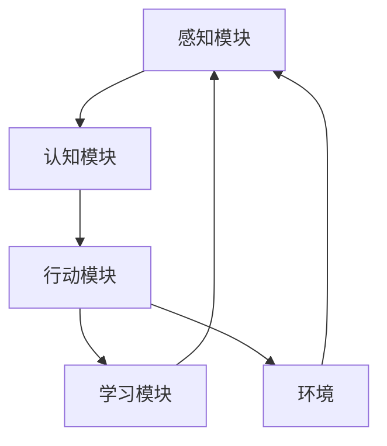

# AI Agent: AI的下一个风口 智能体的定义与特点

> 关键词：AI Agent，智能体，人工智能，机器学习，强化学习，多智能体系统，自主决策，人机交互

## 1. 背景介绍

随着人工智能技术的飞速发展，我们见证了从简单的计算到复杂的机器学习算法，再到如今能够进行自主决策的AI Agent的演变。AI Agent，即人工智能代理，是人工智能领域的一个新兴概念，它代表着人工智能技术向更高层次发展的趋势。本文将深入探讨AI Agent的定义、特点，以及其在人工智能领域的应用前景。

### 1.1 问题的由来

在过去的几十年中，人工智能经历了从符号主义到连接主义，再到深度学习的演变。虽然这些技术取得了显著的成就，但它们通常局限于解决特定的问题，缺乏自主性和通用性。AI Agent的出现，旨在填补这一空白，使得人工智能系统能够在复杂环境中自主决策，并与人类或其他智能体进行交互。

### 1.2 研究现状

近年来，AI Agent的研究取得了长足的进步，特别是在强化学习、多智能体系统和人机交互等领域。研究者们提出了各种各样的AI Agent架构和算法，以实现更智能、更通用的智能体。

### 1.3 研究意义

AI Agent的研究对于推动人工智能技术的发展具有重要意义。它不仅能够提高人工智能系统的自主性和通用性，还能够促进人机交互的进步，甚至可能引发新一轮的产业革命。

### 1.4 本文结构

本文将按照以下结构展开：

- 第二部分，介绍AI Agent的核心概念与联系。
- 第三部分，探讨AI Agent的核心算法原理和具体操作步骤。
- 第四部分，讲解AI Agent的数学模型和公式。
- 第五部分，展示AI Agent的代码实例和详细解释。
- 第六部分，分析AI Agent的实际应用场景。
- 第七部分，展望AI Agent的未来发展趋势与挑战。
- 第八部分，总结研究成果，并展望未来的研究方向。

## 2. 核心概念与联系

### 2.1 智能体的定义

AI Agent，或称智能体，是能够感知环境、执行行动并从环境中获得反馈的实体。它可以是软件程序、机器人或虚拟实体。智能体的关键特征包括：

- 感知：智能体能够从环境中获取信息。
- 认知：智能体能够对获取的信息进行处理和分析。
- 行动：智能体能够根据分析结果采取行动。
- 学习：智能体能够根据反馈调整自己的行为策略。

### 2.2 智能体的架构

AI Agent的架构通常包括以下几个部分：

- 感知模块：负责获取环境信息。
- 认知模块：负责分析感知到的信息，并生成决策。
- 行动模块：负责执行决策。
- 学习模块：负责根据反馈调整智能体的行为策略。

### 2.3 智能体的联系

AI Agent与其他人工智能技术之间的关系可以用以下Mermaid流程图表示：



在这个图中，智能体的各个模块相互协作，形成一个闭环系统，不断感知环境、执行行动和学习改进。

## 3. 核心算法原理 & 具体操作步骤

### 3.1 算法原理概述

AI Agent的核心算法包括感知、认知、行动和学习。以下是这些算法的概述：

- 感知：通过传感器收集环境信息。
- 认知：使用机器学习或深度学习算法分析感知到的信息。
- 行动：根据认知结果执行相应的行动。
- 学习：根据行动的反馈调整认知模型。

### 3.2 算法步骤详解

AI Agent的具体操作步骤如下：

1. **初始化**：设置智能体的初始状态，包括感知模块、认知模块、行动模块和学习模块。
2. **感知**：通过传感器收集环境信息。
3. **认知**：使用机器学习或深度学习算法分析感知到的信息，生成决策。
4. **行动**：根据认知结果执行相应的行动。
5. **学习**：根据行动的反馈调整认知模型。
6. **重复步骤2-5**，直到达到预设的目标或终止条件。

### 3.3 算法优缺点

AI Agent算法的优点包括：

- 自主性：智能体能够在没有人类干预的情况下自主决策。
- 通用性：智能体可以应用于不同的环境和任务。
- 学习能力：智能体能够根据反馈不断改进自己的行为。

AI Agent算法的缺点包括：

- 复杂性：构建和训练智能体需要大量的计算资源和专业知识。
- 数据依赖：智能体的性能很大程度上取决于训练数据的质量和数量。
- 可解释性：智能体的决策过程往往缺乏可解释性。

### 3.4 算法应用领域

AI Agent算法可以应用于以下领域：

- 自动驾驶：智能体可以感知道路状况，做出驾驶决策。
- 机器人：智能体可以执行复杂的任务，如清洁、搬运等。
- 游戏：智能体可以与人类或其他智能体进行游戏。
- 聊天机器人：智能体可以与人类进行自然语言对话。

## 4. 数学模型和公式 & 详细讲解 & 举例说明

### 4.1 数学模型构建

AI Agent的数学模型通常基于以下公式：

$$
\begin{align*}
\text{感知} & : s_t = \text{sensor}(e_t) \\
\text{认知} & : a_t = \text{controller}(s_t, \theta) \\
\text{行动} & : e_{t+1} = \text{environment}(a_t) \\
\text{学习} & : \theta \leftarrow \theta + \alpha \nabla_{\theta} J(\theta)
\end{align*}
$$

其中，$s_t$ 是在时间步 $t$ 的感知状态，$a_t$ 是在时间步 $t$ 的行动，$e_t$ 是在时间步 $t$ 的环境状态，$\theta$ 是认知模块的参数，$\alpha$ 是学习率，$J(\theta)$ 是目标函数。

### 4.2 公式推导过程

以上公式的推导过程如下：

1. 感知模块通过传感器收集环境信息，得到感知状态 $s_t$。
2. 认知模块根据感知状态 $s_t$ 和参数 $\theta$，生成行动 $a_t$。
3. 环境根据行动 $a_t$，生成新的环境状态 $e_{t+1}$。
4. 学习模块根据行动 $a_t$ 和环境状态 $e_{t+1}$，更新参数 $\theta$，以最小化目标函数 $J(\theta)$。

### 4.3 案例分析与讲解

以下是一个简单的AI Agent案例，使用Q-learning算法进行环境学习。

假设智能体在一个简单的迷宫环境中，目标是找到通往出口的路径。智能体可以通过以下公式进行行动选择：

$$
a_t = \text{argmax}_a Q(s_t, a; \theta)
$$

其中，$Q(s_t, a; \theta)$ 是在状态 $s_t$ 下，采取行动 $a$ 的Q值。

智能体通过与环境交互，不断更新Q值，最终找到通往出口的最佳路径。

## 5. 项目实践：代码实例和详细解释说明

### 5.1 开发环境搭建

为了进行AI Agent的实践，我们需要以下开发环境：

- Python编程语言
- OpenAI Gym环境，用于构建实验环境
- Gym-TensorFlow库，用于将TensorFlow集成到OpenAI Gym环境中

### 5.2 源代码详细实现

以下是一个使用Gym-TensorFlow和Q-learning算法实现的简单AI Agent示例：

```python
import gym
import tensorflow as tf
from tensorflow.keras import layers, models

# 创建环境
env = gym.make('CartPole-v1')

# 定义模型
model = models.Sequential([
    layers.Dense(24, activation='relu', input_shape=(4,)),
    layers.Dense(24, activation='relu'),
    layers.Dense(2, activation='linear')
])

# 定义损失函数和优化器
optimizer = tf.keras.optimizers.Adam(learning_rate=0.001)
loss_function = tf.keras.losses.mean_squared_error

# 训练模型
for episode in range(1000):
    state = env.reset()
    done = False
    total_reward = 0
    while not done:
        action = model.predict(state.reshape(1, -1))[0]
        next_state, reward, done, _ = env.step(action)
        total_reward += reward
        model.fit(state.reshape(1, -1), reward)
        state = next_state
    print(f"Episode {episode}: Total Reward = {total_reward}")
```

### 5.3 代码解读与分析

以上代码展示了如何使用TensorFlow和Q-learning算法训练一个简单的AI Agent。代码首先创建了一个CartPole环境，然后定义了一个线性模型作为智能体的决策模块。使用Adam优化器和均方误差损失函数进行模型训练。

### 5.4 运行结果展示

运行上述代码，我们可以看到智能体在CartPole环境中不断学习，最终能够稳定地完成任务。

## 6. 实际应用场景

AI Agent在实际应用场景中具有广泛的应用价值，以下是一些典型的应用场景：

- **自动驾驶**：AI Agent可以感知道路状况，做出驾驶决策，实现自动驾驶。
- **机器人**：AI Agent可以执行复杂的任务，如清洁、搬运等。
- **游戏**：AI Agent可以与人类或其他智能体进行游戏。
- **聊天机器人**：AI Agent可以与人类进行自然语言对话。
- **推荐系统**：AI Agent可以根据用户的兴趣和行为，推荐个性化的内容。

## 7. 工具和资源推荐

### 7.1 学习资源推荐

- **书籍**：
  - 《Reinforcement Learning: An Introduction》
  - 《Artificial Intelligence: A Modern Approach》
- **在线课程**：
  - Coursera上的《Machine Learning》课程
  - edX上的《Artificial Intelligence》课程

### 7.2 开发工具推荐

- **OpenAI Gym**：一个开源的环境库，用于构建和测试AI Agent。
- **TensorFlow**：一个开源的深度学习框架，用于构建和训练AI Agent。
- **PyTorch**：另一个开源的深度学习框架，同样适用于AI Agent的开发。

### 7.3 相关论文推荐

- **Sutton and Barto, Reinforcement Learning: An Introduction**
- **Silver et al., Mastering the Game of Go with Deep Reinforcement Learning**
- **Brockman et al., OpenAI Gym**

## 8. 总结：未来发展趋势与挑战

### 8.1 研究成果总结

AI Agent的研究取得了显著的成果，为人工智能技术的发展开辟了新的方向。通过感知、认知、行动和学习模块的协同工作，AI Agent能够在复杂环境中自主决策，并与人或其他智能体进行交互。

### 8.2 未来发展趋势

未来，AI Agent的发展趋势包括：

- **更加复杂的决策能力**：AI Agent将能够处理更加复杂的环境和任务。
- **更加灵活的学习能力**：AI Agent将能够从更少的数据中学习，并适应更加多样化的环境。
- **更加人性化的交互方式**：AI Agent将能够更好地理解人类的意图，并与人类进行更加自然、流畅的交互。

### 8.3 面临的挑战

AI Agent的发展也面临着一些挑战：

- **数据隐私和安全**：AI Agent需要处理大量的敏感数据，如何保护数据隐私和安全是一个重要问题。
- **伦理和道德**：AI Agent的决策可能涉及伦理和道德问题，如何确保AI Agent的决策符合人类的价值观是一个重要挑战。
- **可解释性**：AI Agent的决策过程往往缺乏可解释性，如何提高AI Agent的可解释性是一个重要挑战。

### 8.4 研究展望

未来，AI Agent的研究将重点关注以下几个方面：

- **开发更加通用和强大的AI Agent**：通过研究和开发更加通用和强大的AI Agent，使其能够在更广泛的应用场景中发挥作用。
- **提高AI Agent的可解释性和透明度**：通过研究和开发更加可解释和透明的AI Agent，增强人们对AI Agent的信任。
- **确保AI Agent的伦理和道德**：通过研究和开发符合伦理和道德的AI Agent，避免AI Agent对人类造成伤害。

## 9. 附录：常见问题与解答

**Q1：AI Agent与机器学习有何区别？**

A：机器学习是一种使计算机系统能够从数据中学习的方法，而AI Agent是一种能够在复杂环境中自主决策的实体。机器学习是AI Agent的核心技术之一，但AI Agent还包括感知、行动和学习等模块。

**Q2：AI Agent的研究难点是什么？**

A：AI Agent的研究难点包括数据收集和处理、模型设计和训练、环境模拟和测试等。

**Q3：AI Agent有哪些潜在的应用场景？**

A：AI Agent的应用场景包括自动驾驶、机器人、游戏、聊天机器人、推荐系统等。

**Q4：如何确保AI Agent的决策符合伦理和道德？**

A：确保AI Agent的决策符合伦理和道德需要多方面的努力，包括开发符合伦理和道德的算法、建立合理的决策框架、加强监管等。

**Q5：AI Agent的未来发展趋势是什么？**

A：AI Agent的未来发展趋势包括更加复杂的决策能力、更加灵活的学习能力、更加人性化的交互方式等。

---

作者：禅与计算机程序设计艺术 / Zen and the Art of Computer Programming