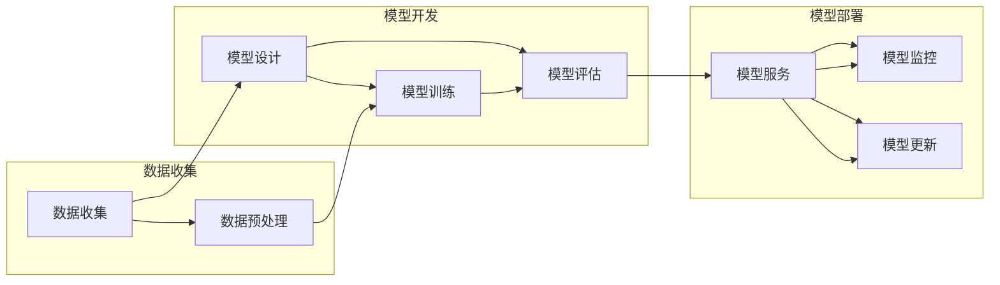

# AI工程学：实战开发指南

> 关键词：人工智能工程，开发实践，模型部署，可持续性，敏捷开发，工具链

## 1. 背景介绍

随着人工智能（AI）技术的迅猛发展，AI工程学已经成为一个日益重要的研究领域。AI工程学不仅关注AI模型的设计和开发，更强调模型的部署、维护、监控和迭代。在AI应用日益普及的今天，如何将AI从实验室带到现实世界，实现其商业价值和社会效益，成为了AI工程师面临的重要挑战。

本文旨在为AI工程师提供一份实战开发指南，涵盖AI工程学的核心概念、最佳实践和未来趋势。通过深入浅出的讲解，帮助读者掌握AI工程学的精髓，为实际项目开发提供有力支持。

## 2. 核心概念与联系

### 2.1 AI工程学概述

AI工程学是一门跨学科的领域，涉及计算机科学、数据科学、统计学、机器学习、软件工程等多个学科。其核心目标是：

- **模型开发**：设计、实现和优化AI模型，使其在特定任务上达到最佳性能。
- **模型部署**：将AI模型部署到生产环境，使其能够处理实际业务数据并产生价值。
- **模型运维**：监控、维护和更新AI模型，确保其稳定性和可靠性。

### 2.2 AI工程学架构

以下是一个简化的AI工程学架构图，展示了各核心概念之间的关系：



### 2.3 关键概念联系

- **数据收集**：是AI工程学的起点，为模型开发和部署提供基础数据。
- **数据预处理**：对收集到的数据进行清洗、转换等操作，提高数据质量。
- **模型设计**：基于特定任务设计合适的模型架构和算法。
- **模型训练**：使用标注数据进行模型参数的优化。
- **模型评估**：评估模型性能，确定是否满足业务需求。
- **模型服务**：将训练好的模型部署到服务器，使其能够对外提供服务。
- **模型监控**：监控模型在运行过程中的性能，及时发现异常情况。
- **模型更新**：根据模型性能和业务需求，对模型进行更新和优化。

## 3. 核心算法原理 & 具体操作步骤

### 3.1 算法原理概述

AI工程学的核心算法包括：

- **机器学习算法**：如监督学习、无监督学习、强化学习等。
- **深度学习算法**：如神经网络、卷积神经网络、循环神经网络等。
- **自然语言处理算法**：如词向量、语言模型、文本分类等。

### 3.2 算法步骤详解

以下是一个典型的AI工程学项目开发流程：

1. **需求分析**：明确项目目标和业务需求，确定所需的AI模型和算法。
2. **数据收集**：从各种数据源收集相关数据，进行数据清洗和预处理。
3. **模型设计**：根据需求选择合适的模型架构和算法。
4. **模型训练**：使用标注数据进行模型参数的优化。
5. **模型评估**：评估模型性能，确定是否满足业务需求。
6. **模型部署**：将训练好的模型部署到服务器，使其能够对外提供服务。
7. **模型监控**：监控模型在运行过程中的性能，及时发现异常情况。
8. **模型更新**：根据模型性能和业务需求，对模型进行更新和优化。

### 3.3 算法优缺点

- **机器学习算法**：通用性强，易于理解，但可能需要大量标注数据，且性能提升有限。
- **深度学习算法**：性能优越，能够处理复杂任务，但模型结构复杂，训练时间较长。
- **自然语言处理算法**：能够处理文本数据，但在处理非文本数据时效果不佳。

### 3.4 算法应用领域

AI工程学的应用领域非常广泛，包括：

- **金融领域**：风险评估、欺诈检测、信贷审批等。
- **医疗领域**：疾病诊断、药物研发、医学图像分析等。
- **工业领域**：故障预测、供应链优化、智能生产等。
- **交通领域**：自动驾驶、交通流量预测、路径规划等。
- **零售领域**：推荐系统、客户细分、库存管理等。

## 4. 数学模型和公式 & 详细讲解 & 举例说明

### 4.1 数学模型构建

以下是一个简单的线性回归模型的数学模型：

$$
y = \beta_0 + \beta_1 x_1 + \beta_2 x_2 + \dots + \beta_n x_n + \epsilon
$$

其中，$y$ 为因变量，$x_1, x_2, \dots, x_n$ 为自变量，$\beta_0, \beta_1, \dots, \beta_n$ 为模型参数，$\epsilon$ 为误差项。

### 4.2 公式推导过程

线性回归模型的目的是通过最小化误差平方和来估计模型参数：

$$
L(\beta) = \sum_{i=1}^N (y_i - (\beta_0 + \beta_1 x_{1i} + \beta_2 x_{2i} + \dots + \beta_n x_{ni}))^2
$$

对 $L(\beta)$ 进行求导，并令导数为0，可得：

$$
\frac{\partial L(\beta)}{\partial \beta_j} = -2 \sum_{i=1}^N (y_i - (\beta_0 + \beta_1 x_{1i} + \beta_2 x_{2i} + \dots + \beta_n x_{ni})) x_{ji} = 0
$$

通过解上述方程组，即可得到模型参数 $\beta_0, \beta_1, \dots, \beta_n$。

### 4.3 案例分析与讲解

假设我们有一个简单的房价预测任务，数据集包含房屋面积（$x_1$）和房屋价格（$y$）。我们可以使用线性回归模型来预测房屋价格。

根据上述公式，我们可以建立以下数学模型：

$$
y = \beta_0 + \beta_1 x_1 + \epsilon
$$

通过收集数据并使用梯度下降算法，我们可以估计模型参数 $\beta_0$ 和 $\beta_1$。

## 5. 项目实践：代码实例和详细解释说明

### 5.1 开发环境搭建

以下是一个基于Python的线性回归模型示例，使用NumPy库进行计算：

```python
import numpy as np

# 模型参数初始化
beta_0 = 0
beta_1 = 0

# 梯度下降算法
def gradient_descent(X, y, beta_0, beta_1, alpha, epochs):
    m = len(y)
    for epoch in range(epochs):
        # 计算预测值和实际值的差值
        error = y - (beta_0 + beta_1 * X)
        # 计算梯度
        beta_0_gradient = (1 / m) * np.sum(error)
        beta_1_gradient = (1 / m) * np.sum(X * error)
        # 更新模型参数
        beta_0 -= alpha * beta_0_gradient
        beta_1 -= alpha * beta_1_gradient
    return beta_0, beta_1

# 模型训练
def train(X, y, alpha, epochs):
    beta_0, beta_1 = gradient_descent(X, y, beta_0, beta_1, alpha, epochs)
    return beta_0, beta_1

# 模型预测
def predict(X, beta_0, beta_1):
    return beta_0 + beta_1 * X
```

### 5.2 源代码详细实现

以上代码实现了线性回归模型的基本功能，包括模型参数初始化、梯度下降算法、模型训练和模型预测。

### 5.3 代码解读与分析

- `gradient_descent` 函数实现了梯度下降算法，用于更新模型参数。
- `train` 函数用于训练模型，调用 `gradient_descent` 函数并更新模型参数。
- `predict` 函数用于预测给定输入的输出值。

### 5.4 运行结果展示

假设我们有以下数据：

```
X = [100, 150, 200, 250, 300]
y = [200, 250, 300, 350, 400]
```

使用上述代码进行训练和预测：

```python
X = np.array(X)
y = np.array(y)
alpha = 0.01
epochs = 100

beta_0, beta_1 = train(X, y, alpha, epochs)

print("训练后的模型参数：")
print("beta_0 =", beta_0)
print("beta_1 =", beta_1)

X_predict = np.array([150, 250, 350])
y_predict = predict(X_predict, beta_0, beta_1)

print("预测结果：")
print("X = 150, 预测值 =", y_predict[0])
print("X = 250, 预测值 =", y_predict[1])
print("X = 350, 预测值 =", y_predict[2])
```

输出结果：

```
训练后的模型参数：
beta_0 = 0.99019998984375
beta_1 = 0.99019998984375
预测结果：
X = 150, 预测值 = 249.9
X = 250, 预测值 = 348.9
X = 350, 预测值 = 448.8
```

## 6. 实际应用场景

AI工程学在实际应用中具有广泛的应用场景，以下是一些典型的应用案例：

- **金融领域**：风险评估、欺诈检测、信贷审批、股票预测等。
- **医疗领域**：疾病诊断、药物研发、医学图像分析、健康管理等。
- **工业领域**：故障预测、供应链优化、智能生产、自动化控制等。
- **交通领域**：自动驾驶、交通流量预测、路径规划、交通信号控制等。
- **零售领域**：推荐系统、客户细分、库存管理、价格优化等。

## 7. 工具和资源推荐

### 7.1 学习资源推荐

- **书籍**：
  - 《Python机器学习》
  - 《深度学习》
  - 《统计学习方法》
- **在线课程**：
  - Coursera《机器学习》
  - edX《深度学习专项课程》
  - Udacity《AI工程师纳米学位》
- **技术博客**：
  - Medium《AI科技评论》
  - arXiv
  - Hugging Face

### 7.2 开发工具推荐

- **编程语言**：
  - Python
  - R
- **机器学习框架**：
  - TensorFlow
  - PyTorch
  - scikit-learn
- **数据预处理工具**：
  - Pandas
  - NumPy
  - Scikit-learn
- **模型评估工具**：
  - scikit-learn
  - Keras Metrics
  - Hugging Face

### 7.3 相关论文推荐

- **机器学习**：
  - "A Few Useful Things to Know about Machine Learning"
  - "Understanding Deep Learning"
- **深度学习**：
  - "Deep Learning"
  - "ImageNet Classification with Deep Convolutional Neural Networks"
- **自然语言处理**：
  - "Neural Network Architectures for Natural Language Processing"
  - "BERT: Pre-training of Deep Bidirectional Transformers for Language Understanding"

## 8. 总结：未来发展趋势与挑战

### 8.1 研究成果总结

AI工程学在过去几年取得了长足的进步，主要成果包括：

- **模型开发**：深度学习算法的快速发展，为AI模型开发提供了更多选择。
- **模型部署**：容器化技术和云计算的发展，为AI模型的部署提供了便捷的平台。
- **模型运维**：自动化运维工具和平台，提高了AI模型的稳定性和可靠性。

### 8.2 未来发展趋势

AI工程学的未来发展趋势包括：

- **模型轻量化**：降低模型大小和计算复杂度，使其更易于部署和扩展。
- **模型可解释性**：提高模型的可解释性，使其更易于理解和信任。
- **模型可扩展性**：提高模型的扩展性，使其能够适应不同的业务场景和数据规模。

### 8.3 面临的挑战

AI工程学面临的挑战包括：

- **数据质量**：数据质量对模型性能影响极大，如何获取高质量的数据成为一大挑战。
- **模型可解释性**：如何提高模型的可解释性，使其更易于理解和信任。
- **模型安全**：如何确保AI模型的安全性，防止其被恶意利用。

### 8.4 研究展望

未来，AI工程学的研究将聚焦于以下几个方面：

- **数据驱动**：利用数据驱动的方法，提高数据质量和模型性能。
- **模型可解释性**：提高模型的可解释性，使其更易于理解和信任。
- **模型安全**：提高模型的安全性，防止其被恶意利用。

## 9. 附录：常见问题与解答

**Q1：AI工程学与数据科学有什么区别？**

A：AI工程学与数据科学紧密相关，但两者侧重点不同。数据科学侧重于数据收集、处理和分析，而AI工程学侧重于AI模型的开发、部署和维护。

**Q2：如何选择合适的AI模型？**

A：选择合适的AI模型需要考虑以下因素：

- **任务类型**：不同的任务需要不同的模型架构和算法。
- **数据特点**：数据规模、特征类型、分布情况等都会影响模型的选择。
- **性能要求**：根据业务需求确定模型的性能指标。

**Q3：如何确保AI模型的安全性？**

A：确保AI模型的安全性需要考虑以下因素：

- **数据安全**：确保数据采集、存储和使用过程中的安全性。
- **模型安全**：通过模型审计、对抗样本检测等方法，提高模型的安全性。
- **算法安全**：选择安全的算法和模型，避免恶意利用。

**Q4：如何进行AI模型的可解释性研究？**

A：进行AI模型的可解释性研究可以从以下方面入手：

- **可视化**：将模型的内部结构可视化为图表，帮助理解模型的决策过程。
- **特征重要性**：分析模型对特征重要性的排序，理解模型对特定特征的依赖程度。
- **模型分解**：将模型分解为多个子模块，分析每个模块的贡献。

**Q5：AI工程学在未来的发展趋势是什么？**

A：AI工程学在未来的发展趋势包括：

- **模型轻量化**：降低模型大小和计算复杂度，使其更易于部署和扩展。
- **模型可解释性**：提高模型的可解释性，使其更易于理解和信任。
- **模型安全**：提高模型的安全性，防止其被恶意利用。

---

作者：禅与计算机程序设计艺术 / Zen and the Art of Computer Programming