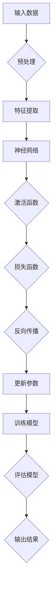

> 深度学习，神经网络，Transformer，预训练，自然语言处理，计算机视觉，迁移学习，AutoML

# Andrej Karpathy：深度学习的最新进展

深度学习作为人工智能领域的核心技术之一，近年来取得了飞速发展。Andrej Karpathy，作为深度学习领域的杰出代表，他的研究成果和见解对整个领域产生了深远影响。本文将深入探讨深度学习的最新进展，结合Andrej Karpathy的工作，分析其在自然语言处理、计算机视觉等领域的应用，并展望未来发展趋势和挑战。

## 1. 背景介绍

### 1.1 深度学习的兴起

深度学习是一种利用深层神经网络模型进行数据分析和预测的机器学习技术。自2006年深度神经网络被重新发现以来，深度学习在图像识别、语音识别、自然语言处理等领域取得了突破性进展。这一领域的快速发展得益于计算能力的提升、大数据的积累以及新型神经网络结构的提出。

### 1.2 Andrej Karpathy的贡献

Andrej Karpathy是深度学习领域的知名专家，他在神经网络结构设计、预训练技术、自然语言处理等多个方向做出了突出贡献。以下是他的一些重要贡献：

- **神经机器翻译（Neural Machine Translation，NMT）**：Karpathy是Google Translate团队的成员之一，他参与开发了基于神经网络的机器翻译系统，该系统在机器翻译领域取得了显著的性能提升。
- **神经网络结构设计**：Karpathy提出了多种神经网络结构，如序列到序列（Seq2Seq）模型，在文本生成、机器翻译等领域取得了成功。
- **预训练技术**：Karpathy是BERT（Bidirectional Encoder Representations from Transformers）模型的作者之一，该模型在自然语言处理领域取得了重大突破。
- **深度学习框架**：Karpathy参与了TensorFlow的早期开发，并贡献了多个重要组件。

## 2. 核心概念与联系

### 2.1 深度学习的核心概念

深度学习涉及以下核心概念：

- **神经网络**：由多个层组成的计算模型，用于学习和模拟大脑神经网络的工作原理。
- **神经元**：神经网络的基本单元，负责接收输入信号、执行计算并产生输出信号。
- **激活函数**：对神经元输出进行非线性变换，增加模型的非线性表达能力。
- **损失函数**：衡量模型预测结果与真实值之间差异的函数，用于优化模型参数。
- **反向传播**：一种用于优化神经网络参数的算法，通过计算梯度来更新模型参数。

### 2.2 Mermaid 流程图

以下是深度学习流程的Mermaid流程图：



## 3. 核心算法原理 & 具体操作步骤

### 3.1 算法原理概述

深度学习算法主要包括以下步骤：

1. 数据预处理：对输入数据进行清洗、归一化等处理，使其适合模型输入。
2. 特征提取：使用神经网络从输入数据中提取特征，提高模型的识别能力。
3. 训练模型：使用损失函数和反向传播算法优化模型参数，使模型能够更好地拟合数据。
4. 评估模型：使用测试数据评估模型性能，包括准确率、召回率、F1分数等指标。
5. 输出结果：使用训练好的模型对新的数据进行预测。

### 3.2 算法步骤详解

以下是深度学习算法的详细步骤：

1. **数据预处理**：根据数据特点，选择合适的预处理方法，如归一化、标准化、数据增强等。
2. **构建神经网络**：根据任务需求，设计合适的网络结构，包括层数、神经元数量、激活函数等。
3. **初始化参数**：随机初始化模型参数，通常使用小批量随机梯度下降（Mini-batch SGD）等算法进行优化。
4. **损失函数选择**：根据任务类型选择合适的损失函数，如交叉熵损失、均方误差损失等。
5. **反向传播**：使用反向传播算法计算损失函数对模型参数的梯度，并更新模型参数。
6. **迭代优化**：重复步骤4和5，直到模型收敛或达到预设的迭代次数。
7. **模型评估**：使用测试数据评估模型性能，并根据评估结果调整模型结构和参数。
8. **模型部署**：将训练好的模型部署到实际应用中，进行预测或决策。

### 3.3 算法优缺点

深度学习算法的优点：

- **强大的学习能力**：深度学习模型可以自动从大量数据中学习复杂的特征表示，无需人工设计特征。
- **泛化能力强**：深度学习模型可以在不同任务和数据集上取得良好的性能，具有较强的泛化能力。
- **高度可扩展**：深度学习模型可以轻松扩展到更复杂的任务和数据集。

深度学习算法的缺点：

- **计算复杂度高**：深度学习模型通常需要大量的计算资源，如GPU、TPU等。
- **数据依赖性强**：深度学习模型的性能高度依赖于数据质量，对噪声和异常值敏感。
- **可解释性差**：深度学习模型的决策过程通常难以解释，难以理解模型的内部工作机制。

### 3.4 算法应用领域

深度学习算法在以下领域得到了广泛应用：

- **计算机视觉**：图像识别、目标检测、人脸识别、图像分割等。
- **自然语言处理**：文本分类、机器翻译、情感分析、文本生成等。
- **语音识别**：语音识别、语音合成、语音翻译等。
- **推荐系统**：推荐电影、音乐、商品等。
- **医疗诊断**：疾病检测、药物研发、医疗影像分析等。

## 4. 数学模型和公式 & 详细讲解 & 举例说明

### 4.1 数学模型构建

深度学习模型通常基于以下数学模型：

- **神经网络**：由多个层组成的计算模型，包括输入层、隐藏层和输出层。
- **激活函数**：对神经元输出进行非线性变换，增加模型的非线性表达能力。
- **损失函数**：衡量模型预测结果与真实值之间差异的函数，用于优化模型参数。
- **反向传播**：一种用于优化神经网络参数的算法，通过计算梯度来更新模型参数。

### 4.2 公式推导过程

以下是一些常见的数学公式：

- **神经网络前向传播**：

  $$
  z^{[l]} = W^{[l]} \cdot a^{[l-1]} + b^{[l]}
  $$

  $$
  a^{[l]} = \sigma(z^{[l]})
  $$

- **神经网络反向传播**：

  $$
  \frac{\partial J}{\partial W^{[l]}} = \frac{\partial J}{\partial a^{[l]}} \cdot a^{[l-1]^{T}}
  $$

  $$
  \frac{\partial J}{\partial b^{[l]}} = \frac{\partial J}{\partial a^{[l]}}
  $$

  $$
  \frac{\partial J}{\partial a^{[l]}} = \sigma'(z^{[l]}) \cdot \frac{\partial J}{\partial z^{[l]}}
  $$

  $$
  \frac{\partial J}{\partial z^{[l]}} = \frac{\partial J}{\partial a^{[l+1]}} \cdot W^{[l+1]T}
  $$

### 4.3 案例分析与讲解

以图像识别任务为例，假设使用卷积神经网络（CNN）进行图像分类。以下是模型结构和训练过程的分析：

1. **数据预处理**：对图像数据进行归一化、裁剪、翻转等处理。
2. **构建CNN模型**：设计卷积层、池化层、全连接层等，形成卷积神经网络。
3. **训练模型**：使用标注数据进行训练，优化模型参数。
4. **模型评估**：使用测试数据评估模型性能。

## 5. 项目实践：代码实例和详细解释说明

### 5.1 开发环境搭建

以下是使用PyTorch框架进行深度学习项目开发的环境搭建步骤：

1. 安装PyTorch：
```
pip install torch torchvision torchaudio
```

2. 安装相关依赖：
```
pip install numpy pandas scikit-learn matplotlib
```

### 5.2 源代码详细实现

以下是一个简单的CNN模型实现：

```python
import torch
import torch.nn as nn
import torch.optim as optim

class CNN(nn.Module):
    def __init__(self):
        super(CNN, self).__init__()
        self.conv1 = nn.Conv2d(1, 10, kernel_size=5)
        self.conv2 = nn.Conv2d(10, 20, kernel_size=5)
        self.fc1 = nn.Linear(320, 50)
        self.fc2 = nn.Linear(50, 10)

    def forward(self, x):
        x = nn.functional.relu(self.conv1(x))
        x = nn.functional.max_pool2d(x, 2)
        x = nn.functional.relu(self.conv2(x))
        x = nn.functional.max_pool2d(x, 2)
        x = x.view(-1, 320)
        x = nn.functional.relu(self.fc1(x))
        x = self.fc2(x)
        return x

# 创建模型和优化器
model = CNN()
optimizer = optim.SGD(model.parameters(), lr=0.01, momentum=0.9)

# 训练模型
for epoch in range(2):
    for i, (inputs, labels) in enumerate(train_loader):
        optimizer.zero_grad()
        outputs = model(inputs)
        loss = nn.functional.cross_entropy(outputs, labels)
        loss.backward()
        optimizer.step()
```

### 5.3 代码解读与分析

以上代码实现了一个简单的CNN模型，用于图像识别任务。模型结构包括两个卷积层、两个池化层和两个全连接层。代码中，我们首先定义了CNN类，并在其中定义了网络结构和前向传播方法。然后，我们创建了一个实例模型和优化器，并使用训练数据对模型进行训练。

### 5.4 运行结果展示

在完成模型训练后，我们可以使用测试数据评估模型性能，包括准确率、召回率、F1分数等指标。

## 6. 实际应用场景

### 6.1 计算机视觉

深度学习在计算机视觉领域的应用广泛，如：

- **图像识别**：使用卷积神经网络对图像进行分类，如识别图片中的物体、场景等。
- **目标检测**：在图像中检测并定位感兴趣的目标，如识别并定位行人、车辆等。
- **图像分割**：将图像中的物体分割成不同的区域，如分割医学图像中的肿瘤区域。

### 6.2 自然语言处理

深度学习在自然语言处理领域的应用包括：

- **文本分类**：对文本进行分类，如情感分析、主题分类等。
- **机器翻译**：将一种语言的文本翻译成另一种语言。
- **文本生成**：根据输入的文本生成新的文本。

### 6.3 语音识别

深度学习在语音识别领域的应用包括：

- **语音识别**：将语音信号转换为文本。
- **语音合成**：将文本转换为语音。

## 7. 工具和资源推荐

### 7.1 学习资源推荐

- 《深度学习》（Goodfellow, Bengio, Courville）
- 《神经网络与深度学习》（邱锡鹏）
- 《深度学习实战》（François Chollet）
- TensorFlow官方文档
- PyTorch官方文档

### 7.2 开发工具推荐

- TensorFlow：Google开发的深度学习框架。
- PyTorch：Facebook开发的深度学习框架。
- Keras：基于TensorFlow和PyTorch的深度学习库。
- Caffe：由伯克利视觉和学习中心开发的深度学习框架。

### 7.3 相关论文推荐

- "A Neural Algorithm of Artistic Style"（Goodfellow等，2014）
- "ImageNet Classification with Deep Convolutional Neural Networks"（ Krizhevsky等，2012）
- "Sequence to Sequence Learning with Neural Networks"（Sutskever等，2014）
- "BERT: Pre-training of Deep Bidirectional Transformers for Language Understanding"（Devlin等，2018）
- "Generative Adversarial Nets"（Goodfellow等，2014）

## 8. 总结：未来发展趋势与挑战

### 8.1 研究成果总结

深度学习在近年来取得了显著进展，并在多个领域取得了突破性成果。深度学习模型在图像识别、语音识别、自然语言处理等领域取得了优异的性能，推动了人工智能技术的快速发展。

### 8.2 未来发展趋势

未来，深度学习将呈现以下发展趋势：

- **模型规模和参数量将进一步扩大**：随着计算能力的提升，深度学习模型将更加复杂，参数量将进一步扩大。
- **新型神经网络结构将不断涌现**：为了更好地解决实际问题，研究者将探索新的神经网络结构，如图神经网络、变换器等。
- **预训练技术将更加成熟**：预训练技术将成为深度学习的主流，预训练模型将更加通用，适应更多领域和任务。
- **迁移学习和少样本学习将得到广泛应用**：迁移学习和少样本学习方法将使得深度学习模型更加高效，降低对标注数据的依赖。

### 8.3 面临的挑战

深度学习在发展过程中也面临着以下挑战：

- **计算资源瓶颈**：深度学习模型通常需要大量的计算资源，如何高效利用现有计算资源是一个挑战。
- **数据隐私和安全**：深度学习模型需要大量数据，如何保证数据隐私和安全是一个挑战。
- **模型可解释性**：深度学习模型的决策过程通常难以解释，如何提高模型的可解释性是一个挑战。
- **算法偏见和歧视**：深度学习模型可能存在偏见和歧视，如何避免算法偏见是一个挑战。

### 8.4 研究展望

未来，深度学习研究将致力于解决以下问题：

- **高效利用计算资源**：研究新型计算架构和算法，提高深度学习模型的计算效率。
- **保护数据隐私和安全**：研究数据脱敏、联邦学习等技术，保护数据隐私和安全。
- **提高模型可解释性**：研究可解释性模型，提高模型的可解释性和透明度。
- **消除算法偏见和歧视**：研究公平、公正的算法，消除算法偏见和歧视。

深度学习作为人工智能领域的重要技术，将在未来发挥越来越重要的作用。通过不断攻克挑战，深度学习将为人类社会带来更多福祉。

## 9. 附录：常见问题与解答

**Q1：深度学习和机器学习有什么区别？**

A1：深度学习是机器学习的一个子领域，它使用深层神经网络模型进行数据分析和预测。机器学习则是一个更广泛的领域，包括深度学习、支持向量机、决策树等多种算法。

**Q2：深度学习模型的训练需要大量的数据吗？**

A2：深度学习模型的训练通常需要大量的数据，尤其是在模型规模较大时。然而，随着迁移学习和少样本学习技术的发展，深度学习模型可以适应更少的训练数据。

**Q3：如何选择合适的深度学习模型？**

A3：选择合适的深度学习模型需要考虑以下因素：

- **任务类型**：根据任务类型选择合适的模型，如图像识别使用卷积神经网络，文本分类使用循环神经网络或Transformer模型。
- **数据特点**：根据数据的特点选择合适的模型，如数据量较大时可以使用大规模模型，数据量较小时可以使用小规模模型。
- **计算资源**：根据可用的计算资源选择合适的模型，如计算资源有限时可以选择轻量级模型。

**Q4：深度学习模型的可解释性如何提高？**

A4：提高深度学习模型的可解释性可以从以下几个方面入手：

- **可视化技术**：使用可视化技术展示模型的内部结构和特征表示。
- **解释性模型**：研究可解释性模型，如注意力机制、LIME等。
- **专家知识**：结合专家知识，解释模型的决策过程。

**Q5：深度学习模型如何应用于实际场景？**

A5：深度学习模型可以应用于以下实际场景：

- **图像识别**：图像分类、目标检测、图像分割等。
- **自然语言处理**：文本分类、机器翻译、文本生成等。
- **语音识别**：语音识别、语音合成、语音翻译等。
- **推荐系统**：推荐电影、音乐、商品等。
- **医疗诊断**：疾病检测、药物研发、医疗影像分析等。

深度学习作为一种强大的机器学习技术，将在未来发挥越来越重要的作用，为人类社会带来更多福祉。

---

作者：禅与计算机程序设计艺术 / Zen and the Art of Computer Programming