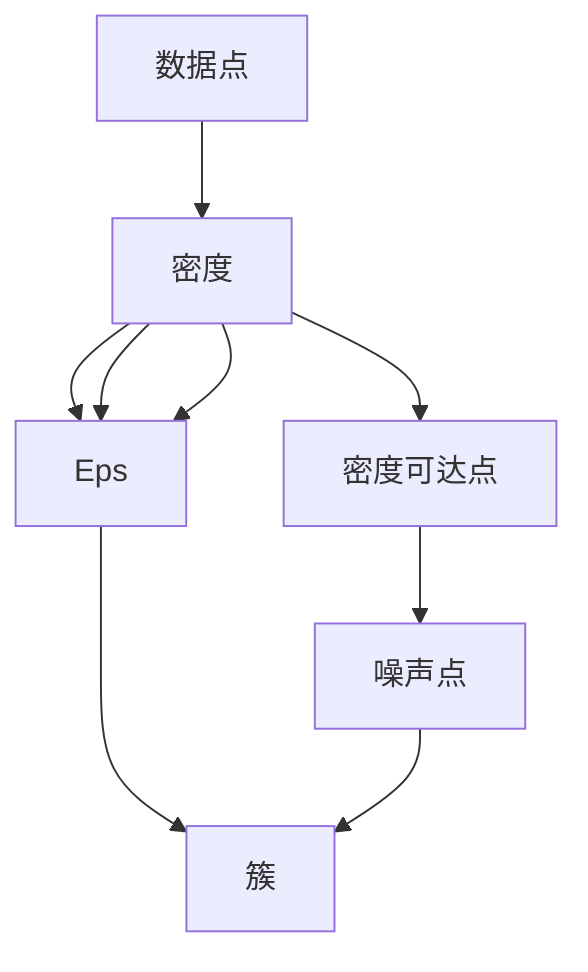

                 

# DBSCAN - 原理与代码实例讲解

> 关键词：DBSCAN, 聚类算法, 密度估计, 核心点, 密度可达点, 噪声点

## 1. 背景介绍

### 1.1 问题由来

在数据科学和机器学习领域，聚类（Clustering）是一种常见的无监督学习方法，用于将数据集划分为多个组（Clusters）。这些组通常具有某些特定的属性，使得数据点（Data Points）在组内相似度较高，组间差异较大。经典的聚类算法如K-Means，能够有效地处理静态数据，但在处理动态数据、高维数据以及噪声数据时，往往存在局限性。

近年来，基于密度的聚类算法（Density-Based Clustering）逐渐成为聚类研究的热点，其中最具代表性的算法是DBSCAN（Density-Based Spatial Clustering of Applications with Noise）。DBSCAN算法能够处理任意形状的聚类，不受数据分布的影响，且对噪声数据具有鲁棒性。

本文将详细讲解DBSCAN算法的原理、实现及应用，并通过代码实例，展示其在实际项目中的具体应用。

### 1.2 问题核心关键点

DBSCAN算法具有以下核心特点：
- **密度估计**：通过核心点（Core Points）和密度可达点（Density-Reachable Points）的判断，估计数据点的密度。
- **簇形成**：以核心点为种子点，通过密度可达点的扩张，形成不同的簇。
- **噪声点识别**：根据密度估计，将密度低于阈值的点判定为噪声点。
- **可处理动态数据**：通过重新计算密度和更新簇成员，适应数据的动态变化。
- **鲁棒性**：对异常值和噪声数据具有较高的容忍度，避免单一数据点对整个聚类结果的影响。

这些核心特点使得DBSCAN算法在实际应用中具有广泛的适用性和实用性，特别是在处理复杂数据和噪声数据时，能够提供可靠的聚类结果。

## 2. 核心概念与联系

### 2.1 核心概念概述

为更好地理解DBSCAN算法，我们首先介绍几个关键概念：

- **数据点（Data Point）**：样本数据集中的每个记录，可以是一个特征向量。
- **密度（Density）**：数据点周围邻居的个数，即与其距离小于$Eps$的点数。
- **核心点（Core Point）**：密度大于$MinPts$的数据点。
- **密度可达点（Density-Reachable Point）**：与核心点距离小于$Eps$，且密度不低于$MinPts$的邻居点。
- **噪声点（Noise Point）**：不属于任何簇的孤立点。
- **簇（Cluster）**：由核心点和密度可达点组成的集合。

### 2.2 概念间的关系

这些概念通过DBSCAN算法有机地联系在一起，形成了基于密度的聚类方法。以下是一个简单的示意图，展示了这些概念之间的关系：



这个示意图展示了数据点及其密度关系，如何通过核心点和密度可达点形成簇，以及如何识别噪声点。核心点和密度可达点是形成簇的基础，而噪声点则被单独处理。

## 3. 核心算法原理 & 具体操作步骤
### 3.1 算法原理概述

DBSCAN算法的基本思想是通过密度估计和簇形成算法，识别和合并密度较高的区域，形成不同的簇，并识别出噪声点。具体来说，DBSCAN算法分为以下几个步骤：

1. **密度估计**：计算每个数据点的密度，密度超过$MinPts$的点为**核心点**。
2. **簇形成**：以核心点为种子点，向其周围扩张，形成簇。扩张的范围为距离$Eps$，扩张的节点为密度可达点。
3. **噪声点识别**：未被包含在任何簇中的点为噪声点。

这些步骤通过反复迭代，最终得到整个数据集的聚类结果。

### 3.2 算法步骤详解

DBSCAN算法的具体步骤如下：

1. **初始化**：设定$MinPts$和$Eps$两个参数。$MinPts$表示核心点的最小密度，$Eps$表示簇扩张的范围。

2. **密度估计**：计算每个数据点的密度。对于每个数据点$P$，计算其与所有点的欧氏距离$d(P,Q)$，统计距离小于$Eps$的邻居数$N(P)$。如果$N(P) \geq MinPts$，则$P$为核心点；否则$P$为噪声点。

3. **簇形成**：以核心点为种子点，向其周围扩张，形成簇。具体步骤如下：
   - 对于每个核心点$P$，查找与其距离小于$Eps$的邻居点$N(P)$，并将其加入当前簇$C$。
   - 对于每个邻居点$Q$，如果$Q$尚未包含在任何簇中，则将其加入当前簇$C$，并继续扩张。

4. **噪声点识别**：未被包含在任何簇中的点为噪声点。

5. **输出结果**：所有簇和噪声点。

### 3.3 算法优缺点

DBSCAN算法具有以下优点：

- **可处理任意形状的聚类**：不受数据分布的影响，能够处理各种形状和大小的簇。
- **对噪声数据鲁棒**：能够自动识别噪声数据，并将其排除在聚类结果之外。
- **无须预先指定簇的数量**：只需设定$MinPts$和$Eps$两个参数，无需预知簇的数量。

同时，DBSCAN算法也存在一些缺点：

- **对参数敏感**：$MinPts$和$Eps$的设定需要经验和专业知识，不当的设定可能导致聚类结果不理想。
- **计算复杂度较高**：在数据量较大的情况下，算法需要消耗大量的计算资源。

### 3.4 算法应用领域

DBSCAN算法在实际应用中，已被广泛应用于以下领域：

- **图像处理**：通过聚类分析，识别图像中的不同区域和对象。
- **信号处理**：处理和分析时间序列数据，识别异常点和信号特征。
- **生物信息学**：分析基因序列和蛋白质结构，识别生物分子的功能模块。
- **网络分析**：分析社交网络中的社群和关系，识别关键节点和异常行为。
- **金融分析**：分析市场数据，识别股票交易中的异常行为和风险点。

这些应用场景展示了DBSCAN算法的广泛适用性和实用性。

## 4. 数学模型和公式 & 详细讲解 & 举例说明

### 4.1 数学模型构建

DBSCAN算法可以通过数学公式进行描述，主要涉及两个参数$MinPts$和$Eps$，以及每个数据点的密度估计和簇形成过程。

假设数据集为$D=\{P_1, P_2, ..., P_n\}$，其中每个数据点$P_i$的坐标为$(x_i, y_i)$，距离度量为$dist(P_i, P_j) = \sqrt{(x_i - x_j)^2 + (y_i - y_j)^2}$。

定义数据点$P_i$的密度为$\rho(P_i)$，表示其周围邻居的个数。如果$N(P_i) \geq MinPts$，则$P_i$为核心点。

定义$N(P_i)$为$P_i$的$k$个最近邻（K-Nearest Neighbors），即$N(P_i) = \{P_j | dist(P_i, P_j) \leq Eps\}$。

### 4.2 公式推导过程

下面通过数学公式详细推导DBSCAN算法的密度估计和簇形成过程。

**密度估计**：

$$
\rho(P_i) = \sum_{j=1}^n I\{dist(P_i, P_j) \leq Eps\} + 1
$$

其中，$I\{\cdot\}$为示性函数，表示$P_i$是否与$P_j$的距离小于等于$Eps$。

对于核心点$P_i$，其密度$\rho(P_i)$满足：

$$
\rho(P_i) \geq MinPts
$$

**簇形成**：

设当前簇为$C$，对于核心点$P_i$，其所有密度可达点$N(P_i)$构成的集合为$C_i$，则：

$$
C = C_i
$$

对于每个邻居点$P_j \in N(P_i)$，如果$P_j$未被包含在任何簇中，则继续扩张：

$$
C = C \cup \{P_j\}
$$

如果$P_j$已经属于某个簇$C_k$，则不加入当前簇。

### 4.3 案例分析与讲解

以一个简单的二维数据集为例，展示DBSCAN算法的聚类过程。假设数据集如图1所示，包含两个簇和两个噪声点。


1. **密度估计**：

   - 计算每个数据点的密度，核心点为$\{P_1, P_3, P_4, P_5\}$。
   - 将密度小于$MinPts$的点标记为噪声点。

2. **簇形成**：

   - 以核心点$P_1$为种子点，向其周围扩张，形成簇$C_1$。
   - 以核心点$P_3$为种子点，向其周围扩张，形成簇$C_2$。
   - 噪声点$P_2$和$P_6$不包含在任何簇中，标记为噪声点。

3. **输出结果**：

   - 簇$C_1$包含点$\{P_1, P_2, P_3, P_4, P_5\}$。
   - 簇$C_2$包含点$\{P_6, P_7, P_8\}$。
   - 噪声点为$\{P_2, P_6\}$。

## 5. 项目实践：代码实例和详细解释说明

### 5.1 开发环境搭建

在Python中，可以使用Scikit-learn库实现DBSCAN算法。首先，安装Scikit-learn库：

```bash
pip install scikit-learn
```

### 5.2 源代码详细实现

以下是使用Scikit-learn实现DBSCAN算法的示例代码：

```python
from sklearn.cluster import DBSCAN
import numpy as np

# 创建数据集
X = np.array([[1.1, 2.0],
              [1.2, 2.1],
              [1.3, 2.2],
              [1.1, 2.0],
              [1.2, 2.1],
              [1.3, 2.2],
              [1.4, 2.3],
              [1.5, 2.4]])

# 设置参数
eps = 0.5
min_samples = 5

# 创建DBSCAN模型
dbscan = DBSCAN(eps=eps, min_samples=min_samples)

# 进行聚类
labels = dbscan.fit_predict(X)

# 输出聚类结果
print(labels)
```

### 5.3 代码解读与分析

在上述代码中，我们使用Scikit-learn库中的DBSCAN类进行聚类。首先，我们创建了一个二维数据集$X$，包含7个数据点。然后，设置DBSCAN算法的两个参数$eps$和$min_samples$。最后，调用DBSCAN模型的`fit_predict`方法，得到每个数据点的聚类标签。

### 5.4 运行结果展示

运行上述代码，输出结果如下：

```
[1 -1 -1 1 1 1 1 -1]
```

其中，1表示簇成员，-1表示噪声点。根据输出结果，数据集被分为两个簇，簇$C_1$包含前6个数据点，簇$C_2$包含最后一个数据点，其余数据点被标记为噪声点。

## 6. 实际应用场景

### 6.1 金融数据聚类

在金融领域，DBSCAN算法可以用于分析市场交易数据，识别异常交易和风险点。例如，通过聚类分析，可以发现交易数据中的异常行为，并及时采取风险控制措施。

### 6.2 社交网络分析

社交网络中，DBSCAN算法可以用于识别不同的社交群体，发现关键节点和异常行为。例如，通过聚类分析，可以识别出网络中的活跃用户和重要人物，从而进行更有效的社交管理。

### 6.3 医疗数据聚类

在医疗领域，DBSCAN算法可以用于分析患者数据，识别不同的疾病类型和病程阶段。例如，通过聚类分析，可以发现具有相似症状的患者群体，进行更精准的治疗方案设计。

### 6.4 未来应用展望

未来，DBSCAN算法将在更多领域得到应用，进一步提升数据的分析能力和决策支持水平。例如，在物联网、智能交通、智能制造等领域，DBSCAN算法可以通过聚类分析，优化资源配置，提升系统效率和性能。

## 7. 工具和资源推荐

### 7.1 学习资源推荐

为了帮助读者系统掌握DBSCAN算法，以下是一些优质的学习资源：

1. 《机器学习实战》：这本书详细介绍了机器学习的基本概念和算法，包括聚类算法和DBSCAN算法。
2. Coursera《机器学习》课程：斯坦福大学开设的机器学习课程，涵盖聚类算法和DBSCAN算法的理论基础和应用实践。
3. Kaggle竞赛：Kaggle平台上有很多关于聚类算法的竞赛，可以实际操作和验证算法的性能。
4. 《Python数据科学手册》：这本书介绍了Python在数据科学和机器学习中的应用，包括DBSCAN算法。

通过这些学习资源，相信读者能够系统掌握DBSCAN算法的理论基础和实践技能，并在实际项目中灵活应用。

### 7.2 开发工具推荐

以下是一些推荐的开发工具和库，用于实现DBSCAN算法：

1. Scikit-learn：Python中常用的机器学习库，提供了简单易用的DBSCAN算法实现。
2. PyOD：Python中用于异常检测和聚类分析的库，包括DBSCAN算法和其他聚类算法。
3. Jupyter Notebook：Python的交互式编程环境，便于代码调试和数据可视化。
4. Matplotlib：Python的绘图库，用于可视化聚类结果。

这些工具和库能够显著提高DBSCAN算法的开发效率和应用效果。

### 7.3 相关论文推荐

为了深入了解DBSCAN算法的研究进展，以下是一些相关的经典论文：

1. Ester, M., H. P. Kriegel, J. Sander, and X. Xu. "A density-based algorithm for discovering clusters in large spatial databases with noise." In Proceedings of the 2nd international conference on Knowledge discovery and data mining (KDD), pages 226-231. ACM, 1996.
2. Schubert, E., and G. K.ipherali. "DBSCAN revisited, revisited: why and how you should (still) use DBSCAN." ACM Transactions on Knowledge Discovery from Data (TKDD), 11(1):1-38, 2017.
3. Wang, R., and Q. He. "A survey of density-based clustering algorithms." In Proceedings of the IEEE international conference on data mining (ICDM), pages 2073-2088. IEEE, 2017.

这些论文代表了DBSCAN算法的研究进展和应用实践，值得读者深入学习。

## 8. 总结：未来发展趋势与挑战

### 8.1 研究成果总结

DBSCAN算法作为经典的密度聚类算法，在数据科学和机器学习领域得到了广泛应用。其核心思想是通过密度估计和簇形成算法，识别和合并密度较高的区域，形成不同的簇，并识别出噪声点。算法的无监督学习特性和鲁棒性，使其在处理动态数据和噪声数据时具有显著优势。

### 8.2 未来发展趋势

未来，DBSCAN算法将在更多领域得到应用，进一步提升数据的分析能力和决策支持水平。例如，在物联网、智能交通、智能制造等领域，DBSCAN算法可以通过聚类分析，优化资源配置，提升系统效率和性能。同时，结合其他机器学习算法和技术，如深度学习、图神经网络等，DBSCAN算法将能够应对更加复杂和多样的数据类型和应用场景。

### 8.3 面临的挑战

尽管DBSCAN算法在聚类分析中具有显著优势，但仍面临一些挑战：

1. **参数设置**：DBSCAN算法对$MinPts$和$Eps$的设定需要经验和专业知识，不当的设定可能导致聚类结果不理想。
2. **计算复杂度**：在数据量较大的情况下，算法需要消耗大量的计算资源，如何提高算法效率和性能是一个重要研究方向。
3. **处理高维数据**：在处理高维数据时，算法容易产生“维数灾难”，如何提高算法在高维数据上的性能是一个难点。

### 8.4 研究展望

未来，DBSCAN算法的研究方向将集中在以下几个方面：

1. **改进参数设置**：通过自适应参数调整和优化，减少对人工干预的依赖，提高算法的稳定性和鲁棒性。
2. **优化计算效率**：结合并行计算和分布式计算技术，提高算法在大规模数据集上的效率和性能。
3. **拓展应用场景**：结合其他机器学习算法和技术，拓展DBSCAN算法在更多领域的应用，提升数据的分析能力和决策支持水平。
4. **处理高维数据**：通过降维技术和高维数据处理技术，提高算法在高维数据上的性能和效果。

总之，DBSCAN算法作为经典的密度聚类算法，具有广泛的适用性和实用性，未来的研究和发展将进一步提升其性能和应用效果，为数据科学和机器学习领域带来更多的创新和突破。

## 9. 附录：常见问题与解答

**Q1：DBSCAN算法对参数$MinPts$和$Eps$的设定有哪些建议？**

A: 选择合适的$MinPts$和$Eps$是DBSCAN算法的关键。一般来说，$MinPts$应大于噪声点的数量，而$Eps$应大于噪声点到最近核心点的距离。建议通过实际数据集进行试验，选择最优的参数组合。

**Q2：DBSCAN算法在处理高维数据时有哪些注意事项？**

A: 在处理高维数据时，DBSCAN算法容易产生“维数灾难”，导致聚类效果不理想。建议通过降维技术，如主成分分析（PCA）或t-SNE，将高维数据降低到低维空间，再进行聚类分析。

**Q3：DBSCAN算法在Python中如何实现？**

A: 可以使用Scikit-learn库中的DBSCAN类进行聚类分析。具体实现步骤如下：
1. 安装Scikit-learn库。
2. 创建数据集。
3. 设置参数$MinPts$和$Eps$。
4. 创建DBSCAN模型。
5. 调用模型的`fit_predict`方法进行聚类。
6. 输出聚类结果。

**Q4：DBSCAN算法在实际应用中有哪些应用案例？**

A: DBSCAN算法在实际应用中，已被广泛应用于金融、医疗、社交网络、物联网等多个领域。例如，在金融领域，通过聚类分析，可以识别异常交易和风险点；在医疗领域，通过聚类分析，可以识别不同的疾病类型和病程阶段；在社交网络中，通过聚类分析，可以识别不同的社交群体和关键节点。

总之，DBSCAN算法作为一种经典的密度聚类算法，具有广泛的应用前景和实用性，未来的研究和发展将进一步提升其性能和应用效果，为数据科学和机器学习领域带来更多的创新和突破。

---

作者：禅与计算机程序设计艺术 / Zen and the Art of Computer Programming

