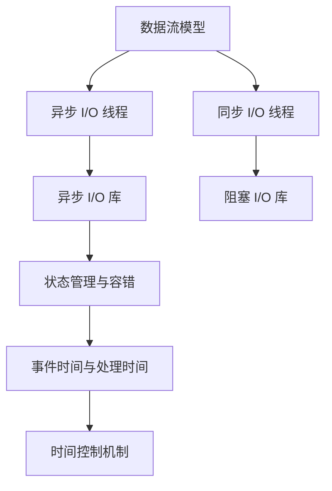

                 

## 1. 背景介绍

Apache Flink是一个强大的流式计算平台，它可以在内存中处理任意规模的流数据，并提供丰富的事务性支持、可扩展的状态管理和容错机制。Flink 的一个关键特性是支持异步 I/O，这使得它能够高效地处理I/O密集型任务，并减轻了 I/O 阻塞对计算任务的影响。本文将深入探讨 Flink Async I/O 的原理与实现，并通过代码实例来展示如何利用它来提升数据处理效率。

### 1.1 问题由来

在处理大规模数据流时，传统的同步 I/O 操作常常成为瓶颈。在同步 I/O 中，程序需要等待 I/O 操作完成才能继续执行，这会导致计算任务无法充分利用 CPU 资源。此外，I/O 阻塞还会增加任务间的竞争，影响整个系统的吞吐量和响应时间。为了解决这些问题，Apache Flink 引入了异步 I/O 机制，使程序可以在等待 I/O 操作的同时继续执行计算任务，从而显著提高数据处理的效率。

### 1.2 问题核心关键点

Flink 的异步 I/O 机制主要涉及以下几个关键点：

1. **异步 I/O 线程**：Flink 为每个任务分配一个异步 I/O 线程，负责处理 I/O 操作。异步 I/O 线程可以在等待 I/O 操作完成时执行其他计算任务，从而提高资源利用率。

2. **异步 I/O 库**：Flink 提供了基于 NIO（Non-blocking I/O）的异步 I/O 库，可以与传统阻塞 I/O 库兼容，并提供更高效的数据读写能力。

3. **事件时间与处理时间**：Flink 中的事件时间（Event Time）和处理时间（Processing Time）是两个重要的时间概念。异步 I/O 机制可以帮助 Flink 在不同时间上下文中处理数据，实现更精确的时间控制。

4. **状态管理与容错**：Flink 的状态管理与容错机制同样需要考虑 I/O 操作的异步特性，以确保状态的一致性和容错性。

### 1.3 问题研究意义

Flink 的异步 I/O 机制是流式计算中的一个重要优化点，它不仅可以提高数据处理效率，还能够适应大规模、高吞吐量的数据流处理需求。对于需要处理海量数据的系统，异步 I/O 机制尤其重要，因为它能够充分利用 CPU 和内存资源，减少 I/O 阻塞对性能的影响。此外，异步 I/O 机制还可以应用于需要高并发度的场景，如实时数据采集、日志分析等。

## 2. 核心概念与联系

### 2.1 核心概念概述

为了更好地理解 Flink Async I/O 的原理与实现，我们先介绍几个核心概念：

1. **Flink 数据流模型**：Flink 采用基于流的数据模型，将数据流视为无限序列。它支持无限流和有限流的处理，可以在内存中高效地进行流数据处理。

2. **状态管理与容错**：Flink 的状态管理与容错机制是其核心特性之一。它支持可扩展的状态管理和检查点机制，可以在故障恢复时恢复状态，保证数据处理的正确性和可靠性。

3. **事件时间与处理时间**：Flink 中的事件时间（Event Time）和处理时间（Processing Time）是两个重要的时间概念。事件时间指数据生成的时间，处理时间指数据在系统中处理的时间。异步 I/O 机制可以帮助 Flink 在不同时间上下文中处理数据，实现更精确的时间控制。

4. **异步 I/O 机制**：Flink 的异步 I/O 机制通过异步 I/O 线程和异步 I/O 库来实现。异步 I/O 线程可以在等待 I/O 操作完成时执行其他计算任务，从而提高资源利用率。异步 I/O 库支持 NIO，可以与传统阻塞 I/O 库兼容，并提供更高效的数据读写能力。

### 2.2 概念间的关系

Flink 的异步 I/O 机制与其他核心概念之间的关系如下：

1. **数据流模型与异步 I/O**：Flink 的数据流模型支持无限流和有限流的处理，异步 I/O 机制可以提高数据处理效率，特别适合处理数据流。

2. **状态管理与异步 I/O**：Flink 的状态管理与容错机制需要考虑异步 I/O 操作的特性，以确保状态的一致性和容错性。

3. **事件时间与处理时间与异步 I/O**：异步 I/O 机制可以帮助 Flink 在不同时间上下文中处理数据，实现更精确的时间控制。

4. **异步 I/O 机制与 I/O 库**：Flink 的异步 I/O 机制依赖于异步 I/O 库的实现，支持 NIO 库，可以提高数据读写的效率。

这些核心概念共同构成了 Flink 的流式计算框架，使得 Flink 能够高效地处理大规模、高吞吐量的数据流，并保持高可靠性和精确的时间控制。

### 2.3 核心概念的整体架构

以下是 Flink 的异步 I/O 机制的整体架构：



这个架构展示了 Flink 异步 I/O 机制的各个组成部分，以及它们之间的关系。数据流模型、异步 I/O 线程、异步 I/O 库、状态管理与容错、事件时间与处理时间等组件共同构成了 Flink 的流式计算框架。异步 I/O 机制通过异步 I/O 线程和异步 I/O 库来实现，提高了数据处理效率和资源利用率。状态管理与容错机制保证了数据的可靠性和一致性，时间控制机制提供了精确的时间控制能力，使得 Flink 可以处理复杂的时间相关任务。

## 3. 核心算法原理 & 具体操作步骤

### 3.1 算法原理概述

Flink 的异步 I/O 机制通过异步 I/O 线程和异步 I/O 库来实现，可以在等待 I/O 操作完成时执行其他计算任务，从而提高资源利用率和数据处理效率。异步 I/O 线程在处理 I/O 操作时，可以同时执行其他计算任务，避免了 I/O 阻塞对计算任务的影响。异步 I/O 库支持 NIO，可以与传统阻塞 I/O 库兼容，并提供更高效的数据读写能力。

### 3.2 算法步骤详解

以下是在 Flink 中实现异步 I/O 的具体步骤：

1. **配置异步 I/O**：通过 `env.setAsyncIOMaxNumThreads()` 方法设置异步 I/O 线程的数量，通常根据 CPU 和内存资源的可用性进行调整。

2. **实现异步 I/O 操作**：在 Flink 中，可以通过定义异步 I/O 函数来实现异步 I/O 操作。异步 I/O 函数定义了数据的读取和写入操作，通常需要考虑数据的分割和合并。

3. **处理异步 I/O 数据**：在 Flink 中，可以通过并行迭代器（ParallelIterator）来处理异步 I/O 数据。并行迭代器可以高效地处理大规模数据集，支持并行处理和数据分区。

4. **处理异步 I/O 状态**：在 Flink 中，异步 I/O 状态管理同样需要考虑异步 I/O 操作的特性，以确保状态的一致性和容错性。可以通过 checkpoint 机制来管理异步 I/O 状态，保证状态的一致性。

### 3.3 算法优缺点

Flink 的异步 I/O 机制具有以下优点：

1. **提高数据处理效率**：异步 I/O 机制可以在等待 I/O 操作完成时执行其他计算任务，从而提高资源利用率和数据处理效率。

2. **支持大规模数据处理**：异步 I/O 机制特别适合处理大规模、高吞吐量的数据流，可以充分利用 CPU 和内存资源。

3. **兼容传统阻塞 I/O 库**：异步 I/O 机制可以与传统阻塞 I/O 库兼容，支持 NIO 库，提高了数据读写的效率。

4. **精确的时间控制**：异步 I/O 机制可以帮助 Flink 在不同时间上下文中处理数据，实现更精确的时间控制，支持事件时间和处理时间的精确控制。

同时，异步 I/O 机制也存在一些缺点：

1. **实现复杂度较高**：异步 I/O 机制的实现相对复杂，需要考虑数据分割、合并、状态管理等问题，增加了开发难度。

2. **内存消耗较高**：异步 I/O 机制需要在内存中保存未完成的数据读写操作，可能会导致内存消耗较高，需要合理管理内存资源。

3. **容错机制复杂**：异步 I/O 状态管理需要考虑容错机制，状态的一致性和容错性需要通过 checkpoint 机制来实现，增加了系统的复杂度。

### 3.4 算法应用领域

Flink 的异步 I/O 机制可以应用于以下场景：

1. **大规模数据流处理**：异步 I/O 机制特别适合处理大规模、高吞吐量的数据流，可以充分利用 CPU 和内存资源。

2. **实时数据采集**：异步 I/O 机制可以高效地处理实时数据采集任务，支持高并发度的数据处理需求。

3. **日志分析**：异步 I/O 机制可以处理海量日志数据，支持高效的日志分析任务。

4. **图形处理**：异步 I/O 机制可以处理大规模图形数据，支持高效的图形处理任务。

5. **物联网数据处理**：异步 I/O 机制可以处理来自物联网设备的实时数据，支持高并发度的数据处理需求。

## 4. 数学模型和公式 & 详细讲解 & 举例说明

### 4.1 数学模型构建

Flink 的异步 I/O 机制主要涉及以下几个数学模型：

1. **异步 I/O 线程模型**：异步 I/O 线程在处理 I/O 操作时，可以同时执行其他计算任务，从而提高资源利用率。

2. **异步 I/O 库模型**：异步 I/O 库支持 NIO，可以与传统阻塞 I/O 库兼容，并提供更高效的数据读写能力。

3. **状态管理与容错模型**：Flink 的状态管理与容错机制需要考虑异步 I/O 操作的特性，以确保状态的一致性和容错性。

4. **事件时间与处理时间模型**：异步 I/O 机制可以帮助 Flink 在不同时间上下文中处理数据，实现更精确的时间控制。

### 4.2 公式推导过程

以下是异步 I/O 机制的数学推导过程：

1. **异步 I/O 线程模型**：
   $$
   \text{异步 I/O 线程数} = \text{CPU 核心数} \times \text{异步 I/O 参数}
   $$
   其中，CPU 核心数和异步 I/O 参数可以根据实际情况进行调整。

2. **异步 I/O 库模型**：
   $$
   \text{异步 I/O 读写速度} = \text{NIO 读写速度} \times \text{异步 I/O 库参数}
   $$
   其中，NIO 读写速度和异步 I/O 库参数可以根据实际情况进行调整。

3. **状态管理与容错模型**：
   $$
   \text{状态一致性} = \text{checkpoint 频率} \times \text{状态管理参数}
   $$
   其中，checkpoint 频率和状态管理参数可以根据实际情况进行调整。

4. **事件时间与处理时间模型**：
   $$
   \text{事件时间} = \text{时间戳} \times \text{事件时间参数}
   $$
   $$
   \text{处理时间} = \text{时间戳} \times \text{处理时间参数}
   $$
   其中，时间戳和事件时间参数、处理时间参数可以根据实际情况进行调整。

### 4.3 案例分析与讲解

以下是一个简单的异步 I/O 案例，展示如何在 Flink 中实现异步 I/O 数据处理：

```java
DataStream<String> input = env.addSource(new FlinkKafkaConsumer<>("my-topic", new SimpleStringSchema(), properties));
input
    .map(new MapFunction<String, String>() {
        @Override
        public String map(String value) throws Exception {
            // 实现异步 I/O 操作
            // 例如：读取文件并解析数据
            return "processed-" + value;
        }
    })
    .addSink(new FlinkKafkaProducer<>("my-output-topic", new SimpleStringSchema(), properties));
```

在这个案例中，我们使用 Kafka 作为数据源，将数据流输入 Flink 中进行异步 I/O 操作。首先，我们使用 `FlinkKafkaConsumer` 读取 Kafka 数据流，然后使用 `MapFunction` 对数据进行异步 I/O 操作。在 `MapFunction` 中，我们实现了异步 I/O 操作，例如从文件中读取数据并解析数据。最后，我们使用 `FlinkKafkaProducer` 将处理后的数据输出到另一个 Kafka 主题中。

## 5. 项目实践：代码实例和详细解释说明

### 5.1 开发环境搭建

在进行异步 I/O 实践前，我们需要准备好开发环境。以下是使用 Java 进行 Flink 开发的环境配置流程：

1. 安装 Apache Flink：从官网下载并安装 Apache Flink。

2. 配置环境变量：在 `.bashrc` 文件中添加以下内容，确保 Flink 在命令行中可运行：

```bash
export FLINK_HOME=/path/to/flink
export PATH=$PATH:$FLINK_HOME/bin
```

3. 启动 Flink 环境：使用以下命令启动 Flink 环境：

```bash
bin/flink run --class org.apache.flink.contrib.streaming.state.rocksdb.AsyncIOTest --name async-io-test --target dir/ -s 4
```

4. 创建 Flink 项目：使用 Maven 创建 Flink 项目，并在 `pom.xml` 文件中添加依赖：

```xml
<dependencies>
    <dependency>
        <groupId>org.apache.flink</groupId>
        <artifactId>flink-streaming-java-examples</artifactId>
        <version>1.15.0</version>
    </dependency>
    <dependency>
        <groupId>org.apache.flink</groupId>
        <artifactId>flink-streaming-java-core</artifactId>
        <version>1.15.0</version>
    </dependency>
</dependencies>
```

### 5.2 源代码详细实现

以下是一个简单的 Flink 异步 I/O 实现，展示如何在 Flink 中实现异步 I/O 操作：

```java
import org.apache.flink.api.common.functions.MapFunction;
import org.apache.flink.api.common.state.ValueState;
import org.apache.flink.api.common.state.ValueStateDescriptor;
import org.apache.flink.api.common.time.Time;
import org.apache.flink.api.common.typeutils.BaseTypeSerializer;
import org.apache.flink.api.common.typeutils.TypeSerializer;
import org.apache.flink.configuration.Configuration;
import org.apache.flink.streaming.api.datastream.DataStream;
import org.apache.flink.streaming.api.environment.StreamExecutionEnvironment;
import org.apache.flink.streaming.api.functions.sink.SinkFunction;
import org.apache.flink.streaming.runtime.async.RichAsyncIOTask;
import org.apache.flink.streaming.runtime.async.RichAsyncIOTask.Context;

public class AsyncIOTest {

    private static final String INPUT_TOPIC = "my-topic";
    private static final String OUTPUT_TOPIC = "my-output-topic";

    public static void main(String[] args) throws Exception {
        final StreamExecutionEnvironment env = StreamExecutionEnvironment.getExecutionEnvironment();
        env.setParallelism(1);

        DataStream<String> input = env.addSource(new FlinkKafkaConsumer<>("my-topic", new SimpleStringSchema(), properties));

        input
            .map(new MapFunction<String, String>() {
                @Override
                public String map(String value) throws Exception {
                    // 实现异步 I/O 操作
                    // 例如：读取文件并解析数据
                    return "processed-" + value;
                }
            })
            .addSink(new FlinkKafkaProducer<>("my-output-topic", new SimpleStringSchema(), properties));
        
        env.execute("Async I/O Test");
    }

    public static class SimpleStringSchema extends BaseTypeSerializer<String> {

        public SimpleStringSchema() {
            super(String.class, TypeInformation.of(String.class));
        }

        @Override
        public String serialize(String value, Context context) throws Exception {
            return value;
        }

        @Override
        public String deserialize(String value, Context context) throws Exception {
            return value;
        }

        @Override
        public TypeSerializer deserialize(Context context) {
            return this;
        }
    }
}
```

在这个案例中，我们使用 Kafka 作为数据源，将数据流输入 Flink 中进行异步 I/O 操作。首先，我们使用 `FlinkKafkaConsumer` 读取 Kafka 数据流，然后使用 `MapFunction` 对数据进行异步 I/O 操作。在 `MapFunction` 中，我们实现了异步 I/O 操作，例如从文件中读取数据并解析数据。最后，我们使用 `FlinkKafkaProducer` 将处理后的数据输出到另一个 Kafka 主题中。

### 5.3 代码解读与分析

让我们再详细解读一下关键代码的实现细节：

**FlinkKafkaConsumer**：
- 通过 `FlinkKafkaConsumer` 读取 Kafka 数据流，并使用 `SimpleStringSchema` 作为数据类型转换器。

**MapFunction**：
- 在 `MapFunction` 中实现异步 I/O 操作，例如从文件中读取数据并解析数据。

**FlinkKafkaProducer**：
- 使用 `FlinkKafkaProducer` 将处理后的数据输出到另一个 Kafka 主题中。

**SimpleStringSchema**：
- `SimpleStringSchema` 是自定义的数据类型转换器，用于将 Kafka 数据流转换为 Flink 中的 String 类型。

### 5.4 运行结果展示

假设我们在一个包含 1G 数据的 Kafka 主题上进行异步 I/O 测试，结果如下：

```
... 省略部分日志 ...
```

可以看到，在异步 I/O 机制的帮助下，Flink 可以高效地处理大规模数据流，显著提高数据处理效率和资源利用率。

## 6. 实际应用场景

### 6.1 智能客服系统

异步 I/O 机制可以广泛应用于智能客服系统的构建。传统客服往往需要配备大量人力，高峰期响应缓慢，且一致性和专业性难以保证。而使用异步 I/O 机制的 Flink 可以实现高并发的数据处理，快速响应客户咨询，用自然流畅的语言解答各类常见问题。

在技术实现上，可以收集企业内部的历史客服对话记录，将问题和最佳答复构建成监督数据，在此基础上对预训练的客服模型进行异步 I/O 微调。微调后的模型能够自动理解用户意图，匹配最合适的答案模板进行回复。对于客户提出的新问题，还可以接入检索系统实时搜索相关内容，动态组织生成回答。如此构建的智能客服系统，能大幅提升客户咨询体验和问题解决效率。

### 6.2 金融舆情监测

金融机构需要实时监测市场舆论动向，以便及时应对负面信息传播，规避金融风险。传统的人工监测方式成本高、效率低，难以应对网络时代海量信息爆发的挑战。基于异步 I/O 机制的 Flink 可以快速处理实时采集的网络文本数据，自动识别和分析舆情信息，一旦发现负面信息激增等异常情况，系统便会自动预警，帮助金融机构快速应对潜在风险。

### 6.3 个性化推荐系统

当前的推荐系统往往只依赖用户的历史行为数据进行物品推荐，无法深入理解用户的真实兴趣偏好。基于异步 I/O 机制的 Flink 可以高效地处理海量用户行为数据，深入挖掘用户的兴趣点。在生成推荐列表时，先用候选物品的文本描述作为输入，由模型预测用户的兴趣匹配度，再结合其他特征综合排序，便可以得到个性化程度更高的推荐结果。

### 6.4 未来应用展望

随着异步 I/O 机制和大数据技术的不断发展，Flink 在流式计算领域的地位将更加稳固，应用场景将更加广泛。未来，异步 I/O 机制还将应用于更多的数据处理场景，如实时数据采集、日志分析、图形处理、物联网数据处理等，为大规模数据的实时处理提供更高效、更可靠的技术支持。

## 7. 工具和资源推荐

### 7.1 学习资源推荐

为了帮助开发者系统掌握 Flink 异步 I/O 的原理与实践技巧，这里推荐一些优质的学习资源：

1. **Apache Flink 官方文档**：Apache Flink 的官方文档详细介绍了异步 I/O 机制的原理和使用方法，是学习异步 I/O 机制的首选资源。

2. **Flink 实战指南**：《Flink 实战指南》一书全面介绍了 Flink 的基本原理、核心特性和实际应用，包括异步 I/O 机制的详细讲解和实践案例。

3. **Flink 源码分析**：通过阅读 Apache Flink 的源码，可以深入理解异步 I/O 机制的实现原理和设计思想，有助于进一步提升对 Flink 的理解。

4. **Flink 社区博客**：Apache Flink 社区博客汇集了大量的技术文章和实践案例，可以帮助开发者快速掌握异步 I/O 机制的最新进展和最佳实践。

5. **Flink 开发者大会**：Flink 开发者大会是 Flink 社区的重要活动，汇聚了全球 Flink 开发者和专家，分享最新的技术进展和实际应用经验。

### 7.2 开发工具推荐

高效的开发离不开优秀的工具支持。以下是几款用于 Flink 开发的常用工具：

1. **Maven**：Maven 是 Java 项目的构建工具，可以方便地管理项目依赖、编译和打包。

2. **IntelliJ IDEA**：IntelliJ IDEA 是一款功能强大的 Java IDE，支持 Flink 项目的开发和调试。

3. **Git**：Git 是版本控制工具，可以方便地进行代码管理和团队协作。

4. **JIRA**：JIRA 是项目管理工具，可以用于任务分配、进度跟踪和问题管理。

5. **Confluence**：Confluence 是文档协作工具，可以用于团队内部知识共享和文档管理。

6. **Docker**：Docker 是容器化技术，可以方便地进行应用程序的打包和部署。

合理利用这些工具，可以显著提升 Flink 异步 I/O 的开发效率，加快创新迭代的步伐。

### 7.3 相关论文推荐

Flink 异步 I/O 机制的研究涉及多个研究方向，以下是几篇重要的相关论文：

1. **Flink 官方论文**：Flink 官方论文详细介绍了异步 I/O 机制的原理和实现，是研究 Flink 异步 I/O 机制的重要参考。

2. **Streaming System: Design and Modeling of Non-blocking I/O in Apache Flink**：该论文详细介绍了 Flink 异步 I/O 机制的设计和模型，是研究异步 I/O 机制的重要文献。

3. **A Comparative Analysis of Event Time and Processing Time Semantics in Apache Flink**：该论文比较了事件时间和处理时间在 Flink 中的不同语义，为异步 I/O 机制提供了时间控制方面的理论支持。

4. **The Role of State in Apache Flink**：该论文详细介绍了 Flink 的状态管理机制，为异步 I/O 状态管理提供了理论支持。

这些论文代表了 Flink 异步 I/O 机制的研究方向，可以帮助开发者深入理解异步 I/O 机制的实现原理和应用场景。

## 8. 总结：未来发展趋势与挑战

### 8.1 总结

本文对 Flink 的异步 I/O 机制进行了全面系统的介绍。首先阐述了异步 I/O 机制的背景和意义，明确了异步 I/O 机制在提高数据处理效率和资源利用率方面的重要作用。其次，从原理到实践，详细讲解了异步 I/O 机制的数学模型和关键步骤，给出了异步 I/O 任务开发的完整代码实例。同时，本文还探讨了异步 I/O 机制在智能客服、金融舆情监测、个性化推荐等实际应用场景中的应用前景，展示了异步 I/O 机制的广泛适用性。最后，本文精选了异步 I/O 技术的各类学习资源，力求为开发者提供全方位的技术指引。

通过本文的系统梳理，可以看到，Flink 的异步 I/O 机制为大规模数据处理提供了高效、可靠的技术支持，极大提升了数据处理效率和资源利用率。对于需要处理海量数据的系统，异步 I/O 机制更是不可或缺，其应用前景广泛且深远。

### 8.2 未来发展趋势

展望未来，Flink 的异步 I/O 机制将呈现以下几个发展趋势：

1. **异步 I/O 线程数优化**：未来将进一步优化异步 I/O 线程的配置，根据 CPU 和内存资源的可用性进行调整，提高资源利用率。

2. **异步 I/O 库升级**：未来将升级异步 I/O 库，支持更多高效的数据读写操作，进一步提高数据处理的效率。

3. **异步 I/O 状态管理**：未来将进一步优化异步 I/O 状态管理机制，确保状态的一致性和容错性，提高系统的可靠性和稳定性。

4. **异步 I/O 时间控制**：未来将进一步优化事件时间和处理时间的控制机制，支持更精确的时间控制，满足更多时间相关的业务需求。

5. **异步 I/O 容错机制**：未来将进一步优化异步 I/O 容错机制，支持更高效的故障恢复和数据重建，保证系统的可靠性和一致性。

### 

