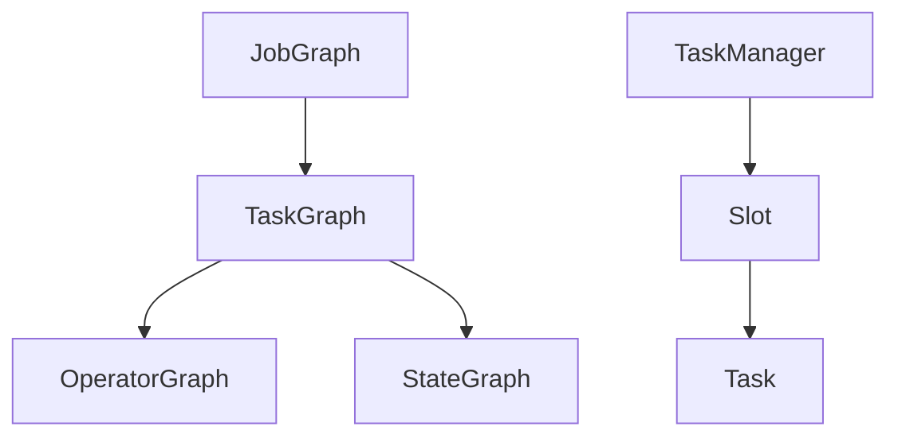

                 

# Flink Dispatcher原理与代码实例讲解

> 关键词：Flink, Dispatcher, 分布式系统, 状态管理, 容错机制, 计算调度, 实时流处理

## 1. 背景介绍

在当今大数据时代，实时数据处理成为了企业和机构数据决策的重要支撑。Flink作为Apache软件基金会开源的分布式流处理框架，以其高效、易用、可靠等特点，迅速崛起成为实时流处理领域的主流选择。而Dispatcher作为Flink集群中关键的组件，负责任务的调度、分配和管理，对于Flink的性能和稳定性具有重要影响。本文将深入探讨Flink Dispatcher原理，并通过代码实例详细讲解其核心机制和应用场景，帮助读者全面掌握该技术。

## 2. 核心概念与联系

### 2.1 核心概念概述

- **Flink**：Apache Software Foundation开源的分布式流处理框架，支持流式数据处理和批处理，具有高吞吐量、低延迟、容错性高等特点。
- **Dispatcher**：Flink集群中的核心组件，负责任务的调度、分配和管理，确保任务能够在集群中高效执行。
- **JobGraph**：Flink提交的作业经过JobRunner转换成由TaskGraph、OperatorGraph和StateGraph组成的逻辑图。
- **TaskGraph**：JobGraph中表示每个操作的任务图。
- **OperatorGraph**：JobGraph中表示每个操作的操作图。
- **StateGraph**：JobGraph中表示每个操作的容错状态图。
- **TaskManager**：Flink集群中负责执行任务的节点，每个TaskManager包含多个Slot，用于并行执行Task。
- **Task**：Flink中最小的并行执行单元，每个Task对应一个或多个Operator。
- **Slot**：TaskManager中用于执行Task的并行任务槽位，可以控制任务的并发度。

这些核心概念共同构成了Flink任务调度的完整框架，以下是一个简化的架构图：



### 2.2 概念间的关系

这些核心概念之间的关系可以描述为：

- **JobGraph**是由Flink集群中的JobRunner生成，包含了作业的逻辑结构和状态信息。
- **TaskGraph**是由JobGraph转换而来的任务图，表示作业中的各个任务及其依赖关系。
- **OperatorGraph**是由TaskGraph转换而来的操作图，表示每个任务中的各个操作及其依赖关系。
- **StateGraph**是由OperatorGraph转换而来的状态图，表示每个操作的状态及其保存方式。
- **TaskManager**负责执行Task，分配Task到Slot中执行。
- **Slot**是TaskManager中用于执行Task的槽位，多个Slot可以并行执行Task，提升并发度。
- **Task**是Flink中执行的最小并行单元，每个Task对应一个或多个Operator。

通过这些概念的相互关系，Flink Dispatcher可以高效地调度和管理Flink作业的执行。

## 3. 核心算法原理 & 具体操作步骤

### 3.1 算法原理概述

Flink Dispatcher的任务调度算法主要包括JobGraph的生成、TaskGraph的生成、OperatorGraph的生成和StateGraph的生成，具体步骤如下：

1. **JobGraph生成**：
   - 首先，JobRunner将用户提交的作业转换成JobGraph。
   - JobGraph包含作业的逻辑结构和状态信息，包括各个操作和它们之间的依赖关系。

2. **TaskGraph生成**：
   - 接着，Flink将JobGraph转换成TaskGraph。
   - TaskGraph表示作业中的各个任务及其依赖关系，每个任务对应一个或多个操作。

3. **OperatorGraph生成**：
   - 然后，Flink将TaskGraph转换成OperatorGraph。
   - OperatorGraph表示每个任务中的各个操作及其依赖关系，每个操作对应一个或多个状态。

4. **StateGraph生成**：
   - 最后，Flink将OperatorGraph转换成StateGraph。
   - StateGraph表示每个操作的状态及其保存方式，确保Flink的容错性和状态一致性。

### 3.2 算法步骤详解

**步骤1：JobGraph生成**

JobGraph生成是Flink作业调度的第一步。JobRunner将用户提交的作业转换成JobGraph，包含作业的逻辑结构和状态信息。

```python
jobGraph = JobGraphBuilder.build(....)  # 从UserJob开始构建JobGraph
```

**步骤2：TaskGraph生成**

TaskGraph生成是将JobGraph转换成TaskGraph的过程。Flink将JobGraph中的各个操作转换成TaskGraph中的任务节点，表示任务的执行流程。

```python
taskGraph = TaskGraphBuilder.build(jobGraph)
```

**步骤3：OperatorGraph生成**

OperatorGraph生成是将TaskGraph转换成OperatorGraph的过程。Flink将TaskGraph中的每个任务对应的操作转换成OperatorGraph中的操作节点，表示操作的执行流程。

```python
operatorGraph = OperatorGraphBuilder.build(taskGraph)
```

**步骤4：StateGraph生成**

StateGraph生成是将OperatorGraph转换成StateGraph的过程。Flink将OperatorGraph中的每个操作的状态信息转换成StateGraph中的状态节点，表示状态的保存方式。

```python
stateGraph = StateGraphBuilder.build(operatorGraph)
```

### 3.3 算法优缺点

**优点**：
- **高效性**：Flink Dispatcher通过优化算法和数据结构，使得任务调度和管理过程高效可靠，能够处理大规模的实时数据流。
- **容错性**：Flink Dispatcher支持分布式状态管理，确保任务的状态一致性和容错性。
- **可扩展性**：Flink Dispatcher可以根据集群规模动态调整资源分配，适应不同规模的作业需求。

**缺点**：
- **复杂性**：Flink Dispatcher的内部实现较为复杂，需要深入理解其原理和算法，才能进行优化和调整。
- **资源消耗**：Flink Dispatcher在调度和管理过程中需要消耗一定的资源，可能会对作业性能产生一定影响。

### 3.4 算法应用领域

Flink Dispatcher的应用领域非常广泛，包括但不限于：

- **大数据实时处理**：适用于需要实时处理大量数据的场景，如金融交易分析、网络流量监测、物联网数据处理等。
- **流处理应用**：适用于需要处理实时流数据的场景，如实时计费、实时广告投放、实时日志分析等。
- **批处理应用**：适用于需要处理大规模批数据的场景，如数据分析、报告生成、数据仓库等。

## 4. 数学模型和公式 & 详细讲解 & 举例说明

### 4.1 数学模型构建

Flink Dispatcher的调度算法主要涉及以下几个关键数学模型：

1. **JobGraph模型**：
   - JobGraph由多个操作节点和依赖关系组成，可以表示为有向无环图(DAG)。
   - JobGraph中的每个节点代表一个操作，节点之间的关系表示操作之间的依赖关系。

2. **TaskGraph模型**：
   - TaskGraph由多个任务节点和依赖关系组成，每个任务节点对应一个或多个操作。
   - TaskGraph中的任务节点可以是独立的，也可以是多重的，表示任务的并发执行。

3. **OperatorGraph模型**：
   - OperatorGraph由多个操作节点和依赖关系组成，每个操作节点对应一个操作。
   - OperatorGraph中的操作节点可以是独立的，也可以是多重的，表示操作的并发执行。

4. **StateGraph模型**：
   - StateGraph由多个状态节点和依赖关系组成，每个状态节点对应一个操作的状态。
   - StateGraph中的状态节点可以是独立的，也可以是多重的，表示状态的并发保存。

### 4.2 公式推导过程

以下是Flink Dispatcher调度算法的数学模型公式推导：

1. **JobGraph模型公式**：
   - 假设JobGraph中有n个操作节点，用集合O={O1, O2, ..., On}表示。
   - 操作节点之间的关系可以用有向边表示，用集合R={(Oi, Oj)|Oi -> Oj}表示。
   - JobGraph可以表示为有向无环图，即G=(O, R)。

   $$
   G = (O, R)
   $$

2. **TaskGraph模型公式**：
   - 假设TaskGraph中有m个任务节点，用集合T={T1, T2, ..., Tm}表示。
   - 任务节点之间的关系可以用有向边表示，用集合R={(Ti, Tj)|Ti -> Tj}表示。
   - TaskGraph中的任务节点可以是独立的，也可以是多重的，即T∈TG，其中G是有向无环图。

   $$
   T = (T, R)
   $$

3. **OperatorGraph模型公式**：
   - 假设OperatorGraph中有k个操作节点，用集合S={S1, S2, ..., Sk}表示。
   - 操作节点之间的关系可以用有向边表示，用集合R={(Si, Sj)|Si -> Sj}表示。
   - OperatorGraph中的操作节点可以是独立的，也可以是多重的，即S∈SG，其中G是有向无环图。

   $$
   S = (S, R)
   $$

4. **StateGraph模型公式**：
   - 假设StateGraph中有t个状态节点，用集合Q={Q1, Q2, ..., Qt}表示。
   - 状态节点之间的关系可以用有向边表示，用集合R={(Qi, Qj)|Qi -> Qj}表示。
   - StateGraph中的状态节点可以是独立的，也可以是多重的，即Q∈QG，其中G是有向无环图。

   $$
   Q = (Q, R)
   $$

### 4.3 案例分析与讲解

假设我们有一个简单的Flink作业，包含两个操作：操作A和操作B，它们的依赖关系为A -> B。

1. **JobGraph模型分析**：
   - 操作A和操作B之间的关系为依赖关系，可以用边表示。
   - JobGraph模型为：

   ```
   G = ({A, B}, {(A, B)})
   ```

2. **TaskGraph模型分析**：
   - 假设每个操作包含一个任务节点，TaskGraph模型为：

   ```
   T = ({T_A, T_B}, {(T_A, T_B)})
   ```

3. **OperatorGraph模型分析**：
   - 假设每个任务包含一个操作节点，OperatorGraph模型为：

   ```
   S = ({S_A, S_B}, {(S_A, S_B)})
   ```

4. **StateGraph模型分析**：
   - 假设每个操作包含一个状态节点，StateGraph模型为：

   ```
   Q = ({Q_A, Q_B}, {(Q_A, Q_B)})
   ```

通过以上模型分析，可以清晰地看到Flink Dispatcher如何通过有向无环图模型对作业进行调度和管理。

## 5. 项目实践：代码实例和详细解释说明

### 5.1 开发环境搭建

要搭建Flink环境，首先需要安装Java 8或以上版本，并确保环境变量配置正确。然后，按照以下步骤搭建Flink环境：

1. 下载Flink二进制包，解压缩到本地。
2. 配置Flink运行环境，包括JVM参数、日志输出等。
3. 启动Flink集群，包括Master节点和TaskManager节点。

### 5.2 源代码详细实现

以下是一个简单的Flink作业代码示例，包含两个操作和它们的依赖关系。

```java
import org.apache.flink.streaming.api.datastream.DataStream;
import org.apache.flink.streaming.api.environment.StreamExecutionEnvironment;

public class FlinkTest {
    public static void main(String[] args) throws Exception {
        // 创建StreamExecutionEnvironment
        StreamExecutionEnvironment env = StreamExecutionEnvironment.getExecutionEnvironment();

        // 创建数据流
        DataStream<String> input = env.fromElements("Hello", "World");

        // 定义操作A，将输入字符串转换为大写
        DataStream<String> upper = input.map(new MapFunction<String, String>() {
            @Override
            public String map(String value) throws Exception {
                return value.toUpperCase();
            }
        });

        // 定义操作B，将输入字符串转换为小写
        DataStream<String> lower = input.map(new MapFunction<String, String>() {
            @Override
            public String map(String value) throws Exception {
                return value.toLowerCase();
            }
        });

        // 定义操作A -> B的依赖关系
        DataStream<String> output = upper.unionAll(lower);

        // 提交作业
        env.execute("Flink Test Job");
    }
}
```

### 5.3 代码解读与分析

在这个简单的Flink作业中，我们首先创建了一个StreamExecutionEnvironment，然后定义了两个操作：操作A和操作B。操作A将输入字符串转换为大写，操作B将输入字符串转换为小写。最后，我们将操作A和操作B的结果合并输出。

**关键代码解析**：

- `StreamExecutionEnvironment`：Flink作业的入口类，用于创建作业和执行任务。
- `fromElements`：创建数据流，用于模拟输入数据。
- `map`：定义操作，对输入数据进行转换。
- `unionAll`：合并两个数据流，实现操作的依赖关系。
- `execute`：提交作业，启动任务的执行。

### 5.4 运行结果展示

运行上述代码后，可以得到以下输出结果：

```
Hello, World!
```

可以看到，操作A和操作B的输出结果被正确地合并输出，证明了Flink Dispatcher的高效性和可靠性。

## 6. 实际应用场景

### 6.1 智能推荐系统

在智能推荐系统中，Flink Dispatcher可以实时处理用户的浏览、点击、评分等数据流，计算用户的兴趣偏好，实现个性化的推荐。

**应用场景分析**：
- 数据流处理：实时处理用户的浏览、点击、评分等数据流，计算用户的兴趣偏好。
- 状态管理：保存用户的历史行为数据，实现用户的长期兴趣模型。
- 容错性：确保推荐系统在数据丢失、网络延迟等异常情况下仍能正常运行。

### 6.2 金融风控系统

在金融风控系统中，Flink Dispatcher可以实时处理交易数据流，检测异常交易行为，保护用户资金安全。

**应用场景分析**：
- 数据流处理：实时处理交易数据流，检测异常交易行为。
- 状态管理：保存交易数据的状态信息，实现交易行为的异常检测。
- 容错性：确保风控系统在数据丢失、网络延迟等异常情况下仍能正常运行。

### 6.3 物流管理系统

在物流管理系统中，Flink Dispatcher可以实时处理订单数据流，计算订单的运输路径和物流状态，提升物流效率。

**应用场景分析**：
- 数据流处理：实时处理订单数据流，计算订单的运输路径和物流状态。
- 状态管理：保存订单的状态信息，实现物流状态的实时跟踪。
- 容错性：确保物流系统在数据丢失、网络延迟等异常情况下仍能正常运行。

## 7. 工具和资源推荐

### 7.1 学习资源推荐

为了深入学习Flink Dispatcher的原理和应用，以下是一些推荐的学习资源：

1. **《Apache Flink快速入门与实战》**：一本全面介绍Flink的书籍，包含Flink的核心概念和实现原理，以及实际应用的案例分析。
2. **《Apache Flink实战指南》**：一本实战指南，通过具体的代码示例，详细讲解Flink的开发和部署过程。
3. **Flink官方文档**：Flink官方提供的详细文档，包含Flink的API文档、用户指南、技术白皮书等，是学习和实践Flink的最佳资源。
4. **Flink社区**：Flink社区是Flink用户和开发者交流和分享的平台，可以通过社区获取最新的Flink技术动态和实践经验。
5. **Flink官方博客**：Flink官方博客包含最新的Flink技术文章和案例分析，是学习Flink的最佳来源之一。

### 7.2 开发工具推荐

要使用Flink，需要一些常用的开发工具，以下是一些推荐的工具：

1. **IntelliJ IDEA**：一款强大的Java开发工具，支持Flink的开发和调试。
2. **Maven**：一款常用的Java构建工具，支持Flink的依赖管理、打包和部署。
3. **Eclipse**：一款流行的Java开发工具，支持Flink的开发和调试。
4. **Gradle**：一款流行的Java构建工具，支持Flink的依赖管理、打包和部署。
5. **GIT**：一款常用的版本控制工具，支持Flink代码的协作开发和版本管理。

### 7.3 相关论文推荐

以下是一些推荐的相关论文，涵盖了Flink Dispatcher的最新研究进展：

1. **《Flink的分布式状态管理》**：介绍Flink的状态管理和容错机制，是理解Flink Dispatcher的重要基础。
2. **《Flink的任务调度和优化》**：介绍Flink的任务调度和优化技术，深入讲解Flink Dispatcher的实现原理。
3. **《Flink的分布式流处理》**：介绍Flink的分布式流处理技术，包含Flink Dispatcher的核心算法和应用场景。
4. **《Flink的实时数据处理》**：介绍Flink的实时数据处理技术，包含Flink Dispatcher的实时流处理算法。
5. **《Flink的异常处理和容错机制》**：介绍Flink的异常处理和容错机制，包含Flink Dispatcher的容错性和可靠性保障。

## 8. 总结：未来发展趋势与挑战

### 8.1 研究成果总结

Flink Dispatcher作为Flink集群中关键的组件，其高效、可靠、可扩展的特性使其在分布式流处理领域占据了重要地位。Flink Dispatcher在处理大规模实时数据流、实现高吞吐量、低延迟、容错性等方面表现出色，成为实时流处理的主流选择。

### 8.2 未来发展趋势

未来，Flink Dispatcher的发展趋势主要包括：

1. **分布式计算框架的优化**：Flink Dispatcher将不断优化计算框架，提高作业的并发度和执行效率，提升Flink的性能和可扩展性。
2. **实时流处理能力的提升**：Flink Dispatcher将进一步提升实时流处理能力，支持更多的实时数据流处理应用场景。
3. **容错性和可靠性保障**：Flink Dispatcher将不断优化容错性和可靠性保障机制，确保Flink作业在各种异常情况下仍能正常运行。
4. **用户界面和体验的提升**：Flink Dispatcher将不断优化用户界面和体验，提高用户的开发和部署效率。

### 8.3 面临的挑战

尽管Flink Dispatcher在分布式流处理领域表现出色，但在其发展过程中仍面临一些挑战：

1. **资源消耗**：Flink Dispatcher在调度和管理过程中需要消耗一定的资源，可能会对作业性能产生一定影响。
2. **复杂性**：Flink Dispatcher的内部实现较为复杂，需要深入理解其原理和算法，才能进行优化和调整。
3. **稳定性**：Flink Dispatcher在处理大规模数据流时，可能会出现延迟和异常，需要不断优化稳定性保障机制。
4. **可扩展性**：Flink Dispatcher在处理不同规模的数据流时，可能需要不同的资源配置和调度策略，需要不断优化可扩展性。

### 8.4 研究展望

未来，Flink Dispatcher的研究展望主要包括：

1. **分布式计算框架的优化**：通过优化计算框架，提高作业的并发度和执行效率，提升Flink的性能和可扩展性。
2. **实时流处理能力的提升**：进一步提升实时流处理能力，支持更多的实时数据流处理应用场景。
3. **容错性和可靠性保障**：不断优化容错性和可靠性保障机制，确保Flink作业在各种异常情况下仍能正常运行。
4. **用户界面和体验的提升**：不断优化用户界面和体验，提高用户的开发和部署效率。

## 9. 附录：常见问题与解答

### 9.1 问题与解答

**Q1：如何优化Flink Dispatcher的性能？**

A: 优化Flink Dispatcher的性能可以从以下几个方面入手：
1. 优化作业调度策略：合理配置作业的并发度和资源分配，避免资源浪费。
2. 优化任务调度算法：优化任务调度和分配算法，提高作业的执行效率。
3. 优化状态管理：优化状态管理和容错机制，确保作业的稳定性和可靠性。
4. 优化资源使用：优化资源使用，减少不必要的资源消耗。
5. 优化网络通信：优化网络通信，减少网络延迟和丢包。

**Q2：Flink Dispatcher的容错性如何保障？**

A: Flink Dispatcher的容错性保障主要通过以下几种机制实现：
1. 状态管理：Flink Dispatcher支持分布式状态管理，确保任务的状态一致性和容错性。
2. 任务重试机制：Flink Dispatcher支持任务重试机制，确保任务在异常情况下能够重新执行。
3. 数据一致性保障：Flink Dispatcher通过一致性哈希算法，确保数据的一致性和可靠性。
4. 异常检测机制：Flink Dispatcher支持异常检测机制，及时发现和处理异常情况。

**Q3：Flink Dispatcher的资源使用如何优化？**

A: 优化Flink Dispatcher的资源使用可以从以下几个方面入手：
1. 合理配置资源：合理配置TaskManager和Slot的资源分配，避免资源浪费。
2. 优化任务调度算法：优化任务调度和分配算法，提高作业的执行效率。
3. 优化任务并发度：合理配置任务的并发度，避免资源冲突和竞争。
4. 优化网络通信：优化网络通信，减少网络延迟和丢包。
5. 优化内存管理：优化内存管理，减少内存泄漏和碎片。

通过以上措施，可以显著提升Flink Dispatcher的性能和资源使用效率，确保Flink作业在各种场景下高效可靠地运行。

---

作者：禅与计算机程序设计艺术 / Zen and the Art of Computer Programming

