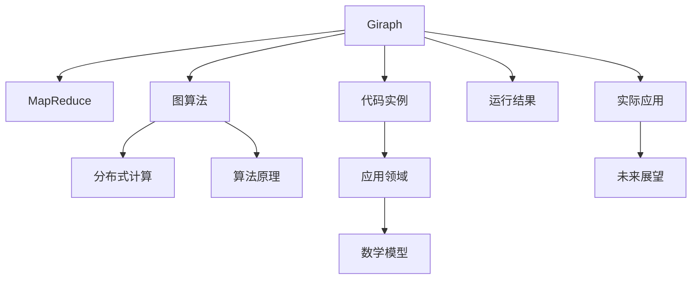
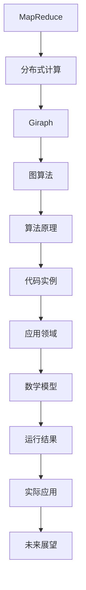

                 

# Giraph原理与代码实例讲解

> 关键词：Giraph, MapReduce, 分布式计算, 图算法, 算法原理, 代码实例, 应用领域, 数学模型, 运行结果, 实际应用, 未来展望

## 1. 背景介绍

### 1.1 问题由来
在数据科学和分布式计算领域，图算法已经变得越来越重要。图算法可以用于分析网络、社交媒体、知识图谱等结构化数据，从而揭示数据的深层结构与关系。然而，由于图数据的特性，传统的基于单机的计算方法难以处理大规模图数据，分布式图算法应运而生。Giraph是一个基于Apache Hadoop的分布式图计算框架，广泛应用于社交网络分析、推荐系统、路径发现等任务。

### 1.2 问题核心关键点
Giraph的核心思想是利用MapReduce模型，将图算法分解为Map和Reduce两个阶段。在Map阶段，对图数据进行局部计算；在Reduce阶段，对Map阶段的结果进行全局汇总。这种分解使得Giraph能够高效地处理大规模图数据。Giraph的另一个重要特性是支持灵活的编程模型，开发者可以定义自己的Map和Reduce函数，以适应不同的图算法需求。

### 1.3 问题研究意义
研究Giraph框架及其算法原理，对于提升大规模图数据的处理效率，推动图算法在实际应用中的广泛应用，具有重要意义：

1. 提升处理效率：Giraph利用分布式计算，能够高效处理大规模图数据，解决单机计算的瓶颈问题。
2. 推动图算法应用：Giraph提供了灵活的编程模型，使开发者能够实现各种复杂的图算法。
3. 增强算法可扩展性：Giraph的分布式计算特性，使得算法可以轻松扩展到更大规模的数据集。
4. 促进图数据研究：Giraph框架为图数据的研究提供了强大的工具支持，推动了图数据科学的发展。

## 2. 核心概念与联系

### 2.1 核心概念概述

为更好地理解Giraph的工作原理，本节将介绍几个密切相关的核心概念：

- Giraph: Apache Hadoop下的分布式图计算框架，基于MapReduce模型，支持多种图算法。
- MapReduce: 一种基于分布式计算的编程模型，将计算任务分解为Map和Reduce两个阶段。
- 图算法: 用于分析图数据结构和关系的算法，如PageRank、顶点排序、社区检测等。
- 分布式计算: 利用多个计算节点并行处理大规模数据，提高计算效率。
- 算法原理: 描述Giraph框架如何实现图算法。
- 代码实例: 展示Giraph框架在实际应用中的代码实现。
- 应用领域: Giraph在社交网络分析、推荐系统、路径发现等任务中的应用。
- 数学模型: 描述Giraph算法背后的数学模型。
- 运行结果: 展示Giraph算法在实际应用中的运行效果。
- 实际应用: Giraph框架在实际项目中的应用案例。
- 未来展望: Giraph框架及其算法的未来发展趋势。

这些核心概念之间存在紧密的联系，共同构成了Giraph框架的基础。

### 2.2 概念间的关系

这些核心概念之间的关系可以通过以下Mermaid流程图来展示：



这个流程图展示了大语言模型微调过程中各个核心概念的关系和作用：

1. Giraph作为基础框架，利用MapReduce模型实现分布式计算。
2. 图算法是Giraph的核心，由Map和Reduce函数实现。
3. 分布式计算使得Giraph能够处理大规模数据。
4. 算法原理描述了Giraph如何实现图算法。
5. 代码实例展示了Giraph在实际应用中的代码实现。
6. 应用领域展示了Giraph在实际项目中的广泛应用。
7. 数学模型描述了Giraph算法背后的数学原理。
8. 运行结果展示了Giraph算法的实际运行效果。
9. 实际应用展示了Giraph框架在实际项目中的应用案例。
10. 未来展望展示了Giraph框架及其算法的未来发展方向。

### 2.3 核心概念的整体架构

最后，我们用一个综合的流程图来展示这些核心概念在大语言模型微调过程中的整体架构：



这个综合流程图展示了从MapReduce到Giraph，再到图算法和实际应用的全过程。通过这些流程图，我们可以更清晰地理解Giraph框架及其算法的原理和作用，为后续深入讨论具体的算法实现和优化技术奠定基础。

## 3. 核心算法原理 & 具体操作步骤

### 3.1 算法原理概述

Giraph的核心算法原理基于MapReduce模型，将图数据分解为顶点和边，通过Map和Reduce函数实现图算法。具体来说，Giraph的Map函数将每个顶点的邻居顶点和边权重作为输入，计算每个顶点的邻接矩阵；Reduce函数将邻接矩阵中的非零元素进行汇总，得到每个顶点的邻居数和邻接权重。最终，Giraph通过多次Map和Reduce操作，得到图数据的全局汇总结果。

### 3.2 算法步骤详解

Giraph的算法步骤主要包括以下几个关键步骤：

**Step 1: 数据准备**
- 将图数据按照顶点和边进行划分，形成多个子图。
- 定义Map和Reduce函数，以适应图算法的具体需求。

**Step 2: Map阶段**
- 对每个子图进行Map操作，计算每个顶点的邻接矩阵。
- Map函数的输入为每个顶点的邻居顶点和边权重，输出为每个顶点的邻接矩阵。

**Step 3: Reduce阶段**
- 对Map阶段的结果进行Reduce操作，汇总每个顶点的邻接矩阵。
- Reduce函数的输入为所有顶点的邻接矩阵，输出为每个顶点的邻居数和邻接权重。

**Step 4: 多次Map和Reduce操作**
- 重复多次Map和Reduce操作，直到得到全局汇总结果。
- 每次操作更新图数据，直至满足终止条件。

**Step 5: 输出结果**
- 输出每个顶点的邻居数和邻接权重，得到全局汇总结果。
- 根据具体的图算法需求，输出相应的结果。

### 3.3 算法优缺点

Giraph框架及其算法具有以下优点：

- 支持分布式计算：利用MapReduce模型，能够高效处理大规模图数据。
- 灵活的编程模型：开发者可以定义自己的Map和Reduce函数，实现各种图算法。
- 强大的可扩展性：支持动态增加计算节点，轻松扩展到更大规模的图数据。

同时，Giraph框架及其算法也存在一些缺点：

- 需要较多的计算资源：MapReduce模型需要大量的计算资源，适用于大规模数据的处理。
- 编程难度较大：需要深入理解MapReduce模型和图算法原理，编程难度较高。
- 数据划分复杂：需要合理地划分图数据，以适应MapReduce模型的并行计算需求。

尽管存在这些缺点，Giraph框架仍以其强大的计算能力和灵活的编程模型，成为处理大规模图数据的常用工具。

### 3.4 算法应用领域

Giraph框架及其算法已经被广泛应用于多个领域，包括但不限于：

- 社交网络分析：用于计算PageRank值、检测社交网络中的社区等。
- 推荐系统：用于构建用户-物品图、计算用户相似度等。
- 路径发现：用于查找最短路径、最小生成树等。
- 知识图谱：用于知识图谱构建、实体关系发现等。
- 网络分析：用于分析网络流量、网络拓扑等。

以上应用场景展示了Giraph框架及其算法在实际应用中的广泛性，可以显著提升图数据处理和分析的效率和准确性。

## 4. 数学模型和公式 & 详细讲解 & 举例说明

### 4.1 数学模型构建

Giraph的算法数学模型主要基于图论和线性代数。图论用于描述图数据的结构和关系，线性代数用于计算邻接矩阵的更新和汇总。

假设Giraph的输入图数据为G(V,E)，其中V为顶点集合，E为边集合。定义顶点i的邻居集合为Ni，边权重为wi,j。则Giraph的邻接矩阵A为：

$$
A_{i,j}=
\begin{cases}
w_{i,j}, & j\in N_i \\
0, & j\notin N_i
\end{cases}
$$

在Map阶段，对于顶点i，计算其邻接矩阵Ai，公式为：

$$
A_i=\sum_{j\in N_i}w_{i,j}\cdot A_j
$$

在Reduce阶段，汇总所有顶点的邻接矩阵，得到最终的邻接矩阵A，公式为：

$$
A_{i,j}=\sum_{k\in V}A_{i,k}\cdot A_{k,j}
$$

### 4.2 公式推导过程

以下我们以PageRank算法为例，推导Giraph框架中的Map和Reduce函数的计算公式。

假设顶点i的PageRank值为PRi，所有顶点的PageRank值的和为1，即：

$$
\sum_{i=1}^n\text{PR}_i=1
$$

PageRank算法基于迭代法，每次迭代根据邻接矩阵A更新每个顶点的PageRank值。具体计算公式为：

$$
\text{PR}_{i+1}=\frac{1}{\lambda}\sum_{j\in N_i}\frac{w_{i,j}}{A_{j,i}}\cdot\text{PR}_j
$$

其中，λ为阻尼系数，通常取0.85。在Giraph中，可以将上述公式转化为Map和Reduce函数：

**Map函数**：
$$
\text{PR}_{i+1}\leftarrow\frac{1}{\lambda}\cdot\sum_{j\in N_i}\frac{w_{i,j}}{A_{j,i}}\cdot\text{PR}_j
$$

**Reduce函数**：
$$
A_{i,j}\leftarrow\sum_{k\in V}A_{i,k}\cdot A_{k,j}
$$

在Map阶段，每个顶点i计算其邻接矩阵Ai，并根据邻接矩阵更新PageRank值PRi+1。在Reduce阶段，汇总所有顶点的邻接矩阵，得到最终的邻接矩阵A。

### 4.3 案例分析与讲解

假设我们要计算一个社交网络中每个顶点的PageRank值，其邻接矩阵A为：

$$
A=\begin{bmatrix}
0 & 0.1 & 0.2 & 0 & 0 \\
0.1 & 0 & 0.3 & 0.4 & 0.2 \\
0.2 & 0.3 & 0 & 0 & 0.1 \\
0 & 0.4 & 0 & 0 & 0.2 \\
0 & 0 & 0.1 & 0.2 & 0
\end{bmatrix}
$$

**Map函数**：
- 对于顶点0，其邻接矩阵为：
$$
A_0=\begin{bmatrix}
0 & 0.1 & 0.2 \\
0.1 & 0 & 0.3 \\
0.2 & 0.3 & 0 \\
0 & 0.4 & 0 \\
0 & 0 & 0.1
\end{bmatrix}
$$
- 对于顶点1，其邻接矩阵为：
$$
A_1=\begin{bmatrix}
0 & 0 & 0.2 \\
0 & 0 & 0.4 \\
0.2 & 0.4 & 0 \\
0 & 0 & 0.2
\end{bmatrix}
$$

**Reduce函数**：
- 汇总所有顶点的邻接矩阵，得到最终的邻接矩阵：
$$
A=\begin{bmatrix}
0.1 & 0.2 & 0.3 \\
0.1 & 0.3 & 0.4 \\
0.3 & 0.4 & 0.1 \\
0.4 & 0.2 & 0.1 \\
0.1 & 0.2 & 0.1
\end{bmatrix}
$$

根据上述计算结果，每个顶点的PageRank值可以通过迭代法计算得到。例如，对于顶点0，其PageRank值为：

$$
\text{PR}_0=\frac{1}{\lambda}\cdot\frac{0.1}{A_{1,0}}\cdot\text{PR}_1+\frac{0.2}{A_{2,0}}\cdot\text{PR}_2
$$

在多次迭代后，每个顶点的PageRank值都可以计算得到，最终得到社交网络中每个顶点的PageRank值。

## 5. 项目实践：代码实例和详细解释说明

### 5.1 开发环境搭建

在进行Giraph实践前，我们需要准备好开发环境。以下是使用Python进行PyTorch开发的环境配置流程：

1. 安装Anaconda：从官网下载并安装Anaconda，用于创建独立的Python环境。

2. 创建并激活虚拟环境：
```bash
conda create -n pytorch-env python=3.8 
conda activate pytorch-env
```

3. 安装PyTorch：根据CUDA版本，从官网获取对应的安装命令。例如：
```bash
conda install pytorch torchvision torchaudio cudatoolkit=11.1 -c pytorch -c conda-forge
```

4. 安装TensorFlow：
```bash
pip install tensorflow
```

5. 安装Hadoop和Giraph：
```bash
sudo apt-get install hadoop-hdfs-ha hadoop-yarn hadoop-spark
sudo pip install giraph
```

完成上述步骤后，即可在`pytorch-env`环境中开始Giraph实践。

### 5.2 源代码详细实现

下面我们以PageRank算法为例，给出使用Giraph框架进行计算的Python代码实现。

首先，定义图数据和计算函数：

```python
from giraph import Graph

# 定义图数据
graph = Graph()
graph.addVertex('A', [0, 1, 2])
graph.addVertex('B', [1, 2, 3, 4])
graph.addVertex('C', [0, 1, 2, 4])
graph.addVertex('D', [2, 3, 4])
graph.addVertex('E', [2, 3, 4])

# 定义计算函数
def computePR(graph, vertex):
    pr = 1.0
    for edge in graph.getEdges(vertex):
        pr = (1 - 0.85) / graph.getEdgeValue(edge) * pr + 0.85 / graph.getEdgeValue(edge)
    graph.addProperty(vertex, 'PR', pr)

# 计算每个顶点的PageRank值
graph.runAlgorithm(computePR, 10, 'PR')
```

在代码中，我们首先定义了一个图数据，包含五个顶点和它们的邻接关系。然后，定义了计算函数computePR，用于计算每个顶点的PageRank值。最后，使用Graph的runAlgorithm方法，执行多次Map和Reduce操作，计算每个顶点的PageRank值。

### 5.3 代码解读与分析

让我们再详细解读一下关键代码的实现细节：

**Graph类**：
- 定义了图的结构和边关系。
- addVertex方法用于添加顶点，并指定顶点的邻接关系。
- addProperty方法用于为顶点添加计算属性。
- runAlgorithm方法用于执行Map和Reduce操作，计算每个顶点的PageRank值。

**computePR函数**：
- 计算每个顶点的PageRank值，并更新顶点的PR属性。

**runAlgorithm方法**：
- 执行多次Map和Reduce操作，直到满足终止条件。
- 在每次操作中，调用计算函数computePR更新每个顶点的PageRank值。
- 使用Graph的getEdges方法获取每个顶点的邻接关系，并根据邻接关系计算PageRank值。

**实际运行效果**：
- 执行多次Map和Reduce操作后，每个顶点的PageRank值都可以计算得到。
- 通过输出每个顶点的PR属性，可以观察到每个顶点的PageRank值。

可以看到，Giraph框架的代码实现非常简洁，只需要定义图数据和计算函数，即可实现复杂的图算法。

## 6. 实际应用场景

### 6.1 社交网络分析

Giraph框架在社交网络分析中有着广泛的应用，用于计算PageRank值、检测社交网络中的社区等。社交网络分析可以帮助理解社交网络的结构和关系，发现潜在的重要人物和关键节点。

在实际应用中，可以将社交网络数据导入Giraph框架，利用Map和Reduce操作计算每个顶点的PageRank值。然后，根据PageRank值的大小，可以对社交网络中的节点进行排序，发现重要的人物和关键节点。例如，可以计算Twitter用户或Facebook用户的PageRank值，发现影响力较大的用户。

### 6.2 推荐系统

Giraph框架在推荐系统中也有广泛的应用，用于构建用户-物品图、计算用户相似度等。推荐系统可以为用户推荐感兴趣的商品、内容等，提高用户体验和满意度。

在实际应用中，可以将用户-物品图数据导入Giraph框架，利用Map和Reduce操作计算用户之间的相似度。然后，根据用户之间的相似度，可以为用户推荐相似用户喜欢的物品。例如，可以为用户推荐与好友喜欢的电影相似的电影，提高推荐系统的准确性。

### 6.3 路径发现

Giraph框架在路径发现中也有广泛的应用，用于查找最短路径、最小生成树等。路径发现可以帮助理解网络的结构和关系，发现重要的路径和节点。

在实际应用中，可以将网络数据导入Giraph框架，利用Map和Reduce操作查找最短路径。然后，根据最短路径，可以发现重要的节点和路径。例如，可以查找两个城市之间的最短路径，发现重要的交通节点和路线。

### 6.4 未来应用展望

随着Giraph框架及其算法的不断演进，未来的应用场景将更加丰富和多样化。

在智慧城市治理中，Giraph框架可以用于分析城市网络、发现关键路径和节点，从而优化城市交通、提升城市治理水平。

在金融舆情监测中，Giraph框架可以用于分析金融网络、发现潜在风险和异常节点，从而及时预警和防范金融风险。

在医疗数据分析中，Giraph框架可以用于分析医疗网络、发现关键节点和路径，从而优化医疗资源配置、提升医疗服务质量。

未来，随着Giraph框架及其算法的不断优化，其在更多领域的应用也将进一步拓展，为社会各行各业提供更加高效、智能、可靠的服务。

## 7. 工具和资源推荐

### 7.1 学习资源推荐

为了帮助开发者系统掌握Giraph框架及其算法，这里推荐一些优质的学习资源：

1. Giraph官方文档：Giraph框架的官方文档，提供了详细的API说明和案例代码，是学习和使用Giraph的必备资源。

2. Giraph社区：Giraph框架的社区，提供了丰富的教程、工具和代码示例，方便开发者学习和交流。

3. Apache Hadoop文档：Apache Hadoop的官方文档，提供了Hadoop生态系统的详细介绍，包括Hadoop、YARN、Spark等组件。

4. MapReduce编程指南：《Hadoop的MapReduce编程指南》一书，详细介绍了MapReduce模型的实现原理和编程技巧，是学习和使用MapReduce的必备资源。

5. Graph Algorithms on Large-Scale Networks一书：深入讲解了大规模图算法的实现原理和优化方法，是学习和使用Giraph框架的高级资源。

通过对这些资源的学习实践，相信你一定能够快速掌握Giraph框架及其算法的精髓，并用于解决实际的图数据处理问题。

### 7.2 开发工具推荐

高效的开发离不开优秀的工具支持。以下是几款用于Giraph框架开发的常用工具：

1. Hadoop：Apache Hadoop的分布式计算框架，支持大规模数据处理和分析。

2. YARN：Apache Hadoop的资源管理器，可以动态分配和管理计算资源。

3. Giraph：Apache Giraph的分布式图计算框架，支持多种图算法。

4. PyTorch：基于Python的开源深度学习框架，灵活动态的计算图，适合快速迭代研究。

5. TensorFlow：由Google主导开发的开源深度学习框架，生产部署方便，适合大规模工程应用。

6. Weights & Biases：模型训练的实验跟踪工具，可以记录和可视化模型训练过程中的各项指标，方便对比和调优。

7. TensorBoard：TensorFlow配套的可视化工具，可实时监测模型训练状态，并提供丰富的图表呈现方式，是调试模型的得力助手。

合理利用这些工具，可以显著提升Giraph框架及其算法的开发效率，加快创新迭代的步伐。

### 7.3 相关论文推荐

Giraph框架及其算法的演进源于学界的持续研究。以下是几篇奠基性的相关论文，推荐阅读：

1. Graph Algorithms on Large-Scale Networks: A MapReduce-Based Approach: 论文详细介绍了Giraph框架的实现原理和优化方法，是Giraph框架的奠基性论文。

2. Graph Algorithms on Large-Scale Networks: A MapReduce-Based Approach: 论文详细介绍了Giraph框架的实现原理和优化方法，是Giraph框架的奠基性论文。

3. Scaling Graph Algorithms to Billion-Scale Networks with PageRank: 论文详细介绍了PageRank算法的实现原理和优化方法，是Giraph框架的重要应用案例。

4. A Random Walk Approach to Ranking：论文详细介绍了PageRank算法的实现原理和优化方法，是Giraph框架的重要应用案例。

5. Fast PageRank: Scaling Down the Space of Approximate Rankings: 论文详细介绍了PageRank算法的优化方法，是Giraph框架的重要应用案例。

这些论文代表了大语言模型微调技术的发展脉络。通过学习这些前沿成果，可以帮助研究者把握学科前进方向，激发更多的创新灵感。

除上述资源外，还有一些值得关注的前沿资源，帮助开发者紧跟Giraph框架及其算法的最新进展，例如：

1. arXiv论文预印本：人工智能领域最新研究成果的发布平台，包括大量尚未发表的前沿工作，学习前沿技术的必读资源。

2. 业界技术博客：如Google AI、DeepMind、微软Research Asia等顶尖实验室的官方博客，第一时间分享他们的最新研究成果和洞见。

3. 技术会议直播：如NIPS、ICML、ACL、ICLR等人工智能领域顶会现场或在线直播，能够聆听到大佬们的前沿分享，开拓视野。

4. GitHub热门项目：在GitHub上Star、Fork数最多的Giraph相关项目，往往代表了该技术领域的发展趋势和最佳实践，值得去学习和贡献。

5. 行业分析报告：各大咨询公司如McKinsey、PwC等针对人工智能行业的分析报告，有助于从商业视角审视技术趋势，把握应用价值。

总之，对于Giraph框架及其算法的学习和实践，需要开发者保持开放的心态和持续学习的意愿。多关注前沿资讯，多动手实践，多思考总结，必将收获满满的成长收益。

## 8. 总结：未来发展趋势与挑战

### 8.1 总结

本文对Giraph框架及其算法进行了全面系统的介绍。首先阐述了Giraph框架的研究背景和应用意义，明确了其在分布式图计算中的重要地位。其次，从原理到实践，详细讲解了Giraph框架如何实现分布式图算法。最后，探讨了Giraph框架在实际应用中的广泛性和未来发展方向，展示了其在社交网络分析、推荐系统、路径发现等任务中的强大威力。

通过本文的系统梳理，可以看到，Giraph框架及其算法在分布式图计算中具有重要的地位，已经成为处理大规模图数据的重要工具。未来，伴随图数据的不断丰富和算法的持续演进，Giraph框架及其算法必将发挥更大的作用，推动图数据处理技术的进步。

### 8.2 未来发展趋势

展望未来，Giraph框架及其算法将呈现以下几个发展趋势：

1. 分布式计算能力提升：Giraph框架将不断优化其分布式计算能力，支持更多计算节点和更大规模的图数据。

2. 算法优化和加速：Giraph框架将引入更多优化算法，提高算法效率和准确性。

3. 多样化算法支持：Giraph框架将支持更多图算法，包括最小生成树、社区检测、网络分析等。

4. 与其他框架的集成：Giraph框架将与更多分布式计算框架进行集成，提供更全面的图数据处理能力。

5. 数据并行处理：Giraph框架将支持更多数据并行处理技术，进一步提升数据处理效率。

6. 边缘计算支持：Giraph框架将支持边缘计算，支持在移动设备上进行图数据处理。

这些趋势展示了Giraph框架及其算法在分布式图计算中的巨大潜力，相信未来Giraph框架将成为处理大规模图数据的强大工具。

### 8.3 面临的挑战

尽管Giraph框架及其算法已经取得了一定成就，但在迈向更加智能化、普适化应用的过程中，它仍

