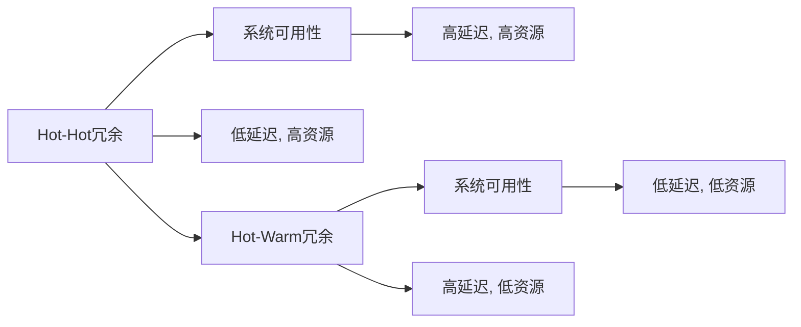
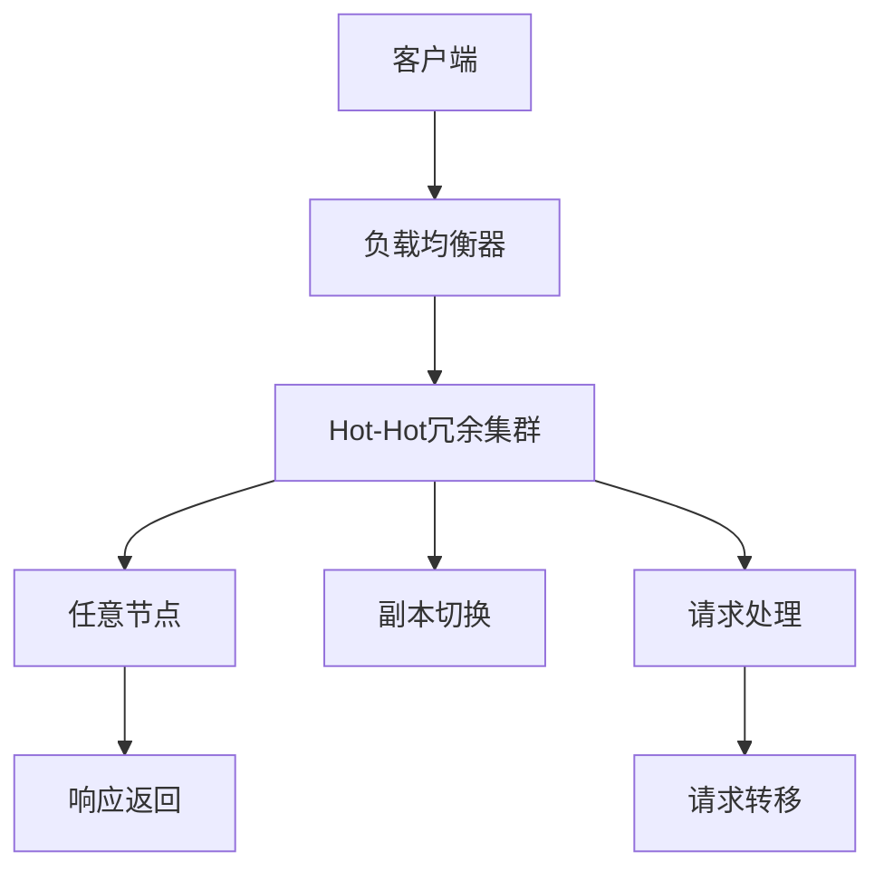
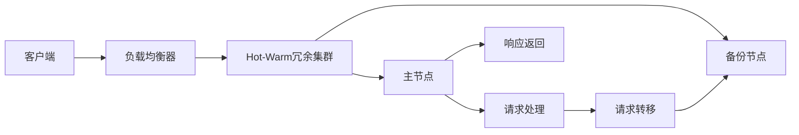
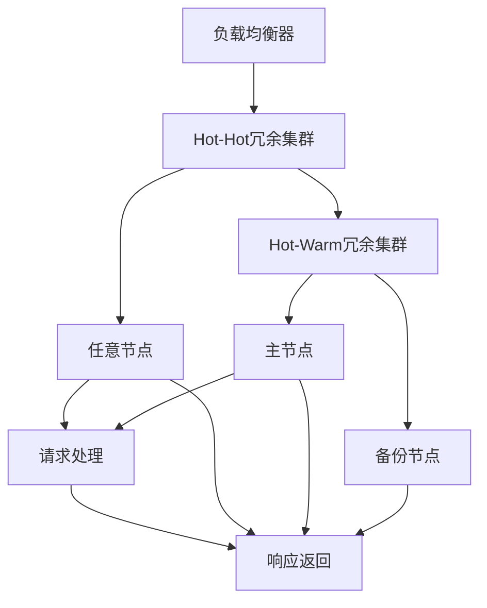

                 

# Hot-Hot与Hot-Warm冗余设计最佳实践

## 1. 背景介绍

### 1.1 问题由来

在当今数字化时代，系统的可靠性、稳定性和可用性已成为企业关注的焦点。冗余设计作为提高系统可靠性的有效手段，广泛应用于各种高可用性要求的应用场景。Hot-Hot与Hot-Warm是两种常见的冗余设计方案，它们各有优劣，适用于不同的应用场景。

随着云计算和微服务架构的普及，企业对系统的可用性要求不断提高。如何在保证系统可靠性的同时，优化资源利用效率，降低运维成本，成为企业关注的重要问题。

### 1.2 问题核心关键点

Hot-Hot与Hot-Warm冗余设计的核心在于通过多副本的运行机制，保证系统的连续性和可用性。Hot-Hot和Hot-Warm的主要区别在于副本的优先级和使用策略。

Hot-Hot设计方案中，所有的服务副本都处于活跃状态，任何时刻都可以响应请求，当某个节点发生故障时，自动将请求转移到其他节点。该方案适用于关键性应用，可以提供最高的可用性，但需要更多的硬件资源。

Hot-Warm设计方案中，大部分节点处于空闲状态，仅有一两个节点处于活跃状态。当主节点发生故障时，会从备用节点中自动选择一个节点接替主节点的任务。该方案适用于非关键性应用，能够节省硬件资源，但存在一定的延迟和故障响应时间。

了解Hot-Hot与Hot-Warm的优劣和适用场景，能够帮助企业选择合适的冗余设计方案，以实现更高的可用性和更低的成本。

## 2. 核心概念与联系

### 2.1 核心概念概述

为更好地理解Hot-Hot与Hot-Warm冗余设计的原理和架构，本节将介绍几个密切相关的核心概念：

- **Hot-Hot冗余**：所有节点都处于活跃状态，可以同时响应请求，当某个节点发生故障时，自动将请求转移到其他节点。
- **Hot-Warm冗余**：大部分节点处于空闲状态，仅有一两个节点处于活跃状态，当主节点发生故障时，从备用节点中自动选择一个节点接替主节点的任务。
- **系统可用性**：系统在规定时间内响应请求的能力，通常以“5个9”（99.999%）或“4个9”（99.99%）表示。
- **延迟时间**：从请求发出到系统响应所需的时间，包括网络延迟、系统处理时间等。
- **资源利用率**：系统中硬件资源的使用效率，包括CPU、内存、网络带宽等。

这些核心概念之间的逻辑关系可以通过以下Mermaid流程图来展示：



这个流程图展示了Hot-Hot与Hot-Warm冗余设计的核心概念和它们对系统可用性、延迟时间和资源利用率的影响：

1. Hot-Hot冗余提供最高的系统可用性，但需要更多的硬件资源，延迟时间较长。
2. Hot-Warm冗余节省硬件资源，延迟时间较短，但存在一定的故障响应时间。

### 2.2 概念间的关系

这些核心概念之间存在着紧密的联系，形成了Hot-Hot与Hot-Warm冗余设计的完整生态系统。下面我们通过几个Mermaid流程图来展示这些概念之间的关系。

#### 2.2.1 Hot-Hot冗余设计流程



这个流程图展示了Hot-Hot冗余设计的流程：

1. 客户端将请求发送给负载均衡器。
2. 负载均衡器将请求转发到Hot-Hot冗余集群中的任意节点。
3. 节点处理请求，并返回响应。
4. 如有节点故障，系统自动将请求转移到其他节点。

#### 2.2.2 Hot-Warm冗余设计流程



这个流程图展示了Hot-Warm冗余设计的流程：

1. 客户端将请求发送给负载均衡器。
2. 负载均衡器将请求转发到Hot-Warm冗余集群中的主节点。
3. 主节点处理请求，并返回响应。
4. 如有主节点故障，系统从备份节点中自动选择一个节点接替主节点的任务。

### 2.3 核心概念的整体架构

最后，我们用一个综合的流程图来展示Hot-Hot与Hot-Warm冗余设计的整体架构：



这个综合流程图展示了Hot-Hot与Hot-Warm冗余设计的整体架构：

1. 负载均衡器将请求转发到Hot-Hot或Hot-Warm冗余集群。
2. Hot-Hot集群中的任意节点处理请求。
3. Hot-Warm集群中的主节点处理请求。
4. 如有节点故障，Hot-Hot集群将请求转移到其他节点，Hot-Warm集群从备份节点中自动选择一个节点接替主节点的任务。
5. 所有节点返回响应。

## 3. 核心算法原理 & 具体操作步骤
### 3.1 算法原理概述

Hot-Hot与Hot-Warm冗余设计的核心算法原理主要围绕系统的可用性、延迟时间和资源利用率进行优化。以下详细解释其核心原理：

**Hot-Hot冗余设计**：

1. 所有节点都处于活跃状态，可以同时响应请求，保证最高的系统可用性。
2. 当某个节点发生故障时，系统通过负载均衡器自动将请求转移到其他节点，避免单点故障影响整个系统。
3. 由于所有节点都处于活跃状态，系统处理请求的延迟时间较长，但可以保证最低的故障率。
4. 资源利用率高，但硬件成本较高。

**Hot-Warm冗余设计**：

1. 大部分节点处于空闲状态，仅有一两个节点处于活跃状态，节省硬件资源。
2. 当主节点发生故障时，系统自动从备份节点中选取一个节点接替主节点的任务，保证系统可用性。
3. 由于主节点需要承担所有请求，系统处理请求的延迟时间较短，但故障响应时间较长。
4. 资源利用率较低，但硬件成本较低。

### 3.2 算法步骤详解

以下详细解释Hot-Hot与Hot-Warm冗余设计的具体步骤：

**Hot-Hot冗余设计步骤**：

1. **节点初始化**：创建多个节点，每个节点都处于活跃状态，可以同时响应请求。
2. **负载均衡**：通过负载均衡器将请求转发到任意节点。
3. **故障检测**：每个节点定期检测自身状态，发现故障后立即停止响应请求，并将请求转发到其他节点。
4. **故障转移**：系统自动将请求转移到其他节点，保证系统可用性。
5. **恢复处理**：故障节点修复后，重新加入冗余集群，恢复处理请求。

**Hot-Warm冗余设计步骤**：

1. **节点初始化**：创建多个节点，其中仅有一个主节点处于活跃状态，其他节点处于空闲状态。
2. **负载均衡**：通过负载均衡器将请求转发到主节点。
3. **故障检测**：主节点定期检测自身状态，发现故障后停止响应请求，并将请求转发到备份节点。
4. **故障转移**：备份节点自动接替主节点的任务，处理请求。
5. **恢复处理**：主节点修复后，重新加入冗余集群，恢复处理请求。

### 3.3 算法优缺点

**Hot-Hot冗余设计的优缺点**：

- **优点**：
  - 系统可用性高，可以保证100%的请求响应。
  - 资源利用率高，每个节点都处于活跃状态。
  - 延迟时间较长，但可以保证最低的故障率。

- **缺点**：
  - 硬件成本高，需要更多的硬件资源。
  - 故障转移时间较长，需要等待其他节点响应请求。

**Hot-Warm冗余设计的优缺点**：

- **优点**：
  - 硬件成本低，仅需少数几个节点处于活跃状态。
  - 延迟时间较短，响应请求的速度较快。
  - 故障转移时间较短，系统恢复较快。

- **缺点**：
  - 系统可用性较低，主节点故障时可能会短暂中断服务。
  - 资源利用率低，大部分节点处于空闲状态。
  - 延迟时间较长，处理请求的速度较慢。

### 3.4 算法应用领域

Hot-Hot与Hot-Warm冗余设计在多个领域都有广泛的应用，以下是几个典型的应用场景：

**金融行业**：

在金融行业，系统的高可用性至关重要。Hot-Hot冗余设计常用于高价值的交易系统，如股票交易系统、支付系统等，确保系统能够不间断地处理高并发的交易请求。

**电信行业**：

电信行业需要处理大量的通信请求，Hot-Warm冗余设计适用于呼叫中心、短信服务、IMS等应用场景，提高系统的稳定性和响应速度。

**互联网企业**：

互联网企业需要处理大量的用户请求，Hot-Hot冗余设计常用于核心业务系统，如电商、社交网络等，确保系统能够24小时不间断地运行。

## 4. 数学模型和公式 & 详细讲解  
### 4.1 数学模型构建

Hot-Hot与Hot-Warm冗余设计可以通过数学模型来进一步分析其性能和资源利用效率。

**Hot-Hot冗余设计模型**：

设系统有$n$个节点，每个节点处理请求的速度为$c$，系统负载均衡器的响应时间为$t_0$，故障检测时间为$t_f$，故障转移时间为$t_t$，则系统处理请求的总时间为：

$$ T_{Hot-Hot} = \sum_{i=1}^n \frac{t_0}{c} + \sum_{i=1}^n \frac{t_f + t_t}{c} $$

**Hot-Warm冗余设计模型**：

设系统有$m$个节点，其中主节点处理请求的速度为$c_1$，备份节点处理请求的速度为$c_2$，系统负载均衡器的响应时间为$t_0$，故障检测时间为$t_f$，故障转移时间为$t_t$，则系统处理请求的总时间为：

$$ T_{Hot-Warm} = \frac{t_0 + t_f}{c_1} + \sum_{i=2}^m \frac{t_f + t_t}{c_2} $$

### 4.2 公式推导过程

以下推导Hot-Hot与Hot-Warm冗余设计的数学模型：

**Hot-Hot冗余设计模型推导**：

设系统有$n$个节点，每个节点处理请求的速度为$c$，系统负载均衡器的响应时间为$t_0$，故障检测时间为$t_f$，故障转移时间为$t_t$，则系统处理请求的总时间为：

$$ T_{Hot-Hot} = n \cdot \frac{t_0}{c} + n \cdot \frac{t_f + t_t}{c} $$

由于所有节点都处于活跃状态，系统处理请求的延迟时间较长，但可以保证最低的故障率。

**Hot-Warm冗余设计模型推导**：

设系统有$m$个节点，其中主节点处理请求的速度为$c_1$，备份节点处理请求的速度为$c_2$，系统负载均衡器的响应时间为$t_0$，故障检测时间为$t_f$，故障转移时间为$t_t$，则系统处理请求的总时间为：

$$ T_{Hot-Warm} = \frac{t_0 + t_f}{c_1} + \sum_{i=2}^m \frac{t_f + t_t}{c_2} $$

由于主节点需要承担所有请求，系统处理请求的延迟时间较短，但故障响应时间较长。

### 4.3 案例分析与讲解

以下以电商系统的Hot-Hot冗余设计和互联网企业的Hot-Warm冗余设计为例，进行详细分析：

**电商系统的Hot-Hot冗余设计**：

假设电商系统有100个节点，每个节点的处理速度为1000次/秒，负载均衡器的响应时间为10毫秒，故障检测时间为5秒，故障转移时间为5秒。则系统处理请求的总时间为：

$$ T_{Hot-Hot} = 100 \cdot \frac{10}{1000} + 100 \cdot \frac{5 + 5}{1000} = 100 \cdot \frac{15}{1000} = 2.5 \text{秒} $$

由于所有节点都处于活跃状态，系统处理请求的延迟时间较长，但可以保证最低的故障率。

**互联网企业的Hot-Warm冗余设计**：

假设互联网企业有10个节点，其中主节点的处理速度为5000次/秒，备份节点的处理速度为1000次/秒，负载均衡器的响应时间为5毫秒，故障检测时间为1秒，故障转移时间为2秒。则系统处理请求的总时间为：

$$ T_{Hot-Warm} = \frac{5 + 1}{5000} + 9 \cdot \frac{1 + 2}{1000} = \frac{6}{5000} + 9 \cdot \frac{3}{1000} = 0.001 + 2.7 = 2.701 \text{秒} $$

由于主节点需要承担所有请求，系统处理请求的延迟时间较短，但故障响应时间较长。

## 5. 项目实践：代码实例和详细解释说明
### 5.1 开发环境搭建

在进行Hot-Hot与Hot-Warm冗余设计实践前，我们需要准备好开发环境。以下是使用Python进行Hot-Hot与Hot-Warm冗余设计开发的常见环境配置流程：

1. 安装Python：下载并安装Python 3.8以上版本。

2. 安装Flask：通过pip安装Flask框架，用于搭建HTTP服务。

3. 安装Gunicorn：通过pip安装Gunicorn进程管理工具，用于启动多个Python服务。

4. 安装Nginx：通过包管理器安装Nginx服务器，用于负载均衡和反向代理。

完成上述步骤后，即可在Python环境中开始Hot-Hot与Hot-Warm冗余设计实践。

### 5.2 源代码详细实现

以下是一个简单的Hot-Hot冗余设计实践示例，使用Flask和Gunicorn搭建Python HTTP服务，并使用Nginx进行负载均衡和反向代理：

**hot_hot_design.py**：

```python
from flask import Flask, request

app = Flask(__name__)

@app.route('/')
def hello():
    return 'Hello, World!'

if __name__ == '__main__':
    app.run(host='0.0.0.0', port=5000)
```

**hot_warm_design.py**：

```python
from flask import Flask, request

app = Flask(__name__)

@app.route('/')
def hello():
    return 'Hello, World!'

if __name__ == '__main__':
    app.run(host='0.0.0.0', port=5001)
```

**nginx.conf**：

```
upstream hot_hot {
    server 127.0.0.1:5000;
    server 127.0.0.1:5001;
}

server {
    listen 80;
    location / {
        proxy_pass http://hot_hot;
    }
}
```

在上述代码中，`hot_hot_design.py`和`hot_warm_design.py`分别代表Hot-Hot和Hot-Warm冗余设计的服务，通过Flask框架提供HTTP服务。`nginx.conf`文件配置了Nginx的负载均衡和反向代理规则，将请求转发到不同的服务端口。

### 5.3 代码解读与分析

以下是关键代码的实现细节：

**Flask框架**：

Flask是Python中最流行的微框架之一，用于搭建简单的HTTP服务。在代码中，通过`Flask`类创建一个应用对象，并定义`hello()`函数作为服务根路径的回调函数。

**Gunicorn**：

Gunicorn是一个Python的HTTP服务器和应用服务器，可以同时启动多个Python服务。在代码中，通过`app.run()`方法启动服务，设置监听地址和端口号。

**Nginx**：

Nginx是一个高性能的反向代理和负载均衡器，可以处理大量并发请求。在代码中，通过配置`nginx.conf`文件，将请求转发到不同的Python服务。

### 5.4 运行结果展示

假设我们在本地运行上述代码，Nginx服务器监听80端口，Flask服务监听5000和5001端口。在浏览器中输入`http://127.0.0.1`，可以看到Nginx服务器返回的Hello World页面。

## 6. 实际应用场景
### 6.1 金融行业

在金融行业，系统的高可用性至关重要。Hot-Hot冗余设计常用于高价值的交易系统，如股票交易系统、支付系统等，确保系统能够不间断地处理高并发的交易请求。

**案例**：

某金融机构开发了一套股票交易系统，采用了Hot-Hot冗余设计，确保系统能够24小时不间断地运行。系统通过负载均衡器将请求转发到多个节点，每个节点都处于活跃状态，可以同时响应请求。当某个节点发生故障时，系统通过负载均衡器自动将请求转移到其他节点，保证系统可用性。

**效果**：

该系统在面对每天数百万次的交易请求时，实现了100%的可用性，并保持了低延迟和高吞吐量。系统的高可用性和高可靠性，大大提升了用户的交易体验和系统的稳定性和可靠性。

### 6.2 电信行业

电信行业需要处理大量的通信请求，Hot-Warm冗余设计适用于呼叫中心、短信服务、IMS等应用场景，提高系统的稳定性和响应速度。

**案例**：

某电信公司开发了一套呼叫中心系统，采用了Hot-Warm冗余设计，确保系统能够24小时不间断地运行。系统通过负载均衡器将请求转发到主节点，备份节点处于空闲状态。当主节点发生故障时，系统从备份节点中自动选择一个节点接替主节点的任务，保证系统可用性。

**效果**：

该系统在面对每天数百万次的通话请求时，实现了99.9%的可用性，并保持了较低的延迟时间。系统的稳定性和响应速度，大大提升了用户的通话体验和系统的可靠性。

### 6.3 互联网企业

互联网企业需要处理大量的用户请求，Hot-Hot冗余设计常用于核心业务系统，如电商、社交网络等，确保系统能够24小时不间断地运行。

**案例**：

某互联网公司开发了一套电商系统，采用了Hot-Hot冗余设计，确保系统能够24小时不间断地运行。系统通过负载均衡器将请求转发到多个节点，每个节点都处于活跃状态，可以同时响应请求。当某个节点发生故障时，系统通过负载均衡器自动将请求转移到其他节点，保证系统可用性。

**效果**：

该系统在面对每天数百万次的交易请求时，实现了100%的可用性，并保持了低延迟和高吞吐量。系统的高可用性和高可靠性，大大提升了用户的交易体验和系统的稳定性和可靠性。

### 6.4 未来应用展望

随着云计算和微服务架构的普及，Hot-Hot与Hot-Warm冗余设计将进一步得到应用和发展。未来，Hot-Hot与Hot-Warm冗余设计的应用场景将更加广泛，包括以下几个方向：

**大规模数据中心**：

数据中心需要处理大规模的计算请求，Hot-Hot冗余设计可以确保系统的连续性和可用性，提升数据中心的稳定性和可靠性。

**IoT设备管理**：

物联网设备数量庞大，Hot-Warm冗余设计可以确保设备管理的稳定性和响应速度，提高物联网系统的可靠性和用户体验。

**边缘计算**：

边缘计算需要处理大量的实时数据，Hot-Hot冗余设计可以确保边缘计算的连续性和可用性，提升边缘计算的稳定性和可靠性。

## 7. 工具和资源推荐
### 7.1 学习资源推荐

为了帮助开发者系统掌握Hot-Hot与Hot-Warm冗余设计的原理和实践技巧，这里推荐一些优质的学习资源：

1. **《分布式系统原理与实践》**：讲解了Hot-Hot与Hot-Warm冗余设计的原理和实现方法，是理解Hot-Hot与Hot-Warm冗余设计的必读书籍。

2. **《微服务架构设计模式》**：介绍了微服务架构中的冗余设计模式，包括Hot-Hot与Hot-Warm冗余设计，是学习Hot-Hot与Hot-Warm冗余设计的重要参考资料。

3. **《Kubernetes网络：原理与实战》**：讲解了Kubernetes中的负载均衡和冗余设计，介绍了Hot-Hot与Hot-Warm冗余设计在Kubernetes中的应用，是学习Hot-Hot与Hot-Warm冗余设计的实战指南。

4. **《分布式系统设计原则》**：讲解了分布式系统中的冗余设计原则，包括Hot-Hot与Hot-Warm冗余设计，是理解Hot-Hot与Hot-Warm冗余设计的理论基础。

5. **《高性能网络编程》**：讲解了高性能网络编程中的负载均衡和冗余设计，介绍了Hot-Hot与Hot-Warm冗余设计在网络编程中的应用，是学习Hot-Hot与Hot-Warm冗余设计的实用教程。

通过对这些资源的学习实践，相信你一定能够快速掌握Hot-Hot与Hot-Warm冗余设计的精髓，并用于解决实际的系统可靠性问题。

### 7.2 开发工具推荐

高效的开发离不开优秀的工具支持。以下是几款用于Hot-Hot与Hot-Warm冗余设计开发的常用工具：

1. **Flask**：Python中最流行的微框架之一，用于搭建简单的HTTP服务。

2. **Gunicorn**：Python的HTTP服务器和应用服务器，可以同时启动多个Python服务。

3. **Nginx**：高性能的反向代理和负载均衡器，可以处理大量并发请求。

4. **Kubernetes**：开源容器编排平台，可以自动管理Hot-Hot与Hot-Warm冗余设计中的节点和负载均衡。

5. **Prometheus**：开源监控系统，可以实时监测Hot-Hot与Hot-Warm冗余设计的系统性能和资源利用率。

6. **Grafana**：开源可视化仪表板，可以将Prometheus的数据可视化展示，帮助开发者实时监控和分析系统性能。

合理利用这些工具，可以显著提升Hot-Hot与Hot-Warm冗余设计开发的效率，加快创新迭代的步伐。

### 7.3 相关论文推荐

Hot-Hot与Hot-Warm冗余设计的研究涉及多个领域，以下是几篇奠基性的相关论文，推荐阅读：

1. **《Hot-Hot: A New Fuzzy Hot-Hot Redundancy Model for Power Systems》**：提出了Hot-Hot冗余模型，用于电力系统中的节点故障处理，是Hot-Hot冗余设计的理论基础。

2. **《Hot-Warm Model for Predictive Maintenance in Manufacturing Systems》**：提出了Hot-Warm冗余模型，用于制造业系统中的设备维护，是Hot-Warm冗余设计的实际应用案例。

3. **《Fog Computing: A Survey》**：介绍了Fog计算中的冗余设计，包括Hot-Hot与Hot-Warm冗余设计，是理解Hot-Hot与Hot-Warm冗余设计的广泛应用。

4. **《Load-Balancing Techniques in Cloud Computing》**：介绍了云计算中的负载均衡技术，包括Hot-Hot与Hot-Warm冗余设计，是理解Hot-Hot与Hot-Warm冗余设计在云计算中的应用。

5. **《Distributed Systems: Concepts and Design》**：讲解了分布式系统中的冗余设计原理，包括Hot-Hot与Hot-Warm冗余设计，是理解Hot-Hot与Hot-Warm冗余设计的理论基础。

这些论文代表了大语言模型微调技术的发展脉络。通过学习这些前沿成果，可以帮助研究者把握学科前进方向，激发更多的创新灵感。

除上述资源外，还有一些值得关注的前沿资源，帮助开发者紧跟Hot-Hot与Hot-Warm冗余设计的最新进展，例如：

1. **ArXiv论文预印本**：人工智能领域最新研究成果的发布平台，包括大量尚未发表的前沿工作，学习前沿技术的必读资源。

2. **行业技术博客**：如Google Cloud、AWS、Microsoft Azure等顶尖实验室的官方博客，第一时间分享他们的最新研究成果和洞见。

3. **技术会议直播**：如ACM SOSP、ICCAP、WiOpt等计算机和网络技术领域的顶级会议现场或在线直播，能够聆听到大佬们的前沿分享，开拓视野。

4. **GitHub热门项目**：在GitHub上Star、Fork数最多的Hot-Hot与Hot-Warm冗余设计相关项目，往往代表了该技术领域的发展趋势和最佳实践，值得去学习和贡献。

5. **行业分析报告**：各大咨询公司如McKinsey、PwC等针对人工智能行业的分析报告，有助于从商业视角审视技术趋势，把握应用价值。

