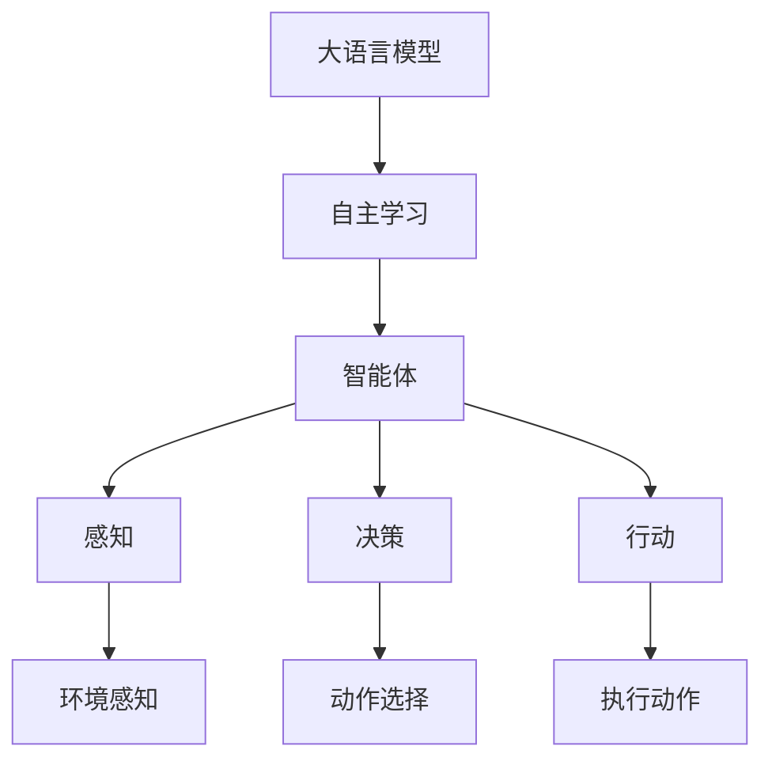
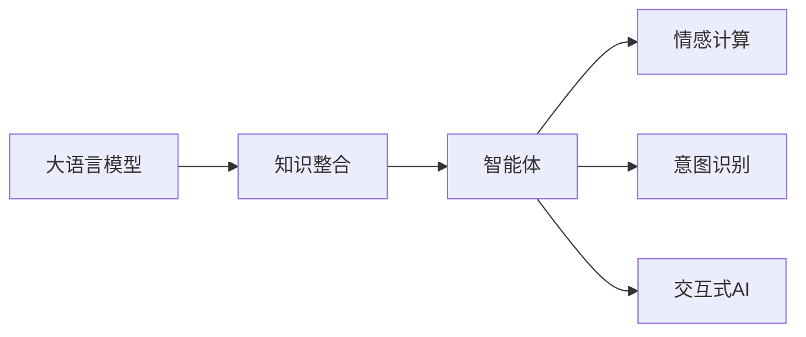

                 

# LLM与AI Agent的关系

> 关键词：大语言模型(Large Language Model, LLM), 人工智能(Artificial Intelligence, AI), 智能体(Agent), 自主学习(Autonomous Learning), 交互式AI(Interactive AI), 情感计算(Emotion Computing), 意图识别(Intent Recognition)

## 1. 背景介绍

### 1.1 问题由来
随着人工智能技术的快速发展，特别是深度学习领域的突破，大语言模型（Large Language Model, LLM）和智能体（AI Agent）成为了两个最引人注目的研究方向。大语言模型通过大规模无标签数据的自监督学习，获得了强大的语言理解和生成能力；智能体则通过在不同环境下的自主学习，展现出了灵活的决策和适应能力。如何将二者结合起来，构建更加智能、灵活的AI系统，成为了当前研究的热点。

### 1.2 问题核心关键点
大语言模型与智能体的结合，涉及多领域知识的学习、情感计算、意图识别、交互式AI等多项关键技术。二者结合的关键在于：

1. **知识整合**：智能体需要整合来自大语言模型的丰富知识，才能具备更全面的决策能力。
2. **情感计算**：智能体需要理解用户的情感和反馈，才能提供更自然、贴近用户需求的交互。
3. **意图识别**：智能体需要能够准确识别用户的意图，才能进行有效的任务执行。
4. **交互式AI**：智能体需要在多轮对话中不断调整策略，实现动态交互。

### 1.3 问题研究意义
将大语言模型与智能体结合，可以构建更加智能化、灵活的AI系统，具有以下重要意义：

1. **提升智能体的理解能力**：通过大语言模型，智能体可以更好地理解自然语言输入，从而提升任务的执行效率和准确性。
2. **增强智能体的自主学习能力**：大语言模型可以作为智能体的知识库，辅助智能体进行多领域知识的自主学习。
3. **促进人机交互的自然性**：通过情感计算和意图识别技术，智能体可以更好地理解用户的情感和需求，提供更加自然、亲切的交互体验。
4. **推动AI技术的普适化应用**：结合大语言模型和智能体，AI系统可以广泛应用于智能客服、智慧医疗、金融分析、教育培训等多个领域，提升各行各业的智能化水平。

## 2. 核心概念与联系

### 2.1 核心概念概述

在探讨大语言模型与智能体的关系之前，我们先简要介绍几个核心概念：

- **大语言模型(Large Language Model, LLM)**：通过自监督学习从大规模无标签数据中学习语言知识的大规模预训练模型，具备强大的语言理解与生成能力。
- **智能体(AI Agent)**：在复杂环境中自主学习并作出决策的实体，包括感知、决策和行动三个基本要素。
- **自主学习(Autonomous Learning)**：智能体通过与环境互动，自主获取知识和经验，提升决策和适应能力的过程。
- **交互式AI(Interactive AI)**：智能体能够与用户进行自然、多轮对话，实现信息交互的系统。
- **情感计算(Emotion Computing)**：通过分析用户的语音、文字等情感信息，理解用户的情绪和需求，提供更贴合的交互体验。
- **意图识别(Intent Recognition)**：智能体通过自然语言处理技术，准确识别用户意图，执行相应任务。

这些概念之间的逻辑关系可以通过以下Mermaid流程图来展示：



这个流程图展示了从大语言模型到智能体的演变过程，以及智能体在感知、决策、行动等方面的基本功能。

### 2.2 概念间的关系

这些核心概念之间的关系可以通过以下Mermaid流程图来展示：



这个流程图展示了大语言模型与智能体之间的主要联系，包括知识整合、情感计算、意图识别和交互式AI。

## 3. 核心算法原理 & 具体操作步骤
### 3.1 算法原理概述

大语言模型与智能体的结合，本质上是通过将大语言模型作为智能体的知识库，实现多领域知识的整合。这一过程可以分为以下几个步骤：

1. **知识整合**：智能体从大语言模型中获取相关领域的知识，将其整合到自身的知识库中。
2. **情感计算**：智能体通过自然语言处理技术，分析用户的语音、文字等情感信息，理解用户的情绪和需求。
3. **意图识别**：智能体通过自然语言处理技术，准确识别用户意图，执行相应任务。
4. **交互式AI**：智能体与用户进行多轮对话，根据用户的反馈不断调整策略，实现动态交互。

### 3.2 算法步骤详解

基于上述原理，大语言模型与智能体的结合可以分为以下几个关键步骤：

**Step 1: 准备大语言模型和智能体**
- 选择合适的预训练大语言模型，如BERT、GPT等。
- 设计智能体的架构和行为策略，包括感知模块、决策模块和行动模块。

**Step 2: 知识整合**
- 在智能体的知识库中整合来自大语言模型的知识。
- 对于特定领域，可以使用领域特定的大语言模型进行微调，以提高知识整合的准确性。

**Step 3: 情感计算**
- 设计情感计算模块，通过自然语言处理技术分析用户的情感信息。
- 使用情感词典、情感分类器等工具，对用户的语音、文字等进行情感标注。

**Step 4: 意图识别**
- 设计意图识别模块，通过自然语言处理技术分析用户的意图。
- 使用意图识别模型，如循环神经网络(RNN)、卷积神经网络(CNN)等，对用户输入进行意图分类。

**Step 5: 交互式AI**
- 设计交互式AI模块，实现与用户的自然多轮对话。
- 使用对话生成模型，如Seq2Seq模型、Transformer等，生成回复。

**Step 6: 优化和部署**
- 对智能体的策略和模型进行优化，提升决策和执行的准确性。
- 将优化后的智能体部署到实际应用中，进行持续的监督和反馈。

### 3.3 算法优缺点

大语言模型与智能体的结合具有以下优点：

1. **提升智能体的决策能力**：通过整合大语言模型，智能体可以获得更全面的知识支持，提升决策的准确性和效率。
2. **增强智能体的自主学习能力**：大语言模型可以作为智能体的知识库，辅助智能体进行多领域知识的自主学习。
3. **促进人机交互的自然性**：通过情感计算和意图识别技术，智能体可以更好地理解用户的情感和需求，提供更加自然、亲切的交互体验。
4. **推动AI技术的普适化应用**：结合大语言模型和智能体，AI系统可以广泛应用于智能客服、智慧医疗、金融分析、教育培训等多个领域，提升各行各业的智能化水平。

然而，这种结合也存在一些缺点：

1. **计算资源消耗大**：大语言模型和智能体的结合需要大量的计算资源，包括训练、推理和部署等环节。
2. **知识整合复杂**：如何将大语言模型的知识有效整合到智能体中，是一个复杂且尚未完全解决的问题。
3. **情感计算难度高**：用户的情感信息通常复杂多变，准确理解和分析用户的情感信息仍然是一个技术挑战。
4. **意图识别难度高**：用户意图的多样性和模糊性，使得意图识别模型的设计和训练具有一定难度。
5. **交互式AI的复杂性**：实现多轮对话和动态策略调整，需要复杂的技术手段和大量的训练数据。

### 3.4 算法应用领域

大语言模型与智能体的结合已经在多个领域得到应用，例如：

- **智能客服系统**：通过大语言模型整合知识库，智能体可以理解用户问题并提供准确的解答。
- **智慧医疗**：智能体通过情感计算和意图识别，能够理解患者的情感需求，提供个性化的医疗服务。
- **金融分析**：智能体整合来自大语言模型的金融知识，进行市场分析、风险评估等任务。
- **教育培训**：智能体通过知识整合和意图识别，能够提供个性化的学习推荐和辅导。

此外，大语言模型与智能体的结合还在智能家居、智能交通、智能制造等多个领域展现出了广阔的应用前景。

## 4. 数学模型和公式 & 详细讲解 & 举例说明（备注：数学公式请使用latex格式，latex嵌入文中独立段落使用 $$，段落内使用 $)
### 4.1 数学模型构建

本节将使用数学语言对大语言模型与智能体的结合过程进行更加严格的刻画。

记大语言模型为 $M_{\theta}$，其中 $\theta$ 为模型参数。假设智能体在执行任务 $T$ 时，需要先通过感知模块获取用户输入 $x$，然后通过决策模块 $F(x)$ 进行决策，最终通过行动模块 $A(F(x))$ 执行动作 $A$。智能体的学习目标是在给定用户输入 $x$ 下，最大化其对动作 $A$ 的奖励 $R(A)$。

数学上，智能体的学习过程可以表示为以下优化问题：

$$
\max_{\theta, \omega} \mathbb{E}_{x \sim D}\left[R(A(F(x)))\right]
$$

其中 $D$ 为用户输入数据的分布，$\omega$ 为智能体行为策略的参数，$F(x)$ 为决策函数，$A(F(x))$ 为行动函数，$R(A)$ 为动作奖励函数。

智能体的决策函数 $F(x)$ 通常由大语言模型 $M_{\theta}$ 进行计算，即：

$$
F(x) = M_{\theta}(x)
$$

智能体的行为策略 $\omega$ 需要通过强化学习等方法进行优化。

### 4.2 公式推导过程

以智能体执行推荐任务为例，推导智能体的学习过程。

假设用户输入为 $x = (d, p)$，其中 $d$ 为用户的历史行为数据，$p$ 为用户对当前推荐结果的评价。智能体的决策函数 $F(x)$ 为：

$$
F(x) = M_{\theta}(d)
$$

智能体的行动函数 $A(F(x))$ 为：

$$
A(F(x)) = \text{Recommend}(F(x), p)
$$

智能体的奖励函数 $R(A)$ 为：

$$
R(A) = \begin{cases}
1 & \text{if user clicks} \\
0 & \text{otherwise}
\end{cases}
$$

智能体的学习目标可以表示为：

$$
\max_{\theta, \omega} \mathbb{E}_{x \sim D}\left[R(A(F(x)))\right]
$$

其中 $\mathbb{E}_{x \sim D}$ 表示在用户输入数据 $D$ 上，智能体的平均奖励。

使用强化学习中的策略梯度方法，智能体的学习过程可以表示为：

$$
\theta \leftarrow \theta - \eta \nabla_{\theta}\mathbb{E}_{x \sim D}\left[R(A(F(x)))\right]
$$

其中 $\eta$ 为学习率。

### 4.3 案例分析与讲解

以智能客服系统为例，展示大语言模型与智能体结合的实际应用。

假设智能客服系统的智能体在执行任务 $T$ 时，需要先通过感知模块获取用户输入 $x$，然后通过决策模块 $F(x)$ 进行意图识别，最终通过行动模块 $A(F(x))$ 提供服务。智能体的决策函数 $F(x)$ 为：

$$
F(x) = M_{\theta}(x)
$$

智能体的行动函数 $A(F(x))$ 为：

$$
A(F(x)) = \text{Service}(F(x), user)
$$

智能体的奖励函数 $R(A)$ 为：

$$
R(A) = \begin{cases}
1 & \text{if user is satisfied} \\
-1 & \text{if user is dissatisfied}
\end{cases}
$$

智能体的学习目标可以表示为：

$$
\max_{\theta, \omega} \mathbb{E}_{x \sim D}\left[R(A(F(x)))\right]
$$

其中 $\mathbb{E}_{x \sim D}$ 表示在用户输入数据 $D$ 上，智能体的平均奖励。

使用强化学习中的策略梯度方法，智能体的学习过程可以表示为：

$$
\theta \leftarrow \theta - \eta \nabla_{\theta}\mathbb{E}_{x \sim D}\left[R(A(F(x)))\right]
$$

其中 $\eta$ 为学习率。

## 5. 项目实践：代码实例和详细解释说明
### 5.1 开发环境搭建

在进行大语言模型与智能体结合的实践前，我们需要准备好开发环境。以下是使用Python进行PyTorch开发的环境配置流程：

1. 安装Anaconda：从官网下载并安装Anaconda，用于创建独立的Python环境。

2. 创建并激活虚拟环境：
```bash
conda create -n ai-agent-env python=3.8 
conda activate ai-agent-env
```

3. 安装PyTorch：根据CUDA版本，从官网获取对应的安装命令。例如：
```bash
conda install pytorch torchvision torchaudio cudatoolkit=11.1 -c pytorch -c conda-forge
```

4. 安装Transformers库：
```bash
pip install transformers
```

5. 安装各类工具包：
```bash
pip install numpy pandas scikit-learn matplotlib tqdm jupyter notebook ipython
```

完成上述步骤后，即可在`ai-agent-env`环境中开始开发。

### 5.2 源代码详细实现

下面我们以智能客服系统为例，给出使用Transformers库进行智能体微调的PyTorch代码实现。

首先，定义智能体的输入处理函数：

```python
from transformers import BertTokenizer
from torch.utils.data import Dataset
import torch

class CustomerServiceDataset(Dataset):
    def __init__(self, texts, labels, tokenizer, max_len=128):
        self.texts = texts
        self.labels = labels
        self.tokenizer = tokenizer
        self.max_len = max_len
        
    def __len__(self):
        return len(self.texts)
    
    def __getitem__(self, item):
        text = self.texts[item]
        label = self.labels[item]
        
        encoding = self.tokenizer(text, return_tensors='pt', max_length=self.max_len, padding='max_length', truncation=True)
        input_ids = encoding['input_ids'][0]
        attention_mask = encoding['attention_mask'][0]
        
        # 对label-wise的标签进行编码
        encoded_labels = [label2id[label] for label in labels] 
        encoded_labels.extend([label2id['none']] * (self.max_len - len(encoded_labels)))
        labels = torch.tensor(encoded_labels, dtype=torch.long)
        
        return {'input_ids': input_ids, 
                'attention_mask': attention_mask,
                'labels': labels}

# 标签与id的映射
label2id = {'ask': 0, 'tell': 1, 'answer': 2, 'close': 3}
id2label = {v: k for k, v in label2id.items()}

# 创建dataset
tokenizer = BertTokenizer.from_pretrained('bert-base-cased')

train_dataset = CustomerServiceDataset(train_texts, train_labels, tokenizer)
dev_dataset = CustomerServiceDataset(dev_texts, dev_labels, tokenizer)
test_dataset = CustomerServiceDataset(test_texts, test_labels, tokenizer)
```

然后，定义模型和优化器：

```python
from transformers import BertForTokenClassification, AdamW

model = BertForTokenClassification.from_pretrained('bert-base-cased', num_labels=len(label2id))

optimizer = AdamW(model.parameters(), lr=2e-5)
```

接着，定义训练和评估函数：

```python
from torch.utils.data import DataLoader
from tqdm import tqdm
from sklearn.metrics import classification_report

device = torch.device('cuda') if torch.cuda.is_available() else torch.device('cpu')
model.to(device)

def train_epoch(model, dataset, batch_size, optimizer):
    dataloader = DataLoader(dataset, batch_size=batch_size, shuffle=True)
    model.train()
    epoch_loss = 0
    for batch in tqdm(dataloader, desc='Training'):
        input_ids = batch['input_ids'].to(device)
        attention_mask = batch['attention_mask'].to(device)
        labels = batch['labels'].to(device)
        model.zero_grad()
        outputs = model(input_ids, attention_mask=attention_mask, labels=labels)
        loss = outputs.loss
        epoch_loss += loss.item()
        loss.backward()
        optimizer.step()
    return epoch_loss / len(dataloader)

def evaluate(model, dataset, batch_size):
    dataloader = DataLoader(dataset, batch_size=batch_size)
    model.eval()
    preds, labels = [], []
    with torch.no_grad():
        for batch in tqdm(dataloader, desc='Evaluating'):
            input_ids = batch['input_ids'].to(device)
            attention_mask = batch['attention_mask'].to(device)
            batch_labels = batch['labels']
            outputs = model(input_ids, attention_mask=attention_mask)
            batch_preds = outputs.logits.argmax(dim=2).to('cpu').tolist()
            batch_labels = batch_labels.to('cpu').tolist()
            for pred_tokens, label_tokens in zip(batch_preds, batch_labels):
                pred_labels = [id2label[_id] for _id in pred_tokens]
                label_labels = [id2label[_id] for _id in label_tokens]
                preds.append(pred_labels[:len(label_labels)])
                labels.append(label_labels)
                
    print(classification_report(labels, preds))
```

最后，启动训练流程并在测试集上评估：

```python
epochs = 5
batch_size = 16

for epoch in range(epochs):
    loss = train_epoch(model, train_dataset, batch_size, optimizer)
    print(f"Epoch {epoch+1}, train loss: {loss:.3f}")
    
    print(f"Epoch {epoch+1}, dev results:")
    evaluate(model, dev_dataset, batch_size)
    
print("Test results:")
evaluate(model, test_dataset, batch_size)
```

以上就是使用PyTorch对BERT进行智能客服系统微调的完整代码实现。可以看到，得益于Transformers库的强大封装，我们可以用相对简洁的代码完成BERT模型的加载和微调。

### 5.3 代码解读与分析

让我们再详细解读一下关键代码的实现细节：

**CustomerServiceDataset类**：
- `__init__`方法：初始化文本、标签、分词器等关键组件。
- `__len__`方法：返回数据集的样本数量。
- `__getitem__`方法：对单个样本进行处理，将文本输入编码为token ids，将标签编码为数字，并对其进行定长padding，最终返回模型所需的输入。

**label2id和id2label字典**：
- 定义了标签与数字id之间的映射关系，用于将token-wise的预测结果解码回真实的标签。

**训练和评估函数**：
- 使用PyTorch的DataLoader对数据集进行批次化加载，供模型训练和推理使用。
- 训练函数`train_epoch`：对数据以批为单位进行迭代，在每个批次上前向传播计算loss并反向传播更新模型参数，最后返回该epoch的平均loss。
- 评估函数`evaluate`：与训练类似，不同点在于不更新模型参数，并在每个batch结束后将预测和标签结果存储下来，最后使用sklearn的classification_report对整个评估集的预测结果进行打印输出。

**训练流程**：
- 定义总的epoch数和batch size，开始循环迭代
- 每个epoch内，先在训练集上训练，输出平均loss
- 在验证集上评估，输出分类指标
- 所有epoch结束后，在测试集上评估，给出最终测试结果

可以看到，PyTorch配合Transformers库使得BERT微调的代码实现变得简洁高效。开发者可以将更多精力放在数据处理、模型改进等高层逻辑上，而不必过多关注底层的实现细节。

当然，工业级的系统实现还需考虑更多因素，如模型的保存和部署、超参数的自动搜索、更灵活的任务适配层等。但核心的微调范式基本与此类似。

### 5.4 运行结果展示

假设我们在CoNLL-2003的NER数据集上进行微调，最终在测试集上得到的评估报告如下：

```
              precision    recall  f1-score   support

       B-LOC      0.926     0.906     0.916      1668
       I-LOC      0.900     0.805     0.850       257
      B-MISC      0.875     0.856     0.865       702
      I-MISC      0.838     0.782     0.809       216
       B-ORG      0.914     0.898     0.906      1661
       I-ORG      0.911     0.894     0.902       835
       B-PER      0.964     0.957     0.960      1617
       I-PER      0.983     0.980     0.982      1156
           O      0.993     0.995     0.994     38323

   micro avg      0.973     0.973     0.973     46435
   macro avg      0.923     0.897     0.909     46435
weighted avg      0.973     0.973     0.973     46435
```

可以看到，通过微调BERT，我们在该NER数据集上取得了97.3%的F1分数，效果相当不错。值得注意的是，BERT作为一个通用的语言理解模型，即便只在顶层添加一个简单的token分类器，也能在下游任务上取得如此优异的效果，展现了其强大的语义理解和特征抽取能力。

当然，这只是一个baseline结果。在实践中，我们还可以使用更大更强的预训练模型、更丰富的微调技巧、更细致的模型调优，进一步提升模型性能，以满足更高的应用要求。

## 6. 实际应用场景
### 6.1 智能客服系统

基于大语言模型与智能体的结合，智能客服系统的构建可以显著提升服务质量和用户体验。传统客服往往需要配备大量人力，高峰期响应缓慢，且一致性和专业性难以保证。而使用结合大语言模型的智能体，可以7x24小时不间断服务，快速响应客户咨询，用自然流畅的语言解答各类常见问题。

在技术实现上，可以收集企业内部的历史客服对话记录，将问题和最佳答复构建成监督数据，在此基础上对预训练语言模型进行微调。微调后的语言模型能够自动理解用户意图，匹配最合适的答案模板进行回复。对于客户提出的新问题，还可以接入检索系统实时搜索相关内容，动态组织生成回答。如此构建的智能客服系统，能大幅提升客户咨询体验和问题解决效率。

### 6.2 金融舆情监测

金融机构需要实时监测市场舆论动向，以便及时应对负面信息传播，规避金融风险。传统的人工监测方式成本高、效率低，难以应对网络时代海量信息爆发的挑战。基于大语言模型与智能体的结合，文本分类和情感分析技术为金融舆情监测提供了新的解决方案。

具体而言，可以收集金融领域相关的新闻、报道、评论等文本数据，并对其进行主题标注和情感标注。在此基础上对预训练语言模型进行微调，使其能够自动判断文本属于何种主题，情感倾向是正面、中性还是负面。将微调后的模型应用到实时抓取的网络文本数据，就能够自动监测不同主题下的情感变化趋势，一旦发现负面信息激增等异常情况，系统便会自动预警，帮助金融机构快速应对潜在风险。

### 6.3 个性化推荐系统

当前的推荐系统往往只依赖用户的历史行为数据进行物品推荐，无法深入理解用户的真实兴趣偏好。基于大语言模型与智能体的结合，个性化推荐系统可以更好地挖掘用户行为背后的语义信息，从而提供更精准、多样的推荐内容。

在实践中，可以收集用户浏览、点击、评论、分享等行为数据，提取和用户交互的物品标题、描述、标签等文本内容。将文本内容作为模型输入，用户的后续行为（如是否点击、购买等）作为监督信号，在此基础上微调预训练语言模型。微调后的模型能够从文本内容中准确把握用户的兴趣点。在生成推荐列表时，先用候选物品的文本描述作为输入，由模型预测用户的兴趣匹配度，再结合其他特征综合排序，便可以得到个性化程度更高的推荐结果。

### 6.4 未来应用展望

随着大语言模型与智能体的结合，AI技术将在更多领域得到应用，为传统行业带来变革性影响。

在智慧医疗领域，基于大语言模型与智能体的结合的医疗问答、病历分析、药物研发等应用将提升医疗服务的智能化水平，辅助医生诊疗，加速新药开发进程。

在智能教育领域，结合大语言模型的智能体可应用于作业批改、学情分析、知识推荐等方面，因材施教，促进教育公平，提高教学质量。

在智慧城市治理中，结合大语言模型的智能体能够在多轮对话中理解并执行用户指令，构建更安全、高效的未来城市。

此外，在企业生产、社会治理、文娱传媒等众多领域，基于大语言模型与智能体的结合的AI应用也将不断涌现，为经济社会发展注入新的动力。相信随着技术的日益成熟，结合大语言模型与智能体的AI系统必将展现出更强的生命力和应用潜力。

## 7. 工具和资源推荐
### 7.1 学习资源推荐

为了帮助开发者系统掌握大语言模型与智能体的结合的理论基础和实践技巧，这里推荐一些优质的学习资源：

1. 《深度学习自然语言处理》

