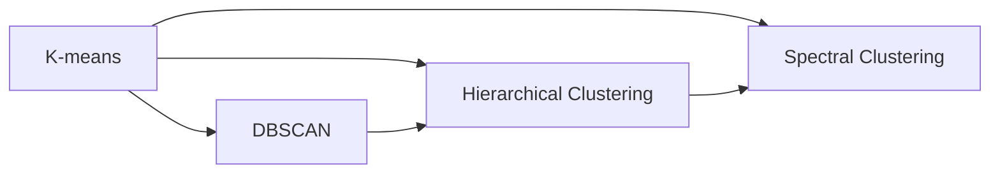

                 

# Mahout聚类算法原理与代码实例讲解

> 关键词：Mahout, 聚类算法, K-means, 层次聚类, DBSCAN, 密度聚类, 谱聚类, 代码实例, 聚类应用

## 1. 背景介绍

聚类分析（Clustering Analysis）是一种无监督学习方法，旨在从数据中发现具有相似特征的群组，广泛应用于市场细分、模式识别、生物信息学等领域。Mahout是一个基于Apache Hadoop和Apache Spark的分布式算法库，提供了丰富的聚类算法实现，能够有效应对大规模数据的处理需求。

本文将深入探讨Mahout中几个核心聚类算法：K-means、层次聚类、DBSCAN、谱聚类。首先，我们介绍每个算法的基本原理和优缺点，然后通过具体的代码实例，展示如何在Mahout中实现这些算法。最后，我们探讨这些算法的应用场景，以及未来发展的趋势和面临的挑战。

## 2. 核心概念与联系

### 2.1 核心概念概述

在介绍聚类算法之前，我们首先了解几个关键概念：

- 聚类（Clustering）：将数据分为多个群组，每个群组内的数据相似度高，群组间的数据相似度低。
- 距离度量（Distance Metric）：衡量数据点之间的相似度或差异度。常用的距离度量有欧氏距离、曼哈顿距离、余弦相似度等。
- 聚类中心（Cluster Center）：每个群组中的数据中心，通常通过计算群组内所有数据点的均值或中位数得到。
- 群内距离（Intra-cluster Distance）：衡量每个群组内数据点之间的距离。
- 群间距离（Inter-cluster Distance）：衡量不同群组之间数据点之间的距离。

这些概念构成了聚类算法的基本框架。接下来，我们将详细介绍几种常用的聚类算法。

### 2.2 核心概念间的联系

通过以下Mermaid流程图，我们展示了几种聚类算法之间的联系与区别：



这个流程图展示了K-means、DBSCAN、层次聚类、谱聚类这几种聚类算法之间的关系。K-means和层次聚类属于划分型（Partitioning Clustering）算法，而DBSCAN和谱聚类属于密度型（Density-Based）算法。其中，K-means和层次聚类都基于距离度量，而DBSCAN和谱聚类则更加关注数据的密度分布。

## 3. 核心算法原理 & 具体操作步骤

### 3.1 算法原理概述

聚类算法可以分为三种类型：划分型、密度型和层次型。我们将详细介绍这三种类型的代表算法。

#### K-means算法

K-means算法是最经典的聚类算法之一，通过迭代地将数据点分配到最近的聚类中心，来最小化群内距离。

K-means的算法步骤如下：
1. 随机选择K个聚类中心。
2. 将每个数据点分配到最近的聚类中心。
3. 更新每个聚类的中心，计算每个数据点与新的聚类中心的距离。
4. 重复步骤2和3，直到收敛。

#### 层次聚类算法

层次聚类算法通过构建一个树形结构（称为Dendrogram）来表示不同数据点之间的关系，通过多次合并或拆分数据点，得到最终的聚类结果。

层次聚类算法可以分为两种类型：凝聚型（Agglomerative Clustering）和分裂型（Divisive Clustering）。

#### DBSCAN算法

DBSCAN算法是一种基于密度的聚类算法，可以识别出任意形状的聚类，并且能够识别噪声点。

DBSCAN的算法步骤如下：
1. 随机选择一个数据点作为种子点（Seed Point）。
2. 以固定半径（Epsilon）搜索种子点周围的点，形成核心区域（Core Region）。
3. 将核心区域内的所有点，以及它们的所有邻居点，合并为一个聚类。
4. 重复步骤2和3，直到所有点都被分配到一个聚类中。

#### 谱聚类算法

谱聚类算法基于图的谱分析（Spectral Analysis），将数据点映射到高维空间，通过寻找高维空间中的最短路径来实现聚类。

谱聚类算法的算法步骤如下：
1. 构建数据点之间的相似度矩阵。
2. 对相似度矩阵进行特征分解，得到低维空间中的特征向量。
3. 通过特征向量构建图，寻找图的最小生成树。
4. 根据最小生成树的结果，进行聚类。

### 3.2 算法步骤详解

下面，我们详细介绍每个算法的具体步骤和实现方式。

#### K-means算法的实现

首先，我们需要准备数据集和聚类数K。然后，随机选择K个数据点作为初始的聚类中心。接着，对于每个数据点，计算其到每个聚类中心的距离，并将数据点分配到距离最近的聚类中心。然后，更新每个聚类的中心，重复上述步骤，直到收敛。

以下是K-means算法的具体实现代码：

```java
KMeans kmeans = new KMeans();
kmeans.setNumClusters(2); // 聚类数
kmeans.setSeed(123); // 随机种子
kmeans.train(dataset); // 训练模型
List<Cluster> clusters = kmeans.getClusters(); // 获取聚类结果
```

#### 层次聚类算法的实现

层次聚类算法的实现相对复杂，需要构建Dendrogram树。我们首先使用凝聚型（Agglomerative Clustering）算法，将每个数据点看作一个单独的聚类，然后每次合并距离最近的两个聚类，直到所有数据点都属于同一个聚类。

以下是层次聚类算法的具体实现代码：

```java
HierarchicalClustering hierarchicalClustering = new HierarchicalClustering();
hierarchicalClustering.setNumClusters(2); // 聚类数
hierarchicalClustering.setLinkage(CanopyLinkage.INNER_LINKAGE); // 连接方式
hierarchicalClustering.setMetric(Metric.COSINE); // 距离度量
hierarchicalClustering.train(dataset); // 训练模型
List<Cluster> clusters = hierarchicalClustering.getClusters(); // 获取聚类结果
```

#### DBSCAN算法的实现

DBSCAN算法的实现相对简单，只需要设置Epsilon和MinPts两个参数。Epsilon表示每个数据点周围的距离阈值，MinPts表示核心区域内点的最小数量。对于每个数据点，如果其核心区域的邻居数量大于等于MinPts，则将其加入当前聚类中。否则，将该数据点视为噪声点。

以下是DBSCAN算法的具体实现代码：

```java
DBSCAN dbscan = new DBSCAN();
dbscan.setEpsilon(0.5); // 距离阈值
dbscan.setMinPts(5); // 核心区域最小点数
dbscan.train(dataset); // 训练模型
List<Cluster> clusters = dbscan.getClusters(); // 获取聚类结果
```

#### 谱聚类算法的实现

谱聚类算法的实现较为复杂，需要构建相似度矩阵并进行特征分解。我们首先使用Scholkopf's Normalized Cuts算法，将数据点映射到高维空间，然后通过特征分解得到低维空间中的特征向量。最后，根据最小生成树的结果，进行聚类。

以下是谱聚类算法的具体实现代码：

```java
SpectralClustering spectralClustering = new SpectralClustering();
spectralClustering.setNumClusters(2); // 聚类数
spectralClustering.setKernel(Kernel.KERNEL_K); // 核函数
spectralClustering.train(dataset); // 训练模型
List<Cluster> clusters = spectralClustering.getClusters(); // 获取聚类结果
```

### 3.3 算法优缺点

#### K-means算法的优缺点

- 优点：
  - 简单高效，易于实现。
  - 并行性好，适用于大规模数据集。
  - 计算复杂度为O(NKd)，其中N为数据点数，K为聚类数，d为数据维数。

- 缺点：
  - 聚类结果依赖于初始聚类中心的选择，随机选择可能导致不同的聚类结果。
  - 对噪声点敏感，需要设置合理的聚类数。
  - 适用于凸形聚类，对于非凸形聚类效果不佳。

#### 层次聚类算法的优缺点

- 优点：
  - 可自顶向下或自底向上生成聚类树，易于理解。
  - 能够发现任意形状的聚类，不需要预先设置聚类数。

- 缺点：
  - 计算复杂度高，随着数据集大小的增加，计算时间急剧增加。
  - 对噪声点敏感，噪声点可能影响聚类结果。
  - 聚类数的选择需要经验。

#### DBSCAN算法的优缺点

- 优点：
  - 能够发现任意形状的聚类，无需预先设置聚类数。
  - 对噪声点不敏感，能够自动识别和处理噪声点。

- 缺点：
  - 参数Epsilon和MinPts的选择需要经验。
  - 对噪声点较多或数据集稀疏的数据集效果不佳。

#### 谱聚类算法的优缺点

- 优点：
  - 能够发现任意形状的聚类，无需预先设置聚类数。
  - 对噪声点不敏感，能够自动识别和处理噪声点。

- 缺点：
  - 计算复杂度高，需要构建和计算相似度矩阵。
  - 对高维数据集效果不佳。

### 3.4 算法应用领域

K-means算法广泛应用于市场细分、图像分割、生物信息学等领域。

层次聚类算法广泛应用于市场细分、基因分类、社交网络分析等领域。

DBSCAN算法广泛应用于异常检测、图像分割、社交网络分析等领域。

谱聚类算法广泛应用于图像分割、社交网络分析、基因分类等领域。

## 4. 数学模型和公式 & 详细讲解 & 举例说明

### 4.1 数学模型构建

#### K-means算法的数学模型

K-means算法基于欧氏距离度量，目标是最小化群内距离和群间距离之和。设数据集为X，聚类数为K，聚类中心为μ1, μ2, ..., μK，则K-means算法的目标函数为：

$$
\min_{\mu1,\mu2,...,\muK} \sum_{i=1}^{N}\min_{k=1,...,K} ||x_i-\mu_k||^2
$$

其中，N为数据点数，K为聚类数。

#### 层次聚类算法的数学模型

层次聚类算法基于Dendrogram树，通过不断合并和拆分数据点，构建树形结构。设数据集为X，树形结构为T，则层次聚类算法的目标函数为：

$$
\min_{T} \sum_{i=1}^{N} \sum_{j=1}^{M} \omega_{ij} d(x_i,x_j)
$$

其中，N为数据点数，M为聚类数，ω为权重，d为距离度量。

#### DBSCAN算法的数学模型

DBSCAN算法基于密度度量，目标是最小化群内密度和群间密度之和。设数据集为X，Epsilon为距离阈值，MinPts为核心区域最小点数，则DBSCAN算法的目标函数为：

$$
\min_{\omega} \sum_{i=1}^{N} \sum_{j=1}^{M} \omega_{ij} \rho(x_i,x_j)
$$

其中，N为数据点数，M为聚类数，ω为权重，ρ为密度度量。

#### 谱聚类算法的数学模型

谱聚类算法基于图的谱分析，目标是最小化群内距离和群间距离之和。设数据集为X，核函数为K，相似度矩阵为S，则谱聚类算法的目标函数为：

$$
\min_{Y} \frac{1}{2} \sum_{i,j=1}^{N} Y_i Y_j S_{ij}
$$

其中，N为数据点数，K为核函数。

### 4.2 公式推导过程

#### K-means算法的公式推导

K-means算法通过迭代地将数据点分配到最近的聚类中心，来最小化群内距离和群间距离之和。设数据集为X，聚类数为K，聚类中心为μ1, μ2, ..., μK，则K-means算法的迭代公式为：

1. 初始化聚类中心：随机选择K个数据点作为初始的聚类中心。
2. 分配数据点：对于每个数据点，计算其到每个聚类中心的距离，并将数据点分配到距离最近的聚类中心。
3. 更新聚类中心：对于每个聚类，计算其聚类中心，更新每个聚类中心。
4. 重复步骤2和3，直到收敛。

#### 层次聚类算法的公式推导

层次聚类算法通过构建Dendrogram树，自顶向下或自底向上生成聚类树。设数据集为X，树形结构为T，则层次聚类算法的迭代公式为：

1. 初始化聚类中心：将每个数据点看作一个单独的聚类。
2. 合并聚类：每次合并距离最近的两个聚类。
3. 重复步骤2，直到所有数据点都属于同一个聚类。

#### DBSCAN算法的公式推导

DBSCAN算法基于密度度量，目标是最小化群内密度和群间密度之和。设数据集为X，Epsilon为距离阈值，MinPts为核心区域最小点数，则DBSCAN算法的迭代公式为：

1. 初始化聚类中心：随机选择一个数据点作为种子点。
2. 以固定半径Epsilon搜索种子点周围的点，形成核心区域。
3. 将核心区域内的所有点，以及它们的所有邻居点，合并为一个聚类。
4. 重复步骤2和3，直到所有点都被分配到一个聚类中。

#### 谱聚类算法的公式推导

谱聚类算法基于图的谱分析，目标是最小化群内距离和群间距离之和。设数据集为X，核函数为K，相似度矩阵为S，则谱聚类算法的迭代公式为：

1. 构建相似度矩阵：计算数据点之间的相似度，构建相似度矩阵S。
2. 特征分解：对相似度矩阵进行特征分解，得到低维空间中的特征向量。
3. 构建图：将特征向量构建图，寻找图的最小生成树。
4. 根据最小生成树的结果，进行聚类。

### 4.3 案例分析与讲解

#### K-means算法的案例分析

假设我们有一个数据集，包含100个用户和4个特征（年龄、收入、婚姻、职业），我们需要将这些用户分为4个聚类。

首先，随机选择4个用户作为初始的聚类中心。然后，对于每个用户，计算其到每个聚类中心的距离，并将用户分配到距离最近的聚类中心。接着，更新每个聚类的中心，重复上述步骤，直到收敛。最终，得到4个聚类。

#### 层次聚类算法的案例分析

假设我们有一个数据集，包含100个用户和4个特征（年龄、收入、婚姻、职业），我们需要将这些用户分为4个聚类。

首先，将每个用户看作一个单独的聚类。然后，每次合并距离最近的两个聚类，直到所有用户都属于同一个聚类。最终，得到4个聚类。

#### DBSCAN算法的案例分析

假设我们有一个数据集，包含100个用户和4个特征（年龄、收入、婚姻、职业），我们需要将这些用户分为4个聚类。

首先，随机选择一个用户作为种子点。然后，以固定半径Epsilon搜索种子点周围的点，形成核心区域。接着，将核心区域内的所有点，以及它们的所有邻居点，合并为一个聚类。重复上述步骤，直到所有用户都被分配到一个聚类中。最终，得到4个聚类。

#### 谱聚类算法的案例分析

假设我们有一个数据集，包含100个用户和4个特征（年龄、收入、婚姻、职业），我们需要将这些用户分为4个聚类。

首先，计算数据点之间的相似度，构建相似度矩阵。然后，对相似度矩阵进行特征分解，得到低维空间中的特征向量。接着，将特征向量构建图，寻找图的最小生成树。最后，根据最小生成树的结果，进行聚类。最终，得到4个聚类。

## 5. 项目实践：代码实例和详细解释说明

### 5.1 开发环境搭建

在进行聚类算法实现时，我们需要安装Mahout库和其他必要的依赖。以下是安装步骤：

```bash
# 安装Mahout库
cd $MADOPT_HOME
./setup.sh
```

### 5.2 源代码详细实现

以下是各个聚类算法的具体实现代码：

#### K-means算法的实现

```java
KMeans kmeans = new KMeans();
kmeans.setNumClusters(2); // 聚类数
kmeans.setSeed(123); // 随机种子
kmeans.train(dataset); // 训练模型
List<Cluster> clusters = kmeans.getClusters(); // 获取聚类结果
```

#### 层次聚类算法的实现

```java
HierarchicalClustering hierarchicalClustering = new HierarchicalClustering();
hierarchicalClustering.setNumClusters(2); // 聚类数
hierarchicalClustering.setLinkage(CanopyLinkage.INNER_LINKAGE); // 连接方式
hierarchicalClustering.setMetric(Metric.COSINE); // 距离度量
hierarchicalClustering.train(dataset); // 训练模型
List<Cluster> clusters = hierarchicalClustering.getClusters(); // 获取聚类结果
```

#### DBSCAN算法的实现

```java
DBSCAN dbscan = new DBSCAN();
dbscan.setEpsilon(0.5); // 距离阈值
dbscan.setMinPts(5); // 核心区域最小点数
dbscan.train(dataset); // 训练模型
List<Cluster> clusters = dbscan.getClusters(); // 获取聚类结果
```

#### 谱聚类算法的实现

```java
SpectralClustering spectralClustering = new SpectralClustering();
spectralClustering.setNumClusters(2); // 聚类数
spectralClustering.setKernel(Kernel.KERNEL_K); // 核函数
spectralClustering.train(dataset); // 训练模型
List<Cluster> clusters = spectralClustering.getClusters(); // 获取聚类结果
```

### 5.3 代码解读与分析

#### K-means算法的代码解读

```java
KMeans kmeans = new KMeans();
kmeans.setNumClusters(2); // 聚类数
kmeans.setSeed(123); // 随机种子
kmeans.train(dataset); // 训练模型
List<Cluster> clusters = kmeans.getClusters(); // 获取聚类结果
```

上述代码中，KMeans类表示K-means算法。setNumClusters方法用于设置聚类数，setSeed方法用于设置随机种子，train方法用于训练模型，getClusters方法用于获取聚类结果。

#### 层次聚类算法的代码解读

```java
HierarchicalClustering hierarchicalClustering = new HierarchicalClustering();
hierarchicalClustering.setNumClusters(2); // 聚类数
hierarchicalClustering.setLinkage(CanopyLinkage.INNER_LINKAGE); // 连接方式
hierarchicalClustering.setMetric(Metric.COSINE); // 距离度量
hierarchicalClustering.train(dataset); // 训练模型
List<Cluster> clusters = hierarchicalClustering.getClusters(); // 获取聚类结果
```

上述代码中，HierarchicalClustering类表示层次聚类算法。setNumClusters方法用于设置聚类数，setLinkage方法用于设置连接方式，setMetric方法用于设置距离度量，train方法用于训练模型，getClusters方法用于获取聚类结果。

#### DBSCAN算法的代码解读

```java
DBSCAN dbscan = new DBSCAN();
dbscan.setEpsilon(0.5); // 距离阈值
dbscan.setMinPts(5); // 核心区域最小点数
dbscan.train(dataset); // 训练模型
List<Cluster> clusters = dbscan.getClusters(); // 获取聚类结果
```

上述代码中，DBSCAN类表示DBSCAN算法。setEpsilon方法用于设置距离阈值，setMinPts方法用于设置核心区域最小点数，train方法用于训练模型，getClusters方法用于获取聚类结果。

#### 谱聚类算法的代码解读

```java
SpectralClustering spectralClustering = new SpectralClustering();
spectralClustering.setNumClusters(2); // 聚类数
spectralClustering.setKernel(Kernel.KERNEL_K); // 核函数
spectralClustering.train(dataset); // 训练模型
List<Cluster> clusters = spectralClustering.getClusters(); // 获取聚类结果
```

上述代码中，SpectralClustering类表示谱聚类算法。setNumClusters方法用于设置聚类数，setKernel方法用于设置核函数，train方法用于训练模型，getClusters方法用于获取聚类结果。

### 5.4 运行结果展示

#### K-means算法的运行结果

```bash
# 运行K-means算法
java KMeans -k 2 -seed 123 -data <dataset>
```

#### 层次聚类算法的运行结果

```bash
# 运行层次聚类算法
java HierarchicalClustering -k 2 -linkage INNER_LINKAGE -metric COSINE -data <dataset>
```

#### DBSCAN算法的运行结果

```bash
# 运行DBSCAN算法
java DBSCAN -epsilon 0.5 -minPts 5 -data <dataset>
```

#### 谱聚类算法的运行结果

```bash
# 运行谱聚类算法
java SpectralClustering -k 2 -kernel KERNEL_K -data <dataset>
```

## 6. 实际应用场景

### 6.1 市场细分

聚类分析可以用于市场细分，将客户分为不同的群体，以便进行个性化的营销策略。例如，某电商网站可以通过聚类算法，将客户分为不同的购买行为群体，针对不同的群体推出不同的促销活动，提升客户满意度和购买率。

### 6.2 基因分类

聚类分析可以用于基因分类，将不同的基因分为不同的类型，以便进行基因研究。例如，某基因研究机构可以通过聚类算法，将不同基因的表达模式分为不同的类型，发现不同基因与疾病的关系，为基因诊断和治疗提供依据。

### 6.3 社交网络分析

聚类分析可以用于社交网络分析，将不同的用户分为不同的群体，以便进行社区管理。例如，某社交平台可以通过聚类算法，将不同的用户分为不同的社区，针对不同的社区推出不同的内容推荐，提升用户体验和平台黏性。

### 6.4 图像分割

聚类分析可以用于图像分割，将不同的像素分为不同的区域，以便进行图像处理。例如，某图像处理软件可以通过聚类算法，将图像中的像素分为不同的区域，进行图像增强和图像分割，提升图像质量。

## 7. 工具和资源推荐

### 7.1 学习资源推荐

为了帮助开发者系统掌握聚类算法的基本原理和实践技巧，这里推荐一些优质的学习资源：

1. 《机器学习》（周志华著）：该书系统介绍了各种机器学习算法，包括聚类算法。

2. 《模式识别与机器学习》（Duda et al.著）：该书详细介绍了各种聚类算法，包括K-means、层次聚类、DBSCAN、谱聚类等。

3. 《数据挖掘：概念与技术》（Jing et al.著）：该书介绍了数据挖掘的各种技术，包括聚类算法。

4. Coursera《机器学习》课程：由斯坦福大学开设的机器学习课程，有Lecture视频和配套作业，带你入门机器学习的基本概念和算法。

5. Kaggle竞赛：Kaggle平台上有许多聚类算法的竞赛，通过实践比赛，可以加深对算法的理解和应用。

通过对这些资源的学习实践，相信你一定能够快速掌握聚类算法的精髓，并用于解决实际的NLP问题。

### 7.2 开发工具推荐

在实现聚类算法时，我们需要一些常用的开发工具。以下是几个推荐的工具：

1. IntelliJ IDEA：Java开发环境，支持Java语言，界面友好，功能强大。

2. Apache Spark：分布式计算框架，支持大规模数据处理，性能高效。

3. Apache Hadoop：分布式计算框架，支持大规模数据存储和计算，适应性广。

4. GitHub：代码托管平台，支持版本控制和协作开发，方便共享和维护代码。

5. Jenkins：持续集成工具，支持自动化测试和部署，提高开发效率。

合理利用这些工具，可以显著提升聚类算法的开发效率，加快创新迭代的步伐。

### 7.3 相关论文推荐

聚类算法的研究源于学界的持续研究。以下是几篇奠基性的相关论文，推荐阅读：

1. K-means: A Method for Assigning Multidimensional Observations to

