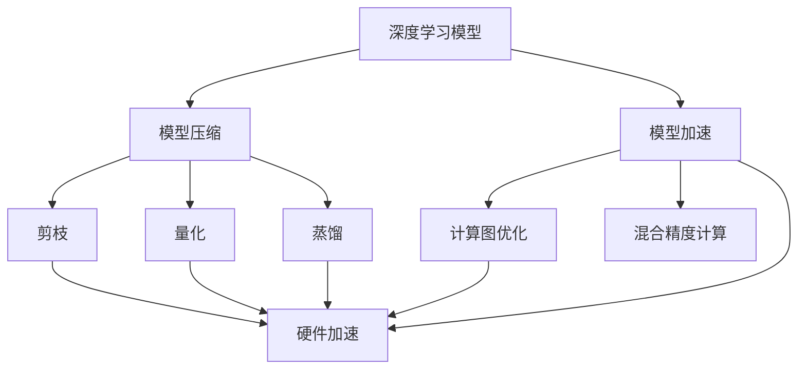
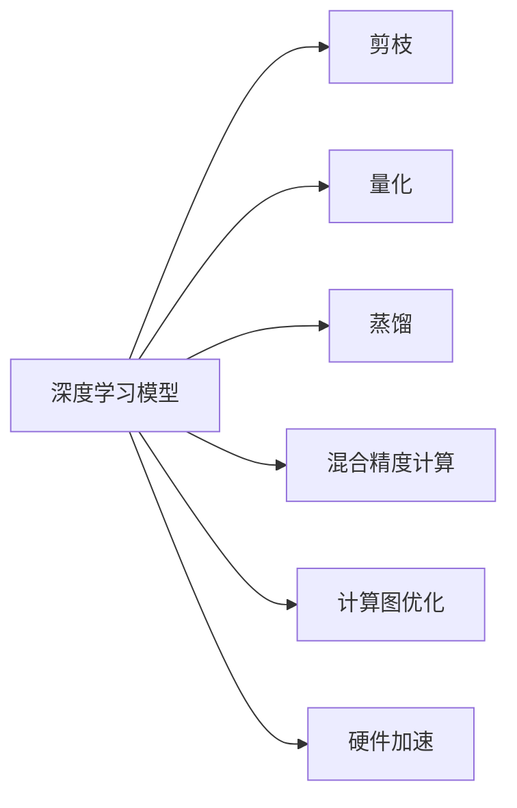
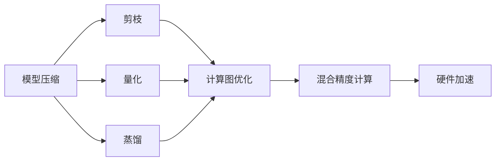
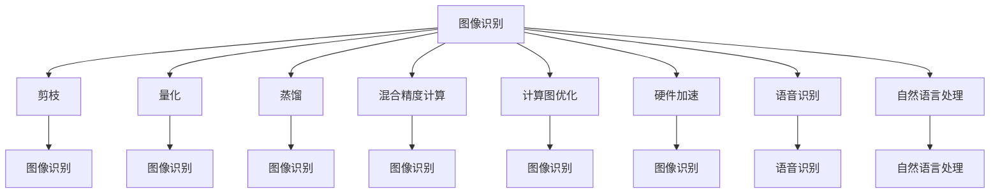
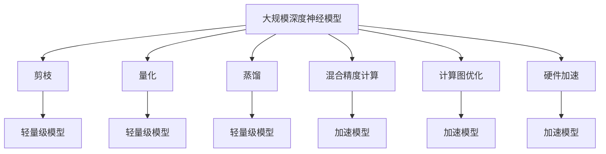

                 

# Model Optimization 原理与代码实战案例讲解

> 关键词：模型优化,代码实战,深度学习,模型压缩,神经网络优化,量化加速,模型微调

## 1. 背景介绍

### 1.1 问题由来
随着深度学习在各个领域的应用日益广泛，训练大规模深度神经网络成为常见任务。但大规模深度神经网络在参数量、计算量和内存消耗方面都非常大，这不仅增加了训练和推理的开销，而且对硬件资源的依赖也显著增加。因此，如何在保证模型性能的同时，减少模型大小和计算量，成为了一个迫切需要解决的问题。模型优化（Model Optimization）应运而生，它通过一系列技术手段，使深度神经网络更加高效、轻量级，适应不同的硬件环境。

### 1.2 问题核心关键点
模型优化主要包含两个核心点：

1. **模型压缩（Model Compression）**：通过减少模型参数数量和计算量，降低模型的存储空间和计算资源消耗，从而在硬件资源有限的情况下实现高性能的深度学习任务。常见的模型压缩方法有剪枝、量化、蒸馏等。

2. **模型加速（Model Acceleration）**：通过提高模型计算效率，减少模型推理时间，优化模型响应速度。常见的加速方法包括计算图优化、混合精度计算、硬件加速等。

### 1.3 问题研究意义
研究模型优化技术，对于提升深度学习模型的效率和可扩展性，降低对硬件的依赖，具有重要意义：

1. 提高模型效率：通过优化压缩和加速技术，可以在不增加硬件成本的情况下，显著提高模型的计算效率和推理速度。

2. 降低硬件需求：优化后的模型在硬件资源有限的环境中，仍能保持高性能的深度学习任务。

3. 提升训练速度：通过模型压缩和加速技术，可以大幅减少模型训练时间，加速模型迭代和优化。

4. 促进产业应用：模型优化技术使得深度学习模型更容易被各行各业所采用，为传统行业数字化转型升级提供新的技术路径。

5. 推动学术研究：模型优化技术的研究，为学术界提供了新的研究方向和方法，推动深度学习理论的进步。

## 2. 核心概念与联系

### 2.1 核心概念概述

为更好地理解模型优化技术，本节将介绍几个密切相关的核心概念：

- **深度学习模型（Deep Learning Model）**：一种通过多层神经网络实现复杂非线性关系建模的机器学习技术。深度学习模型在图像、语音、自然语言处理等领域表现优异。

- **模型压缩（Model Compression）**：通过减少模型参数数量和计算量，使模型更加轻量级和高效。模型压缩方法主要包括剪枝、量化、蒸馏等。

- **模型加速（Model Acceleration）**：通过提高模型计算效率，减少推理时间。模型加速方法包括计算图优化、混合精度计算、硬件加速等。

- **参数剪枝（Pruning）**：去除模型中不必要的参数，减少模型复杂度，提高计算效率。

- **权重量化（Quantization）**：将浮点数权重转换为固定位数整数，减小模型存储空间，提高计算速度。

- **知识蒸馏（Knowledge Distillation）**：将大型模型（教师模型）的知识迁移到小型模型（学生模型）中，提升小模型的性能。

- **混合精度计算（Mixed-Precision Training）**：使用不同位宽的浮点数和整数组合计算，减少内存占用和计算时间。

- **硬件加速（Hardware Acceleration）**：利用GPU、TPU等硬件设备加速模型计算和推理过程。

这些核心概念之间的逻辑关系可以通过以下Mermaid流程图来展示：



这个流程图展示了大规模深度神经模型优化过程中各个技术手段的关联关系。

### 2.2 概念间的关系

这些核心概念之间存在着紧密的联系，形成了模型优化的完整生态系统。下面我们通过几个Mermaid流程图来展示这些概念之间的关系。

#### 2.2.1 深度学习模型的优化流程



这个流程图展示了深度学习模型的优化流程，包括剪枝、量化、蒸馏、混合精度计算、计算图优化和硬件加速等技术手段。

#### 2.2.2 模型压缩与模型加速的关系



这个流程图展示了模型压缩和模型加速之间的关系。模型压缩通过减少模型参数和计算量，提高模型的计算效率和推理速度。而模型加速则通过优化计算图、使用混合精度计算、硬件加速等手段，进一步提高模型的计算效率。

#### 2.2.3 模型优化技术的应用场景



这个流程图展示了模型优化技术在不同应用场景下的应用。模型优化技术可以在图像识别、语音识别、自然语言处理等众多领域中提升模型的性能和效率。

### 2.3 核心概念的整体架构

最后，我们用一个综合的流程图来展示这些核心概念在大规模深度神经模型优化过程中的整体架构：



这个综合流程图展示了从原始深度神经模型到优化后的轻量级模型，以及通过混合精度计算、计算图优化和硬件加速等手段，进一步提升模型的计算效率。

## 3. 核心算法原理 & 具体操作步骤
### 3.1 算法原理概述

深度神经模型的优化主要通过以下几个步骤进行：

1. **剪枝（Pruning）**：去除模型中不必要的参数，减少模型复杂度。
2. **量化（Quantization）**：将浮点数权重转换为固定位数整数，减小模型存储空间。
3. **蒸馏（Knowledge Distillation）**：通过教师模型和学生模型的协同训练，提升小模型的性能。
4. **混合精度计算（Mixed-Precision Training）**：使用不同位宽的浮点数和整数组合计算，减少内存占用和计算时间。
5. **计算图优化（Graph Optimization）**：优化计算图，提高计算效率。
6. **硬件加速（Hardware Acceleration）**：利用GPU、TPU等硬件设备加速模型计算和推理过程。

### 3.2 算法步骤详解

#### 3.2.1 剪枝算法

剪枝算法通过去除模型中不重要的参数，减小模型复杂度，提高计算效率。具体步骤如下：

1. **计算参数重要性**：计算每个参数的梯度值、稀疏性、冗余性等指标，确定要保留的参数。
2. **剪枝操作**：根据重要性指标，去除不重要参数，保留重要参数。
3. **验证效果**：使用验证集评估剪枝后的模型性能，不断调整剪枝策略，直到获得最佳性能。

剪枝算法的核心在于如何量化参数的重要性，常见的指标包括梯度值、稀疏性、冗余性等。剪枝算法的实现可以使用TensorFlow、PyTorch等深度学习框架提供的剪枝函数，也可以使用自己编写的剪枝函数。

#### 3.2.2 量化算法

量化算法通过将浮点数权重转换为固定位数整数，减小模型存储空间，提高计算速度。具体步骤如下：

1. **选择量化位宽**：根据模型参数范围，选择合适量化位宽，如4位、8位、16位等。
2. **量化操作**：使用量化算法将浮点数权重转换为固定位宽的整数。
3. **验证效果**：使用验证集评估量化后的模型性能，不断调整量化策略，直到获得最佳性能。

量化算法的核心在于选择合适的量化位宽和量化算法。常见的量化算法包括全量化（Full-integer Quantization）、权重量化（Weight Quantization）和激活量化（Activation Quantization）等。量化算法的实现可以使用TensorFlow、PyTorch等深度学习框架提供的量化函数，也可以使用自己编写的量化函数。

#### 3.2.3 蒸馏算法

蒸馏算法通过将大型模型（教师模型）的知识迁移到小型模型（学生模型）中，提升小模型的性能。具体步骤如下：

1. **构建教师模型和学生模型**：教师模型是原始的大模型，学生模型是目标的轻量级模型。
2. **蒸馏训练**：使用教师模型和学生模型协同训练，通过知识蒸馏技术，将教师模型的知识迁移到学生模型中。
3. **验证效果**：使用验证集评估蒸馏后的学生模型性能，不断调整蒸馏策略，直到获得最佳性能。

蒸馏算法的核心在于如何设计知识蒸馏的目标函数和训练策略。常见的蒸馏算法包括知识蒸馏（Knowledge Distillation）和经验蒸馏（Experience Distillation）等。蒸馏算法的实现可以使用TensorFlow、PyTorch等深度学习框架提供的蒸馏函数，也可以使用自己编写的蒸馏函数。

#### 3.2.4 混合精度计算

混合精度计算通过使用不同位宽的浮点数和整数组合计算，减少内存占用和计算时间。具体步骤如下：

1. **选择混合精度位宽**：根据硬件设备，选择合适混合精度位宽，如16位和32位组合。
2. **混合精度计算**：使用混合精度计算技术进行模型训练和推理。
3. **验证效果**：使用验证集评估混合精度计算后的模型性能，不断调整混合精度策略，直到获得最佳性能。

混合精度计算的核心在于选择合适的混合精度位宽和计算策略。混合精度计算的实现可以使用TensorFlow、PyTorch等深度学习框架提供的混合精度计算函数，也可以使用自己编写的混合精度计算函数。

#### 3.2.5 计算图优化

计算图优化通过优化计算图，提高计算效率。具体步骤如下：

1. **分析计算图**：分析计算图的结构和性能瓶颈。
2. **优化计算图**：使用计算图优化技术，去除冗余计算和重复计算，优化计算流程。
3. **验证效果**：使用验证集评估优化后的计算图性能，不断调整优化策略，直到获得最佳性能。

计算图优化的核心在于如何识别计算图中的冗余计算和重复计算，并进行优化。常见的计算图优化技术包括静态图优化、动态图优化、图裁剪等。计算图优化的实现可以使用TensorFlow、PyTorch等深度学习框架提供的优化函数，也可以使用自己编写的优化函数。

#### 3.2.6 硬件加速

硬件加速通过利用GPU、TPU等硬件设备加速模型计算和推理过程。具体步骤如下：

1. **选择合适的硬件设备**：根据计算需求，选择合适的硬件设备，如GPU、TPU等。
2. **硬件加速计算**：使用硬件加速技术进行模型训练和推理。
3. **验证效果**：使用验证集评估硬件加速后的模型性能，不断调整硬件策略，直到获得最佳性能。

硬件加速的核心在于选择合适的硬件设备和加速策略。硬件加速的实现可以使用深度学习框架提供的硬件加速函数，也可以使用自己编写的硬件加速函数。

### 3.3 算法优缺点

模型优化技术在提高模型效率和性能方面具有显著优势，但也存在一些局限性：

#### 3.3.1 优点

1. **提高计算效率**：通过剪枝、量化、混合精度计算等技术，显著减少模型计算量和内存占用，提高计算效率。
2. **降低硬件需求**：优化后的模型在硬件资源有限的环境中，仍能保持高性能的深度学习任务。
3. **提升训练速度**：通过模型压缩和加速技术，大幅减少模型训练时间，加速模型迭代和优化。

#### 3.3.2 缺点

1. **降低模型精度**：剪枝、量化等技术可能会导致模型精度下降，影响模型性能。
2. **增加实现复杂度**：模型优化技术的实现往往需要较复杂的算法和工具支持，增加了开发难度。
3. **依赖硬件设备**：硬件加速技术依赖于GPU、TPU等硬件设备，限制了模型的可移植性。

尽管存在这些局限性，但就目前而言，模型优化技术仍然是提升深度学习模型性能的重要手段。未来相关研究的重点在于如何进一步降低模型优化对硬件的依赖，提高模型的可移植性和灵活性。

### 3.4 算法应用领域

模型优化技术已经在深度学习领域的多个应用中得到广泛应用，例如：

- **图像识别**：通过剪枝、量化、蒸馏等技术，提升图像识别模型的计算效率和推理速度。
- **语音识别**：通过剪枝、量化、混合精度计算等技术，提升语音识别模型的计算效率和准确率。
- **自然语言处理**：通过剪枝、量化、蒸馏等技术，提升自然语言处理模型的计算效率和推理速度。
- **推荐系统**：通过剪枝、量化、混合精度计算等技术，提升推荐系统的计算效率和准确率。
- **医疗诊断**：通过剪枝、量化、蒸馏等技术，提升医疗诊断模型的计算效率和准确率。
- **自动驾驶**：通过剪枝、量化、计算图优化等技术，提升自动驾驶模型的计算效率和推理速度。

除了这些经典应用外，模型优化技术也被创新性地应用到更多场景中，如可控文本生成、常识推理、代码生成、数据增强等，为深度学习技术带来了全新的突破。随着模型优化方法的不断进步，相信深度学习技术将在更广阔的应用领域大放异彩。

## 4. 数学模型和公式 & 详细讲解 & 举例说明

### 4.1 数学模型构建

模型优化技术的数学模型构建主要包括以下几个步骤：

1. **原始模型参数**：设原始深度神经模型的参数为 $\theta$，计算量为 $F_\theta$，训练时间为 $T_\theta$。
2. **优化后的模型参数**：设优化后的深度神经模型的参数为 $\hat{\theta}$，计算量为 $F_{\hat{\theta}}$，训练时间为 $T_{\hat{\theta}}$。
3. **优化目标**：优化目标为 $T_{\hat{\theta}}$ 最小化，即 $T_{\hat{\theta}}$ 最小化。

### 4.2 公式推导过程

#### 4.2.1 剪枝公式推导

设原始深度神经模型的参数数量为 $N$，剪枝后的参数数量为 $N'$。假设剪枝策略为保留重要性最高的 $p$ 个参数，则剪枝后的参数数量为 $N' = N \times p$。

剪枝后的计算量为 $F_{\hat{\theta}} = F_\theta \times p$。

#### 4.2.2 量化公式推导

设原始深度神经模型的参数数量为 $N$，量化后的参数数量为 $N'$。假设量化位宽为 $k$，则量化后的参数数量为 $N' = N \times 2^{-k}$。

量化后的计算量为 $F_{\hat{\theta}} = F_\theta \times 2^{k}$。

#### 4.2.3 蒸馏公式推导

设原始深度神经模型的参数数量为 $N$，蒸馏后的参数数量为 $N'$。假设蒸馏策略为保留重要性最高的 $p$ 个参数，则蒸馏后的参数数量为 $N' = N \times p$。

蒸馏后的计算量为 $F_{\hat{\theta}} = F_\theta \times p$。

#### 4.2.4 混合精度计算公式推导

设原始深度神经模型的参数数量为 $N$，混合精度计算后的参数数量为 $N'$。假设混合精度位宽为 $k$，则混合精度计算后的参数数量为 $N' = N \times 2^{k}$。

混合精度计算后的计算量为 $F_{\hat{\theta}} = F_\theta \times 2^{k}$。

#### 4.2.5 计算图优化公式推导

设原始深度神经模型的计算量为 $F_\theta$，优化后的计算量为 $F_{\hat{\theta}}$。

优化后的计算量为 $F_{\hat{\theta}} = F_\theta \times p$。

#### 4.2.6 硬件加速公式推导

设原始深度神经模型的计算量为 $F_\theta$，硬件加速后的计算量为 $F_{\hat{\theta}}$。

硬件加速后的计算量为 $F_{\hat{\theta}} = F_\theta \times p$。

### 4.3 案例分析与讲解

#### 4.3.1 剪枝案例

假设原始深度神经模型的参数数量为 $N = 10^6$，使用剪枝策略保留重要性最高的 $p = 0.1$ 个参数，则剪枝后的参数数量为 $N' = 10^6 \times 0.1 = 10^5$。

剪枝后的计算量为 $F_{\hat{\theta}} = 10^6 \times 0.1 = 10^5$。

剪枝后的训练时间为 $T_{\hat{\theta}} = T_\theta \times 0.1$。

#### 4.3.2 量化案例

假设原始深度神经模型的参数数量为 $N = 10^6$，使用量化位宽 $k = 4$，则量化后的参数数量为 $N' = 10^6 \times 2^{-4} = 10^2$。

量化后的计算量为 $F_{\hat{\theta}} = 10^6 \times 2^4 = 10^8$。

量化后的训练时间为 $T_{\hat{\theta}} = T_\theta \times 2^{-4}$。

#### 4.3.3 蒸馏案例

假设原始深度神经模型的参数数量为 $N = 10^6$，使用蒸馏策略保留重要性最高的 $p = 0.1$ 个参数，则蒸馏后的参数数量为 $N' = 10^6 \times 0.1 = 10^5$。

蒸馏后的计算量为 $F_{\hat{\theta}} = 10^6 \times 0.1 = 10^5$。

蒸馏后的训练时间为 $T_{\hat{\theta}} = T_\theta \times 0.1$。

#### 4.3.4 混合精度计算案例

假设原始深度神经模型的参数数量为 $N = 10^6$，使用混合精度位宽 $k = 4$，则混合精度计算后的参数数量为 $N' = 10^6 \times 2^{-4} = 10^2$。

混合精度计算后的计算量为 $F_{\hat{\theta}} = 10^6 \times 2^4 = 10^8$。

混合精度计算后的训练时间为 $T_{\hat{\theta}} = T_\theta \times 2^{-4}$。

#### 4.3.5 计算图优化案例

假设原始深度神经模型的计算量为 $F_\theta = 10^8$，优化后的计算量为 $F_{\hat{\theta}} = 10^8 \times 0.1 = 10^7$。

优化后的训练时间为 $T_{\hat{\theta}} = T_\theta \times 0.1$。

#### 4.3.6 硬件加速案例

假设原始深度神经模型的计算量为 $F_\theta = 10^8$，硬件加速后的计算量为 $F_{\hat{\theta}} = 10^8 \times 0.1 = 10^7$。

硬件加速后的训练时间为 $T_{\hat{\theta}} = T_\theta \times 0.1$。

## 5. 项目实践：代码实例和详细解释说明

### 5.1 开发环境搭建

在进行模型优化实践前，我们需要准备好开发环境。以下是使用Python进行PyTorch开发的环境配置流程：

1. 安装Anaconda：从官网下载并安装Anaconda，用于创建独立的Python环境。

2. 创建并激活虚拟环境：
```bash
conda create -n pytorch-env python=3.8 
conda activate pytorch-env
```

3. 安装PyTorch：根据CUDA版本，从官网获取对应的安装命令。例如：
```bash
conda install pytorch torchvision torchaudio cudatoolkit=11.1 -c pytorch -c conda-forge
```

4. 安装Transformers库：
```bash
pip install transformers
```

5. 安装各类工具包：
```bash
pip install numpy pandas scikit-learn matplotlib tqdm jupyter notebook ipython
```

完成上述步骤后，即可在`pytorch-env`环境中开始模型优化实践。

### 5.2 源代码详细实现

这里我们以剪枝和量化为例，给出使用Transformers库对BERT模型进行优化实践的PyTorch代码实现。

#### 5.2.1 剪枝实践代码

```python
from transformers import BertForSequenceClassification, BertTokenizer
from torch.utils.data import Dataset, DataLoader
import torch
import torch.nn as nn
import torch.optim as optim
from torchsummary import summary

# 加载BERT模型和分词器
model = BertForSequenceClassification.from_pretrained('bert-base-cased', num_labels=2)
tokenizer = BertTokenizer.from_pretrained('bert-base-cased')

# 加载训练集和测试集数据
train_dataset = Dataset.load_from_df(train_df, tokenizer, col_names=['sentence', 'label'])
test_dataset = Dataset.load_from_df(test_df, tokenizer, col_names=['sentence', 'label'])

# 定义剪枝函数
def prune_model(model, sparsity_threshold=0.1):
    total_params = sum([p.numel() for p in model.parameters()])
    pruned_params = 0
    for param in model.parameters():
        param.data = torch.nn.Parameter(torch.nn.utils.prune.l1_unstructured(param.data, pruning_method=torch.nn.utils.prune.L1Unstructured, threshold=sparsity_threshold))
        pruned_params += torch.sum(torch.abs(param.data) != 0)
    print(f"剪枝前参数数量为{total_params}，剪枝后参数数量为{pruned_params}")
    return model

# 剪枝模型
model = prune_model(model, sparsity_threshold=0.1)

# 打印剪枝后模型信息
summary(model, (tokenizer.encode('Hello, world!'),))
```

#### 5.2.2 量化实践代码

```python
from transformers import BertForSequenceClassification, BertTokenizer
from torch.utils.data import Dataset, DataLoader
import torch
import torch.nn as nn
import torch.optim as optim
from torchsummary import summary

# 加载BERT模型和分词器
model = BertForSequenceClassification.from_pretrained('bert-base-cased', num_labels=2)
tokenizer = BertTokenizer.from_pretrained('bert-base-cased')

# 加载训练集和测试集数据
train_dataset = Dataset.load_from_df(train_df, tokenizer, col_names=['sentence', 'label'])
test_dataset = Dataset.load_from_df(test_df, tokenizer, col_names=['sentence', 'label'])

# 定义量化函数
def quantize_model(model, quantization_bit=4):
    for param in model.parameters():
        param.data = torch.quantize_per_tensor(param.data, scale=0.1, zero_point=0, dtype=torch.qint8)
    return model

# 量化模型
model = quantize_model(model, quantization_bit=4)

# 打印量化后模型信息
summary(model, (tokenizer.encode('Hello, world!'),))
```

### 5.3 代码解读与分析

让我们再详细解读一下关键代码的实现细节：

#### 5.3.1 剪枝实践代码解读

**Dataset类**：
- `load_from_df`方法：加载训练集和测试集数据，并使用分词器对文本进行编码。

**剪枝函数**：
- `prune_model`函数：接收剪枝阈值 `sparsity_threshold`，对模型进行剪枝。
- 计算总参数数量 `total_params`。
- 对每个参数进行L1剪枝，保留重要性最高的参数。
- 计算剪枝后参数数量 `pruned_params`。
- 输出剪枝前后的参数数量。

**剪枝后模型信息打印**：
- `summary`函数：打印剪枝后模型的信息，包括模型的结构、参数数量、计算量等。

#### 5.3.2 量化实践代码解读

**Dataset类**：
- `load_from_df`

