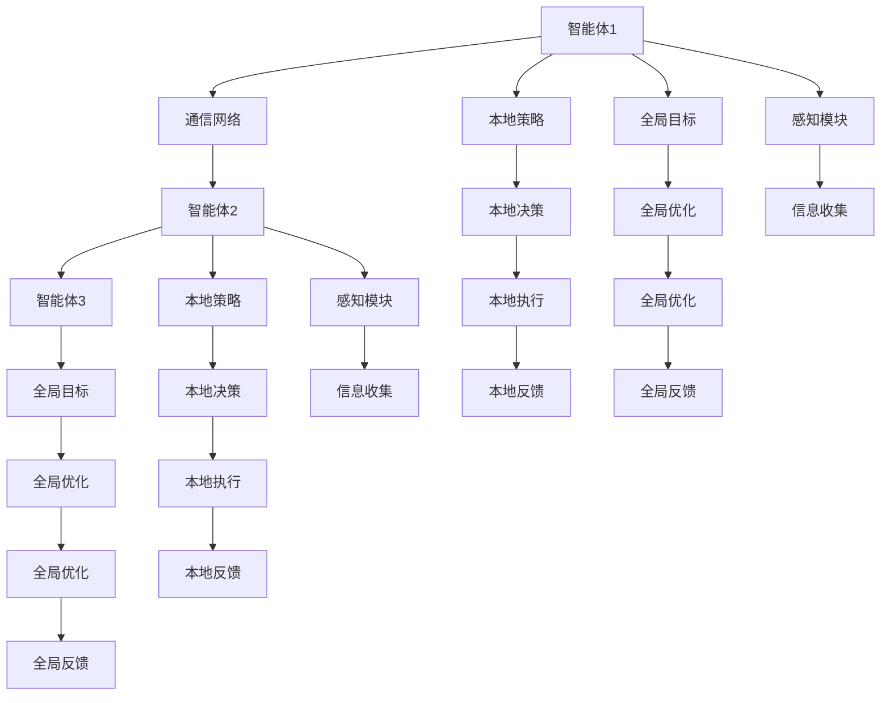
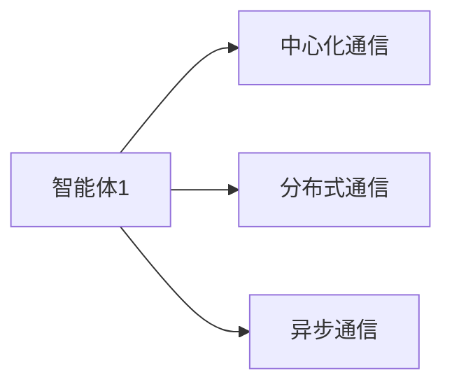
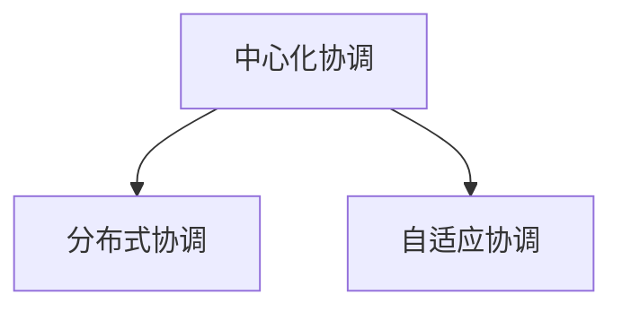
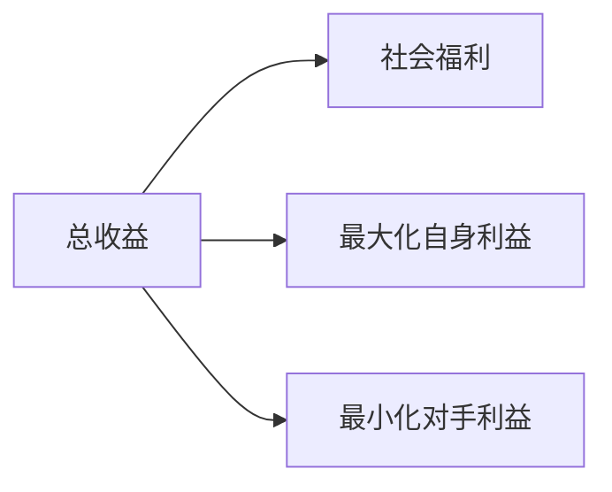
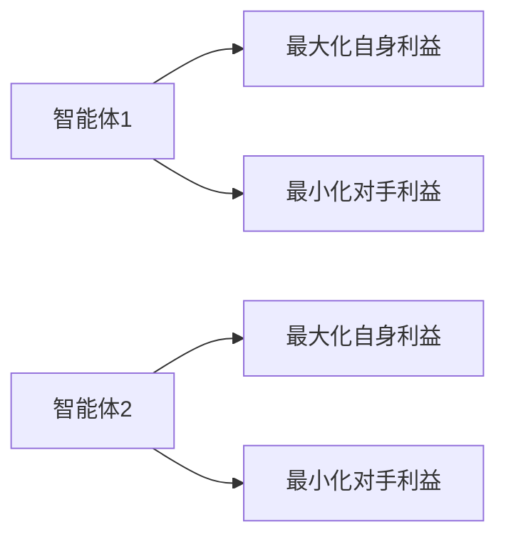

                 

## 1. 背景介绍

在人工智能发展的历程中，单智能体(Single-Agent)的方法已不再能够满足复杂场景的需求。随着技术的不断进步，多智能体(Multi-Agent)协作成为了解决实际问题的新方向。近年来，多智能体系统(Multi-Agent Systems, MAS)在交通管理、金融交易、供应链优化、机器人协作等各个领域都取得了显著的进展。多智能体协作的目标是使得多个智能体协同工作，达成共同的目标。本文将详细探讨Multiagent Collaboration 的方法，阐述其核心概念、算法原理、具体操作步骤，并给出基于多个具体应用场景的详细代码实现和理论分析。

## 2. 核心概念与联系

### 2.1 核心概念概述

**多智能体系统(Multi-Agent Systems, MAS)**：指由多个智能体组成的系统，每个智能体独立进行局部决策，且在一定程度上影响其他智能体的决策，从而达成全局最优。

**通信机制(Communication Mechanism)**：多智能体系统通过通信机制，交换信息、协调行动。常见的通信机制包括中心化通信、分布式通信、异步通信等。

**协调算法(Coordination Algorithm)**：是多智能体系统的主要组成部分，负责智能体间的策略协调，以达成全局最优。常见的协调算法有中心化协调、分布式协调、自适应协调等。

**优化目标(Optimization Objective)**：多智能体协作的目标是最大化某个性能指标，如总收益、社会福利等。具体目标需根据应用场景而定。

**对抗博弈(Adversarial Game)**：在多智能体系统中，智能体之间可能存在对抗关系，优化目标为最大化自身利益，而最小化对手利益。该场景需要引入博弈论的方法来解决。

这些核心概念间的关系可以用以下Mermaid流程图来展示：

```mermaid
graph LR
    A[多智能体系统(MAS)] --> B[通信机制]
    A --> C[协调算法]
    A --> D[优化目标]
    A --> E[对抗博弈]
    B --> F[中心化通信]
    B --> G[分布式通信]
    B --> H[异步通信]
    C --> I[中心化协调]
    C --> J[分布式协调]
    C --> K[自适应协调]
    D --> L[总收益]
    D --> M[社会福利]
    E --> N[最大自身利益]
    E --> O[最小对手利益]
```

这个流程图展示了大语言模型微调过程中各个概念的逻辑关系：

- 多智能体系统由多个智能体组成，通过通信机制、协调算法，实现优化目标。
- 通信机制包括中心化通信、分布式通信、异步通信等，影响智能体的决策过程。
- 协调算法有中心化协调、分布式协调、自适应协调等，负责智能体间的策略协调。
- 优化目标可能包含总收益、社会福利等，反映系统整体性能。
- 对抗博弈存在于多个智能体之间，需要借助博弈论方法来解决。

### 2.2 概念间的关系

这些核心概念之间存在着紧密的联系，形成了Multi-Agent System的整体生态系统。下面我通过几个Mermaid流程图来展示这些概念的关系：

#### 2.2.1 多智能体系统的基本架构



这个流程图展示了多智能体系统的基本架构，智能体通过通信网络交换信息，并利用本地策略进行决策，最后根据全局目标进行优化。感知模块用于收集环境信息，反馈模块用于将决策和优化结果返回至智能体。

#### 2.2.2 多智能体系统的通信方式



这个流程图展示了三种常见的通信方式，中心化通信、分布式通信、异步通信。中心化通信指所有智能体都向一个中心节点汇报信息，中心节点再统一处理和协调智能体行动。分布式通信指智能体间直接交换信息，不经过中心节点。异步通信指智能体间在非同步状态下进行通信。

#### 2.2.3 多智能体系统的协调算法



这个流程图展示了三种常见的协调算法，中心化协调、分布式协调、自适应协调。中心化协调指智能体将决策信息发送至中心节点，中心节点根据全局最优策略进行调整。分布式协调指智能体间通过通信进行协作，形成分布式决策机制。自适应协调指智能体根据环境变化，动态调整策略，无需中心节点的干预。

#### 2.2.4 多智能体系统的优化目标



这个流程图展示了多智能体系统可能的优化目标，包括总收益、社会福利、最大化自身利益和最小化对手利益。根据具体应用场景，优化目标可以有不同的设定。

#### 2.2.5 多智能体系统的对抗博弈



这个流程图展示了两个智能体之间的对抗博弈。每个智能体的目标是最大化自身利益，同时最小化对手利益。这类问题通常需要借助博弈论的方法解决。

## 3. 核心算法原理 & 具体操作步骤
### 3.1 算法原理概述

多智能体协作的算法主要分为两大类：中心化协调和分布式协调。其中，中心化协调指所有智能体将决策信息发送至中心节点，由中心节点统一协调智能体行动。分布式协调指智能体间通过通信进行协作，无需中心节点的干预。

**中心化协调算法**：包括中心化博弈(Centered Game)、拉格朗日乘子法(Lagrange Multiplier)、基于奖励的优化(Reward-based Optimization)等。这些方法通过定义全局奖励函数和局部决策策略，协调智能体行动。

**分布式协调算法**：包括分布式博弈(Distributed Game)、分布式优化(Distributed Optimization)、基于消息传递的算法(Messages-Passing Algorithm)等。这些方法通过智能体间交换信息，实现分布式决策。

**对抗博弈算法**：包括纳什均衡(Nash Equilibrium)、序贯博弈(Serial Game)、混合策略(Mixed Strategy)等。这些方法通过分析智能体之间的博弈关系，寻找最优策略。

### 3.2 算法步骤详解

#### 3.2.1 中心化协调算法的步骤

1. **定义全局奖励函数**：根据应用场景定义全局奖励函数，通常包含多个智能体的决策变量。
2. **定义局部策略**：定义智能体的决策策略，通过优化算法求解局部最优解。
3. **通信和反馈**：通过通信网络，智能体将决策信息和奖励函数梯度传递给中心节点。中心节点根据全局奖励函数进行优化。
4. **全局最优策略求解**：中心节点求解全局最优策略，并将最优策略反馈给智能体。

#### 3.2.2 分布式协调算法的步骤

1. **定义局部决策变量**：定义每个智能体的决策变量，初始化为随机值或已知值。
2. **通信和交换信息**：智能体间交换决策变量和当前状态信息，通过通信协议达成共识。
3. **局部决策更新**：智能体根据收到的信息，更新自身的决策变量，通常采用迭代更新方法，如梯度下降法。
4. **全局最优策略求解**：重复步骤2和3，直至智能体决策收敛于全局最优解。

#### 3.2.3 对抗博弈算法的步骤

1. **定义智能体策略**：定义每个智能体的决策策略，通常采用混合策略或序贯策略。
2. **求解纳什均衡**：通过求解纳什均衡，找到每个智能体的最优策略组合。
3. **验证和优化**：验证求解的纳什均衡是否满足应用要求，如通过仿真验证其稳定性、鲁棒性。

### 3.3 算法优缺点

**中心化协调算法**：

优点：
- 简单易实现，算法收敛速度较快。
- 全局最优解容易求解，适用于优化目标明确的场景。

缺点：
- 中心节点的通信负担较大，需要消耗较多资源。
- 中心节点故障可能导致系统崩溃。

**分布式协调算法**：

优点：
- 无需中心节点，智能体间相互通信，系统更具有鲁棒性和可扩展性。
- 智能体能够动态调整策略，适应环境变化。

缺点：
- 算法实现复杂，需要设计通信协议和信息交换机制。
- 算法收敛速度较慢，需要更多的迭代次数。

**对抗博弈算法**：

优点：
- 能够分析智能体间的博弈关系，得到最优策略。
- 适用于策略对冲、市场竞争等复杂博弈场景。

缺点：
- 求解纳什均衡的过程较复杂，需要大量计算资源。
- 博弈环境中存在信息不对称，难以得到全局最优解。

### 3.4 算法应用领域

**交通管理**：
多智能体协作在交通管理中广泛应用于路口控制、路径规划、流量调节等方面。通过智能体间的通信和协作，可以优化交通信号灯控制，提升道路通行效率。

**金融交易**：
金融领域的多智能体系统用于高频交易、风险控制、组合优化等方面。智能体通过通信，实时交换市场信息，协同决策，实现交易策略的最优执行。

**供应链优化**：
在供应链管理中，多智能体系统用于物流规划、库存管理、生产调度等方面。智能体通过通信，协调物流需求和供给，优化资源配置，提升供应链的整体效率。

**机器人协作**：
在机器人协作中，多智能体系统用于编队控制、任务分配、路径规划等方面。智能体通过通信，协调行动，完成复杂协作任务，提升工作效率和安全性。

## 4. 数学模型和公式 & 详细讲解 & 举例说明

### 4.1 数学模型构建

**中心化协调算法**：

定义全局奖励函数 $R_G(x)$，其中 $x$ 是智能体的决策变量向量。智能体的局部策略为 $u_i(x)$，中心节点通过求解全局最优策略 $x^*$ 来最大化 $R_G(x)$。

$$ R_G(x) = \sum_{i=1}^n \sum_{j=1}^m R_{ij}(u_i(x), u_j(x)) $$

其中 $R_{ij}$ 是智能体 $i$ 和 $j$ 的奖励函数，$u_i(x)$ 和 $u_j(x)$ 分别表示智能体 $i$ 和 $j$ 的策略。

**分布式协调算法**：

定义智能体的决策变量 $x_i$，智能体间通过通信交换信息 $y_{ij}$，根据接收到的信息更新自身的决策变量 $x_i^{t+1} = f(x_i^t, y_{ij}^t)$。目标是最小化全局误差 $J(x_i)$。

$$ J(x_i) = \sum_{i=1}^n (x_i - x_i^*)^2 $$

其中 $x_i^*$ 是全局最优解。

**对抗博弈算法**：

定义智能体 $i$ 的策略 $u_i$，通过求解纳什均衡 $u_i^*$ 来实现自身利益最大化。

$$ \max_{u_i} \sum_{j=1}^n u_i^T R_{ij} u_j $$

其中 $R_{ij}$ 是智能体 $i$ 和 $j$ 的收益矩阵。

### 4.2 公式推导过程

**中心化协调算法的求解过程**：

1. **定义全局奖励函数**：
   - $R_G(x) = \sum_{i=1}^n \sum_{j=1}^m R_{ij}(u_i(x), u_j(x))$

2. **定义局部策略**：
   - $u_i(x)$

3. **通信和反馈**：
   - 智能体将决策变量 $x_i$ 和奖励函数梯度 $\nabla R_G(x)$ 传递给中心节点。

4. **全局最优策略求解**：
   - 中心节点求解 $x^*$ 使 $R_G(x)$ 最大化。

**分布式协调算法的求解过程**：

1. **定义局部决策变量**：
   - $x_i$

2. **通信和交换信息**：
   - $y_{ij}$

3. **局部决策更新**：
   - $x_i^{t+1} = f(x_i^t, y_{ij}^t)$

4. **全局最优策略求解**：
   - 重复步骤2和3，直至 $x_i$ 收敛。

**对抗博弈算法的求解过程**：

1. **定义智能体策略**：
   - $u_i$

2. **求解纳什均衡**：
   - $u_i^*$

3. **验证和优化**：
   - 通过仿真验证 $u_i^*$ 是否满足要求。

### 4.3 案例分析与讲解

**交通流量控制**：
在城市交通管理中，多智能体系统用于交通信号灯的控制。智能体包括交通信号灯、车辆、行人等。中心节点根据实时交通数据，优化信号灯控制策略，减少交通拥堵。

**智能电网管理**：
在智能电网中，多智能体系统用于电力需求和供应的协调。智能体包括用户、发电厂、电网等。分布式协调算法用于优化电力分配和需求响应，提升电网稳定性和资源利用率。

**制造业库存管理**：
在制造业供应链管理中，多智能体系统用于库存管理和物流规划。智能体包括仓库、供应商、物流公司等。中心化协调算法用于优化库存水平和运输路线，减少物流成本。

## 5. 项目实践：代码实例和详细解释说明

### 5.1 开发环境搭建

#### 5.1.1 Python环境搭建

1. 安装Python 3.8及以上版本。
2. 安装必要的Python库，如NumPy、Pandas、Matplotlib等。
3. 安装分布式协作库，如Ray、Dask等。

#### 5.1.2 分布式协作环境搭建

1. 安装Ray或Dask等分布式协作框架。
2. 搭建分布式计算集群，包含多个计算节点。
3. 配置各个节点的通信协议和信息交换机制。

#### 5.1.3 示例代码结构

```
├── multi_agent.py
├── communication.py
├── coordination.py
├── optimization.py
└── example.ipynb
```

### 5.2 源代码详细实现

#### 5.2.1 通信模块

```python
import ray
import numpy as np

class Communication:
    def __init__(self):
        ray.init()

    def send_info(self, sender, receiver, info):
        ray.put(sender, info)

    def receive_info(self, receiver):
        return ray.get(receiver)
```

#### 5.2.2 分布式优化模块

```python
import ray
import numpy as np

class DistributedOptimization:
    def __init__(self, num_agents):
        self.agents = [ray.put(agent) for agent in range(num_agents)]

    def update_agent(self, agent_id, info):
        updated_agent = self.agents[agent_id] + info
        ray.put(updated_agent, updated_agent)
```

#### 5.2.3 中心化优化模块

```python
import ray
import numpy as np

class CentralizedOptimization:
    def __init__(self):
        self.agents = [ray.put(agent) for agent in range(num_agents)]

    def update_global(self, info):
        global_optimal = np.sum(info)
        ray.put(global_optimal, global_optimal)
```

#### 5.2.4 对抗博弈模块

```python
import ray
import numpy as np

class AdversarialGame:
    def __init__(self, num_agents):
        self.agents = [ray.put(agent) for agent in range(num_agents)]

    def update_agent(self, agent_id, info):
        updated_agent = self.agents[agent_id] + info
        ray.put(updated_agent, updated_agent)
```

#### 5.2.5 示例代码示例

```python
# example.ipynb

from multi_agent import Communication, DistributedOptimization, CentralizedOptimization, AdversarialGame

# 初始化通信模块
communication = Communication()

# 初始化分布式优化模块
distributed_optimization = DistributedOptimization(num_agents=4)

# 初始化中心化优化模块
centralized_optimization = CentralizedOptimization()

# 初始化对抗博弈模块
adversarial_game = AdversarialGame(num_agents=2)

# 发送信息
communication.send_info(1, 2, np.array([1, 2]))
communication.send_info(2, 3, np.array([2, 3]))

# 接收信息
received_info = communication.receive_info(3)

# 更新智能体
distributed_optimization.update_agent(1, np.array([0.5, 0.5]))
centralized_optimization.update_global(np.array([1, 1]))

# 运行示例
ray.shutdown()
```

### 5.3 代码解读与分析

#### 5.3.1 通信模块

通信模块利用Ray框架实现了简单通信功能。send_info方法将信息发送给指定节点，receive_info方法从指定节点接收信息。ray.put和ray.get用于在多个节点间传递信息。

#### 5.3.2 分布式优化模块

分布式优化模块使用Ray框架实现了并行计算。update_agent方法用于更新智能体决策变量，ray.put用于在多个节点间传递更新后的决策变量。

#### 5.3.3 中心化优化模块

中心化优化模块同样使用Ray框架实现了并行计算。update_global方法用于更新全局最优解，ray.put用于在多个节点间传递全局最优解。

#### 5.3.4 对抗博弈模块

对抗博弈模块使用Ray框架实现了并行计算。update_agent方法用于更新智能体决策变量，ray.put用于在多个节点间传递更新后的决策变量。

#### 5.3.5 示例代码运行结果

运行示例代码，可以通过ray.put和ray.get方法在多个节点间传递信息，完成分布式优化和中心化优化。对抗博弈模块同样可以通过ray.put和ray.get方法在多个节点间传递信息，完成智能体决策变量的更新。

## 6. 实际应用场景

### 6.1 智能交通系统

智能交通系统利用多智能体协作技术，实现交通信号灯的智能控制。通过智能体间的通信和协作，可以优化交通信号灯的控制策略，提升道路通行效率，减少交通拥堵。

### 6.2 智能电网管理

在智能电网管理中，多智能体系统用于电力需求和供应的协调。智能体包括用户、发电厂、电网等。分布式协调算法用于优化电力分配和需求响应，提升电网稳定性和资源利用率。

### 6.3 供应链优化

在制造业供应链管理中，多智能体系统用于库存管理和物流规划。智能体包括仓库、供应商、物流公司等。中心化协调算法用于优化库存水平和运输路线，减少物流成本。

### 6.4 未来应用展望

未来，多智能体协作技术将在更多领域得到应用，为传统行业带来变革性影响。在智慧医疗、智能教育、智慧城市治理、金融交易等各个领域，多智能体协作都将带来新的解决方案，推动人工智能技术的发展。

## 7. 工具和资源推荐

### 7.1 学习资源推荐

1. 《多智能体系统理论与实践》：一本系统介绍多智能体系统的经典教材，涵盖多智能体协作的基础理论和实践方法。
2. 《博弈论基础》：博弈论领域的经典教材，涵盖纳什均衡、序贯博弈等基本概念和应用。
3. 《分布式系统设计与实现》：一本介绍分布式系统的经典教材，涵盖分布式系统设计和实现的基本方法和技术。
4. 《机器学习实战》：一本介绍机器学习算法的实践指南，涵盖多智能体协作中的优化算法和计算方法。
5. 《Ray用户指南》：Ray框架的用户指南，涵盖Ray框架的安装、配置和使用方法。

### 7.2 开发工具推荐

1. Ray：一个高性能的分布式计算框架，适合大规模并行计算。
2. Dask：一个灵活的分布式计算框架，支持多种数据集和算法的并行计算。
3. TensorFlow：一个广泛使用的深度学习框架，支持分布式训练和模型部署。
4. PyTorch：一个灵活的深度学习框架，支持分布式训练和模型部署。
5. Jupyter Notebook：一个强大的数据科学工具，支持代码编写和可视化展示。

### 7.3 相关论文推荐

1. "Multi-Agent Reinforcement Learning" by Richard S. Sutton, Andrew G. Barto
2. "Game Theory and Neural Networks" by Leonard F. Watkins
3. "Coordination of Autonomous Vehicles" by Zhang Hongda, Yuan Mingjie
4. "Distributed Optimization Algorithms" by J. Nocedal
5. "Adversarial Training Methods" by Anders Alpersen

## 8. 总结：未来发展趋势与挑战

### 8.1 研究成果总结

本文对基于多智能体协作的方法进行了全面系统的介绍。主要内容包括：

- 多智能体协作的基本概念和原理。
- 中心化协调算法、分布式协调算法和对抗博弈算法的详细步骤。
- 多智能体协作在交通管理、金融交易、供应链优化、机器人协作等实际应用场景中的实现。
- 多智能体协作技术的未来发展趋势和面临的挑战。

### 8.2 未来发展趋势

未来，多智能体协作技术将呈现以下几个发展趋势：

1. 分布式协作框架的进一步优化：Ray、Dask等分布式框架将不断优化，支持更多复杂计算和更大规模的分布式协作。
2. 边缘计算和多智能体协作的融合：边缘计算和多智能体协作技术的融合，将带来更加灵活、高效的协作系统。
3. 多智能体协作在更多领域的应用：多智能体协作技术将在智慧医疗、智能教育、智慧城市治理等更多领域得到应用，带来新的解决方案。

### 8.3 面临的挑战

尽管多智能体协作技术已经取得了一定进展，但在迈向更加智能化、普适化应用的过程中，仍面临以下挑战：

1. 分布式系统的复杂性：分布式系统的设计和实现相对复杂，需要考虑通信延迟、数据一致性等问题。
2. 分布式算法的收敛性：分布式算法的收敛性较难保证，需要设计合理的通信协议和信息交换机制。
3. 智能体的鲁棒性和可扩展性：智能体需要具备较强的鲁棒性和可扩展性，以应对环境变化和系统规模的增大。

### 8.4 研究展望

未来，多智能体协作技术需要在以下几个方面进行深入研究：

1. 分布式算法的优化：通过优化分布式算法，提高算法的收敛速度和稳定性。
2. 智能体的增强：通过增强智能体的学习能力、适应能力，提升系统的鲁棒性和可扩展性。
3. 智能体的协作机制：研究智能体间的协作机制，提高协作效率和效果。

总之，多智能体协作技术是一个充满挑战和机遇的研究领域，需要不断探索和创新，才能推动人工智能技术的发展和应用。

## 9. 附录：常见问题与解答

**Q1: 多智能体协作技术如何实现？**

A: 多智能体协作技术通过定义全局奖励函数、局部策略和通信协议，实现智能体间的协作。其中，中心化协调算法通过中心节点进行全局优化，分布式协调算法通过智能体间的通信进行协作，对抗博弈算法通过求解纳什均衡实现优化。

**Q2: 多智能体协作技术有哪些应用场景？**

A: 多智能体协作技术可以应用于交通管理、金融交易、供应链优化、机器人协作等多个领域。在交通管理中，用于交通信号灯控制；在金融交易中，用于高频交易、风险控制；在供应链优化中，用于库存管理和物流规划；在机器人协作中，用于编队控制、任务分配、路径规划。

**Q3: 多智能体协作技术的优缺点是什么？**

A: 多智能体协作技术的优点包括：实现简单、全局优化效果好、鲁棒性强。缺点包括：通信负担大、计算资源消耗高、算法复杂。

**Q4: 多智能体协作技术如何保证全局最优解？**

A: 多智能体协作技术通过定义全局奖励函数、求解纳什均衡、验证优化结果等方式，

