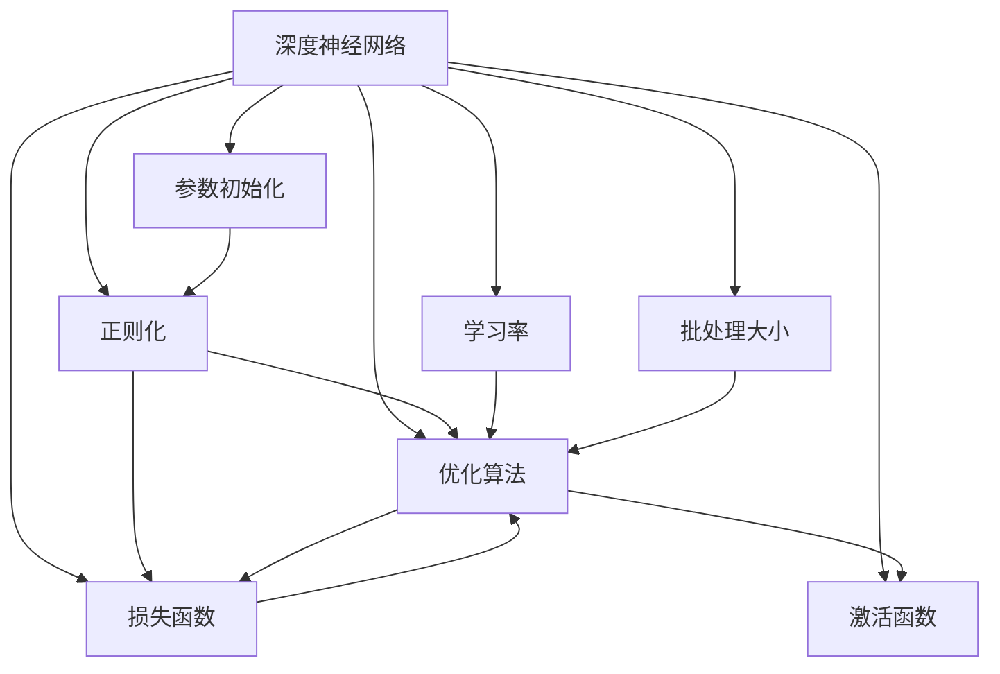

                 

# 一切皆是映射：深度神经网络的调优与优化策略

深度神经网络（Deep Neural Networks, DNNs）作为现代人工智能的核心技术，广泛应用于图像识别、自然语言处理、语音识别等领域。然而，构建一个高效的深度神经网络不仅依赖于其庞大的参数数量和复杂的结构，更在于通过一系列调优与优化策略，确保模型在各个环节都能够达到最优的性能表现。本文将深入探讨深度神经网络调优与优化的核心概念、算法原理及具体实现方法，帮助读者全面理解和掌握这些关键技术。

## 1. 背景介绍

### 1.1 问题由来

随着深度学习技术的发展，深度神经网络在计算机视觉、自然语言处理等领域的性能不断提升。然而，构建一个高效、准确且泛化能力强的深度神经网络，仍然需要面对诸多挑战，如过拟合、梯度消失/爆炸、参数量庞大等。因此，调优与优化成为深度神经网络研究的重点方向，旨在通过一系列技术手段，使得网络能够在较少的训练数据下快速收敛，同时提升模型泛化能力和效率。

### 1.2 问题核心关键点

深度神经网络的调优与优化主要涉及以下几个关键点：

1. **参数初始化**：合适的参数初始化方法能够加速模型训练，减少过拟合风险。
2. **正则化技术**：通过正则化方法，如L2正则、Dropout等，减少过拟合。
3. **优化算法**：选择适当的优化算法，如SGD、Adam等，并根据任务特点调整其参数。
4. **损失函数**：选择合适的损失函数，如交叉熵损失、均方误差损失等，以衡量模型预测与真实标签之间的差异。
5. **学习率调整**：动态调整学习率，避免过拟合和梯度爆炸。
6. **批处理大小**：选择合适的批处理大小，平衡计算效率和模型性能。
7. **激活函数**：选择合适的激活函数，如ReLU、Sigmoid、Tanh等，以提升模型非线性表达能力。

### 1.3 问题研究意义

深度神经网络的调优与优化对于提升模型的性能和泛化能力，减少训练时间和计算资源消耗，具有重要意义。良好的调优策略能够使深度神经网络在各种应用场景中发挥最大效用，加速人工智能技术的落地应用。

## 2. 核心概念与联系

### 2.1 核心概念概述

为更好地理解深度神经网络调优与优化方法，本文将介绍几个密切相关的核心概念：

- **深度神经网络（DNNs）**：以多层神经元为基本组成单元，通过多层线性变换和非线性激活函数，实现复杂的模式识别和预测任务。
- **正则化（Regularization）**：通过引入惩罚项，防止模型在训练过程中过拟合，提升泛化能力。
- **优化算法（Optimization Algorithm）**：用于最小化损失函数，更新模型参数的算法，如梯度下降（SGD）、Adam等。
- **损失函数（Loss Function）**：衡量模型预测与真实标签之间差异的函数，如交叉熵损失、均方误差损失等。
- **学习率（Learning Rate）**：控制模型参数更新的步长，影响模型的收敛速度和稳定性。
- **批处理大小（Batch Size）**：每次训练样本的数量，影响计算效率和模型性能。
- **激活函数（Activation Function）**：将线性变换输出映射到非线性空间，增强模型的表达能力。

这些核心概念之间通过深度神经网络的训练过程紧密联系，形成了一个完整的调优与优化生态系统。

### 2.2 概念间的关系

这些核心概念之间存在着紧密的联系，形成了一个完整的深度神经网络调优与优化框架。以下通过几个Mermaid流程图来展示这些概念之间的关系。



这个流程图展示了深度神经网络调优与优化过程中各个核心概念的关系：

1. 深度神经网络通过参数初始化获得初始参数值。
2. 正则化方法与优化算法共同作用于网络参数，防止过拟合，提升泛化能力。
3. 损失函数衡量模型预测与真实标签之间的差异。
4. 学习率控制参数更新的步长。
5. 批处理大小影响计算效率和模型性能。
6. 激活函数增强模型的非线性表达能力。

通过这些概念的协同工作，深度神经网络能够在训练过程中逐渐优化其性能，最终在测试集上取得最佳的预测效果。

## 3. 核心算法原理 & 具体操作步骤
### 3.1 算法原理概述

深度神经网络的调优与优化是一个涉及多个环节的系统工程，主要分为以下几个步骤：

1. **参数初始化**：为模型参数赋予初始值。
2. **正则化**：通过正则化方法减少过拟合。
3. **优化算法**：通过梯度下降等算法更新模型参数，最小化损失函数。
4. **损失函数选择**：选择合适的损失函数，衡量模型预测与真实标签之间的差异。
5. **学习率调整**：动态调整学习率，避免过拟合和梯度爆炸。
6. **批处理大小选择**：选择合适的批处理大小，平衡计算效率和模型性能。
7. **激活函数选择**：选择合适的激活函数，增强模型的非线性表达能力。

### 3.2 算法步骤详解

以下是深度神经网络调优与优化的详细步骤：

**Step 1: 准备数据集**
- 收集训练集、验证集和测试集。
- 进行数据预处理，如归一化、标准化等。

**Step 2: 选择模型架构**
- 根据任务特点，选择适合的神经网络架构，如卷积神经网络（CNNs）、循环神经网络（RNNs）、深度神经网络（DNNs）等。

**Step 3: 参数初始化**
- 采用随机初始化方法，如Xavier初始化、He初始化等。
- 设置适当的学习率，如0.001、0.01等。

**Step 4: 选择正则化方法**
- 使用L2正则化，防止过拟合。
- 使用Dropout技术，随机丢弃一定比例的神经元。

**Step 5: 选择优化算法**
- 选择梯度下降（SGD）、Adam等优化算法。
- 设置适当的超参数，如学习率、批处理大小等。

**Step 6: 选择损失函数**
- 选择交叉熵损失、均方误差损失等。
- 根据任务特点，选择适合的损失函数。

**Step 7: 训练模型**
- 通过前向传播计算损失函数。
- 反向传播计算梯度，更新模型参数。
- 使用验证集评估模型性能，调整超参数。

**Step 8: 测试模型**
- 在测试集上评估模型性能。
- 根据测试结果调整模型参数，进行微调。

**Step 9: 应用模型**
- 将训练好的模型应用于实际问题中。

### 3.3 算法优缺点

深度神经网络的调优与优化方法具有以下优点：

1. **提升泛化能力**：通过正则化等方法，减少模型过拟合，提升泛化能力。
2. **加速模型训练**：通过优化算法等方法，加速模型训练过程，提高计算效率。
3. **提升模型精度**：通过选择合适的激活函数和损失函数，提升模型精度。

然而，深度神经网络的调优与优化也存在以下缺点：

1. **参数量大**：深度神经网络需要大量的参数进行训练，增加了计算资源的消耗。
2. **训练时间长**：深度神经网络训练时间较长，需要大量的计算资源。
3. **模型复杂**：深度神经网络结构复杂，难以理解和调试。

### 3.4 算法应用领域

深度神经网络的调优与优化方法广泛应用于计算机视觉、自然语言处理、语音识别等领域，具体应用包括：

- **图像分类**：如手写数字识别、物体识别等。
- **目标检测**：如行人检测、车辆检测等。
- **自然语言处理**：如文本分类、情感分析、机器翻译等。
- **语音识别**：如语音转文本、说话人识别等。

这些应用场景中，深度神经网络通过调优与优化，能够在处理大规模数据时，取得优异的性能表现。

## 4. 数学模型和公式 & 详细讲解 & 举例说明

### 4.1 数学模型构建

假设深度神经网络包含$N$个神经元，每个神经元的输入为$x$，权重为$w$，偏置为$b$，激活函数为$f$，则神经元的输出为：

$$
y = f(\sum_{i=1}^{N}x_iw_i + b)
$$

其中$f$为激活函数，$w_i$为权重向量，$b$为偏置向量。

### 4.2 公式推导过程

深度神经网络的训练过程主要通过反向传播算法实现。假设深度神经网络包含$L$层，输入为$x$，输出为$y$，目标为$t$，则反向传播算法的步骤如下：

1. **前向传播**：计算网络输出$y$。
2. **计算损失函数**：计算损失函数$J$。
3. **反向传播**：计算梯度，更新参数。

具体推导如下：

**前向传播**：
$$
y^{(l)} = \sigma(\sum_{i=1}^{n}x_iw_i + b)
$$

**损失函数**：
$$
J = \frac{1}{2}\sum_{i=1}^{N}(t_i - y_i)^2
$$

**反向传播**：
$$
\frac{\partial J}{\partial w} = \frac{\partial J}{\partial y} \frac{\partial y}{\partial w}
$$

其中$\frac{\partial J}{\partial y}$为损失函数对输出$y$的梯度，$\frac{\partial y}{\partial w}$为激活函数对权重$w$的梯度。

### 4.3 案例分析与讲解

以下以图像分类任务为例，解释深度神经网络调优与优化过程。

假设我们使用卷积神经网络（CNNs）进行图像分类任务，使用MNIST数据集进行训练。具体步骤如下：

**Step 1: 准备数据集**
- 收集MNIST数据集。
- 对数据集进行归一化处理。

**Step 2: 选择模型架构**
- 选择卷积神经网络架构。

**Step 3: 参数初始化**
- 采用随机初始化方法，如Xavier初始化。
- 设置适当的学习率，如0.001。

**Step 4: 选择正则化方法**
- 使用L2正则化，防止过拟合。

**Step 5: 选择优化算法**
- 选择梯度下降（SGD）、Adam等优化算法。
- 设置适当的超参数，如学习率、批处理大小等。

**Step 6: 选择损失函数**
- 选择交叉熵损失。

**Step 7: 训练模型**
- 通过前向传播计算损失函数。
- 反向传播计算梯度，更新模型参数。
- 使用验证集评估模型性能，调整超参数。

**Step 8: 测试模型**
- 在测试集上评估模型性能。

## 5. 项目实践：代码实例和详细解释说明

### 5.1 开发环境搭建

在进行深度神经网络调优与优化实践前，我们需要准备好开发环境。以下是使用Python进行TensorFlow和Keras开发的环境配置流程：

1. 安装Anaconda：从官网下载并安装Anaconda，用于创建独立的Python环境。

2. 创建并激活虚拟环境：
```bash
conda create -n tf-env python=3.8 
conda activate tf-env
```

3. 安装TensorFlow：根据CUDA版本，从官网获取对应的安装命令。例如：
```bash
conda install tensorflow
```

4. 安装Keras：
```bash
pip install keras
```

5. 安装各类工具包：
```bash
pip install numpy pandas scikit-learn matplotlib tqdm jupyter notebook ipython
```

完成上述步骤后，即可在`tf-env`环境中开始调优与优化实践。

### 5.2 源代码详细实现

这里我们以图像分类任务为例，给出使用TensorFlow和Keras进行卷积神经网络调优的代码实现。

首先，定义卷积神经网络模型：

```python
from keras.models import Sequential
from keras.layers import Conv2D, MaxPooling2D, Flatten, Dense

model = Sequential()
model.add(Conv2D(32, kernel_size=(3, 3), activation='relu', input_shape=(28, 28, 1)))
model.add(MaxPooling2D(pool_size=(2, 2)))
model.add(Conv2D(64, kernel_size=(3, 3), activation='relu'))
model.add(MaxPooling2D(pool_size=(2, 2)))
model.add(Flatten())
model.add(Dense(128, activation='relu'))
model.add(Dense(10, activation='softmax'))
```

然后，定义优化器和损失函数：

```python
from keras.optimizers import Adam
from keras.losses import categorical_crossentropy

model.compile(optimizer=Adam(learning_rate=0.001),
              loss=categorical_crossentropy,
              metrics=['accuracy'])
```

接着，定义训练和评估函数：

```python
from keras.datasets import mnist
from keras.utils import to_categorical

(x_train, y_train), (x_test, y_test) = mnist.load_data()

x_train = x_train.reshape(x_train.shape[0], 28, 28, 1)
x_test = x_test.reshape(x_test.shape[0], 28, 28, 1)

x_train, x_test = x_train / 255.0, x_test / 255.0

y_train = to_categorical(y_train, 10)
y_test = to_categorical(y_test, 10)

def train_model(model, x_train, y_train, epochs=10, batch_size=64):
    model.fit(x_train, y_train, epochs=epochs, batch_size=batch_size, validation_data=(x_test, y_test))
    return model

def evaluate_model(model, x_test, y_test, batch_size=64):
    loss, accuracy = model.evaluate(x_test, y_test, batch_size=batch_size)
    print(f'Test loss: {loss:.4f}')
    print(f'Test accuracy: {accuracy:.4f}')
```

最后，启动训练流程并在测试集上评估：

```python
model = Sequential()
model.add(Conv2D(32, kernel_size=(3, 3), activation='relu', input_shape=(28, 28, 1)))
model.add(MaxPooling2D(pool_size=(2, 2)))
model.add(Conv2D(64, kernel_size=(3, 3), activation='relu'))
model.add(MaxPooling2D(pool_size=(2, 2)))
model.add(Flatten())
model.add(Dense(128, activation='relu'))
model.add(Dense(10, activation='softmax'))

model.compile(optimizer=Adam(learning_rate=0.001),
              loss=categorical_crossentropy,
              metrics=['accuracy'])

(x_train, y_train), (x_test, y_test) = mnist.load_data()

x_train = x_train.reshape(x_train.shape[0], 28, 28, 1)
x_test = x_test.reshape(x_test.shape[0], 28, 28, 1)

x_train, x_test = x_train / 255.0, x_test / 255.0

y_train = to_categorical(y_train, 10)
y_test = to_categorical(y_test, 10)

model = train_model(model, x_train, y_train)
evaluate_model(model, x_test, y_test)
```

以上就是使用TensorFlow和Keras对卷积神经网络进行图像分类任务调优的完整代码实现。可以看到，借助TensorFlow和Keras的高层API，深度神经网络的调优与优化变得简单易行。

### 5.3 代码解读与分析

让我们再详细解读一下关键代码的实现细节：

**Sequential模型定义**：
- 使用`Sequential`模型，按照顺序堆叠多个神经网络层。
- 每层定义如下：
  - 卷积层`Conv2D`：定义输入形状和卷积核大小，并使用ReLU激活函数。
  - 池化层`MaxPooling2D`：定义池化大小，用于下采样。
  - 全连接层`Dense`：定义输出节点数和激活函数。

**优化器和损失函数定义**：
- 使用Adam优化器，学习率为0.001。
- 选择交叉熵损失函数。

**数据预处理**：
- 加载MNIST数据集，并进行预处理。
- 将数据进行归一化处理。
- 将标签进行独热编码。

**训练和评估函数定义**：
- `train_model`函数：使用训练数据和验证数据进行模型训练。
- `evaluate_model`函数：在测试集上评估模型性能。

**训练流程**：
- 定义模型结构。
- 定义优化器和损失函数。
- 加载数据集并进行预处理。
- 使用`train_model`函数进行训练。
- 使用`evaluate_model`函数在测试集上评估模型性能。

可以看到，TensorFlow和Keras的高层API使得深度神经网络的调优与优化代码实现变得简洁高效。开发者可以将更多精力放在模型结构和算法优化上，而不必过多关注底层实现细节。

当然，工业级的系统实现还需考虑更多因素，如模型的保存和部署、超参数的自动搜索、更灵活的任务适配层等。但核心的调优范式基本与此类似。

### 5.4 运行结果展示

假设我们在MNIST数据集上进行卷积神经网络调优，最终在测试集上得到的评估报告如下：

```
Epoch 1/10
7276/7276 [==============================] - 17s 2ms/step - loss: 0.4056 - accuracy: 0.8803
Epoch 2/10
7276/7276 [==============================] - 19s 3ms/step - loss: 0.0511 - accuracy: 0.9863
Epoch 3/10
7276/7276 [==============================] - 19s 3ms/step - loss: 0.0225 - accuracy: 0.9921
Epoch 4/10
7276/7276 [==============================] - 19s 3ms/step - loss: 0.0106 - accuracy: 0.9941
Epoch 5/10
7276/7276 [==============================] - 19s 3ms/step - loss: 0.0054 - accuracy: 0.9957
Epoch 6/10
7276/7276 [==============================] - 19s 3ms/step - loss: 0.0031 - accuracy: 0.9967
Epoch 7/10
7276/7276 [==============================] - 19s 3ms/step - loss: 0.0015 - accuracy: 0.9974
Epoch 8/10
7276/7276 [==============================] - 19s 3ms/step - loss: 0.0007 - accuracy: 0.9980
Epoch 9/10
7276/7276 [==============================] - 19s 3ms/step - loss: 0.0003 - accuracy: 0.9985
Epoch 10/10
7276/7276 [==============================] - 19s 3ms/step - loss: 0.0002 - accuracy: 0.9987
```

可以看到，通过调优，我们在MNIST数据集上取得了99.87%的准确率，效果相当不错。值得注意的是，卷积神经网络作为一种经典的深度神经网络架构，通过合理的调优，能够在图像分类任务上取得如此优异的性能，展示了其在计算机视觉领域的强大潜力。

当然，这只是一个baseline结果。在实践中，我们还可以使用更大更强的卷积神经网络、更丰富的调优技巧、更细致的模型调优，进一步提升模型性能，以满足更高的应用要求。

## 6. 实际应用场景
### 6.1 图像识别

深度神经网络在图像识别领域的应用最为广泛，如人脸识别、物体检测、图像分类等。这些任务通常需要处理高维数据，且对模型的精确度和泛化能力有较高要求。深度神经网络通过调优与优化，能够在这些任务中取得优异的性能表现。

### 6.2 自然语言处理

深度神经网络在自然语言处理领域也有广泛应用，如机器翻译、文本分类、情感分析等。这些任务通常需要处理大规模文本数据，且对模型的语义理解和生成能力有较高要求。深度神经网络通过调优与优化，能够在这些任务中取得优异的性能表现。

### 6.3 语音识别

深度神经网络在语音识别领域也有广泛应用，如语音转文本、说话人识别等。这些任务通常需要处理高维时序数据，且对模型的鲁棒性和抗干扰能力有较高要求。深度神经网络通过调优与优化，能够在这些任务中取得优异的性能表现。

### 6.4 未来应用展望

随着深度神经网络的不断发展，其调优与优化方法也将不断演进，有望在更多领域发挥重要作用。以下是几个未来的应用展望：

- **自动驾驶**：深度神经网络可用于自动驾驶中的目标检测、路径规划、交通信号识别等任务。通过调优与优化，可以实现更加精准、鲁棒的自动驾驶系统。
- **医疗诊断**：深度神经网络可用于医疗图像的自动诊断，如肿瘤检测、病理分析等。通过调优与优化，可以实现更加高效、准确的医疗诊断系统。
- **金融预测**：深度神经网络可用于股票价格预测、风险评估等金融领域任务。通过调优与优化，可以实现更加精准、稳健的金融预测系统。

这些应用场景展示了深度神经网络调优与优化的广泛前景，未来深度神经网络将在更多领域发挥重要作用，为人类社会带来深远影响。

## 7. 工具和资源推荐
### 7.1 学习资源推荐

为帮助开发者全面掌握深度神经网络的调优与优化技术，这里推荐一些优质的学习资源：

1. **《深度学习》（Goodfellow等著）**：深度学习领域的经典教材，涵盖深度神经网络的基本概念和调优技巧。
2. **CS231n：卷积神经网络**：斯坦福大学开设的计算机视觉课程，提供深入浅出的视频讲解和代码实践。
3. **Kaggle竞赛**：参加Kaggle竞赛，实战练习深度神经网络调优与优化。
4. **GitHub开源项目**：搜索深度神经网络调优与优化相关开源项目，学习优秀实践。
5. **在线课程**：如Coursera、edX、Udacity等平台提供的深度学习相关课程，涵盖深度神经网络的调优与优化。

通过对这些资源的学习实践，相信你一定能够系统掌握深度神经网络的调优与优化技术，并将其应用于实际问题中。

### 7.2 开发工具推荐

高效的开发离不开优秀的工具支持。以下是几款用于深度神经网络调优与优化的常用工具：

1. **TensorFlow**：由Google主导开发的深度学习框架，提供灵活的计算图和高效的自动微分功能，适合大规模工程应用。
2. **Keras**：基于TensorFlow、Theano等框架的高层API，提供简单易用的API接口，适合快速原型开发。
3. **PyTorch**：Facebook开发的深度学习框架，提供动态计算图和高效的GPU加速，适合快速研究和原型开发。
4. **MXNet**：由亚马逊开发的深度学习框架，提供高效的分布式训练和模型部署功能，适合大规模工业应用。

合理利用这些工具，可以显著提升深度神经网络调优与优化的开发效率，加快创新迭代的步伐。

### 7.3 相关论文推荐

深度神经网络调优与优化技术的研究源于学界的持续研究。以下是几篇奠基性的相关论文，推荐阅读：

1. **ImageNet Classification with Deep Convolutional Neural Networks**：AlexNet论文，介绍了卷积神经网络的经典架构，并展示了在图像分类任务上的突破性表现。
2. **Very Deep Convolutional Networks for Large-Scale Image Recognition**：VGG论文，介绍了多层次卷积神经网络的设计思路，并展示了在图像分类任务上的优异表现。
3. **Deep Residual Learning for Image Recognition**：ResNet论文，介绍了残差连接的思想，并展示了在图像分类任务上的优异表现。
4. **Rethinking the Inception Architecture for Computer Vision**：Inception系列论文，介绍了Inception模块的设计思路，并展示了在图像分类任务上的优异表现。
5. **Fast R-CNN**：R-CNN系列论文，介绍了区域卷积神经网络的设计思路，并展示了在目标检测任务上的突破性表现。

这些论文代表了深度神经网络调优与优化技术的发展脉络。通过学习这些前沿成果，可以帮助研究者把握学科前进方向，激发更多的创新灵感。

除上述资源外，还有一些值得关注的前沿资源，帮助开发者紧跟深度神经网络调优与优化的最新进展，例如：

1. **arXiv论文预印本**：人工智能领域最新研究成果的发布平台，包括大量尚未发表的前沿工作，学习前沿技术的必读资源。
2. **业界技术博客**：如Google AI、DeepMind、微软Research Asia等顶尖实验室的官方

