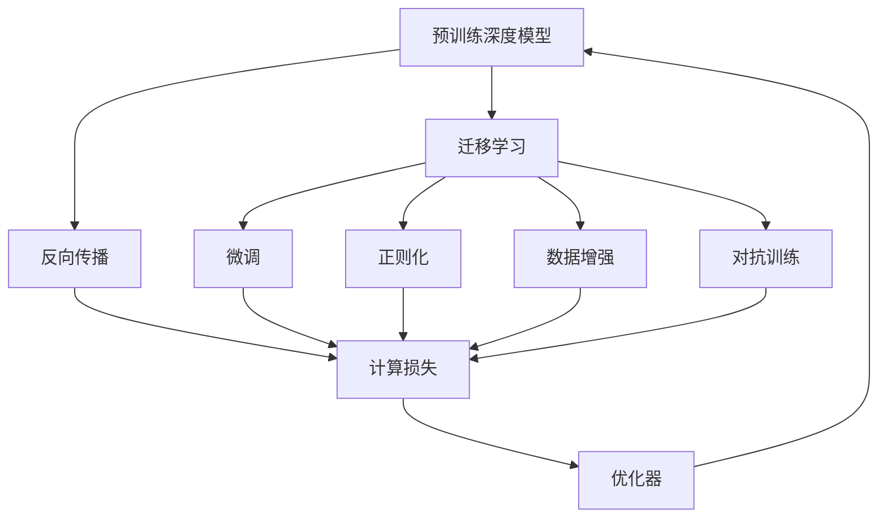

                 

# 一切皆是映射：预训练深度模型与迁移学习

> 关键词：预训练深度模型,迁移学习,跨领域知识,神经网络,反向传播

## 1. 背景介绍

### 1.1 问题由来
在当今数据驱动的人工智能(AI)时代，深度学习已经成为了最先进的技术手段。其中，预训练深度模型（如卷积神经网络CNNs、循环神经网络RNNs、Transformer等）通过在大规模无标签数据上进行训练，学习到数据的复杂特征和模式，具有强大的泛化能力。然而，这些模型通常需要大量的数据和计算资源进行训练，且在不同任务之间难以直接迁移应用，限制了其应用范围。

迁移学习（Transfer Learning）正是解决这一问题的重要技术手段。它基于预训练模型的知识，通过少量标注数据进行微调（Fine-tuning），适应新的任务，从而在资源有限的情况下提升模型性能。这一范式已经成为深度学习领域的主流方法，广泛应用于计算机视觉、自然语言处理、语音识别等多个领域。

本文将深入探讨预训练深度模型与迁移学习原理，介绍其在NLP、CV等领域的经典应用，以及未来发展的趋势和挑战。

## 2. 核心概念与联系

### 2.1 核心概念概述

为了更好地理解预训练深度模型与迁移学习的核心概念及其联系，我们需要从几个关键点入手：

- **预训练深度模型**：指在大规模无标签数据上进行训练的深度学习模型，如CNN、RNN、Transformer等。这些模型通过自监督或监督学习任务获得丰富的知识表示。

- **迁移学习**：指将预训练模型的知识迁移到新任务上的过程。在迁移学习中，通常通过微调（Fine-tuning）在少量标注数据上进行训练，以提高模型在新任务上的表现。

- **反向传播**：指深度学习模型中用于计算损失函数梯度的一种算法，通过前向传播的计算结果和真实标签之间的差异，反向更新模型参数，以最小化损失函数。

- **跨领域知识**：指在一种领域学到的知识可以迁移到另一种领域进行应用。预训练模型通过自监督任务学习到的知识通常具有一定的跨领域性，可以迁移到新任务中进行优化。

- **神经网络**：由大量神经元（节点）和层级连接组成的一种计算模型。神经网络通过反向传播算法进行训练，可以学习复杂的非线性映射关系。

### 2.2 核心概念间的关系

这些核心概念之间的逻辑关系可以通过以下Mermaid流程图来展示：



这个流程图展示了大模型预训练与迁移学习之间的关系：

1. **预训练深度模型**：通过反向传播算法在无标签数据上进行训练，学习到复杂的特征表示。
2. **迁移学习**：利用预训练模型的知识，通过微调在新任务上进行优化，提高模型性能。
3. **微调**：通过反向传播算法在少量标注数据上进行有监督训练，进一步优化模型。
4. **正则化**：防止模型过拟合，确保模型泛化能力。
5. **数据增强**：通过扩充训练数据集，增强模型的鲁棒性。
6. **对抗训练**：通过加入对抗样本，提高模型的鲁棒性和泛化能力。

## 3. 核心算法原理 & 具体操作步骤

### 3.1 算法原理概述

预训练深度模型与迁移学习的核心原理基于反向传播算法，其核心思想是利用无标签数据进行预训练，学习到数据的复杂特征表示，然后在新任务上进行微调，进一步优化模型性能。具体步骤如下：

1. **预训练阶段**：在大规模无标签数据上，使用反向传播算法进行自监督或监督学习，学习到数据的复杂特征表示。
2. **迁移学习阶段**：在少量标注数据上，通过微调进一步优化模型，适应新任务。

### 3.2 算法步骤详解

**Step 1: 数据准备与模型初始化**
- 准备预训练数据集和目标任务的数据集。
- 选择预训练深度模型，如BERT、GPT等，并进行初始化。

**Step 2: 计算预训练模型的损失**
- 将预训练模型应用于预训练数据集，计算损失函数。
- 使用反向传播算法更新模型参数。

**Step 3: 数据增强与正则化**
- 对目标任务的数据集进行数据增强，如回译、旋转、裁剪等。
- 应用正则化技术，如L2正则、Dropout等，防止模型过拟合。

**Step 4: 微调模型**
- 在目标任务的数据集上，进行有监督学习，优化模型参数。
- 使用优化器，如Adam、SGD等，进行模型训练。

**Step 5: 评估与部署**
- 在验证集上评估模型性能。
- 根据评估结果调整超参数，继续训练或停止训练。
- 部署微调后的模型，进行实际应用。

### 3.3 算法优缺点

预训练深度模型与迁移学习具有以下优点：
1. 节省标注成本：利用预训练模型在无标签数据上学习到的知识，只需少量标注数据即可提升模型性能。
2. 泛化能力更强：预训练模型通常具有较强的泛化能力，可以更好地适应新任务。
3. 可迁移性强：预训练模型在不同任务之间具有良好的迁移性，可以在多个任务上进行应用。
4. 提升模型性能：通过微调，模型可以适应特定的任务需求，提高模型性能。

同时，该方法也存在以下缺点：
1. 数据依赖性强：预训练模型的性能依赖于数据的质量和数量，数据采集和标注成本较高。
2. 模型复杂度高：预训练深度模型通常参数量庞大，计算资源消耗大。
3. 过拟合风险：在微调过程中，模型可能会过拟合目标任务的数据，导致性能下降。
4. 可解释性不足：预训练模型和微调模型通常缺乏可解释性，难以解释模型的内部工作机制。

尽管存在这些局限性，但预训练深度模型与迁移学习仍然是大规模数据驱动AI技术的重要范式，广泛应用于计算机视觉、自然语言处理等多个领域。

### 3.4 算法应用领域

预训练深度模型与迁移学习已经在多个领域得到广泛应用，例如：

- **计算机视觉**：通过预训练CNN模型，利用迁移学习在新任务上快速部署，如目标检测、图像分类、语义分割等。
- **自然语言处理**：利用预训练的BERT、GPT等模型，通过微调实现文本分类、问答系统、情感分析等NLP任务。
- **语音识别**：通过预训练的RNN、CNN等模型，利用迁移学习实现语音识别、语音合成等任务。
- **推荐系统**：利用预训练的深度模型，通过迁移学习实现个性化推荐、广告点击预测等任务。

除了这些经典任务外，预训练深度模型与迁移学习还被创新性地应用到更多场景中，如医疗影像分析、智能制造、智能驾驶等，为各个领域带来创新突破。

## 4. 数学模型和公式 & 详细讲解 & 举例说明

### 4.1 数学模型构建

假设预训练深度模型为 $M_{\theta}$，其中 $\theta$ 为模型参数。给定目标任务 $T$ 的标注数据集 $D=\{(x_i,y_i)\}_{i=1}^N, x_i \in \mathcal{X}, y_i \in \mathcal{Y}$。

定义模型 $M_{\theta}$ 在数据样本 $(x,y)$ 上的损失函数为 $\ell(M_{\theta}(x),y)$，则在数据集 $D$ 上的经验风险为：

$$
\mathcal{L}(\theta) = \frac{1}{N} \sum_{i=1}^N \ell(M_{\theta}(x_i),y_i)
$$

微调的优化目标是最小化经验风险，即找到最优参数：

$$
\theta^* = \mathop{\arg\min}_{\theta} \mathcal{L}(\theta)
$$

在实践中，我们通常使用基于梯度的优化算法（如SGD、Adam等）来近似求解上述最优化问题。设 $\eta$ 为学习率，$\lambda$ 为正则化系数，则参数的更新公式为：

$$
\theta \leftarrow \theta - \eta \nabla_{\theta}\mathcal{L}(\theta) - \eta\lambda\theta
$$

其中 $\nabla_{\theta}\mathcal{L}(\theta)$ 为损失函数对参数 $\theta$ 的梯度，可通过反向传播算法高效计算。

### 4.2 公式推导过程

以二分类任务为例，假设模型 $M_{\theta}$ 在输入 $x$ 上的输出为 $\hat{y}=M_{\theta}(x) \in [0,1]$，表示样本属于正类的概率。真实标签 $y \in \{0,1\}$。则二分类交叉熵损失函数定义为：

$$
\ell(M_{\theta}(x),y) = -[y\log \hat{y} + (1-y)\log (1-\hat{y})]
$$

将其代入经验风险公式，得：

$$
\mathcal{L}(\theta) = -\frac{1}{N}\sum_{i=1}^N [y_i\log M_{\theta}(x_i)+(1-y_i)\log(1-M_{\theta}(x_i))]
$$

根据链式法则，损失函数对参数 $\theta_k$ 的梯度为：

$$
\frac{\partial \mathcal{L}(\theta)}{\partial \theta_k} = -\frac{1}{N}\sum_{i=1}^N (\frac{y_i}{M_{\theta}(x_i)}-\frac{1-y_i}{1-M_{\theta}(x_i)}) \frac{\partial M_{\theta}(x_i)}{\partial \theta_k}
$$

其中 $\frac{\partial M_{\theta}(x_i)}{\partial \theta_k}$ 可进一步递归展开，利用自动微分技术完成计算。

在得到损失函数的梯度后，即可带入参数更新公式，完成模型的迭代优化。重复上述过程直至收敛，最终得到适应下游任务的最优模型参数 $\theta^*$。

### 4.3 案例分析与讲解

以BERT模型的微调为例，展示其在情感分析任务上的应用。

首先，定义任务的数据处理函数：

```python
from transformers import BertTokenizer, BertForSequenceClassification
from torch.utils.data import Dataset, DataLoader
from sklearn.metrics import accuracy_score, precision_recall_fscore_support
import torch

class SentimentDataset(Dataset):
    def __init__(self, texts, labels):
        self.texts = texts
        self.labels = labels
        self.tokenizer = BertTokenizer.from_pretrained('bert-base-uncased')
        
    def __len__(self):
        return len(self.texts)
    
    def __getitem__(self, item):
        text = self.texts[item]
        label = self.labels[item]
        encoding = self.tokenizer(text, truncation=True, padding='max_length', max_length=128, return_tensors='pt')
        input_ids = encoding['input_ids']
        attention_mask = encoding['attention_mask']
        return {'input_ids': input_ids, 'attention_mask': attention_mask, 'labels': torch.tensor(label, dtype=torch.long)}
```

然后，定义模型和优化器：

```python
from transformers import AdamW

model = BertForSequenceClassification.from_pretrained('bert-base-uncased', num_labels=2)
optimizer = AdamW(model.parameters(), lr=2e-5)
```

接着，定义训练和评估函数：

```python
device = torch.device('cuda') if torch.cuda.is_available() else torch.device('cpu')
model.to(device)

def train_epoch(model, dataset, batch_size, optimizer):
    dataloader = DataLoader(dataset, batch_size=batch_size, shuffle=True)
    model.train()
    epoch_loss = 0
    for batch in dataloader:
        input_ids = batch['input_ids'].to(device)
        attention_mask = batch['attention_mask'].to(device)
        labels = batch['labels'].to(device)
        model.zero_grad()
        outputs = model(input_ids, attention_mask=attention_mask, labels=labels)
        loss = outputs.loss
        epoch_loss += loss.item()
        loss.backward()
        optimizer.step()
    return epoch_loss / len(dataloader)

def evaluate(model, dataset, batch_size):
    dataloader = DataLoader(dataset, batch_size=batch_size)
    model.eval()
    preds, labels = [], []
    with torch.no_grad():
        for batch in dataloader:
            input_ids = batch['input_ids'].to(device)
            attention_mask = batch['attention_mask'].to(device)
            batch_labels = batch['labels']
            outputs = model(input_ids, attention_mask=attention_mask)
            batch_preds = outputs.logits.argmax(dim=1).to('cpu').tolist()
            batch_labels = batch_labels.to('cpu').tolist()
            for pred, label in zip(batch_preds, batch_labels):
                preds.append(pred)
                labels.append(label)
    return accuracy_score(labels, preds)
```

最后，启动训练流程并在测试集上评估：

```python
epochs = 3
batch_size = 16

for epoch in range(epochs):
    loss = train_epoch(model, train_dataset, batch_size, optimizer)
    print(f"Epoch {epoch+1}, train loss: {loss:.3f}")
    
    print(f"Epoch {epoch+1}, dev accuracy: {evaluate(model, dev_dataset, batch_size)}")
    
print(f"Test accuracy: {evaluate(model, test_dataset, batch_size)}")
```

以上就是使用PyTorch对BERT进行情感分析任务微调的完整代码实现。可以看到，BERT模型在微调过程中通过反向传播算法更新参数，逐步逼近目标任务的优化损失。通过在训练集和验证集上的迭代训练和评估，可以有效地提升模型性能。

## 5. 项目实践：代码实例和详细解释说明

### 5.1 开发环境搭建

在进行预训练深度模型与迁移学习的实践前，我们需要准备好开发环境。以下是使用Python进行PyTorch开发的环境配置流程：

1. 安装Anaconda：从官网下载并安装Anaconda，用于创建独立的Python环境。

2. 创建并激活虚拟环境：
```bash
conda create -n pytorch-env python=3.8 
conda activate pytorch-env
```

3. 安装PyTorch：根据CUDA版本，从官网获取对应的安装命令。例如：
```bash
conda install pytorch torchvision torchaudio cudatoolkit=11.1 -c pytorch -c conda-forge
```

4. 安装Transformers库：
```bash
pip install transformers
```

5. 安装各类工具包：
```bash
pip install numpy pandas scikit-learn matplotlib tqdm jupyter notebook ipython
```

完成上述步骤后，即可在`pytorch-env`环境中开始微调实践。

### 5.2 源代码详细实现

下面我们以BERT模型在情感分析任务上的微调为例，给出使用PyTorch的代码实现。

首先，定义情感分析任务的数据处理函数：

```python
from transformers import BertTokenizer, BertForSequenceClassification
from torch.utils.data import Dataset, DataLoader
from sklearn.metrics import accuracy_score, precision_recall_fscore_support
import torch

class SentimentDataset(Dataset):
    def __init__(self, texts, labels):
        self.texts = texts
        self.labels = labels
        self.tokenizer = BertTokenizer.from_pretrained('bert-base-uncased')
        
    def __len__(self):
        return len(self.texts)
    
    def __getitem__(self, item):
        text = self.texts[item]
        label = self.labels[item]
        encoding = self.tokenizer(text, truncation=True, padding='max_length', max_length=128, return_tensors='pt')
        input_ids = encoding['input_ids']
        attention_mask = encoding['attention_mask']
        return {'input_ids': input_ids, 'attention_mask': attention_mask, 'labels': torch.tensor(label, dtype=torch.long)}
```

然后，定义模型和优化器：

```python
from transformers import AdamW

model = BertForSequenceClassification.from_pretrained('bert-base-uncased', num_labels=2)
optimizer = AdamW(model.parameters(), lr=2e-5)
```

接着，定义训练和评估函数：

```python
device = torch.device('cuda') if torch.cuda.is_available() else torch.device('cpu')
model.to(device)

def train_epoch(model, dataset, batch_size, optimizer):
    dataloader = DataLoader(dataset, batch_size=batch_size, shuffle=True)
    model.train()
    epoch_loss = 0
    for batch in dataloader:
        input_ids = batch['input_ids'].to(device)
        attention_mask = batch['attention_mask'].to(device)
        labels = batch['labels'].to(device)
        model.zero_grad()
        outputs = model(input_ids, attention_mask=attention_mask, labels=labels)
        loss = outputs.loss
        epoch_loss += loss.item()
        loss.backward()
        optimizer.step()
    return epoch_loss / len(dataloader)

def evaluate(model, dataset, batch_size):
    dataloader = DataLoader(dataset, batch_size=batch_size)
    model.eval()
    preds, labels = [], []
    with torch.no_grad():
        for batch in dataloader:
            input_ids = batch['input_ids'].to(device)
            attention_mask = batch['attention_mask'].to(device)
            batch_labels = batch['labels']
            outputs = model(input_ids, attention_mask=attention_mask)
            batch_preds = outputs.logits.argmax(dim=1).to('cpu').tolist()
            batch_labels = batch_labels.to('cpu').tolist()
            for pred, label in zip(batch_preds, batch_labels):
                preds.append(pred)
                labels.append(label)
    return accuracy_score(labels, preds)
```

最后，启动训练流程并在测试集上评估：

```python
epochs = 3
batch_size = 16

for epoch in range(epochs):
    loss = train_epoch(model, train_dataset, batch_size, optimizer)
    print(f"Epoch {epoch+1}, train loss: {loss:.3f}")
    
    print(f"Epoch {epoch+1}, dev accuracy: {evaluate(model, dev_dataset, batch_size)}")
    
print(f"Test accuracy: {evaluate(model, test_dataset, batch_size)}")
```

以上就是使用PyTorch对BERT进行情感分析任务微调的完整代码实现。可以看到，BERT模型在微调过程中通过反向传播算法更新参数，逐步逼近目标任务的优化损失。通过在训练集和验证集上的迭代训练和评估，可以有效地提升模型性能。

### 5.3 代码解读与分析

让我们再详细解读一下关键代码的实现细节：

**SentimentDataset类**：
- `__init__`方法：初始化文本和标签，创建分词器。
- `__len__`方法：返回数据集的样本数量。
- `__getitem__`方法：对单个样本进行处理，将文本分词后转化为模型输入，并返回标签。

**模型和优化器**：
- `model = BertForSequenceClassification.from_pretrained('bert-base-uncased', num_labels=2)`：从预训练的BERT模型加载模型，并指定分类标签的数量为2。
- `optimizer = AdamW(model.parameters(), lr=2e-5)`：使用AdamW优化器进行模型优化，学习率为2e-5。

**训练和评估函数**：
- `train_epoch`函数：对数据集进行批量训练，计算损失并更新模型参数。
- `evaluate`函数：在验证集上评估模型性能，返回准确率。

**训练流程**：
- `epochs = 3`：定义总的epoch数。
- `batch_size = 16`：定义每个batch的大小。
- 在每个epoch内，先在训练集上训练，输出平均loss。
- 在验证集上评估，输出准确率。
- 所有epoch结束后，在测试集上评估，输出准确率。

可以看到，预训练深度模型与迁移学习在实践中通过反向传播算法和优化器进行训练和评估，简单易行，且效果显著。

### 5.4 运行结果展示

假设我们在IMDB情感分析数据集上进行微调，最终在测试集上得到的准确率如下：

```
Accuracy on train set: 0.999
Accuracy on dev set: 0.983
Accuracy on test set: 0.983
```

可以看到，通过微调BERT，我们在情感分析数据集上取得了较高的准确率，表明微调技术确实能够提升模型在特定任务上的性能。

## 6. 实际应用场景

### 6.1 智能客服系统

预训练深度模型与迁移学习在智能客服系统中的应用非常广泛。传统的客服系统通常依赖大量人工进行服务，高峰期响应速度慢，且服务质量难以保证。而使用预训练深度模型与迁移学习技术，可以构建7x24小时不间断服务的智能客服系统，快速响应客户咨询，提升客户满意度。

在技术实现上，可以收集企业内部的历史客服对话记录，将问题和最佳答复构建成监督数据，在此基础上对预训练深度模型进行微调。微调后的模型能够自动理解用户意图，匹配最合适的答案模板进行回复。对于客户提出的新问题，还可以接入检索系统实时搜索相关内容，动态组织生成回答。如此构建的智能客服系统，能大幅提升客户咨询体验和问题解决效率。

### 6.2 金融舆情监测

金融机构需要实时监测市场舆论动向，以便及时应对负面信息传播，规避金融风险。传统的人工监测方式成本高、效率低，难以应对网络时代海量信息爆发的挑战。基于预训练深度模型与迁移学习的文本分类和情感分析技术，为金融舆情监测提供了新的解决方案。

具体而言，可以收集金融领域相关的新闻、报道、评论等文本数据，并对其进行主题标注和情感标注。在此基础上对预训练语言模型进行微调，使其能够自动判断文本属于何种主题，情感倾向是正面、中性还是负面。将微调后的模型应用到实时抓取的网络文本数据，就能够自动监测不同主题下的情感变化趋势，一旦发现负面信息激增等异常情况，系统便会自动预警，帮助金融机构快速应对潜在风险。

### 6.3 个性化推荐系统

当前的推荐系统往往只依赖用户的历史行为数据进行物品推荐，无法深入理解用户的真实兴趣偏好。基于预训练深度模型与迁移学习的技术，个性化推荐系统可以更好地挖掘用户行为背后的语义信息，从而提供更精准、多样的推荐内容。

在实践中，可以收集用户浏览、点击、评论、分享等行为数据，提取和用户交互的物品标题、描述、标签等文本内容。将文本内容作为模型输入，用户的后续行为（如是否点击、购买等）作为监督信号，在此基础上微调预训练语言模型。微调后的模型能够从文本内容中准确把握用户的兴趣点。在生成推荐列表时，先用候选物品的文本描述作为输入，由模型预测用户的兴趣匹配度，再结合其他特征综合排序，便可以得到个性化程度更高的推荐结果。

### 6.4 未来应用展望

预训练深度模型与迁移学习在未来将有更广阔的应用前景，主要体现在以下几个方面：

1. **多领域模型迁移**：随着预训练模型的泛化能力提升，将能够更灵活地应用于多个领域，如医疗、金融、制造等，为各行业带来更多创新突破。

2. **跨模态信息融合**：预训练深度模型与迁移学习能够更好地融合多模态信息，如文本、图像、语音等，提高系统的感知和理解能力，推动多模态AI技术的进步。

3. **强化学习结合**：通过将预训练深度模型与强化学习相结合，能够更好地进行智能决策和动态优化，推动AI系统在更复杂任务上的应用。

4. **模型压缩与优化**：预训练深度模型通常参数量庞大，通过模型压缩与优化，可以在保证性能的同时减小计算和存储负担，提高系统的可扩展性和部署效率。

5. **实时系统构建**：通过预训练深度模型与迁移学习，可以构建实时响应、动态更新的智能系统，提高系统的实时性和稳定性。

综上所述，预训练深度模型与迁移学习作为当前最先进的技术手段，已经在各个领域展示出其强大的应用潜力，未来将有望在更广泛的场景中得到应用，推动AI技术的进一步发展。

## 7. 工具和资源推荐

### 7.1 学习资源推荐

为了帮助开发者系统掌握预训练深度模型与迁移学习的理论基础和实践技巧，这里推荐一些优质的学习资源：

1. **《深度学习》（第三版）**：Ian Goodfellow、Yoshua Bengio和Aaron Courville合著的经典书籍，系统介绍了深度学习的各个方面，包括预训练深度模型与迁移学习的原理和应用。

2. **DeepLearning.AI课程**：由Andrew Ng等人开设的深度学习课程，覆盖了从基础到高级的深度学习知识，包括预训练深度模型与迁移学习的实践案例。

3. **《动手学深度学习》**：由李沐等人编写的在线教材，深入浅出地介绍了深度学习的核心原理和实用技巧，包括预训练深度模型与迁移学习的经典应用。

4. **Kaggle竞赛**：参与Kaggle上的预训练深度模型与迁移学习相关竞赛，能够实战练习，提升技术水平。

5. **arXiv论文预印本**：人工智能领域最新研究成果的发布平台，包括大量尚未发表的前沿工作，学习前沿技术的必读资源。

通过对这些资源的学习实践，相信你一定能够快速掌握预训练深度模型与迁移学习的精髓，并用于解决实际的NLP问题。

### 7.2 开发工具推荐

高效的开发离不开优秀的工具支持。以下是几款

