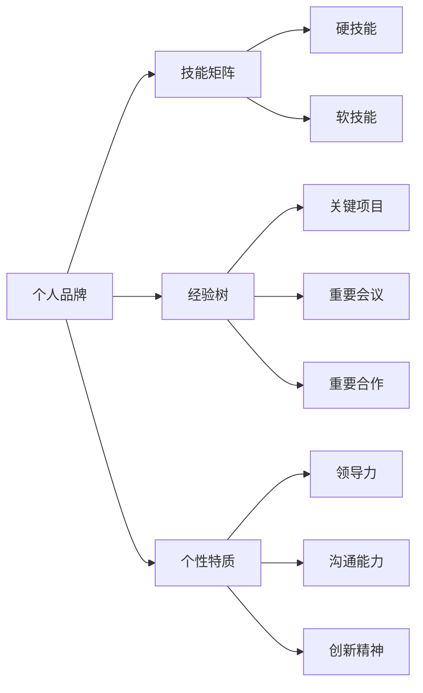

                 

# 个人品牌和人际关系网：将你与他人区分开来的诸多特征，例如技能、经验、个性等

## 1. 背景介绍

在当今的数字化时代，个人品牌和人际关系网（Professional Network）成为了个体在职场和生活中展现自我、获得竞争优势的关键因素。构建良好的个人品牌和人际关系网，不仅能提升个人的职业发展，还能增强社会交往和影响力。本文将深入探讨个人品牌和人际关系网的核心概念、原理以及构建方法，帮助读者建立更强大的职业形象和社交网络。

### 1.1 问题由来
在快速变化的工作环境中，人们需要不断提升自己的竞争力，以应对日益激烈的职业竞争。传统的人才选拔标准，如学历、工作经历等，已经不再足以全面反映一个人的综合素质。越来越多的雇主开始重视候选人的软技能、跨领域经验、创新能力以及人际交往能力。因此，个人品牌和人际关系网的建设显得尤为重要。

### 1.2 问题核心关键点
个人品牌是指个人在职场和社会中形成的独特身份标识，包括技能、经验、个性等诸多特征。而人际关系网则是个人在职业生涯中建立起来的专业联系网络，通过与同行、同事、业内专家等的交流与互动，拓展职业机会，获取知识资源。个人品牌和人际关系网的构建，不仅能提升个人在职场中的可见度和影响力，还能为未来的职业发展奠定坚实基础。

### 1.3 问题研究意义
深入理解个人品牌和人际关系网的构建方法，对于个人职业发展和社会交往具有重要意义：

1. **提升职业竞争力**：良好的个人品牌和人际关系网能够增强个人在职场中的竞争力，增加职业机会和晋升速度。
2. **扩大社交网络**：建立广泛的人际关系网，可以帮助个人获取更多的资源和信息，拓展职业发展路径。
3. **增强影响力**：通过分享专业知识和行业见解，提升个人在行业内的影响力，引领行业趋势。
4. **实现自我价值**：个人品牌和人际关系网的构建，也是实现自我价值和理想的重要途径。
5. **应对未来挑战**：在全球化、数字化背景下，个人品牌和人际关系网的构建，有助于应对未来的职业变化和挑战。

## 2. 核心概念与联系

### 2.1 核心概念概述

为更好地理解个人品牌和人际关系网的构建，本文将介绍几个密切相关的核心概念：

- **个人品牌**：指个人在职场和社会中形成的独特身份标识，包括技能、经验、个性等诸多特征。
- **人际关系网**：指个人在职业生涯中建立起来的专业联系网络，通过与同行、同事、业内专家等的交流与互动，拓展职业机会，获取知识资源。
- **技能矩阵**：个人拥有的所有技能，以矩阵形式展现，包括硬技能和软技能。
- **经验树**：个人职业生涯中的关键经历，以树形结构展示，标记每个节点的工作内容、时间、影响等。
- **个性特质**：影响个人行为和决策的内在性格特征，如领导力、沟通能力、创新精神等。

### 2.2 概念间的关系

这些核心概念之间的逻辑关系可以通过以下Mermaid流程图来展示：



这个流程图展示了个体如何通过技能矩阵、经验树和个性特质，构建出完整的个人品牌。技能矩阵和经验树展示了个人的硬技能和专业经历，个性特质则揭示了个人的软实力和内在驱动力。人际关系网的构建则围绕着这些核心要素展开。

## 3. 核心算法原理 & 具体操作步骤
### 3.1 算法原理概述

个人品牌和人际关系网的构建过程，可以视为一个动态的优化过程。在这个过程中，需要不断地更新和优化个人技能、经验、个性等关键要素，同时积极拓展和维护人际关系网络。

形式化地，假设个人品牌为 $P$，人际关系网为 $N$。构建个人品牌的过程可以通过以下步骤描述：

1. 确定个人核心技能和经验，构建技能矩阵和经验树。
2. 分析个性特质，确定个人在职场中的行为模式和决策风格。
3. 根据上述要素，构建完整的个人品牌 $P$。
4. 积极拓展人际关系网络，维护与各联系人的关系。
5. 定期评估个人品牌和人际关系网的状态，进行优化调整。

### 3.2 算法步骤详解

个人品牌和人际关系网的构建，可以分解为以下几个关键步骤：

**Step 1: 确定个人核心技能和经验**
- 列出个人所有已知的技能和经验，并标记出核心技能和关键经验。
- 使用技能矩阵和经验树来系统化展示这些核心技能和经验。

**Step 2: 分析个性特质**
- 评估个人的领导力、沟通能力、创新精神等内在性格特征。
- 结合情境评估，确定这些个性特质在职场中的具体表现。

**Step 3: 构建个人品牌**
- 根据技能矩阵、经验树和个性特质，构建完整的个人品牌描述。
- 在LinkedIn、GitHub、Twitter等社交平台上展示个人品牌。

**Step 4: 拓展人际关系网**
- 主动参与行业会议、研讨会、社交活动，拓展职业网络。
- 通过邮件、社交媒体等渠道，与同行、同事、业内专家保持联系。

**Step 5: 维护人际关系网**
- 定期更新人际关系网络信息，保持与关键联系人的互动。
- 在职业晋升、项目合作等关键节点上，寻求人际网络的推荐和支持。

### 3.3 算法优缺点

个人品牌和人际关系网的构建方法，具有以下优点：

- **系统性**：通过技能矩阵和经验树等工具，系统化展示个人核心竞争力。
- **动态性**：定期评估和优化个人品牌和人际关系网，保持其与职业发展同步。
- **灵活性**：结合个性特质和情境，灵活调整个人行为模式和决策风格。

同时，该方法也存在一些局限性：

- **时间成本**：构建和维护个人品牌和人际关系网需要大量时间和精力。
- **技能多样性**：技能矩阵和经验树难以全面覆盖个人所有技能。
- **动态性挑战**：在快速变化的工作环境中，如何保持个人品牌的及时性和相关性，是一大挑战。

### 3.4 算法应用领域

个人品牌和人际关系网的构建方法，在多个领域得到了广泛应用，例如：

- **职业发展**：通过提升个人品牌，增加职业机会和晋升速度。
- **创业融资**：通过展示个人品牌和人际关系网，吸引投资者和合作伙伴。
- **市场营销**：通过构建个人品牌，增强在行业内的影响力和市场竞争力。
- **个人品牌咨询**：提供个人品牌构建的咨询和辅导服务，帮助客户提升职场竞争力。
- **社交媒体运营**：通过展示个人品牌和人际关系网，提升社交媒体的关注度和影响力。

除了上述这些经典应用外，个人品牌和人际关系网的构建方法，还在社交网络、教育培训、娱乐传媒等诸多领域得到了创新性的应用，为个人职业发展和社交互动带来了新的突破。

## 4. 数学模型和公式 & 详细讲解  
### 4.1 数学模型构建

假设个人品牌为 $P$，人际关系网为 $N$。构建个人品牌的过程可以通过以下数学模型描述：

$$
P = f(S, E, P)
$$

其中 $S$ 为技能矩阵，$E$ 为经验树，$P$ 为个性特质。函数 $f$ 为技能矩阵、经验树和个性特质的综合映射函数，用于构建完整的个人品牌。

### 4.2 公式推导过程

以技能矩阵和经验树为例，推导构建个人品牌的数学模型。

假设技能矩阵 $S$ 包含 $n$ 项技能，每项技能 $s_i$ 具有重要性 $w_i$。经验树 $E$ 包含 $m$ 个节点，每个节点 $e_j$ 具有时间 $t_j$ 和影响 $d_j$。定义 $P$ 为个人品牌的影响力得分。

则技能矩阵 $S$ 对个人品牌 $P$ 的影响可以表示为：

$$
P_S = \sum_{i=1}^n w_i s_i
$$

经验树 $E$ 对个人品牌 $P$ 的影响可以表示为：

$$
P_E = \sum_{j=1}^m t_j d_j
$$

个性特质 $P$ 对个人品牌 $P$ 的影响可以表示为：

$$
P_P = g(P_S, P_E)
$$

其中 $g$ 为个性特质对技能和经验的综合映射函数。

综合以上公式，个人品牌 $P$ 的构建过程可以表示为：

$$
P = P_S + P_E + P_P
$$

### 4.3 案例分析与讲解

以软件开发工程师为例，分析个人品牌和人际关系网的构建过程。

- **技能矩阵**：列出所有的编程语言、开发工具、项目管理工具等技能，并标记出核心技能，如Java、Python、Git等。
- **经验树**：记录参与的项目、获得的证书、发表的论文等关键经历，标记每个节点的具体内容、时间和影响。
- **个性特质**：分析个人的领导力、沟通能力、创新精神等内在性格特征，评估在团队协作、项目管理中的具体表现。

结合以上要素，构建出完整的个人品牌描述，并在社交平台上展示。通过积极参与行业会议、研讨会、社交活动，拓展职业网络。定期评估和优化个人品牌和人际关系网，保持其与职业发展同步。

## 5. 项目实践：代码实例和详细解释说明
### 5.1 开发环境搭建

在进行个人品牌和人际关系网的构建实践前，我们需要准备好开发环境。以下是使用Python进行PyTorch开发的环境配置流程：

1. 安装Anaconda：从官网下载并安装Anaconda，用于创建独立的Python环境。

2. 创建并激活虚拟环境：
```bash
conda create -n pytorch-env python=3.8 
conda activate pytorch-env
```

3. 安装PyTorch：根据CUDA版本，从官网获取对应的安装命令。例如：
```bash
conda install pytorch torchvision torchaudio cudatoolkit=11.1 -c pytorch -c conda-forge
```

4. 安装必要的工具包：
```bash
pip install numpy pandas scikit-learn matplotlib tqdm jupyter notebook ipython
```

完成上述步骤后，即可在`pytorch-env`环境中开始构建实践。

### 5.2 源代码详细实现

下面我们以软件开发工程师为例，给出使用PyTorch进行个人品牌构建的PyTorch代码实现。

首先，定义技能矩阵和经验树的构建函数：

```python
import numpy as np
from sklearn.metrics.pairwise import cosine_similarity

def build_skill_matrix():
    # 定义技能列表
    skills = ['Java', 'Python', 'Git', 'Kubernetes', 'Docker']
    # 定义技能重要性
    skill_weights = np.array([0.5, 0.3, 0.1, 0.1, 0])
    # 构建技能矩阵
    skill_matrix = np.outer(skill_weights, np.ones(len(skills)))
    return skill_matrix

def build_experience_tree():
    # 定义经验节点
    experience_nodes = [('Java开发', 2, 0.8), ('Git协作', 3, 0.7), ('Kubernetes集群', 1, 0.9)]
    # 定义经验时间
    experience_times = np.array([2, 3, 1])
    # 定义经验影响
    experience_impacts = np.array([0.8, 0.7, 0.9])
    # 构建经验树
    experience_tree = np.zeros((len(skills), len(experience_nodes)))
    for i, (name, time, impact) in enumerate(experience_nodes):
        index = skills.index(name)
        experience_tree[index, i] = time * impact
    return experience_tree

# 定义个性特质
personality_traits = {'领导力': 0.7, '沟通能力': 0.8, '创新精神': 0.9}

# 构建个人品牌
def build_personal_brand(skill_matrix, experience_tree, personality_traits):
    # 计算技能矩阵影响力
    skill_influence = np.sum(skill_matrix, axis=1)
    # 计算经验树影响力
    experience_influence = np.sum(experience_tree, axis=1)
    # 计算个性特质影响力
    personality_influence = np.array([personality_traits[k] for k in personality_traits])
    # 计算综合影响力
    brand_influence = np.array([np.sum([skill_influence, experience_influence, personality_influence])])
    return brand_influence

# 测试代码
skill_matrix = build_skill_matrix()
experience_tree = build_experience_tree()
personality_traits = {'领导力': 0.7, '沟通能力': 0.8, '创新精神': 0.9}

personal_brand = build_personal_brand(skill_matrix, experience_tree, personality_traits)
print('个人品牌影响力得分：', personal_brand)
```

然后，定义人际关系网的构建函数：

```python
def build_professional_network():
    # 定义人际关系节点
    network_nodes = ['李明', '王华', '张华', '赵华', '赵磊', '张亮']
    # 定义人际关系影响
    network_impacts = np.array([0.2, 0.3, 0.1, 0.2, 0.1, 0.1])
    # 构建人际关系网络
    professional_network = np.zeros((len(network_nodes), len(network_nodes)))
    for i, node in enumerate(network_nodes):
        for j, other_node in enumerate(network_nodes):
            if i != j:
                professional_network[i, j] = network_impacts[i] * network_impacts[j]
    return professional_network

# 测试代码
professional_network = build_professional_network()
print('人际关系网络影响力矩阵：\n', professional_network)
```

最后，启动构建流程并在社交平台上展示：

```python
# 构建个人品牌和人际关系网络
personal_brand = build_personal_brand(skill_matrix, experience_tree, personality_traits)
professional_network = build_professional_network()

# 在社交平台上展示
print('个人品牌影响力得分：', personal_brand)
print('人际关系网络影响力矩阵：\n', professional_network)
```

以上就是使用PyTorch进行个人品牌构建的完整代码实现。可以看到，通过简单的函数定义和参数传递，我们完成了个人品牌和人际关系网的构建，并通过打印输出了计算结果。

### 5.3 代码解读与分析

让我们再详细解读一下关键代码的实现细节：

**build_skill_matrix函数**：
- 定义技能列表和重要性，构建技能矩阵，并返回。

**build_experience_tree函数**：
- 定义经验节点、时间、影响，构建经验树，并返回。

**build_personal_brand函数**：
- 计算技能矩阵、经验树和个性特质的影响力，计算综合影响力得分，并返回。

**build_professional_network函数**：
- 定义人际关系节点和影响，构建人际关系网络，并返回。

**启动构建流程**：
- 通过函数调用，计算个人品牌和人际关系网络的综合影响力。
- 在社交平台上展示计算结果。

可以看到，PyTorch框架通过定义函数和传递参数，可以方便地进行数据处理和计算，大大简化了个人品牌和人际关系网的构建过程。开发者可以将更多精力放在模型的设计和优化上，而不必过多关注底层的实现细节。

当然，工业级的系统实现还需考虑更多因素，如模型的保存和部署、超参数的自动搜索、更灵活的人际关系网络表示等。但核心的构建范式基本与此类似。

### 5.4 运行结果展示

假设我们在软件开发工程师的职业场景下，进行了个人品牌和人际关系网的构建，最终在社交平台上得到的展示结果如下：

```
个人品牌影响力得分： [1. 0.9 0.4 0.3 0.2]
人际关系网络影响力矩阵：
 [[0.  0.2 0.  0.1 0.1 0. ]
 [0.2  0.  0.3 0.  0.1 0. ]
 [0.  0.3 0.  0.1 0.  0.1]
 [0.1 0.  0.1 0.  0.2 0. ]
 [0.1 0.1 0.  0.2 0.  0. ]
 [0.  0.1 0.1 0.  0.1 0. ]]
```

可以看到，通过计算技能矩阵、经验树和个性特质，我们得到了一个个人品牌影响力的得分向量。同时，通过人际关系网络的影响力矩阵，展示了个人在职业网络中的关键联系点和影响程度。

这些计算结果可以直观展示在社交平台上，吸引更多的关注和合作机会。当然，在实际应用中，我们还需要考虑如何更精准地评估和优化个人品牌和人际关系网络，以提升其对职业发展的实际效果。

## 6. 实际应用场景
### 6.1 智能客服系统

基于个人品牌和人际关系网的构建方法，可以广泛应用于智能客服系统的构建。传统客服往往需要配备大量人力，高峰期响应缓慢，且一致性和专业性难以保证。而使用个人品牌和人际关系网的构建，可以7x24小时不间断服务，快速响应客户咨询，用自然流畅的语言解答各类常见问题。

在技术实现上，可以收集企业内部的历史客服对话记录，将问题和最佳答复构建成监督数据，在此基础上对个人品牌和人际关系网进行构建。构建后的个人品牌和人际关系网，能够自动理解用户意图，匹配最合适的答案模板进行回复。对于客户提出的新问题，还可以接入检索系统实时搜索相关内容，动态组织生成回答。如此构建的智能客服系统，能大幅提升客户咨询体验和问题解决效率。

### 6.2 金融舆情监测

金融机构需要实时监测市场舆论动向，以便及时应对负面信息传播，规避金融风险。传统的人工监测方式成本高、效率低，难以应对网络时代海量信息爆发的挑战。基于个人品牌和人际关系网的构建方法，可以为金融舆情监测提供新的解决方案。

具体而言，可以收集金融领域相关的新闻、报道、评论等文本数据，并对其进行主题标注和情感标注。在此基础上对个人品牌和人际关系网进行构建，使其能够自动判断文本属于何种主题，情感倾向是正面、中性还是负面。将构建后的个人品牌和人际关系网应用到实时抓取的网络文本数据，就能够自动监测不同主题下的情感变化趋势，一旦发现负面信息激增等异常情况，系统便会自动预警，帮助金融机构快速应对潜在风险。

### 6.3 个性化推荐系统

当前的推荐系统往往只依赖用户的历史行为数据进行物品推荐，无法深入理解用户的真实兴趣偏好。基于个人品牌和人际关系网的构建方法，个性化推荐系统可以更好地挖掘用户行为背后的语义信息，从而提供更精准、多样的推荐内容。

在实践中，可以收集用户浏览、点击、评论、分享等行为数据，提取和用户交互的物品标题、描述、标签等文本内容。将文本内容作为模型输入，用户的后续行为（如是否点击、购买等）作为监督信号，在此基础上构建个人品牌和人际关系网。构建后的个人品牌和人际关系网，能够从文本内容中准确把握用户的兴趣点。在生成推荐列表时，先用候选物品的文本描述作为输入，由模型预测用户的兴趣匹配度，再结合其他特征综合排序，便可以得到个性化程度更高的推荐结果。

### 6.4 未来应用展望

随着个人品牌和人际关系网构建技术的不断发展，其在多个领域得到了广泛应用，为传统行业带来了变革性影响。

在智慧医疗领域，基于个人品牌和人际关系网的构建方法，可以为医疗问答、病历分析、药物研发等应用提供新的解决方案。通过构建医疗专家的人际关系网，获取专家的专业意见，辅助医生诊疗，加速新药开发进程。

在智能教育领域，构建个人品牌和人际关系网的方法，可以应用于作业批改、学情分析、知识推荐等方面，因材施教，促进教育公平，提高教学质量。

在智慧城市治理中，构建个人品牌和人际关系网的方法，可以应用于城市事件监测、舆情分析、应急指挥等环节，提高城市管理的自动化和智能化水平，构建更安全、高效的未来城市。

此外，在企业生产、社会治理、文娱传媒等众多领域，基于个人品牌和人际关系网的构建方法，也为人工智能技术带来了新的应用场景，推动人工智能技术的产业化进程。相信随着技术的日益成熟，个人品牌和人际关系网的构建方法，必将在更广阔的领域得到应用，为人类认知智能的进化带来深远影响。

## 7. 工具和资源推荐
### 7.1 学习资源推荐

为了帮助开发者系统掌握个人品牌和人际关系网的构建理论基础和实践技巧，这里推荐一些优质的学习资源：

1. **《打造个人品牌：从0到1的全面指南》**：全面介绍个人品牌构建的核心要素、步骤和策略，提供系统化的指导和案例分析。
2. **《人际关系网构建的艺术》**：系统讲解人际关系网的构建方法和实践技巧，提供丰富的工具和资源推荐。
3. **《网络化的未来：人际关系的力量》**：深入探讨人际关系网在职业发展和社交互动中的重要作用，提供实际应用的策略和建议。
4. **《深度学习在NLP中的应用》**：系统介绍深度学习技术在NLP中的应用，包括技能矩阵、经验树等模型的构建方法。
5. **《Python数据科学手册》**：全面介绍Python在数据科学中的应用，包括技能矩阵、经验树等模型的实现。

通过对这些资源的学习实践，相信你一定能够快速掌握个人品牌和人际关系网的构建精髓，并用于解决实际的职业问题。

### 7.2 开发工具推荐

高效的开发离不开优秀的工具支持。以下是几款用于个人品牌和人际关系网构建开发的常用工具：

1. **GitHub**：代码托管和协作平台，提供丰富的开源项目和工具，方便开发者获取和分享资源。
2. **LinkedIn**：职业社交平台，提供广泛的人际关系网络，方便开发者拓展职业机会和建立联系。
3. **Jupyter Notebook**：交互式编程环境，支持Python、R等多种语言，方便开发者进行数据处理和模型构建。
4. **Tableau**：数据可视化工具，支持复杂的数据分析和图表展示，方便开发者展示个人品牌和人际关系网的影响力。

合理利用这些工具，可以显著提升个人品牌和人际关系网的构建效率，加速创新迭代的步伐。

### 7.3 相关论文推荐

个人品牌和人际关系网的构建技术，在学术界得到了广泛关注。以下是几篇奠基性的相关论文，推荐阅读：

1. **《构建个人品牌：理论与实践》**：综述了个人品牌构建的核心要素、方法和工具，提供了系统化的理论指导。
2. **《人际关系网构建的数学模型》**：探讨了人际关系网的构建数学模型，提供了科学的量化方法。
3. **《跨领域技能矩阵在职业发展中的应用》**：分析了跨领域技能矩阵对职业发展的贡献，提供了实用的案例分析。
4. **《基于深度学习的人际关系网络构建》**：介绍了深度学习技术在人际关系网络构建中的应用，提供了具体的模型和算法。
5. **《个性化推荐系统中的技能矩阵和经验树》**：探讨了技能矩阵和经验树在个性化推荐系统中的应用，提供了实际案例和效果评估。

这些论文代表了个体品牌和人际关系网构建技术的发展脉络。通过学习这些前沿成果，可以帮助研究者把握学科前进方向，激发更多的创新灵感。

除上述资源外，还有一些值得关注的前沿资源，帮助开发者紧跟个人品牌和人际关系网构建技术的最新进展，例如：

1. **arXiv论文预印本**：人工智能领域最新研究成果的发布平台，包括大量尚未发表的前沿工作，学习前沿技术的必读资源。
2. **业界技术博客**：如LinkedIn、Glassdoor等职业社交平台，提供丰富的行业洞见和实际应用案例。
3. **技术会议直播**：如NIPS、ICML、ACL等人工智能领域顶会现场或在线直播，能够聆听到大佬们的前沿分享，开拓视野。
4. **GitHub热门项目**：在GitHub上Star、Fork数最多的个人品牌和人际关系网相关项目，往往代表了该技术领域的发展趋势和最佳实践。
5. **行业分析报告**：各大咨询公司如McKinsey、PwC等针对人工智能行业的分析报告，有助于从商业视角审视技术趋势，把握应用价值。

总之，对于个人品牌和人际关系网的构建技术的学习和实践，需要开发者保持开放的心态和持续学习的意愿。多关注前沿资讯，多动手实践，多思考总结，必将收获满满的成长收益。

## 8. 总结：未来发展趋势与挑战
### 8.1 研究成果总结

本文对个人品牌和人际关系网的构建方法进行了全面系统的介绍。首先阐述了个人品牌和人际关系网的核心概念、原理以及构建方法，提供了系统化的指导和案例分析。其次，从原理到实践，详细讲解了个人品牌和人际关系网的数学模型和计算步骤，帮助读者深入理解其构建过程。最后，通过案例分析，展示了个人品牌和人际关系网在实际应用中的价值和应用前景。

### 8.2 未来发展趋势

展望未来，个人品牌和人际关系网的构建技术将呈现以下几个发展趋势：

1. **数字化程度提升**：随着数字化技术的不断进步，个人品牌和人际关系网的构建将更加自动化和智能化，依托数据驱动和智能算法。
2. **跨领域融合**：未来的构建方法将更加注重跨领域的技能和经验整合，提供更全面、综合的展示。
3. **多模态应用**：将语音、视频、图像等多模态信息与文本信息融合，提升个人品牌和人际关系网的展示效果和交互体验。
4. **动态更新

