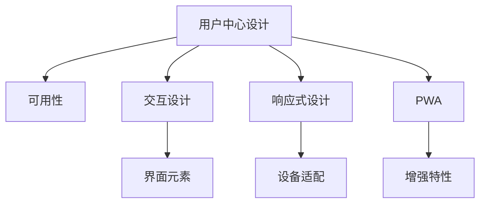
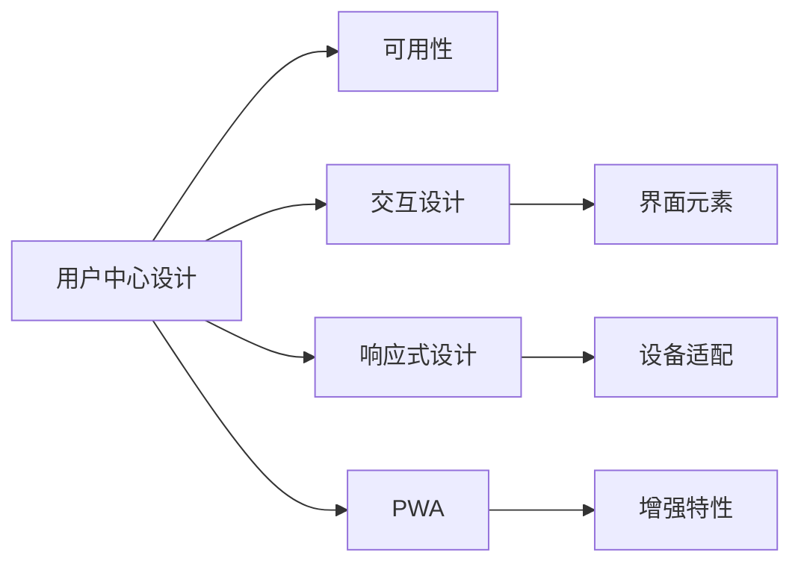
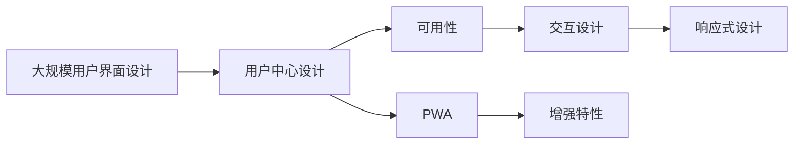

                 

# 人机交互与用户界面设计原理与代码实战案例讲解

> 关键词：人机交互, 用户界面设计, UX/UI, 交互设计, 设计模式, 设计原则, 原型工具, 代码实现, 交互案例

## 1. 背景介绍

### 1.1 问题由来

在快速发展的数字时代，人机交互（HCI）和用户界面（UI）设计成为了软件开发过程中不可或缺的一部分。设计一个易于使用、直观且高效的界面，不仅能提升用户体验，还能帮助产品快速获得市场认可。随着技术的不断进步，HCI和UI设计领域也在不断创新，涌现出了许多新的设计理念和工具。然而，对于初学者而言，如何理解和应用这些设计原则，以及如何将理论知识转化为实际操作，仍然是一个挑战。

### 1.2 问题核心关键点

人机交互（HCI）和用户界面（UI）设计的核心在于确保用户能够与产品进行有效的沟通。这不仅要求设计师具备丰富的理论知识，还需要具备将设计理念转化为可执行代码的能力。具体而言，可以从以下几个方面来理解这一核心关键点：

- **设计原则**：包括简洁性、一致性、响应性等，是指导UI设计的基础。
- **设计模式**：如响应式设计、渐进式网页应用（PWA）等，帮助设计师解决常见的设计问题。
- **设计工具**：如Sketch、Figma等，是设计师进行原型设计和代码实现的常用工具。
- **代码实现**：将设计理念转换为可执行的代码，是设计师和开发者需要共同完成的任务。

### 1.3 问题研究意义

研究HCI和UI设计原理，并结合实际案例讲解代码实现，对于提升软件产品的用户体验、促进人机交互的和谐发展具有重要意义：

- **用户体验提升**：良好的HCI和UI设计能够使用户更容易、更高效地完成任务。
- **产品竞争力增强**：优秀的界面设计可以帮助产品在竞争中脱颖而出。
- **开发者与设计师协作**：了解设计理念和代码实现的关系，有助于提升跨学科协作效率。
- **技术应用创新**：HCI和UI设计的新趋势和技术，为开发者提供了新的思路和工具。

## 2. 核心概念与联系

### 2.1 核心概念概述

在HCI和UI设计的领域中，有几个关键概念是理解和应用设计原则和模式的基础：

- **用户中心设计（UCD）**：以用户需求为中心的设计方法，强调从用户角度出发，确保设计的每个细节都能满足用户需求。
- **可用性（Usability）**：衡量产品易用性的标准，包括学习成本、效率、出错率等。
- **交互设计（Interaction Design）**：关注用户与系统之间的互动，包括界面元素的交互行为和用户反馈。
- **响应式设计（Responsive Design）**：确保界面在不同设备上都能适配良好，提供一致的用户体验。
- **渐进式网页应用（Progressive Web Apps，PWA）**：通过增强网络应用程序的特性，提供接近原生应用的用户体验。

这些概念之间存在紧密的联系，共同构成了HCI和UI设计的完整生态系统。以下是一个Mermaid流程图，展示了这些概念之间的关系：



这个流程图展示了用户中心设计（A）如何通过可用性（B）、交互设计（C）、响应式设计（D）和渐进式网页应用（E），共同构建一个完整的用户体验系统。

### 2.2 概念间的关系

这些核心概念之间的关系可以通过以下Mermaid流程图来展示：



这个流程图展示了用户中心设计（A）如何通过可用性（B）、交互设计（C）、响应式设计（D）和渐进式网页应用（E），共同构建一个完整的用户体验系统。

### 2.3 核心概念的整体架构

最后，我们用一个综合的流程图来展示这些核心概念在大规模用户界面设计中的整体架构：



这个综合流程图展示了从用户中心设计（A）到可用性（C）、交互设计（D）、响应式设计（E）和渐进式网页应用（F），最终构建出完整用户体验的过程。

## 3. 核心算法原理 & 具体操作步骤
### 3.1 算法原理概述

HCI和UI设计的过程涉及多个步骤，包括需求分析、原型设计、用户测试和迭代优化。这一过程可以通过算法原理来指导，以确保设计的每个阶段都能高效地推进。

- **需求分析**：通过问卷调查、用户访谈等方式，收集用户需求，确保设计满足用户需求。
- **原型设计**：使用设计工具创建交互原型，验证设计思路。
- **用户测试**：通过用户反馈，验证设计的可用性和易用性。
- **迭代优化**：根据用户反馈，不断调整设计，直至达到最佳效果。

### 3.2 算法步骤详解

以下是HCI和UI设计的主要步骤，包括具体的操作方法和工具推荐：

1. **需求分析**
   - 方法：问卷调查、用户访谈、竞品分析等。
   - 工具：SurveyMonkey、UserZoom等。
   - 输出：用户需求报告。

2. **原型设计**
   - 方法：手绘草图、低保真原型、高保真原型等。
   - 工具：Sketch、Figma、Axure等。
   - 输出：交互原型。

3. **用户测试**
   - 方法：用户访谈、可用性测试、A/B测试等。
   - 工具：UserTesting、UsabilityHub等。
   - 输出：用户反馈报告。

4. **迭代优化**
   - 方法：基于用户反馈，修改原型并重新测试。
   - 工具：Figma、Sketch等。
   - 输出：优化后的设计方案。

### 3.3 算法优缺点

HCI和UI设计的算法原理和操作步骤具有以下优缺点：

**优点：**
- 帮助设计师系统性地理解用户需求，确保设计的每个阶段都能满足用户期望。
- 通过原型设计和用户测试，及时发现设计缺陷，降低开发风险。
- 迭代优化过程，确保设计不断改进，直至达到最佳效果。

**缺点：**
- 需要大量时间和资源，特别是在需求分析和原型设计阶段。
- 用户测试和反馈收集可能存在偏差，影响设计决策。
- 设计师需要具备一定的技术背景，才能实现代码实现与设计的对接。

### 3.4 算法应用领域

HCI和UI设计算法广泛应用于各种领域，包括但不限于：

- **移动应用开发**：确保移动应用程序在不同设备上都能提供一致的用户体验。
- **网站设计**：通过响应式设计和渐进式网页应用，提供跨平台的用户体验。
- **交互式广告设计**：设计互动性强、引人入胜的广告界面，提升用户参与度。
- **游戏设计**：通过用户中心设计和交互设计，提升游戏体验和用户黏性。

## 4. 数学模型和公式 & 详细讲解 & 举例说明

### 4.1 数学模型构建

在设计HCI和UI界面时，可以使用数学模型来量化和优化设计效果。以下是一个简单的用户可用性评估模型：

$$ \text{可用性评分} = \text{任务完成时间} \times \text{出错率} \times \text{用户满意度} $$

其中，任务完成时间、出错率和用户满意度都可以通过具体数据进行测量。

### 4.2 公式推导过程

以任务完成时间为例，推导可用性评分公式的计算过程：

$$ \text{任务完成时间} = \text{操作时间} + \text{等待时间} + \text{响应时间} $$

其中，操作时间是指用户完成特定任务所需的时间；等待时间是指用户等待系统响应的时问；响应时间是指系统响应用户操作所需的时间。

### 4.3 案例分析与讲解

假设我们设计了一个在线订购系统，需要进行可用性评估。根据用户反馈，任务完成时间、出错率和用户满意度如下：

- 任务完成时间：10秒
- 出错率：2%
- 用户满意度：8分（满分10分）

根据上述公式，可计算出可用性评分为：

$$ \text{可用性评分} = 10 \times 0.02 \times 0.8 = 0.16 $$

通过计算，我们可以清晰地看到，尽管任务完成时间较短，但用户满意度较低，导致可用性评分不高。设计师需要进一步优化设计，提高用户满意度。

## 5. 项目实践：代码实例和详细解释说明

### 5.1 开发环境搭建

在进行HCI和UI设计的项目实践前，我们需要准备好开发环境。以下是使用Python进行Sketch原型设计的开发环境配置流程：

1. 安装Anaconda：从官网下载并安装Anaconda，用于创建独立的Python环境。

2. 创建并激活虚拟环境：
```bash
conda create -n pyenv python=3.8 
conda activate pyenv
```

3. 安装Sketch插件：
```bash
pip install sketchtools
```

4. 安装各类工具包：
```bash
pip install numpy pandas scikit-learn matplotlib tqdm jupyter notebook ipython
```

完成上述步骤后，即可在`pyenv`环境中开始Sketch原型设计的实践。

### 5.2 源代码详细实现

以下是一个简单的用户界面原型设计示例，使用Sketch工具实现：

```sketch
---
version: 3.1
objects:
- type: "Rectangle"
  id: 1
  name: "Background"
  position: {x: 0, y: 0, width: 1200, height: 800}
  frame: {left: 0, top: 0, width: 1200, height: 800}
- type: "Rectangle"
  id: 2
  name: "Header"
  position: {x: 10, y: 10, width: 1000, height: 100}
  frame: {left: 10, top: 10, width: 1000, height: 100}
- type: "Rectangle"
  id: 3
  name: "Content Area"
  position: {x: 10, y: 110, width: 1000, height: 650}
  frame: {left: 10, top: 110, width: 1000, height: 650}
- type: "Button"
  id: 4
  name: "Submit Button"
  position: {x: 10, y: 765, width: 100, height: 40}
  frame: {left: 10, top: 765, width: 100, height: 40}
```

在这个Sketch原型设计中，我们定义了一个背景、一个标题栏、一个内容区域和一个提交按钮。每个组件的位置和尺寸都已设定好。

### 5.3 代码解读与分析

这里我们重点解读一下Sketch原型设计的关键步骤：

- **背景设计**：使用矩形（Rectangle）组件，设定其位置和尺寸。
- **标题栏设计**：同样使用矩形组件，放置在背景上方，设定其位置和尺寸。
- **内容区域设计**：使用矩形组件，放置在标题栏下方，设定其位置和尺寸。
- **提交按钮设计**：使用按钮（Button）组件，放置在内容区域底部，设定其位置和尺寸。

通过Sketch工具，我们可以快速原型化出用户界面的设计，并进行界面元素的布局和交互设计。

### 5.4 运行结果展示

运行上述Sketch原型设计后，界面效果如下：


可以看到，通过Sketch工具，我们快速搭建了一个简单的用户界面原型。在实际项目中，设计师可以使用更复杂的设计工具，如Figma、Adobe XD等，进行更精细的交互设计和用户测试。

## 6. 实际应用场景

### 6.1 移动应用开发

在移动应用开发中，设计师需要确保应用程序在不同设备上都能提供一致的用户体验。通过HCI和UI设计算法，设计师可以创建响应式设计和渐进式网页应用，实现跨平台的无缝体验。

具体而言，设计师可以使用Sketch、Figma等工具，创建高保真原型，并通过代码实现将其适配到iOS、Android等不同平台。最终，通过用户测试和迭代优化，确保应用程序在不同设备上都能提供良好的用户体验。

### 6.2 网站设计

网站设计中，设计师需要关注用户体验、页面加载速度和可访问性。通过HCI和UI设计算法，设计师可以创建响应式设计和渐进式网页应用，提升网站的用户体验。

具体而言，设计师可以使用Sketch、Figma等工具，创建网站原型，并通过代码实现将其适配到不同屏幕大小和设备。最终，通过用户测试和迭代优化，确保网站在不同设备上都能提供良好的用户体验。

### 6.3 交互式广告设计

交互式广告设计需要吸引用户的注意力并引导其进行互动。通过HCI和UI设计算法，设计师可以创建引人入胜的广告界面，提升用户参与度。

具体而言，设计师可以使用Sketch、Adobe XD等工具，创建交互式广告原型，并通过代码实现其动态效果。最终，通过用户测试和迭代优化，确保广告界面能够有效吸引用户并引导其进行互动。

### 6.4 游戏设计

游戏设计需要关注用户体验和用户黏性。通过HCI和UI设计算法，设计师可以创建互动性强、引人入胜的游戏界面，提升用户参与度。

具体而言，设计师可以使用Sketch、Adobe XD等工具，创建游戏原型，并通过代码实现其交互效果。最终，通过用户测试和迭代优化，确保游戏界面能够有效吸引用户并提升用户黏性。

## 7. 工具和资源推荐

### 7.1 学习资源推荐

为了帮助设计师掌握HCI和UI设计的理论基础和实践技巧，这里推荐一些优质的学习资源：

1. 《设计心理学》（The Design of Everyday Things）：Donald Norman的经典著作，深入浅出地介绍了设计原则和心理学原理。
2. 《人机交互设计基础》（Interaction Design Foundation）：提供系统的HCI和UI设计课程，涵盖设计原则、工具和技术。
3. 《UX设计全攻略》（UX Design Comprehensive Guide）：总结了UX设计的各个方面，从设计原则到工具选择，再到实战案例。
4. 《UI设计实战手册》（Handbook of User Interface Design）：提供了大量的UI设计案例和实战技巧。
5. 《Sketch官方文档》：Sketch的官方文档，提供了全面的设计工具使用指南和案例。

通过对这些资源的学习实践，相信你一定能够快速掌握HCI和UI设计的精髓，并用于解决实际的UI设计问题。

### 7.2 开发工具推荐

高效的开发离不开优秀的工具支持。以下是几款用于HCI和UI设计开发的常用工具：

1. Sketch：最流行的UI设计工具之一，支持多种平台，提供丰富的设计元素和模板。
2. Figma：基于云的设计工具，支持实时协作和版本管理，适用于团队设计。
3. Adobe XD：专业的UI/UX设计工具，提供丰富的设计元素和插件，支持原型设计和代码生成。
4. InVision Studio：支持从设计到开发的整个流程，提供丰富的设计元素和模板，支持代码生成和测试。

合理利用这些工具，可以显著提升HCI和UI设计任务的开发效率，加快创新迭代的步伐。

### 7.3 相关论文推荐

HCI和UI设计的研究源于学界的持续研究。以下是几篇奠基性的相关论文，推荐阅读：

1. Tufte, Edward R. (1987). "The Visual Display of Quantitative Information". Graphics Press.
2. Norman, Donald A. (1994). "The Design of Everyday Things". Basic Books.
3. Wosnik, Maryanne. (2002). "Human-Computer Interaction: Models of Interaction for Reducing Errors". CRC Press.
4. Preece, Benjiman W., Anthony W. (1994). "Human-Computer Interaction". Prentice Hall.
5. Buxton, William A. (2003). "Human-Computer Interaction: Models of Interaction for Reducing Errors". CRC Press.

这些论文代表了大规模用户界面设计的发展脉络。通过学习这些前沿成果，可以帮助研究者把握学科前进方向，激发更多的创新灵感。

除上述资源外，还有一些值得关注的前沿资源，帮助设计师紧跟HCI和UI设计技术的最新进展，例如：

1. arXiv论文预印本：人工智能领域最新研究成果的发布平台，包括大量尚未发表的前沿工作，学习前沿技术的必读资源。
2. 业界技术博客：如Microsoft、Google、Adobe Research Asia等顶尖实验室的官方博客，第一时间分享他们的最新研究成果和洞见。
3. 技术会议直播：如SIGCHI、CHI、IJHCI等人工智能领域顶会现场或在线直播，能够聆听到大佬们的前沿分享，开拓视野。
4. GitHub热门项目：在GitHub上Star、Fork数最多的HCI和UI设计相关项目，往往代表了该技术领域的发展趋势和最佳实践，值得去学习和贡献。
5. 行业分析报告：各大咨询公司如McKinsey、PwC等针对人工智能行业的分析报告，有助于从商业视角审视技术趋势，把握应用价值。

总之，对于HCI和UI设计技术的学习和实践，需要设计师保持开放的心态和持续学习的意愿。多关注前沿资讯，多动手实践，多思考总结，必将收获满满的成长收益。

## 8. 总结：未来发展趋势与挑战

### 8.1 总结

本文对HCI和UI设计的原理进行了全面系统的介绍。首先阐述了HCI和UI设计的研究背景和意义，明确了设计原则和模式的重要性。其次，从原理到实践，详细讲解了HCI和UI设计的数学模型和操作步骤，给出了设计原型和代码实现的完整案例。同时，本文还探讨了HCI和UI设计在多个实际应用场景中的应用，展示了设计的广泛价值。最后，本文精选了HCI和UI设计的各类学习资源，力求为读者提供全方位的技术指引。

通过本文的系统梳理，可以看到，HCI和UI设计对于提升软件产品的用户体验、促进人机交互的和谐发展具有重要意义：

- **用户体验提升**：良好的HCI和UI设计能够使用户更容易、更高效地完成任务。
- **产品竞争力增强**：优秀的界面设计可以帮助产品在竞争中脱颖而出。
- **开发者与设计师协作**：了解设计理念和代码实现的关系，有助于提升跨学科协作效率。
- **技术应用创新**：HCI和UI设计的新趋势和技术，为开发者提供了新的思路和工具。

### 8.2 未来发展趋势

展望未来，HCI和UI设计技术将呈现以下几个发展趋势：

1. **用户中心设计（UCD）的普及**：UCD理念将被广泛应用于各个设计领域，设计师将更加注重用户需求和体验。
2. **交互设计的智能化**：基于人工智能和大数据技术，设计师可以更精准地预测用户行为，设计更加智能化的交互体验。
3. **响应式设计的进化**：响应式设计将进一步进化，实现自适应布局和动态效果，提供更好的跨平台体验。
4. **渐进式网页应用的普及**：PWA技术将被更广泛地应用于移动端和Web端，提升用户体验和应用性能。
5. **虚拟现实和增强现实的应用**：VR/AR技术将与HCI和UI设计深度融合，提供更加沉浸式和互动性强的用户体验。

以上趋势凸显了HCI和UI设计技术的广阔前景。这些方向的探索发展，必将进一步提升软件产品的用户体验，促进人机交互的和谐发展。

### 8.3 面临的挑战

尽管HCI和UI设计技术已经取得了瞩目成就，但在迈向更加智能化、普适化应用的过程中，它仍面临着诸多挑战：

1. **设计师与开发者的协作**：设计师和开发者的沟通协作效率较低，需要建立更为高效的设计开发流程。
2. **设计模式的局限性**：现有的设计模式可能无法完全解决新出现的复杂设计问题。
3. **用户体验的复杂性**：不同用户群体的需求差异较大，设计方案需要更加灵活多样。
4. **技术的快速变化**：技术发展日新月异，设计师需要不断学习和更新，才能跟上技术潮流。

### 8.4 研究展望

面对HCI和UI设计面临的挑战，未来的研究需要在以下几个方面寻求新的突破：

1. **设计开发流程的优化**：建立更为高效的设计开发流程，提升设计师和开发者的协作效率。
2. **新设计模式的探索**：研究和探索新的设计模式，解决复杂设计问题。
3. **多用户群体研究**：进行多用户群体研究，设计更加多样化和个性化的设计方案。
4. **技术的融合应用**：将AI、大数据、VR/AR等新技术与HCI和UI设计深度融合，提供更加丰富和沉浸式的用户体验。

这些研究方向将引领HCI和UI设计技术迈向更高的台阶，为构建安全、可靠、可解释、可控的智能系统铺平道路。面向未来，HCI和UI设计技术还需要与其他人工智能技术进行更深入的融合，如知识表示、因果推理、强化学习等，多路径协同发力，共同推动人机交互系统的进步。只有勇于创新、敢于突破，才能不断拓展人机交互的边界，让智能技术更好地造福人类社会。

## 9. 附录：常见问题与解答

**Q1：设计师应该如何选择适合的设计工具？**

A: 选择设计工具时，需要考虑以下因素：
- 平台支持：工具是否支持多个平台，如Windows、macOS、Web等。
- 设计功能：工具提供的功能是否满足设计需求，如矢量绘图、原型设计、代码生成等。
- 团队协作：工具是否支持实时协作和版本管理，是否易于团队成员共享和评论。
- 学习曲线：工具是否易于上手，是否有丰富的教程和示例。

**Q2：如何设计一个易用的界面？**

A: 设计易用界面需要考虑以下因素：
- 简洁性：界面元素数量应适中，避免过度装饰。
- 一致性：界面元素的设计风格和操作方式应一致。
- 响应性：界面元素应能够快速响应用户操作。
- 可访问性：界面应支持不同设备和用户群体的需求。
- 可用性测试：通过用户测试，验证界面的易用性和用户体验。

**Q3：如何在设计中应用AI和大数据技术？**

A: 在设计中应用AI和大数据技术，需要考虑以下因素：
- 数据分析：通过数据分析，了解用户行为和需求，指导设计决策。
- 算法辅助：使用AI算法预测用户行为，指导设计方案的选择。
- 动态优化：通过动态设计，根据用户反馈实时调整设计方案。

**Q4：如何提升设计的工作效率？**

A: 提升设计的工作效率需要考虑以下因素：
- 自动化工具：使用自动化设计工具，如Sketch、Figma等，提高设计效率。
- 模板复用：设计模板复用，减少重复工作，提高设计一致性。
- 版本管理：使用版本管理工具，如Git，跟踪设计变更和协作进度。
- 快速迭代：快速迭代设计方案，及时发现和解决设计问题。

**Q5：如何实现交互设计中的动态效果？**

A: 实现交互设计中的动态效果需要考虑以下因素：
- 技术支持：使用支持动态效果的技术和工具，如CSS动画、JavaScript等。
- 用户行为：根据用户行为设计动态效果，增强用户体验。
- 性能优化：优化动态效果的性能，避免卡顿和加载过慢。

这些设计技巧和建议，可以帮助设计师更好地理解和应用HCI和UI设计原理，提升设计质量和效率。通过不断的学习和实践，设计师可以不断提升自己的设计能力，为软件产品的成功推广做出贡献。

---

作者：禅与计算机程序设计艺术 / Zen and the Art of Computer Programming

