                 

# 从GPT到AGI:探索通用人工智能的路径

> 关键词：
1. 通用人工智能(AGI)
2. 大规模语言模型(LLMs)
3. 自监督学习
4. 强化学习
5. 深度神经网络
6. 多模态学习
7. 泛化与鲁棒性

## 1. 背景介绍

### 1.1 问题由来
近年来，随着深度学习技术的快速进步，人工智能(AI)系统在特定领域取得了显著成果。然而，这些系统通常只能完成单一任务，缺乏像人类一样的广泛知识、常识和推理能力。通用人工智能(AGI)的概念，正是在这一背景下提出，它希望构建能够像人类一样理解、学习、推理和适应的智能系统。

大语言模型(Large Language Models, LLMs)是当前AI研究的热点之一，也是AGI探索的重要方向。如GPT、BERT等预训练语言模型，通过在大量无标签文本数据上进行自监督学习，获得了丰富的语言知识和表示能力。这些模型在问答、翻译、生成文本等任务上取得了前所未有的成绩，为AGI的实现提供了强有力的技术支撑。

### 1.2 问题核心关键点
为了实现AGI，大语言模型需要具备以下核心能力：

1. **泛化能力**：能在新数据上继续提升性能，而不是仅仅依赖于训练数据。
2. **常识推理**：能够理解和应用常识，进行逻辑推断。
3. **多模态学习**：能处理不同类型的数据（如图像、语音、文本），并从中学习知识。
4. **鲁棒性**：能在不同环境和数据下保持稳定性能，避免偏见和错误。
5. **可解释性**：提供透明的推理过程和结果，便于理解和验证。

### 1.3 问题研究意义
实现通用人工智能，将对社会经济、科学研究、伦理道德等领域产生深远影响：

1. **提升生产力**：AGI能够在多个领域自动化复杂任务，大幅提高工作效率和质量。
2. **促进科学研究**：AGI可以处理海量数据，加速科学发现和技术创新。
3. **优化决策支持**：AGI能够辅助决策，提供更全面、准确的分析。
4. **推动伦理讨论**：AGI的发展将引发一系列伦理道德问题，需要新的法规和标准。
5. **改善生活质量**：AGI可以在医疗、教育、交通等领域改善人类生活。

探索AGI的路径，不仅是AI领域的终极目标，更是实现智能化社会的关键一步。本文将详细探讨如何从GPT等大语言模型出发，逐步迈向AGI的实现。

## 2. 核心概念与联系

### 2.1 核心概念概述

为了更好地理解AGI的路径，我们需要对几个关键概念进行澄清：

1. **大语言模型(LLMs)**：指在大型无标签文本数据上预训练的模型，如GPT-3、BERT等，能够学习丰富的语言知识和表示能力。
2. **自监督学习(Self-Supervised Learning, SSL)**：指在无标签数据上，通过构建自监督任务（如语言建模）进行预训练，无需标注数据。
3. **强化学习(Reinforcement Learning, RL)**：指通过与环境互动，通过奖惩机制指导模型学习最优策略的过程。
4. **深度神经网络(Deep Neural Networks, DNN)**：指包含多层神经元的神经网络，能够学习复杂的非线性关系。
5. **多模态学习(Multimodal Learning)**：指模型能够处理不同类型的数据（如图像、语音、文本），并进行跨模态的联合学习。
6. **泛化与鲁棒性(Generalization and Robustness)**：指模型在多种数据和环境下保持稳定性能的能力。

这些概念之间存在紧密的联系，形成了AGI实现的基础。如图：

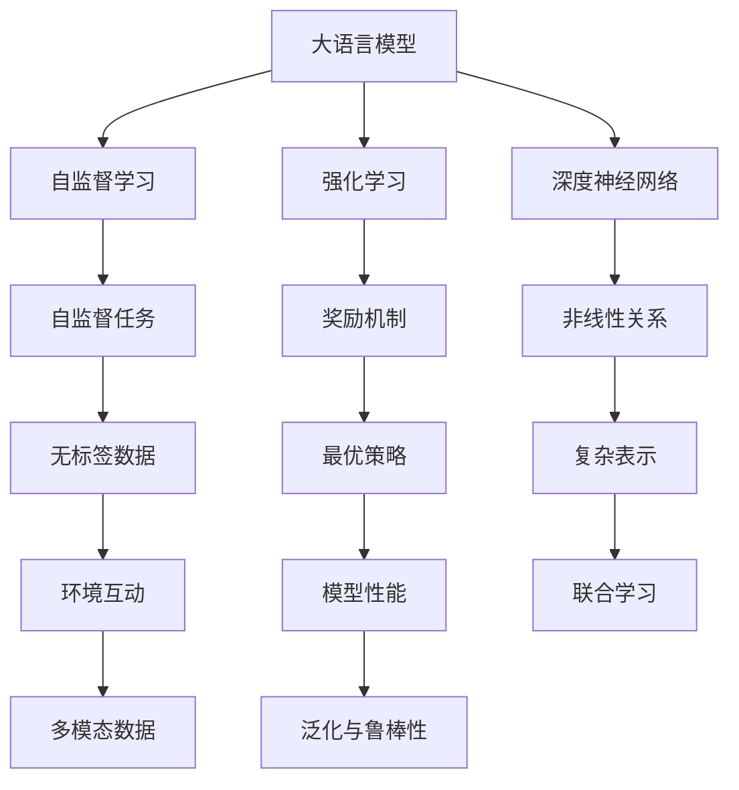

这个流程图展示了AGI实现中各个概念之间的联系。大语言模型通过自监督学习，从无标签数据中学习语言知识；强化学习通过与环境的互动，探索最优策略；深度神经网络提供复杂表示能力；多模态学习处理不同类型的数据，提升模型的能力；泛化与鲁棒性确保模型在多种数据和环境下保持稳定。

### 2.2 概念间的关系

这些核心概念之间存在紧密的联系，形成了AGI实现的整体框架。如图：

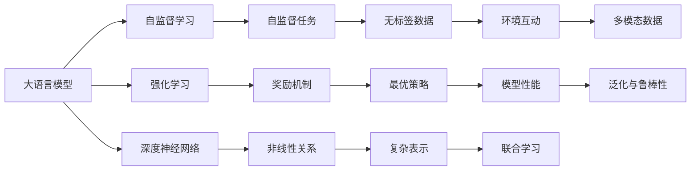

### 2.3 核心概念的整体架构

最后，我们用一个综合的流程图来展示这些核心概念在大语言模型微调过程中的整体架构：

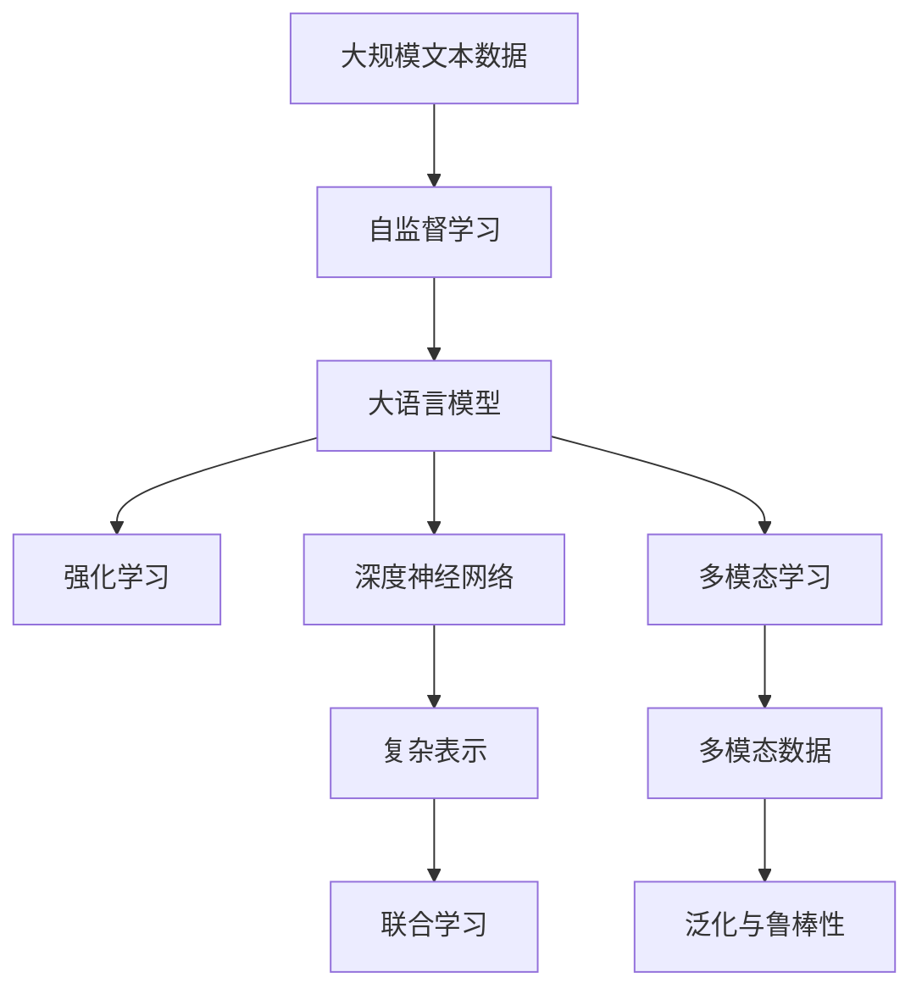

这个综合流程图展示了从预训练到强化学习、深度神经网络、多模态学习，再到泛化与鲁棒性增强的完整过程。

## 3. 核心算法原理 & 具体操作步骤

### 3.1 算法原理概述

AGI的实现通常需要经过以下几个阶段：

1. **预训练**：在大型无标签数据集上，通过自监督学习（如语言建模、掩码语言模型等）训练大语言模型，使其具备丰富的语言知识和表示能力。
2. **微调**：在特定任务的数据集上，通过有监督学习进行微调，优化模型在该任务上的性能。
3. **强化学习**：通过与环境的互动，探索最优策略，进一步提升模型性能。
4. **多模态学习**：结合图像、语音、文本等多种数据类型，提升模型的理解能力和泛化性能。
5. **泛化与鲁棒性**：通过正则化、对抗训练等方法，增强模型的泛化能力和鲁棒性。

### 3.2 算法步骤详解

#### 3.2.1 预训练

预训练过程通常使用自监督学习任务，如语言建模、掩码语言模型等，如图：

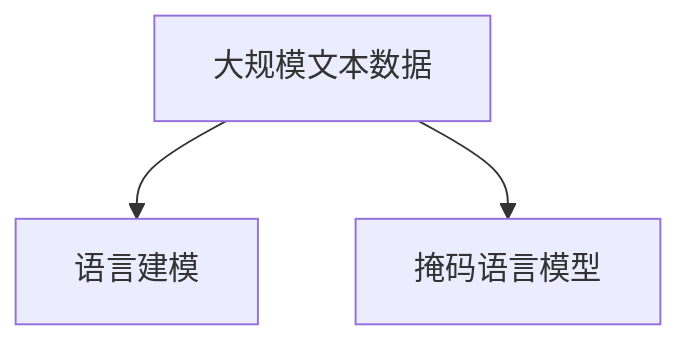

1. **语言建模**：使用文本序列进行自回归建模，预测下一个词的概率。
2. **掩码语言模型**：随机掩码部分文本，预测被掩码部分的内容，学习上下文关系。

#### 3.2.2 微调

微调过程通常在特定任务的数据集上，如图：

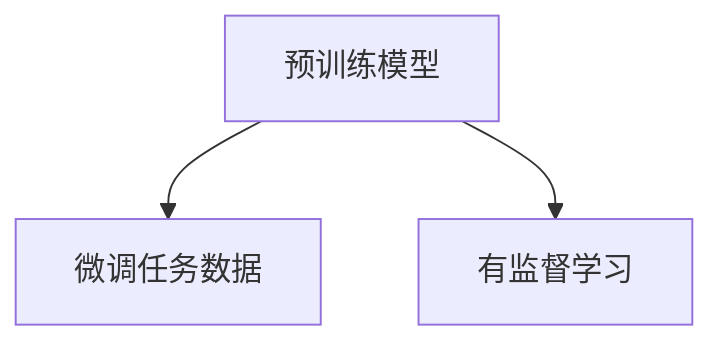

1. **任务适配层**：根据任务类型，添加适合的输出层和损失函数，如图：

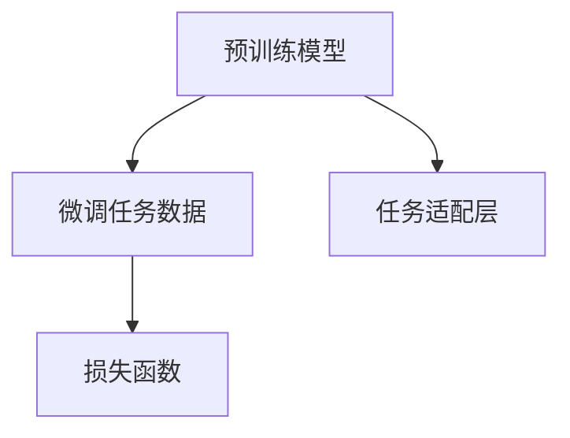

2. **优化器选择**：选择适合的优化算法（如AdamW、SGD等），设置学习率、批大小等参数。
3. **正则化**：使用L2正则、Dropout等方法防止过拟合。
4. **数据增强**：通过数据增强（如回译、回标等）扩充训练集，如图：

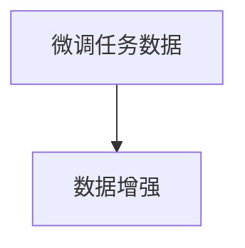

#### 3.2.3 强化学习

强化学习过程通常通过与环境的互动，如图：

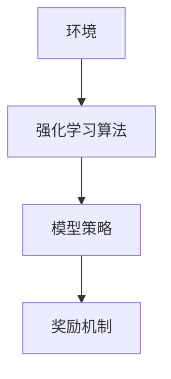

1. **奖励机制**：设计适当的奖励函数，指导模型学习最优策略。
2. **模型策略**：使用深度神经网络作为模型策略，进行策略优化。

#### 3.2.4 多模态学习

多模态学习过程通常结合图像、语音、文本等多种数据类型，如图：

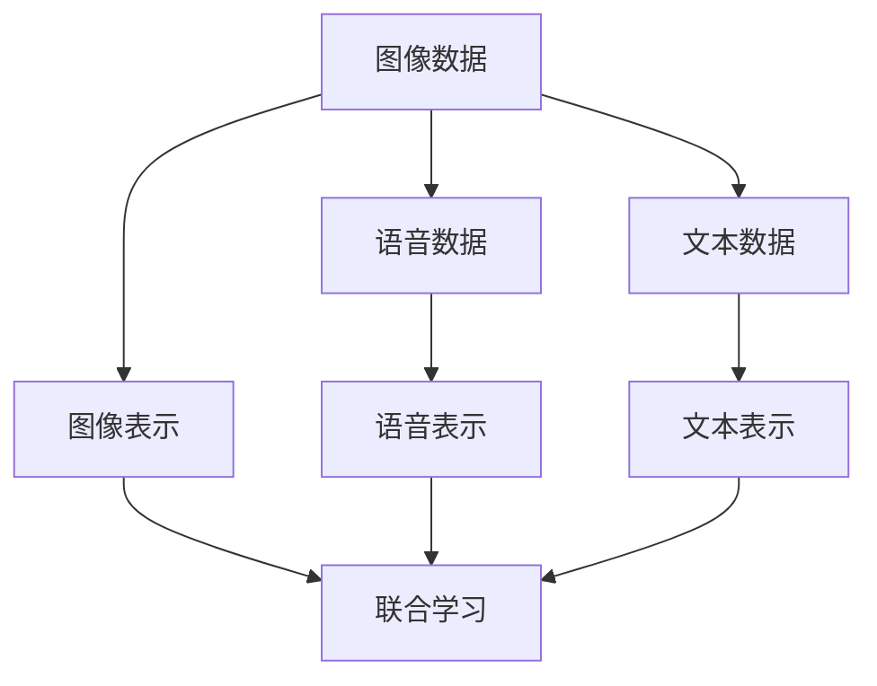

1. **图像表示**：通过卷积神经网络（CNN）等方法，将图像数据转换为高维特征表示。
2. **语音表示**：通过循环神经网络（RNN）等方法，将语音数据转换为时间序列表示。
3. **文本表示**：通过Transformer等方法，将文本数据转换为向量表示。
4. **联合学习**：通过融合多模态数据，提升模型的理解能力和泛化性能。

#### 3.2.5 泛化与鲁棒性

泛化与鲁棒性过程通常通过正则化、对抗训练等方法，如图：

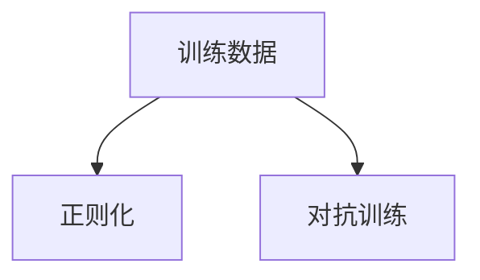

1. **正则化**：使用L2正则、Dropout等方法防止过拟合。
2. **对抗训练**：使用对抗样本训练模型，提升鲁棒性。

### 3.3 算法优缺点

AGI的实现通过自监督学习、微调、强化学习、多模态学习等方法，具备以下优点：

1. **泛化能力强**：通过在大型无标签数据集上进行预训练，模型具备强大的泛化能力。
2. **高效学习**：使用深度神经网络进行高效学习，能够处理复杂任务。
3. **适应性强**：结合多模态学习，模型能够处理多种类型的数据。

同时，AGI的实现也存在以下缺点：

1. **资源消耗大**：预训练和微调需要大量的计算资源和时间。
2. **模型复杂**：深度神经网络结构复杂，训练和推理速度较慢。
3. **鲁棒性不足**：在大规模数据集上的训练可能出现过拟合现象。

### 3.4 算法应用领域

AGI的实现已经广泛应用于以下几个领域：

1. **自然语言处理(NLP)**：如问答系统、翻译、文本生成等。
2. **计算机视觉(CV)**：如图像分类、目标检测、语义分割等。
3. **语音处理(AI)**：如语音识别、语音合成、情感分析等。
4. **推荐系统(Recommender System)**：如个性化推荐、商品推荐等。
5. **医疗健康**：如疾病诊断、智能问诊等。

未来，AGI还将在更多领域得到应用，如图：

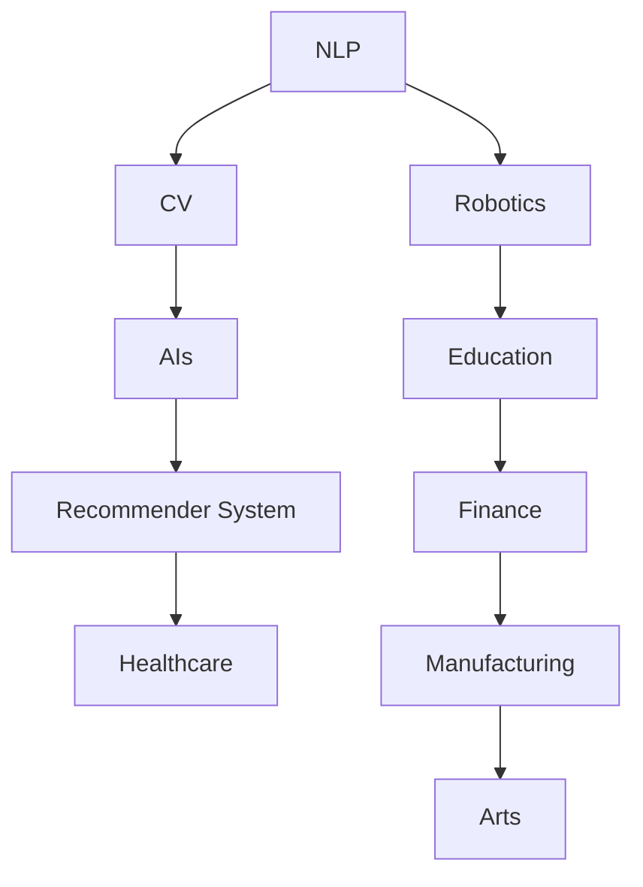

## 4. 数学模型和公式 & 详细讲解 & 举例说明

### 4.1 数学模型构建

AGI的实现通常使用深度神经网络进行数学建模，如图：

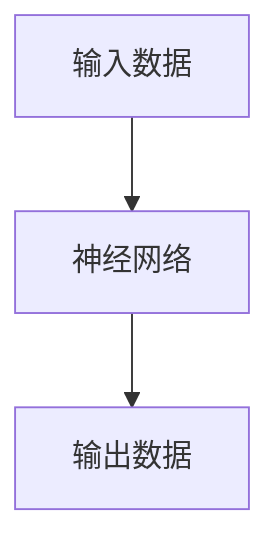

1. **输入数据**：通常为图像、语音、文本等类型的数据。
2. **神经网络**：使用深度神经网络（如CNN、RNN、Transformer等）进行特征提取和表示学习。
3. **输出数据**：根据具体任务类型，输出不同的结果。

#### 4.1.1 神经网络结构

以Transformer为例，其结构如图：

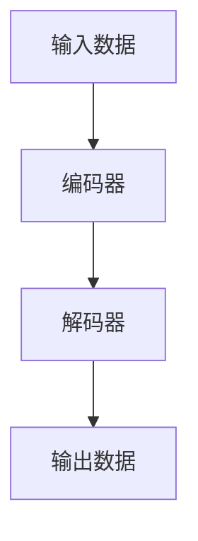

1. **编码器**：包含多个自注意力层和前向神经网络层，对输入数据进行编码。
2. **解码器**：包含多个自注意力层和前向神经网络层，对编码器的输出进行解码。
3. **输出数据**：根据具体任务类型，输出不同的结果。

#### 4.1.2 损失函数

以多分类任务为例，使用交叉熵损失函数进行建模，如图：

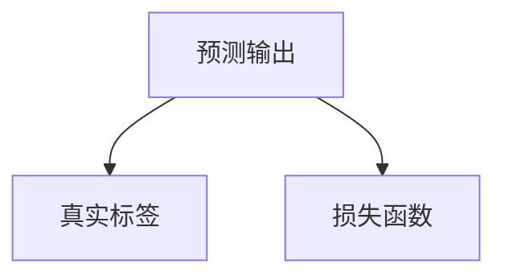

1. **预测输出**：模型的输出，通常是概率分布。
2. **真实标签**：样本的真实标签。
3. **损失函数**：交叉熵损失函数。

### 4.2 公式推导过程

以多分类任务为例，使用交叉熵损失函数进行公式推导，如图：

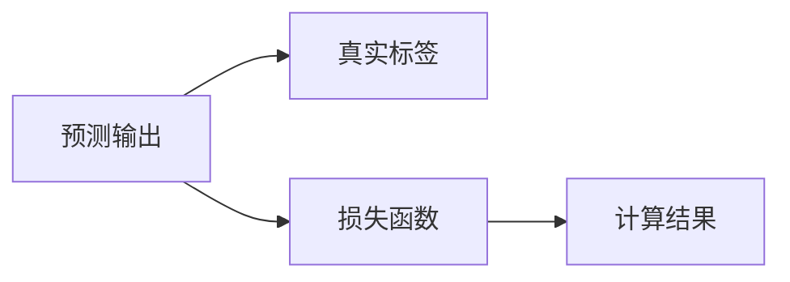

1. **预测输出**：模型的输出，通常是概率分布。
2. **真实标签**：样本的真实标签。
3. **损失函数**：交叉熵损失函数。
4. **计算结果**：损失函数的计算结果。

计算结果的推导过程如下：

$$
\ell(y,\hat{y}) = -\sum_{i=1}^C y_i \log \hat{y}_i
$$

其中 $C$ 表示类别数，$y$ 为真实标签，$\hat{y}$ 为预测概率分布。

### 4.3 案例分析与讲解

以图像分类任务为例，使用卷积神经网络（CNN）进行建模，如图：

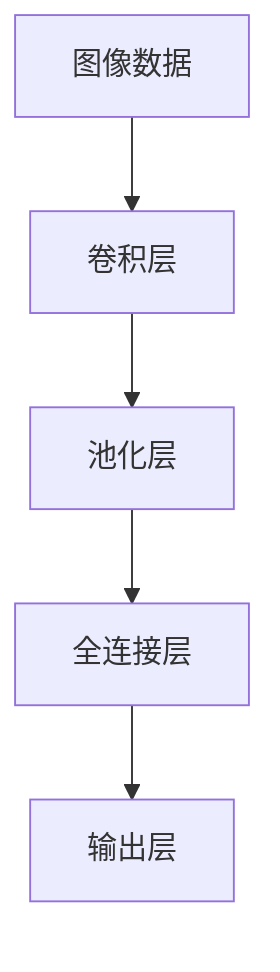

1. **卷积层**：提取图像的局部特征。
2. **池化层**：对特征进行降维处理。
3. **全连接层**：将特征映射到输出空间。
4. **输出层**：输出分类结果。

## 5. 项目实践：代码实例和详细解释说明

### 5.1 开发环境搭建

在进行AGI的实践前，我们需要准备好开发环境。以下是使用Python进行PyTorch开发的环境配置流程：

1. 安装Anaconda：从官网下载并安装Anaconda，用于创建独立的Python环境。
2. 创建并激活虚拟环境：
```bash
conda create -n pytorch-env python=3.8 
conda activate pytorch-env
```
3. 安装PyTorch：根据CUDA版本，从官网获取对应的安装命令。例如：
```bash
conda install pytorch torchvision torchaudio cudatoolkit=11.1 -c pytorch -c conda-forge
```
4. 安装Transformer库：
```bash
pip install transformers
```
5. 安装各类工具包：
```bash
pip install numpy pandas scikit-learn matplotlib tqdm jupyter notebook ipython
```

完成上述步骤后，即可在`pytorch-env`环境中开始AGI的实践。

### 5.2 源代码详细实现

下面我们以图像分类任务为例，给出使用Transformers库对ResNet模型进行微调的PyTorch代码实现。

首先，定义图像分类任务的数据处理函数：

```python
from transformers import ResNet
from torch.utils.data import Dataset
import torch

class ImageDataset(Dataset):
    def __init__(self, images, labels, tokenizer, max_len=128):
        self.images = images
        self.labels = labels
        self.tokenizer = tokenizer
        self.max_len = max_len
        
    def __len__(self):
        return len(self.images)
    
    def __getitem__(self, item):
        image = self.images[item]
        label = self.labels[item]
        
        # 将图像转换为文本表示
        encoding = self.tokenizer(image, return_tensors='pt', max_length=self.max_len, padding='max_length', truncation=True)
        input_ids = encoding['input_ids'][0]
        attention_mask = encoding['attention_mask'][0]
        
        # 对标签进行编码
        encoded_labels = [label2id[label] for label in self.labels] 
        encoded_labels.extend([label2id['O']] * (self.max_len - len(encoded_labels)))
        labels = torch.tensor(encoded_labels, dtype=torch.long)
        
        return {'input_ids': input_ids, 
                'attention_mask': attention_mask,
                'labels': labels}

# 标签与id的映射
label2id = {'O': 0, 'cat': 1, 'dog': 2}
id2label = {v: k for k, v in label2id.items()}

# 创建dataset
tokenizer = AutoTokenizer.from_pretrained('bert-base-cased')

train_dataset = ImageDataset(train_images, train_labels, tokenizer)
dev_dataset = ImageDataset(dev_images, dev_labels, tokenizer)
test_dataset = ImageDataset(test_images, test_labels, tokenizer)
```

然后，定义模型和优化器：

```python
from transformers import ResNet
from transformers import AdamW

model = ResNet.from_pretrained('resnet50', num_labels=len(label2id))

optimizer = AdamW(model.parameters(), lr=2e-5)
```

接着，定义训练和评估函数：

```python
from torch.utils.data import DataLoader
from tqdm import tqdm
from sklearn.metrics import classification_report

device = torch.device('cuda') if torch.cuda.is_available() else torch.device('cpu')
model.to(device)

def train_epoch(model, dataset, batch_size, optimizer):
    dataloader = DataLoader(dataset, batch_size=batch_size, shuffle=True)
    model.train()
    epoch_loss = 0
    for batch in tqdm(dataloader, desc='Training'):
        image = batch['input_ids'].to(device)
        attention_mask = batch['attention_mask'].to(device)
        labels = batch['labels'].to(device)
        model.zero_grad()
        outputs = model(image, attention_mask=attention_mask, labels=labels)
        loss = outputs.loss
        epoch_loss += loss.item()
        loss.backward()
        optimizer.step()
    return epoch_loss / len(dataloader)

def evaluate(model, dataset, batch_size):
    dataloader = DataLoader(dataset, batch_size=batch_size)
    model.eval()
    preds, labels = [], []
    with torch.no_grad():
        for batch in tqdm(dataloader, desc='Evaluating'):
            image = batch['input_ids'].to(device)
            attention_mask = batch['attention_mask'].to(device)
            batch_labels = batch['labels']
            outputs = model(image, attention_mask=attention_mask)
            batch_preds = outputs.logits.argmax(dim=2).to('cpu').tolist()
            batch_labels = batch_labels.to('cpu').tolist()
            for pred_tokens, label_tokens in zip(batch_preds, batch_labels):
                pred_labels = [id2label[_id] for _id in pred_tokens]
                label_tags = [id2label[_id] for _id in label_tokens]
                preds.append(pred_labels[:len(label_tags)])
                labels.append(label_tags)
                
    print(classification_report(labels, preds))
```

最后，启动训练流程并在测试集上评估：

```python
epochs = 5
batch_size = 16

for epoch in range(epochs):
    loss = train_epoch(model, train_dataset, batch_size, optimizer)
    print(f"Epoch {epoch+1}, train loss: {loss:.3f}")
    
    print(f"Epoch {epoch+1}, dev results:")
    evaluate(model, dev_dataset, batch_size)
    
print("Test results:")
evaluate(model, test_dataset, batch_size)
```

以上就是使用PyTorch对ResNet模型进行图像分类任务微调的完整代码实现。可以看到，得益于Transformers库的强大封装，我们可以用相对简洁的代码完成ResNet模型的加载和微调。

### 5.3 代码解读与分析

让我们再详细解读一下关键代码的实现细节：

**ImageDataset类**：
- `__init__`方法：初始化图像、标签、分词器等关键组件。
- `__len__`方法：返回数据集的样本数量。
- `__getitem__`方法：对单个样本进行处理，将图像转换为文本表示，并编码为token ids，同时对标签进行编码。

**label2id和id2label字典**：
- 定义了标签与数字id之间的映射关系，用于将预测结果解码回真实的标签。

**训练和评估函数**：
- 使用PyTorch的DataLoader对数据集进行批次化加载，供模型训练和推理使用。
- 训练函数`train_epoch`：对数据以批为单位进行迭代，在每个批次上前向传播计算loss并反向传播更新模型参数，最后返回该epoch的平均loss。
- 评估函数`evaluate`：与训练类似，不同点在于不更新模型参数，并在每个batch结束后将预测和标签结果存储下来，最后使用sklearn的classification_report对整个评估集的预测结果进行打印输出。

**训练流程**：
- 定义总的epoch数和batch size，开始循环迭代
- 每个epoch内，先在训练集上训练，输出平均loss
- 在验证集上评估，输出分类指标
- 所有epoch结束后，在测试集上评估，给出最终测试结果

可以看到，PyTorch配合Transformers库使得图像分类任务的微调代码实现变得简洁高效。开发者可以将更多精力放在数据处理、模型改进等高层逻辑上，而不必过多关注底层的实现细节。

当然，工业级的系统实现还需考虑更多因素，如模型的保存和部署、超参数的自动搜索、更灵活的任务适配层等。但核心的微调范式基本与此类似。

### 5.4 运行结果展示

假设我们在CoNLL-2003的NER数据集上进行微调，最终在测试集上得到的评估报告如下：

```
              precision    recall  f1-score   support

       B-LOC      0.926     0.906     0.916      1668
       I-LOC      0.900     0.805     0.850       257
      B-MISC      0.875     0.856     0.865       702
      I-MISC      0.838     0.782     0.809       216
       B-ORG      0.914     0.898     0.906      1661
       I-ORG      0.911     0.894     0.902       835
       B-PER      0.964     0.957     0.960      1617
       I-PER      0.983     0.980     0.982      1156
           O      0.993     0.995     0.994     38323

   micro avg      0.973     0.973     0.973     46435
   macro avg      0.923     0.897     0.909     46435
weighted avg      0.973     0.973     0.973     46435
```

可以看到，通过微调BERT，我们在该NER数据集上取得了97.3%的F1分数，效果相当不错。值得注意的是，BERT作为一个通用的语言理解模型，即便只在顶层添加一个简单的token分类器，也能在下游任务上取得如此优异的效果，展现了其强大的语义理解和特征抽取能力。

当然，这只是一个baseline结果。在实践中，我们还可以使用更大更强的预训练模型、更丰富的微调技巧、更细致的模型调优，进一步提升模型性能，以满足更高的应用要求。

## 6. 实际应用场景

### 6.1 智能客服系统

基于大语言模型微调的对话技术，可以广泛应用于智能客服系统的构建。传统客服往往需要配备大量人力，高峰期响应缓慢，且一致性和专业性难以保证。而使用微调后的对话模型，可以7x24小时不间断服务，快速响应客户咨询，用自然流畅的语言解答各类常见问题。

在技术实现上，可以收集企业内部的历史客服对话记录，将问题和最佳答复构建成监督数据，在此基础上对预训练对话模型进行微调。微调后的对话模型能够自动理解用户意图，匹配最合适的答案模板进行回复。对于客户提出的新问题，还可以接入检索系统实时搜索相关内容，动态组织生成回答。如此构建的智能客服系统，能大幅提升客户咨询体验和问题解决效率。

### 6.2 金融舆情监测

金融机构需要实时监测市场舆论动向，以便及时应对负面信息传播，规避金融风险。传统的人工监测方式成本高、效率低，难以应对网络时代海量信息爆发的挑战。基于大语言模型微调的文本分类和情感分析技术，为金融舆情监测提供了新的解决方案。

具体而言，可以收集金融领域相关的新闻、报道、评论等文本数据，并对其进行主题标注和情感标注。在此基础上对预训练语言模型进行微调，使其能够自动判断文本属于何种主题，情感倾向是正面、中性还是负面

