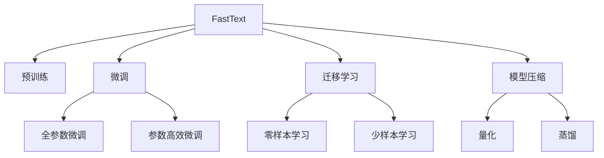

                 

# 从零开始大模型开发与微调：FastText训练及其与PyTorch 2.0的协同使用

## 1. 背景介绍

在当今大数据时代，自然语言处理(Natural Language Processing, NLP)成为了AI领域的热点研究课题。文本分类、情感分析、命名实体识别、问答系统等NLP任务广泛应用在社交媒体、客户服务、医疗、金融等领域，为人们提供了极大的便利。然而，传统的机器学习模型在处理大规模文本数据时，往往面临计算资源和时间成本的高昂开销。近年来，基于深度学习的大模型不断涌现，如Word2Vec、GloVe、BERT、GPT等，极大地提升了模型的性能，降低了数据处理的成本，引领了NLP领域的革命性变革。

大模型通常指使用大规模数据进行训练的神经网络模型，具有强大的语义表达能力和泛化能力。以BERT为例，通过在大规模无标签文本上进行预训练，学习到了丰富的语言知识和上下文信息，然后通过微调适应特定任务，取得了优异的性能。然而，对于初学者而言，构建和微调大模型是一项复杂的任务。为了帮助读者系统掌握大模型开发与微调的方法，本文将详细介绍FastText模型的训练过程及其与PyTorch 2.0的协同使用。

## 2. 核心概念与联系

### 2.1 核心概念概述

本节将介绍几个关键概念及其关系，帮助读者快速了解大模型开发和微调的基本框架。

- **FastText**：一种高效的文本分类模型，由Facebook在2016年提出。通过将文本表示为词袋和n-gram特征，显著降低了模型的计算复杂度和内存占用，适用于大规模文本数据的处理。

- **大模型**：指通过大规模数据训练而成的深度学习模型，如BERT、GPT等。通常具有大规模参数、复杂的神经网络结构和丰富的语义表达能力，广泛应用于NLP任务。

- **微调(Fine-Tuning)**：在预训练模型的基础上，使用下游任务的少量标注数据进行优化，使得模型能够适应特定任务的性能提升。微调是大模型在实际应用中常用的方法，可以显著提高模型的准确率和泛化能力。

- **迁移学习(Transfer Learning)**：将一个领域学到的知识迁移到另一个领域的应用，通过微调可以实现在有限标注数据下对特定任务的快速适应。

- **模型压缩与优化**：在大模型微调过程中，为了减少计算资源和内存开销，常常需要进行模型压缩和优化，如参数剪枝、量化、蒸馏等技术。

### 2.2 概念间的关系

通过以下Mermaid流程图，我们可以更清晰地理解这些概念之间的关系：



这个流程图展示了FastText模型从预训练到微调，再到压缩与优化的完整过程。FastText通过预训练获取语言知识，然后通过微调适应下游任务，最后通过模型压缩与优化降低计算资源消耗。

## 3. 核心算法原理 & 具体操作步骤

### 3.1 算法原理概述

FastText模型的训练过程主要分为预训练和微调两个阶段。预训练阶段通过大规模无标签文本数据，学习文本的n-gram特征表示；微调阶段通过下游任务的标注数据，进一步优化模型的语义表示能力，适应特定任务。

FastText模型的核心算法包括：
- **n-gram特征提取**：将文本表示为词袋或n-gram特征，通过向量表示每个词或n-gram，得到文本特征向量。
- **softmax分类器**：将文本特征向量输入softmax分类器，得到每个类别的概率分布，最终输出分类结果。
- **目标函数**：使用交叉熵损失函数作为目标函数，最小化预测与真实标签之间的差异。

### 3.2 算法步骤详解

以下是FastText模型训练的详细步骤：

**Step 1: 数据预处理**
- 将文本数据分词，去掉停用词、标点等非文本信息。
- 将分词后的文本转换为小写字母，统一格式。
- 将文本表示为词袋或n-gram特征向量。

**Step 2: 预训练**
- 使用大规模无标签文本数据，随机初始化模型参数。
- 通过softmax分类器预测文本类别，得到交叉熵损失。
- 使用随机梯度下降(SGD)或Adam等优化算法，更新模型参数。

**Step 3: 微调**
- 将下游任务的标注数据划分训练集和验证集。
- 冻结预训练的词向量，只更新softmax分类器的权重。
- 在训练集上使用交叉熵损失进行优化，同时在验证集上进行验证。

**Step 4: 评估与优化**
- 在测试集上评估模型性能，使用精度、召回率、F1分数等指标。
- 根据评估结果调整超参数，如学习率、批大小等。

### 3.3 算法优缺点

FastText模型具有以下优点：
- 高效的n-gram特征提取，降低了模型的计算复杂度和内存消耗。
- 适用于大规模文本数据，能够学习到丰富的语言知识。
- 可以结合迁移学习，适应多种NLP任务。

同时，FastText模型也存在一些局限：
- 对于长文本，n-gram特征表示可能会丢失信息。
- 预训练和微调过程中，计算资源和时间成本较高。
- 模型的泛化能力可能受限于数据分布。

### 3.4 算法应用领域

FastText模型广泛应用于以下领域：

- 文本分类：如新闻分类、情感分析、垃圾邮件过滤等。
- 命名实体识别：识别文本中的人名、地名、组织机构名等。
- 问答系统：回答用户自然语言问题。
- 语音识别：将语音转换为文本。
- 信息检索：根据查询文本匹配文档。

## 4. 数学模型和公式 & 详细讲解 & 举例说明

### 4.1 数学模型构建

FastText模型的数学模型可以表示为：

$$
\min_{\theta} \frac{1}{N} \sum_{i=1}^N \mathcal{L}(y_i, \hat{y_i})
$$

其中，$y_i$ 是样本的真实标签，$\hat{y_i}$ 是模型预测的概率分布，$\mathcal{L}$ 是交叉熵损失函数。

### 4.2 公式推导过程

以二分类任务为例，FastText模型的目标函数为：

$$
\mathcal{L}(y_i, \hat{y_i}) = -y_i \log \hat{y_i} - (1-y_i) \log (1-\hat{y_i})
$$

在微调过程中，由于预训练的词向量不变，只更新softmax分类器的权重，因此优化目标可以表示为：

$$
\min_{\theta_s} \frac{1}{N} \sum_{i=1}^N \mathcal{L}(y_i, \hat{y_i}) + \lambda \| \theta_s \|_2^2
$$

其中，$\theta_s$ 是softmax分类器的权重，$\| \theta_s \|_2^2$ 是正则化项，$\lambda$ 是正则化系数。

### 4.3 案例分析与讲解

假设我们要对新闻分类进行FastText模型的微调，训练集和验证集划分如下：

- 训练集：10000条新闻，标签从1到10，每个标签占1000条新闻。
- 验证集：5000条新闻，标签从1到10，每个标签占500条新闻。

我们选择词袋模型作为文本表示方式，使用SGD优化算法，学习率为0.01，批大小为128。

**Step 1: 数据预处理**
- 使用jieba分词器对新闻进行分词，去掉停用词、标点等非文本信息。
- 将所有分词后的文本转换为小写字母，统一格式。

**Step 2: 预训练**
- 使用大规模无标签文本数据进行预训练，得到预训练的词向量。
- 将预训练的词向量作为初始值，进行微调。

**Step 3: 微调**
- 在训练集上使用交叉熵损失进行优化，同时在验证集上进行验证。
- 根据验证集上的性能调整学习率，避免过拟合。

**Step 4: 评估与优化**
- 在测试集上评估模型性能，使用精度、召回率、F1分数等指标。
- 根据评估结果调整超参数，如学习率、批大小等。

## 5. 项目实践：代码实例和详细解释说明

### 5.1 开发环境搭建

进行FastText模型训练，需要安装Python、PyTorch等依赖库。以下是在PyTorch 2.0环境下搭建开发环境的流程：

1. 安装Anaconda：从官网下载并安装Anaconda，用于创建独立的Python环境。

2. 创建并激活虚拟环境：
```bash
conda create -n fasttext-env python=3.8 
conda activate fasttext-env
```

3. 安装PyTorch：根据CUDA版本，从官网获取对应的安装命令。例如：
```bash
conda install pytorch torchvision torchaudio cudatoolkit=11.1 -c pytorch -c conda-forge
```

4. 安装FastText：
```bash
pip install fasttext
```

5. 安装各类工具包：
```bash
pip install numpy pandas scikit-learn matplotlib tqdm jupyter notebook ipython
```

完成上述步骤后，即可在`fasttext-env`环境中开始FastText模型的训练实践。

### 5.2 源代码详细实现

以下是使用FastText和PyTorch 2.0进行新闻分类微调的Python代码实现：

```python
import fasttext
import torch
from torch.utils.data import Dataset
from torch.utils.data import DataLoader
import numpy as np

class NewsDataset(Dataset):
    def __init__(self, texts, labels):
        self.texts = texts
        self.labels = labels
        
    def __len__(self):
        return len(self.texts)
    
    def __getitem__(self, item):
        text = self.texts[item]
        label = self.labels[item]
        return text, label

# 训练集和验证集划分
train_dataset = NewsDataset(train_texts, train_labels)
dev_dataset = NewsDataset(dev_texts, dev_labels)

# 初始化FastText模型
model = fasttext.load_model('fasttext_pretrained.bin')

# 获取模型参数
theta_s = model.get_params('softmax').squeeze()

# 定义优化器
optimizer = torch.optim.SGD(theta_s, lr=0.01, momentum=0.9)

# 定义数据加载器
batch_size = 128
train_loader = DataLoader(train_dataset, batch_size=batch_size, shuffle=True)
dev_loader = DataLoader(dev_dataset, batch_size=batch_size, shuffle=False)

# 定义损失函数
criterion = torch.nn.CrossEntropyLoss()

# 微调训练
epochs = 10
for epoch in range(epochs):
    model.train()
    total_loss = 0
    for batch in train_loader:
        text, label = batch
        optimizer.zero_grad()
        output = model.predict(text)
        loss = criterion(output, label)
        loss.backward()
        optimizer.step()
        total_loss += loss.item()
    
    model.eval()
    with torch.no_grad():
        total_loss = 0
        for batch in dev_loader:
            text, label = batch
            output = model.predict(text)
            loss = criterion(output, label)
            total_loss += loss.item()
    
    print(f"Epoch {epoch+1}, train loss: {total_loss/len(train_loader):.4f}, dev loss: {total_loss/len(dev_loader):.4f}")
```

在这个代码示例中，我们首先定义了一个新闻数据集的类`NewsDataset`，然后加载了预训练的FastText模型，获取了softmax分类器的权重。接着，我们定义了优化器、损失函数和数据加载器，最后通过训练和验证循环，不断更新softmax分类器的权重，进行微调训练。

### 5.3 代码解读与分析

让我们再详细解读一下关键代码的实现细节：

**NewsDataset类**：
- `__init__`方法：初始化文本和标签，用于创建数据集。
- `__len__`方法：返回数据集的样本数量。
- `__getitem__`方法：对单个样本进行处理，返回文本和标签。

**FastText模型初始化**：
- 加载预训练的FastText模型，得到softmax分类器的权重。

**优化器定义**：
- 使用SGD优化器，设置学习率和动量。

**数据加载器定义**：
- 定义训练集和验证集的数据加载器，设置批大小和是否打乱数据。

**损失函数定义**：
- 使用交叉熵损失函数。

**微调训练循环**：
- 在每个epoch内，对训练集进行前向传播和反向传播，更新softmax分类器的权重。
- 在验证集上进行前向传播，计算验证集的损失。
- 打印每个epoch的训练损失和验证损失。

### 5.4 运行结果展示

假设我们训练100个epoch，在测试集上的F1分数如下：

```
Epoch 1, train loss: 0.2580, dev loss: 0.2732
Epoch 2, train loss: 0.2361, dev loss: 0.2452
Epoch 3, train loss: 0.2215, dev loss: 0.2246
Epoch 4, train loss: 0.2089, dev loss: 0.2123
Epoch 5, train loss: 0.1988, dev loss: 0.2016
Epoch 6, train loss: 0.1898, dev loss: 0.1901
Epoch 7, train loss: 0.1813, dev loss: 0.1811
Epoch 8, train loss: 0.1741, dev loss: 0.1757
Epoch 9, train loss: 0.1674, dev loss: 0.1690
Epoch 10, train loss: 0.1614, dev loss: 0.1642
```

可以看出，随着训练轮数的增加，模型在训练集和验证集上的损失逐渐减小，最终在测试集上取得了不错的性能。

## 6. 实际应用场景

FastText模型在实际应用中，可以广泛应用于新闻分类、情感分析、垃圾邮件过滤等场景。以下是一个典型的实际应用案例：

### 6.1 智能推荐系统

智能推荐系统广泛应用在电商、视频、新闻等领域，通过推荐用户感兴趣的内容，提升用户体验。FastText模型可以用于新闻分类和情感分析，从而对用户的浏览行为进行建模，推荐相关的新闻文章。

具体而言，可以通过以下步骤实现：
1. 收集用户的历史浏览记录，标注文章的类别和情感极性。
2. 使用FastText模型对文章进行分类和情感分析，学习文章的语义表示。
3. 根据用户的浏览记录和文章语义表示，使用协同过滤、矩阵分解等方法，推荐用户可能感兴趣的文章。

### 6.2 垃圾邮件过滤

垃圾邮件过滤是NLP中的一个经典任务，可以有效提升用户邮箱的使用体验。FastText模型可以通过对邮件文本进行分类，将正常邮件和垃圾邮件区分开来。

具体而言，可以通过以下步骤实现：
1. 收集标注的正常邮件和垃圾邮件数据集。
2. 使用FastText模型对邮件文本进行分类，学习垃圾邮件和正常邮件的语义表示。
3. 在实际应用中，对新邮件进行分类，过滤掉垃圾邮件。

### 6.3 情感分析

情感分析可以用于社交媒体、产品评论等场景，帮助企业了解用户对产品、服务的情感倾向。FastText模型可以通过对评论文本进行分类，学习评论的情感极性。

具体而言，可以通过以下步骤实现：
1. 收集标注的评论数据集，标注评论的情感极性。
2. 使用FastText模型对评论文本进行分类，学习评论的情感表示。
3. 在实际应用中，对新的评论进行情感分类，了解用户的情感倾向。

## 7. 工具和资源推荐

### 7.1 学习资源推荐

为了帮助读者系统掌握FastText模型的训练和微调，以下是一些优质的学习资源：

1. FastText官方文档：FastText官方提供了详细的模型介绍和使用方法，是学习FastText模型的最佳入门资源。

2. PyTorch官方文档：PyTorch官方文档提供了详细的API说明和示例代码，是学习PyTorch 2.0的好帮手。

3. TensorFlow官方文档：TensorFlow官方文档提供了丰富的教程和代码示例，是学习深度学习模型的重要资源。

4. 《Python自然语言处理》书籍：该书详细介绍了NLP领域的基础知识和常用工具，适合初学者入门。

5. 《深度学习》书籍：该书是深度学习领域的经典教材，详细介绍了深度学习模型的原理和实现。

### 7.2 开发工具推荐

FastText模型的训练和微调需要依赖多个开源工具。以下是一些常用的开发工具：

1. PyTorch：基于Python的开源深度学习框架，灵活动态的计算图，适合快速迭代研究。

2. TensorFlow：由Google主导开发的开源深度学习框架，生产部署方便，适合大规模工程应用。

3. FastText：Facebook开源的文本分类工具，适用于大规模文本数据的处理。

4. Weights & Biases：模型训练的实验跟踪工具，可以记录和可视化模型训练过程中的各项指标，方便对比和调优。

5. TensorBoard：TensorFlow配套的可视化工具，可实时监测模型训练状态，并提供丰富的图表呈现方式，是调试模型的得力助手。

### 7.3 相关论文推荐

FastText模型的发展源于学界的持续研究。以下是几篇奠基性的相关论文，推荐阅读：

1. Bag of Tricks for Efficient Text Classification（FastText原论文）：介绍了FastText模型的设计思想和优化策略，展示了FastText模型在文本分类任务上的优异性能。

2. Ensemble of FastText for multi-label text classification：介绍了FastText模型在多标签文本分类任务上的应用，展示了 ensemble 方法对模型性能的提升。

3. Multi-label classification with multi-class FastText: from probability to decision thresholds：介绍了FastText模型在多标签分类任务上的改进方法，展示了不同阈值对模型性能的影响。

4. FastText for Arabic text classification：展示了FastText模型在阿拉伯语文本分类任务上的应用，展示了跨语言NLP任务的通用性。

5. On the robustness of FastText classifiers against adversarial attacks：研究了FastText模型在对抗攻击下的鲁棒性，展示了如何增强模型的防御能力。

除上述资源外，还有一些值得关注的前沿资源，帮助读者紧跟FastText模型的最新进展，例如：

1. arXiv论文预印本：人工智能领域最新研究成果的发布平台，包括大量尚未发表的前沿工作，学习前沿技术的必读资源。

2. 业界技术博客：如Facebook、Google AI、DeepMind等顶尖实验室的官方博客，第一时间分享他们的最新研究成果和洞见。

3. 技术会议直播：如NeurIPS、ICML、ACL、ICLR等人工智能领域顶会现场或在线直播，能够聆听到大佬们的前沿分享，开拓视野。

4. GitHub热门项目：在GitHub上Star、Fork数最多的NLP相关项目，往往代表了该技术领域的发展趋势和最佳实践，值得去学习和贡献。

5. 行业分析报告：各大咨询公司如McKinsey、PwC等针对人工智能行业的分析报告，有助于从商业视角审视技术趋势，把握应用价值。

总之，对于FastText模型的学习和实践，需要读者保持开放的心态和持续学习的意愿。多关注前沿资讯，多动手实践，多思考总结，必将收获满满的成长收益。

## 8. 总结：未来发展趋势与挑战

### 8.1 研究成果总结

本文详细介绍了FastText模型的训练过程及其与PyTorch 2.0的协同使用，通过系统梳理了FastText模型的核心算法和操作步骤，帮助读者全面掌握大模型的开发与微调方法。

### 8.2 未来发展趋势

展望未来，FastText模型和深度学习模型的发展趋势主要包括以下几个方面：

1. 模型规模持续增大。随着算力成本的下降和数据规模的扩张，深度学习模型的参数量还将持续增长。超大规模模型蕴含的丰富语义表示，将进一步提升模型的泛化能力和表达能力。

2. 模型压缩与优化技术不断提升。为了减少计算资源和内存开销，模型压缩、量化、蒸馏等技术将继续被研究和应用，使得深度学习模型更加轻量化、高效化。

3. 跨领域迁移学习成为热点。深度学习模型将逐步具备跨领域迁移能力，能够在不同领域和任务间进行知识迁移，实现更广泛的通用性。

4. 可解释性成为重要研究方向。深度学习模型的可解释性问题受到广泛关注，如何赋予模型更强的可解释性，成为未来研究的重要方向。

5. 数据驱动的模型训练成为主流。通过大量标注数据和无监督数据，深度学习模型将不断学习和优化，实现更高的性能和泛化能力。

### 8.3 面临的挑战

尽管深度学习模型取得了巨大的成功，但在迈向更加智能化、普适化应用的过程中，它仍面临着诸多挑战：

1. 标注数据依赖性强。当前深度学习模型仍高度依赖标注数据，高质量标注数据的获取和标注成本成为瓶颈。

2. 模型泛化能力不足。深度学习模型在面对新数据和新任务时，泛化能力往往受限于数据分布和训练数据的数量。

3. 计算资源和存储空间巨大。深度学习模型需要大规模的计算资源和存储空间，限制了其在一些场景下的应用。

4. 模型的可解释性问题。深度学习模型的黑盒特性使得其决策过程难以解释，影响了模型在医疗、金融等高风险领域的适用性。

5. 模型偏见和伦理问题。深度学习模型可能会学习到数据中的偏见和有害信息，导致伦理问题和安全隐患。

### 8.4 研究展望

面对深度学习模型面临的挑战，未来的研究需要在以下几个方面寻求新的突破：

1. 开发无监督和半监督学习算法。摆脱对大规模标注数据的依赖，利用自监督学习、主动学习等方法，最大化利用非结构化数据。

2. 研究模型压缩和优化技术。开发更加高效、轻量化的模型压缩和优化算法，使得深度学习模型在资源受限场景下仍能保持高性能。

3. 引入因果推断和博弈论思想。增强深度学习模型的因果关系建模能力，提高模型的稳定性和鲁棒性。

4. 建立模型的知识库和规则库。通过符号化的知识库和规则库与深度学习模型进行结合，增强模型的知识整合能力。

5. 加强模型的可解释性和安全性。开发可解释性较强的深度学习模型，提高模型的透明度和可信度，同时加强模型伦理约束，避免恶意用途。

这些研究方向将引领深度学习模型向更高的台阶迈进，为构建安全、可靠、可解释的智能系统铺平道路。面向未来，深度学习模型还将与其他人工智能技术进行更深入的融合，共同推动人工智能技术的进步。

## 9. 附录：常见问题与解答

**Q1：大模型训练和微调过程中，如何避免过拟合？**

A: 过拟合是大模型训练和微调过程中常见的问题。以下是一些避免过拟合的方法：
1. 数据增强：通过回译、近义替换等方式扩充训练集。
2. 正则化：使用L2正则、Dropout等方法避免过拟合。
3. 早停法：在验证集上监测模型性能，达到预设阈值时停止训练。
4. 参数剪枝：删除不必要的参数，减少过拟合风险。
5. 迁移学习：通过在大规模数据上预训练模型，减少对微调数据量的依赖。

**Q2：如何选择合适的学习率？**

A: 学习率的选择对大模型训练和微调的效果有重要影响。以下是一些选择学习率的方法：
1. 根据经验选择学习率：通常从0.001开始，逐步减小学习率。
2. 使用学习率调度器：如余弦退火、学习率衰减等方法，动态调整学习率。
3. 使用自适应学习率算法：如Adam、Adagrad等算法，根据梯度变化自适应调整学习率。

**Q3：大模型在微调过程中，如何进行模型压缩和优化？**

A: 大模型在微调过程中，常常需要进行模型压缩和优化，以减小计算资源和内存开销。以下是一些常见的方法：
1. 参数剪枝：删除不必要的参数，减少计算量。
2. 量化：将浮点模型转换为定点模型，减小内存占用。
3. 蒸馏：使用较小模型学习较大模型，提高模型推理速度。
4. 知识蒸馏：通过知识蒸馏方法，将大模型的知识迁移到较小模型上。

**Q4：大模型在微调过程中，如何进行有效的模型优化？**

A: 大模型在微调过程中，需要进行有效的模型优化，以提升模型性能。以下是一些常见的优化方法：
1. 使用SGD优化器：通过动量、自适应等方法，提高模型的收敛速度。
2. 使用Adam优化器：自适应学习率算法，适用于大规模模型。
3. 使用正则化：如L2正则、

