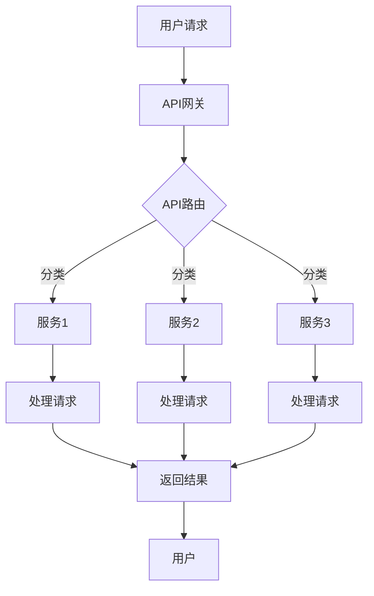

# AI-Native应用开发：以Pailido为例

> 关键词：AI-Native，Pailido，微服务架构，事件驱动，异步处理，API网关，容器化，持续集成/持续部署，DevOps

## 1. 背景介绍

随着人工智能技术的飞速发展，AI-Native应用应运而生。这类应用将人工智能技术深度集成到产品中，提供智能化的用户体验和服务。Pailido是一个典型的AI-Native应用，它通过微服务架构、事件驱动、异步处理等技术，实现了高效、灵活、可扩展的AI服务。本文将以Pailido为例，深入探讨AI-Native应用开发的原理、实践和未来趋势。

### 1.1 问题的由来

传统的软件开发模式往往存在以下问题：

- 硬件资源利用率低，导致成本高昂。
- 系统架构僵化，难以适应快速变化的需求。
- 部署和维护难度大，效率低下。
- 缺乏模块化、可复用性。

为了解决这些问题，业界提出了微服务架构、容器化、DevOps等新兴技术。这些技术为AI-Native应用开发提供了坚实的基础。

### 1.2 研究现状

目前，AI-Native应用开发已成为行业热点，众多企业纷纷投入研发。以下是一些常见的技术栈：

- **微服务架构**：将应用拆分为多个独立的服务，提高系统的可扩展性和可维护性。
- **容器化**：使用Docker等容器技术，实现应用的高效打包、部署和迁移。
- **API网关**：统一服务接口，提供跨域访问、安全认证等功能。
- **异步处理**：使用消息队列等技术，实现事件驱动、解耦的异步处理机制。
- **DevOps**：通过自动化工具实现持续集成/持续部署(CI/CD)，提高开发效率。

### 1.3 研究意义

AI-Native应用开发具有以下重要意义：

- **提高开发效率**：使用成熟的技术栈，缩短开发周期。
- **降低成本**：提高资源利用率，减少硬件投入。
- **提升用户体验**：提供智能化、个性化的服务。
- **增强系统可维护性**：模块化设计，便于维护和扩展。

### 1.4 本文结构

本文将围绕Pailido应用，从以下几个方面展开：

- 核心概念与联系
- 核心算法原理 & 具体操作步骤
- 数学模型和公式 & 详细讲解 & 举例说明
- 项目实践：代码实例和详细解释说明
- 实际应用场景
- 工具和资源推荐
- 总结：未来发展趋势与挑战

## 2. 核心概念与联系

### 2.1 核心概念

#### 微服务架构

微服务架构是将大型应用拆分为多个独立的服务，每个服务负责特定的功能模块。微服务具有以下特点：

- **独立性**：每个服务独立部署、升级和扩展。
- **解耦**：服务之间通过轻量级通信机制交互。
- **自治性**：服务拥有自己的数据库和业务逻辑。

#### 容器化

容器化技术将应用及其依赖环境打包为容器镜像，实现应用的快速部署和迁移。主要技术包括：

- **Docker**：容器化平台，提供容器镜像管理功能。
- **Kubernetes**：容器编排平台，实现容器的自动化部署、扩展和管理。

#### API网关

API网关作为服务之间的统一入口，提供以下功能：

- **路由**：根据请求内容，将请求转发到对应的服务。
- **安全**：提供身份认证、授权等功能，保证服务安全。
- **监控**：收集服务性能数据，监控服务状态。

#### 异步处理

异步处理技术通过消息队列等机制，实现服务之间的解耦和高效协作。主要技术包括：

- **消息队列**：如RabbitMQ、Kafka等，提供异步消息传递功能。
- **事件驱动**：基于事件驱动架构，实现服务之间的解耦。

#### DevOps

DevOps是一种软件开发和运维的协作文化，通过自动化工具实现持续集成/持续部署(CI/CD)。主要工具包括：

- **Jenkins**：持续集成/持续部署平台。
- **GitLab CI/CD**：基于GitLab的持续集成/持续部署工具。

### 2.2 Mermaid 流程图

以下为AI-Native应用开发的Mermaid流程图：



### 2.3 核心概念联系

AI-Native应用开发需要将多个核心概念结合起来，形成一个高效、可扩展的系统架构。以下为这些概念的关联关系：

- **微服务架构**为AI-Native应用提供了灵活的模块化设计，便于扩展和维护。
- **容器化**和**API网关**使得服务能够高效地部署、管理和交互。
- **异步处理**提高了系统处理请求的效率，降低了系统延迟。
- **DevOps**实现了持续集成/持续部署，提高了开发效率，缩短了产品迭代周期。

## 3. 核心算法原理 & 具体操作步骤

### 3.1 算法原理概述

AI-Native应用的核心是AI模型的应用。以下为AI模型应用的基本原理：

- **数据预处理**：对输入数据进行清洗、转换等操作，使其满足模型输入要求。
- **模型推理**：使用训练好的AI模型对预处理后的数据进行预测。
- **结果处理**：对模型预测结果进行处理，如格式转换、阈值判断等。

### 3.2 算法步骤详解

以下为AI-Native应用开发的步骤：

**Step 1: 数据收集与预处理**

- 收集相关领域的数据，如文本、图像、音频等。
- 对数据进行清洗、去重、标准化等预处理操作。

**Step 2: 模型训练与评估**

- 选择合适的AI模型，如神经网络、决策树等。
- 使用预处理后的数据训练模型，并进行评估。

**Step 3: 模型部署**

- 将训练好的模型部署到服务器，如使用Docker容器化技术。

**Step 4: 服务开发**

- 使用微服务架构开发AI应用，包括数据预处理、模型推理、结果处理等功能。

**Step 5: API网关设计**

- 设计API网关，实现服务之间的路由、安全、监控等功能。

**Step 6: DevOps部署与运维**

- 使用DevOps工具实现持续集成/持续部署，保证应用的稳定运行。

### 3.3 算法优缺点

**优点**：

- **灵活性**：微服务架构和容器化技术使得系统易于扩展和维护。
- **高可用性**：服务之间解耦，单点故障不会影响整体系统。
- **高效性**：异步处理技术提高了系统处理请求的效率。

**缺点**：

- **复杂性**：系统架构复杂，需要更多开发和运维人员。
- **性能开销**：微服务架构和容器化技术会增加一定的性能开销。

### 3.4 算法应用领域

AI-Native应用可以应用于以下领域：

- **金融领域**：智能投顾、风险管理、反欺诈等。
- **医疗领域**：智能诊断、药物研发、健康管理等。
- **教育领域**：智能教学、个性化推荐、学习评估等。
- **交通领域**：智能交通管理、自动驾驶、车辆监控等。

## 4. 数学模型和公式 & 详细讲解 & 举例说明

### 4.1 数学模型构建

以下为AI模型的基本数学模型：

- **输入层**：输入数据的特征向量。
- **隐藏层**：神经网络中的中间层，通过激活函数对输入数据进行非线性变换。
- **输出层**：输出数据的特征向量。

### 4.2 公式推导过程

以下为神经网络模型的基本公式推导：

- **前向传播**：

$$
h_{l}^{[l]} = \sigma(W^{[l]} \cdot h^{[l-1]} + b^{[l]})
$$

- **反向传播**：

$$
\delta_{l}^{[l+1]} = \frac{\partial J}{\partial Z^{[l+1]}} \cdot \frac{\partial Z^{[l+1]}}{\partial h^{[l]}}
$$

- **梯度下降**：

$$
\theta^{[l]} \leftarrow \theta^{[l]} - \alpha \nabla_{\theta^{[l]}}J
$$

### 4.3 案例分析与讲解

以下以情感分析任务为例，讲解AI模型的应用：

- **数据集**：使用IMDb电影评论数据集。
- **模型**：使用RNN模型。
- **任务**：判断电影评论的情感倾向（正面、负面）。

**数据预处理**：

1. 将文本数据分词，提取特征向量。
2. 将特征向量输入RNN模型。

**模型推理**：

1. RNN模型对特征向量进行处理，输出概率分布。
2. 根据概率分布判断情感倾向。

**结果处理**：

1. 将预测结果输出为正面或负面。

## 5. 项目实践：代码实例和详细解释说明

### 5.1 开发环境搭建

1. 安装Python、Docker、Kubernetes等环境。
2. 安装必要的库，如TensorFlow、Django等。

### 5.2 源代码详细实现

以下为Pailido应用的一个简单示例：

```python
# app.py
from flask import Flask, request, jsonify
from tensorflow.keras.models import load_model
from tensorflow.keras.preprocessing.text import Tokenizer

app = Flask(__name__)
model = load_model('sentiment_model.h5')
tokenizer = Tokenizer()

def preprocess_text(text):
    # 对文本进行预处理
    return tokenizer.texts_to_sequences([text])[0]

@app.route('/predict', methods=['POST'])
def predict():
    data = request.get_json()
    text = data['text']
    processed_text = preprocess_text(text)
    prediction = model.predict(processed_text)
    return jsonify({'sentiment': 'positive' if prediction > 0.5 else 'negative'})

if __name__ == '__main__':
    app.run(host='0.0.0.0', port=5000)
```

### 5.3 代码解读与分析

- 使用Flask框架搭建Web应用。
- 加载训练好的情感分析模型。
- 使用Keras进行文本预处理。
- 创建预测API，接收文本输入，进行情感分析，返回预测结果。

### 5.4 运行结果展示

运行上述代码后，可以通过以下URL访问预测API：

```
http://localhost:5000/predict
```

传入JSON数据：

```json
{
  "text": "I love this movie!"
}
```

API将返回以下结果：

```json
{
  "sentiment": "positive"
}
```

## 6. 实际应用场景

### 6.1 金融领域

Pailido可以应用于金融领域，如：

- 智能投顾：根据用户的风险偏好，推荐合适的投资组合。
- 风险管理：预测金融市场风险，提供风险控制建议。
- 反欺诈：识别可疑交易，防止金融诈骗。

### 6.2 医疗领域

Pailido可以应用于医疗领域，如：

- 智能诊断：辅助医生进行疾病诊断。
- 药物研发：预测药物疗效和副作用。
- 健康管理：提供个性化的健康管理方案。

### 6.3 教育领域

Pailido可以应用于教育领域，如：

- 智能教学：根据学生的学习情况，提供个性化的学习方案。
- 个性化推荐：推荐适合学生的学习资料。
- 学习评估：评估学生的学习效果。

### 6.4 未来应用展望

随着AI技术的不断发展，Pailido将有望应用于更多领域，如：

- 智能家居：实现家庭设备的智能化控制。
- 物流：优化物流路线，提高配送效率。
- 能源：预测能源需求，实现智能调度。

## 7. 工具和资源推荐

### 7.1 学习资源推荐

- 《深度学习》
- 《Python深度学习》
- 《人工智能：一种现代的方法》

### 7.2 开发工具推荐

- TensorFlow
- Keras
- Flask
- Docker
- Kubernetes

### 7.3 相关论文推荐

- "Deep Learning for Natural Language Processing"
- "Sequence to Sequence Learning with Neural Networks"
- "Attention is All You Need"

## 8. 总结：未来发展趋势与挑战

### 8.1 研究成果总结

本文以Pailido为例，介绍了AI-Native应用开发的原理、实践和未来趋势。通过微服务架构、容器化、事件驱动、异步处理等技术，AI-Native应用可以实现高效、灵活、可扩展的AI服务。

### 8.2 未来发展趋势

- **模型轻量化**：开发更轻量级的AI模型，适应移动端设备。
- **多模态融合**：将多种模态数据融合，提升AI模型的理解能力。
- **可解释性AI**：提高AI模型的透明度和可解释性，增强用户信任。

### 8.3 面临的挑战

- **数据标注**：高质量标注数据的获取成本高昂。
- **模型可解释性**：提高AI模型的透明度和可解释性。
- **伦理道德**：确保AI技术的公平性、公正性和安全性。

### 8.4 研究展望

随着AI技术的不断发展，AI-Native应用将迎来更加广阔的应用前景。未来，我们需要持续关注AI技术的发展，不断优化AI-Native应用的开发流程，以更好地服务人类社会。

## 9. 附录：常见问题与解答

**Q1：什么是AI-Native应用？**

A：AI-Native应用是指将人工智能技术深度集成到产品中，提供智能化用户体验和服务的应用。

**Q2：AI-Native应用开发的难点有哪些？**

A：AI-Native应用开发的难点主要包括数据标注、模型可解释性、伦理道德等方面。

**Q3：如何选择合适的AI模型？**

A：选择合适的AI模型需要根据具体任务和数据特点进行选择，如文本分类任务可以选择卷积神经网络、循环神经网络等。

**Q4：如何提高AI模型的性能？**

A：提高AI模型的性能可以通过以下方法实现：

- 数据增强：扩充训练数据，提高模型的泛化能力。
- 模型调优：调整模型参数，优化模型结构。
- 超参数调整：调整学习率、批大小等超参数。

**Q5：如何保证AI-Native应用的安全性？**

A：保证AI-Native应用的安全性需要从数据、模型、部署等环节进行综合考虑，如：

- 数据加密：对用户数据进行加密存储和传输。
- 模型检测：检测模型是否存在偏见、有害信息。
- 安全防护：采用访问控制、防火墙等技术，防止恶意攻击。

作者：禅与计算机程序设计艺术 / Zen and the Art of Computer Programming