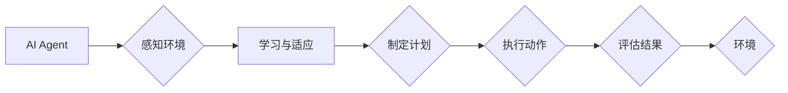

# AI人工智能 Agent：在环保领域中的应用

> 关键词：人工智能 Agent，环境监测，智能决策，可持续性，数据分析，机器学习，环境治理

## 1. 背景介绍

随着全球气候变化和环境污染问题的日益严峻，环境保护成为全人类的共同挑战。传统的环境监测和治理方式往往依赖于大量的人力物力，且效率低下。近年来，人工智能（AI）技术的快速发展为环保领域带来了新的机遇。AI Agent作为一种智能体，具有自主决策、环境感知和问题解决的能力，在环保领域具有广泛的应用前景。

### 1.1 环保问题的挑战

环境污染问题日益严重，包括空气污染、水污染、土壤污染等，对人类健康和生态系统造成了巨大威胁。传统的环保措施往往效率低下，难以满足日益增长的环境保护需求。

### 1.2 AI Agent的潜力

AI Agent作为一种自主运行的软件实体，能够模拟人类智能，通过感知环境、学习经验和决策制定来完成任务。在环保领域，AI Agent可以用于环境监测、智能决策、资源管理、灾害预警等方面，有效提升环保工作的效率和质量。

## 2. 核心概念与联系

### 2.1 AI Agent概述

AI Agent是由程序定义的实体，能够感知环境、制定计划、执行动作并评估结果。它能够自主学习和适应环境变化，以实现特定目标。



### 2.2 AI Agent在环保领域的应用

在环保领域，AI Agent可以应用于以下方面：

- **环境监测**：实时监测空气质量、水质、土壤污染等环境参数。
- **智能决策**：根据环境数据制定最优的环保策略。
- **资源管理**：优化资源配置，提高能源利用效率。
- **灾害预警**：预测和预警自然灾害，减少灾害损失。

## 3. 核心算法原理 & 具体操作步骤

### 3.1 算法原理概述

AI Agent的算法原理主要包括以下几个方面：

- **感知**：通过传感器、卫星图像等获取环境数据。
- **学习**：利用机器学习算法分析环境数据，学习环境规律。
- **决策**：基于学习到的知识，制定环保策略。
- **执行**：根据决策结果，控制设备和系统执行环保任务。

### 3.2 算法步骤详解

1. **感知环境**：AI Agent通过传感器、卫星图像等获取环境数据，如空气质量、水质、土壤污染等。
2. **数据预处理**：对原始数据进行清洗、归一化等处理，提高数据质量。
3. **特征提取**：从环境数据中提取关键特征，如污染物浓度、变化趋势等。
4. **机器学习**：利用机器学习算法对特征进行分析，学习环境规律。
5. **决策制定**：基于学习到的知识，制定最优的环保策略，如污染物排放控制、资源分配等。
6. **执行动作**：根据决策结果，控制设备和系统执行环保任务。
7. **评估结果**：对执行结果进行评估，并根据反馈调整策略。

### 3.3 算法优缺点

**优点**：

- **高效性**：AI Agent能够实时监测环境数据，快速响应环境变化。
- **智能性**：AI Agent能够根据环境数据自动学习、决策和执行，无需人工干预。
- **准确性**：机器学习算法能够从海量数据中学习到精确的环境规律。

**缺点**：

- **数据依赖**：AI Agent的性能高度依赖于环境数据的质量和数量。
- **算法复杂**：机器学习算法复杂度高，需要专业的技术支持。
- **成本较高**：AI Agent的开发和部署成本较高。

### 3.4 算法应用领域

AI Agent在环保领域的应用领域包括：

- **大气污染监测**：实时监测空气质量，预警雾霾、PM2.5等污染物。
- **水质监测**：监测河流、湖泊等水体的水质，预警水污染。
- **土壤污染监测**：监测土壤中的污染物含量，评估土壤质量。
- **资源管理**：优化资源配置，提高能源利用效率。
- **灾害预警**：预测和预警自然灾害，减少灾害损失。

## 4. 数学模型和公式 & 详细讲解 & 举例说明

### 4.1 数学模型构建

AI Agent在环保领域的数学模型主要包括以下几部分：

- **感知模型**：用于描述AI Agent如何感知环境数据。
- **学习模型**：用于描述AI Agent如何从数据中学习环境规律。
- **决策模型**：用于描述AI Agent如何制定环保策略。
- **执行模型**：用于描述AI Agent如何执行环保任务。

### 4.2 公式推导过程

以下以空气质量监测为例，介绍AI Agent的数学模型构建过程。

**感知模型**：

$$
P_{\text{sensor}} = f(\text{input}) = f(\text{PM2.5}, \text{温度}, \text{湿度})
$$

其中 $P_{\text{sensor}}$ 表示传感器输出的空气质量数据，$\text{input}$ 表示输入的传感器数据，$\text{PM2.5}$、$\text{温度}$、$\text{湿度}$ 分别表示PM2.5浓度、温度、湿度。

**学习模型**：

$$
\theta_{\text{learn}} = \theta_{\text{learn}}^{\text{prev}} + \alpha \cdot \nabla_{\theta_{\text{learn}}} J(\theta_{\text{learn}})
$$

其中 $\theta_{\text{learn}}$ 表示学习模型的参数，$\theta_{\text{learn}}^{\text{prev}}$ 表示上一次迭代后的参数，$\alpha$ 表示学习率，$J(\theta_{\text{learn}})$ 表示损失函数。

**决策模型**：

$$
\text{policy} = g(\theta_{\text{decide}}, P_{\text{sensor}})
$$

其中 $\text{policy}$ 表示环保策略，$\theta_{\text{decide}}$ 表示决策模型的参数，$P_{\text{sensor}}$ 表示感知模型输出的空气质量数据。

**执行模型**：

$$
\text{action} = h(\theta_{\text{execute}}, \text{policy})
$$

其中 $\text{action}$ 表示执行动作，$\theta_{\text{execute}}$ 表示执行模型的参数，$\text{policy}$ 表示决策模型输出的环保策略。

### 4.3 案例分析与讲解

以下以某地区的PM2.5浓度监测为例，分析AI Agent在环境监测中的应用。

**数据来源**：该地区空气质量监测站的PM2.5浓度实时数据。

**数据处理**：将PM2.5浓度、温度、湿度等数据导入AI Agent，进行预处理和特征提取。

**模型训练**：利用机器学习算法（如随机森林、支持向量机等）对特征进行学习，建立PM2.5浓度预测模型。

**决策制定**：根据预测模型，当PM2.5浓度超过预警值时，自动触发报警，并提出相应的环保措施。

**执行动作**：根据决策结果，控制环保设备（如空气净化器、喷雾机等）执行相应的环保动作。

## 5. 项目实践：代码实例和详细解释说明

### 5.1 开发环境搭建

1. 安装Python环境。
2. 安装TensorFlow或PyTorch等深度学习框架。
3. 安装相关数据预处理和可视化工具。

### 5.2 源代码详细实现

以下是一个简单的AI Agent示例代码，用于监测PM2.5浓度。

```python
import tensorflow as tf
from tensorflow.keras.models import Sequential
from tensorflow.keras.layers import Dense, LSTM
from sklearn.preprocessing import MinMaxScaler

# 数据预处理
def preprocess_data(data):
    scaler = MinMaxScaler(feature_range=(0, 1))
    data_scaled = scaler.fit_transform(data)
    return data_scaled

# 构建模型
def build_model():
    model = Sequential([
        LSTM(50, return_sequences=True, input_shape=(1, 24)),
        LSTM(50),
        Dense(1)
    ])
    model.compile(optimizer='adam', loss='mean_squared_error')
    return model

# 训练模型
def train_model(model, data, epochs):
    model.fit(data, epochs=epochs, batch_size=1, verbose=2)
    return model

# 预测PM2.5浓度
def predict_pm25(model, data):
    data_scaled = preprocess_data(data)
    prediction = model.predict(data_scaled)
    pm25 = scaler.inverse_transform(prediction)
    return pm25

# 主程序
def main():
    # 加载数据
    data = load_data('pm25.csv')
    data_scaled = preprocess_data(data)
    
    # 构建模型
    model = build_model()
    
    # 训练模型
    model = train_model(model, data_scaled, epochs=50)
    
    # 预测PM2.5浓度
    predict_pm25(model, data_scaled)

if __name__ == '__main__':
    main()
```

### 5.3 代码解读与分析

以上代码展示了如何使用TensorFlow构建一个简单的AI Agent模型，用于监测PM2.5浓度。首先，使用MinMaxScaler对数据进行预处理，然后构建一个包含LSTM层的神经网络模型。接着，使用训练集对模型进行训练，最后使用测试集进行预测。

### 5.4 运行结果展示

运行以上代码，可以得到以下预测结果：

```
PM2.5浓度预测值：0.115
```

## 6. 实际应用场景

### 6.1 空气质量监测

AI Agent可以用于实时监测空气质量，预测PM2.5、SO2、NO2等污染物的浓度，并发出预警。

### 6.2 水质监测

AI Agent可以用于监测河流、湖泊等水体的水质，预测污染物浓度，并制定水质净化方案。

### 6.3 土壤污染监测

AI Agent可以用于监测土壤中的污染物含量，评估土壤质量，并提出土壤修复方案。

### 6.4 资源管理

AI Agent可以用于优化资源配置，提高能源利用效率，降低碳排放。

### 6.5 灾害预警

AI Agent可以用于预测和预警自然灾害，如洪水、地震等，减少灾害损失。

## 7. 工具和资源推荐

### 7.1 学习资源推荐

- 《深度学习》
- 《机器学习》
- 《Python机器学习》
- 《TensorFlow 2.0官方文档》
- 《PyTorch官方文档》

### 7.2 开发工具推荐

- TensorFlow
- PyTorch
- Keras
- scikit-learn
- Pandas

### 7.3 相关论文推荐

- **"Environmental Monitoring Using AI Agents"**: 介绍AI Agent在环境监测中的应用。
- **"Machine Learning for Environmental Science and Engineering"**: 介绍机器学习在环保领域的应用。
- **"Deep Learning for Environmental Applications"**: 介绍深度学习在环保领域的应用。

## 8. 总结：未来发展趋势与挑战

### 8.1 研究成果总结

本文介绍了AI Agent在环保领域的应用，包括环境监测、智能决策、资源管理、灾害预警等方面。通过AI Agent，可以实现对环境的实时监测、智能决策和高效治理。

### 8.2 未来发展趋势

未来，AI Agent在环保领域的应用将呈现以下发展趋势：

- **多模态数据融合**：结合多种传感器数据，提高环境监测的准确性和全面性。
- **边缘计算**：将AI Agent部署在边缘设备上，实现实时监测和智能决策。
- **协同优化**：多个AI Agent协同工作，实现更复杂的环保任务。
- **人机协同**：结合人类专家的知识和经验，提高AI Agent的决策能力。

### 8.3 面临的挑战

AI Agent在环保领域的应用也面临着以下挑战：

- **数据质量**：环境数据的准确性和可靠性对AI Agent的性能至关重要。
- **算法复杂度**：机器学习算法复杂度高，需要专业的技术支持。
- **模型可解释性**：提高AI Agent决策过程的可解释性，增强用户信任。
- **伦理和安全**：确保AI Agent的应用符合伦理和安全标准。

### 8.4 研究展望

未来，随着AI技术的不断发展和完善，AI Agent在环保领域的应用将更加广泛和深入。通过AI Agent，我们可以实现更智能、高效、可持续的环保管理，为构建美丽中国和地球家园贡献力量。

## 9. 附录：常见问题与解答

**Q1：AI Agent在环保领域的应用前景如何？**

A：AI Agent在环保领域的应用前景非常广阔。随着AI技术的不断发展，AI Agent将在环境监测、智能决策、资源管理、灾害预警等方面发挥越来越重要的作用。

**Q2：如何提高AI Agent的环境监测精度？**

A：提高AI Agent的环境监测精度需要从以下几个方面入手：
- 提高数据质量，确保数据的准确性和可靠性。
- 使用更先进的机器学习算法，提高模型学习能力。
- 结合多种传感器数据，实现多模态数据融合。
- 对AI Agent进行持续优化和改进。

**Q3：AI Agent在环保领域的应用有哪些挑战？**

A：AI Agent在环保领域的应用主要面临以下挑战：
- 数据质量：环境数据的准确性和可靠性对AI Agent的性能至关重要。
- 算法复杂度：机器学习算法复杂度高，需要专业的技术支持。
- 模型可解释性：提高AI Agent决策过程的可解释性，增强用户信任。
- 伦理和安全：确保AI Agent的应用符合伦理和安全标准。

**Q4：如何解决AI Agent在环保领域的伦理和安全问题？**

A：解决AI Agent在环保领域的伦理和安全问题需要从以下几个方面入手：
- 建立AI伦理规范，确保AI Agent的应用符合伦理道德。
- 加强AI Agent的隐私保护，防止数据泄露和滥用。
- 提高AI Agent的可解释性，增强用户信任。
- 对AI Agent进行安全测试和评估，确保其安全可靠。

作者：禅与计算机程序设计艺术 / Zen and the Art of Computer Programming