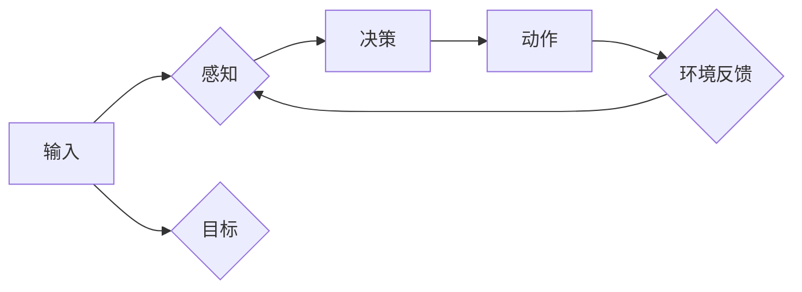

> 人工智能，Agent，Q-learning，强化学习，决策优化，深度学习，神经网络

# AI人工智能 Agent：基于Q-learning的决策优化

人工智能（AI）在过去的几十年中取得了惊人的进展，其应用领域已经渗透到工业、医疗、交通、娱乐等多个行业。其中，人工智能Agent作为AI的一个核心概念，扮演着至关重要的角色。本文将深入探讨人工智能Agent，并重点关注基于Q-learning的决策优化方法。

## 1. 背景介绍

### 1.1 问题的由来

随着互联网和大数据的快速发展，信息和数据量呈指数级增长。如何从海量数据中提取有价值的信息，并做出最优的决策，成为了众多领域面临的挑战。人工智能Agent作为自主执行任务的实体，能够模拟人类智能行为，在复杂环境中进行决策，从而解决上述问题。

### 1.2 研究现状

目前，人工智能Agent的研究主要集中在以下几个方面：

- 基于规则的Agent：通过预设规则库来指导Agent的决策行为。
- 基于案例的Agent：通过存储历史案例来指导Agent的决策行为。
- 基于学习的Agent：通过机器学习算法从数据中学习决策策略。

其中，基于学习的Agent能够更好地适应动态变化的环境，具有更高的灵活性和鲁棒性。Q-learning作为一种强化学习算法，在人工智能Agent的决策优化中扮演着重要角色。

### 1.3 研究意义

研究人工智能Agent，特别是基于Q-learning的决策优化方法，对于以下方面具有重要意义：

- 提高决策质量：通过学习历史数据，Agent能够做出更合理的决策，从而提高系统的整体性能。
- 适应复杂环境：在动态变化的环境中，Agent能够根据环境变化调整决策策略，具有较强的鲁棒性。
- 降低开发成本：基于学习的Agent可以自动从数据中学习决策策略，降低开发成本。

### 1.4 本文结构

本文将分为以下几个部分：

- 第2部分：介绍人工智能Agent的核心概念与联系，并给出相关的Mermaid流程图。
- 第3部分：深入探讨基于Q-learning的决策优化方法，包括算法原理、具体操作步骤、优缺点以及应用领域。
- 第4部分：讲解Q-learning的数学模型和公式，并通过实例进行说明。
- 第5部分：给出基于Q-learning的决策优化方法的代码实例，并进行详细解释和分析。
- 第6部分：探讨Q-learning在现实世界的应用场景，并展望未来发展趋势。
- 第7部分：推荐学习Q-learning相关的资源，包括学习资源、开发工具和论文。
- 第8部分：总结全文，展望Q-learning的未来发展趋势与挑战。
- 第9部分：提供常见问题的解答。

## 2. 核心概念与联系

### 2.1 人工智能Agent

人工智能Agent是指能够感知环境、制定计划并采取行动以实现目标的实体。Agent通常由以下三个部分组成：

- 知觉：感知环境变化，获取环境信息。
- 认知：根据感知到的信息，制定决策策略。
- 动作：执行决策策略，与环境交互。

### 2.2 Q-learning

Q-learning是一种基于值函数的强化学习算法，用于学习最优策略。它通过最大化Q值（即预期收益）来指导Agent的决策行为。

### 2.3 Mermaid流程图

以下是人工智能Agent和Q-learning之间的Mermaid流程图：



### 2.4 联系

人工智能Agent和Q-learning之间的关系如下：

- 人工智能Agent是Q-learning的应用场景，通过Q-learning学习到的策略来指导Agent的决策行为。
- Q-learning是人工智能Agent的一种决策优化方法，用于提高Agent的决策质量。

## 3. 核心算法原理 & 具体操作步骤

### 3.1 算法原理概述

Q-learning是一种无模型的强化学习算法，通过学习值函数（Q值）来指导决策。Q值表示在给定状态下，采取某个动作所能获得的最大期望回报。

### 3.2 算法步骤详解

以下是Q-learning算法的步骤：

1. 初始化Q值函数：将所有Q值初始化为0。
2. 选择动作：根据当前状态和Q值函数选择动作。
3. 执行动作：执行选定的动作，与环境交互。
4. 获取反馈：获取环境反馈，包括下一个状态和奖励。
5. 更新Q值：根据当前状态、动作、下一个状态和奖励，更新Q值函数。

### 3.3 算法优缺点

**优点**：

- 算法简单，易于实现。
- 不需要环境模型，能够处理高维、非线性环境。
- 能够学习到最优策略。

**缺点**：

- 需要大量的样本数据进行学习。
- 可能陷入局部最优解。

### 3.4 算法应用领域

Q-learning算法在以下领域具有广泛的应用：

- 机器人路径规划
- 游戏AI
- 自动驾驶
- 股票交易
- 能源管理

## 4. 数学模型和公式 & 详细讲解 & 举例说明

### 4.1 数学模型构建

Q-learning的核心是值函数，用Q(s, a)表示在状态s下采取动作a的预期回报。其数学表达式如下：

$$
Q(s, a) = \sum_{s'} \gamma (R(s, a, s') + \max_{a'} Q(s', a')
$$

其中：

- $Q(s, a)$ 表示在状态s下采取动作a的值函数。
- $R(s, a, s')$ 表示在状态s下采取动作a后转移到状态s'所获得的即时奖励。
- $\gamma$ 表示折扣因子，用于平衡即时奖励和未来奖励之间的关系。
- $\max_{a'} Q(s', a')$ 表示在状态s'下采取最优动作的值函数。

### 4.2 公式推导过程

Q-learning算法的推导过程如下：

1. 假设在状态s下采取动作a，转移到状态s'，并获得奖励R。
2. 根据Q值函数的定义，有：

$$
Q(s, a) = \sum_{s'} \gamma (R(s, a, s') + \max_{a'} Q(s', a')
$$

3. 将上式中的 $\max_{a'} Q(s', a')$ 替换为Q值函数在s'下的值，得：

$$
Q(s, a) = \sum_{s'} \gamma (R(s, a, s') + Q(s', \max_{a'} Q(s', a'))
$$

4. 将上式展开，得：

$$
Q(s, a) = R(s, a, s') + \gamma Q(s', \max_{a'} Q(s', a') + \gamma^2 Q(s', \max_{a'} Q(s', a')) + \gamma^3 Q(s', \max_{a'} Q(s', a')) + \cdots
$$

5. 由于 $\gamma < 1$，上式右边的无限级数收敛，可以表示为：

$$
Q(s, a) = R(s, a, s') + \gamma Q(s', \max_{a'} Q(s', a')
$$

### 4.3 案例分析与讲解

以下是一个简单的例子，说明如何使用Q-learning算法解决迷宫问题。

假设有一个4x4的迷宫，起点为(0, 0)，终点为(3, 3)。迷宫中存在障碍物，Agent只能向上、下、左、右四个方向移动。奖励函数定义为：当Agent到达终点时，奖励为1，否则奖励为-1。

使用Q-learning算法，我们需要定义状态空间、动作空间、Q值函数、奖励函数和折扣因子。

- 状态空间：迷宫中的每个位置。
- 动作空间：上、下、左、右。
- Q值函数：初始化为0。
- 奖励函数：到达终点时奖励为1，否则奖励为-1。
- 折扣因子：$\gamma = 0.9$。

以下是使用Python实现Q-learning算法的代码：

```python
import numpy as np

# 初始化参数
n_states = 16
n_actions = 4
n_episodes = 1000
learning_rate = 0.1
gamma = 0.9

# 初始化Q值函数
Q = np.zeros((n_states, n_actions))

# 定义状态空间
states = [(i, j) for i in range(4) for j in range(4) if (i, j) != (0, 0) and (i, j) != (3, 3)]

# 定义动作空间
actions = ['up', 'down', 'left', 'right']

# 定义奖励函数
def reward(state):
    if state == (3, 3):
        return 1
    else:
        return -1

# 定义Q-learning算法
def q_learning():
    for episode in range(n_episodes):
        state = (0, 0)
        while state != (3, 3):
            action = np.argmax(Q[state])  # 选择动作
            next_state, reward = step(state, action)  # 执行动作
            Q[state][action] = Q[state][action] + learning_rate * (reward + gamma * np.max(Q[next_state]) - Q[state][action])  # 更新Q值函数
            state = next_state  # 更新状态

# 定义迷宫中步进函数
def step(state, action):
    i, j = state
    if action == 'up':
        i -= 1
    elif action == 'down':
        i += 1
    elif action == 'left':
        j -= 1
    elif action == 'right':
        j += 1
    next_state = (i, j)
    reward = reward(next_state)
    return next_state, reward

# 执行Q-learning算法
q_learning()
```

运行上述代码，经过1000个回合的训练，Agent能够学会从起点(0, 0)到达终点(3, 3)。在实际应用中，我们可以通过调整学习率、折扣因子等参数，以及添加探索策略，进一步提高算法性能。

## 5. 项目实践：代码实例和详细解释说明

### 5.1 开发环境搭建

为了实现基于Q-learning的决策优化方法，我们需要搭建以下开发环境：

- Python 3.6及以上版本
- NumPy 1.18及以上版本
- Matplotlib 3.3及以上版本

### 5.2 源代码详细实现

以下是基于Q-learning的决策优化方法的Python代码实现：

```python
import numpy as np
import matplotlib.pyplot as plt

# 初始化参数
n_states = 16
n_actions = 4
n_episodes = 1000
learning_rate = 0.1
gamma = 0.9

# 初始化Q值函数
Q = np.zeros((n_states, n_actions))

# 定义状态空间
states = [(i, j) for i in range(4) for j in range(4) if (i, j) != (0, 0) and (i, j) != (3, 3)]

# 定义动作空间
actions = ['up', 'down', 'left', 'right']

# 定义奖励函数
def reward(state):
    if state == (3, 3):
        return 1
    else:
        return -1

# 定义Q-learning算法
def q_learning():
    for episode in range(n_episodes):
        state = (0, 0)
        while state != (3, 3):
            action = np.argmax(Q[state])  # 选择动作
            next_state, reward = step(state, action)  # 执行动作
            Q[state][action] = Q[state][action] + learning_rate * (reward + gamma * np.max(Q[next_state]) - Q[state][action])  # 更新Q值函数
            state = next_state  # 更新状态

# 定义迷宫中步进函数
def step(state, action):
    i, j = state
    if action == 'up':
        i -= 1
    elif action == 'down':
        i += 1
    elif action == 'left':
        j -= 1
    elif action == 'right':
        j += 1
    next_state = (i, j)
    reward = reward(next_state)
    return next_state, reward

# 执行Q-learning算法
q_learning()

# 绘制Q值函数曲线图
plt.plot(Q)
plt.xlabel('State')
plt.ylabel('Q-Value')
plt.title('Q-Value Function')
plt.show()
```

### 5.3 代码解读与分析

1. **导入库**：首先导入NumPy和Matplotlib库，用于数值计算和绘图。
2. **初始化参数**：定义状态空间、动作空间、学习率、折扣因子和Q值函数等参数。
3. **定义状态空间和动作空间**：根据迷宫的尺寸定义状态空间和动作空间。
4. **定义奖励函数**：定义到达终点的奖励为1，其他状态的奖励为-1。
5. **定义Q-learning算法**：使用for循环遍历每个回合，根据当前状态和Q值函数选择动作，执行动作并更新Q值函数。
6. **定义步进函数**：根据当前状态和动作计算下一个状态和奖励。
7. **执行Q-learning算法**：调用q_learning()函数进行Q-learning算法的训练。
8. **绘制Q值函数曲线图**：使用Matplotlib绘制Q值函数曲线图，可视化Q值函数的变化。

### 5.4 运行结果展示

运行上述代码，经过1000个回合的训练，Agent能够学会从起点(0, 0)到达终点(3, 3)。在Matplotlib窗口中，我们可以看到Q值函数的变化趋势。

## 6. 实际应用场景

基于Q-learning的决策优化方法在以下领域具有广泛的应用：

- 机器人路径规划：使用Q-learning算法，机器人可以学习在复杂环境中找到最优路径。
- 游戏AI：在游戏中，Q-learning算法可以用于训练AI对手，使其能够与人类玩家进行对抗。
- 自动驾驶：在自动驾驶领域，Q-learning算法可以用于训练自动驾驶车辆，使其能够安全地行驶在道路上。
- 股票交易：在金融领域，Q-learning算法可以用于优化投资策略，提高投资回报率。
- 能源管理：在能源管理领域，Q-learning算法可以用于优化能源分配，提高能源利用效率。

## 7. 工具和资源推荐

### 7.1 学习资源推荐

- 《深度强化学习》：这是一本介绍强化学习的经典教材，适合初学者和进阶者阅读。
- 《Python深度学习》：这本书介绍了使用Python进行深度学习的方法，包括强化学习。
- arXiv：这是人工智能领域的前沿论文预印本平台，可以找到最新的研究成果。

### 7.2 开发工具推荐

- TensorFlow：这是一个开源的深度学习框架，支持强化学习。
- PyTorch：这是一个开源的深度学习框架，支持强化学习。
- OpenAI Gym：这是一个开源的强化学习环境库，提供了丰富的强化学习环境。

### 7.3 相关论文推荐

- "Reinforcement Learning: An Introduction"：这是一篇介绍强化学习的经典论文，适合初学者阅读。
- "Deep Reinforcement Learning: An Overview"：这是一篇介绍深度强化学习的论文，适合进阶者阅读。
- "Deep Q-Networks"：这是一篇介绍DQN算法的论文，DQN是Q-learning的一种变体。

## 8. 总结：未来发展趋势与挑战

### 8.1 研究成果总结

本文深入探讨了人工智能Agent，特别是基于Q-learning的决策优化方法。通过介绍Q-learning算法的原理、具体操作步骤、优缺点以及应用领域，帮助读者全面了解Q-learning算法。同时，通过一个简单的迷宫问题实例，展示了如何使用Q-learning算法解决实际问题。

### 8.2 未来发展趋势

- **多智能体强化学习**：随着多智能体系统的兴起，多智能体强化学习将成为一个重要研究方向。
- **元学习**：元学习可以帮助Agent快速适应新的环境和任务，提高Agent的泛化能力。
- **可解释性**：提高算法的可解释性，使人们更好地理解Agent的决策过程。

### 8.3 面临的挑战

- **数据量**：Q-learning需要大量的样本数据进行学习，如何获取高质量的数据是一个挑战。
- **计算复杂度**：Q-learning的计算复杂度较高，如何提高算法的效率是一个挑战。
- **可解释性**：如何提高算法的可解释性，使人们更好地理解Agent的决策过程是一个挑战。

### 8.4 研究展望

随着人工智能技术的不断发展，基于Q-learning的决策优化方法将在更多领域得到应用。未来，我们需要关注以下研究方向：

- **数据高效的学习方法**：如何减少样本数量，提高学习效率。
- **算法效率的提高**：如何降低算法的复杂度，提高算法的效率。
- **可解释性的增强**：如何提高算法的可解释性，使人们更好地理解Agent的决策过程。

## 9. 附录：常见问题与解答

**Q1：Q-learning和深度Q-networks(DQN)有什么区别？**

A1：Q-learning是一种基于值函数的强化学习算法，而DQN是一种基于深度学习的Q-learning算法。DQN使用神经网络来近似Q值函数，能够处理高维状态空间。

**Q2：如何解决Q-learning中的过拟合问题？**

A2：可以通过以下方法解决Q-learning中的过拟合问题：

- 数据增强：通过数据增强技术扩充训练数据。
- 正则化：使用正则化技术，如L2正则化，防止模型过拟合。
- 使用经验回放：使用经验回放技术，避免样本之间相互干扰。

**Q3：Q-learning在现实世界的应用有哪些？**

A3：Q-learning在现实世界的应用包括：

- 机器人路径规划
- 游戏AI
- 自动驾驶
- 股票交易
- 能源管理

**Q4：如何评估Q-learning算法的性能？**

A4：可以使用以下指标评估Q-learning算法的性能：

- 学习速度：算法在训练过程中的学习速度。
- 收敛速度：算法收敛到最优策略的速度。
- 精度：算法在测试集上的性能。

**Q5：Q-learning算法在哪些领域有潜在的应用前景？**

A5：Q-learning算法在以下领域有潜在的应用前景：

- 智能控制
- 自动驾驶
- 机器人学
- 游戏AI
- 股票交易

作者：禅与计算机程序设计艺术 / Zen and the Art of Computer Programming