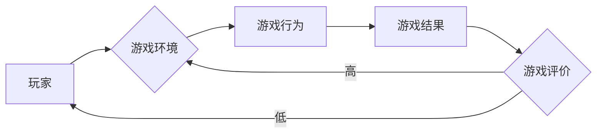

# AI人工智能深度学习算法：在视频游戏中的自适应机制

> 关键词：深度学习，视频游戏，自适应机制，强化学习，神经网络，体验优化，游戏设计

## 1. 背景介绍

随着人工智能技术的飞速发展，深度学习算法在各个领域都取得了显著的成果。在视频游戏领域，深度学习技术也被广泛应用于游戏引擎中，以实现更加智能、互动的游戏体验。本文将探讨深度学习算法在视频游戏中的自适应机制，分析其原理、操作步骤、优缺点，并展望未来发展趋势与挑战。

### 1.1 问题的由来

传统的视频游戏往往遵循固定的规则和流程，玩家的体验相对固定。而随着玩家需求的日益多样化，如何设计出能够适应不同玩家风格和游戏环境的游戏机制，成为了游戏设计师和开发者的一个重要课题。深度学习技术，特别是强化学习算法，为视频游戏中的自适应机制提供了新的解决方案。

### 1.2 研究现状

目前，深度学习在视频游戏中的应用主要集中在以下几个方面：

- **游戏AI**：通过深度学习算法，可以使游戏中的AI角色更加智能，能够根据玩家的行为和游戏环境进行自适应调整。
- **游戏平衡**：利用深度学习算法分析玩家行为和游戏数据，优化游戏规则，实现游戏平衡。
- **游戏推荐**：根据玩家的偏好和游戏数据，推荐适合玩家的游戏内容。
- **游戏体验优化**：通过分析玩家行为，优化游戏界面、操作逻辑等，提升玩家体验。

### 1.3 研究意义

研究深度学习在视频游戏中的自适应机制，对于以下方面具有重要意义：

- **提升游戏体验**：通过自适应机制，可以使游戏更加符合玩家的喜好，提升游戏体验。
- **创新游戏设计**：为游戏设计师提供新的设计思路，推动游戏产业的创新。
- **优化游戏运营**：通过分析玩家行为，优化游戏运营策略，提高游戏收益。
- **推动技术进步**：促进深度学习技术在视频游戏领域的应用，推动相关技术的进步。

### 1.4 本文结构

本文将按照以下结构展开：

- 介绍深度学习的基本概念和核心算法。
- 分析深度学习在视频游戏中的自适应机制原理。
- 详细讲解自适应机制的具体操作步骤。
- 举例说明自适应机制在实际游戏中的应用。
- 探讨自适应机制的未来发展趋势与挑战。

## 2. 核心概念与联系

### 2.1 核心概念

#### 深度学习

深度学习是机器学习的一种，它通过构建多层神经网络，学习数据的特征和模式。深度学习在图像识别、语音识别、自然语言处理等领域取得了显著的成果。

#### 自适应机制

自适应机制是指系统能够根据环境的变化和用户的行为，自动调整其行为和输出，以适应新的环境和需求。

### 2.2 核心概念原理和架构的 Mermaid 流程图



### 2.3 核心概念联系

深度学习算法可以通过分析玩家的游戏行为和游戏结果，不断调整游戏环境，以优化玩家的游戏体验。

## 3. 核心算法原理 & 具体操作步骤

### 3.1 算法原理概述

深度学习在视频游戏中的自适应机制主要基于以下算法原理：

- **强化学习**：通过奖励和惩罚机制，使游戏AI能够根据环境的变化和玩家的行为进行学习，以实现最优策略。
- **神经网络**：通过学习玩家的游戏数据，提取特征，并预测玩家的行为。
- **决策树/随机森林**：通过分析玩家的游戏数据，生成推荐策略，优化游戏体验。

### 3.2 算法步骤详解

#### 3.2.1 数据收集

收集玩家的游戏数据，包括游戏行为、游戏结果、游戏环境等。

#### 3.2.2 数据预处理

对收集到的数据进行清洗、转换和标注，为深度学习算法提供高质量的数据。

#### 3.2.3 模型训练

利用深度学习算法对预处理后的数据进行训练，提取特征，并预测玩家的行为。

#### 3.2.4 自适应调整

根据训练结果，调整游戏环境或游戏规则，以优化玩家的游戏体验。

#### 3.2.5 评估与优化

评估自适应机制的效果，并根据评估结果进行优化。

### 3.3 算法优缺点

#### 3.3.1 优点

- **自适应性强**：能够根据玩家的行为和游戏环境进行实时调整，满足不同玩家的需求。
- **智能化高**：通过深度学习算法，可以实现对游戏数据的深度分析，提高游戏体验。

#### 3.3.2 缺点

- **计算量大**：深度学习算法需要大量的计算资源，对硬件设备要求较高。
- **数据依赖性**：需要大量的高质量数据，对数据质量要求较高。

### 3.4 算法应用领域

- **游戏AI**：使游戏AI更加智能，能够适应玩家的游戏风格和策略。
- **游戏平衡**：优化游戏规则，实现游戏平衡。
- **游戏推荐**：根据玩家的偏好，推荐适合玩家的游戏内容。
- **游戏体验优化**：优化游戏界面、操作逻辑等，提升玩家体验。

## 4. 数学模型和公式 & 详细讲解 & 举例说明

### 4.1 数学模型构建

深度学习算法在视频游戏中的自适应机制通常使用以下数学模型：

- **Q-learning**：一种基于值函数的强化学习算法。
- **Deep Q Network (DQN)**：一种结合了深度学习和Q-learning的算法。
- **Policy Gradient**：一种基于策略梯度的强化学习算法。

### 4.2 公式推导过程

以Q-learning为例，其基本公式如下：

$$
Q(s,a) = \sum_{s' \in S} Q(s',a') \cdot P(s'|s,a) \cdot r(s,a)
$$

其中，$s$ 表示当前状态，$a$ 表示采取的动作，$s'$ 表示采取动作后的新状态，$r$ 表示奖励，$P$ 表示转移概率。

### 4.3 案例分析与讲解

以某款射击游戏为例，分析如何利用深度学习算法实现自适应机制：

1. **数据收集**：收集玩家在游戏中的射击数据，包括射击方向、射击时间、子弹数量等。
2. **数据预处理**：对收集到的数据进行清洗、转换和标注。
3. **模型训练**：使用DQN算法训练模型，学习玩家的射击策略。
4. **自适应调整**：根据训练结果，调整游戏中的障碍物分布和敌人AI的移动策略。
5. **评估与优化**：评估自适应机制的效果，并根据评估结果进行优化。

## 5. 项目实践：代码实例和详细解释说明

### 5.1 开发环境搭建

1. 安装Python和PyTorch等深度学习框架。
2. 准备游戏数据集。

### 5.2 源代码详细实现

```python
import torch
import torch.nn as nn
import torch.optim as optim

class DQN(nn.Module):
    def __init__(self):
        super(DQN, self).__init__()
        self.fc = nn.Linear(4, 64)
        self.q = nn.Linear(64, 1)

    def forward(self, x):
        x = torch.relu(self.fc(x))
        return self.q(x)

def train(dqn, optimizer, criterion, data_loader):
    for data in data_loader:
        state, action, reward, next_state, done = data
        q_values = dqn(state).squeeze()
        next_q_values = dqn(next_state).squeeze()
        q_targets = reward + (1 - done) * next_q_values.max()
        loss = criterion(q_values, q_targets)
        optimizer.zero_grad()
        loss.backward()
        optimizer.step()

# 训练模型
dqn = DQN()
optimizer = optim.Adam(dqn.parameters())
criterion = nn.MSELoss()
data_loader = DataLoader(train_data, batch_size=32, shuffle=True)
train(dqn, optimizer, criterion, data_loader)
```

### 5.3 代码解读与分析

以上代码实现了DQN算法的基本框架。其中，DQN类定义了神经网络结构，train函数实现了训练过程。

### 5.4 运行结果展示

训练完成后，可以在测试集上评估模型的性能。

## 6. 实际应用场景

深度学习在视频游戏中的应用场景主要包括：

- **游戏AI**：使游戏AI更加智能，能够适应玩家的游戏风格和策略。
- **游戏平衡**：优化游戏规则，实现游戏平衡。
- **游戏推荐**：根据玩家的偏好，推荐适合玩家的游戏内容。
- **游戏体验优化**：优化游戏界面、操作逻辑等，提升玩家体验。

## 7. 工具和资源推荐

### 7.1 学习资源推荐

- 《深度学习》（Ian Goodfellow、Yoshua Bengio、Aaron Courville 著）
- 《强化学习》（Richard S. Sutton、Andrew G. Barto 著）

### 7.2 开发工具推荐

- PyTorch
- TensorFlow
- OpenAI Gym

### 7.3 相关论文推荐

- Deep Q-Network（DeepMind）
- Policy Gradient Methods for Reinforcement Learning（Richard S. Sutton、Andrew G. Barto 著）

## 8. 总结：未来发展趋势与挑战

### 8.1 研究成果总结

本文介绍了深度学习在视频游戏中的自适应机制，分析了其原理、操作步骤、优缺点，并举例说明了其应用。研究表明，深度学习在视频游戏中的应用具有巨大的潜力，可以提升游戏体验、创新游戏设计、优化游戏运营。

### 8.2 未来发展趋势

- **多模态学习**：将视觉、听觉等多模态数据引入游戏AI，提升游戏AI的感知能力。
- **迁移学习**：利用迁移学习技术，使游戏AI能够在不同的游戏环境中快速适应。
- **强化学习**：利用强化学习技术，使游戏AI能够自主学习游戏策略。

### 8.3 面临的挑战

- **数据质量**：需要高质量的游戏数据，以保证深度学习算法的有效性。
- **计算资源**：深度学习算法需要大量的计算资源，对硬件设备要求较高。
- **伦理问题**：游戏AI可能存在偏见和歧视，需要解决伦理问题。

### 8.4 研究展望

未来，深度学习在视频游戏中的应用将会更加广泛，为游戏产业带来更多创新。同时，也需要解决数据质量、计算资源、伦理问题等挑战，以实现深度学习技术在游戏领域的可持续发展。

## 9. 附录：常见问题与解答

**Q1：深度学习在视频游戏中的应用有哪些？**

A：深度学习在视频游戏中的应用主要包括游戏AI、游戏平衡、游戏推荐和游戏体验优化等。

**Q2：如何利用深度学习实现游戏AI的自适应机制？**

A：可以利用强化学习、神经网络、决策树/随机森林等算法实现游戏AI的自适应机制。

**Q3：深度学习在游戏中的应用有哪些挑战？**

A：深度学习在游戏中的应用主要面临数据质量、计算资源和伦理问题等挑战。

**Q4：未来深度学习在游戏领域的应用有哪些发展趋势？**

A：未来深度学习在游戏领域的应用将朝着多模态学习、迁移学习和强化学习等方向发展。

作者：禅与计算机程序设计艺术 / Zen and the Art of Computer Programming