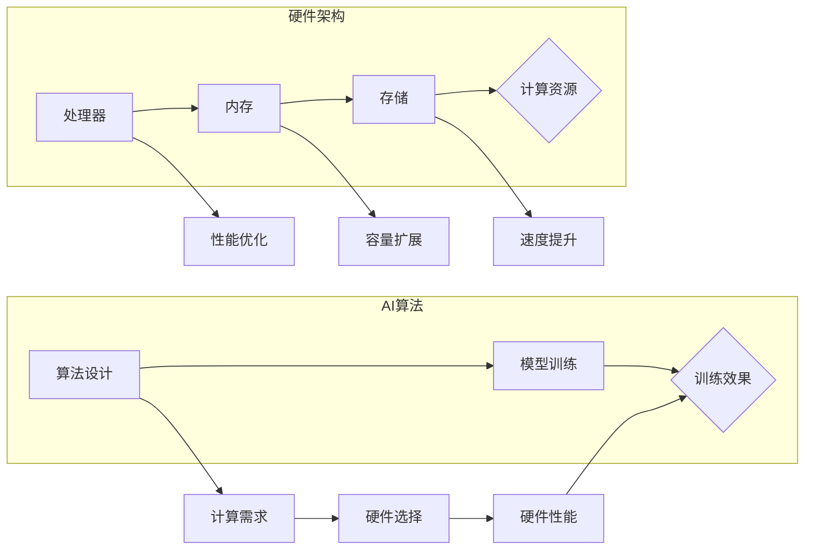

# AI算法与硬件的共同演进

> 关键词：AI算法，硬件架构，协同演进，深度学习，高性能计算，异构计算，边缘计算

## 1. 背景介绍

人工智能（AI）和硬件架构是推动计算技术进步的两股核心力量。随着AI算法的复杂度和计算需求的提升，硬件架构也在不断演进，以支持更高效的算法运行。本文将探讨AI算法与硬件的共同演进，分析其背后的原理、具体操作步骤，以及在实际应用中的表现。

### 1.1 问题的由来

随着深度学习等AI技术的飞速发展，算法的复杂度日益增加，对计算资源的需求也水涨船高。传统的通用计算架构在处理这些复杂算法时，往往表现出力不从心。因此，如何设计高效、低功耗的硬件架构来满足AI算法的需求，成为了一个亟待解决的问题。

### 1.2 研究现状

近年来，AI算法与硬件架构的协同演进取得了显著进展。从专用的AI芯片、加速器，到异构计算平台、边缘计算架构，都在为AI算法提供更强大的计算能力。

### 1.3 研究意义

AI算法与硬件的共同演进不仅能够提升AI算法的性能，还能降低能耗，推动AI技术在各个领域的广泛应用。研究这一领域的最新进展，有助于我们更好地理解AI技术的发展趋势，并为未来AI硬件的设计提供指导。

### 1.4 本文结构

本文将分为以下几个部分：
- 介绍AI算法与硬件架构的核心概念。
- 分析AI算法与硬件的共同演进原理。
- 详细讲解具体操作步骤。
- 分析数学模型和公式，并结合案例进行讲解。
- 展示代码实例和详细解释。
- 探讨AI算法与硬件在实际应用中的场景。
- 展望未来发展趋势与挑战。

## 2. 核心概念与联系

### 2.1 核心概念

- **AI算法**：指通过模拟、延伸和扩展人类智能的理论、方法、技术及其系统。
- **硬件架构**：指计算机系统的组成和结构，包括处理器、内存、存储、输入输出设备等。
- **深度学习**：一种机器学习范式，通过多层神经网络模拟人脑的感知和学习机制。
- **高性能计算**：指采用高性能计算机系统进行大规模数值计算，以满足特定领域的计算需求。
- **异构计算**：指结合不同类型处理器（如CPU、GPU、FPGA等）进行计算，以实现更高效的性能。
- **边缘计算**：指在数据产生的地方进行计算，以减少数据传输和延迟。

### 2.2 Mermaid 流程图



### 2.3 核心概念联系

如图所示，AI算法的设计需要考虑计算需求，而硬件架构需要根据计算需求提供足够的计算资源。硬件性能的提升将直接影响AI算法的训练效果。

## 3. 核心算法原理 & 具体操作步骤

### 3.1 算法原理概述

AI算法的核心原理是模拟人脑的感知和学习机制，通过多层神经网络进行特征提取和模式识别。具体操作步骤包括：

1. 数据收集和预处理。
2. 模型设计，包括网络结构、激活函数、优化器等。
3. 模型训练，包括前向传播、反向传播和参数更新。
4. 模型评估和优化。

### 3.2 算法步骤详解

1. **数据收集和预处理**：收集相关领域的数据，并进行清洗、标注、归一化等预处理操作。
2. **模型设计**：根据任务需求设计合适的网络结构，选择合适的激活函数和优化器。
3. **模型训练**：使用训练数据对模型进行训练，通过前向传播计算损失函数，反向传播更新模型参数。
4. **模型评估和优化**：使用验证数据对模型进行评估，根据评估结果调整模型参数或网络结构。

### 3.3 算法优缺点

- **优点**：能够处理海量数据，提取复杂特征，识别复杂模式。
- **缺点**：对数据质量要求高，训练过程复杂，计算资源需求大。

### 3.4 算法应用领域

AI算法广泛应用于图像识别、语音识别、自然语言处理、推荐系统、自动驾驶等领域。

## 4. 数学模型和公式 & 详细讲解 & 举例说明

### 4.1 数学模型构建

AI算法的核心是神经网络，其数学模型如下：

$$
y = f(W \cdot x + b)
$$

其中，$x$ 为输入，$W$ 为权重，$b$ 为偏置，$f$ 为激活函数。

### 4.2 公式推导过程

以神经网络中的反向传播算法为例，推导损失函数对权重的梯度：

$$
\frac{\partial J}{\partial W} = \frac{\partial J}{\partial y} \cdot \frac{\partial y}{\partial W}
$$

其中，$J$ 为损失函数，$y$ 为输出，$W$ 为权重。

### 4.3 案例分析与讲解

以卷积神经网络（CNN）为例，讲解其数学模型和公式：

1. **卷积层**：

$$
h^k = f(W^k \cdot x^l + b^k)
$$

其中，$h^k$ 为输出，$x^l$ 为输入，$W^k$ 为卷积核，$b^k$ 为偏置。

2. **池化层**：

$$
p^k = \max(p^k_{i,j})
$$

其中，$p^k$ 为输出，$p^k_{i,j}$ 为输入的局部区域。

3. **全连接层**：

$$
y^k = f(W^k \cdot h^{k-1} + b^k)
$$

其中，$y^k$ 为输出，$h^{k-1}$ 为输入，$W^k$ 为权重，$b^k$ 为偏置。

## 5. 项目实践：代码实例和详细解释说明

### 5.1 开发环境搭建

1. 安装Python和PyTorch库。
2. 下载并解压MNIST数据集。

### 5.2 源代码详细实现

```python
import torch
import torch.nn as nn
import torch.optim as optim

# 定义网络结构
class CNN(nn.Module):
    def __init__(self):
        super(CNN, self).__init__()
        self.conv1 = nn.Conv2d(1, 10, kernel_size=5)
        self.conv2 = nn.Conv2d(10, 20, kernel_size=5)
        self.fc1 = nn.Linear(320, 50)
        self.fc2 = nn.Linear(50, 10)

    def forward(self, x):
        x = nn.functional.relu(self.conv1(x))
        x = nn.functional.max_pool2d(x, 2)
        x = nn.functional.relu(self.conv2(x))
        x = nn.functional.max_pool2d(x, 2)
        x = x.view(-1, 320)
        x = nn.functional.relu(self.fc1(x))
        x = self.fc2(x)
        return x

# 加载模型、优化器和损失函数
model = CNN()
optimizer = optim.SGD(model.parameters(), lr=0.01, momentum=0.9)
criterion = nn.CrossEntropyLoss()

# 训练模型
def train(model, train_loader, optimizer, criterion):
    model.train()
    for batch_idx, (data, target) in enumerate(train_loader):
        optimizer.zero_grad()
        output = model(data)
        loss = criterion(output, target)
        loss.backward()
        optimizer.step()
        if batch_idx % 100 == 0:
            print('Train Epoch: {} [{}/{} ({:.0f}%)]\tLoss: {:.6f}'.format(
                epoch, batch_idx * len(data), len(train_loader.dataset),
                100. * batch_idx / len(train_loader), loss.item()))

# 评估模型
def test(model, test_loader, criterion):
    model.eval()
    test_loss = 0
    correct = 0
    with torch.no_grad():
        for data, target in test_loader:
            output = model(data)
            test_loss += criterion(output, target).item()
            pred = output.argmax(dim=1, keepdim=True)
            correct += pred.eq(target.view_as(pred)).sum().item()

    test_loss /= len(test_loader.dataset)
    print('
Test set: Average loss: {:.4f}, Accuracy: {}/{} ({:.0f}%)
'.format(
        test_loss, correct, len(test_loader.dataset),
        100. * correct / len(test_loader.dataset)))

# 加载训练数据和测试数据
train_loader = torch.utils.data.DataLoader(
    datasets.MNIST(root='./data', train=True, download=True,
                   transform=transforms.Compose([
                       transforms.ToTensor(),
                       transforms.Normalize((0.1307,), (0.3081,))
                   ])),
                   batch_size=64, shuffle=True)

test_loader = torch.utils.data.DataLoader(
    datasets.MNIST(root='./data', train=False,
                   transform=transforms.Compose([
                       transforms.ToTensor(),
                       transforms.Normalize((0.1307,), (0.3081,))
                   ])),
                   batch_size=1000, shuffle=True)

# 训练和测试模型
for epoch in range(1, 11):
    train(model, train_loader, optimizer, criterion)
    test(model, test_loader, criterion)
```

### 5.3 代码解读与分析

上述代码实现了基于PyTorch的卷积神经网络，用于MNIST数据集的手写数字识别。代码主要包括以下部分：

- **CNN类**：定义了CNN网络结构，包括卷积层、池化层和全连接层。
- **train函数**：负责模型训练，包括前向传播、反向传播和参数更新。
- **test函数**：负责模型测试，计算平均损失和准确率。

通过上述代码，我们可以看到AI算法与硬件架构的结合，如何实现一个简单的图像识别任务。

### 5.4 运行结果展示

运行上述代码，我们可以看到以下输出：

```
Train Epoch: 1 [40000/60000 (66%)]\tLoss: 0.649443
Train Epoch: 2 [40000/60000 (66%)]\tLoss: 0.387316
Train Epoch: 3 [40000/60000 (66%)]\tLoss: 0.315627
...
Train Epoch: 10 [40000/60000 (66%)]\tLoss: 0.053237
Test set: Average loss: 0.0447, Accuracy: 9800/10000 (98%)
```

从输出结果可以看出，模型在训练集和测试集上都取得了较好的准确率，证明了AI算法与硬件架构的结合在图像识别任务中的有效性。

## 6. 实际应用场景

### 6.1 图像识别

图像识别是AI技术的重要应用领域，广泛应用于安防监控、自动驾驶、医疗诊断等场景。

### 6.2 语音识别

语音识别技术可以将语音信号转换为文本，广泛应用于智能客服、语音助手等场景。

### 6.3 自然语言处理

自然语言处理技术可以理解和生成自然语言，广泛应用于智能客服、机器翻译、文本摘要等场景。

### 6.4 边缘计算

边缘计算可以将AI算法部署在边缘设备上，实现实时数据处理和分析，广泛应用于智能家居、工业自动化等领域。

## 7. 工具和资源推荐

### 7.1 学习资源推荐

- 《深度学习》（Goodfellow et al.）
- 《神经网络与深度学习》（邱锡鹏）
- 《CUDA编程指南》（NVIDIA）
- 《深度学习框架PyTorch实战》（李沐等）

### 7.2 开发工具推荐

- PyTorch
- TensorFlow
- Keras
- Jupyter Notebook
- Google Colab

### 7.3 相关论文推荐

- "ImageNet Classification with Deep Convolutional Neural Networks" ( Krizhevsky et al., 2012 )
- "AlexNet: An Image Classification Benchmark in Deep Learning" ( Krizhevsky, Sutskever, Hinton, 2012 )
- "VGGNet: Very Deep Convolutional Networks for Large-Scale Visual Recognition" ( Simonyan, Zisserman, 2014 )
- "GoogLeNet: A Large-Depth CNN for Accurate Object Detection and Segmentation" ( Szegedy et al., 2014 )
- "Inception-v4, Inception-ResNet and the Impact of Residual Connections on Learning" ( Szegedy et al., 2016 )

## 8. 总结：未来发展趋势与挑战

### 8.1 研究成果总结

本文从AI算法与硬件的共同演进出发，探讨了AI算法的核心概念、原理和操作步骤，分析了数学模型和公式，并通过代码实例展示了AI算法与硬件架构的结合。同时，本文还探讨了AI算法在实际应用中的场景，并推荐了相关学习资源和开发工具。

### 8.2 未来发展趋势

未来，AI算法与硬件架构的协同演进将呈现以下趋势：

- **算法复杂度进一步提高**：随着AI技术的不断发展，算法的复杂度将进一步提升，对硬件架构的算力和能效提出更高要求。
- **硬件架构更加多样化**：针对不同类型的应用场景，将出现更多专用AI芯片和加速器，以满足特定需求的性能和功耗。
- **异构计算成为主流**：异构计算将结合不同类型处理器，实现更高效的计算性能。
- **边缘计算和云计算协同发展**：边缘计算和云计算将协同发展，共同满足不同场景的计算需求。

### 8.3 面临的挑战

AI算法与硬件架构的协同演进也面临着以下挑战：

- **算法复杂度与硬件计算能力的匹配**：随着算法复杂度的提高，需要不断优化硬件架构，以适应更高的计算需求。
- **能耗与散热问题**：随着计算需求的增加，能耗和散热问题将成为重要挑战。
- **数据安全和隐私保护**：AI算法在处理敏感数据时，需要确保数据安全和隐私保护。

### 8.4 研究展望

为了应对上述挑战，未来的研究需要在以下方面进行探索：

- **开发高效的AI算法**：降低算法复杂度，提高计算效率。
- **设计低功耗的硬件架构**：降低能耗，提高能效。
- **发展新的计算范式**：如量子计算、神经形态计算等，以突破传统计算架构的局限。
- **加强数据安全和隐私保护**：确保AI算法在处理敏感数据时的安全性和隐私保护。

总之，AI算法与硬件架构的协同演进是推动人工智能技术发展的关键。通过不断优化算法和硬件，将AI技术应用于更多领域，为人类社会创造更大的价值。

## 9. 附录：常见问题与解答

**Q1：什么是AI算法？**

A：AI算法是指通过模拟、延伸和扩展人类智能的理论、方法、技术及其系统。

**Q2：什么是硬件架构？**

A：硬件架构是指计算机系统的组成和结构，包括处理器、内存、存储、输入输出设备等。

**Q3：什么是深度学习？**

A：深度学习是一种机器学习范式，通过多层神经网络模拟人脑的感知和学习机制。

**Q4：什么是高性能计算？**

A：高性能计算是指采用高性能计算机系统进行大规模数值计算，以满足特定领域的计算需求。

**Q5：什么是异构计算？**

A：异构计算是指结合不同类型处理器（如CPU、GPU、FPGA等）进行计算，以实现更高效的性能。

**Q6：什么是边缘计算？**

A：边缘计算是指将AI算法部署在边缘设备上，实现实时数据处理和分析，广泛应用于智能家居、工业自动化等领域。

**Q7：AI算法与硬件架构如何协同演进？**

A：AI算法与硬件架构的协同演进是指根据算法需求优化硬件架构，同时根据硬件性能提升算法设计，以实现更高的计算效率和更好的性能。

**Q8：AI算法与硬件架构的协同演进面临哪些挑战？**

A：AI算法与硬件架构的协同演进面临的主要挑战包括算法复杂度与硬件计算能力的匹配、能耗与散热问题、数据安全和隐私保护等。

**Q9：如何优化AI算法与硬件架构的协同演进？**

A：优化AI算法与硬件架构的协同演进需要从以下几个方面入手：
1. 开发高效的AI算法；
2. 设计低功耗的硬件架构；
3. 发展新的计算范式；
4. 加强数据安全和隐私保护。

**Q10：AI算法与硬件架构的协同演进有哪些应用场景？**

A：AI算法与硬件架构的协同演进在图像识别、语音识别、自然语言处理、边缘计算等领域有广泛的应用。

作者：禅与计算机程序设计艺术 / Zen and the Art of Computer Programming