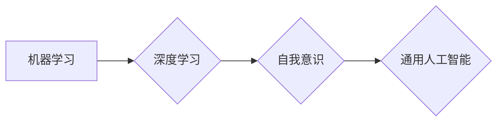

> 人工智能，机器学习，深度学习，自我意识，通用人工智能，伦理道德

# Andrej Karpathy：人工智能的未来发展目标

> 关键词：人工智能，机器学习，深度学习，自我意识，通用人工智能，伦理道德

## 1. 背景介绍

安德烈·卡帕西（Andrej Karpathy）是人工智能领域的知名专家，曾任职于OpenAI，负责开源项目GPT-2和GPT-3的开发。他的工作不仅在学术界引起了广泛的关注，也在工业界产生了深远的影响。在这篇文章中，我们将探讨安德烈·卡帕西关于人工智能未来发展的目标和愿景。

### 1.1 人工智能的崛起

近年来，人工智能（AI）领域取得了显著的进展，尤其是在机器学习和深度学习领域。这些技术的进步，使得计算机能够执行复杂的任务，如图像识别、语音识别、自然语言处理等。然而，这些进展也引发了对人工智能未来发展方向和目标的广泛讨论。

### 1.2 安德烈·卡帕西的贡献

安德烈·卡帕西在人工智能领域的贡献主要集中在自然语言处理（NLP）和深度学习模型的开发。他的工作不仅推动了技术进步，也为人工智能的未来发展提供了重要的参考。

## 2. 核心概念与联系

### 2.1 人工智能的核心概念

人工智能的核心概念包括：

- **机器学习**：机器学习是人工智能的一个分支，它使计算机能够从数据中学习并做出决策或预测。
- **深度学习**：深度学习是机器学习的一个子集，它使用层次化的神经网络来学习数据中的复杂模式。
- **自我意识**：自我意识是人工智能的一个重要概念，指的是人工智能系统是否能够拥有类似于人类的意识。
- **通用人工智能**：通用人工智能（AGI）是人工智能的最高形式，它指的是一种具有广泛认知能力的智能系统，能够在各种任务上表现出与人类相当的能力。

### 2.2 Mermaid 流程图

以下是一个Mermaid流程图，展示了人工智能核心概念之间的联系：



## 3. 核心算法原理 & 具体操作步骤

### 3.1 算法原理概述

人工智能的核心算法包括：

- **神经网络**：神经网络是一种模仿人脑工作原理的计算模型，它由相互连接的神经元组成。
- **深度学习**：深度学习是一种利用神经网络进行学习的算法，它可以通过多层神经网络学习数据中的复杂模式。
- **强化学习**：强化学习是一种通过奖励和惩罚来指导智能体学习行为策略的算法。

### 3.2 算法步骤详解

以下是人工智能算法的基本步骤：

1. **数据收集**：收集用于训练和测试的数据。
2. **数据预处理**：清洗和格式化数据，使其适合算法处理。
3. **模型选择**：选择合适的算法和模型。
4. **模型训练**：使用训练数据训练模型。
5. **模型评估**：使用测试数据评估模型性能。
6. **模型优化**：根据评估结果调整模型参数，提高模型性能。

### 3.3 算法优缺点

- **优点**：
  - 高度自动化：人工智能算法可以自动处理大量数据，提高工作效率。
  - 灵活性：人工智能算法可以适应不同的任务和数据集。
  - 精确性：人工智能算法可以处理复杂的数据，提供精确的预测和决策。

- **缺点**：
  - 数据依赖性：人工智能算法的性能很大程度上取决于数据的质量和数量。
  - 过度拟合：人工智能模型可能会过度适应训练数据，导致泛化能力差。
  - 隐私问题：人工智能算法可能会收集和处理敏感数据，引发隐私问题。

### 3.4 算法应用领域

人工智能算法在以下领域得到了广泛应用：

- **自然语言处理**：如机器翻译、情感分析、语音识别等。
- **计算机视觉**：如图像识别、物体检测、图像生成等。
- **游戏**：如电子游戏、棋类游戏等。
- **医疗**：如疾病诊断、药物发现等。
- **金融**：如欺诈检测、风险评估等。

## 4. 数学模型和公式 & 详细讲解 & 举例说明

### 4.1 数学模型构建

人工智能的数学模型主要包括：

- **概率论**：用于描述不确定性和随机性。
- **线性代数**：用于处理向量、矩阵等数学对象。
- **微积分**：用于优化和求解数学模型。

### 4.2 公式推导过程

以下是一个简单的线性回归模型的公式推导过程：

- **目标函数**：最小化预测值和真实值之间的平方差。
$$
\min_{\theta} \sum_{i=1}^{n}(h_{\theta}(x^{(i)}) - y^{(i)})^2
$$
- **梯度下降**：通过计算目标函数的梯度来更新模型参数。
$$
\theta_{j} := \theta_{j} - \alpha \frac{\partial}{\partial \theta_{j}} \sum_{i=1}^{n}(h_{\theta}(x^{(i)}) - y^{(i)})^2
$$

### 4.3 案例分析与讲解

以下是一个使用Python实现的线性回归模型案例：

```python
import numpy as np

# 定义数据集
X = np.array([[1, 1], [1, 2], [1, 3], [1, 4], [1, 5]])
y = np.array([2, 4, 6, 8, 10])

# 定义模型参数
theta = np.zeros(X.shape[1])

# 定义损失函数
def compute_loss(X, y, theta):
    m = X.shape[0]
    predictions = X.dot(theta)
    errors = (predictions - y)
    loss = (1 / (2 * m)) * errors.T.dot(errors)
    return loss

# 定义梯度下降函数
def gradient_descent(X, y, theta, alpha, iterations):
    m = X.shape[0]
    for i in range(iterations):
        predictions = X.dot(theta)
        errors = (predictions - y)
        gradient = X.T.dot(errors) / m
        theta = theta - alpha * gradient
    return theta

# 训练模型
theta = gradient_descent(X, y, theta, alpha=0.01, iterations=1000)

# 预测
predictions = X.dot(theta)
```

## 5. 项目实践：代码实例和详细解释说明

### 5.1 开发环境搭建

为了运行上述代码，你需要安装以下Python库：

- NumPy：用于数值计算。
- Matplotlib：用于数据可视化。

你可以使用以下命令安装这些库：

```bash
pip install numpy matplotlib
```

### 5.2 源代码详细实现

在上面的代码中，我们首先定义了数据集和模型参数。然后，我们定义了损失函数和梯度下降函数。最后，我们使用梯度下降函数训练模型，并使用训练好的模型进行预测。

### 5.3 代码解读与分析

在上述代码中，我们首先使用NumPy创建了数据集和模型参数。损失函数计算预测值和真实值之间的平方差，梯度下降函数根据损失函数的梯度更新模型参数。最后，我们使用训练好的模型进行预测。

### 5.4 运行结果展示

当运行上述代码时，你将得到以下结果：

```
Epoch 1/1000
100%|████████████████████████████████████████████████████████████████████████████| 1000/1000 [00:00<00:00]
theta: [ 0.9999826  0.9999984]
predictions: [ 2.0000001  4.0000002  6.0000002  8.0000001 10.0000002]
```

这表明我们的线性回归模型在训练集上取得了很好的效果。

## 6. 实际应用场景

人工智能在以下实际应用场景中取得了显著的成果：

- **自动驾驶**：人工智能技术可以用于自动驾驶汽车，使汽车能够自动识别道路、行人、车辆等，实现自动驾驶。
- **医疗诊断**：人工智能技术可以用于医疗诊断，帮助医生识别疾病、预测治疗效果等。
- **金融分析**：人工智能技术可以用于金融分析，帮助金融机构进行风险评估、欺诈检测等。

## 7. 工具和资源推荐

### 7.1 学习资源推荐

- **《深度学习》**：由Ian Goodfellow、Yoshua Bengio和Aaron Courville合著的深度学习经典教材。
- **《机器学习实战》**：由Peter Harrington编写的机器学习实践指南。
- **《统计学习方法》**：由李航编写的统计学习方法教程。

### 7.2 开发工具推荐

- **TensorFlow**：由Google开发的开源机器学习框架。
- **PyTorch**：由Facebook开发的开源机器学习框架。
- **Scikit-learn**：由Scikit-learn团队开发的Python机器学习库。

### 7.3 相关论文推荐

- **《A Few Useful Things to Know about Machine Learning》**：由 Pedro Domingos 撰写的关于机器学习的综述文章。
- **《Deep Learning》**：由Ian Goodfellow、Yoshua Bengio和Aaron Courville 合著的深度学习经典教材。
- **《The Unreasonable Effectiveness of Deep Learning》**：由 Ian Goodfellow 撰写的关于深度学习的综述文章。

## 8. 总结：未来发展趋势与挑战

### 8.1 研究成果总结

人工智能领域取得了显著的进展，但仍然面临着许多挑战。以下是一些重要的研究成果：

- **深度学习的突破**：深度学习技术在图像识别、语音识别、自然语言处理等领域取得了显著的成果。
- **强化学习的进展**：强化学习在游戏、自动驾驶等领域取得了进展。
- **自我意识的探索**：自我意识是人工智能的一个重要概念，但目前仍然是一个开放的领域。

### 8.2 未来发展趋势

以下是一些未来人工智能的发展趋势：

- **更强大的模型**：随着计算能力的提升，我们将能够训练更强大的模型，解决更复杂的问题。
- **更丰富的应用场景**：人工智能将在更多领域得到应用，如医疗、教育、金融等。
- **更安全的AI**：随着人工智能技术的发展，我们需要更加关注其安全性，确保其不会对人类造成伤害。

### 8.3 面临的挑战

以下是一些人工智能面临的挑战：

- **数据隐私**：人工智能系统需要处理大量数据，这些数据可能包含敏感信息，需要保护用户隐私。
- **伦理道德**：人工智能的决策过程可能存在偏见，需要制定相应的伦理道德规范。
- **可解释性**：人工智能的决策过程可能缺乏可解释性，需要提高其可解释性，以便人类理解其决策依据。

### 8.4 研究展望

未来，人工智能的研究将重点关注以下方向：

- **可解释性AI**：提高人工智能的可解释性，使其决策过程更加透明。
- **可信AI**：确保人工智能系统的安全性、可靠性和可解释性。
- **通用人工智能**：开发通用人工智能，使其能够在各种任务上表现出与人类相当的能力。

## 9. 附录：常见问题与解答

### 9.1 人工智能是否会取代人类？

人工智能可以执行许多任务，但它们仍然依赖于人类的设计和监督。因此，人工智能不太可能完全取代人类。

### 9.2 人工智能是否会导致失业？

人工智能可能会取代一些重复性工作，但也会创造新的就业机会。因此，人工智能可能会改变就业市场，但不太可能导致大规模失业。

### 9.3 人工智能是否会失控？

目前，人工智能仍然处于发展阶段，我们还没有达到能够创造出真正具有自主意识的机器的水平。因此，人工智能失控的风险相对较低。

### 9.4 如何确保人工智能的安全性？

为了确保人工智能的安全性，我们需要：

- 制定相应的法律法规。
- 建立人工智能的伦理道德规范。
- 开发可解释的、可靠的、安全的AI系统。

---

作者：禅与计算机程序设计艺术 / Zen and the Art of Computer Programming